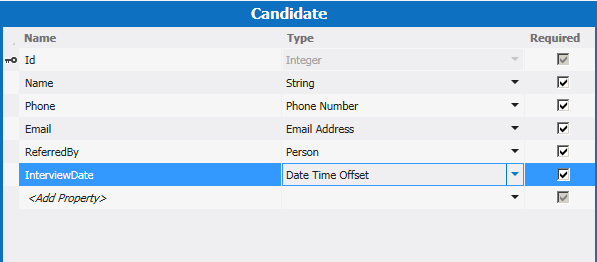

# Criar um suplemento de negócios nuvem com um News feed social
Usando o modelo de **suplemento de negócios de nuvem** no Visual Studio, você pode criar SharePoint suplementos no qual os usuários podem exibir, adicionar e atualizar os dados do SharePoint. O tipo de projeto de **suplemento de nuvem comercial** usa o Visual Studio LightSwitch tecnologias, qual simplificam consideravelmente o processo de criação de negócios suplemento hospedado no SharePoint. Este passo a passo, você criará um suplemento para acompanhar candidatos de trabalho, como aproveitar o SharePoint para o recurso de integração social do Office 365 para fornecer um News feed para o suplemento.Você pode baixar o aplicativo de exemplo completo na Galeria de códigos do MSDN: Criando um suplemento de nuvem comercial com um News feed Socialhttp://code.msdn.microsoft.com/Creating-a-Cloud-Business-8540c0c9 de  []()
## Pré-requisitos

Este passo a passo requer o Visual Studio 2013.
  
    
    
Para hospedar o suplemento, você precisará também um site do desenvolvedor do SharePoint no Office 365, que você pode ser obtido o  [Inscreva-se para um Site do desenvolvedor do Office 365](http://go.microsoft.com/fwlink/?LinkId=263490)ou um site do SharePoint 2013.
  
    
    

## Criar um projeto de suplemento do comercial nuvem
<a name="bk_create"> </a>

Para criar um suplemento de negócios de nuvem, você deve começar com o modelo de projeto **do suplemento do Business Cloud** no Visual Studio.
  
    
    

### Para criar o projeto


1. Na barra de menus, escolha **arquivo**, **novo** **projeto**.
    
    Abre a caixa de diálogo **Novo projeto**.
    
  
2. Na lista de modelos, expanda o nó do **Visual Basic** ou **Visual c#**, expanda o nó **Office/SharePoint**, escolha o nó de **suplementos** e escolha **o suplemento de nuvem comercial**, conforme mostrado na Figura 1.
    
   **Figura 1. Adicionar o projeto**

  

     
  

  

  
3. Na caixa de texto **nome**, digite CandidateTrackere escolha o botão **OK**.
    
    O Assistente de **suplemento novos negócios de nuvem** abre.
    
  
4. No Assistente de **suplemento novos negócios de nuvem**, insira a URL do seu site do desenvolvedor do Office 365 e, em seguida, escolha o botão **Concluir**.
    
    A URL deve levar o formulário https://  _MySite_.sharepoint.com/sites/Developer/.
    
    Uma solução de **CandidateTracker** é adicionada ao Solution Explorer com quatro projetos: um projeto de **CandidateTracker** de nível superior, um projeto **CandidateTracker.HTMLClient**, um projeto de **CandidateTracker.Server** e um projeto **CandidateTracker.SharePoint**.
    
  

## Adicionar dados e telas
<a name="bk_add"> </a>

O suplemento de tracker candidato precisa de uma tabela de banco de dados, que você criará no project **Server** e telas para exibir, adicionar e atualizar os dados, o qual você vai criar no projeto **HTMLClient**.
  
    
    

### Para adicionar a tabela de banco de dados


1. No **Solution Explorer**, abra o menu de atalho para o nó **CandidateTracker.Server** e escolha **Adicionar tabela**.
    
    O designer de entidade abre.
    
  
2. Na janela **Propriedades**, na caixa de texto para a propriedade **Name**, insira o candidato.
    
  
3. No designer de entidade, escolha o link **< adicionar propriedade >** e insira onome.
    
  
4. Escolha a tecla Enter , aceite o padrão de **tipo**, **String**, e deixar a caixa de seleção **necessárias** verificado.
    
  
5. Escolha o link **< adicionar propriedade >** e insira otelefonee, em seguida, escolha a tecla **Tab**.
    
  
6. Na coluna **tipo**, escolha o **Número de telefone** e, em seguida, escolha a teclaTab duas vezes.
    
    **Número de telefone** é umtipo de negócios personalizado que formata automaticamente e fornece validação para números de telefone.
    
  
7. Na próxima linha, digite o Email para o **nome** e escolha como o **tipo** de **Endereço de Email**.
    
    **Endereço de email** é outro tipo de negócios personalizado que fornece validação para endereços de email.
    
  
8. Na próxima linha, digite ReferredBy para o **nome** e escolha **pessoa** como o **tipo**.
    
    O tipo de negócios **pessoa** fornece uma conexão com o serviço de perfil de usuário do SharePoint, que extrai informações do usuário do Active Directory.
    
  
9. Na próxima linha, digite InterviewDate para o **nome** e escolha a **Data tempo deslocamento** como o **tipo**.
    
    O tipo de business **Data tempo deslocamento** armazena a data e hora no formato UTC, permitindo que os usuários em fusos horários diferentes para ver a hora correta.
    
    A Figura 2 mostra a entidade concluída.
    

   **Figura 2. A entidade de candidatos**

  

     
  

  

  

### Para criar a tela procurar


1. No designer de entidade, na barra de ferramentas **perspectiva**, escolha a guia **Cliente de HTML** e escolha **tela** na barra de ferramentas.
    
    Abre a caixa de diálogo **Adicionar nova tela**.
    
  
2. Na caixa de diálogo **Adicionar nova tela**, na lista **Selecione um modelo de tela**, escolha **Procurar tela de dados**.
    
  
3. Na lista de **Dados da tela**, escolha **candidatos** e escolha o botão **OK**.
    
    Abre o designer de tela, com uma representação da entidade de dados no painel esquerdo e uma representação do layout da tela no painel direito.
    
  
4. No painel à direita do Editor de tela, escolha a lista de**| Candidatos** nó, em seguida, expanda a lista de **lista** e escolha **tabela**, conforme mostrado na Figura 3.
    
   **Figura 3. O controle de tabela**

  

     
  

    Isso exibirá as informações do **candidato** em um formato tabular em vez do formato de lista padrão.
    
    Observe que, além dos campos que você definiu para a tabela, há quatro campos mais: criado por, criado, modificado por e modificados. Esses campos criaram uma trilha de auditoria será exibida quando um item foi adicionado ou atualizada pela última vez e por quem.
    
  

### Para criar a tela Adicionar


1. No designer de tela, abra o menu de atalho para o nó da **Barra de comandos** e escolha o **Botão Adicionar**.
    
  
2. Na caixa de diálogo **Adicionar botão**, expanda a lista **showTab** e escolha **addAndEditNew**, conforme mostrado na Figura 4 e escolha o botão **OK**.
    
   **Figura 4. A caixa de diálogo Adicionar botão**

  

     
  

    Abre a caixa de diálogo **Adicionar nova tela**.
    
  
3. Na caixa de diálogo **Adicionar nova tela**, aceite os valores padrão e escolha o botão **OK**.
    
  
É aberta uma nova janela de designer de tela.
  
    
    

### Para criar a tela Editar


1. Escolha a guia de designer **BrowseCandidates.lsml** e no designer de tela, escolha a tabela de**| Candidatos** nó.
    
  
2. Na janela **Propriedades**, escolha o link de **Toque do Item**, conforme mostrado na Figura 5.
    
   **Figura 5. O link de toque de Item**

  

     
  

    Abre a caixa de diálogo **Editar Item toque em ação**.
    
  
3. Na caixa de diálogo **Editar Item toque em ação**, expanda a lista **showTab** e escolha **editSelected**, conforme mostrado na Figura 6 e escolha o botão **OK**.
    
   **Figura 6. A caixa de diálogo Editar Item toque em ação**

  

     
  

  

  

### Para testar o suplemento


1. Na barra de menus, escolha **Depurar**, **Iniciar depuração**.
    
    Na primeira vez que você executar um suplemento do SharePoint no seu computador, você será solicitado para instalar um certificado de Localhost porque suplementos de negócios de nuvem sempre usam SSL (Secure Sockets Layer). Se você aceitar esse certificado, um aviso de segurança não aparecerá toda vez que iniciar o add-in. Porque o certificado só se aplica a Localhost, seu sistema não faces nenhuma ameaça.
    
  
2. Na caixa de diálogo **Alerta de segurança**, escolha o botão **Sim**.
    
  
3. Se aparecer uma caixa de diálogo de **Aviso de segurança**, escolha o botão **Sim**.
    
    Navegador da web é exibida.
    
  
4. Na página **entrar**, escolha o botão **Entrar**.
    
  
5. Digite sua senha e escolha o botão **Entrar**.
    
  
6. Se solicitado, escolha o botão **De confiança**.
    
  
7. Na tela **Candidatos procurar**, escolha o botão de **Candidato a adicionar**.
    
    A tela **Adicionar candidato** abre.
    
  
8. Na tela **Adicionar candidato**, insira um nome, número de telefone e endereço de email.
    
  
9. Escolha o campo **Referida por** e insira os três primeiros caracteres do nome do seu próprio.
    
    Seu nome completo deve aparecer na lista. Se seu site estiver conectado ao Active Directory, você deverá ver uma lista de todos os usuários cujo nome começa com os mesmos três caracteres.
    
  
10. Opcionalmente, altere a data de **Entrevista data** e hora e escolha o botão **Salvar** para retornar à tela de **Navegar candidatos**.
    
    O candidato que você adicionou é exibido; Se você escolher a linha a tela de **Adicionar candidatos Editar** abre. Observe que alguns dos campos herdarem comportamentos especiais de seus tipos de negócios personalizado. Escolha o campo de **telefone** para discar o número, escolha o campo de **Email** para enviar um email ou passe o mouse sobre o campo **Criado por** ver suas informações de contato.
    
  
11. Feche a janela do navegador para interromper o suplemento sejam executados.
    
  

## Adicionar um News feed
<a name="bk_feed"> </a>

Um dos recursos do SharePoint para o Office 365 é a capacidade de adicionar news feeds, permitindo que os usuários rastrear atividades em uma lista e adicione seus comentários. Suplementos de negócios de nuvem facilitam criar um News feed para seu suplemento.
  
    
    

### Para habilitar a integração social


1. Escolha a guia de designer **Candidates.lsml** e, em seguida, na barra de ferramentas **perspectiva**, escolha a guia **servidor**.
    
  
2. Na janela **Propriedades**, selecione as caixas de seleção **postar quando atualizado** conforme mostrado na Figura 7 e **postar quando criado**.
    
   **Figura 7. Propriedades sociais**

  

     
  

  

  
3. Escolha o link **Escolher postar gatilhos**.
    
    A caixa de diálogo **Choose postar gatilhos** é exibida.
    
  
4. Na caixa de diálogo **Choose postar gatilhos**, desmarque a caixa de seleção de **Todos os campos**, marque a caixa de seleção de **Data de entrevista** e escolha o botão **OK**.
    
  

### Para testar o suplemento


1. Na barra de menus, escolha **Depurar**, **Iniciar depuração**.
    
  
2. Na tela **Candidatos procurar**, escolha o candidato que você criou anteriormente.
    
  
3. Na tela do **Candidato de editar adicionar**, alterar a **Data de entrevista** e escolha o botão **Salvar**.
    
  
4. Escolha o botão **Candidato a adicionar** e adicione outro candidato.
    
  
5. Na tela **Candidatos procurar**, na barra de cromo do SharePoint, escolha o link do **news feed**.
    
    O **Candidato Tracker Newsfeed** é aberto em uma nova janela de navegador com duas entradas para os candidatos adicionados e atualizados. Você pode escolher no link **como** uma postagem ou você pode escolher o link de **resposta** para adicionar um comentário.
    
  
6. Feche as duas janelas do navegador para interromper o suplemento sejam executados.
    
  

## Adicionar validação
<a name="bk_validate"> </a>

Em muitos negócios suplementos que você vai querer restringir o acesso a algumas funcionalidades, por exemplo, apenas permitindo que um gerente alterar a data de entrevista. Suplementos de negócios de nuvem permitem que você faça isso escrevendo lógica de validação; Nesse caso, você irá escrever código para determinar se o usuário atual é membro de um grupo de segurança de diretório ativo específico.
  
    
    

### Para adicionar validação


1. Escolha a guia de designer **Candidates.lsml** e, em seguida, na barra de ferramentas **perspectiva**, escolha a guia **servidor**.
    
  
2. Na barra de ferramentas, expanda a lista de **Escrever código** e escolha o método **Candidates_Validate**.
    
    O Editor de código abre.
    
  
3. No Editor de código, adicione o código a seguir para o método **Candidates_Validate**:
    
  ```VB.net
  
If Not Application.User.Department = "Hiring Managers" Then
                results.AddEntityError("Permission denied")
            End If
  ```


  ```cs
  
if (!(Application.User.Department == "Hiring Managers")) {
results.AddEntityError("Permission denied");
}
  ```


    O método **Validate** é executado quando um usuário tentar salvar um registro. Se o usuário é membro do grupo de segurança gerentes de contratação, o registro é salvo, caso contrário, será exibida uma mensagem de erro "Permission denied" e o registro é desconsiderado.
    
  
Nesse momento se você executar o suplemento e adicionar um novo candidato, você provavelmente verá a mensagem de erro, a menos que você é um membro de um título real grupo gerentes de contratação de nome. Substitua "Contratar gerentes" com o nome de um grupo de segurança para o qual você pertence e tente novamente. Agora, você deve ter permissão para adicionar um candidato.
  
    
    

## Próximas etapas
<a name="bk_validate"> </a>

Parabéns! Você criou o primeiro nuvem comercial add-in. Se este foi um suplemento que você deseja compartilhar com usuários, seu próximo passo seria publicar o add-in. Consulte  [como: publicar uma nuvem suplemento de negócios para o Office 365](http://msdn.microsoft.com/en-us/library/vstudio/dn454601.aspx) ou [publicar os suplementos do SharePoint](http://msdn.microsoft.com/en-us/library/office/apps/jj164070.aspx).
  
    
    
Obviamente, isso é apenas um exemplo simples; Há muito mais que você pode fazer para criar repleto suplementos. Desde que o modelo de suplemento de nuvem comercial se baseia em tecnologias LightSwitch, convém explorar a documentação LightSwitch para fazer algumas ideias. Consulte  [LightSwitch SharePoint complementos](http://msdn.microsoft.com/en-us/library/vstudio/jj969620.aspx).
  
    
    

## Recursos adicionais
<a name="bk_addresources"> </a>


-  [Criar suplementos de negócios de nuvem](create-cloud-business-add-ins.md)
    
  

