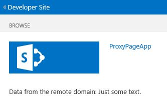

# Criar uma página personalizada de proxy para a biblioteca entre domínios no SharePoint 2013
Saiba como criar uma página personalizada de proxy para acessar dados em um serviço remoto de uma página da Web do SharePoint usando a biblioteca de domínio cruzado no SharePoint.
Quando você estiver criando Suplementos do SharePoint, geralmente você precisa incorporar dados de várias fontes. No entanto, por motivos de segurança, existem mecanismos de bloqueio que impedem a comunicação com mais de um domínio ao mesmo tempo.
  
    
    

Você pode usar a biblioteca entre domínios para acessar dados em seu suplemento remoto se você fornecer uma página de proxy personalizado que é hospedada na infraestrutura de suplemento remota. Como o desenvolvedor, você é responsável por Implementando a página proxy personalizado e ter que lidar com lógica personalizada, como o mecanismo de autenticação para o suplemento remoto usam a biblioteca entre domínios com uma página personalizada de proxy, se quiser que a comunicação ocorra no nível do cliente.
## Pré-requisitos para uso dos exemplos neste artigo
<a name="SP15Createcustomproxypage_Prereq"> </a>

Você precisa de um ambiente de desenvolvimento conforme explicado em  [Introdução à criação de suplementos do SharePoint hospedados pelo provedor](get-started-creating-provider-hosted-sharepoint-add-ins.md).
  
    
    

### Principais conceitos saber antes de usar uma página personalizada proxy com Suplementos do SharePoint

A tabela a seguir lista alguns artigos úteis que podem ajudá-lo a entender os conceitos envolvidos em um cenário entre domínios para Suplementos do SharePoint.
  
    
    

**Tabela 1. Principais conceitos para usar uma página personalizada de proxy**


|**Título do artigo**|**Description**|
|:-----|:-----|
| [Suplementos do SharePoint](sharepoint-add-ins.md) <br/> |Saiba mais sobre o novo modelo suplemento em SharePoint que permite que você crie suplementos, que são pequenas e fácil de usar soluções para usuários finais. <br/> |
| [Seguro cliente e o acesso a dados modelos de objeto para o SharePoint Add-ins](secure-data-access-and-client-object-models-for-sharepoint-add-ins.md) <br/> |Saiba mais sobre dados opções do access no Suplementos do SharePoint. Este tópico fornece orientação sobre as alternativas de alto nível que você tem à sua escolha ao trabalhar com dados em seu suplemento. <br/> |
| [Host webs, suplemento webs e componentes do SharePoint no SharePoint 2013](host-webs-add-in-webs-and-sharepoint-components-in-sharepoint-2013.md) <br/> |Saiba mais sobre a diferença entre webs de host e o suplemento webs. Descubra quais componentes SharePoint podem ser incluídos em um Suplemento do SharePoint, quais componentes são implantados na Web de host, quais componentes são implantados na Web de suplemento e como o suplemento web é implantada em um domínio isolado. <br/> |
| [Segurança de domínio cruzado do lado do cliente](http://msdn.microsoft.com/en-us/library/cc709423%28v=vs.85%29.aspx) <br/> |Explore as ameaças entre domínios e casos de uso e princípios de segurança para solicitações entre origens e avaliar os riscos para desenvolvedores aprimorar o acesso entre domínios de aplicativos web que são executados no navegador. <br/> |
   

## Exemplo de código: acessar dados remotos usando uma página personalizada de proxy para a biblioteca entre domínios
<a name="SP15Createcustomproxypage_Codeexample"> </a>

Para ler dados de serviço remoto, você deve fazer o seguinte:
  
    
    

1. Crie um projeto Suplemento do SharePoint.
    
  
2. Modifica o manifesto do suplemento para permitir comunicação remota add-in.
    
  
3. Crie a página de proxy personalizada e uma página de conteúdo no projeto da web.
    
  
4. Crie uma página que usa a biblioteca entre domínios no projeto Suplemento do SharePoint.
    
  

### Para criar o projeto Add-in do SharePoint


1. Abra Visual Studio como administrador. (Para fazer isso, clique com botão direito no ícone Visual Studio no menu **Iniciar** e escolha **Executar como administrador** ).
    
  
2. Crie o hospedado em provedor Suplemento do SharePoint conforme explicado em  [Introdução à criação de suplementos do SharePoint hospedados pelo provedor](get-started-creating-provider-hosted-sharepoint-add-ins.md) e nomeie-oProxyPageApp.
    
  

### Para editar o arquivo de manifesto suplemento


1. No **Solution Explorer**, clique com botão direito do arquivo **AppManifest.xml** e escolha **Exibir código**.
    
  
2. Substitua o elemento inteiro **AppPrincipal** com os seguintes itens.
    
  ```XML
  
<AppPrincipal>
    <Internal AllowedRemoteHostUrl="~remoteAppUrl"/>
</AppPrincipal>
  ```


    > **OBSERVAçãO**
      > O atributo **AllowedRemoteHostUrl** é usado para especificar o domínio remoto. O **~remoteAppUrl** resolve para a URL do suplemento remota. Para obter mais informações sobre tokens, consulte [Explore a estrutura de manifesto de aplicativo e o pacote de um SharePoint Add-in](explore-the-app-manifest-structure-and-the-package-of-a-sharepoint-add-in.md).

### Para criar uma página personalizada de proxy


1. Depois que a solução Visual Studio tiver sido criada, clique com botão direito do projeto de aplicativo da web (não o projeto Suplemento do SharePoint ) e adicione um novo formulário da Web, escolhendo **Adicionar** > **Novo Item** > **Web** > **Web Form**. Nome do formulário Proxy.aspx.
    
  
2. No arquivo Proxy.aspx, substitua o elemento html inteira e ele tem filhos com o seguinte código HTML. Deixe todas as marcações acima do elemento html como está. O código HTML contém marcação e JavaScript que executa as seguintes tarefas:
    
  - Fornece um espaço reservado para o arquivo de JavaScript biblioteca entre domínios.
    
  
  - Extrai a URL do suplemento de web da referenciadora.
    
  
  - Dinamicamente carrega o arquivo de JavaScript de biblioteca de domínio cruzado ao espaço reservado.
    
  
  - Fornece configurações para o objeto **RequestExecutorMessageProcessor**.
    
  
  - Inicializa o objeto **RequestExecutorMessageProcessor**.
    
  

  ```HTML
  
<html xmlns="http://www.w3.org/1999/xhtml">
<head runat="server">
    <meta http-equiv="X-UA-Compatible" content="IE=8" /> 
    <title>Custom Proxy Host Page</title>
    <script 
        src="http://ajax.aspnetcdn.com/ajax/4.0/1/MicrosoftAjax.js" 
        type="text/javascript">
    </script>
    <script 
        type="text/javascript" 
        src="http://ajax.aspnetcdn.com/ajax/jQuery/jquery-1.7.2.min.js">
    </script>

    <!-- Script to load the cross-domain library js file -->
    <script type="text/javascript">
        var hostweburl;

        $(document).ready(function(){
            //Get the URI decoded host web URL.
            hostweburl =
                decodeURIComponent(
                    getQueryStringParameter("SPHostUrl")
            );

            // The cross-domain js file is in a URL in the form:
            // host_web_url/_layouts/15/SP.RequestExecutor.js
            var scriptbase = hostweburl + "/_layouts/15/";

            // Load the js file 
            $.getScript(scriptbase + "SP.RequestExecutor.js", initCustomProxy);
        });

        //Function to initialize the custom proxy page
        //  must set the appropriate settings and implement
        //  proper authentication mechanism
        function initCustomProxy() {
            var settings =
            {
                originAuthorityValidator: function (messageOriginAuthority) {
                    // This page must implement the authentication for the
                    //   remote add-in.
                       // You should validate if messageOriginAuthority is
                       //  an approved domain to receive calls from.
                    return true;
                }
            };
            SP.RequestExecutorMessageProcessor.init(settings);
        }

        // Function to retrieve a query string value.
        // For production purposes you may want to use
        //  a library to handle the query string.
        function getQueryStringParameter(paramToRetrieve) {
            var params =
                document.URL.split("?")[1].split("&amp;");
            var strParams = "";
            for (var i = 0; i < params.length; i = i + 1) {
                var singleParam = params[i].split("=");
                if (singleParam[0] == paramToRetrieve)
                    return singleParam[1];
            }
        }
    </script>
</head>
<body>
    
</body>
</html>


  ```


    > **IMPORTANTE**
      > Em um de produção Suplemento do SharePoint, você deve fornecer a lógica de autorização e retornar o valor apropriado no objeto **originAuthorityValidator** nas configurações.

### Para criar uma página de conteúdo


1. Com o botão direito do projeto de aplicativo web no **Solution Explorer** e adicione um novo formulário da Web, escolhendo **Adicionar** > **Novo Item** > **Web** > **Web Form**. Nome do formulário Content.aspx..
    
  
2. Copie o código a seguir e cole-o no método **Page_Load** no arquivo code-behind. O código executa as seguintes tarefas:
    
  - Define a saída **content-type** como **text/plain**.
    
  
  - Grava o conteúdo do buffer de saída.
    
  
  - Finaliza a conexão.
    
  

  ```cs
  
string content;
content = "Just some text.";
Response.ContentType="text/plain";
Response.Write(content);
Response.End();

  ```


### Para criar uma página da Web do SharePoint que usa a biblioteca entre domínios


1. O projeto Suplemento do SharePoint do mouse em e escolha **Adicionar** > **Novo Item** > **Office/SharePoint** > **módulo**.
    
  
2. Nomeie o módulo de páginase escolha **Adicionar**.
    
  
3. Com o botão direito na pasta de **páginas** e escolha **Adicionar** > **Novo Item** > **Office/SharePoint** > **página**.
    
  
4. Nomeie a página Home. aspx e escolha **Adicionar**.
    
  
5. Abra a página **aspx** se ele não é aberto automaticamente.
    
  
6. Copie o código a seguir e cole-o na marca **PlaceHolderMain** conteúdo.
    
  ```
  
<!-- The page dynamically loads the cross-domain library's
    js file, rescript acts as the placeholder. -->
<script 
    type="text/javascript"
    id="rescript"
    src="../_layouts/15/SP.RequestExecutor.js">
</script>
    Data from the remote domain: <span id="TextData"></span>

    <!-- Main script to retrieve the host web's title -->
    <script type="text/javascript">
    (function () {
        var executor;
        var hostweburl;
        var remotedomain;

        remotedomain = "<your_remote_add-in_domain>";

        //Get the URI decoded host web URL.
        hostweburl =
            decodeURIComponent(
                getQueryStringParameter("SPHostUrl")
        );

        // Initialize the RequestExecutor with the custom proxy URL.
        executor = new SP.RequestExecutor(remotedomain);
        executor.iFrameSourceUrl = "Proxy.aspx?SPHostUrl=" + hostweburl;

        // Issue the call against the remote endpoint.
        // The response formats the data in plain text.
        // The functions successHandler and errorHandler attend the
        //      sucess and error events respectively.
        executor.executeAsync(
            {
                url:
                    remotedomain + "Content.aspx",
                method: "GET",
                headers: { "Accept": "text/plain" },
                success: successHandler,
                error: errorHandler
            }
        );
    })();

    // Function to handle the success event.
    // Prints the data to the placeholder.
    function successHandler(data) {
        document.getElementById("TextData").innerText =
            data.body;
    }

    // Function to handle the error event.
    // Prints the error message to the page.
    function errorHandler(data, errorCode, errorMessage) {
        document.getElementById("TextData").innerText =
            "Could not complete cross-domain call: " + errorMessage;
    }

    // Function to retrieve a query string value.
    // For production purposes you may want to use
    //  a library to handle the query string.
    function getQueryStringParameter(paramToRetrieve) {
        var params =
            document.URL.split("?")[1].split("&amp;");
        var strParams = "";
        for (var i = 0; i < params.length; i = i + 1) {
            var singleParam = params[i].split("=");
            if (singleParam[0] == paramToRetrieve)
                return singleParam[1];
        }
    }
    </script>

  ```

7. No código precedente colado, localize a linha  `remotedomain = "<your_remote_add-in_domain>";`e substitua o espaço reservado  _<your_remote_add-in_domain>_ pela URL "localhost" que seu aplicativo web usa quando você estiver executando o suplemento com F5 no Visual Studio. Para localizar esse valor, selecione o projeto de aplicativo da web no **Solution Explorer**. A propriedade **URL** será no painel **Propriedades**. Use o valor inteiro, incluindo o protocolo, a porta e a barra de fechamento; Por exemplo, "http://localhost:45072".
    
  
8. Salve e feche o arquivo.
    
  
9. Abra o arquivo appmanifest.xml e defina o valor de **página inicial** para **ProxyPageApp/Pages/Home.aspx**.
    
  

### Para criar e executar a solução


1. Certifique-se de que o projeto Suplemento do SharePoint é definido como o projeto de inicialização.
    
  
2. Pressione a tecla F5.
    
    > **OBSERVAçãO**
      > Quando você pressiona F5, Visual Studio aproveita a solução, implanta o suplemento e abre a página de permissões para o suplemento.
3. Escolha o botão **De confiança**.
    
    Abrirá a Home page e deve se parecer com o seguinte. Pode levar alguns segundos para a frase "Apenas alguns text" seja exibido porque ele está sendo buscado da página de Content.aspx do domínio remoto.
    

   **Dados do serviço remoto em uma página da Web do SharePoint**

  

     
  

  

  

**Tabela 2. A solução de problemas**


|**Problema**|**Solução**|
|:-----|:-----|
|Visual Studio não abra o navegador depois que você pressionar a tecla F5. <br/> |Defina o projeto de Suplemento do SharePoint como o projeto de inicialização. <br/> |
|Exceção não tratada **SP é indefinido**. <br/> |Certifique-se de que você pode acessar o SP. RequestExecutor.js o arquivo em uma janela do navegador. <br/> |
   

## Próximas etapas
<a name="SP15Createcustomproxypage_Nextsteps"> </a>

Este artigo demonstrado como acessar dados remotos usando uma página personalizada de proxy para a biblioteca entre domínios em SharePoint. Como próxima etapa, você pode aprender sobre outros dados disponíveis no Suplementos do SharePoint de opções do access. Para saber mais, consulte o seguinte:
  
    
    

-  [Amostra de código: obter dados usando uma página de proxy para a biblioteca de domínio cruzado](http://code.msdn.microsoft.com/SharePoint-2013-Get-data-10039ff1)
    
  
-  [Acessar dados do SharePoint 2013 de suplementos usando a biblioteca de domínio cruzado](access-sharepoint-2013-data-from-add-ins-using-the-cross-domain-library.md)
    
  
-  [Consulta um serviço remoto usando o proxy da web no SharePoint 2013](query-a-remote-service-using-the-web-proxy-in-sharepoint-2013.md)
    
  

## Recursos adicionais
<a name="SP15Createcustomproxypage_Addresources"> </a>


-  [Configurar um ambiente de desenvolvimento local para suplementos do SharePoint](set-up-an-on-premises-development-environment-for-sharepoint-add-ins.md)
    
  
-  [Trabalhar com dados externos do SharePoint 2013](work-with-external-data-in-sharepoint-2013.md)
    
  
-  [Seguro cliente e o acesso a dados modelos de objeto para o SharePoint Add-ins](secure-data-access-and-client-object-models-for-sharepoint-add-ins.md)
    
  
-  [Autorização e autenticação do SharePoint Add-ins](authorization-and-authentication-of-sharepoint-add-ins.md)
    
  
-  [Usar operações de consulta de OData em solicitações REST do SharePoint](use-odata-query-operations-in-sharepoint-rest-requests.md)
    
  
-  [Três maneiras de pensar sobre opções de design para o SharePoint Add-ins](three-ways-to-think-about-design-options-for-sharepoint-add-ins.md)
    
  
-  [Aspectos importantes do Add-in SharePoint arquitetura e desenvolvimento cenário](important-aspects-of-the-sharepoint-add-in-architecture-and-development-landscap.md)
    
  
-  [Armazenamento de dados no SharePoint Add-ins](important-aspects-of-the-sharepoint-add-in-architecture-and-development-landscap.md#Data)
    
  

