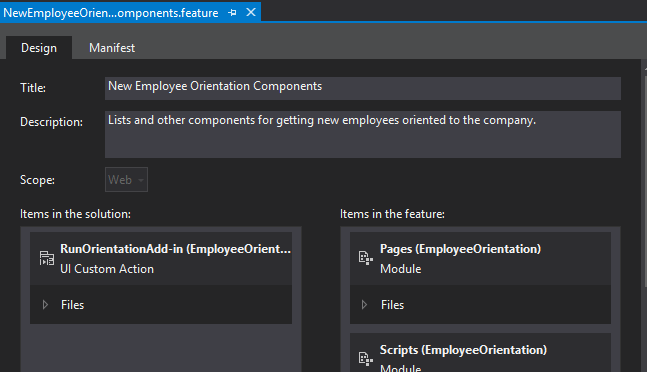
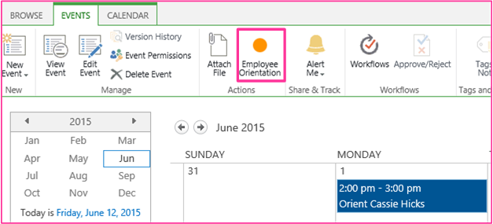

# Create a custom ribbon button in the host web of a SharePoint Add-in
Add custom ribbon button commands to the host web of a Suplemento do SharePoint.
This is the ninth in a series of articles about the basics of developing SharePoint-hosted Suplementos do SharePoint. You should first be familiar with  [Suplementos do SharePoint](sharepoint-add-ins.md) and the previous articles in this series:
  
    
    

-  [Introdução à criação de Suplementos do SharePoint hospedados no SharePoint](get-started-creating-sharepoint-hosted-sharepoint-add-ins.md)
    
  
-  [Implantar e instalar um hospedado no SharePoint SharePoint Add-in](deploy-and-install-a-sharepoint-hosted-sharepoint-add-in.md)
    
  
-  [Adicionar colunas personalizadas para um suplemento do SharePoint-hostedSharePoint](add-custom-columns-to-a-sharepoint-hostedsharepoint-add-in.md)
    
  
-  [Adicionar um tipo de conteúdo personalizado a um suplemento do SharePoint-hostedSharePoint](add-a-custom-content-type-to-a-sharepoint-hostedsharepoint-add-in.md)
    
  
-  [Adicionar uma Web Part a uma página em um SharePoint hospedado SharePoint Add-in](add-a-web-part-to-a-page-in-a-sharepoint-hosted-sharepoint-add-in.md)
    
  
-  [Adicionar um fluxo de trabalho para um hospedado no SharePoint SharePoint Add-in](add-a-workflow-to-a-sharepoint-hosted-sharepoint-add-in.md)
    
  
-  [Adicionar uma página personalizada e um estilo a um hospedado no SharePoint SharePoint Add-in](add-a-custom-page-and-style-to-a-sharepoint-hosted-sharepoint-add-in.md)
    
  
-  [Adicionar processamento personalizado de cliente para um hospedado no SharePoint SharePoint Add-in](add-custom-client-side-rendering-to-a-sharepoint-hosted-sharepoint-add-in.md)
    
  

> [!OBSERVAçãO]
> If you have been working through this series about SharePoint-hosted add-ins, then you have a Visual Studio solution that you can use to continue with this topic. You can also download the repository at  [SharePoint_SP-hosted_Add-Ins_Tutorials](https://github.com/OfficeDev/SharePoint_SP-hosted_Add-Ins_Tutorials) and open the BeforeRibbon.sln file.
  
    
    

All Suplementos do SharePoint can be run from the **Site Contents** page of the host web by clicking the add-in's tile. The functionality of a Suplemento do SharePoint can also be exposed on the host web through custom actions, which are custom ribbon buttons or custom menu items. In this article you add a button to the ribbon on a host web.
## Prepare the host web

You will add the button to the ribbon of a calendar on the host web. Take the following steps in the UI of your SharePoint developer site.
  
    
    

1. From the home page of the site, choose **Site Contents** > **add and add-in** > **Calendar**.
    
  
2. On the **Adding Calendar** dialog, typeEmployee Orientation Schedule for the **Name**, and then choose **Create**.
    
  
3. When the calendar opens, put the cursor on any date until the **Add** link appears on the date, and then click **Add**. 
    
  
4. On the **Employee Orientation Schedule - New Item** dialog, typeOrient Cassi Hicks for the **Title**. Leave the other fields at their defaults and click **Save**.
    
    The calendar should look similar to the following:
    

   **Custom calendar**

  

     
  

  

  

  
    
    

> [!IMPORTANTE]
> The next procedure requires that the calendar be visible in the UI of Visual Studio, but it won't be if If Visual Studio was open when you created the calendar. Before you continue, close Visual Studio and also log out of any browser windows and PowerShell consoles where you are logged into your developer site. 
  
    
    

## Add a ribbon custom action

1. In **Solution Explorer**, right-click the **EmployeeOrientation** project, and choose **Add** > **New Item** > **Office/SharePoint** > **Ribbon Custom Action**. Name it RunOrientationAdd-in, and then choose **Add**.
    
  
2. The **Create Custom Action for Ribbon** wizard asks you a series of questions. Give the answers from the following table:
    

|**Property question**|**Answer**|
|:-----|:-----|
|Where do you want to expose the custom action?    |Choose **Host Web**.    |
|Where is the custom action scoped to?    |Choose **List Instance** ( *not*  List Template).   |
|Which particular item is the custom action scoped to?    |Choose **Employee Orientation Schedule**.    |
|Where is the control located?    |Do not use the drop down selections. Instead, type **Ribbon.Calendar.Events.Actions.Controls._children**. (The third part, **Events**, identifies the tab of the ribbon, and the fourth part, **Actions**, identifies the button group.)    |
|What is the text on the menu item?    |Type **Employee Orientation**.    |
|Where does the custom action navigate to?    |Do not use the drop down selections. Instead, type **~appWebUrl/Lists/NewEmployeesInSeattle**. This is the list view page for the list, which is on the add-in web, so the ribbon button on the host web opens a page on the add-in web.    |
   
3. Choose **Finish**. 
    
  

## Inspect the add-in web Feature

In **Solution Explorer**, expand the **Features** folder and choose the **NewEmployeeOrientationComponents** feature. The Feature designer opens.
  
    
    
Notice that the custom action that you created, **RunOrientationAdd-in**, is listed in **Items in the solution**, but not in **Items in the feature**. This is because the Feature is deployed to the add-in web, but your custom action is deployed to the host web. When you package the add-in in Visual Studio for deployment to production, or when you press F5 in Visual Studio, the Office Developer Tools for Visual Studio creates a special host web Feature, adds the custom action to it, and deploys it to the host web. You should never edit the host web Feature. That is why it is not created until packaging-time.
  
    
    

**Feature designer**

  
    
    

  
    
    

  
    
    

  
    
    

  
    
    

## Run and test the add-in

  
    
    

1. Use the F5 key to deploy and run your add-in. Visual Studio makes a temporary installation of the add-in on your test SharePoint site and immediately runs the add-in. 
    
  
2. The default page of the Suplemento do SharePoint opens. Navigate to the home page of your developer site (which is the host web). There is a breadcrumb link to it in the upper left of the page.
    
  
3. On the host web's home page, choose **Site Contents**, and on the **Site Contents** page, click the **Employee Orientation Schedule** calendar (not the **Employee Orientation** add-in).
    
  
4. When the calendar opens, click the event **Orient Cassie Hicks**. If the **Events** tab on the ribbon doesn't open automatically, open it. It should look similar to the following:
    
   **Events ribbon tab with custom button**

  

     
  

  

  
5. In the **Actions** group on the ribbon, click **Employee Orientation**. The list view page for **New Employees in Seattle** opens.
    
  
6. To end the debugging session, close the browser window or stop debugging in Visual Studio. Each time that you press F5, Visual Studio will retract the previous version of the add-in and install the latest one.
    
  
7. You will work with this add-in and Visual Studio solution in other articles, and it's a good practice to retract the add-in one last time when you are done working with it for a while. Right-click the project in **Solution Explorer** and choose **Retract**.
    
  

## 

In the next article in this series, you'll add JavaScript to the Suplemento do SharePoint and access SharePoint data with SharePoint's JavaScript object model:  [Use as APIs do SharePoint JavaScript para trabalhar com dados do SharePoint](use-the-sharepoint-javascript-apis-to-work-with-sharepoint-data.md).
  
    
    

