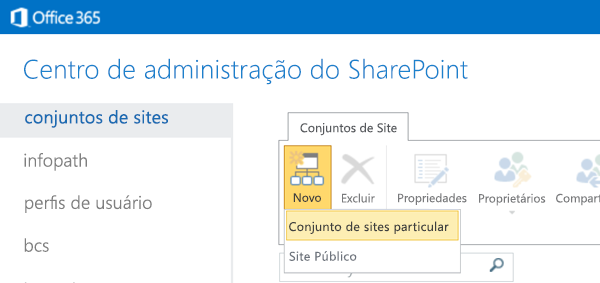
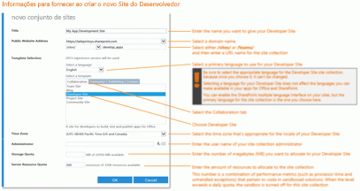
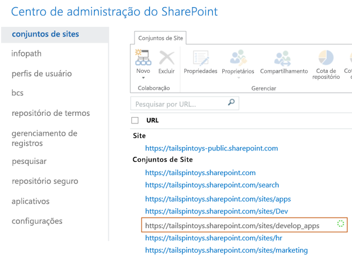

# Criar um site do desenvolvedor em uma assinatura existente do Office 365
Com um Office 365 Developer Site você pode configurar e criar, testar e implantar o Suplementos do Office e do SharePoint de maneira mais rápida. Diversas assinaturas Office 365 de Business, Enterprise, Education e Government incluem um modelo de site que pode ser usado para criar um Site do Desenvolvedor.
 **Antes de começar**
  
    
    

- **Verifique se você tem uma assinatura do Office 365 compatível com o Site do Desenvolvedor.** Se você tiver um dos seguintes planos de assinatura do Office 365, será possível criar um Site do Desenvolvedor dentro da sua assinatura atual:
    

  
    
    
> Office 365 Midsize Business
    
  

  
    
    
> Office 365 Enterprise E1, E3, E4, E5 ou K1
    
  

  
    
    
> Office 365 Education A2, A3 ou A4
    
  

  
    
    
> Office 365 Government G1, G3, G4 ou K1
    
  
- **Se você possuir uma assinatura do Office 365 Small Business,** não será possível criar um conjunto de Sites do Desenvolvedor porque esse pacote só oferece suporte a um único conjunto de sites. Caso queira saber mais sobre os planos do Office 365 para sua empresa, confira [SharePoint Online: limites de software](http://office.microsoft.com/pt-br/office365-sharepoint-online-enterprise-help/sharepoint-online-software-boundaries-and-limits-HA102694293.aspx).
    
  
- Para obter mais informações sobre as ofertas do Office 365 Enterprise, confira  [Planos e Preços](http://products.office.com/pt-br/business/office-365-enterprise-e1-business-software).
    
  

## Criar um Site do Desenvolvedor

1. Acesse o Office 365 como administrador Global ou do SharePoint Online.
    
    **Você deve entrar como um administrador Global ou do SharePoint Online para criar novos conjuntos de sites,** como um Site do Desenvolvedor. Somente os administradores podem ver as opções de Administrador ao entrarem no Office 365. Se você não for um administrador, contate o administrador da sua empresa e peça que ele siga um destes procedimentos:
    
  - Conceder os direitos de administrador a você, para criar o Site do Desenvolvedor por conta própria.
    
  
  - Criar o Site do Desenvolvedor e colocar você como administrador do conjunto de sites.
    
  
2. Clique no botão Inicializador de Aplicativos, localizado na extrema esquerda da barra de navegação na parte superior
    
  
3. Clique no bloco **Administrador**.
    
  
4. Na árvore de navegação à esquerda, expanda **Administrador** e selecione **SharePoint**.
    
  
5. No **SharePoint Admin Center**, na guia **Conjuntos de Sites**, clique em **Novo > Conjunto de Sites Particulares**.
    
     
  

  

  
6. Na caixa de diálogo **Novo Conjunto de Sites**, forneça informações sobre o Site do Desenvolvedor.
    
    **Clique na imagem abaixo para ver as novas opções dos conjuntos de sites na caixa de diálogo, ou confira a tabela localizada abaixo da imagem para obter ajuda.**
     [
  
    
    
](http://go.microsoft.com/fwlink/?LinkId=400960)
|||
|:-----|:-----|
|**Título**   |O nome que deseja dar ao Site do Desenvolvedor.    |
|Lista **Endereço de Site Público**   |Um nome de domínio e um caminho de URL — **/sites/** ou **/equipes/** — e, em seguida, digite um nome de URL do conjunto de sites.   |
|**Selecione uma lista de idiomas** na seção **Seleção de Modelo**   |Um idioma primário a ser usado no Site do Desenvolvedor.    **Selecione o idioma apropriado para o conjunto de sites do Site do Desenvolvedor, pois ele não poderá ser alterado depois.**   Selecionar um idioma para o Site do Desenvolvedor não afeta os idiomas que podem ser disponibilizados nos Suplementos do Office e do SharePoint.    Você pode habilitar a interface de vários idiomas do SharePoint nos seus sites, mas o idioma principal do conjunto de sites será aquele escolhido aqui.    |
|Seção **Seleção de Modelo**, na guia **Colaboração**, em **Selecionar um modelo**   |Escolher o **Site do Desenvolvedor**   |
|**Fuso Horário**   |O fuso horário que é apropriado para a localidade do seu Site do Desenvolvedor.    |
|**Administrador**   |O nome de usuário do administrador do conjunto de sites.    |
|**Cota de Repositório**   |Número de megabytes (MB) que deverá ser alocado para este conjunto de sites do Site do Desenvolvedor.    |
|**Cota do Recurso de Servidor**   |A quantidade de recursos que serão alocados para o conjunto de sites.    Esse número é uma combinação de métricas de desempenho (como tempo do processador e exceções não tratadas) pertencentes aos códigos nas soluções em área restrita. Quando o nível ultrapassa a cota diária, a área restrita é desligada para esse conjunto de sites.    |
   
7. Clique em **OK**.
    
    Você verá a URL do novo site do desenvolvedor na lista **Conjuntos de Sites**. Quando a criação do site for concluída, você poderá navegar para a URL e abrir o Site do Desenvolvedor.
    
     
  

  

  

## Recursos adicionais

-  [Suplementos do SharePoint](sharepoint-add-ins.md)
    
  
-  [Criar ou excluir um conjunto de sites](http://office.microsoft.com/pt-br/office365-sharepoint-online-enterprise-help/create-or-delete-a-site-collection-HA102772354.aspx?CTT=1)
    
  

