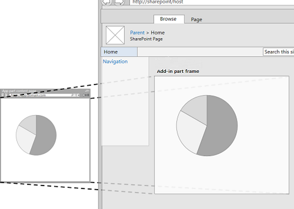
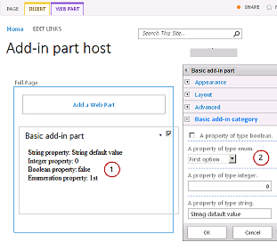
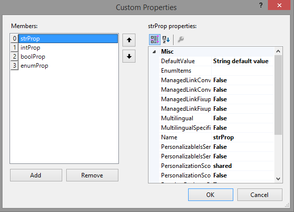
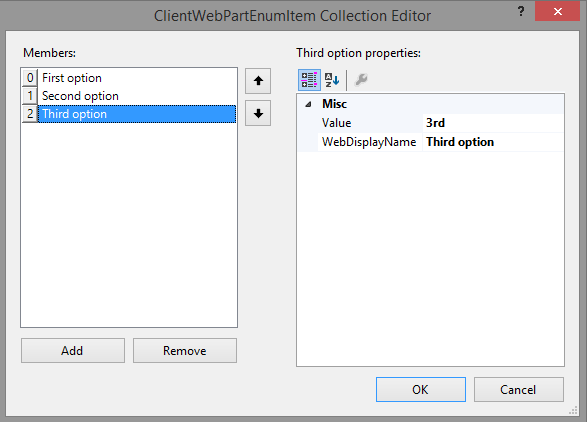
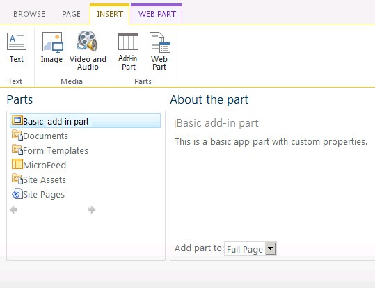
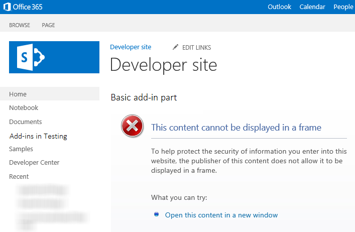

# Criar partes do suplemento para instalar com o SharePoint Add-in
Saiba como criar uma parte do suplemento em SharePoint 2013 que está disponível na Galeria de Web Part do web host quando você instala o seu Suplemento do SharePoint.
Com partes de suplemento, você pode mostrar seu suplemento usuário experiência direita nas páginas do site SharePoint. Uma parte do suplemento exibe a página da Web (que é geralmente um formulário interativo ou uma exibição dinâmica de dados) que você especificar usando um **IFrame** (também conhecido como um quadro) em uma página de [web de host](http://msdn.microsoft.com/library/fp179925.aspx). Para obter mais informações sobre o suplemento partes, consulte os seguintes artigos:
  
    
    


-  [Acessando o suplemento de interface do usuário](important-aspects-of-the-sharepoint-add-in-architecture-and-development-landscap.md#AccessingApp)
    
  
-  [Design de eu para o SharePoint Add-ins](ux-design-for-sharepoint-add-ins.md)
    
  
-  [Ampliar o SharePoint UI de suplementos](sharepoint-add-ins-ux-design-guidelines.md#UXGuide_Extending)
    
  

A Figura 1 mostra como o conteúdo de suplemento parte é exibido em uma página de SharePoint.
  
    
    


**Figura 1. Suplemento part conteúdo exibido em uma página do SharePoint**

  
    
    

  
    
    

  
    
    
Uma parte do suplemento é implementada com a classe **ClientWebPart**, e como todas as Web Parts é um disponíveis na Galeria de Web Parts depois que um usuário instala o Suplemento do SharePoint que inclua esse recurso. Os usuários podem personalizar a parte de suplemento usando as propriedades que você fornecer. (Consulte a Figura 2 abaixo para ver um exemplo das propriedades configuráveis em uma parte do suplemento).O exemplo neste artigo usa uma página da Web é hospedada em um servidor remoto, não no SharePoint, como a página de conteúdo. Tenha em mente que você também pode usar as páginas de SharePoint para hospedar o conteúdo da parte de suplemento, conforme descrito na seção  [Outras partes comuns do suplemento cenários](#SP15Createappparts_Nextsteps) posteriormente neste artigo.
## Pré-requisitos para usar o exemplo neste artigo
<a name="SP15Createappparts_Prereq"> </a>

Para acompanhar as etapas deste exemplo, será necessário:
  
    
    

- Visual Studio
    
  
- Microsoft Office Developer Tools for Visual Studio
    
  
- Um ambiente de desenvolvimento SharePoint. Se precisar de ajuda para configurar um ambiente de desenvolvimento, consulte  [Introdução à criação de suplementos do SharePoint hospedados pelo provedor](get-started-creating-provider-hosted-sharepoint-add-ins.md).
    
  

  
    
    

## Criar uma parte do suplemento para instalar na web host
<a name="SP15Createappparts_Codeexample"> </a>

Existem várias tarefas necessárias para criar e instalar sua parte suplemento na Web do host:
  
    
    

1. Crie o Suplemento do SharePoint e projetos web remoto.
    
  
2. Adicione um formulário para o conteúdo de parte do suplemento.
    
  
3. Adicione a parte do suplemento ao projeto Suplemento do SharePoint.
    
  
Depois de concluir as tarefas, sua parte suplemento deve ser semelhante a Figura 2, quando a parte do suplemento está no modo de edição. Aqui, podemos ver (1) o conteúdo de suplemento exibido em uma página de SharePoint e (2) as propriedades personalizadas do suplemento parte.
  
    
    

**Figura 2. Uma parte do suplemento básica de hospedagem de página do SharePoint**

  
    
    

  
    
    

  
    
    

### Adicione um formulário para o conteúdo da parte de suplemento


1. Crie um provedor hospedado Suplemento do SharePoint, conforme descrito em  [Introdução à criação de suplementos do SharePoint hospedados pelo provedor](get-started-creating-provider-hosted-sharepoint-add-ins.md), mas o nome do projeto TestAppPart.
    
  
2. Depois que a solução Visual Studio tiver sido criada, clique com botão direito do projeto de aplicativo da web (não o projeto Suplemento do SharePoint ) e adicione um novo formulário da Web, escolhendo **Adicionar** > **Novo Item** > **Web** > **Web Form**. Nome do formulário AppPartContent.aspx.
    
  
3. No arquivo AppPartContent.aspx, substitua o elemento html inteira e ele tem filhos com o seguinte código HTML. Deixe todas as marcações acima do elemento html como está. O código HTML contém JavaScript que executa as seguintes tarefas:
    
  - Extrai os valores de propriedade padrão de seqüência de consulta
    
  
  - Processa os valores de propriedade
    
  

    Observe que o código espera alguns parâmetros na seqüência de consulta. A parte do suplemento fornece suas propriedades personalizadas por meio da seqüência de consulta para a página da Web que possa usá-los. A próxima tarefa explica como declarar propriedades personalizadas e como disponibilizá-los para a página da Web add-in.
    


  ```HTML
  
<html>
    <body>
        <div id="content">
            <!-- Placeholders for properties -->
            String property: <span id="strProp"></span><br />
            Integer property: <span id="intProp"></span><br />
            Boolean property: <span id="boolProp"></span><br />
            Enumeration property: <span id="enumProp"></span><br />
        </div>

    <!-- Main JavaScript function, controls the rendering
         logic based on the custom property values -->
    <script lang="javascript">
        "use strict";

        var params = document.URL.split("?")[1].split("&amp;");
        var strProp;
        var intProp;
        var boolProp;
        var enumProp;

        // Extracts the property values from the query string.
        for (var i = 0; i < params.length; i = i + 1) {
            var param = params[i].split("=");
            if (param[0] == "strProp")
                strProp = decodeURIComponent(param[1]);
            else if (param[0] == "intProp")
                intProp = parseInt(param[1]);
            else if (param[0] == "boolProp")
                boolProp = (param[1] == "true");
            else if (param[0] == "enumProp")
                enumProp = decodeURIComponent(param[1]);
        }

        document.getElementById("strProp").innerText = strProp;
        document.getElementById("intProp").innerText = intProp;
        document.getElementById("boolProp").innerText = boolProp;
        document.getElementById("enumProp").innerText = enumProp;
    </script>
    </body>
</html>
  ```

4. Salve e feche o arquivo.
    
  

### Adicionar a parte do suplemento ao projeto Add-in do SharePoint


1. Com o botão direito do projeto Suplemento do SharePoint (não o projeto de aplicativo da web) e escolha **Adicionar** > **Novo Item** > **Office/SharePoint** > **Cliente Web Part (Host Web)**. (O "Cliente Web Part" é outro nome para "suplemento part".)
    
  
2. A parte de suplemento básicaparte do nome.
    
  
3. Na caixa de diálogo **especificar a página de web parts do cliente**, escolha **Selecionar ou digitar uma URL para uma página da web existente**. Escolha a página de **TestAppWebPart/AppPartContent.aspx** na lista suspensa. (Depois de fazer sua escolha, a URL da página pode aparecer na caixa com "TestAppWebPart" substituído pelo **~ remoteAppUrl** e com **{StandardTokens}** adicionado para os parâmetros de consulta.)
    
  
4. Escolha **Concluir**.
    
  
5. Com o botão direito **parte de suplemento básico** no **Solution Explorer** e escolha **Propriedades**.
    
  
6. No painel **Propriedades**, selecione **Propriedades personalizadas** e escolha o botão de texto explicativo ( **…** ).
    
  
7. Use a caixa de diálogo de **Propriedades personalizadas** para adicionar propriedades personalizadas de quatro até a parte do suplemento. Você deve definir cinco atributos de cada uma das quatro propriedades personalizadas. Os nomes de atributos e valores estão listados na tabela 1. Crie as propriedades usando o procedimento a seguir.
    
1. Selecione **Adicionar**.
    
  
2. Na lista atributo, selecione o primeiro atributo na tabela 1: **DefaultValue**.
    
  
3. Defina o valor, por exemplo, o valor padrão de cadeia de caracteres.
    
  
4. Selecione o atributo próximo, **nome** e defina seu valor, por exemplo,strProp.
    
  
5. Continue com os atributos de **tipo**, **WebCategory** e **WebDisplayName**.
    
  
6. Escolha **Adicionar** novamente e repita o processo para todas as quatro linhas da tabela 1. Faça *Fechar a caixa de diálogo*  .
    
   **Tabela 1. Atributos de propriedades personalizadas do part suplemento**


|**DefaultValue**|**Nome**|**Tipo**|**WebCategory**|**WebDisplayName**|
|:-----|:-----|:-----|:-----|:-----|
|Valor padrão de cadeia de caracteres <br/> |strProp <br/> |string <br/> |Categoria da parte de suplemento básica <br/> |Uma propriedade do tipo string <br/> |
|0 <br/> |intProp <br/> |int <br/> |Categoria da parte de suplemento básica <br/> |Uma propriedade de tipo inteiro <br/> |
|false <br/> |boolProp <br/> |booliano <br/> |Categoria da parte de suplemento básica <br/> |Uma propriedade do tipo boolean <br/> |
|1st <br/> |enumProp <br/> |Enum <br/> |Categoria da parte de suplemento básica <br/> |Uma propriedade da enumeração de tipo <br/> |
   

    Nesse momento a caixa de diálogo deve se parecer com o seguinte:
    

   **Caixa de diálogo de propriedades personalizada para ClientWebPart**

  

     
  

  

  
8. Selecione a propriedade **enumProp**, selecione o atributo **EnumItems** e escolha o botão de texto explicativo ( **…** ).
    
  
9. Use o **Editor de coleção ClientWebPartEnumItem** para adicionar três itens. Você deve definir dois atributos de cada um dos três. Os nomes de atributos e valores estão listados na tabela 2. Crie as propriedades usando o procedimento a seguir.
    
1. Selecione **Adicionar**.
    
  
2. Na lista atributo, selecione o primeiro atributo na tabela 2: **valor**.
    
  
3. Defina o valor do atributo, por exemplo, 1st.
    
  
4. Selecione o atributo próximo, **WebDisplayName** e defina seu valor, por exemplo, aprimeira opção.
    
  
5. Escolha **Adicionar** novamente e repita o processo para todas as linhas da tabela 2.
    
   **Tabela 2. Itens de enumeração da propriedade enumProp**


|**Valor**|**WebDisplayName**|
|:-----|:-----|
|1st <br/> |Primeira opção <br/> |
|2nd <br/> |Segunda opção <br/> |
|3rd <br/> |Terceira opção <br/> |
   

    A caixa de diálogo deve se parecer com o seguinte quando você terminar:
    

   **Editor de coleção ClientWebPartEnumItem**

  

     
  

  

  
6. Escolha **OK** para fechar a caixa de diálogo e escolha **OK** novamente para fechar a caixa de diálogo de **Propriedades personalizadas**.
    
  
10. Visual Studio gera o seguinte código XML no arquivo Elements XML da parte suplemento (quebras de linha adicionadas para manter a clareza). Observe que o atributo **Title** do elemento **ClientWebPart** é definido como "Básico suplemento part título" e a descrição é definido como "Básico suplemento parte descrição". Exclua a palavra "Title" do primeiro e substitua a segundaparte suplemento básica.
    
  ```XML
  
<?xml version="1.0" encoding="UTF-8"?>
<Elements xmlns="http://schemas.microsoft.com/sharepoint/">
    <ClientWebPart
        Name="Basic add-in part"
        Title="Basic add-in part Title"
        Description="Basic add-in part Description" >
        
        <!--  The properties are passed through the query string 
                using the following notation: _propertyName_
                in the Src property of the Content element.  
          -->
        <Content
            Src="~remoteAppUrl/AppPartContent.aspx?strProp=_strProp_&amp;amp;intProp=_intProp_&amp;amp;boolProp=_boolProp_&amp;amp;enumProp=_enumProp_"
            Type="html"/>
        <Properties>
            <Property
                Name="strProp"
                Type="string"
                RequiresDesignerPermission="true"
                DefaultValue="String default value"
                WebCategory="Basic add-in part category"
                WebDisplayName="A property of type string.">
            </Property>
            <Property
                Name="intProp"
                Type="int"
                RequiresDesignerPermission="true"
                DefaultValue="0"
                WebCategory="Basic add-in part category"
                WebDisplayName="A property of type integer.">
            </Property>
            <Property
                Name="boolProp"
                Type="boolean"
                RequiresDesignerPermission="true"
                DefaultValue="false"
                WebCategory="Basic add-in part category"
                WebDisplayName="A property of type boolean.">
            </Property>
            <Property
                Name="enumProp"
                Type="enum"
                RequiresDesignerPermission="true"
                DefaultValue="1st"
                WebCategory="Basic add-in part category"
                WebDisplayName="A property of type enum.">
                <EnumItems>
                    <EnumItem WebDisplayName="First option" Value="1st"/>
                    <EnumItem WebDisplayName="Second option" Value="2nd"/>
                    <EnumItem WebDisplayName="Third option" Value="3rd"/>
                </EnumItems>
            </Property>
        </Properties>
    </ClientWebPart>
</Elements>               

  ```


### Definir a página inicial do suplemento para a home page do host web


1. A amostra contínuos Suplemento do SharePoint não tem qualquer suplemento web e seu aplicativo web remoto existe somente para hospedar o formulário. Não há qualquer página inteira, uma experiência envolvente para este suplemento. Portanto, a página inicial do add-in deve ser definida para a home page da web host.
    
    Para começar, selecione o projeto Suplemento do SharePoint (não o projeto de aplicativo web) no **Solution Explorer** e copie o valor da propriedade **URL do Site**, incluindo o protocolo (por exemplo **https://contoso.sharepoint.com** ) na área de transferência.
    
  
2. Abra o manifesto do add-in e, em seguida, cole a URL na caixa **Start Page**.
    
  
3. Opcionalmente, você pode excluir a página Default. aspx do projeto do aplicativo web, porque ele não é usado no Suplemento do SharePoint.
    
  

### Criar e testar a solução


1. Pressione a tecla F5.
    
    > [!OBSERVAçãO]
      > Quando você pressiona F5, Visual Studio aproveita a solução, instala o suplemento e abre a página de permissões para o suplemento.
2. Escolha o botão **De confiança**.
    
  
3. Adicione a **parte de suplemento básica** da Galeria parte do suplemento. Para obter instruções detalhadas, consulte [Adicionar uma parte do suplemento para uma página](https://support.office.com/article/Add-an-App-Part-to-a-page-6f06c0b7-44b8-4c69-b4ad-85197eee8d78).
    
    Quando o suplemento é instalado na web host, a **parte de suplemento básico** está disponível na Galeria de parte do suplemento. Ele deve ser muito semelhante a Figura 3.
    

   **Figura 3. Suplemento parte na parte de suplemento de galeria**

  

     
  

  

  
4. Após ter adicionado a parte do suplemento, escolha a cabeça de seta para baixo à direita do título do **suplemento parte básica** e, em seguida, escolha **Editar web part**.
    
    Você deverá ver a parte de suplemento no modo de edição semelhante a Figura 1 acima.
    
  
5. Abra a **categoria da parte de suplemento básica** e altere alguns dos valores de propriedade.
    
  
6. Clique em **OK** para salvar suas alterações e verificar se as propriedades foram alteradas na parte add-in.
    
  
7. Quando você terminar a sessão de depuração e você não usar F5 novamente neste projeto por algum tempo, é uma boa prática para cancelar o Suplemento do SharePoint pela última vez para garantir que a parte de suplemento de teste será removida de sua home page. Com o botão direito no projeto Suplemento do SharePoint e escolha **Retract**.
    
  

## Solução de problemas
<a name="SP15Createappparts_Codeexample"> </a>


**Tabela 3. A solução de problemas**


|**Problema**|**Solução**|
|:-----|:-----|
|A parte de suplemento não exibe qualquer conteúdo. A parte do suplemento exibirá o seguinte erro: **navegação para a página da Web foi cancelada**. Este erro ocorre porque o navegador bloqueou a página de conteúdo. <br/> |Habilite conteúdo misto. O procedimento pode ser diferente, dependendo do navegador que você está usando: <br/> Internet Explorer 9 e 10 exiba a seguinte mensagem na parte inferior da página: **somente conteúdo seguro é exibido**. Escolha **Mostrar todo o conteúdo** para exibir o conteúdo de parte do suplemento. <br/> Internet Explorer 8 mostra uma caixa de diálogo com a seguinte mensagem: **você deseja exibir somente o conteúdo de página da Web que foi entregue com segurança?** Escolha **não** para exibir o conteúdo de parte do suplemento. <br/> Como alternativa, é possível habilitar conteúdo misto na zona da Internet que você está trabalhando. Para a maioria dos desenvolvedores Internet zona é **intranet Local**. Se isso não for o caso, substitua a zona da Internet em que estiver trabalhando por **intranet Local**. <br/> No Internet Explorer, escolha **Ferramentas** > **Opções da Internet**. <br/> Na caixa de diálogo **Opções da Internet**, na guia **segurança**, escolha **intranet Local** e, em seguida, escolha o botão **nível personalizado**. <br/> Na caixa de diálogo **Configurações de segurança**, habilite a **Exibir conteúdo misto** na seção **diversos**. <br/> |
   

## Outras partes comuns do suplemento cenários
<a name="SP15Createappparts_Nextsteps"> </a>

Este artigo mostra como criar uma suplemento parte básica com as propriedades personalizadas usando uma página da Web remota como a página de conteúdo. Você também pode explorar os seguintes cenários e obter detalhes sobre o suplemento partes.
  
    
    

### Usar uma página do SharePoint como a página de conteúdo

Na maioria dos casos, uma página da Web não pôde ser exibida em um quadro se ele envia um cabeçalho HTTP de **Opções do quadro de X** na resposta. Por padrão, páginas de SharePoint incluem o cabeçalho de **Opções do quadro de X**. Se você estiver usando uma página da Web de SharePoint hospedada na web suplemento, você poderá enfrentar o seguinte erro (mostrado na Figura 4): **este conteúdo não pôde ser exibido em um quadro**
  
    
    

**Figura 4. Suplemento parte que não é possível exibir o seu conteúdo em um quadro**

  
    
    

  
    
    

  
    
    
Lembre-se de que certos cenários estão sujeitos a ataques " [ClickJacking](http://blogs.msdn.com/b/ieinternals/archive/2010/03/30/combating-clickjacking-with-x-frame-options.aspx)" quando as páginas da Web são exibidas em um quadro. Avalie com cuidado os seus cenários de suplemento parte para certificar-se de que não há nenhum risco de ataques de **ClickJacking**.
  
    
    
Se sua página hospedada na web suplemento não for suscetível a ataques de ClickJacking, você pode usar o **AllowFraming** Web Part para suprimir o cabeçalho do **Quadro-X-opções** de resposta da sua página. O exemplo de código a seguir mostra como usar o **AllowFraming** Web Part em uma página do SharePoint. Copie este marcação para a página que está hospedada na web add-in. Colocá-lo imediatamente acima do primeiro elemento **asp:content** na página. Ele não deve ser um filho de qualquer outro elemento.
  
    
    


```XML

<WebPartPages:AllowFraming ID="AllowFraming1" runat="server" />
```

Você pode baixar um  [exemplo de código de suplemento parte](http://code.msdn.microsoft.com/SharePoint-2013-Display-be8dac16) que mostra como usar uma página de SharePoint como a página de conteúdo.
  
    
    

### Redimensionar a parte de suplemento

Se você estiver usando o conteúdo dinâmico na sua parte do suplemento, o conteúdo pode alterar sua largura e altura. Devido à natureza dinâmica do conteúdo, ele poderá não caber no quadro. Você também pode estar usando muito espaço. Com conteúdo dinâmico, poderia ser difícil especificar um tamanho fixo em sua parte do suplemento de declaração. No entanto, você pode redimensionar o quadro para ajustar a largura e a altura do conteúdo.
  
    
    
Você pode usar as mensagens de POSTAGEM de sua página da Web de conteúdo para especificar o tamanho do quadro. O exemplo a seguir JavaScript mostra como enviar uma mensagem de POSTAGEM para redimensionar o quadro no qual a sua parte suplemento está hospedado. Normalmente, você teria isso em um método JavaScript em um arquivo de JavaScript que você invoca da página. Por exemplo, a página poderia ter um controle em que o usuário Especifica o tamanho da janela do suplemento parte. O método personalizado, em seguida, é chamado de manipulador de **onchange** do controle. Para obter um exemplo completo, consulte [amostra de código: redimensionar o suplemento partes dinamicamente no SharePoint suplementos](http://code.msdn.microsoft.com/officeapps/SharePoint-2013-Resize-app-594acc88).
  
    
    


```
window.parent.postMessage("<message senderId={SenderId}>resize(120, 300)</message>", {hostweburl});
```

No exemplo acima, o valor de **senderId** será definido na cadeia de caracteres de consulta da página automaticamente pelo suplemento parte código quando a página é processada. Sua página precisaria apenas ler o valor de **SenderId** efetuará o logoff a cadeia de caracteres de consulta e usá-lo ao solicitar um redimensionamento. É possível recuperar a URL do host web da cadeia de consulta, acrescentando os tokens **StandardTokens** ou **HostUrl** ao atributo **Src** na sua definição parte do suplemento. Você pode baixar o [redimensionar a amostra de código de suplemento partes](http://code.msdn.microsoft.com/officeapps/SharePoint-2013-Resize-app-594acc88) para ver uma parte do suplemento que redimensiona dinamicamente.
  
    
    

### Usar a folha de estilos do SharePoint no seu conteúdo de parte de suplemento

Desde que a sua parte suplemento é hospedado dentro de uma página de SharePoint, talvez você queira fazer a aparência do conteúdo de suplemento parte como ele é parte da página. Uma maneira de obter uma aparência semelhante é usar as classes de estilo mesmo como a página SharePoint que está hospedando a parte do suplemento. Você pode disponibilizar folha de estilo do site SharePoint até a parte do suplemento com a adição de uma referência ao arquivo **defaultcss.ashx** da web add-in.
  
    
    
Você pode ver  [Use a folha de estilos de um site SharePoint no SharePoint Add-ins](use-a-sharepoint-website-s-style-sheet-in-sharepoint-add-ins.md) para obter uma explicação sobre como fazer referência ao arquivo **defaultcss.ashx** no seu Suplementos do SharePoint. Você também pode baixar o [exemplo de código coffeemaker](http://code.msdn.microsoft.com/office/SharePoint-2013-App-part-9d83703c) para ver uma parte do suplemento que referencia a folha de estilo.
  
    
    

### Detectar quando a parte de suplemento não está no modo de edição

Os usuários podem editar a parte do suplemento para alterar suas propriedades. Por exemplo, um usuário talvez queira alterar uma das propriedades de **aparência** ou **Layout** da parte add-in. (Consulte a Figura 2 acima). Se sua parte suplemento estiver em modo de edição, convém modificar a lógica de renderização ou impedir alguns processamento desnecessário aconteça. Considere, por exemplo, uma parte do suplemento que chama um banco de dados de back-end, sempre que a página host recarrega. Alterando o valor da propriedade uma parte do suplemento em Editar modo faz com que um novo carregamento de página, mas você pode não querer a chamada de rede seja disparado nesse caso. Você pode usar o token **_editMode_** para detectar se os usuários estiverem editando sua parte do suplemento.
  
    
    
Para usar o token **_editMode_**, adicione um parâmetro de cadeia de caracteres de consulta para o atributo **Src** do elemento **Content** na declaração parte do suplemento.
  
    
    


```XML
<Content Src="content_page_url&amp;amp;editmode=_editMode_">
```

O token **_editMode_** permite que sua página de conteúdo a determinar se a parte de suplemento está no modo de edição. Se a parte de suplemento estiver em modo de edição, o token **_editMode_** resolve como 1; Caso contrário, o token resolve como 0.
  
    
    

## Recursos adicionais
<a name="SP15Createappparts_AddResources"> </a>


-  [Amostra de código: exibir o conteúdo remoto suplemento na web host usando uma parte do suplemento](http://code.msdn.microsoft.com/SharePoint-2013-Display-03c28286)
    
  
-  [Amostra de código: exibir o conteúdo da web de suplemento na web host usando uma parte do suplemento](http://code.msdn.microsoft.com/SharePoint-2013-Display-be8dac16)
    
  
-  [Amostra de código: redimensionar o suplemento partes dinamicamente no SharePoint suplementos](http://code.msdn.microsoft.com/officeapps/SharePoint-2013-Resize-app-594acc88)
    
  
-  [Amostra de código: conteúdo de página da Web remoto de exibição usando a parte do suplemento coffeemaker](http://code.msdn.microsoft.com/SharePoint-2013-App-part-9d83703c)
    
  
-  [Configurar um ambiente de desenvolvimento local para suplementos do SharePoint](set-up-an-on-premises-development-environment-for-sharepoint-add-ins.md)
    
  
-  [Design de eu para o SharePoint Add-ins](ux-design-for-sharepoint-add-ins.md)
    
  
-  [Diretrizes de design UX de suplementos do SharePoint](sharepoint-add-ins-ux-design-guidelines.md)
    
  
-  [Criar componentes UX do SharePoint 2013](create-ux-components-in-sharepoint-2013.md)
    
  
-  [Três maneiras de pensar sobre opções de design para o SharePoint Add-ins](three-ways-to-think-about-design-options-for-sharepoint-add-ins.md)
    
  
-  [Aspectos importantes do Add-in SharePoint arquitetura e desenvolvimento cenário](important-aspects-of-the-sharepoint-add-in-architecture-and-development-landscap.md)
    
  

