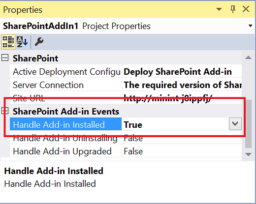

# Criar um receptor de evento add-in SharePoint Add-ins
Criar manipuladores para instalar o Suplemento do SharePoint e desinstalar eventos no Suplementos do SharePoint.
## Pré-requisitos
<a name="SP15appevent_prereq"> </a>

Este artigo pressupõe que você tenha uma compreensão do hospedado em provedor Suplementos do SharePoint e que você tenha desenvolvido alguns que passam pelo menos um baixo além do nível de "Olá mundo". Além disso, você deve estar familiarizado com  [Lidar com eventos no SharePoint Add-ins](handle-events-in-sharepoint-add-ins.md).
  
    
    

## Obtenha mais exemplos de código
<a name="SP15appevent_prereq"> </a>

Se você trabalha através do exemplo contínuo neste artigo, você terá um exemplo de código terminar. Estes são alguns exemplos de outros. Eles não todos os seguem a arquitetura descrita neste artigo. Pode haver mais de uma boa maneira de projetar um receptor de evento add-in e, lembre-se também pode evoluir de orientação da Microsoft ao longo do tempo.
  
    
    

-  [OfficeDev/PnP/Samples/Core.AppEvents.HandlerDelegation](https://github.com/OfficeDev/PnP/tree/master/Samples/Core.AppEvents.HandlerDelegation) é uma correspondência próxima ao exemplo contínuo neste artigo.
    
  
-  [OfficeDev/PnP/Samples/Core.AppEvents](https://github.com/OfficeDev/PnP/tree/master/Samples/Core.AppEvents) mostra como fazer a mesma tarefa que o exemplo anterior em cenários onde a estratégia de delegação do manipulador não pode ser usada.
    
  
-  [OfficeDev/PnP/Samples/Core.EventReceivers](https://github.com/OfficeDev/PnP/tree/master/Samples/Core.EventReceivers)
    
  
-  [Criar um provedor hospedado suplemento que personaliza a instalação do suplemento](https://code.msdn.microsoft.com/SharePoint-2013-Create-a-f27752e0)
    
  

## Adicionar um receptor de evento de instalados suplemento
<a name="SP15appevent_prereq"> </a>


1. No Visual Studio, abra o projeto para o provedor hospedado Suplemento do SharePoint. (Se você adicionar um manipulador de eventos do suplemento a um add-in hospedado no SharePoint, o Office Developer Tools for Visual Studio convertê-lo em um aplicativo hospedado em provedor.)
    
  
2. No **Solution Explorer**, escolha o nó para o Suplemento do SharePoint.
    
  
3. Na janela **Propriedades**, defina o valor da **alça Add-in instalado** como **True**.
    
   **Figura 1. Eventos de suplemento na janela de propriedades**

  

     
  

    O Office Developer Tools for Visual Studio irá fazer o seguinte:
    
  - Adicione um arquivo chamado AppEventReceiver.svc. que contém alguns códigos estrutural de c# (ou VB.NET). Este é o serviço que lidará com o evento add-in.
    
  
  - A seguinte entrada é adicionada à seção de **Propriedades** do arquivo AppManifest.xml: `<InstalledEventEndpoint>~remoteAppUrl/AppEventReceiver.svc</InstalledEventEndpoint>`. Essa entrada registra o receptor de evento add-in no SharePoint. (Observe que o **~ remoteAppUrl** token é a mesma usada para o aplicativo web remoto no hospedado em provedor Suplemento do SharePoint. O Office Developer Tools for Visual Studio pressupõem o domínio do aplicativo web e o manipulador de eventos é o mesmo. No caso raro onde não é, é necessário substituir manualmente o token **~ remoteAppUrl** com o domínio real do seu serviço.)
    
  
  - Se o projeto Suplemento do SharePoint ainda não tiver um projeto da web, o Office Developer Tools for Visual Studio criar um. As ferramentas também Certifique-se que manifesto suplemento está configurado para um suplemento hospedado pelo provedor. Eles também adicionará páginas, scripts, arquivos CSS e outros artefatos. (Se o componente apenas remoto que seu suplemento precisa for o serviço web de tratamento de evento, você pode excluir essas do projeto. Você também deve assegurar que o elemento **StartPage** no manifesto suplemento não estiver apontando para uma página que você excluiu.)
    
  
4. Se seu farm do SharePoint de teste não estiver no mesmo computador que está executando o Visual Studio, configure o projeto para depuração usando Microsoft Azure barramento de serviço. Para obter mais informações, consulte  [Depurar e solucionar problemas de um receptor de evento remoto em um SharePoint Add-in](debug-and-troubleshoot-a-remote-event-receiver-in-a-sharepoint-add-in.md).
    
  
5. Se houver um método  `ProcessOneWayEvent` no arquivo AppEventReceiver.svc, implementação de TI deve consistir apenas a linha `throw new NotImplementedException();`, pois esse método não pode ser usado em um manipulador de eventos do suplemento.  *Suplemento manipuladores de eventos tem que retornar um objeto que informa o SharePoint se término ou reverter o evento e o método  `ProcessOneWayEvent` não retornará nada.* 
    
  
6. O arquivo incluirá um método  `ProcessEvent` parecida com o seguinte. (Pode haver também um bloco de código que ilustra como obter um contexto de cliente. Excluir- ou comente.)
    
    Observe o seguinte sobre este código:
    
  - O objeto  [SPRemoteEventProperties](https://msdn.microsoft.com/library/Microsoft.SharePoint.Client.EventReceivers.SPRemoteEventProperties.aspx) é enviado ao serviço web manipulador como uma mensagem SOAP que contém informações de contexto do SharePoint, incluindo uma propriedade [EventType](https://msdn.microsoft.com/library/Microsoft.SharePoint.Client.EventReceivers.SPRemoteEventProperties.EventType.aspx) que identifica o evento.
    
  
  - O objeto  [SPRemoteEventResult](https://msdn.microsoft.com/library/Microsoft.SharePoint.Client.EventReceivers.SPRemoteEventResult.aspx) que seu manipulador retorna contém uma propriedade [Status](https://msdn.microsoft.com/library/Microsoft.SharePoint.Client.EventReceivers.SPRemoteEventResult.Status.aspx) cujos valores possíveis são [SPRemoteEventServiceStatus](https://msdn.microsoft.com/library/Microsoft.SharePoint.Client.EventReceivers.SPRemoteEventServiceStatus.aspx) . **Continue**, **SPRemoteEventServiceStatus.CancelNoError**e **SPRemoteEventServiceStatus.CancelWithError**. O valor padrão da propriedade **Status** é **Continue**, que informa ao SharePoint para concluir o evento. Os dois valores ao SharePoint para:
    
  - Execute o manipulador de para três vezes mais.
    
  
  - Se ela ainda estiver obtendo um status de cancelar, cancelar o evento e reverter nada que tem feito como parte do evento.
    
  


  ```cs
  
public SPRemoteEventResult ProcessEvent(SPRemoteEventProperties properties)
{
    SPRemoteEventResult result = new SPRemoteEventResult();

    return result;
}
  ```

7. Imediatamente abaixo da linha que declara a variável  `result` , adicione a seguinte estrutura de comutador para identificar qual evento está sendo tratado.
    
  ```cs
  
switch (properties.EventType)
{
    case SPRemoteEventType.AppInstalled:
        break;
    case SPRemoteEventType.AppUpgraded:
        break;
    case SPRemoteEventType.AppUninstalling:
        break;
}
  ```


    > **OBSERVAçãO**
      > O **AppInstalled**, **AppUpdated**e **AppInstalling** eventos, se você tiver manipuladores para eles, cada um receberá sua própria URL registrado no manifesto do suplemento. Assim você *pode*  ter diferentes pontos de extremidade-los; mas este artigo (e o Office Developer Tools for Visual Studio ) pressupõem que eles têm exatamente o mesmo ponto de extremidade; é por isso que o código precisa determinar qual evento chamado-lo.
8. Conforme explicado na  [Incluir lógica de reversão e "tiver feito" lógica em seus manipuladores de eventos de suplemento](handle-events-in-sharepoint-add-ins.md#Rollback), caso algo saia errado na sua lógica de instalação, quase sempre desejado a instalação do suplemento cancelado e você quiser que o SharePoint para reverter o que aconteceu para a instalação e você deseja reverter que o seu manipulador tenha feito. Adicione o seguinte código dentro do **case** para o evento AppInstalled é uma maneira de atingir essas metas.
    
  ```cs
  
case SPRemoteEventType.AppInstalled:
  try
  {
      // Add-in installed event logic goes here.
  }
  catch (Exception e)
  {
      result.ErrorMessage = e.ErrorMessage;
      result.Status = SPRemoteEventServiceStatus.CancelWithError;

      // Rollback logic goes here.
  }
  break;
  ```


    > **OBSERVAçãO**
      > Mova os códigos de instalação que leve mais de 30 segundos para o add-in em si. Você pode adicioná-lo à lógica "da primeira execução" que é executado na primeira vez que o suplemento é executado. O suplemento pode exibir uma mensagem informando que algo como "Estamos obtendo coisas pronto para você." Como alternativa, o suplemento pode solicitar o usuário a executar o código de inicialização.> Se "da primeira execução" lógica não é viável para seu suplemento, outra opção é fazer com que o manipulador de evento iniciar um processo assíncrono remoto e imediatamente retorna um objeto de  [SPRemoteEventResult](https://msdn.microsoft.com/library/Microsoft.SharePoint.Client.EventReceivers.SPRemoteEventResult.aspx) com o **Status** definida como **Continue**. Um ponto fraco dessa estratégia é que se o processo remoto falhar, ele não tem como dizer ao SharePoint para reverter a instalação do suplemento.
9. Conforme explicado em  [Estratégias de arquitetura do manipulador de eventos de suplemento](handle-events-in-sharepoint-add-ins.md#Strategies), a estratégia de delegação do manipulador é preferida, embora não é possível em todos os cenários. No exemplo contínuo, mostraremos como implementar a estratégia de delegação do manipulador ao adicionar uma lista na Web do host. (Para obter informações sobre como criar um manipulador de eventos AppInstalled semelhante que não usa a estratégia de delegação do manipulador, consulte o exemplo  [OfficeDev/PnP/Samples/Core.AppEvents](https://github.com/OfficeDev/PnP/tree/master/Samples/Core.AppEvents).)
    
    A seguir está a nova versão do bloco de **case** AppInstalled. Observe que a lógica de inicialização que se aplica a todos os eventos fica acima do bloco **switch**. Desde a mesma lista que está instalada será removida no manipulador de AppUninstalling, a lista é identificada lá.
    


  ```cs
  
SPRemoteEventResult result = new SPRemoteEventResult();
String listTitle = "MyList";

switch (properties.EventType)
{               
    case SPRemoteEventType.AppInstalled:
                    
   try
   {
        string error = TryCreateList(listTitle, properties);
        if (error != String.Empty)
        {
            throw new Exception(error);            
        }
   }
    catch (Exception e)
   {
        // Tell SharePoint to cancel the event.
        result.ErrorMessage = e.Message;
        result.Status = SPRemoteEventServiceStatus.CancelWithError;               
    }
        break;
    case SPRemoteEventType.AppUpgraded:
       break;
    case SPRemoteEventType.AppUninstalling:
       break;
}                      
  ```

10. Adicione o método de criação de lista à classe **AppEventReceiver** como um método de **private** com o código a seguir. Observe que a classe `TokenHelper` tem um método especial que é otimizado para obtenção de um contexto de cliente para um evento do suplemento. Passar **false** para o último parâmetro garante que o contexto é para a web de host.
    
  ```cs
  
private string TryCreateList(String listTitle, SPRemoteEventProperties properties)
 {    
    string errorMessage = String.Empty;          

    using (ClientContext clientContext =
        TokenHelper.CreateAppEventClientContext(properties, useAppWeb: false))
    {
        if (clientContext != null)
        {
        }
    }
    return errorMessage;
}

  ```

11. Lógica de reversão é basicamente exceção de lógica de manipulação e CSOM do SharePoint (modelo de objeto do cliente) tem um  [ExceptionHandlingScope](https://msdn.microsoft.com/library/Microsoft.SharePoint.Client.ExceptionHandlingScope.aspx) que permite que o seu serviço da web delegar a manipulação de exceção ao servidor do SharePoint. (Consulte também, [How to: Use Exception Handling Scope](http://msdn.microsoft.com/library/103619ef-1ba3-44e3-93e1-5e0685bc616e%28Office.15%29.aspx).) Adicione o seguinte código para o bloco de **if** no trecho de código anterior.
    
  ```cs
  
ExceptionHandlingScope scope = new ExceptionHandlingScope(clientContext);

using (scope.StartScope()) 
{ 
    using (scope.StartTry()) 
    { 
    }         
    using (scope.StartCatch()) 
    {                                 
    } 
    using (scope.StartFinally()) 
    { 
    } 
} 
 clientContext.ExecuteQuery();

if (scope.HasException)
{
    errorMessage = String.Format("{0}: {1}; {2}; {3}; {4}; {5}", 
        scope.ServerErrorTypeName, scope.ErrorMessage, 
        scope.ServerErrorDetails, scope.ServerErrorValue, 
        scope.ServerStackTrace, scope.ServerErrorCode);
}
  ```

12. Há apenas uma chamada para o SharePoint ( **ExecuteQuery**) no trecho anterior, mas infelizmente não podemos bastante fazer com apenas um. Cada objeto que vai ser referenciada no escopo da exceção deve primeiro ser carregado no cliente. Portanto, adicione o seguinte código  *acima*  o construtor para o **ExceptionHandlingScope**.
    
  ```cs
  
ListCollection allLists = clientContext.Web.Lists;
IEnumerable<List> matchingLists =
    clientContext.LoadQuery(allLists.Where(list => list.Title == listTitle));
clientContext.ExecuteQuery();

var foundList = matchingLists.FirstOrDefault();
 List createdList = null;
  ```

13. O código para criar uma lista de hosts web serão direcionados para o bloco de  [StartTry](https://msdn.microsoft.com/library/Microsoft.SharePoint.Client.ExceptionHandlingScope.StartTry.aspx) , mas o código primeiro deve verificar se a lista já foi adicionada (conforme explicado em [Incluir lógica de reversão e "tiver feito" lógica em seus manipuladores de eventos de suplemento](handle-events-in-sharepoint-add-ins.md#Rollback)). If-then-else lógica pode ser delegada ao servidor do SharePoint, usando a classe  [ConditionalScope](https://msdn.microsoft.com/library/Microsoft.SharePoint.Client.ConditionalScope.aspx) . (Consulte também, [How to: Use Conditional Scope](http://msdn.microsoft.com/library/560112e9-c3ed-4b8f-9cd4-c8bc5d60d63c%28Office.15%29.aspx).) Adicione o seguinte código dentro do bloco de **StartTry**.
    
  ```cs
  
ConditionalScope condScope = new ConditionalScope(clientContext,
        () => foundList.ServerObjectIsNull.Value == true, true);
using (condScope.StartScope())
{
    ListCreationInformation listInfo = new ListCreationInformation();
    listInfo.Title = listTitle;
    listInfo.TemplateType = (int)ListTemplateType.GenericList;
    listInfo.Url = listTitle;
    createdList = clientContext.Web.Lists.Add(listInfo);                                
}
  ```

14. O bloco de  [StartCatch](https://msdn.microsoft.com/library/Microsoft.SharePoint.Client.ExceptionHandlingScope.StartCatch.aspx) deve desfazer a criação da lista, mas ele precisa primeiro verificar que a lista foi criada, pois uma exceção pode ter sido lançada no bloco de **StartTry** antes de concluir a criação da lista. Adicione o seguinte código para o bloco de **StartCatch**.
    
  ```cs
  
ConditionalScope condScope = new ConditionalScope(clientContext,
        () => createdList.ServerObjectIsNull.Value != true, true);
using (condScope.StartScope())
{
    createdList.DeleteObject();
} 
  ```


    > **DICA**
      > **Solução de problemas:** Para testar se seu bloco **StartCatch** é inserido quando deveria, você precisa de uma forma para acionar uma exceção de tempo de execução no servidor do SharePoint. Usando um **throw** ou divisão por zero não funcionarão porque eles causar exceções do *lado do cliente*  antes do tempo de execução de cliente pode até mesmo agrupam o código e enviá-la ao servidor (com o método **ExecuteQuery** ). Em vez disso, adicione as seguintes linhas ao bloco **StartTry**. O tempo de execução do cliente aceita isso, mas ela faz com que uma exceção do servidor, que é o que você deseja.>  `List fakeList = clientContext.Web.Lists.GetByTitle("NoSuchList");`
  
    
    
 `clientContext.Load(fakeList);`

    Todo o método TryCreateList deve se parecer com o seguinte. (O bloco de  [StartFinally](https://msdn.microsoft.com/library/Microsoft.SharePoint.Client.ExceptionHandlingScope.StartFinally.aspx) é necessário, mesmo quando não está sendo usado.)
    


  ```cs
  
private string TryCreateList(String listTitle, SPRemoteEventProperties properties)
{    
    string errorMessage = String.Empty;  

    using (ClientContext clientContext = 
        TokenHelper.CreateAppEventClientContext(properties, useAppWeb: false))
    {
        if (clientContext != null)
        {
            ListCollection allLists = clientContext.Web.Lists;
            IEnumerable<List> matchingLists = 
                clientContext.LoadQuery(allLists.Where(list => list.Title == listTitle));
            clientContext.ExecuteQuery();
            var foundList = matchingLists.FirstOrDefault();
            List createdList = null;

            ExceptionHandlingScope scope = new ExceptionHandlingScope(clientContext); 
            using (scope.StartScope()) 
            { 
                using (scope.StartTry()) 
                { 
                    ConditionalScope condScope = new ConditionalScope(clientContext, 
                            () => foundList.ServerObjectIsNull.Value == true, true);  
                    using (condScope.StartScope())
                    {
                        ListCreationInformation listInfo = new ListCreationInformation();
                        listInfo.Title = listTitle;
                        listInfo.TemplateType = (int)ListTemplateType.GenericList;
                        listInfo.Url = listTitle;
                        createdList = clientContext.Web.Lists.Add(listInfo);
                    }
                } 
                
                using (scope.StartCatch()) 
                { 
                    ConditionalScope condScope = new ConditionalScope(clientContext, 
                            () => createdList.ServerObjectIsNull.Value != true, true);
                    using (condScope.StartScope())
                    {
                        createdList.DeleteObject();
                    }    
                } 

                using (scope.StartFinally()) 
                { 
                } 
            } 
            clientContext.ExecuteQuery();

            if (scope.HasException)
            {
                    errorMessage = String.Format("{0}: {1}; {2}; {3}; {4}; {5}", 
                    scope.ServerErrorTypeName, scope.ErrorMessage, 
                    scope.ServerErrorDetails, scope.ServerErrorValue, 
                    scope.ServerStackTrace, scope.ServerErrorCode);
            }
        }
    }
    return errorMessage;
}
  ```


    > **DICA**
      > **Depuração:** Independentemente se você estiver usando a estratégia de delegação do manipulador, quando você estiver nivelando o código com o depurador, tenha em mente que, em qualquer situação na qual seu manipulador retorna um status de cancelar, SharePoint irá chamar seu manipulador novamente, até três vezes mais. Portanto o depurador percorrerá o código até quatro vezes.

    > **DICA**
      > **Arquitetura de código:** Desde que você pode instalar componentes na web suplemento com marcação declarativa fora do seu manipulador, geralmente não deseja usar qualquer um dos 30 segundos que seu manipulador tem disponíveis para interagir com o suplemento de web. Mas, se fizer isso, lembre-se de que seu código requer um objeto separado [ClientContext](https://msdn.microsoft.com/library/Microsoft.SharePoint.Client.ClientContext.aspx) para a web do suplemento. Isso significa que o suplemento de web e web host são diferentes componentes, tanto quanto um banco de dados do SQL Server é diferente de cada um deles. Portanto, um método que chamadas para a web suplemento está no bloco de **try** do bloco **case** AppInstalled, exatamente como o método TryCreateList no exemplo contínuo. No entanto, o seu manipulador faz *não*  necessidade para reverter ações tomadas na web add-in. Se ele encontra um erro, ele só precisa cancelar o evento, porque o SharePoint excluirá a suplemento web inteira, se o evento será cancelado.

## Criar um suplemento uninstalling receptor de evento
<a name="SP15appevent_prereq"> </a>


1. Defina a propriedade de **desinstalação do suplemento do identificador** do projeto como **True**. Execute as ferramentas  *não*  criar outro arquivo de serviço web, se já existir; mas adicionar um elemento **UninstallingEventEndpoint** para o manifesto do suplemento.
    
  
2. Código do bloco de **case** AppUninstalling deve remover artefatos do add-in que não são necessários após o suplemento foi removido do segundo estágio Lixeira, que é o que dispara o evento. No entanto, sempre que possível você precisa "aposentar" os componentes ao invés de totalmente excluí-los. Isso acontece porque, você precisará restaurá-los a se o evento uninstalling tem de ser revertida. Se isso ocorrer, o suplemento ainda está na Lixeira de segundo estágio e um usuário possível restaurá-lo e começar a usá-lo novamente. Recriar meramente um componente excluído na sua lógica de reversão pode ser suficiente para habilitar o suplemento funcionar novamente, mas qualquer dados ou definições de configuração no componente serão perdidas.
    
    Essa estratégia é relativamente fácil para os componentes do SharePoint, como o SharePoint tem uma Lixeira do qual coisas que possa ser restaurado, e existem em CSOM APIs para acessá-lo. Etapas posteriores de mostrar este procedimento como. Para outras plataformas, técnicas diferentes podem ser necessários. Por exemplo, se você deseja desativar uma linha em uma tabela do SQL Server no seu suplemento manipulador uninstalling, um procedimento armazenado T-SQL no manipulador pode adicionar uma coluna IsDeleted à tabela e defini-la como **True** para a linha. Se o procedimento encontra um erro, a lógica de reversão redefine o valor para **False**. Se o procedimento seja concluído sem erro, então antes que ela retorna um sinalizador de sucesso, ele pode definir um trabalho de timer para excluir a linha posteriormente.
    
    Às vezes você deseja manter os dados, como listas, mesmo depois que o suplemento será excluído; mas como um exemplo deste artigo, a seguir está um manipulador de eventos uninstalling que exclui a lista que foi criada com o manipulador de eventos instalados.
    


  ```cs
  
case SPRemoteEventType.AppUninstalling:

try
{
    string error = TryRecycleList(listTitle, properties);
    if (error != String.Empty)
    {
        throw new Exception(error);
    }
}
catch (Exception e)
{
    // Tell SharePoint to cancel the event.
    result.ErrorMessage = e.Message;
    result.Status = SPRemoteEventServiceStatus.CancelWithError;
}
break;
  ```

3. Adicione o método auxiliar para a reciclagem de lista. Observe o seguinte sobre este código:
    
  - O código recicla lista, em vez de excluí-lo definitivamente. Isso possibilita restaurar a ele, incluindo seus dados e se o evento falhar, o que é o que significa o bloco de **StartCatch**. Portanto, se o método tiver êxito, e o evento for concluída, o suplemento é permanentemente excluído da Lixeira de segundo estágio, mas a lista ainda está na Lixeira de primeiro estágio.
    
  
  - O código testa a existência da lista antes de ele recicla porque um usuário pode ter já reciclados-lo da UI do SharePoint. Maneira, o código de reversão verifica a existência da lista na Lixeira antes de que restaura, porque um usuário pode já tiverem restaurados-lo ou movida para a Lixeira de segundo estágio.
    
  
  - Existem dois escopos condicionais que testam a existência de uma lista para verificar se uma referência a ele será **null**. Mas ambos deles têm um bloco de inner **if** que testam o objeto muito mesmo para nullity uma segunda vez. Os testes externos, com blocos de escopo condicional, executado no servidor, mas os testes nullity inner também são necessários. Isso acontece porque o tempo de execução do cliente é movido por todos a código linha por linha para criar a mensagem XML que o método **ExecuteQuery** enviará ao servidor. Quando as referências aos objetos **foundList** e **recycledList** são atingidas, uma ou algum outro essas linhas gera uma exceção de referência nula, a menos que eles são encased dentro das verificações nullity interna.
    
  

  ```cs
  
private string TryRecycleList(String listTitle, SPRemoteEventProperties properties)
{
    string errorMessage = String.Empty;

    using (ClientContext clientContext = 
        TokenHelper.CreateAppEventClientContext(properties, useAppWeb: false))
    {
        if (clientContext != null)
        {
            ListCollection allLists = clientContext.Web.Lists;
            IEnumerable<List> matchingLists = 
                clientContext.LoadQuery(allLists.Where(list => list.Title == listTitle));
            RecycleBinItemCollection bin = clientContext.Web.RecycleBin;
            IEnumerable<RecycleBinItem> matchingRecycleBinItems = 
                clientContext.LoadQuery(bin.Where(item => item.Title == listTitle));        
            clientContext.ExecuteQuery();

            List foundList = matchingLists.FirstOrDefault();
            RecycleBinItem recycledList = matchingRecycleBinItems.FirstOrDefault();    

            ExceptionHandlingScope scope = new ExceptionHandlingScope(clientContext);
            using (scope.StartScope())
            {
                using (scope.StartTry())
                {
                    ConditionalScope condScope = new ConditionalScope(clientContext, 
                        () => foundList.ServerObjectIsNull.Value == false, true);
                    using (condScope.StartScope())
                    {
                        if (foundList != null)
                        {
                            foundList.Recycle();
                        }
                    }
                }
                using (scope.StartCatch())
                {
                    ConditionalScope condScope = new ConditionalScope(clientContext, 
                         () => recycledList.ServerObjectIsNull.Value == false, true);
                    using (condScope.StartScope())
                    {
                        if (recycledList != null)
                        {
                            recycledList.Restore(); 
                        }
                    }
                }
                using (scope.StartFinally())
                {
                }
            }
            clientContext.ExecuteQuery();

            if (scope.HasException)
            {
                errorMessage = String.Format("{0}: {1}; {2}; {3}; {4}; {5}", 
                    scope.ServerErrorTypeName, scope.ErrorMessage, 
                    scope.ServerErrorDetails, scope.ServerErrorValue, 
                    scope.ServerStackTrace, scope.ServerErrorCode);
            }
        }
    }
    return errorMessage;
}
  ```


### Depurar e testar um suplemento uninstalling receptor de evento


1. Abra todas as páginas a seguintes de guias ou janelas separadas:
    
  - **Conteúdo do site**
    
  
  - **Configurações de site - Lixeira** (_layouts/15/AdminRecycleBin.aspx?ql=1)
    
  
  - **Lixeira - Lixeira de segundo estágio** (_layouts/15/AdminRecycleBin.aspxView=2 &amp; ?ql = 1)
    
  
2. Pressione F5 e confiar o suplemento quando solicitado. Página de início do add-in é aberta. Se você for apenas para testar o manipulador de desinstalação, você pode fechar esta janela do navegador.  *, Mas se você estiver depurando o manipulador, deixá-la aberta. Fechá-la, a sessão de depuração será finalizado.* 
    
  
3. Atualize a página de **Conteúdo do Site** e, quando o suplemento for exibida, removê-lo.
    
  
4. Atualize a página de **Configurações de Site - Lixeira**. O suplemento será exibido como o item superior. Marque a caixa de seleção ao lado dela e clique em **Excluir seleção**.
    
  
5. Atualize a página **Lixeira - Lixeira de segundo estágio**. O suplemento será exibido como o item superior. Selecione a caixa de seleção ao lado dela e clique em **Excluir seleção**. SharePoint chamará o seu suplemento manipulador uninstalling imediatamente.
    
  

## Criar um receptor de evento updated
<a name="SP15appevent_prereq"> </a>

Para obter detalhes sobre como criar um manipulador de atualizados add-in, consulte  [Criar um manipulador para o evento de atualização no SharePoint Add-ins](create-a-handler-for-the-update-event-in-sharepoint-add-ins.md).
  
    
    

## URL e hospedagem restrições receptores de evento de suplemento de produção
<a name="SP15appevent_prereq"> </a>

O receptor de evento de suplemento pode ser hospedado em nuvem ou em um servidor no local que também não está sendo usado como um servidor do SharePoint. A URL de um receptor de produção, não é possível especificar uma porta específica. Isso significa que você deve usar qualquer porta 443 para HTTPS, que é recomendável, ou a porta 80 para HTTP. Se estiver usando HTTPS e o serviço receptor é hospedado no local, mas o suplemento é em Microsoft SharePoint Online, então o servidor de hospedagem deve ter um certificado confiável publicamente em uma autoridade de certificação. (Um certificado autoassinado funciona somente se o suplemento estiver em um farm do SharePoint no local.)
  
    
    

## Recursos adicionais
<a name="SP15appevent_addlresources"> </a>


-  [Lidar com eventos no SharePoint Add-ins](handle-events-in-sharepoint-add-ins.md)
    
  

