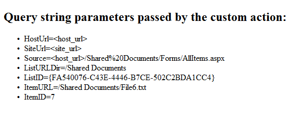

# Criar ações personalizadas para implantar o SharePoint Add-ins
Saiba como criar uma ação personalizada no SharePoint que implanta na Web host quando você implanta um Suplemento do SharePoint.
Quando você estiver criando um Suplemento do SharePoint, ações personalizadas permitem que você interagir com as listas e faixa de opções no web host. Implanta uma ação personalizada na Web de host, quando os usuários finais instalam seu personalizado suplemento ações podem abrir uma página da Web remota e passar informações por meio da seqüência de consulta. Há dois tipos de ações personalizadas disponíveis para suplementos: faixa de opções e oItem de Menu de ações personalizadas.
  
    
    


## Pré-requisitos para uso dos exemplos neste artigo
<a name="SP15Createcustomactionsapps_Prereq"> </a>

Você precisa de um ambiente de desenvolvimento conforme explicado em  [Introdução à criação de suplementos do SharePoint hospedados pelo provedor](get-started-creating-provider-hosted-sharepoint-add-ins.md).
  
    
    

### Conceitos principais para ajudá-lo a entender as ações personalizadas

A tabela a seguir lista os artigos úteis que podem ajudá-lo a entender os conceitos e as etapas envolvidas em um cenário de ação personalizada.
  
    
    

**Tabela 1. Principais conceitos para ações personalizadas**


|**Artigo**|**Descrição**|
|:-----|:-----|
| [Suplementos do SharePoint](sharepoint-add-ins.md) <br/> |Saiba mais sobre o novo modelo suplemento em SharePoint que permite que você crie suplementos, que são pequenas e fácil de usar soluções para usuários finais. <br/> |
| [Design de eu para o SharePoint Add-ins](ux-design-for-sharepoint-add-ins.md) <br/> |Saiba mais sobre a experiência do usuário Opções (eu) que estão disponíveis quando você estiver criando Suplementos do SharePoint. <br/> |
| [Host webs, suplemento webs e componentes do SharePoint no SharePoint 2013](host-webs-add-in-webs-and-sharepoint-components-in-sharepoint-2013.md) <br/> |Saiba mais sobre a diferença entre webs de host e o suplemento webs. Descubra quais componentes SharePoint podem ser incluídos em um Suplemento do SharePoint, quais componentes são implantados na Web de host, quais componentes são implantados na Web de suplemento e como o suplemento web é implantada em um domínio isolado. <br/> |
   

## Exemplo de código: criar uma ação personalizada no host de bibliotecas de documentos da web
<a name="SP15Createcustomactionsapps_Codeexample"> </a>

Siga estas etapas para criar uma ação personalizada nas bibliotecas de documentos host web:
  
    
    

1. Crie o Suplemento do SharePoint e projetos web remoto.
    
  
2. Adicione um recurso de ação personalizada ao projeto Suplemento do SharePoint.
    
  
3. Adicione uma página da Web suplemento ao projeto da web.
    
  

### Para criar o Suplemento do SharePoint e projetos web remoto


1. Abra Visual Studio como administrador. (Para fazer isso, clique com botão direito no ícone Visual Studio no menu **Iniciar** e escolha **Executar como administrador** ).
    
  
2. Crie o hospedado em provedor Suplemento do SharePoint conforme explicado em  [Introdução à criação de suplementos do SharePoint hospedados pelo provedor](get-started-creating-provider-hosted-sharepoint-add-ins.md) e nomeie-oCustomActionsApp.
    
  

### Para adicionar uma suplemento de página da Web para as ações personalizadas


1. Depois que a solução Visual Studio tiver sido criada, clique com botão direito do projeto de aplicativo da web (não o projeto Suplemento do SharePoint ) e adicione um novo formulário da Web, escolhendo **Adicionar** > **Novo Item** > **Web** > **Web Form**. Nome do formulário CustomActionTarget.aspx.
    
  
2. No arquivo CustomActionTarget.aspx, substitua o elemento inteira **html** e é filhos com o seguinte código HTML. Deixe todas as marcações acima do elemento **html** como está. O código HTML contém JavaScript que executa as seguintes tarefas:
    
  - Fornece um espaço reservado para a consulta parâmetros de cadeia de caracteres.
    
  
  - Extrai os parâmetros de seqüência de consulta.
    
  
  - Processa os parâmetros no espaço reservado.
    
  

    > [!IMPORTANTE]
      > Os tokens ItemURL e ItemID apenas obtém passados quando houver um item selecionado. Em uma qualidade de produção Suplemento do SharePoint, seu código precisa para lidar com situações em que nenhum item esteja selecionado. Neste exemplo, o código alerta o usuário que nenhum item foi selecionado.

  ```HTML
  
<html xmlns="http://www.w3.org/1999/xhtml">
<head>
    <title>Custom action target</title>
</head>
<body>
    <h2>Query string parameters passed by the custom action:</h2>

    <!-- Placeholder for query string parameters -->
    <ul id="qsparams"/>

    <!-- Main JavaScript function, renders
         the query string parameters -->
    <script lang="javascript">
        var params = document.URL.split("?")[1].split("&amp;");
        var paramsHTML = "";
      
        // Extracts the parameters from the query string.
        // Parameters are URLencoded, decode for rendering
        // in page.
        for (var i = 0; i < params.length; i = i + 1) {
            params[i] = decodeURIComponent(params[i]);
            paramsHTML += "<li>" + params[i] + "</li>";
        }

         // Alert the user when no item has been selected.
         // (The SPListItemId is the 5th parameter.)
         if (params[5] === undefined) {
            paramsHTML += "<div> <h3> No item has been selected from the list.  Please select an item. </h3> </div> ";
         }

        // Render parameters in the placeholder.
        document.getElementById("qsparams").innerHTML =
            paramsHTML;
    </script>
</body>
</html>
  ```


### Para adicionar uma ação personalizada de item de menu ao projeto Suplemento do SharePoint


1. O projeto Suplemento do SharePoint do mouse em e escolha **Adicionar** > **Novo Item** > **Office/SharePoint** > **Ação do Item de Menu personalizado**.
    
  
2. Mantenha o nome padrão e escolha **Adicionar**.
    
  
3. O assistente **Criar a ação personalizada para o Item de Menu** solicita uma série de perguntas. Dar as respostas da tabela a seguir:
    
   **Tabela 2. Propriedades de ação personalizada de Item de menu**


|**Pergunta de propriedade**|**Atender**|
|:-----|:-----|
|Onde você deseja expor a ação personalizada? <br/> |Escolha **Web Host**. <br/> |
|Onde a ação personalizada destinada a? <br/> |Escolha o **modelo de lista**. <br/> |
|Qual item específico destinada a ação personalizada? <br/> |Escolha **biblioteca de documentos**. <br/> |
|O que é o texto no item de menu? <br/> |Tipo de **minha ação personalizada**. <br/> |
|Onde a ação personalizada navegue até? <br/> |Escolha a página **CustomActionAppWeb\\CustomActionTarget.aspx**. <br/> |
   
4. Escolha **Concluir**.
    
    Visual Studio gerará a seguinte marcação no arquivo Elements. XML do recurso de ação personalizada de item de menu:
    


  ```XML
  
<?xml version="1.0" encoding="utf-8"?>
<Elements 
    xmlns="http://schemas.microsoft.com/sharepoint/">
    <!-- RegistrationId attribute is the list type id,
        in this case, a document library (id=101). -->
  <CustomAction 
      Id="65695319-4784-478e-8dcd-4e541cb1d682.CustomAction"
      RegistrationType="List"
      RegistrationId="101"
      Location="EditControlBlock"
      Sequence="10001"
      Title="Invoke custom action">
    <!-- 
    Update the Url below to the page you want the custom action to use.
    Start the URL with the token ~remoteAppUrl if the page is in the
    associated web project, use ~appWebUrl if page is in the add-in project.
    -->
    <UrlAction Url=
"~remoteAppUrl/CustomActionTarget.aspx?{StandardTokens}&amp;amp;SPListItemId={ItemId}&amp;amp;SPListId={ListId}" />
  </CustomAction>
</Elements>

  ```

5. Adicione os seguintes parâmetros de consulta ao final do atributo **Url** do elemento **UrlAction**:
    
     `&amp;amp;SPSource={Source}&amp;amp;SPListURLDir={ListUrlDir}&amp;amp;SPItemURL={ItemUrl}`
    
    O elemento **UrlAction** deve parecer com o seguinte:
    
     ` <UrlAction Url= "~remoteAppUrl/CustomActionTarget.aspx?{StandardTokens}&amp;amp;SPListItemId={ItemId}&amp;amp;SPListId={ListId}&amp;amp;SPSource={Source}&amp;amp;SPListURLDir={ListUrlDir}&amp;amp;SPItemURL={ItemUrl}" />`
    
  

> [!OBSERVAçãO]
> Neste exemplo, a página da web remoto abre em uma janela inteira quando o usuário seleciona a ação personalizada no menu. Ações de menus personalizada também podem abrir uma página da Web remota em uma caixa de diálogo usando o atributo **HostWebDialog**. Para obter mais informações, consulte [SharePoint-adicionar-em-localização](https://github.com/OfficeDev/SharePoint-Add-in-Localization).
  
    
    


### Para adicionar uma ação personalizada da faixa de opções ao projeto Suplemento do SharePoint


1. O projeto Suplemento do SharePoint do mouse em e escolha **Adicionar** > **Novo Item** > **Office/SharePoint** > **A ação personalizada da faixa de opções**.
    
  
2. Mantenha o nome padrão e escolha **Adicionar**.
    
  
3. O assistente **Criar a ação personalizada para a faixa de opções** solicita uma série de perguntas. Dar as respostas da tabela a seguir:
    
   **Tabela 3. Propriedades de ação personalizada da faixa de opções**


|**Pergunta de propriedade**|**Atender**|
|:-----|:-----|
|Onde você deseja expor a ação personalizada? <br/> |Escolha **Web Host**. <br/> |
|Onde a ação personalizada destinada a? <br/> |Escolha o **modelo de lista**. <br/> |
|Qual item específico destinada a ação personalizada? <br/> |Escolha **biblioteca de documentos**. <br/> |
|Onde o controle está localizado? <br/> |Escolha **Ribbon.Documents.Manage**. <br/> |
|O que é o texto no item de menu? <br/> |Tipo de **Meu botão da faixa de opções personalizada**. <br/> |
|Onde a ação personalizada navegue até? <br/> |Escolha a página **CustomActionAppWeb\\CustomActionTarget.aspx**. <br/> |
   
4. Visual Studio gerará a seguinte marcação no arquivo Elements. XML do recurso de ação personalizada da faixa de opções:
    
  ```XML
  
<?xml version="1.0" encoding="utf-8"?>
<Elements xmlns="http://schemas.microsoft.com/sharepoint/">
  <CustomAction Id="85691508-c076-4f43-93d4-96b4d5253a09.RibbonCustomAction1"
                RegistrationType="List"
                RegistrationId="101"
                Location="CommandUI.Ribbon"
                Sequence="10001"
                Title="Invoke &amp;apos;RibbonCustomAction1&amp;apos; action">
    <CommandUIExtension>
      <!-- 
      Update the UI definitions below with the controls and the command actions
      that you want to enable for the custom action.
      -->
      <CommandUIDefinitions>
        <CommandUIDefinition Location="Ribbon.Documents.Manage.Controls._children">
          <Button Id="Ribbon.Documents.Manage.RibbonCustomAction1Button"
                  Alt="My Custom Ribbon Button"
                  Sequence="100"
                  Command="Invoke_RibbonCustomAction1ButtonRequest"
                  LabelText="My Custom Ribbon Button"
                  TemplateAlias="o1"
                  Image32by32="_layouts/15/images/placeholder32x32.png"
                  Image16by16="_layouts/15/images/placeholder16x16.png" />
        </CommandUIDefinition>
      </CommandUIDefinitions>
      <CommandUIHandlers>
        <CommandUIHandler Command="Invoke_RibbonCustomAction1ButtonRequest"
                          CommandAction="~remoteAppUrl/CustomActionTarget.aspx?{StandardTokens}&amp;amp;SPListItemId={SelectedItemId}&amp;amp;SPListId={SelectedListId}"/>
      </CommandUIHandlers>
    </CommandUIExtension >
  </CustomAction>
</Elements> 

  ```

5. Adicione os seguintes parâmetros de consulta ao final do atributo **CommandAction** do elemento **CommandUIHandler**:
    
     `&amp;amp;SPSource={Source}&amp;amp;SPListURLDir={ListUrlDir}`
    
    O elemento **CommandUIHandler** deve parecer com o seguinte:
    
     ` <CommandUIHandler Command="Invoke_RibbonCustomAction1ButtonRequest" CommandAction="~remoteAppUrl/CustomActionTarget.aspx?{StandardTokens}&amp;amp;SPListItemId={SelectedItemId}&amp;amp;SPListId={SelectedListId}&amp;amp;SPSource={Source}&amp;amp;SPListURLDir={ListUrlDir}" />`
    
    > [!OBSERVAçãO]
      > Ações de faixa de opções personalizadas usam **SelectedListId** e **SelectedItemId**. **ListId** e **ItemId** funcionam somente com ações personalizadas do item de menu.

### Definir a página inicial do suplemento para a home page do host web


1. A amostra contínuos Suplemento do SharePoint não tem qualquer suplemento web e seu aplicativo web remoto existe somente para hospedar o formulário. Portanto, a página inicial do add-in deve ser definida para a home page da web host.
    
    Para começar, selecione o projeto Suplemento do SharePoint (não o projeto de aplicativo web) no **Solution Explorer** e copie o valor da propriedade **URL do Site**, incluindo o protocolo (por exemplo **https://contoso.sharepoint.com** ) na área de transferência.
    
  
2. Abra o manifesto do add-in e, em seguida, cole a URL na caixa **Start Page**.
    
  
3. Opcionalmente, você pode excluir a página Default. aspx do projeto do aplicativo web, porque ele não é usado no Suplemento do SharePoint.
    
  

### Para criar e executar a solução


1. Pressione a tecla F5.
    
    > [!OBSERVAçãO]
      > Quando você pressiona F5, Visual Studio aproveita a solução, implanta o suplemento e abre a página de permissões para o suplemento.
2. Escolha o botão **De confiança**. Abre a página padrão do seu site do desenvolvedor.
    
  
3. Navegue até qualquer biblioteca de documentos na web host.
    
   **Iniciando uma ação de menu personalizado**

  

     
  

  

  
4. Escolha o botão de texto explicativo ( **…** ) para qualquer documento. O texto explicativo é aberta.
    
  
5. Escolha o botão de texto explicativo ( **…** ) no texto explicativo.
    
  
6. Escolha **avançadas**.
    
  
7. Escolha **Meu ação de Menu personalizado** no menu de contexto. Você verá algo parecido com o seguinte na página da Web remota que abre:
    
   **Webpage remoto com parâmetros da ação personalizada**

  

     
  

  

  
8. Clique no botão **Voltar** no navegador para voltar à biblioteca.
    
   **Iniciando uma ação personalizada da faixa de opções**

  

     
  

  

  
9. Selecione qualquer documento.
    
  
10. Abra a guia **arquivo**, na faixa de opções.
    
  
11. Escolha **Meu botão da faixa de opções personalizada**. Você vê a mesma página da web remoto.
    
  

**Tabela 4. A solução de problemas**


|**Problema**|**Solução**|
|:-----|:-----|
|Visual Studio não abra o navegador depois que você pressionar a tecla F5. <br/> |Defina o projeto de Suplemento do SharePoint como o projeto de inicialização. <br/> |
|Os tokens na URL não serão resolvidos depois que você pressionar a tecla F5 no Visual Studio. <br/> |Vá para a página de **Conteúdo do Site** da web host e clique no ícone para seu suplemento. <br/> |
   

## Próximas etapas
<a name="SP15Createcustomactionsapps_Nextsteps"> </a>

Este artigo demonstrado como criar uma ação personalizada em um Suplemento do SharePoint. Como próxima etapa, você pode aprender sobre outros componentes eu que estão disponíveis para Suplementos do SharePoint. Para saber mais, consulte o seguinte:
  
    
    

-  [Amostra de código: abrir uma página de suplemento remota usando uma ação personalizada de ECB](http://code.msdn.microsoft.com/SharePoint-2013-Open-e0ca1826)
    
  
-  [SharePoint-Add-in-Localization](https://github.com/OfficeDev/SharePoint-Add-in-Localization)
    
  
-  [Código de exemplo: Use as ações personalizadas e a biblioteca de domínio cruzado a ordem de livros](http://code.msdn.microsoft.com/SharePoint-2013-Open-a-36d1598d)
    
  
-  [Use a folha de estilos de um site SharePoint no SharePoint Add-ins](use-a-sharepoint-website-s-style-sheet-in-sharepoint-add-ins.md)
    
  
-  [Use o controle de cromo do cliente no SharePoint Add-ins](use-the-client-chrome-control-in-sharepoint-add-ins.md)
    
  
-  [Criar partes do suplemento para instalar com o SharePoint Add-in](create-add-in-parts-to-install-with-your-sharepoint-add-in.md)
    
  

## Recursos adicionais
<a name="SP15Createcustomactionsapps_AddResources"> </a>


-  [Configurar um ambiente de desenvolvimento local para suplementos do SharePoint](set-up-an-on-premises-development-environment-for-sharepoint-add-ins.md)
    
  
-  [Design de eu para o SharePoint Add-ins](ux-design-for-sharepoint-add-ins.md)
    
  
-  [Diretrizes de design UX de suplementos do SharePoint](sharepoint-add-ins-ux-design-guidelines.md)
    
  
-  [Criar componentes UX do SharePoint 2013](create-ux-components-in-sharepoint-2013.md)
    
  
-  [Três maneiras de pensar sobre opções de design para o SharePoint Add-ins](three-ways-to-think-about-design-options-for-sharepoint-add-ins.md)
    
  
-  [Aspectos importantes do Add-in SharePoint arquitetura e desenvolvimento cenário](important-aspects-of-the-sharepoint-add-in-architecture-and-development-landscap.md)
    
  

