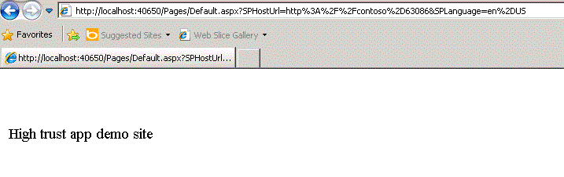

# Criar o SharePoint de alta confiança Add-ins
Saiba como criar uma alta confiança Suplemento do SharePoint. Um suplemento de alta confiança usa certificados digitais para estabelecer uma relação de confiança entre o aplicativo da web remoto e SharePoint 2013. Suplementos de alta confiança só podem ser instalados no local do SharePoint, não para Microsoft SharePoint Online, e eles se destinam principalmente para uso com um local, em vez de aplicativo web baseado em nuvem.
## Pré-requisitos para a criação de suplementos de alta confiança
<a name="Prereqs"> </a>

Para seguir os procedimentos neste artigo, certifique-se de que você tem o seguinte:
  
    
    

- Um ambiente de desenvolvimento de SharePoint 2013 local. Consulte  [Configurar um ambiente de desenvolvimento local para suplementos do SharePoint](set-up-an-on-premises-development-environment-for-sharepoint-add-ins.md) para ver as instruções de instalação. Em particular, certifique-se de que você concluiu as etapas na seção [Configurar serviços no SharePoint para uso de suplementos de servidor para servidor](set-up-an-on-premises-development-environment-for-sharepoint-add-ins.md#Servertoserver).
    
  
- Experiência de criação de um provedor hospedado Suplemento do SharePoint. Consulte  [Introdução à criação de suplementos do SharePoint hospedados pelo provedor](get-started-creating-provider-hosted-sharepoint-add-ins.md).
    
  
- Visual Studio instalado remotamente ou no computador onde você instalou SharePoint 2013.
    
  
- Microsoft Office Developer Tools for Visual Studio.
    
  
- Familiaridade com certificados digitais — o que são e como usá-los.
    
  
Leia os artigos a seguir para obter uma compreensão melhor dos certificados digitais e Suplementos do SharePoint.
  
    
    

**Tabela 1. Conceitos principais para configurar SharePoint 2013 para executar os suplementos de alta confiança**


|**Título do artigo**|**Descrição**|
|:-----|:-----|
| [Introdução à criação de suplementos do SharePoint hospedados pelo provedor](get-started-creating-provider-hosted-sharepoint-add-ins.md) <br/> |Saiba como criar um básico hospedado em provedor Suplemento do SharePoint com o Office Developer Tools for Visual Studio, como interagir com sites SharePoint 2013 usando CSOM do SharePoint. <br/> |
| [Digital Certificates](http://msdn.microsoft.com/library/e523b335-0156-4f47-b55c-b80495587c4f.aspx) e [Working with Certificates](http://msdn.microsoft.com/library/6ffb8682-8f07-4a45-afbb-8d2487e9dbc3.aspx) <br/> |Saiba as ideias básicas por trás de certificados digitais. <br/> |
   

## Introdução à execução de suplementos de alta confiança
<a name="Intro"> </a>

Um suplemento de alta confiança é um provedor hospedado Suplemento do SharePoint que usa os certificados digitais para estabelecer confiança entre o SharePoint e o aplicativo da web remoto. "Alta confiança" não é o mesmo que "confiança total". Um suplemento de alta confiança ainda deverá solicitar permissões do suplemento. O suplemento é considerado "alta confiança", porque ele é confiável para usar qualquer identidade de usuário que o suplemento precisa, porque o suplemento é responsável por criar a parte de usuário do token de acesso que ele passa para o SharePoint.
  
    
    
Uma alta confiança Suplemento do SharePoint é destinado principalmente para uso em um ambiente local. O suplemento de alta confiança não pode ser instalado em Microsoft SharePoint Online e os componentes remotos são normalmente instalados localmente, também, dentro do firewall corporativo. Assim, as instâncias do Suplemento do SharePoint são específicas para cada empresa.
  
    
    
Um suplemento de alta confiança usa um certificado em vez de um token de contexto para estabelecer a confiança. (Um hospedado em provedor suplemento que é criado para usar Microsoft Azure Access Control Service (ACS) como seu broker confiança precisa ser modificado para funcionar como um aplicativo de alta confiança.) Suplementos de alta confiança exigem alguma configuração no farm do SharePoint e no servidor que hospeda o aplicativo web remoto. Este tópico descreve as etapas de configuração necessárias para obter Visual Studio depuração de trabalho ( **F5** ). Configurando um ambiente de teste, de preparo ou de produção são um pouco diferente e são descritos no tópico [Embalar e publicar Add-ins do SharePoint de alta confiança](package-and-publish-high-trust-sharepoint-add-ins.md).
  
    
    
Em SharePoint 2013, o serviço de token de segurança do servidor-para-servidor (STS) fornece tokens de acesso para autenticação de servidor-para-servidor. O STS de servidor-para-servidor habilita os tokens de acesso temporário acessar outros serviços de aplicativos como Exchange 2013, Lync 2013 e suplementos para SharePoint 2013. Você estabelece uma relação de confiança entre os serviços de aplicativo (por exemplo, estabelecer confiança entre o SharePoint e um suplemento remoto) usando os cmdlets Windows PowerShell e um certificado.
  
    
    

> **OBSERVAçãO**
> O STS de servidor-para-servidor não é destinado a autenticação do usuário. Portanto, você não verá o STS de servidor-para-servidor listado na usuário entrar página, na seção de **Provedor de autenticação** na Administração Central, ou no seletor de pessoas no SharePoint 2013.
  
    
    

Este artigo mostra como criar um suplemento de alta confiança e fornece instruções de instalação para executá-lo em Visual Studio pressionando **F5**. Você aprenderá a:
  
    
    

- Configure um suplemento para uso como um suplemento de alta confiança.
    
  
- Configure SharePoint 2013 para usar os suplementos de alta confiança.
    
  
- Crie um suplemento de alta confiança básico.
    
  

## Obtenha um certificado ou criar um certificado de teste de públicos e particulares
<a name="Cert2"> </a>

É necessário um certificado digital de x. 509 para o aplicativo web remoto do seu suplemento de alta confiança. Para testar completamente sua Suplemento do SharePoint, você precisa de um certificado emitido por domínio ou um certificado comercial emitido por uma autoridade de certificação. No entanto, para a fase inicial de depuração, você pode usar um certificado autoassinado. O procedimento a seguir descreve como criar e exportar um certificado de teste usando o IIS. Você aprenderá como substituir o certificado autoassinado com um certificado emitido por domínio ou comercial na seção  [Conclua a depuração com um domínio emitido ou certificados comerciais](#NewCertificate) abaixo.
  
    
    
Como alternativa, você também pode usar o programa de teste MakeCert para gerar um certificado x. 509. Para obter mais informações sobre como usar MakeCert, consulte  [Signing e verificando códigos com Authenticode](http://msdn.microsoft.com/en-us/library/ms537364%28VS.85%29.aspx).
  
    
    
Você vai criar um arquivo de certificado. pfx teste primeiro e, em seguida, um correspondente testar o arquivo. cer. O certificado. pfx contém a chave privada usada pelo aplicativo web remoto para assinar sua comunicação com o SharePoint. A. cer contém a chave pública que o SharePoint usa para descriptografar as mensagens, verifique se eles vêm da aplicação web remoto e verifique se o aplicativo web remoto tem um token de acesso de um emissor de token que confie do SharePoint. Para obter mais informações sobre os arquivos. pfx e. cer, consulte  [Certificado de editor de Software](http://msdn.microsoft.com/en-us/library/windows/hardware/ff552299%28v=vs.85%29.aspx)
  
    
    

### Para criar um arquivo de certificado autoassinado test. pfx


1. Quando você estiver depurando um de alta confiança Suplemento do SharePoint em Visual Studio, o aplicativo web remoto é hospedado no IIS Express na máquina onde Visual Studio está instalado. Portanto, o computador de aplicativos web remoto não tem um Gerenciador do IIS onde você pode criar o certificado. Por esse motivo, você usar o IIS no servidor de teste do  *SharePoint*  para criar o certificado. No Gerenciador do IIS, selecione o nó de _ServerName_ na exibição em árvore à esquerda.
    
  
2. Selecione o ícone de **Certificados de servidor**, conforme mostrado na Figura 1.
    
   **Figura 1. Opção de certificados de servidor no IIS**

  

     
  

  

  
3. Selecione o link **Criar certificado autoassinado** do conjunto de links no lado direito, conforme mostrado na Figura 2.
    
   **Figura 2. Criar certificado autoassinado link**

  

     
  

  

  
4. Nomeie o certificado HighTrustSampleCerte escolha **OK**.
    
  
5. Com o botão direito no certificado e selecione **Exportar**, conforme mostrado na Figura 3.
    
   **Figura 3. Exportando um certificado de teste**

  

     
  

  

  
6. No Windows, ou na linha de comando, crie uma pasta chamada C:\\Certs.
    
  
7. Voltar no Gerenciador do IIS, exporte o arquivo para C:\\Certs e dê a ela uma senha. Neste exemplo, a senha é a **senha**.
    
  
8. Se o teste de instalação do SharePoint não estiver no mesmo computador onde o Visual Studio está sendo executado, crie uma pasta C:\\Certs no computador Visual Studio e mova o arquivo de HighTrustSampleCert.pfx a ela. Este é o computador onde o aplicativo da web remoto é executado quando você estiver depurando no Visual Studio.
    
  

### Para criar um arquivo. cer correspondente


1. No servidor do SharePoint, certifique-se de que a identidade do pool do suplemento para os pools seguintes do add-in IIS leu direitos à pasta C:\\Certs:
    
  - **SecurityTokenServiceApplicationPool**
    
  
  - O suplemento do pool que serve o site do IIS que hospeda o pai de aplicativo web do SharePoint para o seu site do SharePoint de teste. Para o site do IIS do **SharePoint - 80**, o pool é chamado **OServerPortalAppPool**.
    
  
2. No Gerenciador do IIS, selecione o nó de  _ServerName_ na exibição em árvore à esquerda.
    
  
3. Clique duas vezes em **Certificados de Servidor**.
    
  
4. No modo de exibição de **Certificados de servidor**, clique duas vezes em **HighTrustSampleCert** para exibir os detalhes do certificado.
    
  
5. Na guia **detalhes**, escolha **Copiar para arquivo** para iniciar o **Assistente para exportação de certificado** e escolha **Avançar**.
    
  
6. Use o valor padrão **não, não exportar a chave privada** e escolha **Avançar**.
    
  
7. Use os valores padrão. Escolha **Avançar**.
    
  
8. Escolha **Procurar**, navegue até C:\\Certs, o nome do certificado **HighTrustSampleCert** e escolha **Salvar**. O certificado é salvo como um arquivo. cer.
    
  
9. Escolha **OK**.
    
  
10. Escolha **Concluir**.
    
  

## Configurar SharePoint 2013 para usar certificados e configurar uma confiança para seu suplemento
<a name="Configure2"> </a>

O script Windows PowerShell que você criar nesta seção destina-se para suportar o uso de **F5** em Visual Studio. Ela será *não*  configurar corretamente uma instalação do SharePoint de preparo ou de produção. Para obter instruções sobre como configurar uma produção do SharePoint para usar certificados, consulte [Embalar e publicar Add-ins do SharePoint de alta confiança](package-and-publish-high-trust-sharepoint-add-ins.md).
  
    
    

> **OBSERVAçãO**
> Confirme que você tenha concluído as etapas em  [Configurar serviços no SharePoint para uso de suplementos de servidor para servidor](set-up-an-on-premises-development-environment-for-sharepoint-add-ins.md#Servertoserver) (que está listado como um pré-requisito para este artigo). Caso contrário, você deve configurá-lo agora, antes de prosseguir.
  
    
    


### Para configurar o SharePoint


1. Em um editor de texto ou um editor de Windows PowerShell, inicie um novo arquivo e adicione as seguintes linhas a ele para criar um objeto de certificado:
    
  ```
  
$publicCertPath = "C:\\Certs\\HighTrustSampleCert.cer"
$certificate = New-Object System.Security.Cryptography.X509Certificates.X509Certificate2($publicCertPath)

  ```

2. Adicione a seguinte linha para garantir que o SharePoint trata o certificado como uma autoridade raiz.
    
  ```
  
New-SPTrustedRootAuthority -Name "HighTrustSampleCert" -Certificate $certificate

  ```

3. Adicione a seguinte linha para obter a ID do realm autorização.
    
  ```
  
$realm = Get-SPAuthenticationRealm

  ```

4. Seu aplicativo web remoto usará um token de acesso para obter acesso aos dados do SharePoint. O token de acesso deve ser emitido por um emissor de token que confie do SharePoint. Em uma alta confiança Suplemento do SharePoint, o certificado é o emissor de token. Adicione as seguintes linhas para construir uma ID de emissor no formato SharePoint requer: ** _specific_issuer_GUID_@ _realm_GUID_**.
    
  ```
  
$specificIssuerId = "11111111-1111-1111-1111-111111111111"
$fullIssuerIdentifier = $specificIssuerId + '@' + $realm 

  ```


    > **OBSERVAçãO**
      > O valor de  `$specificIssuerId` deve ser um GUID, pois em um ambiente de produção, cada certificado deve ter um emissor exclusivo. No entanto, nesse contexto, onde você usar o mesmo certificado para depurar todos os seus suplementos de alta confiança, você pode codificar o valor. Se por alguma razão, você usa um GUID diferente daquele usado aqui, * **Certifique-se de que todas as letras na GUID são letras minúsculas*** . A infraestrutura do SharePoint requer atualmente em minúsculas para GUIDs de emissor de certificado.
5. Adicione as seguintes linhas para registrar o certificado como um emissor de token confiável. O parâmetro  `-Name` deve ser exclusivo, portanto, em uma configuração de produção, é usar um GUID, como parte (ou todos) do nome comum, mas nesse contexto, você pode usar um nome amigável. A opção `-IsTrustBroker` é necessária para garantir que você pode usar o mesmo certificado para todos os suplementos de alta confiança que desenvolver. O comando `iisreset` é obrigatória para tornar seu emissor de token registrado imediatamente. Sem ele, você pode precisar esperar até 24 horas para o emissor de novo a ser registrado.
    
  ```
  
New-SPTrustedSecurityTokenIssuer -Name "High Trust Sample Cert" -Certificate $certificate -RegisteredIssuerName $fullIssuerIdentifier -IsTrustBroker
iisreset 

  ```

6. SharePoint 2013 não aceita certificados autoassinados normalmente. Portanto, quando você estiver usando um certificado autoassinado para depuração, adicione as seguintes linhas para desativar o requisito de normal do SharePoint HTTPS ser usado quando os aplicativos web remoto chamam SharePoint. Caso contrário, em seguida, você receberá uma mensagem **403 (proibido)** quando o aplicativo web remoto chama o SharePoint usando um certificado autoassinado. Você irá reverter esta etapa em um procedimento posterior. Desativar o HTTPS requisito significa que as solicitações do aplicativo web remoto para SharePoint não são criptografadas, mas o certificado ainda é usado como um emissor confiável de tokens de acesso, que é o seu objetivo principal em alta confiança Suplementos do SharePoint.
    
  ```
  
$serviceConfig = Get-SPSecurityTokenServiceConfig
$serviceConfig.AllowOAuthOverHttp = $true
$serviceConfig.Update()

  ```

7. Salve o arquivo com o nome HighTrustConfig-ForDebugOnly.ps1.
    
  
8. Abra o **Shell de gerenciamento do SharePoint** como um administrador e execute o arquivo com a seguinte linha:
    
  ```
  
./HighTrustConfig-ForDebugOnly.ps1
  ```


## Criar uma alta confiança Suplemento do SharePoint
<a name="Createapp2"> </a>

Nesta seção, você saiba como criar uma alta confiança Suplemento do SharePoint usando Visual Studio.
  
    
    

> **OBSERVAçãO**
> Conforme mencionado na seção  [pré-requisitos para a criação de suplementos de alta confiança](#Prereq) , este artigo pressupõe que você saiba como criar um provedor hospedado Suplemento do SharePoint. Para obter mais informações, consulte [Introdução à criação de suplementos do SharePoint hospedados pelo provedor](get-started-creating-provider-hosted-sharepoint-add-ins.md).
  
    
    


### Para criar uma alta confiança Suplemento do SharePoint


1. No Visual Studio, escolha **arquivo**, **novo** **projeto**.
    
  
2. No assistente **Novo projeto**, expanda o nó do **Visual c#** ou **Visual Basic** e expanda o nó **Office/SharePoint**.
    
  
3. Escolha **suplementos** e escolha criar um projeto de **suplemento para o SharePoint**.
    
  
4. Nome do projeto HighTrustSampleApp.
    
  
5. Salve o projeto em um local que você escolher e escolha **OK**.
    
  
6. Especifique a URL completa do site de desenvolvedor do SharePoint. Por exemplo, http://TestServer/sites/devsite/
    
  
7. Selecione a opção **hospedado em provedor** e, em seguida, escolha o botão **Avançar**.
    
  
8. Se você for solicitado para especificar o tipo de projeto da web, selecione o **Aplicativo de formulários de Web do ASP.NET** para o exemplo contínuo neste tópico e escolha o botão **Avançar**.
    
  
9. A página **Configurar definições de autenticação** do assistente é aberta. Os valores que você pode adicionar a este formulário serão adicionados automaticamente ao arquivo Web. config. Sob **como você deseja que seu suplemento para autenticar?**, escolha **usar um certificado**.
    
  
10. Clique no botão **Procurar** ao lado da caixa de **local do certificado** e navegue até o local do certificado autoassinado (arquivo. pfx) que você criou (C:\\Certs). O valor desse campo deve ser o caminho completoC:\\Certs\\HighTrustSampleCert.pfx.
    
  
11. Digite a senha para esse certificado na caixa **senha**. Nesse caso, é "senha".
    
  
12. Digite a ID de emissor ( `11111111-1111-1111-1111-111111111111`) na caixa **ID do emissor**.
    
  
13. Escolha **Concluir**. Grande parte da configuração é feito quando a solução será aberta. Dois projetos são criados na solução Visual Studio, um para o Suplemento do SharePoint e o outro para o aplicativo da web ASP.NET.
    
  

### Para executar e depurar o suplemento


1. Office Developer Tools for Visual Studio gera automaticamente um arquivo default. aspx e default.aspx.cs quando o projeto ASP.NET é criado. O código gerado busca o título da web host do SharePoint e imprime a ele na página padrão do aplicativo web remoto. A marcação exata e código nesses arquivos varia dependendo da versão das ferramentas. Para este tópico, você pode usar o default. aspx gerado e os arquivos de default.aspx.cs sem modificação.
    
  
2. Para testar o Suplemento do SharePoint e seu aplicativo web remoto, pressione **F5** no Visual Studio. O aplicativo web será implantado para expressar o IIS em *localhost*  . O Suplemento do SharePoint será instalado para o site do SharePoint de destino. Você será solicitado pelo SharePoint para conceder as permissões que o Suplemento do SharePoint solicitações. Algumas versões do Office Developer Tools for Visual Studio serão iniciado imediatamente o suplemento, outras pessoas abrirá a página de **Conteúdo do Site** do seu site do SharePoint de destino e você verá o novo suplemento listado.
    
    Inicie o suplemento, se ele não será iniciado automaticamente. O aplicativo web remoto abre a página que é especificado como a **Página inicial** no arquivo AppManifest.xml, que é default. aspx. Seu suplemento deve parecer semelhante a Figura 4.
    

   **Figura 4. Exemplo de suplemento chamando o SharePoint Server e recuperando o título da web host do SharePoint.**

  

     
  

  

  

## Conclua a depuração com um domínio emitido ou certificados comerciais
<a name="NewCertificate"> </a>

O script Windows PowerShell que você criou anteriormente desativado requisito usual do SharePoint, que os aplicativos web remoto usam o protocolo HTTPS para acessar o SharePoint. Trabalhando com HTTPS desativado pode causar como um desenvolvedor de perder certos problemas quando construir um suplemento que poderia ocorrer durante a implantação de produção onde HTTPS é necessário. Apropriadamente, você não deve considerar o desenvolvimento e depuração de fases concluídas até ter substituído o certificado de teste com um certificado emitido por domínio ou comercial e retestados, em seguida, o suplemento com o requisito de HTTPS ativado.
  
    
    
Quando você tiver obtido o novo certificado, você precisará adicionar uma senha para ele, se ele ainda não possua um. Em um ambiente de produção, você usaria uma senha forte, mas para um Suplemento do SharePoint de depuração, você pode usar qualquer coisa. Você precisará do certificado em dois formatos, pfx e cer. Se não estiver no formato pfx quando você obtê-lo, você pode precisar convertê-lo em pfx usando um utilitário. Quando você tem um arquivo pfx, você pode importá-lo para o IIS e exportar o arquivo cer, conforme descrito no procedimento a seguir.
  
    
    

### Para importar o novo certificado


1. Coloque o arquivo. pfx no C:\\Certs no servidor do SharePoint. para fins deste artigo, vamos pressupor que o arquivo é chamado  _MyCert_pfx. Você deve substituir "MyCert" em todas essas instruções com o nome real do seu certificado.
    
  
2. No Gerenciador do IIS, selecione o nó de  _ServerName_ na exibição em árvore à esquerda.
    
  
3. Clique duas vezes no ícone de **Certificados de servidor**.
    
  
4. Selecione **Importar** no painel **ações**, à direita.
    
  
5. Na caixa de diálogo **Importar certificado**, use o botão Procurar para navegar até C:\\Certs\\ _MyCert_pfx e digite a senha do certificado.
    
  
6. Certifique-se de que **permite que o certificado a ser exportado** está habilitado e clique em **OK**.
    
  
7. Na lista de **Certificados de servidor**, clique com botão direito no certificado e selecione **Exportar**, conforme mostrado na Figura 3 acima.
    
  
8. Exportar o arquivo para C:\\Certs e especifique sua senha.
    
  
9. Se o teste de instalação do SharePoint não estiver no mesmo computador onde o Visual Studio está sendo executado, mova o arquivo. pfx  _MyCert_para a pasta C:\\Certs no computador Visual Studio.
    
  
10. No modo de exibição de **Certificados de servidor**, clique duas vezes em  _MyCert_ para exibir os detalhes do certificado.
    
  
11. Na guia **detalhes**, escolha **Copiar para arquivo** para iniciar o **Assistente para exportação de certificado** e escolha **Avançar**.
    
  
12. Use o valor padrão **não, não exportar a chave privada** e escolha **Avançar**.
    
  
13. Use os valores padrão. Escolha **Avançar**.
    
  
14. Escolha **Procurar**, navegue até C:\\Certs, o nome do certificado  _MyCert_e escolha **Salvar**. O certificado é salvo como um arquivo. cer.
    
  
15. Escolha **OK**.
    
  
16. Escolha **Concluir**.
    
  

### Para configurar SharePoint 2013 para usar o novo certificado


1. Abra o HighTrustConfig-ForDebugOnly.ps1file para edição e faça as seguintes alterações:
    
1. Substitua  `HighTrustSampleCert` em ambos os lugares onde ela aparece _MyCert_.
    
  
2. Substitua o ID de emissor específico,  `11111111-1111-1111-1111-111111111111`,  `22222222-2222-2222-2222-222222222222`.
    
  
3. Substitua "Alta confiança amostra Cert" a "Meu Cert" ou algum outro nome amigável apropriado.
    
  
4. A linha  `$serviceConfig.AllowOAuthOverHttp = $false`, substitua o  `false` pelo `true`. Isso ativará novamente o requisito que HTTPS seja usado.
    
  
2. Salve o arquivo.
    
  
3. Abra o **Shell de gerenciamento do SharePoint** como um administrador e execute o arquivo com a seguinte linha:
    
  ```
  ./HighTrustConfig-ForDebugOnly.ps1
  ```


### Para reconfigurar o aplicativo web remoto


1. Na Visual Studio, abra o arquivo Web. config do projeto de aplicativo da web e faça as seguintes alterações:
    
1. Na chave  `ClientSigningCertificatePath` , substitua `C:\\Certs\\HighTrustSampleCert.pfx` `C:\\Certs\\` _MyCert_ `.pfx`.
    
  
2. Substitua o valor da chave  `ClientSigningCertificatePassword` a senha real do certificado.
    
  
3. Substitua o valor da chave  `IssuerId` `22222222-2222-2222-2222-222222222222`.
    
  
2. Pressione **F5** para depurar o suplemento.
    
  
Quando você estiver desenvolvendo o alta confiança add-in, check  [Embalar e publicar Add-ins do SharePoint de alta confiança](package-and-publish-high-trust-sharepoint-add-ins.md) para obter instruções sobre como empacotar e publicar esse tipo de Suplemento do SharePoint.
  
    
    

## O que os arquivos TokenHelper e SharePointContext fazer?
<a name="TokenHelper"> </a>

Office Developer Tools for Visual Studio inclui um arquivo TokenHelper.cs (ou. vb) no aplicativo web remoto. Algumas versões das ferramentas também incluem um arquivo SharePointContext.cs (ou. vb). O código nesses arquivos faz o seguinte:
  
    
    

- Configure .NET para confiar em certificados ao fazer chamadas de rede.
    
  
- Recupere um token de acesso de servidor-para-servidor que está assinado por um certificado privado do aplicativo da web remoto em nome do objeto especificado **WindowsIdentity** e que o SharePoint 2013 usa para estabelecer a confiança.
    
  
- Obtenha o certificado de segurança (STS) de serviço de token do SharePoint.
    
  
- Em suplementos que usam a confiança de baixa em vez do sistema de autorização de alta confiança, esses arquivos têm tarefas adicionais, como a manipulação de tokens OAuth para o cenário descrito em  [Fluxo do OAuth Token de contexto para o SharePoint Add-ins](context-token-oauth-flow-for-sharepoint-add-ins.md). Esse cenário está fora do escopo deste artigo.
    
  
Para obter mais detalhes sobre TokenHelper e SharePointContext, consulte os comentários nos arquivos.
  
    
    
Em um suplemento alta confiança, não há nenhum token de contexto. O token de contexto é específico às configurações que usam authorizaton baixa confiança. No entanto, um token de acesso ainda é necessário. Se você estiver usando uma configuração de alta confiança, seu aplicativo web possui que autenticar o usuário, assim como o SharePoint (ou seja, o suplemento é responsável por criar o token de acesso, incluindo as IDs do usuário e o provedor de identidade).
  
    
    
Quando você estiver depurando no Visual Studio com **F5**, Microsoft Office Developer Tools for Visual Studio usa a autenticação do Windows e os dois arquivos de código gerado usam a identidade do Windows da pessoa executando o suplemento para criar o token de acesso. Quando seu suplemento é publicado, você precisará configurar o aplicativo web remoto no Gerenciador do IIS para usar a autenticação do Windows, se você deseja usar os dois arquivos gerados sem modificação. Se seu suplemento não usará a autenticação do Windows no ambiente de produção, você precisará personalizar os arquivos de código gerado, TokenHelper e/ou SharePointContext, usar um sistema de autenticação diferente. Você também seria personalizar esses arquivos se seu aplicativo web remoto acessa o SharePoint em uma identidade que não seja o usuário que está executando o Suplemento do SharePoint. Finalmente, se o aplicativo web remoto for PHP, Node. js, Java ou alguma outra plataforma de não-ASP.NET, então seu código precisa obter a ID do usuário de autenticação de qualquer sistema está sendo usada e adicione que ID para o token de acesso ele construções. Para obter mais informações, consulte  [Embalar e publicar Add-ins do SharePoint de alta confiança](package-and-publish-high-trust-sharepoint-add-ins.md),  [Criar e usar os tokens de acesso no hospedado em provedor alta confiança SharePoint suplementos](create-and-use-access-tokens-in-provider-hosted-high-trust-sharepoint-add-ins.md) e [usando o SharePoint suplementos com SAML e FBA Sites no SharePoint 2013](http://blogs.technet.com/b/speschka/archive/2012/12/07/using-sharepoint-apps-with-saml-and-fba-sites-in-sharepoint-2013.aspx).
  
    
    

## Recursos adicionais
<a name="bk_addresources"> </a>


-  [Embalar e publicar Add-ins do SharePoint de alta confiança](package-and-publish-high-trust-sharepoint-add-ins.md)
    
  
-  [Dicas de solução de alta confiança complementos no SharePoint 2013](http://blogs.technet.com/b/speschka/archive/2012/11/01/more-troubleshooting-tips-for-high-trust-apps-on-sharepoint-2013.aspx)
    
  
-  [Registrar o SharePoint 2013 de suplementos](register-sharepoint-add-ins-2013.md)
    
  
-  [Autorização e autenticação do SharePoint Add-ins](authorization-and-authentication-of-sharepoint-add-ins.md)
    
  
-  [Anunciando o auxiliar SharePointContext novo no SharePoint 2013 de suplementos](http://blogs.msdn.com/b/officeapps/archive/2013/11/07/announcing-the-new-sharepointcontext-helper-in-apps-for-sharepoint-2013.aspx)
    
  
-  [Suplemento permissões no SharePoint 2013](add-in-permissions-in-sharepoint-2013.md)
    
  
-  [Introdução à criação de suplementos do SharePoint hospedados pelo provedor](get-started-creating-provider-hosted-sharepoint-add-ins.md)
    
  

