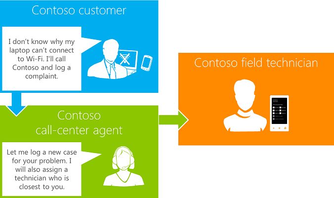

# Como: criar um aplicativo móvel de complementar para um aplicativo do SharePoint
Saiba como criar um aplicativo móvel do complementares para um aplicativo hospedado em provedor novo ou existente no SharePoint 2013.
 * **Aplica-se a:*** 
  
    
    

 **Neste artigo**
  
    
    
 [Cenário para um aplicativo móvel do complementares para um aplicativo para SharePoint](#bkmk_scenariodetails)
  
    
    
 [Etapas para a criação de um aplicativo móvel do complementares](#bkmk_stepsforcreatingapp)
  
    
    
 [Pré-requisitos para a criação de um aplicativo móvel do complementares para um aplicativo para SharePoint](#bkmk_prereq)
  
    
    
 [Nessa seção](#bkmk_inthissection)
  
    
    
 [Recursos adicionais](#bk_addresources)
SharePoint 2013 introduces a Cloud App Model that enables you to createapps. Apps are self-contained pieces of functionality that extend the capabilities of a SharePoint website. Apps integrate the best of the web and SharePoint; they are targeted, lightweight, and easy to use, and they do a great job at solving a user need. Users discover and download apps from the Office Store or from their organization's private App Catalog and install them on their SharePoint sites. For more information, see  [Criar aplicativos para o SharePoint](37727101-0692-4652-a481-e6d6379cf921.md).
  
    
    

In addition, SharePoint 2013 enables you to build mobile apps that travel with users, are interactive and attractive, and are available whenever and wherever users want to work with them. You can combine mobile apps with on-premises SharePoint services and applications, or with remote SharePoint services and applications that run in the cloud (such as those that use SharePoint Online) to create powerful applications that extend the functionality beyond the traditional desktop or laptop, and into a truly portable and much more accessible environment. For more information, see  [Crie aplicativos do Windows Phone que acessam o SharePoint 2013](http://msdn.microsoft.com/library/36681335-f772-4499-8445-f94481bc18e7%28Office.15%29.aspx).Juntos, o modelo de aplicativo de nuvem e o suporte de aplicativos móveis no SharePoint 2013 fornecem uma oportunidade excelentes para que você crie aplicativos para o SharePoint e seus aplicativos móveis do complementares. Este conjunto de artigos, você examinará a criação de um aplicativo para SharePoint e o seu aplicativo complementares Windows Phone 7.SharePoint 2013 provides two Visual Studio templates for creating Windows Phone apps for SharePoint. You can get the templates by downloading the  [Microsoft SharePoint SDK for Windows Phone 7.1](http://www.microsoft.com/en-us/download/details.aspx?id=30476). For more information about the Windows Phone SharePoint list application templates, see  [Visão geral dos modelos de aplicativos do Windows Phone SharePoint 2013 no Visual Studio](http://msdn.microsoft.com/library/6ae27957-fa41-4e6f-92e3-db11dae1f6c2%28Office.15%29.aspx). For SharePoint list-based apps, you can use the list template, or you can use the Windows Phone Empty SharePoint Application template to create a Windows Phone app for SharePoint from scratch. If you're creating a companion app on other platforms like Android or iOS, you can use REST endpoints to access SharePoint data. For more information, see  [Criar aplicativos móveis para outras plataformas usando o SharePoint 2013](http://msdn.microsoft.com/library/017df869-44fb-4ffe-82fb-4654e01329ad%28Office.15%29.aspx).
## Cenário para um aplicativo móvel do complementares para um aplicativo para SharePoint

Este conjunto de artigos de instruções, criar um aplicativo para SharePoint e o seu aplicativo do Windows Phone complementares usando o modelo de aplicativo para Windows Phone SharePoint lista
  
    
    
Neste procedimento, um cenário de um centro de suporte e os técnicos são abordados. Um agente de suporte ao cliente adiciona uma solicitação de cliente usando o aplicativo do serviço de atendimento ao cliente do SharePoint; técnicos de usam o aplicativo móvel para receber notificações por push e acessar todos os casos atribuídos a eles, conforme mostrado na Figura 1.
  
    
    

**Figura 1. Cenário de aplicativo móvel do complementares para o SharePoint**

  
    
    

  
    
    

  
    
    

  
    
    

  
    
    

## Etapas para a criação de um aplicativo móvel do complementares

Este procedimento contém estas três etapas:
  
    
    

-  [Etapa 1: Criar um aplicativo hospedado pelo provedor lista baseada no SharePoint 2013](e79ee2e7-0a80-4858-a311-c4f1f8d72a56.md)
    
  
-  [Etapa 2: Configurar envio notificações em um aplicativos hospedados pelo provedor para o SharePoint](5abfda20-118b-42bc-bc51-65f6ff6f7010.md)
    
  
-  [Etapa 3: Criar um aplicativo móvel e registrar para notificações de push](ca56ac7f-f7cf-4fab-b2b7-66abb814fac2.md)
    
  

## Pré-requisitos para a criação de um aplicativo móvel do complementares para um aplicativo para SharePoint

Você precisa os seguintes componentes para concluir este procedimento:
  
    
    

- Office Developer Tools para Visual Studio 2012
    
  
- Visual Studio 2012
    
  
- Uma conta de Office 365.
    
    For more information about how to set up an Office 365 account, see  [Configurar um ambiente de desenvolvimento para suplementos do SharePoint no Office 365](b22ce52a-ae9e-4831-9b68-c9210af6dc54.md). For more information about Office 365 development, see  [Configurar um ambiente de desenvolvimento para suplementos do SharePoint no Office 365](b22ce52a-ae9e-4831-9b68-c9210af6dc54.md).
    
  
- Visual Studio Express 2010 com os novos modelos de telefone do SharePoint do Microsoft SharePoint SDK para Windows Phone 7.1http://www.microsoft.com/en-us/download/details.aspx?id=30476 
    
  

### Principais conceitos saber para a criação de um aplicativo móvel do complementares para aplicativos para SharePoint

Os seguintes artigos fornecem o plano de fundo e outras informações para ajudá-lo a entender os aplicativos para SharePoint e aplicativos móveis.
  
    
    

**Tabela 1. Principais conceitos**

|**Título do artigo**|**Descrição**|
|:-----|:-----|
| [Introdução ao desenvolvimento de aplicativos para o SharePoint](d07e0a13-1e74-4128-857a-513dedbfef33.md)   |Familiarizar-se com aplicativos do SharePoint, os recursos para configurar seu ambiente de desenvolvimento, exemplos, para mostrar o que os aplicativos podem fazer e informações para tipos mais avançados e inovadora de desenvolvimento com aplicativos do SharePoint.   |
| [Crie aplicativos do Windows Phone que acessam o SharePoint 2013](http://msdn.microsoft.com/library/36681335-f772-4499-8445-f94481bc18e7%28Office.15%29.aspx)   |Aprenda a criar aplicativos para SharePoint que integram SharePoint 2013 e dispositivos móveis, como Windows Phone.   |
| [Visão geral dos modelos de aplicativos do Windows Phone SharePoint 2013 no Visual Studio](http://msdn.microsoft.com/library/6ae27957-fa41-4e6f-92e3-db11dae1f6c2%28Office.15%29.aspx)   |Saiba mais sobre os modelos de Visual Studio instalados pelo Windows Phone SharePoint Software Development Kit de desenvolvimento de aplicativos móveis.   |
| [Como: configurar e usar as notificações por push nos aplicativos do SharePoint 2013 para Windows Phone](http://msdn.microsoft.com/library/68fa2138-86d9-4e35-9c7c-5cd292087b80%28Office.15%29.aspx)   |Saiba como criar uma solução no SharePoint Server para o envio de notificações por push e desenvolver um aplicativo do Windows Phone para receber as notificações.   |
   

## Nessa seção

Para criar um aplicativo móvel do complementares para SharePoint, consulte os artigos listados na tabela 2.
  
    
    

**Tabela 2. Etapas para a criação de um aplicativo móvel do complementares para um aplicativo para SharePoint**

|**Etapa**|**Descrição**|
|:-----|:-----|
| [Etapa 1: Criar um aplicativo hospedado pelo provedor lista baseada no SharePoint 2013](e79ee2e7-0a80-4858-a311-c4f1f8d72a56.md)   |Use o Office Developer Tools para Visual Studio 2012 para criar um básico hospedado em provedor Suplemento do SharePoint com o campo de localização geográfica (uma coluna com base no local) que foi introduzido no SharePoint 2013 e habilite as notificações por push em um Suplemento do SharePoint.   |
| [Etapa 2: Configurar envio notificações em um aplicativos hospedados pelo provedor para o SharePoint](5abfda20-118b-42bc-bc51-65f6ff6f7010.md)   |Crie notificações por push de um provedor hospedado Suplementos do SharePoint usando um receptor de evento remoto.   |
| [Etapa 3: Criar um aplicativo móvel e registrar para notificações de push](ca56ac7f-f7cf-4fab-b2b7-66abb814fac2.md)   |Criar um aplicativo móvel do complementares para um Suplemento do SharePoint e configurar as notificações por push para ele.   |
   

## Recursos adicionais

-  [Suplementos do SharePoint](cd1eda9e-8e54-4223-93a9-a6ea0d18df70.md)
    
  
-  [Inscrever-se em uma conta de desenvolvedor do Office 365](dfe001bd-50fc-4031-be50-853a85cd238f.md)
    
  
-  [Windows Phone 7.1 do SDK](http://www.microsoft.com/en-us/download/details.aspx?id=27570)
    
  
-  [SDK do Microsoft SharePoint para Windows Phone 7.1](http://www.microsoft.com/en-us/download/details.aspx?id=30476)
    
  
-  [Modelos de programação no SharePoint 2013](http://msdn.microsoft.com/library/061985ec-6129-4e91-991b-a72488ce1d34%28Office.15%29.aspx)
    
  
-  [Crie aplicativos do Windows Phone que acessam o SharePoint 2013](http://msdn.microsoft.com/library/36681335-f772-4499-8445-f94481bc18e7%28Office.15%29.aspx)
    
  
-  [Como: configurar e usar as notificações por push nos aplicativos do SharePoint 2013 para Windows Phone](http://msdn.microsoft.com/library/68fa2138-86d9-4e35-9c7c-5cd292087b80%28Office.15%29.aspx)
    
  
-  [Integrar a funcionalidade de local e o mapa no SharePoint 2013](http://msdn.microsoft.com/library/10d4a904-ed27-4513-8c20-d2098aebf22c%28Office.15%29.aspx)
    
  
