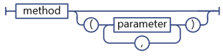
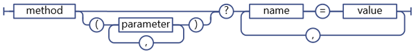
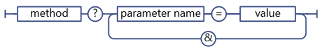

# Determinar o ponto de extremidade do serviço do SharePoint REST URIs
Saiba as diretrizes gerais para determinação do ponto de extremidade do REST do SharePoint URIs da assinatura do modelo de objeto de cliente correspondente APIs.
 **Antes de começar**
  
    
    


-  [Conheça o serviço REST do SharePoint 2013](get-to-know-the-sharepoint-2013-rest-service.md)
    
  
-  [Navegue a estrutura de dados do SharePoint representada no serviço REST](navigate-the-sharepoint-data-structure-represented-in-the-rest-service.md)
    
  

 **Próximas etapas**
  
    
    


-  [Usar operações de consulta de OData em solicitações REST do SharePoint](use-odata-query-operations-in-sharepoint-rest-requests.md)
    
  

## Ponto de extremidade do REST do SharePoint estrutura URI

Antes de poder acessar um recurso do SharePoint usando o serviço REST, você precisará descobrir o ponto de extremidade URI que aponta para esse recurso. Sempre que possível, o URI para esses pontos de extremidade do REST bastante simule a assinatura de API do recurso no modelo de objeto do cliente do SharePoint. Por exemplo:
  
    
    
 *Método de modelo de objeto do cliente:* 
  
    
    
List.GetByTitle(listname).GetItems()
  
    
    
 *Ponto de extremidade do REST:* 
  
    
    
 `http://server/site/_api/lists/getbytitle('listname')/items`
  
    
    
Em alguns casos, no entanto, o URI do ponto de extremidade difere da assinatura de modelo de objeto cliente correspondente, para cumprir as convenções REST ou OData.
  
    
    
A figura a seguir mostra a estrutura de sintaxe geral de URIs de REST do SharePoint.
  
    
    

**Estrutura de sintaxe do URI do REST do SharePoint**

  
    
    

  
    
    

  
    
    
Alguns pontos de extremidade para recursos do SharePoint desviarem dessa estrutura de sintaxe:
  
    
    

- Métodos que exigem tipos complexos como parâmetros.
    
    Se o método de modelo de objeto cliente correspondente exigir que os tipos complexos são passados como parâmetros, o ponto de extremidade do REST pode desviar desta construção de sintaxe para levar em conta as limitações de REST.
    
  
- Propriedades e métodos estáticos.
    
    Pontos de extremidade do REST se desviar dessa estrutura de sintaxe para URIs que representam de métodos estáticos e propriedades.
    
  

## Determinar os pontos de extremidade de serviço do SharePoint 2013 REST

Para construir um ponto de extremidade do REST para um recurso do SharePoint, siga estas etapas:
  
    
    

1. Comece com a referência de serviço REST:
    
     `http://server/site/_api`
    
  
2. Especifique o ponto de entrada apropriada. Por exemplo:
    
     `http://server/site/_api/web`
    
  
3. Navegar de ponto de entrada para os recursos específicos que você deseja acessar. Isso inclui a especificação de parâmetros para os pontos de extremidade que correspondem aos métodos no modelo de objeto do cliente. Por exemplo:
    
     `http://server/site/_api/web/lists/getbytitle('listname')`
    
  

### Referência do serviço REST SharePoint 2013 no seu URI do ponto de extremidade

Use  `_api` para indicar o serviço REST de SharePoint 2013 no seu ponto de extremidade URIs. O serviço REST faz parte do serviço da web client.svc. No entanto, para facilitar a construção de URI do REST e diminuir o caminho do URI do REST base, o serviço REST usa `_api` ausente abstrai a necessidade de fazer referência explicitamente o serviço web de client.svc. O serviço REST ainda reconhece e aceita URIs que fazem referência a serviço da web client.svc. Por exemplo, você pode usar `http://server/site/_vti_bin/client.svc/web/lists` em vez de `http://server/site/_api/web/lists`. No entanto, usar  `_api` é a convenção preferencial. URLs tem um limite de 256 caracteres, de forma usar `_api` diminui o URI de base, deixando mais caracteres para uso em construindo o restante da URL.
  
    
    

### Especificar os pontos de entrada para o serviço REST SharePoint 2013

Os pontos de entrada principal para o serviço REST representam o conjunto de sites e site do contexto especificado. Dessa forma, esses pontos de entrada correspondem à propriedade  [ClientContext.Site](https://msdn.microsoft.com/library/Microsoft.SharePoint.Client.ClientContext.Site.aspx) e a propriedade [ClientContext.Web](https://msdn.microsoft.com/library/Microsoft.SharePoint.Client.ClientContext.Web.aspx) nos modelos de objeto do cliente.
  
    
    
Para acessar um conjunto de sites específico, use a seguinte construção:
  
    
    
 `http://server/site/_api/site`
  
    
    
Para acessar um site específico, use a seguinte construção:
  
    
    
 `http://server/site/_api/web`
  
    
    
Onde  *server*  representa o nome do servidor e *site*  representa o nome da ou caminho, para o site específico.
  
    
    
Além dos  `/site` e `/web`, o serviço REST inclui vários outros pontos de acesso que permitem que os desenvolvedores navegar até funcionalidades específicas. A tabela a seguir lista alguns desses pontos de acesso.
  
    
    


|**Área de recurso**|**Ponto de acesso**|
|:-----|:-----|
|Site <br/> |http:// _server/site_/_api/site <br/> |
|Web <br/> |http:// _server/site_/_api/web <br/> |
|Perfil de usuário <br/> |http:// _server/site_/_api/SP.UserProfiles.PeopleManager <br/> |
|Pesquisa <br/> |http:// _server/site_/_api/pesquisa <br/> |
   

### Navegue até os recursos específicos que você deseja acessar

A partir daqui, construir específicos mais pontos de extremidade do REST 'percorrendo"o modelo de objeto, usando os nomes das APIs do modelo de objeto de cliente separada por uma barra (/). A tabela a seguir mostra exemplos de chamadas de modelo de objeto do cliente e o ponto de extremidade do REST equivalente.
  
    
    


|**API de modelo de objeto do cliente**|**Ponto de extremidade do REST**|
|:-----|:-----|
|ClientContext.Web.Lists <br/> |http:// _server_/ _site_/_api/web/lists <br/> |
|ClientContext.Web.Lists[guid] <br/> |http:// _server_/ _site_/_api/web/lists(' _guid_') <br/> |
|ClientContext.Web.Lists.GetByTitle("Title") <br/> |http:// _server_/ _site_/_api/web/lists/getbytitle(' _Title_') <br/> |
   
Os URIs de ponto de extremidade diferenciam maiusculas de minúsculas. Na tabela anterior, por exemplo, use  `/getbytitle` para especificar o equivalente do restante do método **GetByTitle()**.
  
    
    

## Especifique os parâmetros no ponto de extremidade do REST URIs

SharePoint 2013 estende a especificação de OData para permitir que você use parênteses para especificar os parâmetros de método e valores de índice. Isso impede que os possíveis problemas de Desambiguidade em URIs que contêm vários parâmetros com o mesmo nome. Por exemplo, os URIs de dois seguintes contêm parâmetros que têm o mesmo nome:
  
    
    
 `http://server/site/_api/web/lists/getByTitle('Announcements')/fields/getByTitle('Description')`
  
    
    
 `http://server/site/_api/web/lists('<guid>')/fields/getById('<guid>')`
  
    
    
Para especificar vários parâmetros, inclua o parâmetro como um par nome-valor e separe os parâmetros com vírgulas. Por exemplo:
  
    
    
 `http://server/site/_api/web/getAvailableWebTemplates(lcid=1033, includeCrossLanguage=true)`
  
    
    
A figura a seguir mostra a sintaxe do parâmetro REST do SharePoint.
  
    
    

**Sintaxe do parâmetro REST do SharePoint**

  
    
    

  
    
    

  
    
    

### Tipos complexos como parâmetros para o serviço REST

Alguns métodos no modelo de objeto do cliente exigem uma grande carga como um parâmetro. Para os pontos de extremidade do REST manter a paridade funcionalidade com o seu modelo de objeto do cliente correspondente APIs, os pontos de extremidade devem aceitar um tipo complexo como um parâmetro. Nesses casos, o serviço REST estende o protocolo OData existente para permitir que esses pontos de extremidade do REST aceitar um único tipo complexo como um parâmetro. Isso se aplica a apenas operações de **POST** e que se deve passar o tipo complexo no formato [Atom](http://www.odata.org/developers/protocols/atom-format#RepresentingComplexTypesProperties) ou [JSON](http://www.odata.org/developers/protocols/json-format#RepresentingComplexTypeProperties) , de acordo com os padrões de OData.
  
    
    
Por exemplo, o método  [ListCollection.Add](https://msdn.microsoft.com/library/Microsoft.SharePoint.Client.ListCollection.Add.aspx) aceita um objeto [Microsoft.SharePoint.Client.ListCreationInformation](https://msdn.microsoft.com/library/Microsoft.SharePoint.Client.ListCreationInformation.aspx) como um parâmetro. Para adicionar uma lista a um site especificado, construa o ponto de extremidade do REST apropriado da seguinte maneira:
  
    
    
 `http://server/site/_api/web/lists/add`
  
    
    
Em seguida, passa o tipo complexo no corpo da solicitação, formatado aqui usando JSON.
  
    
    


```

{ "d" : {
   "results": {
     "__metadata": {
       "type": "SP.ListCreationInformation"
     }, 
     "CustomSchemaXml": "…large payload…/", 
     "Description": "desc", 
     "DocumentTemplateType": "1", 
     "TemplateType": "101", 
     "Title": "Announcements"
   }
} 
}

```


### Usando aliases do parâmetro em chamadas de serviço REST

Você pode usar o "aliases de parâmetro" semântico no OData passar parâmetros para um ponto de extremidade do REST do SharePoint. Em aliases de parâmetro, o valor do parâmetro é identificado por um alias na chamada parâmetro e o valor real for especificado na sequência de consulta do URI. Isso permite que você ofereça suporte a mais tipos de caracteres e formatação consistente usando a sequência de consulta.
  
    
    
Por exemplo, os URIs de resto dois seguintes são equivalentes:
  
    
    
 *Especifique o valor do parâmetro diretamente:* 
  
    
    
 `http://server/site/_api/web/applyWebTemplate("STS#0")`
  
    
    
 *Use um alias de parâmetro e especifique o valor do parâmetro real na sequência de consulta do URI:* 
  
    
    
 `http://server/site/_api/web/applyWebTemplate(title=@template)?@template="STS#0"`
  
    
    
No entanto, o serviço REST do SharePoint não suporta passando tipos complexos via aliases de parâmetro. Por exemplo, o seguinte URI, que contém um tipo complexo no alias do parâmetro, não é suportado:
  
    
    
 `http://server/site/_api/userProfiles/People(7)/GetWorkplace(@address)?@address={"__metadata":{"type: "ODataDemo.Address"},"Street":"NE 228th", "City":"Sammamish","State":"WA","ZipCode":"98074","Country": "USA"}`
  
    
    

**SharePoint REST service parameter aliasing syntax**

  
    
    

  
    
    

  
    
    

  
    
    

  
    
    

### A especificação de dicionários como valores de parâmetro

Para pontos de extremidade REST que correspondem aos métodos que usam dicionários  `Dictionary<String, String>` como parâmetros, passe o dicionário como uma série de vírgula delimitado pares nome-valor na sequência de consulta.
  
    
    

**REST service syntax for Dictionary parameters**

  
    
    

  
    
    

  
    
    
Um  `Dictionary<String, object>` é representado como um objeto de valor múltiplos, chamado KeyedPropertyValue, com as seguintes propriedades de cadeia de caracteres:
  
    
    

- **Chave** A chave do objeto de valor múltiplos.
    
  
- **Valor** O valor do objeto
    
  
- **ValueType** O tipo de valor do objeto. Para tipos de valor simples que mapeiam para tipos de modelo de dados de entidade (EDM) existentes, o serviço REST retorna a sequência de tipo EDM apropriada; Por exemplo, "Edm.String". Caso contrário, o serviço REST retorna o tipo de valor retornado pela função **Type.ToString**.
    
  

### Especificar os valores de parâmetro na sequência de consulta

Se seu URI REST termina em uma chamada de método, você pode usar a sintaxe da sequência de consulta para especificar os valores de parâmetro do método. Por exemplo:
  
    
    
 `http://<server>/<site>/_api/web/applyWebTemplate?template="STS#0"`
  
    
    
a figura a seguir mostra a sintaxe do serviço REST para parâmetros na cadeia de caracteres de consulta.
  
    
    

**REST service syntax for parameters in query string**

  
    
    

  
    
    

  
    
    

  
    
    

  
    
    

## Especificando propriedades e métodos estáticos como serviço REST URIs

Para construir URIs que correspondem às propriedades ou métodos estáticos, use o nome de API correspondente do modelo de objeto do ECMAScript, começando com a declaração de namespace e usando a notação de ponto. Por exemplo,  [SP. Utilities.Utility.getImageUrl(imageName)](http://msdn.microsoft.com/en-us/library/ee658947.aspx) em ECMAScript o modelo de objeto cliente teria o equivalente de resto a seguir:
  
    
    
 `http://server/site/_api/SP.Utilities.Utility.getImageUrl('imageName')`
  
    
    
No entanto, propriedades estáticas podem ser acessadas apenas diretamente e não são permitidas como parte de uma maior composição de URI. Por exemplo, acessar diretamente o método **SP.Utility.AssetsLibrary** no restante é permitido, da seguinte maneira:
  
    
    
 `http://server/site/_api/SP.Utility.assetsLibrary/id`
  
    
    
No entanto, usando esse local de recursos como um parâmetro para um URI mais complexo, conforme mostrado no exemplo a seguir, não é permitido:
  
    
    
 `http://server/site/_api/getList(~SP.Utility/assetsLibrary/id)`
  
    
    
A figura a seguir mostra a sintaxe de membro estático de serviço do REST do SharePoint.
  
    
    

**SharePoint REST service static member syntax**

  
    
    

  
    
    

  
    
    

  
    
    

  
    
    

## Próximas etapas

Se você deseja selecionar, filtrar ou ordenar os dados que você solicitou a partir de um ponto de extremidade, o serviço REST do SharePoint oferece suporte a operadores de cadeia de caracteres de consulta uma ampla gama de OData.
  
    
    

## Recursos adicionais
<a name="bk_addresources"> </a>


-  [Conheça o serviço REST do SharePoint 2013](get-to-know-the-sharepoint-2013-rest-service.md)
    
  
-  [Realizar operações básicas usando os pontos de extremidade REST do SharePoint 2013](complete-basic-operations-using-sharepoint-2013-rest-endpoints.md)
    
  
-  [Trabalhar com listas e itens de listas com REST](working-with-lists-and-list-items-with-rest.md)
    
  
-  [Trabalhando com pastas e arquivos com REST](working-with-folders-and-files-with-rest.md)
    
  
-  [Navegue a estrutura de dados do SharePoint representada no serviço REST](navigate-the-sharepoint-data-structure-represented-in-the-rest-service.md)
    
  
-  [Usar operações de consulta de OData em solicitações REST do SharePoint](use-odata-query-operations-in-sharepoint-rest-requests.md)
    
  
-  [Referência e amostras da API REST](http://msdn.microsoft.com/library/02128c70-9d27-4388-9374-a11bce68fdb8%28Office.15%29.aspx)
    
  
-  [Sincronizar os itens do SharePoint usando o serviço REST](synchronize-sharepoint-items-using-the-rest-service.md)
    
  
-  [Use valores de ETag através do serviço REST para obter a versão de item de lista do documento](5f7e0579-46b7-44ab-b3b4-cdbc622dcd98.md)
    
  

  
    
    

