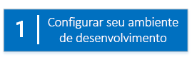
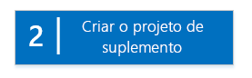
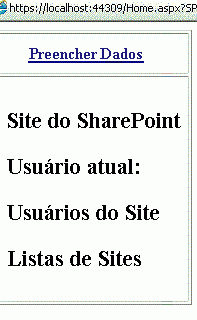

# Introdução à criação de suplementos do SharePoint hospedados pelo provedor
Configure um ambiente de desenvolvimento e crie seu primeiro Suplemento do SharePoint hospedado pelo provedor.
Os suplementos hospedados pelo provedor são os dois principais tipos do Suplementos do SharePoint. Para obter uma visão geral dos Suplementos do SharePoint e dos dois tipos diferentes, consulte  [Suplementos do SharePoint](sharepoint-add-ins.md). Veja um resumo dos suplementos hospedados pelo provedor:
  
    
    


- Eles incluem um aplicativo Web, serviço ou banco de dados hospedado externamente do farm do SharePoint ou uma assinatura do SharePoint Online. Eles também podem incluir componentes do SharePoint. Você pode hospedar os componentes externos em qualquer pilha de hospedagem na Web, incluindo as pilhas LAMP (do Linux, do Apache, do MySQL e do PHP).
    
  
- A lógica de negócios personalizada no suplemento deve ser executada nos componentes externos ou no JavaScript em páginas personalizadas do SharePoint.
    
  

 [
  
    
    
](get-started-creating-provider-hosted-sharepoint-add-ins.md#Setup) [
  
    
    
](get-started-creating-provider-hosted-sharepoint-add-ins.md#Create) [
  
    
    
](get-started-creating-provider-hosted-sharepoint-add-ins.md#Code)
  
    
    


## Configurar seu ambiente de desenvolvimento
<a name="Setup"> </a>

Existem várias maneiras de configurar um ambiente de desenvolvimento para os Suplementos do SharePoint. Esta seção explica a maneira mais simples. Para ver alternativas, consulte  [Recursos adicionais](#bk_addresources).
  
    
    

### Obter as ferramentas


- Se você ainda não tiver o **Visual Studio** 2013 ou posterior instalado, instale-o usando as instruções em [Install Visual Studio](http://msdn.microsoft.com/library/da049020-cfda-40d7-8ff4-7492772b620f.aspx). Nós recomendamos a utilização da  [versão mais recente da Central de Download da Microsoft](https://www.visualstudio.com/downloads/download-visual-studio-vs).
    
  
- O Visual Studio inclui o **Microsoft Office Developer Tools for Visual Studio**. Às vezes, a versão das ferramentas é lançada entre atualizações do Visual Studio. Para garantir que você tenha a versão mais recente das ferramentas, execute o [instalador do Microsoft Office Developer Tools para Visual Studio 2013 ](http://aka.ms/OfficeDevToolsForVS2013) ou o [instalador do Office Developer Tools para Visual Studio 2015](http://aka.ms/OfficeDevToolsForVS2015). 
    
  

### Inscreva-se em um Office 365 Developer Site
<a name="o365_signup"> </a>


> **OBSERVAçãO**
>  É possível que você já tenha acesso a um Office 365 Developer Site:> **Você é um assinante do MSDN?** Assinantes do Visual Studio Ultimate e do Visual Studio Premium com MSDN recebem uma Assinatura de Desenvolvedor do Office 365 como benefício. [Resgate seu benefício agora.](https://msdn.microsoft.com/subscriptions/manage/default.aspx)> **Você tem um dos planos de assinatura do Office 365 a seguir?**> **Se tiver, um administrador da assinatura do Office 365 poderá criar um Site do Desenvolvedor** usando o [centro de administração do Office 365](https://portal.microsoftonline.com/admin/default.aspx). Para saber mais, consulte [Criar um site do desenvolvedor em uma assinatura existente do Office 365](create-a-developer-site-on-an-existing-office-365-subscription.md). 
  
    
    

Existem duas maneiras de obter um plano do Office 365. 
  
    
    

- Comece com uma  [avaliação gratuita de 30 dias](https://portal.microsoftonline.com/Signup/MainSignUp.aspx?OfferId=6881A1CB-F4EB-4db3-9F18-388898DAF510&amp;DL=DEVELOPERPACK) com uma licença de usuário.
    
  
- Compre uma  [assinatura de desenvolvedor do Office 365](https://portal.microsoftonline.com/Signup/MainSignUp.aspx?OfferId=C69E7747-2566-4897-8CBA-B998ED3BAB88&amp;DL=DEVELOPERPACK). 
    
  

> **DICA**
> Cada um destes links é aberto em uma nova janela ou guia de forma que você ainda consiga ver as instruções a seguir. 
  
    
    


**Figura 1. Nome de domínio do Site de Desenvolvedor do Office 365**

  
    
    

  
    
    

  
    
    

  
    
    

  
    
    

1. A primeira página (não mostrada) do formulário de inscrição é autoexplicativo; forneça as informações solicitadas e então escolha **Avançar**.
    
  
2. Na segunda página, mostrada na Figura 1, especifique uma ID de usuário para o administrador da assinatura.
    
  
3. Crie um subdomínio **.onmicrosoft.com**; por exemplo, contoso.onmicrosoft.com.
    
    Após a assinatura, use as credenciais resultantes (no formato  _IDDoUsuário_@ _seudomínio_.onmicrosoft.com) para entrar no site do portal do Office 365 onde você administra sua conta. Seu Site do Desenvolvedor do SharePoint Online é configurado em seu novo domínio: **http:// _seudomínio_.sharepoint.com**.
    
  
4. Escolha **Avançar** e preencha a página final do formulário. Se você optar por fornecer um número de telefone para obter um código de confirmação, você poderá fornecer um número de telefone celular ou fixo, mas *não*  um número VoIP (Voice over Internet Protocol).
    
  

    
> **OBSERVAçãO**
> Se você estiver conectado a outra conta da Microsoft ao tentar se inscrever em uma conta de desenvolvedor, talvez veja esta mensagem: "A ID do usuário inserida não funcionou. Parece que ela não é válida. Insira a ID do usuário que sua organização atribuiu a você. Sua ID do usuário nomalmente tem a aparência  *nome@example.com*  ou *nome@example.onmicrosoft.com*  ."> Se essa mensagem for exibida, desconecte-se da conta da Microsoft que estava usando e tente novamente. Se você ainda obtiver a mensagem, limpe o cache do navegador ou alterne para a **Navegação InPrivate** e preencha o formulário.
  
    
    

Depois de concluir o processo de inscrição, seu navegador abrirá a página de instalação do Office 365. Escolha o ícone Administrador para abrir a página do centro de administração.
  
    
    

**Figura 2. Página do centro de administração do Office 365**

  
    
    

  
    
    

  
    
    

  
    
    

1. Aguarde o término da configuração do Site do Desenvolvedor. Após a conclusão do provisionamento, atualize a página do centro de administração do em seu navegador.
    
  
2. Em seguida, escolha o link **Criar suplementos** no canto superior esquerdo da página para abrir o Site do Desenvolvedor. Você vai visualizar um site com a mesma aparência da Figura 3. A lista **Suplementos em teste** na página confirma que o site foi criado com o modelo do Site do Desenvolvedor do SharePoint. Caso veja um site de equipe normal, aguarde alguns minutos e reinicie seu site.
    
  
3. Anote a URL do site; ela será usada quando você criar projetos do Suplementos do SharePoint no Visual Studio.
    
  

**Figura 3. Home page do seu Site do Desenvolvedor com a lista de Suplementos em teste**

  
    
    

  
    
    

  
    
    

  
    
    

  
    
    

## Criar o projeto do suplemento
<a name="Create"> </a>


1. Inicie o Visual Studio usando a opção **Executar como administrador**.
    
  
2. No Visual Studio, escolha **Arquivo** > **Novo** > **Projeto**.
    
  
3. Na caixa de diálogo **Novo Projeto**, expanda o nó **Visual C#**, expanda o nó **Office/SharePoint** e escolha **Suplementos** > **Suplemento do SharePoint**.
    
  
4. Dê ao projeto o nome SampleAddIn e escolha **OK**
    
  
5. Na primeira caixa de diálogo **Especificar as configurações do Suplemento do SharePoint**, faça o seguinte:
    
  - Forneça a URL completa do site do SharePoint que você deseja usar para depurar seu suplemento. Essa é a URL do Site do Desenvolvedor. Use HTTPS, não HTTP, na URL. Em algum momento durante esse procedimento ou logo após sua conclusão, você deve fazer logon no site. O intervalo do prompt varia. Use as credenciais de administrador (no domínio *.onmicrosoft.com) que você criou ao se inscrever no seu Site do Desenvolvedor; por exemplo, MeuNome@contoso.onmicrosoft.com. 
    
  
  - Em **Como você deseja hospedar o suplemento do SharePoint**, escolha **Hospedado pelo provedor**.
    
  
  -  Escolha **OK**.
    
  
6. Na página **Especificar a versão do SharePoint de destino**, escolha **SharePoint Online** e, em seguida, escolha **Avançar**.
    
  
7. Em **Que tipo de projeto de aplicativo Web você deseja criar?**, escolha **Aplicativo de Formulários Web ASP.NET**. Escolha **Avançar**.
    
  
8. Em **Como deseja que seu suplemento seja autenticado?**, escolha **Usar o Serviço de Controle de Acesso do Microsoft Azure**.
    
  
9. No assistente, escolha **Concluir**.
    
    Muito da configuração é concluído quando a solução é aberta. Dois projetos são criados na solução Visual Studio - um para o Suplemento do SharePoint e o outro para o aplicativo Web do ASP.NET.
    
  

## Codificar seu suplemento
<a name="Code"> </a>


1. Abra o arquivo AppManifest.xml. Na guia **Permissões**, especifique o escopo do **Conjunto de Sites** e o nível de permissão **Leitura**.
    
  
2. Exclua qualquer marcação dentro da marca **<body>** do arquivo Pages/Default.aspx do seu aplicativo Web e adicione os seguintes controles HTML e ASP.NET no **<body>**. Este exemplo usa o controle  [UpdatePanel](https://msdn.microsoft.com/library/System.Web.UI.UpdatePanel.aspx) para habilitar a renderização parcial da página.
    
  ```HTML
  
<form id="form1" runat="server">
  <div>
    <asp:ScriptManager ID="ScriptManager1" runat="server"
            EnablePartialRendering="true" />
    <asp:UpdatePanel ID="PopulateData" runat="server" UpdateMode="Conditional">
      <ContentTemplate>      
        <table border="1" cellpadding="10">
         <tr><th><asp:LinkButton ID="CSOM" runat="server" Text="Populate Data" 
                               OnClick="CSOM_Click" /></th></tr>
         <tr><td>

        <h2>SharePoint Site</h2>
        <asp:Label runat="server" ID="WebTitleLabel"/>

        <h2>Current User:</h2>
        <asp:Label runat="server" ID="CurrentUserLabel" />

        <h2>Site Users</h2>
        <asp:ListView ID="UserList" runat="server">     
            <ItemTemplate >
              <asp:Label ID="UserItem" runat="server" 
                                Text="<%# Container.DataItem.ToString()  %>">
              </asp:Label><br />
           </ItemTemplate>
        </asp:ListView>

        <h2>Site Lists</h2>
               <asp:ListView ID="ListList" runat="server">
                   <ItemTemplate >
                     <asp:Label ID="ListItem" runat="server" 
                                Text="<%# Container.DataItem.ToString()  %>">
                    </asp:Label><br />
                  </ItemTemplate>
              </asp:ListView>
            </td>              
          </tr>
         </table>
       </ContentTemplate>
     </asp:UpdatePanel>
  </div>
</form>
  ```

3. Adicione as declarações a seguir ao arquivo Default.aspx.cs do seu aplicativo Web.
    
  ```cs
  
using Microsoft.SharePoint.Client;
using Microsoft.IdentityModel.S2S.Tokens;
using System.Net;
using System.IO;
using System.Xml;
  ```

4. No arquivo Default.aspx.cs do seu aplicativo Web, adicione estas variáveis à classe  [Page](https://msdn.microsoft.com/library/System.Web.UI.Page.aspx) .
    
  ```cs
  
SharePointContextToken contextToken;
string accessToken;
Uri sharepointUrl;
string siteName;
string currentUser;
List<string> listOfUsers = new List<string>();
List<string> listOfLists = new List<string>();
  ```

5. Adicione o método  `RetrieveWithCSOM` à classe [Page](https://msdn.microsoft.com/library/System.Web.UI.Page.aspx) . Esse método usa o CSOM do SharePoint para recuperar informações sobre seu site e exibi-las na página.
    
  ```cs
  
// This method retrieves information about the host web by using the CSOM.
private void RetrieveWithCSOM(string accessToken)
{

    if (IsPostBack)
    {
        sharepointUrl = new Uri(Request.QueryString["SPHostUrl"]);
    }            

    ClientContext clientContext =
                    TokenHelper.GetClientContextWithAccessToken(
                        sharepointUrl.ToString(), accessToken);

    // Load the properties for the web object.
    Web web = clientContext.Web;
    clientContext.Load(web);
    clientContext.ExecuteQuery();

    // Get the site name.
    siteName = web.Title;

    // Get the current user.
    clientContext.Load(web.CurrentUser);
    clientContext.ExecuteQuery();
    currentUser = clientContext.Web.CurrentUser.LoginName;

    // Load the lists from the Web object.
    ListCollection lists = web.Lists;
    clientContext.Load<ListCollection>(lists);
    clientContext.ExecuteQuery();

    // Load the current users from the Web object.
    UserCollection users = web.SiteUsers;
    clientContext.Load<UserCollection>(users);
    clientContext.ExecuteQuery();

    foreach (User siteUser in users)
    {
        listOfUsers.Add(siteUser.LoginName);
    }


    foreach (List list in lists)
    {
        listOfLists.Add(list.Title);
    }
}
  ```

6. Adicione o método  `CSOM_Click` à classe [Page](https://msdn.microsoft.com/library/System.Web.UI.Page.aspx) . Esse método dispara o evento que ocorre quando o usuário clica no link **Preencher Dados**.
    
  ```cs
  
protected void CSOM_Click(object sender, EventArgs e)
{
    string commandAccessToken = ((LinkButton)sender).CommandArgument;
    RetrieveWithCSOM(commandAccessToken);
    WebTitleLabel.Text = siteName;
    CurrentUserLabel.Text = currentUser;
    UserList.DataSource = listOfUsers;
    UserList.DataBind();
    ListList.DataSource = listOfLists;
    ListList.DataBind();    
 }
  ```

7. Substitua o método  `Page_Load` existente por este. O método `Page_Load` usa métodos do arquivo TokenHelper.cs para recuperar o contexto do objeto `Request` e obtém um token de acesso do Microsoft Azure Access Control Service (ACS).
    
  ```cs
  
// The Page_load method fetches the context token and the access token.
// The access token is used by all of the data retrieval methods.
protected void Page_Load(object sender, EventArgs e)
{
     string contextTokenString = TokenHelper.GetContextTokenFromRequest(Request);

    if (contextTokenString != null)
    {
        contextToken =
            TokenHelper.ReadAndValidateContextToken(contextTokenString, Request.Url.Authority);

        sharepointUrl = new Uri(Request.QueryString["SPHostUrl"]);
        accessToken =
                    TokenHelper.GetAccessToken(contextToken, sharepointUrl.Authority)
                    .AccessToken;

         // For simplicity, this sample assigns the access token to the button's CommandArgument property. 
         // In a production add-in, this would not be secure. The access token should be cached on the server-side.
        CSOM.CommandArgument = accessToken;
    }
    else if (!IsPostBack)
    {
        Response.Write("Could not find a context token.");
        return;
    }
}
  ```

8. O arquivo Default.aspx.cs deverá ter esta aparência quando você terminar.
    
  ```cs
  
using System;
using System.Collections.Generic;
using System.Linq;
using System.Web;
using System.Web.UI;
using System.Web.UI.WebControls;

using Microsoft.SharePoint.Client;
using Microsoft.IdentityModel.S2S.Tokens;
using System.Net;
using System.IO;
using System.Xml;

namespace SampleAddInWeb
{
    public partial class Default : System.Web.UI.Page
    {
        SharePointContextToken contextToken;
        string accessToken;
        Uri sharepointUrl;
        string siteName;
        string currentUser;
        List<string> listOfUsers = new List<string>();
        List<string> listOfLists = new List<string>();

        protected void Page_PreInit(object sender, EventArgs e)
        {
            Uri redirectUrl;
            switch (SharePointContextProvider.CheckRedirectionStatus(Context, out redirectUrl))
            {
                case RedirectionStatus.Ok:
                    return;
                case RedirectionStatus.ShouldRedirect:
                    Response.Redirect(redirectUrl.AbsoluteUri, endResponse: true);
                    break;
                case RedirectionStatus.CanNotRedirect:
                    Response.Write("An error occurred while processing your request.");
                    Response.End();
                    break;
            }
        }

        protected void CSOM_Click(object sender, EventArgs e)
        {
            string commandAccessToken = ((LinkButton)sender).CommandArgument;
            RetrieveWithCSOM(commandAccessToken);
            WebTitleLabel.Text = siteName;
            CurrentUserLabel.Text = currentUser;
            UserList.DataSource = listOfUsers;
            UserList.DataBind();
            ListList.DataSource = listOfLists;
            ListList.DataBind();
        }

        // This method retrieves information about the host web by using the CSOM.
        private void RetrieveWithCSOM(string accessToken)
        {

            if (IsPostBack)
            {
                sharepointUrl = new Uri(Request.QueryString["SPHostUrl"]);
            }


            ClientContext clientContext =
                    TokenHelper.GetClientContextWithAccessToken(
                        sharepointUrl.ToString(), accessToken);


            // Load the properties for the web object.
            Web web = clientContext.Web;
            clientContext.Load(web);
            clientContext.ExecuteQuery();

            // Get the site name.
            siteName = web.Title;

            // Get the current user.
            clientContext.Load(web.CurrentUser);
            clientContext.ExecuteQuery();
            currentUser = clientContext.Web.CurrentUser.LoginName;

            // Load the lists from the Web object.
            ListCollection lists = web.Lists;
            clientContext.Load<ListCollection>(lists);
            clientContext.ExecuteQuery();

            // Load the current users from the Web object.
            UserCollection users = web.SiteUsers;
            clientContext.Load<UserCollection>(users);
            clientContext.ExecuteQuery();

            foreach (User siteUser in users)
            {
                listOfUsers.Add(siteUser.LoginName);
            }

            foreach (List list in lists)
            {
                listOfLists.Add(list.Title);
            }
        }

        protected void Page_Load(object sender, EventArgs e)
        {
            string contextTokenString = 
                 TokenHelper.GetContextTokenFromRequest(Request);

            if (contextTokenString != null)
            {
                contextToken =
                    TokenHelper.ReadAndValidateContextToken(contextTokenString, Request.Url.Authority);

                sharepointUrl = new Uri(Request.QueryString["SPHostUrl"]);
                accessToken =
                    TokenHelper.GetAccessToken(contextToken, sharepointUrl.Authority)
                               .AccessToken;
                CSOM.CommandArgument = accessToken;
            }
            else if (!IsPostBack)
            {
                Response.Write("Could not find a context token.");
                return;
            }
        }
    }
}
  ```

9. Use a tecla F5 para implantar e executar seu suplemento. Se for exibida uma janela **Alerta de Segurança**, solicitando confiar no certificado localhost autoassinado, escolha **Sim**.
    
    Escolha **Confiar** na página de consentimento para conceder permissões ao suplemento. O Visual Studio instalará o aplicativo Web para IIS Express e, em seguida, instalará o suplemento para o seu site do SharePoint de teste e o lançará. Você verá uma página com a tabela exibida na captura de tela a seguir. Escolha **Preencher Dados** para ver informações de resumo sobre o seu site do SharePoint.
    

   **Inicie a página do exemplo de suplemento básico hospedado pelo provedor**

  

     
  

  

  

## Próximas etapas
<a name="SP15createprovider_nextsteps"> </a>

Confira  [Implantando e instalando os suplementos do SharePoint: métodos e opções](deploying-and-installing-sharepoint-add-ins-methods-and-options.md) para saber como publicar seu suplemento em um site do SharePoint 2013.
  
    
    

## Recursos adicionais
<a name="bk_addresources"> </a>


- Para obter outras maneiras de configurar um ambiente de desenvolvimento, como um ambiente "completamente local", consulte a seção  [Ferramentas](tools-and-environments-for-developing-sharepoint-add-ins.md) no sumário dos Suplementos do SharePoint.
    
  

