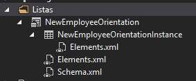

# Introdução à criação de Suplementos do SharePoint hospedados no SharePoint
Configurar um ambiente de desenvolvimento e criar seu primeiro Suplemento do SharePoint hospedado no SharePoint.
Os suplementos hospedados no SharePoint são um dos dois tipos principais de Suplementos do SharePoint. Para obter uma visão geral de Suplementos do SharePoint e dos dois tipos diferentes, confira  [Suplementos do SharePoint](sharepoint-add-ins.md). Veja um resumo dos suplementos hospedados no SharePoint:
  
    
    


- Eles contêm listas do SharePoint, Web Parts, fluxos de trabalho, páginas personalizadas e outros componentes, todos instalados em um subsite chamado Suplemento da Web, do site do SharePoint, no qual o suplemento está instalado.
    
  
- O único código que eles têm é JavaScript em páginas do SharePoint personalizadas.
    
  

 [
  
    
    
](get-started-creating-sharepoint-hosted-sharepoint-add-ins.md#Setup) [
  
    
    
](get-started-creating-sharepoint-hosted-sharepoint-add-ins.md#Create) [
  
    
    
](get-started-creating-sharepoint-hosted-sharepoint-add-ins.md#Code)
  
    
    


## Configurar seu ambiente de desenvolvimento
<a name="Setup"> </a>

Há várias maneiras de configurar um ambiente de desenvolvimento para Suplementos do SharePoint. Esta seção explica a maneira mais simples. Para obter alternativas, consulte  [Recursos adicionais](#bk_addresources).
  
    
    

### Obter as ferramentas


- Se você ainda não tiver o **Visual Studio** 2013 ou posterior instalado, instale-o usando as instruções em [Install Visual Studio](http://msdn.microsoft.com/library/da049020-cfda-40d7-8ff4-7492772b620f.aspx). Nós recomendamos o uso da  [versão mais recente do Centro de Download da Microsoft](https://www.visualstudio.com/downloads/download-visual-studio-vs).
    
  
- O Visual Studio inclui o **Microsoft Office Developer Tools for Visual Studio**. Às vezes, uma versão das ferramentas é lançada entre atualizações do Visual Studio. Para ter certeza de que você tem a versão mais recente das ferramentas, execute o [instalador para o Microsoft Office Developer Tools para Visual Studio 2013 ](http://aka.ms/OfficeDevToolsForVS2013) ou o [instalador para o Microsoft Office Developer Tools for Visual Studio 2015](http://aka.ms/OfficeDevToolsForVS2015). 
    
  

### Inscrever-se para obter um Office 365 Developer Site
<a name="o365_signup"> </a>


> [!OBSERVAçãO]
>  Talvez você já tenha acesso a um Office 365 Developer Site.> **Você é assinante do MSDN?** Os assinantes do Visual Studio Ultimate e do Visual Studio Premium com MSDN recebem uma Assinatura de Desenvolvedor do Office 365 como benefício. [Resgate seu benefício hoje.](https://msdn.microsoft.com/subscriptions/manage/default.aspx)> **Você tem um dos planos de assinatura do Office 365 a seguir?**> **Nesse caso, um administrador de assinatura do Office 365 pode criar um Site do Desenvolvedor** usando o [centro de administração do Office 365](https://portal.microsoftonline.com/admin/default.aspx). Para saber mais, consulte  [Criar um site do desenvolvedor em uma assinatura existente do Office 365](create-a-developer-site-on-an-existing-office-365-subscription.md). 
  
    
    

Existem duas maneiras de obter um plano do Office 365. 
  
    
    

- Comece com uma  [avaliação gratuita de 30 dias](https://portal.microsoftonline.com/Signup/MainSignUp.aspx?OfferId=6881A1CB-F4EB-4db3-9F18-388898DAF510&amp;DL=DEVELOPERPACK) com uma licença de usuário.
    
  
- Compre uma  [assinatura de desenvolvedor do Office 365](https://portal.microsoftonline.com/Signup/MainSignUp.aspx?OfferId=C69E7747-2566-4897-8CBA-B998ED3BAB88&amp;DL=DEVELOPERPACK). 
    
  

> [!DICA]
> Cada um destes links é aberto em uma nova janela ou guia para que você ainda possa ver as instruções a seguir. 
  
    
    


**Figura 1. Nome de domínio do Site de Desenvolvedor do Office 365**

  
    
    

  
    
    

  
    
    

  
    
    

  
    
    

1. A primeira página (não mostrada) do formulário de assinatura é autoexplicativo; forneça as informações solicitadas e então escolha **Avançar**.
    
  
2. Na segunda página, mostrada na Figura 1, especifique uma ID do usuário para o administrador da assinatura.
    
  
3. Crie um subdomínio de **.onmicrosoft.com**; por exemplo, contoso.onmicrosoft.com.
    
    Depois da assinatura, você usa as credenciais resultantes (no formato  _IDUsuário_@ _seudomínio_.onmicrosoft.com) para entrar em seu site do portal do Office 365 ao administrar sua conta. Seu Site do Desenvolvedor do SharePoint Online é configurado em seu novo domínio: **http:// _seudomínio_.sharepoint.com**.
    
  
4. Escolha **Avançar** e preencha a página final do formulário. Se você optar por fornecer um número de telefone para obter um código de confirmação, poderá fornecer um número de celular ou telefone fixo, mas *não*  um número de protocolo VoIP.
    
  

    
> [!OBSERVAçãO]
> Se você estiver conectado a outra conta da Microsoft ao tentar inscrever-se em uma conta de desenvolvedor, poderá ver esta mensagem: "Desculpe, a ID do usuário inserida não funcionou. Aparentemente, ela não é válida. Insira a ID do usuário que sua organização atribuiu a você. Geralmente, sua ID do usuário se parece com  *nome@exemplo.com*  ou *nome@exemplo.onmicrosoft.com*  ".> Se essa mensagem for exibida, faça logout da conta da Microsoft que você estava usando e tente novamente. Se ainda obtiver a mensagem, limpe o cache do seu navegador ou alterne para a **Navegação InPrivate** e então preencha o formulário.
  
    
    

Depois de concluir o processo de inscrição, seu navegador abrirá a página de instalação do Office 365. Escolha o ícone do Administrador para abrir a página do centro de administração.
  
    
    

**Figura 2. Página do Centro de administração do Office 365**

  
    
    

  
    
    

  
    
    

  
    
    

1. Aguarde a conclusão da configuração do Site do Desenvolvedor. Após a conclusão do provisionamento, atualize a página do centro de administração do em seu navegador.
    
  
2. Em seguida, escolha o link **Criar suplementos** no canto superior esquerdo da página para abrir o Site do Desenvolvedor. Você vai visualizar um site parecido com o da Figura 3. A lista **Suplementos em Teste** na página confirma que o site foi criado com o modelo Site do Desenvolvedor do SharePoint. Caso veja um site de equipe normal, aguarde alguns minutos e reinicie seu site.
    
  
3. Anote a URL do site; ela será usada na criação de projetos do Suplementos do SharePoint no Visual Studio.
    
  

**Figura 3. A home page do seu Site do Desenvolvedor com a lista Suplementos em teste**

  
    
    

  
    
    

  
    
    

  
    
    

  
    
    

## Criar o projeto do suplemento
<a name="Create"> </a>


1. Inicie o Visual Studio usando a opção **Executar como administrador**.
    
  
2. Escolha **Arquivo** > **Novo** > **Novo Projeto**.
    
  
3. Na caixa de diálogo **Novo Projeto**, expanda o nó **Visual C#**, expanda o nó **Office/SharePoint** e escolha **Suplementos** > **Suplementos do SharePoint**.
    
  
4. Nomeie o projeto como OrientaçãoparaFuncionários e escolha **OK**.
    
  
5. Na primeira caixa de diálogo **Especificar as configurações do suplemento do SharePoint**, forneça a URL completa do site do SharePoint que você deseja usar para depurar seu suplemento. Essa será a URL do Site do Desenvolvedor (use HTTPS e não HTTP na URL). Em **Como você deseja hospedar seu suplemento do SharePoint**, escolha **Hospedado pelo SharePoint**. Escolha **Concluir**.
    
  
6. Talvez você seja solicitado a fazer logon no seu Site do Desenvolvedor. Nesse caso, use suas credenciais de administrador da assinatura.
    
  

## Codificar seu suplemento
<a name="Code"> </a>

Para seu primeiro Suplemento do SharePoint hospedado pelo SharePoint, incluiremos a extensão clássica do SharePoint: uma lista personalizada e uma instância de lista.
  
    
    

1. No **Gerenciador de Soluções**, abra o arquivo AppManifest.xml.
    
  
2. Quando o designer de manifesto for aberto, adicione um espaço entre as palavras no campo **Title** para que ele contenha o textoOrientação para Funcionários. ( *Não*  altere o campo **Name**.)
    
  
3. Salve e feche o arquivo.
    
  
4. Clique com botão direito do mouse no projeto no **Gerenciador de Soluções** e escolha **Adicionar** > **Nova Pasta**. Nomeie a pasta como Listas.
    
  
5. Clique com botão direito do mouse na nova pasta e escolha **Adicionar** > **Novo Item**. A caixa de diálogo **Adicionar Novo Item** é aberta no nó **Office/SharePoint**.
    
  
6. Escolha **Lista**. Nomeie-a como OrientaçãoparaNovosFuncionários e escolha **Adicionar**. 
    
  
7. Na página **Escolher Configurações de Lista** do **Assistente de Personalização do SharePoint**, deixe o nome de exibição da lista como o padrão **OrientaçãoparaNovosFuncionários**, escolha o botão de opção **Criar um modelo de lista personalizável e uma instância de lista dele** e escolha **Padrão (Lista Personalizada)** na lista suspensa. Em seguida, escolha **Concluir**.
    
  
8. O assistente cria um modelo de lista **OrientaçãoparaNovosFuncionários** com uma instância de lista filho denominada **InstânciadeOrientaçãoparaNovosFuncionários**. Um designer de lista pode ser aberto. Ele é usado em uma etapa anterior.
    
  
9. Expanda o nó **InstânciadeOrientaçãoparaNovosFuncionários** no **Gerenciador de Soluções**, se ele ainda não estiver expandido, para que você possa distinguir claramente o arquivo elements.xml que é filho da  *instância*  da lista do arquivo elements.xml que é filho do *modelo*  de lista.
    
   **Nó de listas no Gerenciador de Soluções**

  

     
  

    
    
  
10. Abra o filho elements.xml do modelo de lista **OrientaçãoparaNovosFuncionários**. 
    
  
11. Adicione espaços ao atributo **DisplayName** (não ao atributo **Name**) para torná-lo mais amigável: "Orientação para Novos Funcionários" .
    
  
12. Defina o atributo **Description**"Informações de orientação sobre novos funcionários."
    
  
13. Mantenha todos os outros atributos com seu padrão, salve o arquivo e feche-o.
    
  
14. Se o designer de lista não estiver aberto, escolha o nó **OrientaçãoparaNovosFuncionários** no **Gerenciador de Soluções**.
    
  
15. Abra a guia **Lista** do designer. Essa guia é usada para definir certos valores para a *instância*  da lista, não o *modelo*  da lista, mas tem alguns valores padrão herdados do modelo.
    
  
16. Altere os valores dessa guia para o seguinte:
    
  - **Título**: Novos Funcionários em Campinas
    
  
  - **URL da Lista**: Listas/NovosFuncionáriosemCampinas
    
  
  - **Descrição**: Os novos funcionários em Campinas.
    
  

     Deixe as caixas de seleção com seu status padrão, salve o arquivo e feche o designer.
    
  
17. A instância da lista pode ter seu antigo nome no **Gerenciador de Soluções**. Nesse caso, abra o menu de atalho para **InstânciadeOrientaçãoparaNovosFuncionários**, escolha **Renomear** e altere o nome paraNovosFuncionáriosemCampinas.
    
  
18. Abra o arquivo schema.xml.
    
  
19. No elemento **View** cujo valor **BaseViewID** é "0", substitua o elemento existente **ViewFields** pela marcação a seguir. (Use exatamente este GUID para o **FieldRef** nomeado como `Title`.)
    
     *Quebras de linha podem ser incluídas em lugares inesperados nesse arquivo schema.xml gerado automaticamente. Localize as marcas de início e de término correspondentes para o elemento **ViewFields**. Adicione quebras de linha para melhorar a legibilidade.* 
    


  ```
  
<ViewFields>
  <FieldRef Name="Title" ID="{fa564e0f-0c70-4ab9-b863-0177e6ddd247}" DisplayName="Employee" />
 </ViewFields>
  ```

20. Ainda no arquivo schema.xml, no elemento **View** cujo valor **BaseViewID** é "1", substitua o elemento **ViewFields** pela marcação a seguir. (Use exatamente esse GUID para o **FieldRef** nomeado como `LinkTitle`.)
    
  ```
  
<ViewFields>
  <FieldRef Name="LinkTitle" ID="{82642ec8-ef9b-478f-acf9-31f7d45fbc31}" DisplayName="Employee" />
</ViewFields>
  ```

21. Salve e feche o arquivo schema.xml.
    
  
22. Abra o arquivo elements.xml que é filho da  *instância*  da lista **NovosFuncionáriosemCampinas** (não o elements.xml que é filho do *modelo*  de lista **OrientaçãoparaNovosFuncionários**). 
    
  
23. Neste arquivo, preencha a lista com alguns dados iniciais. Faça isso adicionando o seguinte elemento de marcação **Data** como elemento filho do elemento **ListInstance**. 
    
  ```
  
<Data>
  <Rows>
    <Row>
      <Field Name="Title">Tom Higginbotham</Field>
    </Row>
    <Row>
      <Field Name="Title">Satomi Hayakawa</Field>
    </Row>
    <Row>
      <Field Name="Title">Cassi Hicks</Field>
    </Row>
    <Row>
      <Field Name="Title">Lertchai Treetawatchaiwong</Field>
    </Row>
  </Rows>
</Data>
  ```

24. Salve e feche o arquivo.
    
  
25. No **Gerenciador de Soluções**, clique duas vezes em **Recurso1** para abrir o designer de Recursos. No designer, defina o **Título** comoComponentes de Orientação para Novos Funcionários e defina a **Descrição** comoListas e outros componentes para os funcionários receberem orientação para a empresa. Salve o arquivo e feche o designer.
    
  
26. Se o **Recurso1** no **Gerenciador de Soluções** não for automaticamente renomeado, abra o menu de atalho, escolha **Renomear** e renomeie-o comoComponentesdeOrientaçãoparaNovosFuncionários.
    
  
27. Abra o arquivo Default.aspx.
    
  
28. Localize o elemento ASP.NET **Content** com a ID **PlaceHolderPageTitleInTitleArea**. Substitua a cadeia de caracteres padrão "Título da Página" por "Novos Funcionários por Localização".
    
  
29. Localize o elemento ASP.NET **Content** com a ID **PlaceHolderMain**.  *Substitua*  seu conteúdo pela marcação a seguir. O ` _spPageContextInfo` é um objeto JavaScript que o SharePoint inclui automaticamente na página. A propriedade `webAbsoluteUrl` retorna a URL do suplemento da Web.
    
  ```XML
  
<p><asp:HyperLink runat="server"
    NavigateUrl="JavaScript:window.location = _spPageContextInfo.webAbsoluteUrl + '/Lists/NewEmployeesInSeattle/AllItems.aspx';" 
    Text="New Employees in Seattle" /></p>

  ```


## Executar o suplemento e testar a lista
<a name="Code"> </a>


  
    
    

1. Use a tecla F5 para implantar e executar seu suplemento. O Visual Studio faz uma instalação temporária do suplemento em seu site do SharePoint de teste e executa o suplemento imediatamente. (Para saber como os usuários finais executam um Suplemento do SharePoint instalado, consulte  [Próximas Etapas](#Nextsteps).)
    
  
2. Quando a página padrão do suplemento for exibida, escolha o link **Novos Funcionários em Campinas** para abrir a instância da lista personalizada.
    
   **Página de modo de exibição de lista e página padrão**

  

     
  

    
    
  
3. Adicione e exclua itens da lista.
    
  
4. Para encerrar a sessão de depuração, feche a janela do navegador ou interrompa a depuração no Visual Studio. Sempre que você pressiona F5, o Visual Studio retira a versão anterior do suplemento e instala a última mais recente.
    
  
5. Você vai trabalhar com esse suplemento e com a solução do Visual Studio em outros artigos. Além disso, é uma prática recomendada retirar o suplemento uma última vez, quando deixar de trabalhar com ele por algum tempo. Clique com botão direito do mouse no projeto no **Gerenciador de Soluções** e escolha **Retirar**.
    
  

## 
<a name="Nextsteps"> </a>

Até o momento, não há muitas informações de orientação na lista. Vamos adicionar algumas em artigos posteriores nesta série. Mas, primeiro, faça uma pausa breve na codificação para saber mais sobre como implantar o Suplementos do SharePoint no  [Implantar e instalar um hospedado no SharePoint SharePoint Add-in](deploy-and-install-a-sharepoint-hosted-sharepoint-add-in.md).
  
    
    

