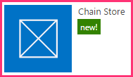
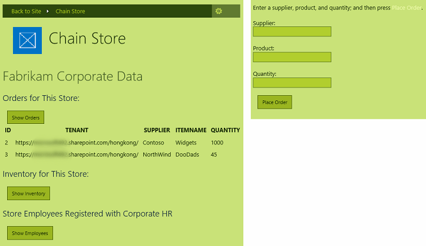

# Dar seu suplemento a aparência do SharePoint
Saiba como dar sua hospedado em provedor Suplementos do SharePoint a aparência do SharePoint.
Este é o segundo em uma série de artigos sobre noções básicas do desenvolvimento hospedado em provedor Suplementos do SharePoint. Você primeiro deve estar familiarizado com  [Suplementos do SharePoint](sharepoint-add-ins.md) e os artigos anteriores desta série:
  
    
    


-  [Introdução à criação de suplementos do SharePoint hospedados pelo provedor](get-started-creating-provider-hosted-sharepoint-add-ins.md)
    
  

No artigo anterior desta série, você aprendeu como configurar um ambiente de desenvolvimento e usar Visual Studio para criar um primeiro "Olá mundo" nível suplemento que expõe os dados do SharePoint no aplicativo da web remoto do suplemento. Neste artigo, vamos começar com uma solução de Suplemento do SharePoint que já foi criada. Ela inclui um aplicativo de formulários ASP.NET da Web e um banco de dados do SQL Azure. Criamos essas áreas para que a porque esta série de artigos destina-se ao focalizar apenas Suplementos do SharePoint. Você está adicionando mais funcionalidade do SharePoint e integração para o suplemento com cada artigo nesta série.
  
    
    


## Familiarize-se o suplemento base

Não vamos para ensinar ASP.NET ou T-SQL de programação em desta série, mas você precisa conhecer um pouco sobre os componentes de remota do add-in, para que possamos começar integrá-los do SharePoint. O cenário do add-in visualiza uma cadeia de lojas de varejo e cada repositório tem um site de equipe em uma assinatura SharePoint Online da empresa pai. Quando um repositório instala o suplemento em seu site de equipe, o suplemento permite que eles integre seus dados do SharePoint e experiência com dados no banco de dados da empresa pai. Cada instância do add-in tem seu próprio multilocação no banco de dados corporativo e os usuários só podem interagir com dados corporativos que está associados ao seu repositório.
  
    
    

### Comece criando sites de equipe para dois repositórios na cadeia


1. Abra a home page do seu SharePoint Online e, em seguida, clique no link de **Conteúdo do Site** no início rápido. Na página **Conteúdo do Site**, role para baixo até ver o **novo subsite** vincular e clique nela.
    
  
2. Na página **Novo Site do SharePoint**, preencha o formulário para um novo site de equipe usando os valores na captura de tela a seguir.
    
     
  

  

  
3. Deixe todas as outras configurações com seus valores padrão e pressione **criar**.
    
  

### Explore o suplemento


1. Vá para  [SharePoint_Provider-hosted_Add-Ins_Tutorials](https://github.com/OfficeDev/SharePoint_Provider-hosted_Add-ins_Tutorials) e clique no botão **Download ZIP** para baixar o repositório em sua área de trabalho. Descompacte o arquivo.
    
  
2. Inicialize Visual Studio *como administrador*  e abra BeforeSharePointUI.sln. Há três projetos na solução:
    
  - **ChainStore** - o projeto Suplemento do SharePoint.
    
  
  - **ChainStoreWeb** - o aplicativo web remoto.
    
  
  - **ChainCorporateDB** - o banco de dados do SQL Azure.
    
  
3. Selecione o projeto **ChainStore** e, na janela **Propriedades**, defina a propriedade de **URL do Site**, como a URL completa do site da equipe de Hong Kong: https://{YOUR_SHAREPOINT_DOMAIN}/hongkong/. Certifique-se de incluir o caractere "/" no final. Pressione o botão **Salvar**.  *Em algum momento nesse processo, você será solicitado a fazer logon no sua assinatura SharePoint Online.* 
    
  
4. Com o botão direito no nó da solução na parte superior do **Gerenciador de soluções** e selecione **definir projetos de inicialização**.
    
  
5. Verifique se que todos os três projetos estão definidos para **Iniciar** na coluna **ação**.
    
  
6. Use a tecla F5 para implantar e executar seu suplemento Visual Studio hospeda o aplicativo da web remoto no IIS Express e hospeda o banco de dados do SQL no SQL Express. Ele também faz uma instalação temporária do add-in no seu site do SharePoint de teste e executa imediatamente o add-in. Você será solicitado para conceder permissões para o suplemento antes que ela seja iniciar página é aberta.
    
  
7. Página de iniciar do add-in se parece com a pessoa no captura de tela abaixo. AT a parte superior é o nome do site do SharePoint onde o suplemento está instalado. Esse é um efeito de lado alguns códigos de exemplo que gerar o Office Developer Tools for Visual Studio. Você vai alterar isso em uma etapa posterior. A página tem áreas onde os dados de corporativo **inventário**, **pedidos** e tabelas de banco de dados do SQL de **funcionários** podem ser vistos. Nestas tabelas estão vazias inicialmente.
    
     
  

  

  
8. Abra o link de **Formulário de pedido** na parte inferior da página para abrir um formulário de pedido. Insira alguns valores no formulário e pressione **Fazer pedido**. A captura de tela a seguir mostra um exemplo. Ele não aparecerá que nada tem nappened, mas o código por trás do botão passa os valores para um procedimento armazenado parametrizado no banco de dados SQL. Usar procedimentos armazenados parametrizados protege o banco de dados contra ataques de injeção de SQL.
    
     
  

  

  
9. Use o botão Voltar do navegador volte à página inicial e e pressione o botão **Mostrar pedidos**. A página será atualizada e seu pedido serão exibidos na página semelhante à seguinte imagem.
    
    A tabela tem um campo de **inquilino** com a URL do seu site do SharePoint de teste como o valor. Isso não se refere à assinatura de SharePoint Online que às vezes é denominada um locatário. Em vez disso, cada instância do add-in é um locatário distinto no banco de dados corporativo. Desde que não mais de uma instância de um suplemento pode ser instalada em uma web específica de host do SharePoint, a URL da web host pode ser usada como um discriminador inquilino no banco de dados. (Para um atualizador a distinção entre web de host e suplemento de web, consulte [Suplementos do SharePoint](sharepoint-add-ins.md).) Todos os procedimentos armazenados do add-in incluem o valor Discriminatório quando eles gravar ou lidos a partir do banco de dados. Isso garante que, quando um usuário pressiona um botão **Mostrar pedidos** (ou **Mostrar funcionários** ou **Mostrar inventário** ), somente os dados que está associados com o repositório do usuário são recuperados do banco de dados. Esse design também garante que os usuários podem único lugar ordena e adicione funcionários para seu próprio repositório.
    
    O aplicativo web remoto obtém o host web URL de um parâmetro de cadeia de caracteres de consulta que SharePoint adiciona para a URL da página inicial quando ele é iniciado o add-in. Desde que o SSL estiver sendo usado, essa cadeia de caracteres de consulta é criptografada conforme ele vai pela Internet ao aplicativo web remoto.
    
     
  

  

  
10. Para encerrar a sessão de depuração, feche a janela do navegador ou interrompa a depuração no Visual Studio. Sempre que você pressiona F5, o Visual Studio retira a versão anterior do suplemento e instala a última mais recente.
    
  
11. Por padrão o suplemento permanece instalado na web do SharePoint host entre sessões em Visual Studio de depuração. Para ver como os usuários finais seria iniciá-la depois de instalado, abra o site do SharePoint de Hong Kong Fabrikam no seu navegador e navegue até a página de **Conteúdo do Site**. Você verá os blocos para o suplemento como está na seguinte imagem:
    
     
  

    
    > [!OBSERVAçãO]
      > Se você clicar na lado a lado, a página inicial não será aberto porque Visual Studio fecha a sessão IIS Express quando você interromper a depuração.

## Configurar Visual Studio para reconstruir o banco de dados corporativo com cada sessão de depuração
<a name="Rebuild"> </a>

Por padrão, Visual Studio será  *reconstrução do banco de dados do SQL Express*  . Portanto pedidos e outros itens que você adicionar ao banco de dados em uma sessão de depuração estão ainda no banco de dados em sessões posteriores. É mais fácil iniciar com um banco de dados vazio cada vez, que portanto você pressionar F5, siga estas etapas:
  
    
    

1. Com o botão direito no projeto **ChainCorporateDB** e selecione **Propriedades**.
    
  
2. Abra a guia **Depurar** e habilitar a opção **sempre recriar o banco de dados**.
    
  

## Dar ao aplicativo web remoto a aparência do SharePoint
<a name="Rebuild"> </a>

Em alguns cenários, você deseja que suas páginas remotas ter sua própria identidade visual, mas na maioria dos casos eles devem imitar a interface do usuário do SharePoint para que os usuários se sentir estiverem ainda dentro do SharePoint.
  
    
    

### Adicionar Cromo do SharePoint e a barra superior a página inicial


1. No **Solution Explorer**, navegue até **ChainStoreWeb | Páginas** e abra o arquivo CorporateDataViewer.aspx. Este é página de iniciar do add-in
    
  
2. Na seção **head**, você verá um script que carrega algumas das bibliotecas de JavaScript. Adicione o seguinte script adicional abaixo dele. Esse script carrega o SP. INTERFACE DO USUÁRIO. Arquivo de Controls.js que está em cada site do SharePoint na /_layouts/15/pasta. Entre outras coisas, esse arquivo será carregado biblioteca do SharePoint CSS.
    
  ```
  
<script type="text/javascript">
    var hostweburl;

    // Load the SharePoint resources.
    $(document).ready(function () {

        // Get the URI decoded add-in web URL.
        hostweburl =
            decodeURIComponent(
                getQueryStringParameter("SPHostUrl")
        );

        // The SharePoint js files URL are in the form:
        // web_url/_layouts/15/resource.js
        var scriptbase = hostweburl + "/_layouts/15/";

        // Load the js file and continue to the 
        // success handler.
        $.getScript(scriptbase + "SP.UI.Controls.js")
    });

    // Function to retrieve a query string value.
    function getQueryStringParameter(paramToRetrieve) {
        var params =
            document.URL.split("?")[1].split("&amp;");
        var strParams = "";
        for (var i = 0; i < params.length; i = i + 1) {
            var singleParam = params[i].split("=");
            if (singleParam[0] == paramToRetrieve)
                return singleParam[1];
        }
    }
</script>
  ```

3. Na parte superior da seção corpo da página, adicione a seguinte marcação. Isso irá inserir SharePoint barra superior, chamada de controle de cromo, até a página. Os detalhes dessa marcação se tornará mais claros ao testar o suplemento revisado neste artigo. (Cadeia de caracteres "aplicativo" aparece em alguns dos nomes de propriedade porque suplementos usada para ser chamado "apps").
    
  ```
  
<!-- Chrome control placeholder. Options are declared inline.  -->
<div 
    id="chrome_ctrl_container"
    data-ms-control="SP.UI.Controls.Navigation"  
    data-ms-options=
        '{  
            "appHelpPageUrl" : "Help.aspx",
            "appIconUrl" : "/Images/AppIcon.png",
            "appTitle" : "Chain Store",
            "settingsLinks" : [
                {
                    "linkUrl" : "Account.aspx",
                    "displayName" : "Account settings"
                },
                {
                    "linkUrl" : "Contact.aspx",
                    "displayName" : "Contact us"
                }
            ]
         }'>
</div>
  ```

4. Os cabeçalhos de **H1** e o hiperlink no corpo da página usarão automaticamente estilos definidos na biblioteca CSS do SharePoint, para que eles não precisam ser alterado. Para ilustrar como você pode usar os estilos do SharePoint, defina os títulos de coluna nos três controles **GridView** do SharePoint "todas maiúsculas" estilo adicionando o atributo **HeaderStyle-CssClass** para cada um dos controles e definindo seu valor como " `ms-uppercase`". O exemplo a seguir é um exemplo. Fazer a mesma alteração para todos os três controles **GridView**.
    
  ```XML
  
<asp:GridView ID="ordersGridView" runat="server" CellPadding="5" GridLines="None"
HeaderStyle-CssClass="ms-uppercase" />
  ```

5. O controle de cromo usa o ícone do add-in, portanto precisamos de uma segunda cópia do arquivo de ícone no servidor web remoto. No **Solution Explorer**, clique com o botão o arquivo AppIcon.png no projeto **ChainStore** e escolha **Copiar**.
    
  
6. Com o botão direito na pasta de **imagens** no projeto **ChainStoreWeb** e escolha **Colar**.
    
  
7. Abra o arquivo CorporateDataViewer.aspx.cs.
    
  
8. A classe  `CorporateDataViewer` declara um membro privado do tipo **SharePointContext**. Essa classe é definida no arquivo SharePointContext.cs que o Office Developer Tools for Visual Studio geradas quando o projeto foi criado. Você pode considerá-la como algo parecido com a classe **HttpContextBase** do ASP.NET, mas com informações de contexto do SharePoint, como a URL da web host, adicionado a ela.
    
    No método **Page_Load**, há uma declaração de **using** que grava o nome da web host do SharePoint na página Iniciar remoto. Este é o código de amostra, portanto, exclua a instrução inteira **using**. (Mas deixe a linha que inicializa a variável `spContext` ). O método agora deve se parecer com o seguinte.
    


  ```cs
  
protected void Page_Load(object sender, EventArgs e)
{
    spContext = SharePointContextProvider.Current.GetSharePointContext(Context);
}
  ```

9. Há quatro outros arquivos do ASP.NET que precisam de UI do SharePoint:
    
  - Account.aspx
    
  
  - Contact.aspx
    
  
  - Help.aspx
    
  
  - OrderForm.aspx
    
  

    > [!OBSERVAçãO]
      > O último arquivo aspx do projeto, EmployeeAdder.aspx, nunca na verdade é processado, portanto você não altere sua interface do usuário. Você saberá mais sobre ele em um artigo posterior desta série.

    Mas não queremos que o controle de cromo essas páginas. Queremos apenas o acesso à biblioteca do SharePoint CSS. Para cada um desses quatro, adicione a seguinte marcação ao elemento **head**.
    


  ```XML
  
<link type="text/css" rel="stylesheet"
href="<%= spContext.SPHostUrl.ToString() + "_layouts/15/defaultcss.ashx" %>" />
  ```

10. Esta etapa e a próxima já tenham sido feitas para a página de formulário de pedido e de página conta, para que eles se aplicam apenas ao contato e páginas de Ajuda. Para obter o objeto  `spContext` em cada uma das páginas, abrir o *. aspx.cs código por trás de arquivos para as três páginas aspx. Em cada um deles, adicione o seguinte membro à classe **Page**.
    
  ```cs
  
protected SharePointContext spContext;
  ```

11. Substitua o método **Page_Load** versão a seguir. O objeto está sendo recuperado do cache de sessão. Ele foi armazenado em cache lá quando ela foi criada pela primeira vez pelo método **Page_Load** da página de início do suplemento.
    
  ```cs
  protected void Page_Load(object sender, EventArgs e)
{
    spContext = Session["SPContext"] as SharePointContext;
}
  ```

12. Abra a página OrderForm.aspx. No elemento superior **Label**, substitua o elemento **<b>** a frase **Fazer pedido** span marcas que fazem referência a classe CSS `ms-accentText` . O controle de toda **Label** deve se parecer com isso quando terminar.
    
  ```XML
  
<asp:Label ID="lblOrderPrompt" runat="server"
         Text="Enter a supplier, product, and quantity; and then press <span class='ms-accentText'>Place Order</span>.">
</asp:Label>
  ```


## Execute o add-in e testar o novo SharePoint UI
<a name="Rebuild"> </a>


  
    
    

1. Use a tecla F5 para implantar e executar seu suplemento Visual Studio hospeda o aplicativo da web remoto no IIS Express e hospeda o banco de dados SQL em um SQL Express. Ele também faz uma instalação temporária do add-in no seu site do SharePoint de teste e executa imediatamente o add-in. Você será solicitado para conceder permissões para o suplemento antes que ela seja iniciar página é aberta.
    
  
2. Quando a página de início do add-in for aberta, ela agora se parece com uma página do SharePoint. Clique no link do **Formulário de pedido**. Ele também agora se parece com um formulário do SharePoint.
    
     
  

  

  
3. Criar um pedido e pressione **Fazer pedido**.
    
  
4. Use o botão Voltar do navegador volte à página inicial do suplemento e então pressione **Mostrar pedidos**. A página agora deve ser semelhante semelhante ao seguinte. Observe que os cabeçalhos de coluna agora são todas maiúsculas.
    
     
  

  

  
5. Pressione o ícone **?** no final do controle chrome. É aberta uma página de Ajuda simples. Clique em botão Voltar do navegador.
    
  
6. Pressione o ícone de engrenagem no controle de cromo. Abre um menu com links para uma conta e uma página de contato. Abra a página conta e use o botão Voltar do navegador para retornar à página inicial. Faça o mesmo para a página de contato.
    
  
7. Clique no botão de **volta para o Site** no controle de cromo. A home page da web host, o site de equipe do repositório de Hong Kong, será aberta.
    
  
8. Clique no ícone de engrenagem na barra superior e escolha **alterar a aparência**.
    
  
9. Siga as instruções para alterar o site para um da alternativa "procura".
    
  
10. Navegue até a página de **Conteúdo do Site** e inicie o aplicativo do repositório de cadeia de seu lado a lado. Suas páginas personalizadas executou na aparência escolhida. As capturas de tela a seguintes mostram como aparecem na aparência de **natureza** compostas.
    
     
  

  

  
11. Altere a aparência do site volta para o padrão, que é chamado **Office**.
    
  
12. Para encerrar a sessão de depuração, feche a janela do navegador ou interrompa a depuração no Visual Studio. Sempre que você pressiona F5, o Visual Studio retira a versão anterior do suplemento e instala a última mais recente.
    
  
13. Você vai trabalhar com esse suplemento e com a solução do Visual Studio em outros artigos. Além disso, é uma prática recomendada retirar o suplemento uma última vez, quando deixar de trabalhar com ele por algum tempo. Clique com botão direito do mouse no projeto no **Gerenciador de Soluções** e escolha **Retirar**.
    
  

## 
<a name="Nextsteps"> </a>

O suplemento agora se parece com o SharePoint, mas é ainda apenas um aplicativo web que realmente não integram com o SharePoint, além do que está sendo iniciado a partir de uma lado a lado no SharePoint. Você adicionará um comando personalizado, iniciado a partir de um botão da faixa de opções personalizada no próximo artigo:  [Incluir um botão personalizado do add-in](include-a-custom-button-in-the-provider-hosted-add-in.md).
  
    
    

