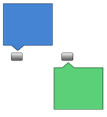
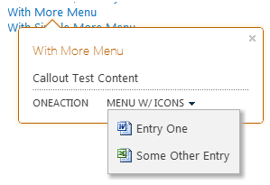

# Realce o conteúdo e aprimorar a funcionalidade do SharePoint hospedado SharePoint suplementos com o controle de texto explicativo
Controle de texto explicativo do SharePoint oferece uma maneira flexível para envolver seu usuário e demonstrem a funcionalidade do aplicativo hospedado no SharePoint. Você poderá configurá-lo de várias maneiras de acordo com a interface de usuário do seu aplicativo. Este artigo mostra como construir esse controle, adicioná-lo à sua página e personalizar sua aparência e comportamento.Ao fazer pesquisas em um site SharePoint 2013, você verá exemplos do controle texto explicativo em ação, conforme ele é exibida sempre que você passe o mouse sobre um resultado de pesquisa. A Figura 1 mostra o texto explicativo para um resultado de pesquisa único e mostra algumas das coisas típicas em um controle de conteúdo: título, algumas informações sobre o item na página e ações ( **Open** e **Enviar** ) que podem ser realizadas no item. Nesse caso, as informações e as ações são relativamente simples, mas você já pode ver duas vantagens para utilizá-lo. Primeiro, ele permite que você mostre informações adicionais sobre elementos em uma página quando que são necessários e em segundo lugar, ele fornece uma maneira elegante de adicionando funcionalidade para a página.
**Figura 1. Exemplo do texto explicativo controle em uma página de resultados de pesquisa do SharePoint 2013**

  
    
    

  
    
    

  
    
    

  
    
    

  
    
    

## Disponibilizar o controle para sua página HTML, incluindo o arquivo callout.js
<a name="GettingStarted"> </a>

Este exemplo usa o método  `SP.SOD.executeFunc` para garantir que o arquivo de script é carregado antes de executar qualquer código que depende dele.
  
    
    

```

SP.SOD.executeFunc("callout.js", "Callout", function () {
    });
```

A função que você passa para a função  `SP.SOD.executeFunc` contém o código que você deseja executar depois carrega o arquivo callout.js. Depois de carregar esses arquivos, você usar o objeto `CalloutManager` para criar um objeto `Callout` para cada elemento de página que precisa ter um controle de texto explicativo associado a ela. O `CalloutManager` é um único que armazena as referências a cada objeto `Callout` em uma página de uma matriz de associação. O objeto `Callout` tem apenas dois membros necessários: `ID` e `launchPoint`. O membro  `ID` é a chave que é mapeada para o objeto `Callout` o `CalloutManager`:  `CalloutManager["value of the callout's ID member"]`. O membro  `launchPoint` é um elemento de página HTML. Você pode, por exemplo, criar ou obter um elemento `div` na sua página e passe-o como um membro do objeto `Callout` . Por padrão, o controle de texto explicativo é exibida sempre que um usuário clica no elemento de `launchPoint` . Este exemplo mostra como criar o controle de texto explicativo possíveis mais simples com apenas dois membros necessários e uma cadeia de caracteres do título.
  
    
    


```

var calloutPageElement = document.createElement("div");
var callout = CalloutManager.createNew({
   ID: "unique identifier",
   launchPoint: calloutPageElement,
   title: "callout title"
});

```

Este texto explicativo em determinado surgirá e exibe um título na parte superior do controle sempre que um usuário clica no elemento da página. Você pode usar os membros opcionais para personalizar a aparência do controle, comportamento, posicionamento e ações de algumas maneiras muito poderosas. O controle de texto explicativo também tem um método de conjunto que você pode usar para definir um valor para qualquer parâmetro depois de criar uma instância do controle.
  
    
    


```

callout.set({openOptions:{event: "hover"}});
```

Você pode também definir valores para todos os membros de texto explicativo em um objeto  `CalloutOptions` e, em seguida, passe desse objeto para o método `createNew` .
  
    
    


```
var calloutPageElement = document.createElement("div");
var calloutOptions = new CalloutOptions();
calloutOptions.ID = unique identifier;
calloutOptions.launchPoint = calloutPageElement;
calloutOptions.title = callout title;
var callout = CalloutManager.createNew(calloutOptions);
```


## Como personalizar a aparência do texto explicativo controle
<a name="Appearance"> </a>

Você pode usar esses membros para controlar a exibição de texto explicativo.
  
    
    


|**Member**|**Finalidade**|**Valores válidos (padrão em negrito)**|
|:-----|:-----|:-----|
|título <br/> |Exiba um título na parte superior do controle. <br/> |cadeia de caracteres, **Nulo**, cadeia de caracteres que contém HTML <br/> |
|conteúdo <br/> |Exibição HTML dentro do controle sempre que não há nenhum valor para o membro  `contentElement` . <br/> |cadeia de caracteres que contém HTML, **null**, deve ser nula se `contentElement` possuir um valor <br/> |
|contentElement <br/> |Um elemento HTML dentro do controle de exibição quando não houver nenhum valor para o membro  `content` . <br/> |qualquer elemento HTML, **null**, deve ser nulo se `content` possuir um valor <br/> |
|contentWidth <br/> |Especifique a largura, em pixels, do contêiner de corpo de texto explicativo. Este contêiner também tem uma borda de 1 pixel e o preenchimento de 15 pixels em cada lado, portanto, o controle é 32 pixels de mais do que a largura do corpo que você especificar. A propriedade do controle CSS  `overflow` é definida como `hidden`, portanto, seu conteúdo será recortado se ela não se ajustarem ao interior a largura que você especificar. Se você definir esse membro em um balão open, a alteração terá efeito imediatamente. Isso não é verdadeiro dos outros membros. <br/> |Qualquer número entre 240 e 610, **350** (tornando o controle 382 pixels de largura por padrão) <br/> |
|beakOrientation <br/> |Especifique a orientação do ponteiro do controle texto explicativo ou bico. <br/> |**topBottom**, para se parecer com este (Figura 2): **Figura 2. Onde o bico do controle de texto explicativo é exibida com a orientação de topBottom**          **leftRight**, para se parecer com este (Figura 3): **Figura 3. Onde o bico do controle de texto explicativo é exibida com a orientação de leftright**         |
   

## Como personalizar o comportamento do controle texto explicativo
<a name="Behavior"> </a>

Você pode usar os seguintes membros para controlar o comportamento do texto explicativo. Comece com o membro importantes  `openOptions` porque ele permite que você especifique como o controle será aberto e fechar quando o usuário interage com ele na página.
  
    
    


|**Use esses valores para o membro  `openOptions`**|**Finalidade**|
|:-----|:-----|
|**{evento: "clique", closeCalloutOnBlur: true}** <br/> |Tornar o controle de texto explicativo aparecem quando o usuário clica no elemento  `launchPoint` com o mouse e fechar sempre que um usuário move o mouse para longe do elemento `launchPoint` . Como o valor de `event` é `click`, o valor da opção  `showCloseButton` é **verdadeira** por padrão e não pode ser alterado. Esta é a combinação de padrão de valores. <br/> |
| `{event: "hover", showCloseButton: true}` <br/> |Tornar o controle de texto explicativo aparecem quando o usuário focaliza o elemento  `launchPoint` com o mouse e fechar sempre que o usuário clica em um botão **X** no canto superior direito do controle. Porque o valor de `event` é `hover`, o valor da  `closeCalloutOnBlur` não for aplicável e não pode ser definido. <br/> |
| `{event: "click", closeCalloutOnBlur: false}` <br/> |Tornar o controle de texto explicativo aparecem quando o usuário focaliza o elemento  `launchPoint` com o mouse e fechar sempre que o usuário clica em um botão **X** no canto superior direito do controle. Como o valor de `event` é `click`, o valor da opção  `showClosebutton` é **verdadeira** por padrão e não pode ser alterado. <br/> |
   
Esses são os outros membros que você pode definir para controlar o comportamento do texto explicativo.
  
    
    


|**Use este membro**|**Finalidade**|**Valores válidos (padrão em negrito)**|
|:-----|:-----|:-----|
|onOpeningCallback <br/> |Execute ações que devem acontecer antes do controle de texto explicativo é processado na página. Porque o objeto  `Callout` deve ser passado como um parâmetro para a função que você fornecer, você pode usar esse membro para definir valores para qualquer uma das propriedades do controle antes que o controle é processado. Você também pode usar esse membro para começar a ações assíncronas que adicionar ou alteram o conteúdo do controle. Você pode definir um valor para esse membro somente uma vez. <br/> | `function(callout /*=Callout*/) {...}`, **Nulo** <br/> |
|onOpenedCallback <br/> |Execute ações que devem ocorrer depois que o controle de texto explicativo é totalmente animado e processado na página. Você pode usar esse membro para manipular o documento DOM (Object Model) do controle. Você pode definir um valor para esse membro somente uma vez. <br/> | `function(callout /*=Callout*/) {...}`, **Nulo** <br/> |
|onClosingCallback <br/> |Execute ações que devem acontecer enquanto o controle de texto explicativo está fechando, mas antes ele totalmente foi removido da página. Você pode definir um valor para esse membro somente uma vez. <br/> | `function(callout /*=Callout*/) {...}`, **Nulo** <br/> |
|onClosedCallback <br/> |Execute ações que devem ocorrer depois que o controle de texto explicativo é fechada e foi removido da página. Você pode definir um valor para esse membro somente uma vez. <br/> | `function(callout /*=Callout*/) {...}`, **Nulo** <br/> |
   

## Como usar os métodos de controle do texto explicativo
<a name="CalloutMethods"> </a>

Você pode usar esses métodos para personalizar o comportamento do controle texto explicativo.
  
    
    


|**Use este método**|**Finalidade**|**Valores de parâmetro válido**|
|:-----|:-----|:-----|
|Definir ({membro: valor}) <br/> |Defina os valores para membros após ter criado uma instância do controle. <br/> |Um par de nome/valor que define um valor para qualquer membro de controle do texto explicativo. <br/> ```var callout = new Callout({openOptions:{event: "click"}});callout.set({openOptions:{event: "hover"}});```|
|getOrientation() <br/> |Retorne um objeto  `CalloutOrientation` que indica qual maneira que o controle de texto explicativo está apontando. Este objeto tem quatro membros Boolean: `up`,  `down`,  `left`e  `right`. Enquanto o controle estiver aberto, dois desses valores será **true** e dois será **false** ( `up` e `right`, por exemplo). <br/> |Sem parâmetros <br/> |
|addEventCallback (cadeia de caracteres eventName, CalloutCallback de retorno de chamada <br/> |Registre uma função de retorno de chamada que é chamada sempre que o controle de texto explicativo é alterado para o estado especificado pelo parâmetro  `eventName` . <br/> |O parâmetro  `eventName` deve ser um destes valores: `opening`,  `open`,  `closing`,  `closed`. O parâmetro  `callback` deve ser uma função que obtém uma instância do controle como o primeiro parâmetro texto explicativo. <br/> |
|aberto <br/> |Exiba o controle. Se o controle já estiver aberto ou abertura, esse método retorna **false** e não faz nada. <br/> |Sem parâmetros <br/> |
|Close(bool useAnimation) <br/> |Oculte o controle. Se o controle estiver fechado ou já fechar, esse método retorna **false** e não faz nada. <br/> |Um valor Boolean que especifica se o controle é fechada com animação. Animação está desativado por padrão. <br/> |
|Alternar. <br/> |Alterne o estado do controle abrir e fechar. <br/> |Sem parâmetros <br/> |
|addAction(CallOutAction calloutAction) <br/> |Adicione um novo  `CalloutAction` à matriz de texto explicativo do controle de objetos `CalloutAction` . Esses objetos definem as ações seja mostrada no rodapé do controle. A seção de [Como adicionar ações para o controle de texto explicativo](#AddActions) explica como construir esses objetos. Você pode adicionar ações somente após a criação de uma instância do controle. O controle pode ter mais do que três ações e, se você tentar adicionar mais obterá uma exceção. <br/> |Um objeto  `CalloutAction` . <br/> |
|refreshActions() <br/> |Recarregar todas as ações que foram adicionadas ao controle. Você pode usar esse método para alterar, habilitar ou desabilitar ações enquanto o controle estiver aberto. <br/> |Sem parâmetros <br/> |
   

## Como adicionar ações para o controle de texto explicativo
<a name="AddActions"> </a>

Você adicionar ações depois que você criou uma instância do controle texto explicativo. Uma ação de texto explicativo pode consistir em uma única ação ou um menu de ações. Você pode adicionar até três ações a um controle de texto explicativo. Depois de ter criado uma ação de texto explicativo, você adicioná-lo ao objeto  `CalloutControl` com seu método `addAction` . Essa ação de exemplo abre uma nova janela no seu navegador após o usuário clicar no texto.
  
    
    

```

//Create CalloutAction
var calloutAction = new CalloutAction({
            text: "Open window"
            onClickCallback: function() {                
                window.open(url);
            }
        });

//Add Action to an instance of the CalloutControl        
        myCalloutControl.addAction(calloutAction);
```

Você também pode definir valores para todos os membros de  `CalloutAction` em um objeto `CalloutActionOptions` e passar desse objeto para o construtor de `CalloutAction` .
  
    
    


```

//Create CalloutAction
var calloutActionOptions = new CalloutActionOptions();
calloutActionOptions.text = "Open window";
actionOptions.onClickCallback = function() {
    window.open(url);
};
var calloutAction = new CalloutAction(calloutActionOptions);

//Add Action to an instance of the CalloutControl        
        myCalloutControl.addAction(calloutAction);
```

Você pode usar esses membros para definir o comportamento de uma ação do texto explicativo.
  
    
    


|**Use este membro**|**Finalidade**|**Valores válidos (padrão em negrito)**|
|:-----|:-----|:-----|
|texto (obrigatório) <br/> |Exiba um rótulo de texto para a ação. <br/> |cadeia de caracteres, **Nulo** <br/> |
|onClickCallback <br/> |Defina a ação que ocorre quando o usuário clica no rótulo de texto explicativo de ação. <br/> | `function(calloutAction /*=CalloutAction*/) {...}`, **Nulo** <br/> |
|isEnabledCallback <br/> |Defina uma função de retorno de chamada executada antes que o texto explicativo exibe e determina se a ação está habilitada. Se essa função retorna **true**, o texto explicativo exibirá a ação habilitada. Se ele retornar **false**, o texto explicativo exibe o texto de ação, mas desabilita a ação. <br/>  `function(calloutAction /*=CalloutAction*/) {...}`, **Nulo** <br/> |
|isVisibleCallback <br/> |Defina uma função de retorno de chamada executada antes que o texto explicativo exibe e determina se o texto de ação exibe. Se essa função retorna **true**, o texto explicativo exibe o texto de ação. Se ele retornar **false**, o texto explicativo oculta o texto de ação. Ações adicionais serão transferidos para a esquerda para tomar o lugar da ação oculto. <br/> | `function(calloutAction /*=CalloutAction*/) {...}`, **Nulo** <br/> |
|Dica de ferramenta <br/> |Exibir o texto quando o usuário focaliza o texto de ação do texto explicativo. <br/> |cadeia de caracteres, **Nulo** <br/> |
|disabledTooltip <br/> |Texto de exibição quando o usuário focaliza o texto de ação do texto explicativo e a ação de texto explicativo foi desabilitado (quando a função  `isEnabledCallback` retornará **false** ). <br/> |cadeia de caracteres, **Nulo** <br/> |
|menuEntries <br/> |Defina um menu de ações, em vez de uma única ação. A próxima seção explica como criar um  `CalloutActionMenuEntry` e adicioná-lo a um objeto `CalloutAction` . <br/> |[ `CalloutActionMenuEntry`, …], null <br/> |
   

### Como adicionar menus de ação para o controle de texto explicativo

Quando uma ação de texto explicativo contém um menu, em vez de uma única ação, o usuário vê uma seta para baixo ao lado do texto de ação do texto explicativo, como na Figura 4.
  
    
    

**Figura 4. Uma ação de texto explicativo exibe um menu quando um usuário clica na seta ao lado do rótulo de ação**

  
    
    

  
    
    

  
    
    
Você pode criar tantas entradas de menu conforme desejado e adicioná-los à ação de texto explicativo, passando-los em uma matriz, como o valor do membro  `menuEntries` do objeto `CalloutAction` .
  
    
    


```

//Create two menu entries.
var menuEntry1 = new CalloutActionMenuEntry("Entry One", calloutActionCallbackFunction, "/_layouts/images/DOC16.GIF");
var menuEntry2 = new CalloutActionMenuEntry("Some Other Entry", calloutActionCallbackFunction, "/_layouts/images/XLS16.GIF");

//Add the menu entries to the callout action.
var calloutAction = new CalloutAction({
   text: "MENU W/ ICONS",
   menuEntries: [menuEntry1, menuEntry2]
})

//Add the callout action to the callout control.
callout.addAction(calloutAction);

```

O construtor de  `CalloutActionMenuEntry` admite três parâmetros. Os primeiros dois parâmetros são necessários. O terceiro é opcional, mas pode ser útil porque ele permite que você exiba um ícone com o texto.
  
    
    

- Passe uma cadeia de caracteres como o primeiro parâmetro para exibir um rótulo de texto para cada entrada de menu.
    
  
- Passe uma função como o segundo parâmetro para definir a ação que ocorre quando o usuário clica em que o texto da entrada de menu.
    
  
- Passe uma cadeia de caracteres que contém a URL para o ícone que você deseja exibir à esquerda do rótulo de texto.
    
  

## Como usar o CalloutManager para criar e gerenciar as ocorrências do texto explicativo controle
<a name="UseCalloutManager"> </a>

O objeto único  `CalloutManager` armazena referências a cada objeto `Callout` em uma página. Ele armazena cada instância do texto explicativo controle em uma matriz de associação onde o valor de `ID` de cada controle é a chave. O `CalloutManager` contém métodos que ajudarão-lo a criar e gerenciar os objetos `Callout` que armazena.
  
    
    


|**Use este método**|**Objetivo**|**Valores de parâmetro válido**|
|:-----|:-----|:-----|
|createNew(members) <br/> |Crie um novo objeto de  `Callout` . Quando você fizer isso, o `CalloutManager` adiciona uma entrada para o controle em sua matriz de associação, com o valor do membro necessário `ID` como a chave. <br/> |Uma matriz de associação que atribui valores a cada membro que você deseja usar. Os membros  `ID` e `launchPoint` são necessários. <br/> |
|createNewIfNecessary (membros) <br/> |Criar um objeto de  `Callout` se `launchPoint` que você passa como um parâmetro não tem um texto explicativo controle atribuído a ele já. <br/> |Uma matriz de associação que atribui valores a cada membro que você deseja usar. Os membros  `ID` e `launchPoint` são necessários. <br/> |
|getFromLaunchPoint: função (/*@type(HTMLElement)*/launchPoint) <br/> |Obtenha o objeto  `Callout` associado `launchPoint` fornecido na função. Este método gera uma exceção se o `launchPoint` não tem um objeto `Callout` atribuído a ele. <br/> |Sem parâmetros <br/> |
|getFromLaunchPointIfExists: função (/*@type(HTMLElement)*/launchPoint) <br/> |Obtenha o objeto  `Callout` associado `launchPoint` fornecido na função. Este método retornará null se o `launchPoint` não tem um objeto `Callout` atribuído a ele. <br/> |Sem parâmetros <br/> |
|getFromCalloutDescendant: função (/*@type(HTMLElement)*/descendant) <br/> |Obtenha o objeto  `Callout` associado ao elemento HTML fornecido na função elemento específico. Esse elemento pode ser qualquer descendente do elemento de texto explicativo. Por exemplo, você poderia passar o valor do membro `contentElement` atribuído quando você criou o objeto `Callout` . Este método gera uma exceção se o descendente não tiver um objeto `Callout` associado a ela. <br/> |Sem parâmetros <br/> |
|closeAll() <br/> |Fecha todos os objetos de open  `Callout` . Esse método retorna true se ela será fechada pelo menos um balão. <br/> |Sem parâmetros <br/> |
|isAtLeastOneCalloutOpen() <br/> |Verificar se pelo menos um balão está aberto. <br/> |Sem parâmetros <br/> |
   

## Como posicionar o controle de texto explicativo na página
<a name="Positioning"> </a>


|**Use este membro**|**Finalidade**|**Valores válidos (padrão em negrito)**|
|:-----|:-----|:-----|
|boundingBox <br/> |Especifica o elemento HTML que servirá como o equivalente a  `offsetParent` do controle texto explicativo. Por padrão, o valor padrão será de texto explicativo do controle `offsetParent`, mas você pode usar esse membro para certificar-se de que o controle está posicionado corretamente. O controle de texto explicativo tentará se posicionar para que ele fique visível nessa caixa. Ele alterará direção (de cima para baixo ou da esquerda para a direita, dependendo da orientação bico) para permanecem visíveis dentro dele. <br/> |qualquer elemento HTML, **o offsetParent do elemento HTML que contém o controle de texto explicativo** <br/> |
|positionAlgorithm <br/> |Substitua o padrão de posicionamento de algoritmo para o controle de texto explicativo. A seção a seguir descreve como usar o objeto  `calloutPositioningProxy` para gravar posicionamento algoritmos para o controle de texto explicativo. <br/> |**CalloutOptions.prototype.defaultPositionAlgorithm**, `function(calloutPositioningProxy) { ... }` <br/> |
   

### Como escrever posicionamento algoritmos com calloutPositioningProxy

O objeto  `calloutPositioningProxy` contém métodos e propriedades que você pode usar para substituir a lógica de posicionamento que o controle de texto explicativo usa por padrão. Por exemplo, se você desejar que o controle apareça abaixo e à direita do elemento `launchPoint` todos os do tempo, você escrever um algoritmo de posicionamento se parece com o seguinte.
  
    
    

```

function alwaysGoDownAndRight(calloutPositioningProxy)  {
    calloutPositioningProxy.moveDownAndRight();
} 

```

Em seguida, seria passada que funcionam como o valor do membro de  `positionAlgorithm` do objeto `Callout` . Você pode fazer isso quando você cria o `Callout`ou posterior, definindo o valor.
  
    
    


```

callout.set({positionAlgorithm: alwaysGoDownAndRight});

```

Você sempre pode dar uma olhada no padrão posicionamento lógica iniciando o console de JavaScript do seu navegador (o Internet Explorer F12 Developer Tools, por exemplo).
  
    
    


```

CalloutOptions.prototype.positionAlgorithm.toString()
```

Você pode usar esses métodos no objeto  `CalloutPositioningProxy` para gravar suas próprias posicionamento lógica.
  
    
    


|**Método**|**Descrição**|
|:-----|:-----|
|isCalloutTooFarTop() <br/> |Retorna booleano. <br/> |
|isCalloutTooFarRight() <br/> |Retorna booleano. <br/> |
|isCalloutTooFarBottom() <br/> |Retorna booleano. <br/> |
|isCalloutTooFarLeft() <br/> |Retorna booleano. <br/> |
|isCalloutLeftOfHardBoundingBox() <br/> |Retorna booleano. Se **true**, o lado esquerdo do controle fica fora do seu elemento do contêiner. Ele não estiver visível e o usuário não é possível rolar a ela. <br/> |
|isCalloutRightOfHardBoundingBox() <br/> |Retorna booleano. Se **true**, à direita do controle fica fora do seu elemento do contêiner. Ele não estiver visível e o usuário não é possível rolar a ela. <br/> |
|isCalloutAboveHardBoundingBox() <br/> |Retorna booleano. Se **true**, a parte superior do controle fica fora do seu elemento do contêiner. Ele não estiver visível e o usuário não é possível rolar a ela. <br/> |
|isCalloutBelowHardBoundingBox() <br/> |Retorna booleano. Se **true**, a parte inferior do controle fica fora do seu elemento do contêiner. Ele não estiver visível e o usuário não é possível rolar a ela. <br/> |
|isOrientedUp() <br/> |Retorna booleano. <br/> |
|isOrientedDown() <br/> |Retorna booleano. <br/> |
|isOrientedLeft() <br/> |Retorna booleano. <br/> |
|isOrientedRight() <br/> |Retorna booleano. <br/> |
|moveUpAndRight() <br/> |Retornará nothing. Altera a direção do controle. <br/> |
|moveUpAndLeft() <br/> |Retornará nothing. Altera a direção do controle. <br/> |
|moveDownAndRight() <br/> |Retornará nothing. Altera a direção do controle. <br/> |
|moveDownAndLeft() <br/> |Retornará nothing. Altera a direção do controle. <br/> |
|moveTowardsOppositeQuadrant() <br/> |Retornará nothing. Altera a direção do controle. <br/> |
|flipHorizontal() <br/> |Retornará nothing. Altera a direção do controle. <br/> |
|flipVertical() <br/> |Retornará nothing. Altera a direção do controle. <br/> |
|numberOfEdgesCollidingWithBoundingBox() <br/> |Retorna um número inteiro entre 0 e 4 que representa o número de bordas onde o texto explicativo entra em conflito com a caixa de contorno visível. Por exemplo, se a parte superior do controle é cortada pela parte superior do corpo do documento depois de chamar o método  `moveUpAndRight()` , o método `numberOfEdgesCollidingWithBoundingBox()` retornará um número maior que 1. <br/> |
   
Esse algoritmo de posicionamento torna o controle vá acima ou abaixo do texto. A propriedade  `isRTL` do `CalloutPositioningProxy` informa se o texto está exibindo um idioma da direita para a esquerda. Você verificar esta propriedade para garantir que o controle sempre está posicionado corretamente em relação o texto na página.
  
    
    


```
function examplePositionAlgorithm(calloutPositioningProxy) {
    if (!calloutPositioningProxy.isRTL) {
        calloutPositioningProxy.moveDownAndRight();
        if (calloutPositioningProxy.isCalloutTooFarBottom()) {
            calloutPositioningProxy.moveUpAndRight();
        }
    }
    else {
        calloutPositioningProxy.moveDownAndLeft();
        if (calloutPositioningProxy.isCalloutTooFarBottom()) {
            calloutPositioningProxy.moveUpAndLeft();
        }
    }
}
callout.set({positionAlgorithm: examplePositionAlgorithm});

```

Esse algoritmo de posicionamento altera a direção padrão do controle para  `downAndRight` em vez de `upAndRight`, mas ele usa o algoritmo padrão, se houver qualquer colisão.
  
    
    


```

function tryDownAndRightThenGoDefault(calloutPositioningProxy) {
    if (!calloutPositioningProxy.isRTL)
        calloutPositioningProxy.moveDownAndRight();
    else
        calloutPositioningProxy.moveDownAndLeft();
    
    if (calloutPositioningProxy.numberOfEdgesCollidingWithBoundingBox() > 0)
        return CalloutOptions.prototype.positionAlgorithm.apply(this, arguments);
};
callout.set({positionAlgorithm: tryDownAndRightThenGoDefault});

```


## Recursos adicionais
<a name="bk_addresources"> </a>


-  [SharePoint 2013: usar exibições de lista, textos explicativos e caixas de diálogo em hospedado no SharePoint suplementos](http://code.msdn.microsoft.com/officeapps/SharePoint-2013-Use-list-cb3e4e14)
    
  
-  [Introdução à criação de Suplementos do SharePoint hospedados no SharePoint](get-started-creating-sharepoint-hosted-sharepoint-add-ins.md)
    
  
-  [Criar um básico hospedado no SharePoint suplemento usando ferramentas de desenvolvimento do Napa Office 365](create-a-basic-sharepoint-hosted-add-in-by-using-napa-office-365-development-too.md)
    
  
-  [Design de eu para o SharePoint Add-ins](ux-design-for-sharepoint-add-ins.md)
    
  

  
    
    
