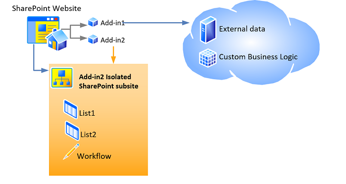

# Host webs, suplemento webs e componentes do SharePoint no SharePoint 2013
Saiba mais sobre a distinção entre webs de host e o suplemento webs. Também Descubra quais componentes SharePoint 2013 podem ser incluídos em um Suplemento do SharePoint, que são implantados na Web de host, que são implantados na Web de suplemento e como o suplemento web é implantada em um domínio isolado.
## Host webs, suplemento webs e o domínio isolado
<a name="IsolatedDomain"> </a>

Quando um suplemento que inclui os componentes do SharePoint está instalado em um site, ela é listada na página **Conteúdo do Site** do qual ele pode ser iniciado. Se uma lista, que é o ponto de início do add-in, é o único necessário adição no site, embora determinadas outras coisas, opcionalmente, podem ser adicionadas como uma ação personalizada ou uma parte do suplemento. Para obter informações sobre essas opções, consulte [Acessando o suplemento de interface do usuário](important-aspects-of-the-sharepoint-add-in-architecture-and-development-landscap.md#AccessingApp). Que não seja esses elementos de interface do usuário, os componentes de Suplemento do SharePoint e o conteúdo, como listas, tipos de conteúdo, fluxos de trabalho e páginas, são implantados em um site diferente em um domínio isolado especial. Esse fato amplamente está oculto do usuário. O site especial para o qual o suplemento é  *implantado*  é chamado de umsuplemento de web. O site ao qual o suplemento é  *instalado*  é chamado dehost na web. Embora o suplemento web tem seu próprio domínio isolado, é no mesmo conjunto de sites da web host. (Uma exceção a essa regra é quando o suplemento é instalado com o escopo de locatário. Nesse cenário, o suplemento web é no conjunto de sites do catálogo corporativo add-in.)
  
    
    
A Figura 1 mostra uma web host com dois Suplementos do SharePoint instalado. Suplemento 1 tem componentes remotos, mas nenhum componente do SharePoint, para que ele tenha nenhuma web suplemento. Suplemento 2 tem componentes não remoto, mas ele tem duas listas do SharePoint e um fluxo de trabalho. Eles foram implantados para um subsite isolado. (um Suplemento do SharePoint pode ter componentes remotos e hospedado no SharePoint, embora nem suplemento neste diagrama tenha ambos).
  
    
    

**Figura 1: Web de Host com um suplemento hospedado em provedor e um suplemento hospedado no SharePoint**

  
    
    

  
    
    

  
    
    
Por exemplo, suponha que um suplemento, com os componentes do SharePoint além apenas os elementos de interface do usuário que podem ser implantados em uma web host, seja instalado em um site de host na seguinte URL:
  
    
    
 `https://www.fabrikam.com/sites/Marketing`
  
    
    
O Suplemento do SharePoint será implantado para um site recém-criado com uma URL semelhante ao seguinte:
  
    
    
 `http://add-in-bdf2016ea7dacb.fabrikamadd-ins.com/sites/Marketing/Scheduler`
  
    
    
Observe que essa URL tem a seguinte estrutura:
  
    
    
 `https://` _Add-in_Prefix_ `-` _Add-in_ID_ `.` _Add-in_Base_Domain_ `/` _Domain_Relative_URL_of_Host_Web_ `/` _Add-in_Name_
  
    
    
Os espaços reservados são definidos da seguinte maneira:
  
    
    

-  _Add-in_Prefix_ é qualquer sequência definida pelo administrador do farm na Administração Central. O valor padrão é "padrão". Neste exemplo, o administrador tenha alterado essa opção para "Adicionar-pol."
    
  
-  _Add-in_ID_ é um número hexadecimal gerado internamente quando o suplemento está instalado.
    
  
-  _Add-in_Base_Domain_ é qualquer sequência definida pelo administrador do farm na Administração Central ou com SharePoint Management Shell. Isso deve *não*  estar definida como um subdomínio do aplicativo web do SharePoint ou a finalidade do suplemento isolamento é amplamente desfeita. Neste exemplo, o administrador tiver removido a "www." e adicionado "suplementos" para o nome da empresa. Portanto, `fabrikamadd-ins.com` é o domínio de base add-in.
    
  
-  _Domain_Relative_URL_of_Host_Web_ é a URL relativa da web host pai, neste caso `sites/Marketing`.
    
  
-  _Add-in_Name_ é o valor do atributo **Name** do elemento **App** no arquivo appmanifest.xml.
    
  
Existem dois principais motivos por que os componentes do SharePoint são implantadas em suplemento webs, em vez de web host. Ambos estão relacionados à segurança.
  
    
    

- **Imposição de suplemento permissões:** No modelo de Suplementos do SharePoint, um suplemento tem sua própria identidade e ele tem as permissões que não são necessariamente o mesmo que as permissões do usuário que está executando o suplemento. Essas permissões do suplemento são solicitadas quando o suplemento está instalado e concedido pela pessoa que instala o suplemento, desde que a pessoa tem todas as permissões que o suplemento as solicitações. (Se o usuário que está instalando o suplemento não tem todas as permissões que são solicitadas pelo add-in, o usuário não pode instalar o suplemento). Dando a cada suplemento seu próprio domínio, SharePoint 2013 pode identificar as solicitações feitas pelo suplemento confiável e verifique se as permissões do add-in. Para obter mais informações sobre as permissões de suplemento, consulte [Permissões de suplemento](important-aspects-of-the-sharepoint-add-in-architecture-and-development-landscap.md#AppPermissions).
    
  
- **Segurança de script entre domínios:** Navegadores modernos oferecem suporte a uma "diretiva de mesma origem" em relação aos recursos de chamadas de método JavaScript. Ao implantar cada Suplemento do SharePoint para seu próprio domínio, SharePoint tiram vantagens do navegador da mesma diretiva de origem para garantir que JavaScript no Suplemento do SharePoint não é possível executar qualquer JavaScript de qualquer outro domínio, incluindo o domínio em que, da perspectiva do usuário final, o suplemento está instalado.
    
    SharePoint também oferece um meio de superando com segurança os limites da política. Entre outras coisas, isso permite que os componentes de remota de uma Suplemento do SharePoint para consultar dados de qualquer site no aluguel pai comum do host e suplemento webs. Para obter mais informações, consulte  [Acessar dados do SharePoint 2013 de suplementos usando a biblioteca de domínio cruzado](access-sharepoint-2013-data-from-add-ins-using-the-cross-domain-library.md).
    
  

## Tipos de componentes do SharePoint que podem estar em um SharePoint Add-in
<a name="TypesOfSPComponentsInApps"> </a>

Em geral, um Suplemento do SharePoint pode conter um ou mais dos componentes da lista a seguir. Com certas exceções, esses componentes devem ser implantados em **Web**-recursos que estão dentro de um arquivo de pacote (. wsp) de solução do SharePoint com escopo:
  
    
    

> [!OBSERVAçãO]
> ***** Os componentes que estão marcados com um asterisco (*) são abordados em mais detalhes na seção de [Advertências de implantação de componentes do SharePoint](#SpecialCases) neste artigo.
  
    
    


- Recursos ( **Web**-escopo somente)
    
  
- Ações personalizadas (incluindo itens de menu de atalho e personalizações de faixa de opções) *
    
  
- Receptores de evento remoto *
    
  
- Marcação que faz referência a Web Parts, incluindo o suplemento partes, que são incluídos no SharePoint (mas Web Parts personalizadas não) *
    
  
- Arquivos de folhas (CSS) estilo em cascata personalizadas para usam por páginas do SharePoint
    
  
- Arquivos personalizados JavaScript para uso por páginas do SharePoint
    
  
- Módulos (conjuntos de arquivos)
    
  
- Pages
    
  
- Modelos de lista
    
  
- Instâncias de lista e de biblioteca
    
  
- Formulários de lista personalizada
    
  
- Modos de exibição de lista personalizada
    
  
- Tipos de conteúdo personalizados
    
  
- Campos (dos tipos de campo que são embutidos no SharePoint)
    
  
- modelos de Microsoft Business Connectivity Services (BCS) ( **Web**-escopo somente), tipos de conteúdo externo com base no modelo e listas externas que usam os tipos de conteúdo *
    
  
- Fluxos de trabalho *
    
  
- Pacotes de propriedade
    
  
- Modelos de Web (mas não de definições de site) *
    
  
Nenhum outro tipo de componente do SharePoint pode ser implantado em um Suplemento do SharePoint. Para obter mais informações sobre as restrições no que pode ser incluído em uma Suplemento do SharePoint, consulte  [Suplementos do SharePoint em comparação com soluções do SharePoint](http://msdn.microsoft.com/library/0e9efadb-aaf2-4c0d-afd5-d6cf25c4e7a8%28Office.15%29.aspx).
  
    
    

## Advertências de implantação de componentes do SharePoint
<a name="SpecialCases"> </a>

A seguir estão algumas limitações e detalhes referentes a implantação de certos tipos de componentes do SharePoint em um suplemento:
  
    
    

- **Ações personalizadas:** Além de adicionar ações personalizadas na Web suplemento, você poderá adicioná-los à web host. Para adicionar a ação personalizada na Web suplemento, você incluí-lo em um **Web**-no escopo do recurso que está contido em um arquivo. wsp, assim como você incluiria qualquer outro componente que você adicionar a web add-in. Para adicionar uma ação personalizada na Web do host, você pode incluir (até mesmo em um externamente com base add-in) marcação de **CustomAction** em um recurso que está no pacote de suplemento, mas fora de qualquer arquivo. wsp. Componentes de tal um recurso "afastado" aplicam à web host, não a suplemento de web, por esse tipo de recurso é chamado de umrecurso de web de host.
    
  
- **Web Parts:** Um tipo de Web Part, parte de uma suplemento, pode ser implantado em um suplemento e uma parte do suplemento pode ir para o suplemento da web ou da web do host. Todos os outros tipos de Web Parts podem ser referenciados em suplementos, mas não implantados por eles. Se uma parte do suplemento estiver implantada na Web de host, ele deve ser incluído em um recurso da web de host.
    
  
- **Receptores de evento remoto:** Estas são novas no SharePoint 2013. Elas são semelhantes clássicos receptores de eventos do SharePoint, exceto que o código é executado na nuvem. Eles não estão disponíveis em um suplemento hospedado no SharePoint.
    
  
- **Fluxos de trabalho:** Fluxos de trabalho no SharePoint 2013 usam o Microsoft Azure-hospedado em tempo de execução de fluxo de trabalho que há de novo no SharePoint 2013. Fluxos de trabalho codificados que usam o tempo de execução do fluxo de trabalho hospedado no SharePoint não podem ser incluídos em um Suplemento do SharePoint. São permitidos apenas os fluxos de trabalho declarativos ou fluxos de trabalho que usam o tempo de execução mais recente.
    
  
- **Microsoft Business Connectivity Services (BCS) modelos, tipos de conteúdo externo e listas externas:**Business Data Connectivity (BDC) service modelos geralmente têm um escopo mais larga que um conjunto de sites. No entanto, quando um modelo de Business Data Connectivity (BDC) service é implantado em um suplemento, seu escopo é limitado na Web do suplemento. Quando um modelo de Business Data Connectivity (BDC) service for incluído em um suplemento, ele não é armazenado no repositório de serviço compartilhado do Business Data Connectivity (BDC) service. Em vez disso, ele é armazenado como um arquivo da web add-in.
    
  
- **Modelos de web:** Na maioria dos casos, você desejará web suplemento instanciar o novo site interno definição configuração **APP#0**, que é otimizado para o suplemento webs. (Para obter mais informações sobre ele, consulte  [Acessando o suplemento de interface do usuário](important-aspects-of-the-sharepoint-add-in-architecture-and-development-landscap.md#AccessingApp).) SharePoint 2013 usa automaticamente **APP#0** quando o pacote de suplemento não inclui um elemento de [WebTemplate](http://msdn.microsoft.com/library/ff4ba91a-cc5f-47ff-9101-a7651f452185%28Office.15%29.aspx) .
    
    Você também pode definir um tipo de site personalizadas para o suplemento de web. Há duas etapas principais para fazer isso:
    
  - Inclua um personalizado  [Elemento de WebTemplate (modelo da Web)](http://msdn.microsoft.com/library/ff4ba91a-cc5f-47ff-9101-a7651f452185%28Office.15%29.aspx), um arquivo onet. XML e possivelmente outros arquivos associados, em suplemento web recurso para sua implantação do add-in. o modelo da web no recurso de escopo de Web em um arquivo. wsp dentro do pacote do suplemento como de costume.
    
  
  - Adicione um  [Elemento de WebTemplate (PropertiesDefinition complexType) (Add-in SharePoint manifesto)](http://msdn.microsoft.com/library/62302903-e97a-a9a3-a64e-13176a7c4e1e%28Office.15%29.aspx) para o manifesto do suplemento como um filho do elemento **Properties** e defina seu atributo **Id** para o GUID do suplemento web recurso e o valor do atributo **Name** do [Elemento de WebTemplate (modelo da Web)](http://msdn.microsoft.com/library/ff4ba91a-cc5f-47ff-9101-a7651f452185%28Office.15%29.aspx). Observe que o GUID deve ser hifenizada e contida em chaves "{}", e o nome do modelo e o GUID são separados pelo caractere "#". Este é um exemplo:
    
  ```XML
  
<WebTemplate Id="{81dd4ae5-873b-4759-9838-4ad9c3dd2952}#NewSiteType" />
  ```


    > [!OBSERVAçãO]
      > O novo elemento  [WebTemplate](http://msdn.microsoft.com/library/62302903-e97a-a9a3-a64e-13176a7c4e1e%28Office.15%29.aspx) para manifestos de suplemento não é a mesma marcação como o elemento de [WebTemplate](http://msdn.microsoft.com/library/ff4ba91a-cc5f-47ff-9101-a7651f452185%28Office.15%29.aspx) que pode ser incluído em recursos. O elemento **WebTemplate** que pode ser incluído nos recursos define um tipo de site, mas o elemento **WebTemplate** para manifestos de suplemento simplesmente identifica o tipo de site usar. Para obter mais informações sobre o manifesto do add-in de um Suplemento do SharePoint, consulte [Estrutura do pacote de suplemento](important-aspects-of-the-sharepoint-add-in-architecture-and-development-landscap.md#SPAppModelArch_Package).

    > [!CUIDADO]
      > Não use o elemento **WebTemplate** no manifesto do suplemento para designar a qualquer do site do SharePoint interno configurações de definição de como o tipo de site da web add-in. Nós não suportamos usando qualquer uma das configurações de definição de site interno, que não seja **APP#0**, para suplemento webs.

    Para obter mais informações sobre configurações de definição de site e modelos da web, consulte  [Working with Site Templates and Definitions](http://msdn.microsoft.com/library/1edf6d4d-eddb-4cb5-9034-ed394e8a3e01%28Office.15%29.aspx).
    
  

## Recursos adicionais
<a name="SP15hostedwebs_bk_addlresources"> </a>


-  [Aspectos importantes do Add-in SharePoint arquitetura e desenvolvimento cenário](important-aspects-of-the-sharepoint-add-in-architecture-and-development-landscap.md)
    
  
-  [Suplementos do SharePoint em comparação com soluções do SharePoint](http://msdn.microsoft.com/library/0e9efadb-aaf2-4c0d-afd5-d6cf25c4e7a8%28Office.15%29.aspx)
    
  

  
    
    

