# Gerenciador de incidentes: um tutorial de suplemento do business cloud
Usando o modelo de **suplemento de negócios de nuvem** no Visual Studio, você pode criar um SharePoint hospedado no qual os usuários móveis podem exibir, adicionar e atualizar dados de locais remotos usando dispositivos modernos orientado por toque, como telefones e tablets. Neste tutorial, você criará um suplemento para uma empresa fictícia Contoso bombeiros lidar com o gerenciamento de incidentes em cena. Explicação aborda os conceitos básicos de criação de um suplemento de negócios de nuvem bem como conceitos mais avançados, como integrar bibliotecas de documentos e listas do SharePoint.Você pode baixar o aplicativo de amostra do gerenciamento de incidentes e arquivos associados da Galeria de exemplos do MSDN:  [Gerenciador de incidente: A nuvem comercial suplemento Tutorial](http://code.msdn.microsoft.com/Incident-Manager-A-Cloud-c32d9b04).
## Pré-requisitos

Este passo a passo requer o Visual Studio 2013 atualização 1 e ferramentas de desenvolvedor do Microsoft para o Visual Studio 2013 - atualização de março de 2014.
  
    
    
Para hospedar o suplemento, você precisará também um site do desenvolvedor do SharePoint no Office 365, que você pode ser obtido o  [Inscreva-se para um Site do desenvolvedor do Office 365](http://go.microsoft.com/fwlink/?LinkId=263490).
  
    
    

> [!OBSERVAçãO]
> Você também pode hospedar um suplemento de negócios de nuvem em um site do SharePoint 2013.
  
    
    


## Criar o aplicativo de gerenciamento de incidentes
<a name="add-in"> </a>

Contoso bombeiros responde a é acionado, auxílio médicos emergências, motor vehicle acidentes e outras emergências. Cada incidente emergência exige considerável documentação para documentar o incidente. Eles atualmente inserir informações usando formulários de papel em cena e, em seguida, insira as informações em seu sistema de computador quando eles retornarem para o corpo de bombeiros. Eles recentemente adotaram o SharePoint para o Office 365 para gerenciamento de registros e eles adquiriram tablets para permitir que o incidente Commander insiram dados cena.
  
    
    
Você criará o suplemento móvel que será usado para inserir informações básicas sobre o incidente. Desde que muitos incidentes também envolvem auxílio médico, o suplemento também precisará ser capaz de inserir dados para os vários pacientes por incidente. Nesta seção você criará o aplicativo básico, aprender os fundamentos de suplementos de negócios de nuvem ao longo do percurso.
  
    
    

### Para criar um projeto


1. Na barra de menus, escolha **arquivo**, **novo** **projeto**.
    
    Abre a caixa de diálogo **Novo projeto**.
    
  
2. Na lista de modelos, expanda o nó do **Visual Basic** ou **Visual c#**, expanda o nó **Office/SharePoint**, escolha o nó de **suplementos** e, em seguida, escolha o modelo de **suplemento de nuvem comercial**, conforme mostrado na Figura 1.
    
   **Figura 1. Modelo de suplemento de negócios da nuvem**

  

     
  

  

  
3. Na caixa de texto **nome**, digite IncidentManagere escolha o botão **OK**.
    
    O Assistente de **suplemento novos negócios de nuvem** abre.
    
  
4. No Assistente de **suplemento novos negócios de nuvem**, insira a URL do seu site do desenvolvedor do Office 365 e, em seguida, escolha o botão **Concluir**.
    
    A URL deve levar o formulário https://  _MySite_.sharepoint.com/sites/Developer/.
    
    Uma solução de **IncidentManager** é adicionada ao Solution Explorer com quatro projetos: um projeto de **IncidentManager** de nível superior, um projeto **IncidentManager.HTMLClient**, um projeto de **IncidentManager.Server** e um projeto **IncidentManager.SharePoint**.
    
    
  
    
    

    
    A próxima etapa, você adicionará uma entidade para representar uma coleção de incidentes. A entidade cria uma tabela de banco de dados do SQL Server que esteja intrínseca para o suplemento. Ele armazenará as informações sobre cada incidente.
    
  

### Para adicionar a entidade de incidente


1. Na tela **Iniciar**, escolha o hiperlink **Criar nova tabela**.
    
    O designer de entidade abre.
    
  
2. Na janela **Propriedades**, na caixa de texto para a propriedade **Name**, digite incidente.
    
  
3. No designer de entidade, escolha o link **< adicionar propriedade >** e digiteIncidentNumber.
    
  
4. Escolha a tecla Enter , aceite o padrão de **tipo**, **String**e deixar a caixa de seleção **necessárias** selecionada.
    
  
5. Na janela **Propriedades**, selecione a caixa de seleção **incluir no índice exclusivo**.
    
    O número de incidentes deve ser exclusivo para cada incidente.
    
  
6. Escolha o link **< adicionar propriedade >** insiraIncidentDatee escolha a tecla **Tab**.
    
  
7. Na coluna **tipo**, escolha a **Data** e escolha a teclaTab duas vezes.
    
  
8. Na coluna **nome**, digite DispatchTimee na coluna **tipo**, escolha o tipo de dados **DateTime**.
    
  
9. No próximo a linha insira IncidentType e escolha **Integer** como o tipo de dados.
    
  
10. No próximo a linha insira IncidentAddress e escolha **String** como o tipo de dados.
    
  
11. Na próxima linha, digite ReportingPartyName e escolha a **cadeia de caracteres** como o tipo de dados e, em seguida, desmarque a caixa de seleção **necessárias**.
    
    Em alguns casos, incidentes são relatadas anonimamente, portanto, você não quer exige um valor neste campo.
    
  
12. Nos próximos linha insira ReportingPhone e escolha o tipo de dados **PhoneNumber**.
    
    **Número de telefone** é umtipo de negócios personalizado que formata automaticamente e fornece validação para números de telefone.
    
  
13. Na janela **Propriedades**, escolha o hiperlink de **Formatos de número de telefone**.
    
    Abre a caixa de diálogo **Formatos de número de telefone**.
    
  
14. Na caixa de diálogo **Formatos de número de telefone**, escolha o formato apropriado para sua localidade e escolha o botão **Mover para cima** para movê-lo para o topo da lista.
    
  
15. Na caixa de texto de **Validação de número de telefone de teste**, insira um número de telefone e verificar se ele está formatada corretamente e escolha o botão **Salvar**.
    
    O tipo de **Número de telefone** comercial lida com formatação e validação para você em qualquer tela onde ela será exibida.
    
  
16. Nos próximos linha insira IncidentCommander e escolha o tipo de dados **Person**.
    
    O tipo de negócios **pessoa** fornece uma conexão com o serviço de perfil de usuário do SharePoint, que extrai informações do usuário do Active Directory.
    
    A Figura 2 mostra a entidade terminar.
    

   **Figura 2. A entidade de incidentes**

  

     
  

    
  
    
    

    
    A próxima etapa, você adicionará uma lista de opções que permite ao usuário escolher um conjunto fixo de valores. Nesse caso, o corpo de bombeiros tem um conjunto de tipos de incidentes comuns.
    
  

### Para adicionar uma lista de opções


1. No designer de entidade, escolha o campo **IncidentType** e escolha o hiperlink da **Lista de opções** na janela **Propriedades**.
    
    Abre a caixa de diálogo **Lista de opções**.
    
  
2. Na caixa de diálogo **Lista de opções**, escolha o link **Adicionar valor** e insira1.
    
  
3. Na coluna **Nome para exibição**, digite **incêndio - comercial**.
    
  
4. Digite os seguintes valores e exibir nomes e escolha o botão **OK**.
    

|**Valor**|**Nome para exibição**|
|:-----|:-----|
|2 <br/> |Acionar - residencial <br/> |
|3 <br/> |Incêndio - único mecanismo de resposta <br/> |
|4 <br/> |Auxílio - vida suporte Avançado <br/> |
|5 <br/> |Auxílio - básica de vida de suporte <br/> |
|6 <br/> |Motor Vehicle colisão <br/> |
|7 <br/> |Chamada de serviço <br/> |
|||
   

    Em tempo de execução, uma lista dos nomes de exibição será apresentada ao usuário. Quando eles fazem uma opção, o valor de **Integer** correspondente será armazenado no banco de dados.
    
    
  
    
    

    
    A próxima etapa, você adicionará uma entidade de pacientes. Muitos dos incidentes de bombeiros envolvem auxílio médico e um único incidente frequentemente envolve vários pacientes.
    
  

### Para adicionar a entidade de pacientes


1. No **Solution Explorer**, abra o menu de atalho para o nó de **Fontes de dados** e escolha **Adicionar tabela**.
    
  
2. Na janela **Propriedades**, na caixa de texto para a propriedade **Name**, digite pacientes.
    
  
3. No designer de entidade, adicione os seguintes campos, conforme mostrado na Figura 3:
    
   **Figura 3. A entidade de pacientes terminar**

  

     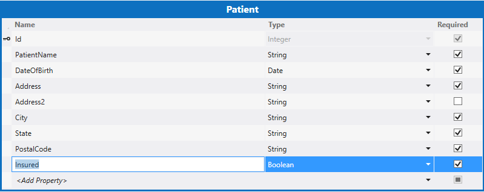
  

    
  
    
    

    
    Na próxima etapa, você vai definir uma relação entre o incidente e entidades de pacientes. Um incidente pode ter vários pacientes relacionados.
    
  

### Para definir uma relação


1. No **Solution Explorer**, abra o menu de atalho para o nó **Incidents.lsml** e escolha **Abrir**.
    
  
2. Na barra de ferramentas, escolha o botão de **relacionamento**.
    
    A caixa de diálogo **Adicionar novo relacionamento** é exibida.
    
  
3. Na caixa de diálogo **Adicionar novo relacionamento**, na coluna **para** a linha **nome**, escolha **pacientes**.
    
  
4. Na linha **multiplicidade**, na coluna **de** escolha **Zero ou um**.
    
  
5. Na coluna **a**, escolha **muitos** e escolha o botão **OK**.
    
    Figura 4 mostra o relacionamento.
    

   **Figura 4. Relação de incidentes e os pacientes**

  

     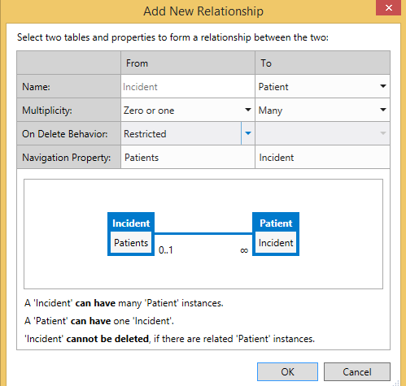
  

    Isso cria um zero ou um para muitos relação entre incidentes e os pacientes. Um registro de incidente não precisa ter um paciente, mas cada paciente deve ter um registro de incidentes relacionado.
    
    
  
    
    

    
    A próxima etapa, você adicionará telas para exibir, adicionar e editar registros de pacientes e incidente.
    
  

### Para adicionar telas


1. No **Solution Explorer**, abra o menu de atalho para o nó **Incidents.lsml** e escolha **Abrir**.
    
  
2. No designer de tela, na barra de ferramentas **perspectiva**, escolha a guia **Cliente HTML** e, em seguida, na barra de ferramentas, escolha o botão de **tela**.
    
    Abre a caixa de diálogo **Adicionar nova tela**.
    
  
3. Na caixa de diálogo **Adicionar nova tela**, na lista **Selecione um modelo de tela**, escolha **Definir comuns da tela**.
    
  
4. Na caixa de texto **Nome do conjunto de tela**, insira incidentes.
    
  
5. Na lista de **Dados da tela**, escolha **incidentes**.
    
  
6. Marque as caixas de seleção os **Detalhes de incidente** e o **Incidente pacientes** e escolha o botão **OK**.
    
    Figura 5 mostra a caixa de diálogo Adicionar nova tela.
    

   **Figura 5. Nova tela de caixa de diálogo Adicionar**

  

     
  

    Adicionar/editar, exibir detalhes e procurar telas são adicionadas ao projeto HTMLClient. A tela procurar é automaticamente definida como a tela inicial para o aplicativo e os comandos necessários para iniciar o modo de exibição e adicionar/editar telas são fornecidas automaticamente.
    
  
7. Na barra de menus, escolha **Depurar**, **Iniciar depuração** para executar o aplicativo. Se for exibida a caixa de diálogo **conectar ao SharePoint**, insira seu nome de usuário e senha.
    
  
8. Se solicitado, escolha o botão **De confiança**. O suplemento será aberto com uma tela em branco. Observe que o título de tela é **IncidentsSet**.
    
  
9. Escolha o botão **Adicionar**.
    
    Abre a caixa de diálogo de **incidentes**. Observe que, enquanto você pode inserir os dados de incidentes, não há nenhuma provisão para adicionar os pacientes. Você corrigirá que e outros problemas de design ao personalizar as telas.
    
    
  
    
    

    
    A próxima etapa, você personalizará tela procurar.
    
  
10. Feche a caixa de diálogo de **incidente** e feche a janela do navegador para retornar ao modo de design.
    
  

### Para personalizar a tela de procurar


1. Na tela **Solution Explorer**, abra o menu de atalho para o nó **BrowseIncidentsSet.lsml** e escolha **Abrir**.
    
  
2. Na janela **Propriedades**, escolha a propriedade de **Nome de exibição** e digiteincidentes.
    
  
3. No designer de tela, escolha o **linhas Layout | linhas** nó e expandir a lista de **Adicionar** e escolha **Endereço incidente**.
    
  
4. Escolha o nó de **Expedição de tempo** e, em seguida, na barra de ferramentas, escolha o botão **Excluir**.
    
    Figura 6 mostra o layout de tela terminar.
    

   **Figura 6. Procure o layout de tela**

  

     
  

    Em tempo de execução a tela exibirá um lado para cada incidente, e cada lado a lado exibirá o número de incidente, a data e o endereço.
    
    
  
    
    

    
    A próxima etapa, você personalizará tela Adicionar/Editar.
    
  

### Para personalizar a tela de adicionar/editar


1. Na tela **Solution Explorer**, abra o menu de atalho para o nó **AddEditIncidents.lsml** e escolha **Abrir**.
    
  
2. Escolher os nós do **Endereço de incidente**, **Nome do participante de relatórios** e **Relatórios de telefone** e arraste-os para o **linhas Layout | esquerda** seção, abaixo do nó de **Tipo de incidente**.
    
  
3. Escolha o nó de **Tempo de expedição** e na janela **Propriedades**, desmarque a caixa de seleção **Habilitado do selecionador de data**.
    
    A data não é necessária, desde que ela sempre será o mesmo que a data de incidentes.
    
  
4. No painel esquerdo do Editor de tela, escolha o link **Adicionar pacientes**, conforme mostrado na Figura 7.
    
   **Figura 7. Adicionar link de pacientes**

  

     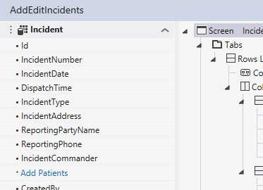
  

  

  
5. No painel esquerdo, selecione o nó de **pacientes** e arraste-o sob o nó **Comandante de incidentes** no painel central.
    
    Figura 8 mostra o layout de tela terminar.
    

   **Figura 8. O layout de tela de adicionar/editar**

  

     
  

    
  
    
    

    
    A próxima etapa, você criará uma tela para adicionar registros de pacientes.
    
  

### Para adicionar uma tela de pacientes


1. Na tela **Solution Explorer**, abra o menu de atalho para o nó **AddEditIncidents.lsml** e escolha **Abrir**.
    
  
2. No designer de tela, sob o Layout de linhas**| Detalhes (guia)** nó, abra o menu de atalho para o nó da **Barra de comandos** e escolha o **Botão Adicionar**.
    
  
3. Na caixa de diálogo **Adicionar botão**, expanda a lista **showTab** no grupo **pacientes** escolha **addAndEditNew** e escolha o botão **OK**.
    
    Abre a caixa de diálogo **Adicionar nova tela**.
    
  
4. Na caixa de diálogo **Adicionar nova tela**, aceite os valores padrão e escolha o botão **OK**.
    
    A tela de **AddEditPatient** abre no designer de tela.
    
  
5. Na janela Propriedades, escolha a propriedade de **Nome de exibição** e digiteAdicionar pacientes.
    
  
6. No designer de tela, escolha o nó de **incidente** e excluí-lo.
    
    O campo de **incidentes** não é necessária, já que o paciente já está associado um incidente.
    
    Figura 9 mostra o layout de tela terminar.
    

   **Figura 9. O layout de tela de adicionar/editar**

  

     
  

    
  
    
    

    
    Na próxima etapa, você executará o add-in e adicionar alguns dados.
    
  

### Para testar o suplemento


1. Na barra de menus, escolha **Depurar**, **Iniciar depuração**.
    
  
2. No execução suplemento, escolha o botão **Adicionar**.
    
    Abre o Popup **incidentes**, conforme mostrado na Figura 10.
    

   **Figura 10. Pop-up de incidentes**

  

     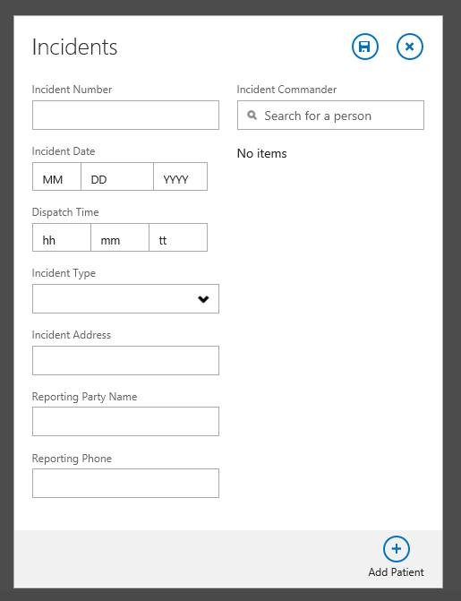
  

  

  
3. Na caixa de texto **Número de incidente**, insira 2014-1.
    
  
4. Nos campos **Data de incidente** e a **Hora de expedição**, use os controles de **Selecionador de data** e **Hora seletor** para selecionar uma data e hora.
    
  
5. Na lista **Tipo de incidente**, escolha **auxílio - suporte básico de vida**.
    
  
6. Na caixa de texto **Endereço de incidente**, insira um endereço em sua cidade.
    
    Não inclua a cidade, estado ou código postal. Presume-se que os bombeiros serve apenas uma cidade.
    
  
7. No controle do **Selecionador de pessoa** **Comandante de incidentes**, insira o nome de um usuário em seu site do SharePoint.
    
    Observe que você digitar uma lista de todos os nomes correspondentes é exibida.
    
  
8. Escolha o botão **Adicionar pacientes**.
    
    **Adicionar paciente** Popup é aberta, conforme mostrado na Figura 11.
    

   **Figura 11. A adicionar Popup paciente**

  

     
  

  

  
9. Insira as informações do paciente e escolha o botão **Salvar**.
    
    O nome do paciente que você adicionou é exibido no menu pop-up de **incidentes**. Se desejar, você pode adicionar mais pacientes.
    
  
10. No menu pop-up de **incidentes**, escolha o botão **Salvar**.
    
    Se estivesse seguindo as instruções, você verá uma mensagem de erro de validação. Campo **Telefone Reporting** é um campo obrigatório. Nuvem de negócios Add-ins ter validação interna para os campos necessários.
    
  
11. Insira um número de telefone e escolha o botão **Salvar** novamente.
    
    Um lado é exibido na tela inicial do **incidentes**, com o número de incidente, a data e o endereço.
    
  
12. Escolha da imagem para abrir a tela de exibição para o incidente.
    
    Observe que o campo **Telefone relatórios** é exibido como um hiperlink, fornecendo acesso direto ao seu aplicativo de telefone padrão.
    
  
13. Escolha o botão **Editar** para abrir a tela **AddEditIncidents** e escolha o botão **Descartar** para retornar à tela de **modo de exibição**.
    
  
14. Escolha a guia **pacientes** para exibir uma lista de pacientes e escolha dos pacientes lado a lado.
    
    Observe que ele não abre uma tela de modo de exibição para o paciente. Isso acontece porque você não tiver criado um.
    
  
15. Escolha o botão **Fechar** no seu navegador para retornar ao modo de design.
    
    
  
    
    

    
    A próxima etapa, você adicionará uma tela para exibir os pacientes.
    
  

### Para adicionar uma tela de modo de exibição


1. Na tela **Solution Explorer**, abra o menu de atalho para o nó **Patients.lsml** e escolha **Abrir**.
    
  
2. No designer de entidade, na barra de ferramentas **perspectiva**, escolha **HTMLClient** e, em seguida, na barra de ferramentas, escolha o botão de **tela**.
    
    Abre a caixa de diálogo **Adicionar nova tela**.
    
  
3. Na caixa de diálogo **Adicionar nova tela**, na lista **Selecione um modelo de tela**, escolha **Exibir detalhes da tela**.
    
  
4. Na caixa de texto **Nome de tela**, insira **ViewPatient**, escolha **paciente** na lista de **Dados da tela** e escolha o botão **OK**.
    
    A tela de **ViewPatient** abre no designer de tela.
    
  
5. No designer de tela, sob o Layout de linhas**| Detalhes (guia)** nó, abra o menu de atalho para o nó da **Barra de comandos** e escolha o **Botão Adicionar**.
    
  
6. Na caixa de diálogo **Adicionar botão**, expanda a lista **showTab** no grupo **paciente**, escolha **Editar** e escolha o botão **OK**.
    
  
7. Executar o aplicativo e verificar que agora você pode exibir e editar registros de pacientes.
    
    
  
    
    

    
    Agora, você criou um suplemento de gerenciamento de incidentes totalmente funcional, mas há que muito mais você pode fazer com suplementos de negócios de nuvem. Na próxima seção, você aprenderá como utilizem os recursos no site do SharePoint a partir do suplemento de gerenciamento de incidentes.
    
  

## Integre recursos do SharePoint
<a name="integrate"> </a>

Contoso bombeiros foi iniciada usando o suplemento do Gerenciador de incidente e como é normal em projetos de desenvolvimento de software que eles agora estão solicitando um novo recurso. Além de incidente e informações sobre os pacientes, eles também precisam gerenciar recursos como aparelhos de bombeiros e pessoal. Além disso, elas já têm listas de equipamentos e pessoal em seu site do SharePoint, portanto você utilizará essas listas como outra fonte de dados para o suplemento.
  
    
    
A primeira etapa é adicionar alguns modelos de lista pré-preenchida ao seu site do desenvolvedor.
  
    
    

### Para adicionar modelos de lista


1. Na barra de menus, escolha **Depurar**, **Iniciar depuração** para executar o suplemento.
    
  
2. No execução suplemento, na barra de ferramentas chrome, escolha o link de **volta para o site** para navegar até o seu site de desenvolvedor do SharePoint, conforme mostrado na Figura 12.
    
   **Figura 12. Voltar para o link de site**

  

     
  

  

  
3. Na página do **desenvolvedor**, escolha o link de **Conteúdo do Site**.
    
  
4. Na página **Conteúdo do Site**, escolha o link de **configurações**, conforme mostrado na Figura 13.
    
   **Figura 13. O link de configurações**

  

     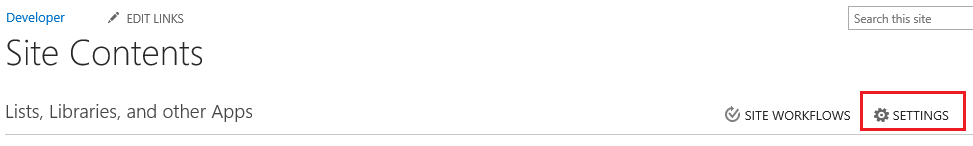
  

  

  
5. Na página **Configurações do Site**, na lista **Galerias de Web Designer**, escolha o link de **modelos de lista** conforme mostrado na Figura 14.
    
   **Figura 14. O link de modelos de lista**

  

     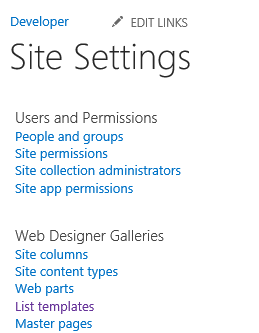
  

  

  
6. Na página **Galeria de modelos de lista**, escolha a guia **arquivos** e, em seguida, na faixa de opções, escolha o botão **Carregar documento**.
    
  
7. Na caixa de diálogo **Adicionar um modelo**, escolha o botão **Procurar** e navegue até a pasta de **recursos** para a amostra de gerenciamento de incidente baixada.
    
  
8. Escolha o arquivo **ContosoApparatus.stp**, escolha o botão **Abrir** e escolha o botão **OK**.
    
  
9. Na caixa de diálogo **Galeria de modelos de lista**, escolha o botão **Salvar**.
    
  
10. Repita o processo e carregar o arquivo **ContosoPersonnel.stp**.
    
   **Figura 15. Os arquivos carregados**

  

     
  

  

  
11. Escolha o link de **Conteúdo do Site** e na página **Conteúdo** do Site, escolha os blocos de **Adicionar um suplemento**.
    
  
12. Sobre o **conteúdos do Site > seus suplementos** página, escolha os blocos de **Aparelhos de Contoso**.
    
    > [!OBSERVAçãO]
      > Você pode precisar ir para a segunda página de suplementos para encontrar os blocos de **Aparelhos de Contoso**.
13. Na caixa de diálogo **Adicionar lista personalizada**, escolha a caixa de texto **nome** e digiteContoso aparelhose, em seguida, clique no botão **criar**.
    
  
14. Repita o processo e adicionar a lista **Pessoal de Contoso**, inserindo A equipe Contoso como o nome.
    
  
15. Na página **Conteúdo do Site**, verifique se as listas de **Aparelhos de Contoso** e a **Equipe da Contoso** agora aparecem.
    
    
  
    
    

    
    A próxima etapa, você adicionará o seu site do SharePoint como uma fonte de dados.
    
  

### Para adicionar uma fonte de dados do SharePoint


1. No **Solution Explorer**, abra o menu de atalho para o nó de **Fontes de dados** e escolha **Adicionar fonte de dados**.
    
    O **Assistente para anexar de fonte de dados** abre.
    
  
2. No **Assistente para anexar de fonte de dados**, escolha o ícone do **SharePoint**, conforme mostrado na Figura 16 e, em seguida, escolha o botão **Avançar**.
    
   **Figura 16. Fonte de dados do SharePoint**

  

     
  

  

  
3. Na página **Inserir informações da conexão**, verifique se a URL do site de desenvolvedor do SharePoint está correta e, em seguida, escolha o botão **Avançar**.
    
  
4. Na página **Escolher seus itens do SharePoint**, selecione as caixas de seleção das listas **ContosoApparatus** e **ContosoPersonnel**, conforme mostrado na Figura 17 e escolha o botão **Concluir**.
    
   **Figura 17. As listas selecionadas**

  

     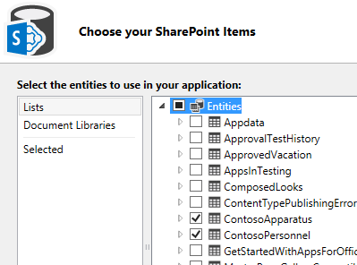
  

    As entidades são adicionadas para um novo nó de **Dados de desenvolvedor** sob o nó de **Fontes de dados** no **Solution Explorer**, e a entidade **ContosoApparatus** é aberto no designer de entidade.
    
    
    > [!OBSERVAçãO]
      > Você deve ter percebido que uma entidade **UserInformationLists** também foi adicionada. Esta lista é usada pelo SharePoint para gerenciar os campos de **Propriedades CreatedBy** e **ModifiedBy** para listas.
5. Na janela **Propriedades**, escolha a propriedade de **Nome de exibição** e alterá-la paraaparelhos.
    
    
  
    
    

    
    Na próxima etapa, você vai definir uma consulta para limitar os dados retornados da entidade **ApparatusSet**. Nesse caso, você só deseja ver aparelhos que estão no serviço.
    
  

### Para definir a consulta AvailableApparatus


1. No **Solution Explorer**, abra o menu de atalho para o nó **ApparatusSet.lsml** e escolha **Add Query**.
    
    O criador de consultas é aberta.
    
  
2. Na janela **Propriedades**, escolha a propriedade **Name** e digiteAvailableApparatus.
    
  
3. No designer de consulta, escolha o link **Adicionar filtro** e, na segunda lista suspensa, escolha **disponível**.
    
  
4. Na última caixa de texto, altere **False** para **True**.
    
    Figura 18 mostra a consulta.
    

   **Figura 18. A consulta AvailableApparatus**

  

     
  

    
  
    
    

    
    Na próxima etapa, você vai definir outra consulta para a entidade **ContosoPersonnel**. Nesse caso, você só deseja ver pessoal que está atribuídos do turno "A".
    
  

### Para definir a consulta AvailablePersonnel


1. No **Solution Explorer**, abra o menu de atalho para o nó **ContosoPersonnels.lsml** e escolha **Add Query**.
    
    O criador de consultas é aberta.
    
  
2. Na janela **Propriedades**, escolha a propriedade **Name** e digiteAvailablePersonnel.
    
  
3. No designer de consulta, escolha o link **Adicionar filtro** e, na segunda lista suspensa, escolha **Shift**.
    
  
4. Na última caixa de texto, insira **uma**.
    
    Figura 19 mostra a consulta.
    

   **Figura 19. A consulta AvailablePersonnel**

  

     
  

    
  
    
    

    
    A próxima etapa, você adicionará listas de aparelhos disponíveis e pessoal na tela **ViewIncidents**.
    
  

### Para adicionar consultas na tela


1. No **Solution Explorer**, abra o menu de atalho para o nó **ViewIncidents.lsml** e escolha **Abrir**.
    
  
2. No designer de tela, abra o menu de atalho para o nó de **guia** e escolha **Adicionar guia**.
    
  
3. Na janela **Propriedades**, altere a propriedade **Name** pararecursos.
    
  
4. No designer de tela, na barra de ferramentas, escolha **Adicionar Item de dados**.
    
    Abre a caixa de diálogo **Adicionar Item de dados**.
    
  
5. Na caixa de diálogo **Adicionar Item de dados**, escolha o botão de opção de **consulta**.
    
  
6. Na lista, escolha **DeveloperData.AvailableApparatus**, conforme mostrado na Figura 20 e escolha o botão **OK**.
    
   **Figura 20. A consulta AvailableApparatus**

  

     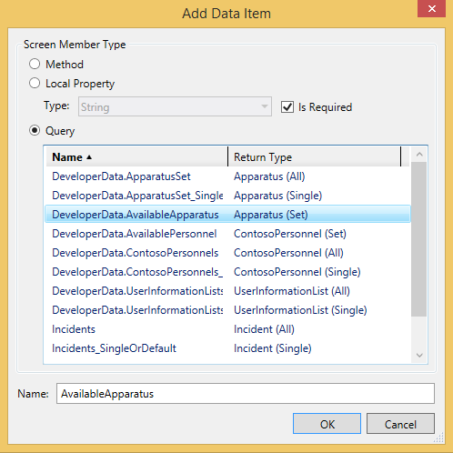
  

    A coleção **AvailableApparatus** é adicionada ao painel esquerdo do Editor de tela.
    
  
7. Repita o processo para adicionar a consulta **AvailablePersonnel** na tela.
    
  
8. Sob o Layout de linhas**| Recursos** nó, abra a lista de **Adicionar** e escolha **Aparelhos disponíveis**.
    
  
9. Escolha a lista de**| Aparelhos disponíveis** nó, abra a lista de **lista** e escolha a **Lista de blocos**.
    
  
10. Excluir todos os itens sob o Layout de linhas**| Aparelhos de Contoso** nó, com exceção do **Número de equipamentos** e o **Tipo de aparelhos**.
    
  
11. Sob o Layout de linhas**| Recursos** nó, abra a lista de **Adicionar** e escolha **Pessoal disponível**.
    
  
12. Escolha a lista de**| Pessoal disponível** nó, abra a lista de **lista** e escolha **tabela**.
    
  
13. Excluir todos os itens sob o **linha da tabela | A equipe Contoso** nó, exceto o **nome**, **classificação** e **atribuição**.
    
    Figura 21 mostra o layout da tela.
    

   **Figura 21. O layout de tela**

  

     
  

  

  
14. Execute o add-in e observe as alterações. Escolha um incidente e escolha a guia **recursos** para ver uma lista dos recursos disponíveis.
    
    
  
    
    

    
    As alterações agora estão concluídas. Na próxima seção, você aprenderá como adicionar e associar uma biblioteca de documentos do SharePoint com o suplemento.
    
  

## Associar uma biblioteca de documentos
<a name="associate"> </a>

Na cena de um incidente Commander o incidente foi documentar muitas coisas, alguns usando formulários existentes e alguns ad hoc. Os documentos criados em cena devem estar acessíveis posteriormente, e eles devem ser organizados por incidente para fácil recuperação. Para o suplemento do gerenciamento de incidentes, você pode utilizar o recurso de biblioteca de documento personalizadas no SharePoint para associar os documentos a cada incidente.
  
    
    

### Para adicionar uma biblioteca de documentos no site do SharePoint


1. Na barra de menus, escolha **Depurar**, **Iniciar depuração** para executar o suplemento.
    
  
2. No execução suplemento, na barra de ferramentas chrome, escolha link de **volta para o site**, conforme mostrado na Figura 22 para navegar até o seu site de desenvolvedor do SharePoint.
    
   **Figura 22. Voltar para o link de site**

  

     
  

  

  
3. Na página do **desenvolvedor**, escolha o link de **Conteúdo do Site**.
    
  
4. Na página **Conteúdo do Site**, escolha os blocos de **Adicionar um suplemento**.
    
  
5. Sobre o **conteúdos do Site > seus suplementos** página, escolha os blocos de **Biblioteca de documentos**.
    
  
6. Na caixa de diálogo **Adicionar biblioteca de documentos**, na caixa de texto **nome**, insira Os documentos de incidentee, em seguida, clique no botão **criar**.
    
  
7. Na página **Conteúdo do Site**, escolha a lado a lado para abrir a biblioteca **Documentos de incidente** e, em seguida, escolha a guia **biblioteca**.
    
  
8. Na **faixa de opções**, escolha o botão **Criar coluna**.
    
  
9. Na caixa de diálogo **Criar coluna**, na caixa de texto **nome da coluna**, insira IncidentNumbere escolha o botão **OK**.
    
    Figura 23 mostra a coluna recém-adicionado.
    

   **Figura 23. A biblioteca de documentos de documentos de incidente**

  

     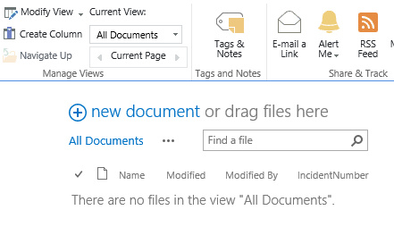
  

    Para associar a biblioteca de documentos com o add-in, a biblioteca de documentos deve conter uma coluna personalizada que mapeie para um campo exclusivo em sua entidade. Nesse caso, a coluna **IncidentNumber** mapeia ao campo **IncidentNumber** a entidade de **incidentes**.
    
    
  
    
    

    
    A próxima etapa, você adicionará a biblioteca de documentos para seu suplemento.
    
  

### Para adicionar uma biblioteca de documentos a um projeto


1. No **Solution Explorer**, abra o menu de atalho para o nó de **Dados do desenvolvedor** e escolha a **Fonte de dados de atualização**.
    
  
2. Na página **Escolher seus itens do SharePoint**, no painel esquerdo, escolha o item de lista de **Bibliotecas de documentos**, no painel direito, selecione a caixa de seleção **IncidentDocuments**, conforme mostrado na Figura 24 e escolha o botão **Concluir**.
    
   **Figura 24. A entidade IncidentDocuments**

  

     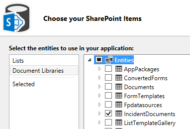
  

    Um nó de **IncidentDocuments.lsml** é adicionado ao Solution Explorer.
    
    
  
    
    

    
    Na próxima etapa, você vai criar um relacionamento entre a biblioteca de documentos e a entidade de incidentes..
    
  

### Para criar um relacionamento entre fontes de dados


1. No **Solution Explorer**, abra o menu de atalho para o nó **IncidentDocuments.lsml** e escolha **Abrir**.
    
  
2. No designer de entidade, na barra de ferramentas **perspectiva**, escolha o **servidor** e clique em **relação** na barra de ferramentas.
    
  
3. Na caixa de diálogo **Adicionar novo relacionamento**, na lista suspensa **para**, escolha **incidente**, conforme mostrado na Figura 25.
    
   **Figura 25. A caixa de diálogo Adicionar novo relacionamento**

  

     
  

  

  
4. Na lista suspensa chave **externo**, escolha o campo **IncidentNumber (String)** da entidade **IncidentDocuments**.
    
  
5. Na lista suspensa de chave **primária**, escolha o campo **IncidentNumber (String)** da entidade **incidentes** e escolha o botão **OK**.
    
    Figura 26 mostra as chaves primárias e externo.
    

   **Figura 26. Chaves externas e primárias**

  

     
  

    
  
    
    

    
    A próxima etapa, você adicionará a biblioteca de documentos na tela **ViewIncidents**.
    
  

### Para adicionar uma biblioteca de documentos a uma tela


1. No **Solution Explorer**, abra o menu de atalho para o nó **ViewIncidents.lsml** e escolha **Abrir**.
    
  
2. No designer de tela, abra o menu de atalho para o nó de **guia** e escolha **Adicionar guia**.
    
  
3. Na janela **Propriedades**, altere a propriedade **Name** paradocumentos.
    
  
4. No designer de tela, no painel esquerdo, escolha o link **Adicionar IncidentDocuments**.
    
  
5. No painel central, sob o Layout de linhas**| Documentos** nó, abra a lista de **Adicionar** e escolha **Documentos incidente**.
    
  
6. Sob o Layout de linhas**| Documentos** nó, abra o menu de atalho para o nó da **Barra de comandos** e escolha o **Botão Adicionar**.
    
  
7. Na caixa de diálogo **Adicionar botão**, expanda a lista **showTab** no grupo **IncidentDocuments** escolha **createOrUploadDocument**, conforme mostrado na Figura 27 e escolha o botão **OK**.
    
   **Figura 27. A caixa de diálogo Adicionar botão**

  

     
  

  

  
8. Na janela **Propriedades**, escolha a propriedade de **Nome de exibição** e insira aAdicionar documentos.
    
  
9. Expanda a lista de propriedades de **ícone** e escolha o **anexo**.
    
  
10. Na barra de menus, escolha **Depurar**, **Iniciar depuração** para executar o suplemento.
    
  
11. Escolha um incidente, escolha a guia de **documentos** e escolha o botão **Adicionar documentos**.
    
    Abre a caixa de diálogo **criar um novo arquivo** do SharePoint, conforme mostrado na Figura 28.
    

   **Figura 28. Criar uma nova caixa de diálogo de arquivo**

  

     
  

  

  
12. Escolha o link de **Carregar arquivo existente** e escolha qualquer arquivo para carregar e, em seguida, escolha o botão **Abrir**.
    
    O arquivo é adicionado à guia **documentos**.
    
    > [!DICA]
      > Se você escolher um documento do Office, você poderá exibi-la do add-in.
13. Escolha o botão Adicionar documento e na caixa de diálogo **criar um novo arquivo**, escolha o **documento do Word**.
    
    Um novo documento do Word é aberto no **Word Online**.
    
  
14. Na barra de título, escolha o campo de nome do **documento**, conforme mostrado na Figura 29 e insira o Relatório de incidente.
    
   **Figura 29. O campo de nome de documento**

  

     
  

    Isso será usado como o nome de arquivo para o documento.
    
    
    > [!OBSERVAçãO]
      > Se você não inserir um nome de arquivo, ele será salvo com o nome padrão **Document.docx**. Depois de salvo, o nome de arquivo só pode ser alterado por acessá-lo na biblioteca de documentos no SharePoint.
15. Escolha o botão Voltar no seu navegador para retornar para o suplemento. O documento de **Relatório de incidente** deve aparecer na guia **documentos**.
    
  
16. Escolha o botão **Fechar** no seu navegador para retornar ao modo de design.
    
    
  
    
    

    
    Na próxima seção, você vai personalizar o suplemento e adicionar um código JavaScript.
    
  

## Personalizar o suplemento
<a name="custom"> </a>

Contoso bombeiros está satisfeita com as adições para o suplemento de gerenciamento de incidentes, mas há alguns itens mais "ajustar e término" em suas listas. Eles desejam exibir sua logotipo nas telas, em vez de ícone padrão. Eles não gostar **FlipSwitch** controle de campo **segurados** na tela **AddEditPatient** e que sejam substituídos por uma caixa de seleção. Finalmente, uma vez que nem todos os incidentes têm os pacientes, eles não querem a guia de **pacientes** na tela **ViewIncidents** em aparecer se não há nenhum pacientes.
  
    
    

### Para exibir um logotipo personalizado


1. No **Solution Explorer**, no projeto **IncidentManager.HtmlClient**, expanda os nós de **conteúdo** e **imagens**.
    
  
2. Escolha os arquivos **logo.png de usuário** e de **usuário-splash-screen.png**, conforme mostrado na Figura 30 e excluí-los.
    
   **Figura 30. Os arquivos a serem excluídos**

  

     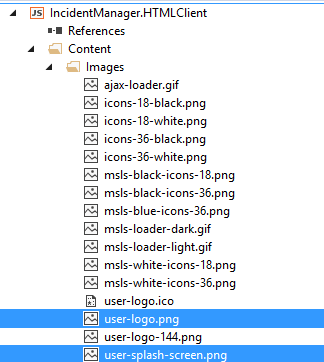
  

  

  
3. Abra o menu de atalho para o nó de **imagens**, escolha **Adicionar**, **Item existente**.
    
  
4. Na caixa de diálogo **Adicionar Item existente**, escolha o botão **Procurar** e navegue até a pasta de **recursos** para a amostra de gerenciamento de incidente baixada.
    
  
5. Escolha os arquivos **logo.png de usuário** e de **usuário-splash-screen.png** e escolha o botão **Adicionar**.
    
    Novas imagens serão exibidas na barra de título do add-in e, na tela inicial exibido quando o add-in está sendo carregado.
    
    
  
    
    

    
    Na próxima etapa, você vai substituir o controle de **FlipSwitch** com uma caixa de seleção.
    
  

### Para substituir o controle FlipSwitch


1. No **Solution Explorer**, abra o menu de atalho para o nó de tela **AddEditPatient.lsml** e escolha **Abrir**.
    
  
2. No designer de tela, expanda a lista para o nó **segurados** e escolha o **Controle personalizado**.
    
  
3. Na janela **Propriedades**, escolha o link **Editar o código de renderização**.
    
  
4. No Editor de código, adicione o código a seguir para o método **Insured_render**:
    
  ```
  
// Create the checkbox and add it to the DOM.
    var checkbox = $("<input type='checkbox'/>")
            .css({
                height: 20,
                width: 20,
                margin: "10px"
            })
            .appendTo($(element));

    // Determine if the change was initiated by the user.
    var changingValue = false;

    checkbox.change(function () {
        changingValue = true;
        contentItem.value = checkbox[0].checked;
        changingValue = false;
    });
    contentItem.dataBind("value", function (newValue) {
        if (!changingValue) {
            checkbox[0].checked = newValue;
        }
    });
  ```


    Este código cria um controle de **caixa de seleção** quando a tela é processada. Você também precisará adicionar código para definir o valor inicial.
    
  
5. No **Solution Explorer**, abra o menu de atalho para o nó de entidade **Patients.lsml** e escolha **Abrir**.
    
  
6. No designer de entidade, na barra de ferramentas **perspectiva**, escolha a guia **HTMLClient**.
    
  
7. Na barra de ferramentas, expanda a lista de **Escrever código** e escolha **criado**.
    
  
8. No Editor de código, adicione o código a seguir para o método **created**:
    
  ```
  
entity.Insured = new Boolean();
    entity.Insured = 'true';
  ```


    Este código define o valor inicial do controle como checked (true), quando a tela é criada.
    
    
  
    
    

    
    A próxima etapa, você adicionará código para ocultar a guia de **pacientes** não se existirem nenhum pacientes.
    
  

### Para ocultar condicionalmente uma guia


1. No **Solution Explorer**, abra o menu de atalho para o nó de tela **ViewIncidents.lsml** e escolha **Abrir**.
    
  
2. Na barra de ferramentas, abra a lista de **Escrever código** e escolha **criado**.
    
  
3. No Editor de código, adicione o código a seguir para o método **ViewIncidents_created**:
    
  ```
  
screen.getPatients().then(function (results) {
        var queryCount = results.count;
        if (queryCount == 0 ) {
            screen.findContentItem("Patients").isVisible = false;
        }
    });
  ```


    Este código executa a consulta **GetPatients** para obter uma contagem de **Patients**. Se o resultado for zero, o método **findContentItem** define a propriedade **isVisible** da guia **pacientes** como false, ocultá-lo.
    
  
4. Na barra de menus, escolha **Depurar**, **Iniciar depuração** para executar o aviso de suplemento que o novo logotipo aparece nas telas. Abra o primeiro incidente que você criou anteriormente e edite um paciente. Verifique se o campo segurado agora é uma caixa de seleção. Adicione um novo incidente sem qualquer pacientes e verificar que a guia **pacientes** está oculto na tela do modo de exibição.
    
    
  
    
    

    
    Na seção final, você vai publique o suplemento terminar no SharePoint.
    
  

## Publique no SharePoint
<a name="pub"> </a>

Até o momento você tiver apenas execute o add-in no modo de depuração, que usa o SharePoint para fornecer autenticação e redireciona para a instância do computador local do IIS Express. Em seguida, você vai publicar o suplemento como um hospedados automaticamente SharePoint add-in, que automaticamente provisionará espaço no Office 365 para o suplemento e um banco de dados intrínseco. Especificamente, o suplemento será hospedado no Microsoft Azure e o banco de dados no SQL Azure. Depois de publicar o add-in, outras pessoas poderá iniciá-lo do SharePoint em seus computadores e dispositivos móveis.
  
    
    

### Para publicar o suplemento


1. Na barra de ferramentas do Visual Studio, abra a lista de **depuração** e escolher uma **versão**.
    
  
2. No **Solution Explorer**, abra o menu de atalho para o nó **IncidentManager**, conforme mostrado na Figura 31 e escolha **Publicar**.
    
   **A Figura 31. O nó IncidentManager**

  

     
  

    O **Assistente de aplicativo do LightSwitch publicar** aparece.
    
  
3. Na página de opções do **SharePoint**, escolha o botão de opção **auto-hospedados**, conforme mostrado na Figura 32 e escolha o botão **Publicar**.
    
   **A Figura 32. A opção auto-hospedado**

  

     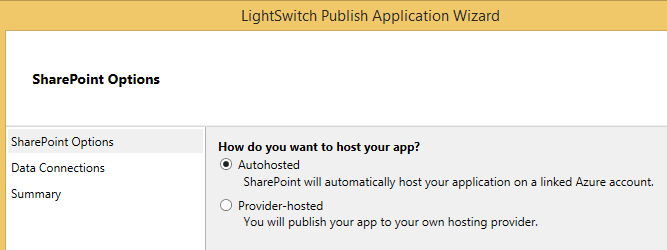
  

    Quando seu suplemento é publicado, o **Gerenciador de arquivos** aparece e exibe na pasta de **publicação** para o seu projeto.
    
  
4. No navegador, navegue até o site do desenvolvedor do SharePoint
    
  
5. Na lista de **suplementos no teste**, escolha o link de reticências (...) ao lado de **IncidentManager** e escolha o link **Remover**, conforme mostrado na Figura 33.
    
   **Figura 33. O link Remover**

  

     
  

  

  
6. Escolha o link do **novo suplemento para implantar**.
    
  
7. Na caixa de diálogo **Deploy Add-in**, escolha o link **carregar**, conforme mostrado na Figura 34.
    
   **Figura 34. O link de carregamento**

  

     
  

    Abre a caixa de diálogo **carregar o suplemento**.
    
  
8. Na caixa de diálogo **carregar o suplemento**, escolha o botão **Procurar** e navegue até a pasta de **Publicar** para seu suplemento e escolha o arquivo **IncidentManager.SharePoint.app**, escolha o botão **Abrir** e escolha o botão **OK**.
    
    Depois que o arquivo foi carregado, abre a caixa de diálogo **implantar**.
    
  
9. Na caixa de diálogo **Deploy Add-in**, escolha o botão de **implantação**.
    
  
10. Na caixa de diálogo **carregar o suplemento**, escolha o botão **Trust It**.
    
    O suplemento será instalado no seu site do SharePoint. O processo pode levar alguns minutos.
    
    Figura 35 mostra os suplementos na lista de teste, conforme está instalando o suplemento.
    

   **Figura 35. Os suplementos na lista de teste**

  

     
  

  

  
11. Escolha o link de **Conteúdo do Site**.
    
    A Figura 37 mostrará a lista de conteúdos do Site conforme está instalando o suplemento.
    

   **A Figura 37. O suplemento está instalando**

  

     
  

  

  
12. Depois que o suplemento concluir a instalação, escolha os blocos de **Gerenciador de incidente** para executar o suplemento.
    
    A Figura 38 mostrará a lista de conteúdos do Site após o add-in estiver instalado.
    

   **A Figura 38. O suplemento está instalado**

  

     
  

    O suplemento abre no navegador e exatamente tem a mesma aparência quando executou o add-in no modo de depuração. Observe que os dados inseridos durante o desenvolvimento desapareceu. Ao implantar o suplemento, o banco de dados é implantado, mas não os dados.
    
  
13. Inserir alguns dados e verificar se tudo funciona como esperado.
    
    Figura 39 mostra o suplemento, conforme exibido em um navegador de área de trabalho.
    

   **Figura 39. Exibição lado a lado**

  

     
  

    Você também pode verificar o add-in em um dispositivo móvel. Entrar no seu site do SharePoint do navegador da web no seu dispositivo e, em seguida, inicie o add-in.
    
    A figura 40 mostra o suplemento, conforme exibido em um navegador móvel.
    

   **A figura 40. Modo de exibição de lista**

  

     
  

  

  
Parabéns! Você concluiu agora o tutorial, e você sabe as Noções básicas de um criando um suplemento de negócios de nuvem. Agora vá e crie um suplemento de sua preferência - o recurso adicional abaixo deve ajudá-lo a desce.
## Recursos adicionais
<a name="bk_addresources"> </a>


-  [Introdução ao desenvolvimento de suplementos de negócios de nuvem](get-started-developing-cloud-business-add-ins.md)
    
  
-  [Desenvolver suplementos de negócios de nuvem](develop-cloud-business-add-ins.md)
    
  
-  [Publicar os suplementos de negócios de nuvem](publish-cloud-business-add-ins.md)
    
  

