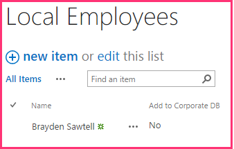

# Incluir um botão personalizado do add-in
Saiba como incluir um botão da faixa de opções personalizada em um provedor hospedado Suplemento do SharePoint.
Esta é a terceira em uma série de artigos sobre noções básicas do desenvolvimento hospedado em provedor Suplementos do SharePoint. Você primeiro deve estar familiarizado com  [Suplementos do SharePoint](sharepoint-add-ins.md) e os artigos anteriores desta série:
  
    
    


-  [Introdução à criação de suplementos do SharePoint hospedados pelo provedor](get-started-creating-provider-hosted-sharepoint-add-ins.md)
    
  
-  [Dar seu suplemento a aparência do SharePoint](give-your-provider-hosted-add-in-the-sharepoint-look-and-feel.md)
    
  

> **OBSERVAçãO**
> Se você tiver trabalhado através desta série sobre hospedado em provedor suplementos, então você possui uma solução de Visual Studio que você pode usar para continuar com este tópico. Você também pode baixar o repositório em  [SharePoint_Provider-hosted_Add-Ins_Tutorials](https://github.com/OfficeDev/SharePoint_Provider-hosted_Add-ins_Tutorials) e abra o arquivo BeforeRibbonButton.sln.
  
    
    

Um Suplemento do SharePoint pode incluir ações personalizadas, que é o termo do SharePoint para um itens de menu personalizado ou botões da faixa de opções. Neste artigo, você aprenderá como criar um botão personalizado que sincroniza uma lista do SharePoint com um banco de dados remoto.
## Criar uma lista personalizada no site do host

O botão personalizado vai estar na faixa de opções de uma lista específica que registra os funcionários do repositório local. Em um artigo posterior nesta série, você aprenderá como adicionar de maneira programática uma lista personalizada para um site de host, mas agora, você adicionará um manualmente.
  
    
    

1. Na home page do repositório Fabrikam Hong Kong, navegue até **conteúdos do Site | adicionar um suplemento | Lista personalizada**.
    
  
2. Na caixa de diálogo **Adicionar lista personalizada**, especifique o Local de funcionários como o nome e pressione **criar**.
    
  
3. Na página **Conteúdo do Site**, abra a lista de **Locais de funcionários**.
    
  
4. Abra a guia **lista** na faixa de opções e, em seguida, clique no botão **Configurações de lista**.
    
  
5. Na seção **colunas** da página **Configurações de lista**, clique na coluna de **título**.
    
  
6. No formulário **Editar coluna**, altere o **nome da coluna** de título para onome; e, em seguida, clique em **OK**.
    
  
7. Na página **configurações**, clique em **criar coluna**.
    
  
8. No formulário **Criar coluna**, faça o seguinte:
    
1. Digite foram adicionados ao banco de dados corporativos como o **nome da coluna**.
    
  
2. Defina o tipo como **Sim/não (caixa de seleção)**.
    
  
3. Defina o **valor padrão** como **não**.
    
  
4. Clique em **OK**. É exibida novamente na página **configurações**.
    
  
9. Clique em **Conteúdo do Site** para abrir a página de **Conteúdo do Site**. A lado a lado para a nova lista existe. Abri-lo.
    
  
10. Clique em **novo item** e no formulário Criar item, insira um nome, mas que fazem *check **foram adicionados ao banco de dados corporativos*** . Em seguida, clique em **Salvar**. A lista deve ser semelhante ao seguinte:
    
     
  

  

  

## Adicionar botão personalizado

Nesta seção, você deve incluir a marcação do add-in que irá implantar um botão da faixa de opções da lista. Quando um usuário destaca um funcionário na lista e clica no botão, o nome do funcionário será adicionado ao banco de dados corporativo e o campo **adicionado ao banco de dados corporativos** do funcionário será transferido de não para Sim.
  
    
    

1.  *Se Visual Studio é aberto, você precisa para fechá-lo*  e reabra a solução de repositório de cadeia de modo que Visual Studio possam descobrir sua nova lista. (Executar Visual Studio como um administrador).
    
    > **OBSERVAçãO**
      > As configurações para projetos de inicialização no Visual Studio tendem a reverter para a configuração padrão sempre que a solução for reaberta. Sempre, siga estas etapas imediatamente após reabri-lo a solução de exemplo nesta série de artigos:> Com o botão direito no nó da solução na parte superior do **Gerenciador de soluções** e selecione **definir projetos de inicialização**.> Verifique se que todos os três projetos estão definidos para **Iniciar** na coluna **ação**.
2. Com o botão direito do projeto **ChainStore** no **Solution Explorer** e escolha **Adicionar | Novo Item**.
    
  
3. Na caixa de diálogo **Adicionar Novo Item**, selecione ** A ação personalizada da faixa de opções**, dê a ela o nome AddEmployeeToCorpDBe, em seguida, clique em **Adicionar**.
    
  
4. Abre a caixa de diálogo solicitando três perguntas. Dar as respostas a seguintes:
    

|**Pergunta**|**Fornecer essa resposta:**|
|:-----|:-----|
|**Onde você deseja expor a ação personalizada?** <br/> |webhost <br/> |
|**Onde a ação personalizada destinada a?** <br/> |Instância de lista <br/> |
|**Qual item específico destinada a ação personalizada?** <br/> |Funcionários de locais <br/> |
   
5. Clique em **Avançar** e obtenha os três perguntas mais:
    

|**Pergunta**|**Fornecer essa resposta:**|
|:-----|:-----|
|**Onde o controle está localizado?** <br/> |Ribbon.ListItem.Actions <br/> |
|**O que é o texto do rótulo para o controle de botão?** <br/> |Adicionar ao banco de dados corporativo <br/> |
|**Onde o controle de botão navegue até?** <br/> |ChainStoreWeb\\Pages\\EmployeeAdder.aspx (Isso é uma página cujo code-behind irá adicionar o funcionário no banco de dados). <br/> |
   
6. Clique em **Concluir**.
    
    Um arquivo Elements XML que define a ação personalizada é adicionada ao projeto e aberta. Na maioria das vezes, você pode tratar esse arquivo como uma caixa preta, e você não precisará fazer alterações nele até que um artigo posterior nesta série. No momento, observe o seguinte:
    
  - O atributo **Location** do elemento **CommandUIDefinition** tem o valor `Ribbon.ListItem.Actions.Controls_children`. A segunda parte disso,  `ListItem`, identifica a guia na faixa de opções onde será colocado o botão (mas que não pode ser o nome de exibição exato da guia) e a terceira parte,  `Actions`, é o nome da seção da faixa de opções onde será colocado o botão.
    
  
  - O atributo **CommandAction** do elemento **CommandUIHandler** começa com o espaço reservado `~remoteAppUrl`. Isso será substituído com a URL do aplicativo web remoto quando o botão é implantado.
    
  
  - Alguns parâmetros de consulta foram adicionados ao valor **CommandAction** com valores de espaço reservado em chaves "{}". Esses espaços reservados são resolvidos em tempo de execução. Observe que uma delas é a ID do item da lista selecionada pelo usuário antes que ela pressiona um botão personalizado na faixa de opções.
    
  
7. No projeto **ChainStoreWeb**, abra o arquivo de **Pages/EmployeeAdder.aspx**. Observe que ele não tem nenhuma interface do usuário. O suplemento vai usar esta página como um tipo de serviço da web. Isso é possível porque a classe de **System.Web.UI.Page** do ASP.NET implementa **System.Web.IHttpHandler** e o evento ** Page_Load** é executado automaticamente quando a página é solicitada.
    
  
8. Abra o arquivo code-behind **Pages/EmployeeAdder.aspx.cs**. O método que adiciona o funcionário no banco de dados remoto,  `AddLocalEmployeeToCorpDB`, já está presente. Ele usa o objeto **SharePointContext** para obter a URL da web host, o que o suplemento usa como discriminador seu locatário. Portanto, a primeira coisa que o método **Page_Load** precisa fazer é inicializar este objeto. O objeto é criado e armazenado em cache da sessão quando iniciar página do suplemento for carregada, caso adicionar o código a seguir para o método **Page_Load**. (O objeto **SharePointContext** é definido no arquivo SharePointContext.cs que o Office Developer Tools for Visual Studio gerar quando a solução de suplemento é criada).
    
  ```cs
  
spContext = Session["SPContext"] as SharePointContext;
  ```

9. O método  `AddLocalEmployeeToCorpDB` leva o nome do funcionário como um parâmetro, para adicionar a seguinte linha para o método **Page_Load**. Você criará o método `GetLocalEmployeeName` em uma etapa posterior.
    
  ```cs
  // Read from SharePoint
string employeeName = GetLocalEmployeeName();
  ```

10. Abaixo dessa linha, adicione a chamada para o método  `AddLocalEmployeeToCorpDB` .
    
  ```cs
  
// Write to remote database
AddLocalEmployeeToCorpDB(employeeName);
  ```

11. Adicione uma instrução de **using** arquivo para o namespace `Microsoft.SharePoint.Client`. (O Office Developer Tools for Visual Studio incluído o assembly Microsoft.SharePoint.Client no projeto **ChainStoreWeb** quando ela foi criada.)
    
  
12. Agora, adicione o seguinte método à classe  `EmployeeAdder` . O modelo de objeto do SharePoint .NET do cliente (CSOM) é documentado em detalhes em outros lugares no MSDN e sugerimos explore-lo quando terminar com esta série de artigos. Para este artigo, observe que a classe **ListItem** representa um item em uma lista do SharePoint e que o valor de um campo no item pode ser referenciado com a sintaxe "indexador". Além disso, observe que o código se refere ao campo como "Title", mesmo que você alterou o nome do campo para "Nome". Isso acontece porque campos sempre são conhecidos no código pelo seu nome *interno*  , não seu nome para exibição. O nome interno de um campo é definido quando o campo é criado e nunca pode alterar. Concluir a `TODO1` em uma etapa posterior.
    
  ```cs
  
private string GetLocalEmployeeName()
{
    ListItem localEmployee;

    // TODO1: Initialize the localEmployee object by getting  
    // the item from SharePoint.
 
    return localEmployee["Title"].ToString();
}
  ```

13. Nosso código terá a ID do item de lista antes que ele possa recuperar do SharePoint. Adicione a seguinte declaração à classe  `EmployeeAdder` logo abaixo da declaração para o objeto `spContext` .
    
  ```cs
  
private int listItemID;
  ```

14. Agora, adicione o seguinte método à classe  `EmployeeAdder` para obter o ID do item de lista do parâmetro de consulta.
    
  ```cs
  private int GetListItemIDFromQueryParameter()
{
    int result;
    Int32.TryParse(Request.QueryString["SPListItemId"], out result);
    return result;
}
  ```

15. Para inicializar a variável  `listItemID` , adicione a seguinte linha para o método **Page_Load** logo abaixo da linha que inicializa a variável `spContext` .
    
  ```cs
  
listItemID = GetListItemIDFromQueryParameter();
  ```

16. O  `GetLocalEmployeeName`, substitua o  `TODO1` pelo código a seguir. Por enquanto, trate apenas este código como uma caixa preta enquanto estamos enfocam obtendo o trabalho de botão personalizado. Podemos saberá mais sobre este código no próximo artigo desta série, que é tudo sobre o modelo de objeto do cliente do SharePoint.
    
  ```cs
  using (var clientContext = spContext.CreateUserClientContextForSPHost())
{
    List localEmployeesList = clientContext.Web.Lists.GetByTitle("Local Employees");
    localEmployee = localEmployeesList.GetItemById(listItemID);
    clientContext.Load(localEmployee);
    clientContext.ExecuteQuery();
}

  ```


    O método inteiro agora deve se parecer com o seguinte.
    


  ```cs
  
private string GetLocalEmployeeName()
{
    ListItem localEmployee;

    using (var clientContext = spContext.CreateUserClientContextForSPHost())
    {
        List localEmployeesList = clientContext.Web.Lists.GetByTitle("Local Employees");
        selectedLocalEmployee = localEmployeesList.GetItemById(listItemID);
        clientContext.Load(selectedLocalEmployee);
        clientContext.ExecuteQuery();
    }
    return localEmployee["Title"].ToString();
}
  ```

17. A página EmployeeAdder na verdade não deve renderizar, portanto, adicione o seguinte como a última linha no método **Page_Load**. Isso redirecionará o navegador voltar para a página de modo de exibição de lista para a lista de **Locais de funcionários**.
    
  ```cs
  
// Go back to the Local Employees page
Response.Redirect(spContext.SPHostUrl.ToString() + "Lists/LocalEmployees/AllItems.aspx", true);

  ```


    O método todo **Page_Load** agora deve se parecer com o seguinte.
    


  ```cs
  
protected void Page_Load(object sender, EventArgs e)
{
    spContext = Session["SPContext"] as SharePointContext;
    listItemID = GetListItemIDFromQueryParameter();

    // Read from SharePoint
    string employeeName = GetLocalEmployeeName();

    // Write to remote database
    AddLocalEmployeeToCorpDB(employeeName);

    // Go back to the preceding page
    Response.Redirect(spContext.SPHostUrl.ToString() + "Lists/LocalEmployees/AllItems.aspx", true);
}
  ```


## Solicitação de permissão para ler o host lista web

Como vimos, SharePoint solicita que você conceda as permissões de suplemento na Web host quando ele é instalado. Você tiver sido novamente instalando o suplemento sempre que você pressionar F5. Até o momento, o add-in é necessário apenas a permissões mínimas, mas o método  `GetLocalEmployeeName` requer permissão para ler as listas do site host. O suplemento usa seu manifesto suplemento para informar ao SharePoint quais permissões necessárias. Siga estas etapas.
  
    
    

1. No **Solution Explorer**, abra o arquivo de AppManifest.xml no projeto **ChainStore**. (O arquivo é chamado AppManifest porque suplementos usada para ser chamado "apps"). O manifesto designer abre.
    
  
2. Abra a guia **permissões** e clique na célula vazia na coluna **escopo**; e, em seguida, seleciona **lista** na lista para baixo.
    
  
3. No campo de **permissão**, selecione **leitura** a projetada para baixo.
    
  
4. Deixe o campo de **Propriedades** vazio e salve o arquivo. A guia **permissão** deve ser semelhante ao seguinte:
    
     
  

  

  

## Execute o add-in e testar o botão


  
    
    

1. Use a tecla F5 para implantar e executar seu suplemento Visual Studio hospeda o aplicativo da web remoto no IIS Express e hospeda o banco de dados SQL em um SQL Express. Ele também faz uma instalação temporária do add-in no seu site do SharePoint de teste e executa imediatamente o add-in. Você será solicitado para conceder permissões para o suplemento antes que ela seja iniciar página é aberta. Neste momento o prompt tem uma lista suspensa onde você selecione a lista que o aplicativo precisa ler como visto na seguinte imagem.
    
     
  

  

  
2. Escolha o **Local de funcionários** da lista e clique em **confiar nele**.
    
  
3. Quando a página de início do add-in for aberta, clique em **volta para o Site** no controle de cromo na parte superior.
    
  
4. Na página inicial do site navegue para **conteúdos do Site | Funcionários locais**. Abre a página de modo de exibição de lista.
    
  
5. Adicione alguns funcionários à lista.  *Não marque a caixa de seleção **foram adicionados ao banco de dados corporativo**.* 
    
  
6. Na faixa de opções, abra a guia de **itens**. Na seção **ações** da guia, é o botão personalizado **Adicionar ao banco de dados corporativos**.
    
  
7. Selecione um item na lista. A página e a faixa de opções devem ser semelhantes ao seguinte:
    
     
  

  

  
8. Pressione o botão **Adicionar para o banco de dados corporativos**.  * **Um item deve ser selecionado primeiro!*** 
    
  
9. A página parecerá recarregar porque o método **Page_Load** da página EmployeeAdder os redirecionamentos de volta para ela.
    
  
10. Use o botão Voltar do navegador duas vezes para voltar à página de início do suplemento.
    
  
11. Clique em **Mostrar Employees** e a lista de funcionários será preenchida com o funcionário que você adicionou. Ele deve ser semelhante ao seguinte:
    
     
  

  

  
12. Para encerrar a sessão de depuração, feche a janela do navegador ou interrompa a depuração no Visual Studio. Sempre que você pressiona F5, o Visual Studio retira a versão anterior do suplemento e instala a última mais recente.
    
  
13. Você vai trabalhar com esse suplemento e com a solução do Visual Studio em outros artigos. Além disso, é uma prática recomendada retirar o suplemento uma última vez, quando deixar de trabalhar com ele por algum tempo. Clique com botão direito do mouse no projeto no **Gerenciador de Soluções** e escolha **Retirar**.
    
  

## 
<a name="Nextsteps"> </a>

No próximo artigo, veremos uma breve quebra da codificação para uma visão geral do modelo de objeto do cliente do SharePoint:  [Obtenha uma visão geral do modelo de objeto do SharePoint](get-a-quick-overview-of-the-sharepoint-object-model.md).
  
    
    

