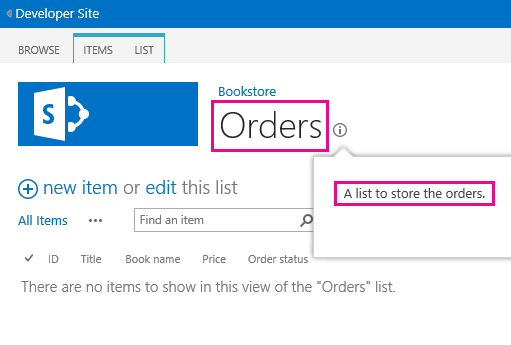
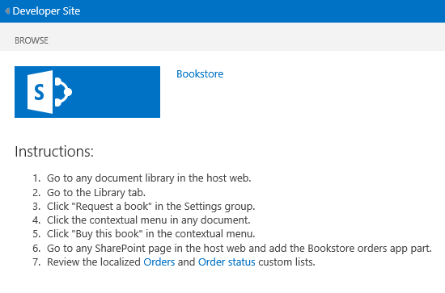

# Localizar os suplementos do SharePoint
Localiza um Suplemento do SharePoint usando arquivos de recursos, arquivos de recursos JavaScript e outras técnicas.
> **OBSERVAçãO**
> Este tópico pressupõe que você esteja familiarizado com a criação básica de Suplementos do SharePoint; e com recursos de SharePoint, a distinção entre suplemento webs e webs de host,  [que tipo de componentes do SharePoint pode estar em um suplemento](host-webs-add-in-webs-and-sharepoint-components-in-sharepoint-2013.md#TypesOfSPComponentsInApps)e os conceitos básicos de localização com arquivos. resx.
  
    
    


## Prepare-se localizar um Add-in do SharePoint
<a name="Prerequisites"> </a>

Antes de começar, identifique o seguinte:
  
    
    

- As localidades que seu suplemento precisa suportar. SharePoint Online e SharePoint no local com pacotes de idiomas instalado permitem que os usuários criem sites em um idioma específico e a cultura. Decida quais sites localizado será usando seus clientes e determinar quais desses você deseja suportar com uma versão traduzida do componentes do suplemento.
    
  
- Os componentes necessários para localizar no seu suplemento.
    
  
Além disso, você deve estar ciente dos seguintes procedimentos:
  
    
    

- Os procedimentos neste artigo consideram que você está usando a versão mais recente do [Office Developer Tools para Visual Studio 2013](http://aka.ms/OfficeDevToolsForVS2013)ou  [Office Developer Tools para Visual Studio de 2015](http://aka.ms/OfficeDevToolsForVS2015).
    
    > **OBSERVAçãO**
      > Se seu site do SharePoint de teste é um local no farm do SharePoint, em vez de um Microsoft SharePoint Online Site do desenvolvedor, você pode precisar instalar os pacotes de idiomas para os idiomas nos quais você esteja traduzindo sua Suplemento do SharePoint. Para obter mais informações, consulte  [instalar ou desinstalar pacotes de idiomas para o SharePoint 2013](http://technet.microsoft.com/en-us/library/cc262108%28v=office.15%29.aspx) e [pacotes de idiomas no SharePoint Server 2013](http://technet.microsoft.com/en-us/library/ff463597%28v=office.15%29.aspx)e os links para download no último.
- As capturas de tela e os exemplos de código neste artigo refletem a amostra  [SharePoint-adicionar-em-localização](https://github.com/OfficeDev/SharePoint-Add-in-Localization). Você pode baixar o exemplo para ver os resultados dos procedimentos descritos neste artigo.
    
  

## Localiza o suplemento de web components
<a name="LocalizingAppWeb"> </a>

Um suplemento de web pode conter determinados tipos de componentes do SP. Para obter mais informações sobre os tipos de componentes do SharePoint que podem estar em um SharePoint Add-in, consulte  [Tipos de componentes do SharePoint que podem estar em um SharePoint Add-in](host-webs-add-in-webs-and-sharepoint-components-in-sharepoint-2013.md#TypesOfSPComponentsInApps). Para localizar os componentes que são implantados em um suplemento de web, você pode adicionar arquivos. resx em módulos no mesmo recurso que contém o suplemento de web component. Você referenciar os recursos na marcação do componente. Como fazer isso é explicado neste artigo. No entanto, páginas de site personalizadas em um Suplemento do SharePoint usam arquivos de variável de cadeia de caracteres JavaScript em vez de arquivos. resx, conforme será descrito ainda nesta seção.
  
    
    

> **OBSERVAçãO**
> Arquivos de recurso não podem ser compartilhados por vários recursos de suplemento de web. Para cada recurso no arquivo. wsp, você precisa criar conjuntos separados dos arquivos de recursos.
  
    
    


### Para criar a web suplemento arquivos de recursos


1. Abra o projeto Suplemento do SharePoint em Visual Studio. (O exemplo a partir do qual as capturas de tela neste tópico feitas é um provedor hospedado suplemento com ASP.NET Web Forms como a parte do aplicativo web remoto do projeto.)
    
  
2. No **Solution Explorer**, abra o menu de atalho para o nome do recurso e escolha **Adicionar recursos de recurso**.
    
  
3. Na caixa de diálogo **Adicionar recursos**, escolha o **Idioma invariável (país constante)** e escolha o botão **OK**. Um arquivo resx é adicionado à pasta do recurso no **Solution Explorer**, e o arquivo é aberto no Visual Studio **Editor de recursos**.
    
    Quando editado, esse arquivo "idiomas constante" contém as cadeias de caracteres que são usadas na Galeria de **recurso** em todos os sites em idiomas para o qual você está *não*  ir para fornecer uma versão localizada de cadeias de caracteres. Então o idioma usado para as cadeias de caracteres neste arquivo deve ser o idioma que é mais provável de ser um segundo idioma de pessoas usando o SharePoint. Tradicionalmente, inglês é usado para essa finalidade, mas, em alguns cenários outro idioma pode ser uma melhor opção. Por exemplo, em algumas regiões, francês podem ser um idioma de segundo mais comuns dos usuários do inglês. O exemplo contínuo neste tópico usa o inglês como idioma constante.
    
    > **OBSERVAçãO**
      > um Suplemento do SharePoint não pode ser instalado em um site cujo idioma não estiver listado na seção **Localidades com suporte** de manifesto do suplemento. Tenha em mente que quando este artigo aborda os idiomas para o qual você está *não*  seria fornecendo um localizado add-in, você ainda precisará adicionar esses idiomas para o manifesto do suplemento. Consulte o procedimento **para criar arquivos de recurso para a web host** neste artigo para obter mais detalhes sobre as localidades com suporte no manifesto do suplemento.
4. Na coluna **nome** da linha superior no **Editor de recursos**, insira um nome descritivo para a cadeia de caracteres (ou outros recursos) — por exemplo, OrdersListInstance_Title eOrdersListInstance_Description. Esses nomes de recursos localizáveis não são propriamente localizados. Cada recurso deve ter seu próprio nome.
    
  
5. Na coluna **valor**, digite uma cadeia de caracteres apropriada (ou URL ou outros recursos) no idioma constante — por exemplo, pedidose uma lista para armazenar as ordens.
    
  
6. Adicione pares de nome e valor adicionais para todas as cadeias de caracteres e recursos que devem ser localizados para uso em quaisquer componentes do seu recurso.
    
  
7. Salve o arquivo.
    
  
8. Adicione outro arquivo de recurso para o recurso, como fez antes, mas selecionar um idioma específico, em vez de **Idioma invariável (país constante)**. Por exemplo, você pode escolher **Espanhol (Espanha)**. Um arquivo Resources.LL-CC.resx (onde  `LL` e `CC` são [Internet Engineering Task Force (IETF)-compatível com](http://tools.ietf.org/html/rfc1766) códigos de idioma e cultura) é adicionada à pasta do recurso no **Solution Explorer**, e o arquivo é aberto no Visual Studio **Editor de recursos**.
    
  
9. Usando o **Editor de recursos**, copiar todas as linhas de resx e colá-los em um novo arquivo Resources.LL-CC.resx. (Se a **cópia** não estiver habilitado no menu de contexto do editor do recurso, useCTRL-Ccopiar as linhas para a área de transferência.)
    
  
10. No arquivo Resources.LL-CC.resx, substitua as células de **valor** convertidas versões dos valores de cadeia de caracteres. Para URLs e outros recursos de não-string, substitua o valor com um novo valor apropriado para o idioma e a cultura.
    
  
11. Salve o novo arquivo.
    
  
12. Repita as etapas últimos quatro para cada idioma estrangeiro.
    
    > **OBSERVAçãO**
      > Considere a adição de um arquivo específico do idioma para o mesmo idioma como seu idioma constante. Se fizer isso, você pode copiar as linhas sem alterar os valores das cadeias de caracteres. Em várias situações, não é necessário ter um arquivo específico do idioma para o mesmo idioma usado no arquivo de recurso para o idioma constante, especialmente quando os únicos recursos nos arquivos são cadeias de caracteres. Mas arquivos de recurso podem conter ícones, imagens, arquivos e outros tipos de recursos muito. Às vezes, você precisa do arquivo de recurso de idioma constante para usar uma imagem ou outro recurso que seja diferente do recurso correspondente na  *qualquer*  dos arquivos específicos de idioma.
13. Para cada arquivo, verifique se a propriedade **Build Action** é definida para **conteúdo**.
    
  

### Chame os recursos localizados em listas personalizadas


1. Para localizar as propriedades de título e descrição de uma lista personalizada, abra o arquivo **elements** XML da instância da lista. Por exemplo, no exemplo que acompanha este tópico, navegue **BookstoreApp** > **Status da ordem** > **OrderStatusInstance** > **elements. XML** no **Solution Explorer**.
    
  
2. No atributo **título**, digite $Resources: _StringName_, onde  _StringName_ é o nome, não o valor, você forneceu no procedimento anterior para a cadeia de caracteres que nomeia a lista personalizada — por exemplo,$Resources: OrdersListInstance_Title. Observe que, ao contrário de alguns contextos onde os arquivos. resx são usados, o nome do arquivo de recurso é  *não*  faz parte do que você digitar.
    
  
3. Use o atributo **Description** para chamar o recurso de cadeia de caracteres da descrição lista da mesma maneira — por exemplo,$Resources: OrdersListInstance_Description. A seguir está a marcação que usa as cadeias de caracteres localizadas no arquivo Elements XML da instância de uma lista.
    
  ```XML
  
<?xml version="1.0" encoding="utf-8"?>
<Elements xmlns="http://schemas.microsoft.com/sharepoint/">
  <ListInstance 
      Title="$Resources:OrdersListInstance_Title" 
      OnQuickLaunch="TRUE" 
      TemplateType="10000" 
      Url="Lists/Orders" 
      Description="$Resources:OrdersListInstance_Description">
  </ListInstance>
</Elements>
  ```


    A imagem a seguir mostra a lista personalizada localizada em inglês.
    

   **Lista personalizada localizada**

  

     
  

  

  

### Para localizar os nomes de coluna de uma lista personalizada


1. Você não pode localizar os nomes de coluna da lista personalizada da mesma forma como você localiza o título e descrição. Para localizar os nomes de coluna, você deve ter que declarar os campos de lista em um arquivo **elements. XML** e, em seguida, defina o valor do atributo **DisplayName** com referências nos arquivos de recurso de suplemento de web. Para começar, abra o arquivo **Schema. XML** da sua lista personalizada. Localize o nó **Fields** e copie todos os seus nós **Field**.
    
  
2. Abra o arquivo **elements. XML** da sua lista personalizada. Verifique se que você abrir o arquivo Elements. XML da definição de lista e não da instância da lista. Cole os nós da etapa anterior como filhos do nó **Elements**.
    
  
3. Para cada nó **Field**, insira um valor de$Resources: _StringName_ no atributo **DisplayName** onde _StringName_ é o nome de uma entrada no arquivo de recurso da web do suplemento.
    
  
4. No arquivo **Schema.xml** da sua lista personalizada, remova o atributo de **DisplayName** de cada nó **Field** que você copiou anteriormente. A seguir está uma marcação de exemplo que usa as cadeias de caracteres localizadas no arquivo **elements** XML da definição de lista.
    
  ```
  
<?xml version="1.0" encoding="utf-8"?>
<Elements xmlns="http://schemas.microsoft.com/sharepoint/">
    <ListTemplate
        Name="Orders"
        Type="10000"
        BaseType="0"
        OnQuickLaunch="TRUE"
        SecurityBits="11"
        Sequence="410"
        DisplayName="Orders"
        Description="My List Definition"
        Image="/_layouts/15/images/itgen.png"/>
    <Field
        Name="Bookname"
        ID="{2ef60a05-29b6-41db-9611-c0cf7d8e73c5}"
        DisplayName="$Resources:OrdersListColumn_Bookname"
        Type="Text"
        Required="TRUE" />
    <Field
        Name="Price"
        ID="{7af42815-d69e-426a-a1c8-9da5610e362c}"
        DisplayName="$Resources:OrdersListColumn_Price"
        Type="Currency"
        Required="FALSE" />
    <Field
        Name="Orderstatus"
        ID="{687ee751-2e0a-4099-966e-d2c225d48234}"
        DisplayName="$Resources:OrdersListColumn_Orderstatus"
        Type="Lookup"
        Required="FALSE"
        List="Lists/Order status"
        ShowField="Title" />
</Elements>
  ```


### Para criar JavaScript arquivos de recurso para as páginas personalizadas


1. Páginas de site personalizadas em um Suplemento do SharePoint usam arquivos de variável de cadeia de caracteres JavaScript em vez de arquivos. resx.
    
    Para começar, no **Solution Explorer**, adicione um nome de pasta Scripts para o SharePoint suplemento projeto (não o projeto de aplicativo web) se não houver um lá já. Com o botão direito na pasta **Scripts** e adicionar escolha **Adicionar** > **Novo Item** > **Web** > **Arquivo JavaScript**. Nomeie o arquivo de recursos.  _LL_- _CC_. js (onde  _LL_ é um código de idioma e _CC_ é um código de país/região ou cultura); Por exemplo,Resources.en-US.js.
    
  
2. Repita a etapa anterior para cada idioma estrangeiro. Agora, você deve ter em branco JavaScript arquivos para cada idioma. Faça  *não*  crie um arquivo de idioma constante chamado "Resources.js". O motivo pelo qual é explicado com um procedimento posterior.
    
  
3. Abra o primeiro dos novos arquivos JavaScript.
    
  
4. Para cada cadeia de caracteres localizável em cada uma das suas páginas personalizadas, declare uma variável no arquivo com um nome que identifica a finalidade da cadeia de caracteres e atribuí-lo um valor apropriado para o idioma. Veja a seguir o conteúdo do arquivo Resources.en-US.js.
    
  ```
  
var instructionstitle = "Instructions:";
var step01 = "Go to any document library in the host web.";
var step02 = "Go to the Library tab.";
var step03 = "Click \\"Request a book\\" in the Settings group.";
var step04 = "Click the contextual menu in any document.";
var step05 = "Click \\"Buy this book\\" in the contextual menu.";
var step06 = "Go to any SharePoint page in the host web and add the" +
    " Bookstore orders add-in part.";
var step07 = "Review the localized <a href=\\"../Lists/Orders\\">Orders</a>" +
    " and <a href=\\"../Lists/Order status\\">Order status</a> custom lists.";

  ```

5. Copie o conteúdo do arquivo para cada um dos arquivos JavaScript restantes e salve todos os arquivos.
    
  
6. Em cada arquivo, substitua o valor de cada variável um novo valor apropriado para o idioma do arquivo.  *Não altere os nomes de variáveis.* 
    
  

### Para chamar as variáveis localizadas nas páginas ASPX personalizadas


1. No **Solution Explorer**, abra um arquivo de página ASPX personalizado.
    
  
2. Certifique-se de que apenas um dos arquivos localizado JavaScript é carregado quando sua página for carregada, e deve ser aquele que é apropriado para o idioma da web do SharePoint suplemento. Para fazer isso, adicione a seguinte marcação para o elemento **asp:content** da página que tenha um `ContentPlaceholderId` com o valor `PlaceholderAdditionalPageHead`.  *Não há nenhuma espaços reservados na seguinte marcação. Insira a marcação exatamente como aparece aqui.* 
    
  ```HTML
  
<script type="text/javascript" src="../scripts/Resources.<SharePoint:EncodedLiteral runat='server' text='<%$Resources:wss,language_value%>' EncodeMethod='HtmlEncode' />.js"></script>
  ```


    Essa marcação carrega um dos seus arquivos de JavaScript. Ele determina quais arquivos de idioma carregar lendo o recurso de SharePoint chamado "language_value". Este recurso é resolvido para um nome de cultura do idioma em que o padrão  _LL_- _CC_ que foi descrita em um procedimento anterior. Especificamente, ele resolve para o idioma da web add-in.
    
    > **OBSERVAçãO**
      > O recurso de SharePoint "language_value" nunca é nulo, para que um arquivo chamado "Resources.js" nunca seria chamado por esse script. Isso acontece porque você não fez uma no procedimento anterior. Quando o valor de "language_value" é um idioma para o qual não há nenhum arquivo. js, esse script carrega nothing. A próxima etapa explica como as cadeias de caracteres obtém um valor de constante idioma nessa situação.
3. Para cada elemento localizável e o valor do atributo na página, dê a ela um valor padrão no idioma constante, mas, em seguida, usar JavaScript atribuí-lo a variável apropriada dos recursos.  _LL_- arquivo do _CC_. js. Por exemplo, se a página tem um título em um elemento **h2**, dê o elemento um atributo **id** e insira um elemento **script** abaixo os elementos localizados para atribuir cadeias de caracteres localizadas à propriedade **innerText** dos elementos localizados. Este código de localização deverá ser executado somente se um recurso. _LL_- _CC_. js arquivo carregado e as variáveis declaradas. Portanto, colocá-lo em um bloco condicional que primeiro testa se a uma das variáveis é definida. Se não for, nenhum script de recurso carregado, e os valores (constante) do padrão devem permanecer inalterados. O exemplo a seguir é um exemplo.
    
    > **DICA**
      > A palavra "Constante" foi adicionada para a primeira das cadeias de caracteres constante. Você não deseja fazer isso em um suplemento de produção, mas enquanto você estiver testando, é uma forma útil de ver rapidamente se as cadeias de caracteres de idioma constante estão sendo usadas ou os recursos.  _LL_- arquivo do _CC_. js para o idioma que vem a ser seu idioma constante foi carregado.

  ```HTML
  <h2 id="instructionsheading">INVARIANT Instructions</h2>
<ol>
    <li id="step01">Go to any document library in the host web.</li>
    <li id="step02">Go to the Library tab.</li>
    <li id="step03">Click "Request a book" in the Settings group.</li>
    <li id="step04">Click the contextual menu in any document.</li>
    <li id="step05">Click "Buy this book" in the contextual menu.</li>
    <li id="step06">Go to any SharePoint page in the host web and add the Bookstore orders add-in part.</li>
    <li id="step07">Review the localized <a href="../Lists/Orders">Orders</a> and <a href="../Lists/Order status">Order status</a> custom lists.</li>
</ol>

<!-- Use the localized strings in the resource JavaScript file -->
<script type="text/javascript">
    window.onload = function () {
        <!-- Test whether a Resources.LL-CC.js loaded.
             If none was, the invariant values remain unchanged. -->
        if (typeof instructionstitle != 'undefined')  
        {
            document.getElementById("instructionsheading").innerText = instructionstitle;
            document.getElementById("step01").innerText = step01;
            document.getElementById("step02").innerText = step02;
            document.getElementById("step03").innerText = step03;
            document.getElementById("step04").innerText = step04;
            document.getElementById("step05").innerText = step05;
            document.getElementById("step06").innerText = step06;
            document.getElementById("step07").innerHTML = step07;
        }
    }
</script>

  ```


    A imagem a seguir oferece uma visualização da aparência da versão em inglês da página quando o suplemento for concluído.
    

   **Página da Web usando cadeias de caracteres localizadas de um arquivo de recurso do JavaScript**

  

     
  

  

  

## Localizar o web components do host
<a name="LocalizingHostWeb"> </a>

Você pode localizar o título do suplemento, que é especificado no arquivo AppManifest.xml. Esse é o que os usuários vêem na página **Your Add-ins**. Na web do host para um Suplemento do SharePoint também pode incluir uma ação personalizada, uma parte do suplemento ou ambos. Eles são implantados em um recurso da web de host. Ambos os componentes podem ter localizáveis cadeias de caracteres.
  
    
    
O método essencial para a localização de componentes web do host é igual do localizando o suplemento de web components: recursos localizados estão discriminados em um arquivo. resx e são chamados de arquivos de marcação. No entanto, Visual Studio não tem tantos suporte de ferramentas para o processo de como ela se aplica aos recursos da web de host. Não há um processo manual envolvidos que é explicado posteriormente nesta seção.
  
    
    

### Criar arquivos de recurso para a web de host


1. No **Solution Explorer**, escolha o arquivo de AppManifest.xml para abrir o suplemento manifesto designer tool.
    
  
2. Abra a guia **Localidades com suporte**.
    
  
3. Na célula superior em branco da coluna **localidades**, abra a lista suspensa e escolha a localidade primeira que você deseja suportar. Dois arquivos são criados e adicionados ao projeto Suplemento do SharePoint: resx, que é o arquivo de recurso de idioma constante e recursos.  _LL_- _CC_resx, que conterá os recursos localizados.  *Não altere os nomes desses arquivos.* 
    
  
4. Repita a etapa anterior para cada localidade em que você deseja suportar com uma versão traduzida do suplemento. Um recursos adicionais.  _LL_- arquivo. resx _CC_é criado para cada localidade.
    
    > **OBSERVAçãO**
      > A propriedade **Build Action** de cada um desses arquivos é definida como o **conteúdo**, não o **recurso**.  *Não alterar essa configuração.* 
5. Também adicionar entradas de localidade para cada localidade onde deseja que seu suplemento seja instalado, mas onde ela deve usar o idioma constante; ou seja, localidades para o qual você irá  *não*  fornecer uma versão traduzida do add-in. *exclua os arquivos. resx que são criados para essas localidades.* 
    
  
6. Abra o arquivo resx e adicionar os nomes dos recursos e valores para o arquivo como fez para os arquivos de recursos do suplemento de web. No mínimo, você deve ter um recurso para o título do suplemento. Web host que recurso não aparece no SharePoint UI em qualquer lugar, portanto não precisa localizados cadeias de caracteres para o título de recurso do host da web ou a descrição. Se o recurso possui uma ação personalizada, será necessário um recurso para o atributo **Title** do elemento **CustomAction** e, possivelmente, outras cadeias de caracteres na marcação ação personalizada. Se houver uma parte do suplemento, você precisa de recursos para os atributos de **título** e **Descrição** do elemento **ClientWebPart**. Se a parte do suplemento tiver propriedades personalizadas, cada **Property** tem atributos que devam ser localizados também. Para cada uma dessas, você precisa de uma linha no arquivo de recursos.
    
  
7. Copie o conteúdo do arquivo resx em cada um dos recursos.  _LL_- _CC_. resx arquivos.
    
  
8. Localiza cada recurso em cada recursos.  _LL_- arquivo. resx _CC_exatamente como fez para os arquivos de recursos do suplemento de web.
    
  

### Para chamar os recursos localizados em outros arquivos XML e o manifesto de suplemento


1. Abra o arquivo AppManifest.xml e substitua o valor do elemento **Title** uma chamada para a cadeia de caracteres de recurso apropriado. Por exemplo, se você nomeou a cadeia de caracteresAddin_Title, o elemento **Title** deve ser semelhante ao seguinte:
    
  ```XML
  
<Title>$Resources:Addin_Title;</Title>
  ```


    > **CUIDADO**
      > O valor da **Title** pode conter *somente*  a chamada para o recurso. Não pode haver nenhum texto, símbolos ou espaços em branco.
2. Para chamar recursos localizados em outros arquivos XML, como Elements. XML para o suplemento partes e ações personalizadas, você pode usar o mesmo formato que você usou no suplemento do arquivo de manifesto.
    
  

## Localizar componentes remotos em um SharePoint Add-in
<a name="LocalizingAutohosted"> </a>

Se os componentes remota PHP ou outros formatos de não-Microsoft, consulte as diretrizes de localização para a plataforma apropriada. Quando os componentes remotos são ASP.NET, você localiza-los como faria com qualquer outro aplicativo ASP.NET. Para obter mais informações, consulte  [ASP.NET Globalization and Localization](http://msdn.microsoft.com/library/8ef3838e-9d05-4236-9dd0-ceecff9df80d.aspx).
  
    
    
Substitua o idioma da página e idioma do thread para corresponder ao idioma da web host. Para fazer isso, substituindo o método herdado **InitializeCulture** no code-behind das suas páginas ASP.NET. Para identificar o idioma da web host, use o parâmetro de consulta de **SPLanguage** SharePoint passa para a página remota. O código a seguir mostra como fazer isso em ASP.NET. Você deve fazer algo parallel em um aplicativo da web PHP ou outra plataforma.
  
    
    


```cs
protected override void InitializeCulture()
{
    if (Request.QueryString["SPLanguage"] != null)
    {
        string selectedLanguage = Request.QueryString["SPLanguage"];
        
        // Override the page language.
        UICulture = selectedLanguage;
        Culture = selectedLanguage;

        // Reset the thread language.
        Thread.CurrentThread.CurrentCulture =
            CultureInfo.CreateSpecificCulture(selectedLanguage);
        Thread.CurrentThread.CurrentUICulture = new
            CultureInfo(selectedLanguage);
    }
    base.InitializeCulture();
}
```


## Localizar remoto JavaScript e o controle de cromo do SharePoint
<a name="JSandChrome"> </a>

Se houver valores de cadeia de caracteres localizável no JavaScript da seu aplicativo web, você pode localizá-los usando arquivos de recurso JavaScript. Um exemplo especialmente importante de localizável JavaScript é o  [controle de cromo do SharePoint](use-the-client-chrome-control-in-sharepoint-add-ins.md), que podem ser usadas para dar páginas remotas a aparência das páginas do SharePoint. Usaremos a localização do controle chrome como exemplo nesta seção.
  
    
    

> **OBSERVAçãO**
> Esta seção aborda somente a localização de cadeia de caracteres. Para mais poderosas necessidades de localização, como a localização de data ou moeda formatação, considere o uso de uma biblioteca de localização ou globalização, como o  [complemento Globalize para jQuery](https://github.com/jquery/globalize).
  
    
    


### Para localizar o controle de cromo


1. Depois que o controle de cromo trabalhando, volte para o método  `renderChrome` onde você pode definir as opções de cromo.
    
  ```
  
function renderChrome() {
    var options = {
        "appIconUrl": "siteicon.png",
        "appTitle": "My SharePoint add-in", // Localizable string
        "appHelpPageUrl": "Help.html?"
            + document.URL.split("?")[1],
        "onCssLoaded": "chromeLoaded()",
        "settingsLinks": [
            {
                "linkUrl": "Account.html?"
                    + document.URL.split("?")[1],
                "displayName": "Account settings" // Localizable string
            },
            {
                "linkUrl": "Contact.html?"
                    + document.URL.split("?")[1],
                "displayName": "Contact us" // Localizable string
            }
        ]
    };

  ```

2. Conforme observado os comentários, há pelo menos três localizáveis cadeias de caracteres. Substitua cada uma com um nome de variável que você declara em uma etapa posterior.
    
  ```
  
function renderChrome() {
    var options = {
        "appIconUrl": "siteicon.png",
        "appTitle": chromeAppTitle, // Localized value
        "appHelpPageUrl": "Help.html?"
            + document.URL.split("?")[1],
        "onCssLoaded": "chromeLoaded()",
        "settingsLinks": [
            {
                "linkUrl": "Account.html?"
                    + document.URL.split("?")[1],
                "displayName": chromeAccountLinkName // Localized value
            },
            {
                "linkUrl": "Contact.html?"
                    + document.URL.split("?")[1],
                "displayName": chromeContactUsLinkName // Localized value
            }
        ]
    };

  ```

3. Adicione um arquivo de JavaScript chamado ChromeStrings.js ao projeto de aplicativo da web. Ela deve declarar as variáveis que você usou na etapa anterior e atribua cada um valor no idioma constante.
    
  ```
  
var chromeAppTitle = "My SharePoint add-in";
var chromeAccountLinkName = "Account settings";
var chromeContactUsLinkName = "Contact us";

  ```

4. Para cada idioma para o qual você está localizando o suplemento, adicione outro arquivo de JavaScript com o nome ChromeStrings. . js  _LL-CC_, onde  _LL-CC_ é a ID do idioma. *a base do nome do arquivo, neste caso "ChromeStrings", deve ser exatamente o mesmo à medida que você usou para o arquivo de idioma invariável.*  Copie o conteúdo do arquivo constante de idioma para cada um dos arquivos localizados e substitua os valores versões traduzidas.
    
  ```
  
var chromeAppTitle = "Mi aplicación SharePoint";
var chromeAccountLinkName = "Preferencias";
var chromeContactUsLinkName = "Contacto";

  ```

5. Em qualquer arquivo de página em que o script SP. UI.controls.js é chamado, adicione uma chamada para o ChromeStrings.js acima dele. Por exemplo, se a chamada para SP. UI.controls.js é carregado em um arquivo intermediário chamado ChromeLoader.js, a marcação na página neste ponto deve ser semelhante ao seguinte.
    
  ```
  
<Scripts>
  <asp:ScriptReference Path="Scripts/ChromeStrings.js" />
  <asp:ScriptReference Path="Scripts/ChromeLoader.js" />
</Scripts>
  ```

6. Adicione um atributo de **ResourceUICultures** ao elemento **ScriptReference** que chama suas cadeias de caracteres. Seu valor é uma lista delimitada por vírgulas dos idiomas que tenha suporte.
    
  ```
  
<Scripts>
  <asp:ScriptReference Path="Scripts/ChromeStrings.js" ResourceUICultures="en-US,es-ES" />
  <asp:ScriptReference Path="Scripts/ChromeLoader.js" />
</Scripts>
  ```


    O efeito do atributo **ResourceUICultures** é que ASP.NET procurará um arquivo com o nome ChromeStrings. _LL-CC_. js, onde  _LL-CC_ é o idioma da página e carregá-la. Se não encontrar esse arquivo, ele carregará o arquivo ChromeStrings.js.
    
  

## Testar o Add-in SharePoint localizado
<a name="TestingLocalizedApps"> </a>

Teste seu suplemento implantá-lo para um site de SharePoint que é provisionado em um dos idiomas que seu suplemento oferece suporte. Você pode testar seu suplemento em um site SharePoint Online ou um site local.
  
    
    

### Para testar seu suplemento em um site de SharePoint Online


1. Vá para o Centro de administração do Office 365.
    
  
2. Escolha **configurações de serviço** no menu de navegação e escolha **sites**.
    
  
3. Em conjuntos de sites, escolha **Criar conjunto de sites**.
    
  
4. Em **Selecionar um idioma**, selecione o idioma no qual você deseja testar seu suplemento.
    
  
5. Em **Selecione um modelo**, escolha **Site de desenvolvedor**.
    
  
6. Em seu projeto de Suplemento do SharePoint, atualize a propriedade **SiteUrl** com a URL do novo conjunto de sites.
    
  
7. Pressione F5 para executar o suplemento.
    
  

**Create site collection page**

  
    
    

  
    
    

  
    
    

### Para testar seu suplemento um website do local


1. Instale o pacote de idioma no qual você deseja testar seu suplemento. Para obter mais informações, consulte  [instalar ou desinstalar pacotes de idiomas para o SharePoint 2013](http://technet.microsoft.com/library/cc262108.aspx) e [pacotes de idiomas no SharePoint Server 2013](http://technet.microsoft.com/en-us/library/ff463597%28v=office.15%29.aspx).
    
  
2. Abra a Administração Central para o farm.
    
  
3. Em **Gerenciamento de aplicativos**, escolha **criar conjuntos de sites**.
    
  
4. Em **Selecionar um idioma**, selecione o idioma no qual você deseja testar seu suplemento.
    
  
5. Em **Selecione um modelo**, escolha **Site de desenvolvedor**.
    
  
6. Em seu projeto de Suplemento do SharePoint, atualize o **SiteUrl** para a URL do conjunto de sites criado recentemente.
    
  
7. Pressione F5 para executar o suplemento.
    
  

## Recursos adicionais
<a name="SP15Localizeapp_addlresources"> </a>


-  [Desenvolver suplementos do SharePoint](develop-sharepoint-add-ins.md)
    
  
-  [Localização de suplementos do Office](http://msdn.microsoft.com/library/5a1a1cd7-b716-4597-b51f-fa70357d0833%28Office.15%29.aspx)
    
  
-  [ASP.NET Globalization and Localization](http://msdn.microsoft.com/library/8ef3838e-9d05-4236-9dd0-ceecff9df80d.aspx)
    
  
-  [SharePoint-Add-in-Localization](https://github.com/OfficeDev/SharePoint-Add-in-Localization)
    
  

