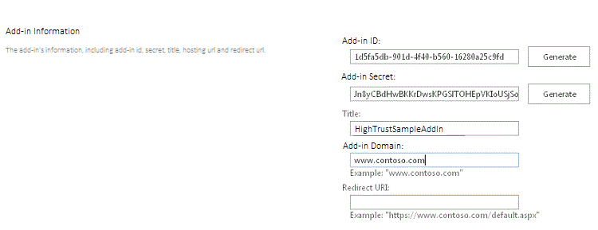

# Embalar e publicar Add-ins do SharePoint de alta confiança
Aprenda a empacotar e publicar uma alta confiança Suplemento do SharePoint para uso no local.
## Pré-requisitos para empacotar e suplementos de alta confiança de publicação
<a name="Prereqs"> </a>

Você precisará dos seguintes itens:
  
    
    

- Um ambiente de desenvolvimento de SharePoint 2013 local. Consulte  [Configurar um ambiente de desenvolvimento local para suplementos do SharePoint](set-up-an-on-premises-development-environment-for-sharepoint-add-ins.md) para ver as instruções de instalação.
    
  
- Um IIS web server para hospedar o aplicativo web remoto. Gerenciador do IIS devem ser instalado.
    
  
- Visual Studio instalado remotamente ou no computador onde você instalou SharePoint 2013.
    
  
- Microsoft Office Developer Tools for Visual Studio
    
  
-  [Implantação da Web](http://www.iis.net/downloads/microsoft/web-deploy) instalado no computador Visual Studio e a mesma versão do **Web implantar** instalado no servidor de aplicativos web remoto.
    
  
Tabela 1 relaciona alguns artigos úteis que podem ajudá-lo a entender os conceitos envolvidos na criação de Suplementos do SharePoint.
  
    
    

**Tabela 1. Principais conceitos para suplementos de alta confiança de publicação**


|**Título do artigo**|**Descrição**|
|:-----|:-----|
| [Introdução à criação de suplementos do SharePoint hospedados pelo provedor](get-started-creating-provider-hosted-sharepoint-add-ins.md) <br/> |Saiba como criar um básico hospedado em provedor Suplemento do SharePoint com o Office Developer Tools for Visual Studio. <br/> |
| [Criar o SharePoint de alta confiança Add-ins](create-high-trust-sharepoint-add-ins.md) <br/> |Saiba como criar um básica de alta confiança Suplemento do SharePoint com o Office Developer Tools for Visual Studio usando um certificado autoassinado e uma ID de emissor associado. <br/> |
| [Implantação da Web](http://www.iis.net/downloads/microsoft/web-deploy) <br/> |Implantar Web simplifica a implantação de aplicativos web e sites para servidores IIS. <br/> |
| [Digital Certificates](http://msdn.microsoft.com/library/e523b335-0156-4f47-b55c-b80495587c4f.aspx) e [Working with Certificates](http://msdn.microsoft.com/library/6ffb8682-8f07-4a45-afbb-8d2487e9dbc3.aspx) <br/> |Saiba as ideias básicas por trás de certificados digitais. <br/> |
   

> [!OBSERVAçãO]
> Alta confiança Suplementos do SharePoint só pode ser instalado no local do SharePoint, não para Microsoft SharePoint Online, e eles se destinam principalmente para uso com um local, em vez de aplicativo web baseado em nuvem. Este artigo explica como publicar o suplemento nesse cenário. Além disso, neste artigo 'cliente' refere-se aos negócios que instala o Suplemento do SharePoint e hospeda os componentes remotos do add-in.
  
    
    


## Registrar o suplemento de alta confiança
<a name="Register"> </a>

Antes de publicar o suplemento, ele deve ser registrado com o serviço de gerenciamento de suplementos do farm do SharePoint. Alta confiança Suplementos do SharePoint sempre são registradas no farm do SharePoint no qual o suplemento está para ser instalado. (Eles não podem ser vendidos através do Office Store.) Registro é feito na página http:// _SharePoint_website_/_layouts/15/appregnew.aspx, conforme descrito no procedimento a seguir.
  
    
    

### Para registrar o suplemento


1. Navegue até http:// _SharePoint_website_/_layouts/15/appregnew.aspx página. Escolha os botões de **Gerar** para gerar valores para o suplemento ID e o segredo. (O segredo não é realmente usado em alta confiança Suplementos do SharePoint, mas o formulário exige um). Forneça a URL base do domínio onde o aplicativo web remoto do add-in será executado. Não inclua o protocolo (HTTPS) no domínio, mas você precisa incluir a porta em que os componentes remota usará para solicitações HTTPS, caso não seja 443 (por exemplo,www.contoso.com:5555 ouMyAppServer:4444).
    
    Se você precisar de um URI de redirecionamento, digite um valor para que também. Consulte  [Fluxo de OAuth do código de autenticação para o SharePoint Add-ins](authorization-code-oauth-flow-for-sharepoint-add-ins.md) para obter uma explicação sobre como o URI de redirecionamento pode ser usado.
    
    O formulário na página deve ser semelhante a Figura 1. Neste exemplo, o servidor de aplicativos web remoto está escutando solicitações de HTTPS, a porta padrão 443, portanto, não é necessário especificar a porta no domínio add-in.
    

   **Figura 1. Registrar o suplemento em appregnew.aspx**

  

     
  

  

  
2. Escolha **criar**. As informações que você inseriu para o suplemento serão exibidas na próxima página. Certifique-se de manter essas informações disponíveis, pois você precisará dele quando você usar as ferramentas de publicação de Visual Studio. Considere tirando uma rápida captura de tela da página.
    
  

## Escolher uma estratégia para obtendo, manutenção e implantação de certificados de alta confiança Suplementos do SharePoint
<a name="Certificate"> </a>

Quando um desenvolvedor está usando **F5**Visual Studio para desenvolver e depurar um de alta confiança Suplemento do SharePoint, o desenvolvedor pode usar um certificado autoassinado, conforme descrito em  [Criar o SharePoint de alta confiança Add-ins](create-high-trust-sharepoint-add-ins.md). No entanto, quando o suplemento for  *publicado*  , usar um certificado autoassinado faz com que o navegador para exibir uma página de aviso antes de ele abrirá a página inicial do aplicativo de web remoto. O usuário deve escolher se deve continuar. A Figura 3 mostra exemplos de tais avisos.
  
    
    

**Figura 3. Avisos para certificados autoassinados**

  
    
    

  
    
    

  
    
    
Este aborrecimento pode ser aceitável para um desenvolvedor, mas seria inaceitável para os clientes. Portanto antes da publicação final em um ambiente de produção, o cliente deve obter um certificado assinado por uma terceira parte confiável. O terceiro pode ser uma autoridade de certificação (CA) comercial ou uma autoridade de certificação no local. Em relação a autoridades de certificação comerciais, observe que o setor está sendo desativado "somente intranet" certificados para servidores web. Eles ainda podem ser adquiridos, mas todos os certificados tais irá expirar em novembro de 2016, ou mais cedo. Não é necessário ter esse tipo de certificado para um de alta confiança Suplemento do SharePoint, porque os certificados que podem ser usados para servidores web voltados para a internet também podem ser usados para servidores da web de intranet, mas o último geralmente custa mais.
  
    
    
O certificado deve ser em dois formatos, troca de informações pessoais (pfx) e o certificado de segurança (cer). Se não estiver em um dos seguintes formatos quando originalmente obtido, o cliente pode convertê-la usando um utilitário. Além disso, depois que uma versão de formato pfx tiver sido obtida, o arquivo pfx pode ser importado para o IIS e, em seguida, a versão cer exportado como descrito abaixo.
  
    
    
Se o certificado for obtido originalmente é um formato de cer, ele irá conter as chaves públicas e privadas. Como prática geral, o arquivo. cer que é usado pelo SharePoint não deve conter a chave privada. Considere importando o certificado original ao IIS e, em seguida, exportando uma nova versão cer que não inclui a chave privada conforme descrito abaixo. Para obter mais informações sobre os arquivos. pfx e. cer, consulte o  [Certificado de editor de Software](http://msdn.microsoft.com/en-us/library/windows/hardware/ff552299%28v=vs.85%29.aspx).
  
    
    
Além disso, o cliente deve considerar se vai usar um único certificado para todos os de alta confiança Suplementos do SharePoint ou certificados separados para cada um. Para obter mais informações sobre essa decisão, consulte  [Decidir entre usar um certificado ou muitos de alta confiança Suplementos do SharePoint](creating-sharepoint-add-ins-that-use-high-trust-authorization.md#Deciding).
  
    
    

## Configurar o servidor de web remoto com o certificado
<a name="ConfigureRemote"> </a>

Os procedimentos a seguir são executados no servidor web remoto que hospeda o aplicativo web remoto.
  
    
    

### Para configurar o certificado de servidor e pfx web remoto


1. Forneça o certificado. pfx uma senha forte. Para obter mais informações, consulte  [diretrizes para a criação de senhas fortes](http://msdn.microsoft.com/en-us/library/bb416446.aspx) e [senhas fortes](http://msdn.microsoft.com/en-us/library/ms161962.aspx).
    
  
2. Importe o certificado IIS no servidor web remoto com estas etapas:
    
1. No Gerenciador do IIS, selecione o nó de  _ServerName_ na exibição em árvore à esquerda.
    
  
2. Clique duas vezes no ícone de **Certificados de servidor**.
    
  
3. Selecione **Importar** no painel **ações**, à direita.
    
  
4. Na caixa de diálogo **Importar certificado**, use o botão Procurar para navegar até o arquivo. pfx e digite a senha do certificado.
    
  
5. Se você estiver usando o IIS Manager 8, há um **Repositório de certificados selecione** menu suspenso. Escolha **pessoal**. (Isso se refere ao armazenamento certificado "pessoal" do computador, não para o usuário.)
    
  
6. Se você ainda não tiver uma versão cer, ou você fazer, mas ela inclui a chave privada, habilite **permitir esse certificado a ser exportado**.
    
  
7. Clique em **OK**.
    
  

### Para abrir o repositório de certificados do Windows


1. No mesmo servidor, abra o **Console de gerenciamento Microsoft** e conforme descrito em [abra MMC 3.0](http://technet.microsoft.com/en-us/library/cc766121.aspx).
    
  
2. Adicione o snap-in de **certificados** para a conta de computador, conforme descrito em [Adicionar o Snap-in de certificados a um MMC](http://technet.microsoft.com/en-us/library/cc754431.aspx). Certifique-se de usar o procedimento para o  *computador*  , e não um usuário ou serviço. Escolha o *local*  computador, o computador não "outro", quando solicitado.
    
  
Se você estiver usando o ISS Manager 8, ignore o próximo procedimento.
  
    
    

### Etapas adicionais de 7 de Gerenciador do ISS para obter o certificado para o repositório de certificados do Windows


1. Crie uma pasta no sistema de arquivos do servidor a ser usado como um local de armazenamento temporário muito para o certificado.
    
  
2. No Gerenciador do IIS, selecione o nó de  _ServerName_ na exibição em árvore à esquerda.
    
  
3. Clique duas vezes no ícone de **Certificados de servidor**.
    
  
4. Na lista de **Certificados de servidor**, clique com botão direito no certificado e, em seguida, selecione **Exportar**, conforme mostrado na Figura 4.
    
   **Figura 4. Exportando um certificado**

  

     
  

  

  
5. Exportar o arquivo para a pasta que você criou e insira sua senha.
    
  
6. No **Console de gerenciamento Microsoft**, importe o certificado conforme descrito em  [Importar um certificado](http://technet.microsoft.com/en-us/library/cc754489.aspx). Certifique-se de especificar o armazenamento **pessoal**.
    
  
7. Deixe o console aberto para o próximo procedimento.
    
  
8.  *Exclua a pasta que você criou na primeira etapa e o arquivo de certificado no proprietário.*  As vantagens de segurança de manter o certificado no repositório de certificados são desfeitas se também está no sistema de arquivos.
    
  
O próximo procedimento se aplica ao Gerenciador de IIS 7 e 8.
  
    
    

### Para obter o número de série do certificado


1. No **Microsoft Management Console**, navegue até a pasta **certificados** sob a pasta **pessoal** do snap-in **certificados (computador Local)**, se não ainda estiver aberta.
    
  
2. Duas vezes no certificado para sua Suplemento do SharePoint para abri-lo e, em seguida, abra a guia **detalhes**.
    
  
3. Selecione o campo de **número de série** para tornar o número de série inteiro está visível na caixa.
    
  
4. Copie o número de série,  *sem espaços*  , para um arquivo de texto e dê a ela ao desenvolvedor do Suplemento do SharePoint.
    
    > [!DICA]
      > Algumas postagens de blog do desenvolvedor e o relatório de perguntas de Fórum que cria uma cadeia de caracteres com caracteres ocultos copiando o número de série diretamente para a área de transferência que torna o número de série não reconhecíveis ao código no Suplemento do SharePoint. Considere a possibilidade de digitar manualmente o número, em vez de copiá-la.
Em seguida, você cria uma versão de cer do certificado. Este arquivo contém a chave pública do servidor web remoto e é usada pelo SharePoint para descriptografar solicitações do aplicativo web remoto e validar os tokens de acesso nessas solicitações. Ele é criado no servidor web remoto e depois movido para o farm do SharePoint.
  
    
    

### Para criar o certificado cer


1. No Gerenciador do IIS, selecione o nó de  _ServerName_ na exibição em árvore à esquerda.
    
  
2. Clique duas vezes em **Certificados de Servidor**.
    
  
3. No modo de exibição de **Certificados de servidor**, clique duas vezes no certificado para exibir os detalhes do certificado.
    
  
4. Na guia **detalhes**, escolha **Copiar para arquivo** para iniciar o **Assistente para exportação de certificado** e escolha **Avançar**.
    
  
5. Use o valor padrão **não, não exportar a chave privada** e escolha **Avançar**.
    
  
6. Use os valores padrão na próxima página. Escolha **Avançar**.
    
  
7. Escolha **Procurar** e navegue até qualquer pasta. (O arquivo cer vai ser movida mesmo assim efetuará o logoff neste computador.) Dar ao arquivo o mesmo nome do arquivo pfx e escolha **Salvar**. O certificado é salvo como um arquivo. cer.
    
  
8. Escolha **OK**.
    
  
9. Escolha **Concluir**.
    
  

## Configurar o SharePoint para usar o certificado
<a name="ConfigureSP"> </a>

Os procedimentos nesta seção podem ser executados em qualquer servidor do SharePoint no qual o **Shell de gerenciamento do SharePoint** está instalado.
  
    
    

### Distribuir o arquivo cer no SharePoint


1. Crie uma pasta e certifique-se de que as identidades de pool de suplemento para os pools seguintes do add-in IIS tem lido da direita para a ele:
    
  - **SecurityTokenServiceApplicationPool**
    
  
  - O suplemento do pool que serve o site do IIS que hospeda o pai de aplicativo web do SharePoint para o seu site do SharePoint de teste. Para o site do IIS do **SharePoint - 80**, o pool é chamado **OServerPortalAppPool**.
    
  
2.  *Mover*  (não simplesmente cópia) o arquivo. cer do servidor web remoto para a pasta recém-criada no servidor do SharePoint. O arquivo será nesta pasta somente temporariamente.
    
  
O procedimento a seguir configura o certificado como um emissor de token confiável no SharePoint. Ele é executado apenas uma vez (para cada de alta confiança Suplemento do SharePoint ).
  
    
    

### Para configurar o certificado


1. Se você ainda não feito isso, crie o script de Windows PowerShell de configuração de alta confiança ou scripts que você precisa, conforme descrito em  [Scripts de configuração de alta confiança para SharePoint 2013](high-trust-configuration-scripts-for-sharepoint-2013.md).
    
  
2. Copie os scripts para o SharePoint server.
    
  
3. Abra o **Shell de gerenciamento do SharePoint** como um administrador e execute os scripts apropriados.
    
  
4. Um dos scripts é destinado para uso quando o cliente está compartilhando um único certificado entre vários Suplementos do SharePoint. Se o script produz um arquivo que contém o GUID para o emissor de token. Se você usar esse script, dê o arquivo que ele envia ao desenvolvedor de alta confiança Suplemento do SharePoint.
    
  
5.  *Exclua o arquivo de cer do sistema de arquivos do servidor do SharePoint.* 
    
  

> [!OBSERVAçãO]
> O registro do certificado como um emissor de token não tem efeito imediato e o suplemento não funcionarão até que ele esteja. Pode levar desde que 24 horas antes de todos os servidores do SharePoint reconhecem o novo emissor de token. Executar um comando iisreset em todos os servidores do SharePoint, se você pode fazer isso sem atrapalhar os usuários do SharePoint, causaria-los reconhecer imediatamente o emissor.
  
    
    


## Modificar o arquivo Web. config
<a name="WebConfig"> </a>


> [!DICA]
> Para um exemplo de código que inclui um Web. config modificadas, consulte  [PnP / amostras / Core.OnPrem.S2S.WindowsCertStore](https://github.com/OfficeDev/PnP/tree/dev/Samples/Core.OnPrem.S2S.WindowsCertStore)..
  
    
    

Edite o arquivo Web. config para que ele contém novos valores para as seguintes chaves no nó  `appSettings` :
  
    
    

- **ClientID:** Esse é o ID (GUID) que foi gerado em appregnew.aspx do cliente do aplicativo da web.
    
  
- **ClientSigningCertificateSerialNumber:** *(Você precisará adicionar essa chave, se o Microsoft Office Developer Tools for Visual Studio não adicionou proprietário.)*  Este é o número de série do certificado. Deve haver sem espaços ou hifens no valor.
    
  
- **IssuerId:** Este é o GUID do emissor de token ( *que deve ser minúsculas*  ). Seu valor depende a estratégia de certificado do cliente:
    
  - Se a alta confiança Suplemento do SharePoint tem seu próprio certificado que ele não está compartilhando com outros Suplementos do SharePoint, o  `IssuerId` é igual a `ClientId`.
    
  
  - Se o Suplemento do SharePoint está compartilhando o mesmo certificado que outros Suplementos do SharePoint está usando, o  `IssuerId` é uma GUID arbitrário. O script para este cenário em que você pode encontrar no [Scripts de configuração de alta confiança para SharePoint 2013](high-trust-configuration-scripts-for-sharepoint-2013.md) gera um arquivo de texto com esse GUID nela. A equipe de TI pode passar o arquivo meio para o desenvolvedor do suplemento para inserção como o `IssuerId` no arquivo Web. config XML.
    
  

> [!OBSERVAçãO]
> Chaves de configuração do suplemento para **ClientSigningCertificatePath** e **ClientSigningCertificatePassword**tenha adicionado a Office Developer Tools for Visual Studio. Eles não são usados em um suplemento de produção e devem ser excluídos.
  
    
    

O exemplo a seguir é um exemplo. Observe que não há nenhuma chave **ClientSecret** para uma alta confiança Suplemento do SharePoint.
  
    
    


```XML

<appSettings>
  <add key="ClientID" value="c1c12d4c-4900-43c2-8b89-c05725e0ba30" />
  <add key="ClientSigningCertificateSerialNumber" value="556a1c9c5a5415994941abd0ef2f947b" />
  <add key="IssuerId" value="f94591d5-89e3-47cd-972d-f1895cc158c6" />
</appSettings>

```


## Modificar o arquivo TokenHelper
<a name="WebConfig"> </a>

O arquivo de TokenHelper.cs (ou. vb) gerado pela Office Developer Tools for Visual Studio precisa ser modificado para trabalhar com o certificado armazenado no repositório de certificados do Windows e recuperá-lo pelo seu número serial. O exemplo a seguir mostra uma maneira. O exemplo usa c#.
  
    
    

> [!DICA]
> Para um exemplo de código que inclui um tokenhelper.cs modificadas, consulte  [PnP / amostras / Core.OnPrem.S2S.WindowsCertStore](https://github.com/OfficeDev/PnP/tree/dev/Samples/Core.OnPrem.S2S.WindowsCertStore)..
  
    
    


### Para modificar o TokenHelper


1. Na parte inferior da parte  `#region private fields` do arquivo são declarações para `ClientSigningCertificatePath`,  `ClientSigningCertificatePassword`e  `ClientCertificate`. Remova todos os três.
    
  
2. Em seu lugar, adicione a seguinte linha:
    
  ```
  
private static readonly string ClientSigningCertificateSerialNumber
    = WebConfigurationManager.AppSettings.Get("ClientSigningCertificateSerialNumber");
  ```

3. Localize a linha que declara o campo  `SigningCredentials` . Substituí-lo com a seguinte linha:
    
  ```
  
private static readonly X509SigningCredentials SigningCredentials
    = GetSigningCredentials(GetCertificateFromStore());
  ```

4. Vá para a parte  `#region private methods` do arquivo e adicione os seguintes métodos:
    
  ```
  
private static X509SigningCredentials GetSigningCredentials(X509Certificate2 cert)
{
    return (cert == null) ? null 
                          : new X509SigningCredentials(cert, 
                                                       SecurityAlgorithms.RsaSha256Signature, 
                                                       SecurityAlgorithms.Sha256Digest);
}

private static X509Certificate2 GetCertificateFromStore()
{
    if (string.IsNullOrEmpty(ClientSigningCertificateSerialNumber))
    {
        return null;
    }  

    // Get the machine's personal store
    X509Certificate2 storedCert;
    X509Store store = new X509Store(StoreName.My, StoreLocation.LocalMachine); 

    try
    {
        // Open for read-only access                 
        store.Open(OpenFlags.ReadOnly);

        // Find the cert
        storedCert = store.Certificates.Find(X509FindType.FindBySerialNumber, 
                                             ClientSigningCertificateSerialNumber, 
                                             true)
                       .OfType<X509Certificate2>().SingleOrDefault();
    }
    finally
    {
        store.Close();
    }

    return storedCert;
}
  ```


## Use os assistentes de Visual Studio empacotar seu aplicativo da web remoto e Suplemento do SharePoint para publicação
<a name="Package"> </a>


> [!DICA]
> A Microsoft atualiza Visual Studio e Office Developer Tools for Visual Studio em uma agenda muito mais frequente que no passado e documentação sempre não podem ser atualizadas para se manter atualizado com as alterações. Esta seção foi escrita usando a versão do Visual Studio lançada em outubro de 2013 e a versão do Office Developer Tools for Visual Studio que foi incluída nela. Se você estiver trabalhando com uma versão anterior ou posterior do Visual Studio ou as ferramentas, talvez você precise consultar a Ajuda de Visual Studio e postagens de blog para localizar as equivalentes maneiras de realizar as etapas destes procedimentos.
  
    
    


### Empacotar o aplicativo web remoto


1. No **Solution Explorer**, clique com botão direito do projeto de aplicativo da web (não o projeto Suplemento do SharePoint ) e selecione **Publicar**.
    
  
2. Na guia **perfil**, selecione o **Novo perfil** na lista suspensa.
    
  
3. Quando solicitado, dê um nome apropriado para o perfil. Por exemplo, SP de folha de pagamento suplementar - aplicativo da Web remoto.
    
  
4. Na guia **conexão**, selecione **Implantar o pacote da Web** na lista suspensa de método de **publicação**.
    
  
5. Para o **local do pacote**, use qualquer pasta. Para simplificar procedimentos posteriores, este deve ser uma pasta vazia. A subpasta da pasta bin do projeto é geralmente usada.
    
  
6. Para o nome do site, digite o nome do site do IIS que irá hospedar o aplicativo web. Não incluir o protocolo ou porta ou invertida no nome de usuário; Por exemplo, "PayrollSite". Se desejar que o aplicativo web para ser um filho do Site da Web padrão, use o Site padrão _/<website name>_; Por exemplo, "Padrão Site da Web/PayrollSite". (Se o site do IIS ainda não existir, ele será criado quando você executar o pacote de implantação da Web em um procedimento posterior.)
    
  
7. Clique em **Avançar**.
    
  
8. Na guia **configurações**, selecione **versão** ou **Depurar** na lista suspensa **configuração**.
    
  
9. Clique em **Avançar** e em seguida **Publicar**. Um arquivo zip e vários outros arquivos que serão usados para instalar o aplicativo web em um procedimento posterior são criados no local de pacote.
    
  

### Para criar um pacote de Suplemento do SharePoint


1. Com o botão direito no projeto Suplemento do SharePoint na sua solução e clique em **Publicar**.
    
  
2. No menu suspenso **perfil atual**, selecione o perfil que você criou no procedimento a última.
    
  
3. Se um pequeno símbolo de aviso amarelo aparece ao lado do botão **Editar**, clique no botão **Editar**. Um formulário solicita as mesmas informações que você incluídos no arquivo Web. config XML. Essas informações não são necessárias, já que você estiver usando o **Pacote da Web implantar o** método de publicação, mas você não pode deixar o formulário em branco. Insira quaisquer caracteres nas caixas de quatro texto e clique em **Concluir**.
    
  
4. Clique no botão de **pacote o add-in**. (Não clique em **implantar seu projeto da web**. Esse botão simplesmente repetirá o que você fez na etapa final do último procedimento.) Um **pacote o suplemento** de formulário é aberto.
    
  
5. No **onde o seu site está hospedado?** texto, digite a URL do domínio do aplicativo web remoto. Você deve incluir o protocolo, HTTPS, e se a porta em que o aplicativo web escutará solicitações HTTPS não é 443, deve incluir a porta também; Por exemplo,https://MyServer:4444. (Esse é o valor que Office Developer Tools for Visual Studio usa para substituir o ~ remoteAppUrl token no manifesto suplemento para o Suplemento do SharePoint.)
    
  
6. No **o que é ID do suplemento de cliente?** texto, digite a ID do cliente que foi gerado na página appregnew.aspx, e que você inseriu também no arquivo Web. config XML.
    
  
7. Clique em **Concluir**. O pacote de suplemento será criado.
    
  

## Publicar o aplicativo da web remoto e instale o Suplemento do SharePoint
<a name="PublishRemote"> </a>


  
    
    

### Para publicar o aplicativo web


1. Navegue até a pasta que você usou como o **local do pacote** ao compactar o aplicativo web remoto e, em seguida, copie todos os arquivos para uma pasta no servidor remoto.
    
  
2. Nesta pasta, abra o arquivo. Deploy-Readme. txt  _project_name_(onde  _project_name_ é o nome do projeto de aplicativo da web Visual Studio ) e siga as instruções no arquivo para instalar o aplicativo web usando o _project_name_. arquivo Deploy..
    
  

### Para configurar a ligação de protocolo para o aplicativo web


1. No Gerenciador do IIS, realce o novo site no painel **conexões**. (Se o novo aplicativo web é um filho do **Site da Web padrão**, realce o **Site padrão** e realizar esse procedimento para o **Site da Web padrão** ).
    
  
2. No painel **ações**, clique em **ligações**.
    
  
3. Na caixa de diálogo **Ligações do Site**, clique em **Adicionar**. Na caixa de diálogo **Adicionar associação de Site** que abre, siga estas etapas.
    
1. Selecione **HTTPS** na lista suspensa **tipo**.
    
  
2. Selecione **Todos não atribuídos** na lista suspensa **endereço IP**.
    
  
3. Insira a porta na caixa de texto de **porta**. Se você especificou uma porta no domínio suplemento quando você registrou o Suplemento do SharePoint em appregnew.aspx (conforme descrito em  [Registrar o suplemento de alta confiança](#Register)), você precisará usar o mesmo número aqui. Se você não especificar uma porta em appregnew, em seguida, use 443 aqui.
    
  
4. Na lista suspensa **certificado SSL**, selecione o certificado que você usou para configurar o servidor em  [Configurar o servidor de web remoto com o certificado](#ConfigureRemote) acima.
    
  
5. Clique em **OK**.
    
  
4. Clique em **Fechar**.
    
  

### Configurar a autenticação para o aplicativo web


1. Quando um novo aplicativo web está instalado no IIS, inicialmente é configurado para acesso anônimo, mas de alta confiança quase todos os Suplemento do SharePoint foram projetados para exigir a autenticação de usuários, portanto você precisa alterá-lo. No Gerenciador do IIS, realce o aplicativo web no painel **conexões**. Ele vai ser um site de mesmo nível do Site da Web padrão ou um filho do Site da Web padrão.
    
  
2. Clique duas vezes no ícone de **autenticação** no painel central para abrir o painel de **autenticação**.
    
  
3. Realce de **Autenticação anônima** e clique em **Desativar** no painel **ações**.
    
  
4. Realce o sistema de autenticação que o aplicativo web é projetado para usar e clique em **Habilitar** no painel **ações**.
    
    Se o código do aplicativo da web usa o código gerado nos arquivos TokenHelper e SharePointContext sem modificações as partes de autenticação de usuário dos arquivos, o aplicativo web está usando **A autenticação do Windows**, de forma que é a opção que você deve habilitar.
    
  
5. Se você estiver usando os arquivos de código gerado sem modificações as partes de autenticação de usuário dos arquivos, você também precisa configurar o provedor de autenticação com as seguintes etapas:
    
1. Realce de **Autenticação do Windows** no painel de **autenticação**.
    
  
2. Clique em **provedores**.
    
  
3. Na caixa de diálogo **provedores**, certifique-se de que o **NTLM** é listados *acima* **negociar**.
    
  
4. Clique em **OK**.
    
  

### Para carregar e instalar o Suplemento do SharePoint


1. Carregar o arquivo de pacote *.app do Suplemento do SharePoint para o catálogo de suplemento de organização. (De alta confiança Suplementos do SharePoint não podem ser distribuídas através do Office Store.) Para obter detalhes, consulte  [Adicionar suplementos para o catálogo de suplemento](http://technet.microsoft.com/en-us/library/fp161234.aspx#AddApps).
    
  
2. Instale o suplemento em qualquer site dentro do aplicativo web do SharePoint que contém o catálogo do suplemento do mesmo pai. Para obter detalhes sobre como carregar e instalar o Suplemento do SharePoint, consulte  [Adicionar SharePoint suplementos a um site do SharePoint 2013](http://technet.microsoft.com/en-us/library/fp161231).
    
  

## Recursos adicionais
<a name="bk_addresources"> </a>


-  [Criar o SharePoint de alta confiança Add-ins](create-high-trust-sharepoint-add-ins.md)
    
  
-  [Publicar suplementos do SharePoint usando o Visual Studio](publish-sharepoint-add-ins-by-using-visual-studio.md)
    
  
-  [Registrar o SharePoint 2013 de suplementos](register-sharepoint-add-ins-2013.md)
    
  
-  [Introdução à criação de suplementos do SharePoint hospedados pelo provedor](get-started-creating-provider-hosted-sharepoint-add-ins.md)
    
  

