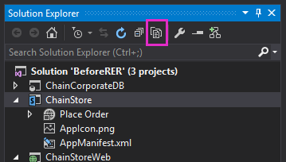

# Implantar programaticamente um botão personalizado do add-in
Saiba como programaticamente registrar um botão da faixa de opções personalizada com uma lista personalizada no mesmo hospedado em provedor Suplemento do SharePoint.
Esse é o nono em uma série de artigos sobre noções básicas do desenvolvimento hospedado em provedor Suplementos do SharePoint. Você primeiro deve estar familiarizado com  [Suplementos do SharePoint](sharepoint-add-ins.md) e os artigos anteriores desta série:
  
    
    


-  [Introdução à criação de suplementos do SharePoint hospedados pelo provedor](get-started-creating-provider-hosted-sharepoint-add-ins.md)
    
  
-  [Dar seu suplemento a aparência do SharePoint](give-your-provider-hosted-add-in-the-sharepoint-look-and-feel.md)
    
  
-  [Incluir um botão personalizado do add-in](include-a-custom-button-in-the-provider-hosted-add-in.md)
    
  
-  [Obtenha uma visão geral do modelo de objeto do SharePoint](get-a-quick-overview-of-the-sharepoint-object-model.md)
    
  
-  [Adicionar operações de gravação do SharePoint para o suplemento](add-sharepoint-write-operations-to-the-provider-hosted-add-in.md)
    
  
-  [Include an add-in part in the provider-hosted add-in](include-an-add-in-part-in-the-provider-hosted-add-in.md)
    
  
-  [Lidar com eventos de suplemento do add-in](handle-add-in-events-in-the-provider-hosted-add-in.md)
    
  
-  [Adicionar lógica de primeira execução para o suplemento](add-first-run-logic-to-the-provider-hosted-add-in.md)
    
  

> **OBSERVAçãO**
> Se você tiver trabalhado através desta série sobre hospedado em provedor suplementos, então você possui uma solução de Visual Studio que você pode usar para continuar com este tópico. Você também pode baixar o repositório em  [SharePoint_Provider-hosted_Add-Ins_Tutorials](https://github.com/OfficeDev/SharePoint_Provider-hosted_Add-ins_Tutorials) e abra o arquivo BeforeProgrammaticButton.sln.
  
    
    

Neste artigo, você aprenderá como incluir um botão da faixa de opções personalizada no Suplemento do SharePoint quando a lista cuja faixa de opções obtém o botão está próprio programaticamente sendo implantada no suplemento muito mesmo.
## Adicione novamente no botão personalizado ao projeto


> **OBSERVAçãO**
> As configurações para projetos de inicialização no Visual Studio tendem a reverter para a configuração padrão sempre que a solução for reaberta. Sempre, siga estas etapas imediatamente após reabri-lo a solução de exemplo nesta série de artigos:> Com o botão direito no nó da solução na parte superior do **Gerenciador de soluções** e selecione **definir projetos de inicialização**.> Verifique se que todos os três projetos estão definidos para **Iniciar** na coluna **ação**.
  
    
    

No artigo anterior você removeu botão da faixa de opções de **AddEmployeeToCorpDB** personalizado do projeto. Adicioná-lo novamente com estas etapas abaixo.
  
    
    

1. No **Solution Explorer**, pressione o botão **Mostrar todos os arquivos** na pequena barra de ferramentas na parte superior do **Gerenciador de soluções**.
    
     
  

  

  
2. No projeto **ChainStore**, clique com o botão **AddEmployeeToCorpDB** e selecione **incluir no projeto**.
    
  
3. Pressione o botão **Mostrar todos os arquivos** novamente.
    
  
4. No projeto **ChainStore**, expanda **AddEmployeeToCorpDB** e abra o arquivo Elements. XML.
    
  

## Entender um dilema e sua solução

No arquivo Elements. XML, o atributo **RegistrationId** do elemento **CustomAction** identifica a lista na faixa de opções cuja o botão é adicionado: `{$ListId:Lists/Local Employees;}`. Isso funcionou bem quando a lista tinha já foram adicionada ao web host manualmente. Mas agora que implantamos lista programaticamente na lógica de primeira execução, a lista não existe quando SharePoint instala o suplemento e tenta implantar o botão. A instalação do suplemento seria acionar uma exceção e falhar.
  
    
    
Implantando a lista no manipulador de eventos de instalação, em vez de lógica de primeira execução, não resolve o dilema porque SharePoint implanta componentes personalizados descritivos definidos, como o botão personalizado (e a parte do suplemento **Fazer pedido** ), *antes de*  ele executa o manipulador personalizado, portanto a lista não existe quando tenta do SharePoint implantar o botão.
  
    
    
Criando um botão personalizado inteiramente programaticamente não é prático por motivos que são muito avançados para discutir aqui. Felizmente, não é necessário. Há uma maneira relativamente fácil delimitadas programaticamente criar um botão personalizado e atribuí-la a uma lista personalizada. A seguir estão as etapas básicas:
  
    
    

1. Mantenha o botão descritivos definido no projeto, mas atribuí-lo à faixa de opções de algo que sempre existe nos sites do SharePoint, em vez da uma lista que programaticamente é implantada com o suplemento mesmo.
    
  
2. Na primeira execução lógica, depois que a lista é criada por meio de programação, adicione de maneira programática um botão indefinido à faixa de opções da lista.
    
  
3. Inicialize as propriedades do novo botão com os valores do botão original. Nesse momento, há dois botões idênticos. A segunda deles é atribuída à faixa de opções da lista de **Locais de funcionários**.
    
  
4. Exclua programaticamente o botão original.
    
  

## Registre-se no botão personalizado programaticamente

O procedimento a seguir mostra como a implementação dessa estratégia.
  
    
    

1. No projeto **ChainStore**, expanda **AddEmployeeToCorpDB** e abra o arquivo Elements. XML e altere o valor do atributo **RegistrationId** do elemento **CustomAction** como "100". Esta é a ID de um tipo de lista. Mesmo se não houver nenhuma instâncias de listas desse tipo no site, o *tipo*  de lista é em cada site do SharePoint. O atributo agora deve se parecer com o seguinte.
    
  ```XML
  
RegistrationId="100"
  ```

2. No arquivo SharePointComponentDeployer.cs, adicione a seguinte linha ao método  `DeployChainStoreComponentsToHostWeb` , logo abaixo da linha que chama `CreateLocalEmployeesList`. Você criará esse método na próxima etapa.
    
  ```cs
  ChangeCustomActionRegistration();
  ```

3. Adicione o seguinte método à classe  `SharePointComponentDeployer` . Observe o seguinte sobre este código:
    
  - Porque a ação personalizada; ou seja, o botão personalizado; foi registrada com a faixa de opções de um  *tipo*  de lista, destinado a todo o site e estiver na coleção do site de ações personalizadas. Portanto o código recupera nessa coleção.
    
  
  - O valor do  `action.Name` proveniente o atributo **ID** do elemento no arquivo element.xml em **AddEmployeeToCorpDB** **CustomAction**.
    
    > **IMPORTANTE**
      > **Você deve alterar o valor de  `action.Name` no código a seguir para corresponder ao valor em seu arquivo Elements.** A parte do GUID do nome será diferente. Observe que há um "." caracteres entre o GUID e o restante do nome. O exemplo a seguir é um exemplo da linha.>  `where action.Name == "4a926a42-3577-4e02-9d06-fef78586b1bc.AddEmployeeToCorpDB"`

  ```cs
  private static void ChangeCustomActionRegistration()
{
    using (var clientContext = sPContext.CreateUserClientContextForSPHost())
    {
         var query = from action in clientContext.Web.UserCustomActions
                     where action.Name == "{button_GUID} .AddEmployeeToCorpDB"
                     select action;
          IEnumerable<UserCustomAction> matchingActions = clientContext.LoadQuery(query);	       
	         clientContext.ExecuteQuery();
	
          UserCustomAction webScopedEmployeeAction = matchingActions.Single();

         // TODO8: Get a reference to the (empty) collection of custom actions 
         // that are registered with the custom list.

         // TODO9: Add a blank custom action to the list's collection.

         // TODO10: Copy property values from the descriptively deployed
         // custom action to the new custom action

        // TODO11: Delete the original custom action.         

          clientContext.ExecuteQuery();
    }
}
  ```

4. Substitua  `TODO8` o código a seguir.
    
    Observe que, quando você cancela um add-in, componentes criados pelo suplemento não serão removidos. Depois que executa a lógica de primeira execução, haverá uma ação personalizada no conjunto de **UserCustomActions** da lista e ele não vai ser cancelado na próxima vez que você pressionar F5. Para evitar confusão, a última linha neste código `listActions.Clear();` esvazia a coleção.
    


  ```cs
  
var queryForList = from list in clientContext.Web.Lists
                   where list.Title == "Local Employees"
                   select list;
IEnumerable<List> matchingLists = clientContext.LoadQuery(queryForList);
clientContext.ExecuteQuery();

List employeeList = matchingLists.First();
var listActions = employeeList.UserCustomActions;
clientContext.Load(listActions);
listActions.Clear();
  ```

5. Substitua  `TODO9` a linha a seguir, que adiciona uma ação personalizada indefinida à lista de **Locais de funcionários**.
    
  ```cs
  
var listScopedEmployeeAction = listActions.Add();
  ```

6. Substitua  `TODO10` o código a seguir. Observe o seguinte sobre este código:
    
  - Ele atribui os valores de propriedade do botão escopo web (que foi implantado com marcação descritiva) para as propriedades correspondentes do botão escopo de lista, portanto, os dois botões são idênticos, exceto no escopo.
    
  
  - A propriedade **Sequence** Especifica a ordem relativa que o botão aparecerá na sua área da faixa de opções. Nesse caso, o botão está na seção **ações** da guia **itens** da faixa de opções. Na marcação descritiva esse valor foi definido como 10001 que é alta o suficiente para garantir que ele será exibido após (ou seja, à direita do) quaisquer botões em predefinidas que SharePoint próprio coloca na seção **ações** da faixa de opções.
    
  

  ```cs
  listScopedEmployeeAction.Title = webScopedEmployeeAction.Title;
listScopedEmployeeAction.Location = webScopedEmployeeAction.Location;
listScopedEmployeeAction.Sequence = webScopedEmployeeAction.Sequence;
listScopedEmployeeAction.CommandUIExtension = webScopedEmployeeAction.CommandUIExtension;
listScopedEmployeeAction.Update();
  ```

7. Substitua  `TODO11` a linha a seguir, que excluirá o botão de descritivos definidos original. Se não podemos tinha nessa linha, cada lista no site que usa o modelo de lista "100" teria botão personalizado contidas nela. Desde que a funcionalidade do botão intimamente é vinculada à lista de **Locais de funcionários**, não faria nenhum sentido ter o botão em qualquer outra lista. Além disso, nessa linha, o botão apareceria  *duas vezes*  na lista de **Locais de funcionários**, porque essa lista usa o modelo "100".
    
  ```cs
  
webScopedEmployeeAction.DeleteObject();
  ```


    Todo o método agora deve se parecer com o seguinte (exceto deve haver um GUID no lugar do espaço reservado).
    


  ```cs
  private static void ChangeCustomActionRegistration()
{
    using (var clientContext = SPContext.CreateUserClientContextForSPHost())
    {
         var query = from action in clientContext.Web.UserCustomActions
                     where action.Name == "{button_GUID} .AddEmployeeToCorpDB"
                     select action;
          IEnumerable<UserCustomAction> matchingActions = clientContext.LoadQuery(query);	       
	         clientContext.ExecuteQuery();
	
          UserCustomAction webScopedEmployeeAction = matchingActions.Single();

         var queryForList = from list in clientContext.Web.Lists
                            where list.Title == "Local Employees"
                            select list;
         IEnumerable<List> matchingLists = clientContext.LoadQuery(queryForList);
         clientContext.ExecuteQuery();

        List employeeList = matchingLists.First();
        var listActions = employeeList.UserCustomActions;
        clientContext.Load(listActions);
        listActions.Clear();

        var listScopedEmployeeAction = listActions.Add();

        listScopedEmployeeAction.Title = webScopedEmployeeAction.Title;
        listScopedEmployeeAction.Location = webScopedEmployeeAction.Location;
        listScopedEmployeeAction.Sequence = webScopedEmployeeAction.Sequence;
        listScopedEmployeeAction.CommandUIExtension = webScopedEmployeeAction.CommandUIExtension;
        listScopedEmployeeAction.Update();

        webScopedEmployeeAction.DeleteObject();         

        clientContext.ExecuteQuery();
    }
}
  ```


## Solicitar controle total da web host

Como o suplemento está adicionando adicionando e excluindo escopo web ações personalizadas, precisamos escalonar as permissões que o suplemento solicitações de gerenciar para controle total. Siga estas etapas.
  
    
    

1. No **Solution Explorer**, abra o arquivo de AppManifest.xml no projeto **ChainStore**.
    
  
2. Abra na guia **permissões** deixe o valor do **escopo** na **Web**, mas no campo de **permissão**, selecione **Controle total** na lista para baixo.
    
  
3. Salve o arquivo.
    
  

## Execute o add-in e testar a implantação de botão


  
    
    

1. Abra a página de **Conteúdo do Site** do site do repositório de Hong Kong *e remover a lista de **Funcionários Local** !* 
    
    > **OBSERVAçãO**
      > Cancelando um suplemento em Visual Studio, não remova listas que são criadas pelo add-in, portanto você precisa excluir manualmente sempre que você estiver testando o código que cria a ele.
2. Use a tecla F5 para implantar e executar seu suplemento Visual Studio hospeda o aplicativo da web remoto no IIS Express e hospeda o banco de dados SQL em um SQL Express. Ele também faz uma instalação temporária do add-in no seu site do SharePoint de teste e executa imediatamente o add-in. Você será solicitado para conceder permissões para o suplemento antes que ela seja iniciar página é aberta.
    
  
3. Quando página de iniciar do add-in é aberto, selecione o link de **volta para o Site** no controle de cromo na parte superior.
    
  
4. Navegue até a página de **Conteúdo do Site**. A lista de **Funcionários Local** está presente, porque a lógica de primeira execução adicionou.
    
    > **OBSERVAçãO**
      > Se a lista não estiver lá ou se tiver outras indicações que o código de primeira execução não está em execução, pode ser que a tabela de **inquilinos** não está sendo revertida para um estado vazio quando você pressiona F5. A causa mais comum disso é que o projeto **ChainCorporateDB** não mais é definido como um projeto de inicialização no Visual Studio. Consulte a observação na parte superior deste artigo sobre como corrigir esse problema. Além disso, certifique-se de que você configurou o banco de dados seja recompilado conforme descrito em [Configurar Visual Studio para reconstruir o banco de dados corporativo com cada sessão de depuração](give-your-provider-hosted-add-in-the-sharepoint-look-and-feel.md#Rebuild).
5. Abra a lista e adicionar um item.
    
  
6. Na exibição de lista, selecione o item e abra a guia **Item** na faixa de opções. Botão **Adicionar a banco de dados corporativos** é na faixa de opções.
    
  
7. Clique no botão e o funcionário é adicionado ao banco de dados corporativo e o campo **adicionado ao banco de dados corporativos** é alterado para **Sim**.
    
  
8. Navegue de volta para a página de **Conteúdo do Site** e selecione **Adicionar um suplemento**.
    
  
9. Adicione uma nova **Lista personalizada**. Por padrão, ela será "Genérico" tipo. (Genérico é o tipo de lista 100). Depois que a lista é criada, abra a guia de **Item** na faixa de opções. Observe que o botão **Adicionar para DB corporativo** está *não*  na faixa de opções. Isso porque seu código excluído no botão escopo de web.
    
  
10. Para encerrar a sessão de depuração, feche a janela do navegador ou interrompa a depuração no Visual Studio. Sempre que você pressiona F5, o Visual Studio retira a versão anterior do suplemento e instala a última mais recente.
    
  
11. Você vai trabalhar com esse suplemento e com a solução do Visual Studio em outros artigos. Além disso, é uma prática recomendada retirar o suplemento uma última vez, quando deixar de trabalhar com ele por algum tempo. Clique com botão direito do mouse no projeto no **Gerenciador de Soluções** e escolha **Retirar**.
    
  

## 
<a name="Nextsteps"> </a>

Eventos em listas e itens de lista também podem ter manipuladores personalizados no SharePoint. Você aprenderá a criar um e implantá-la em sua lógica de primeira execução no próximo artigo:  [Lidar com eventos de item de lista em que o suplemento hospedado em provedor](handle-list-item-events-in-the-provider-hosted-add-in.md)
  
    
    

