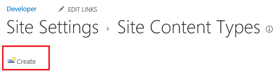
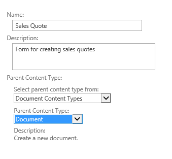

# Fornecer um modelo para uma biblioteca de documentos em um suplemento de negócios nuvem
Além dos modelos do Office que estão disponíveis quando você adiciona um documento a uma biblioteca de documentos do SharePoint, você pode fornecer seus próprios modelos. Por exemplo, você pode ter seu próprio modelo de cotação de vendas que você deseja usar quando novos pedidos são adicionados.
## 

Se você ainda não tiver feito isso, associe uma biblioteca de documentos com seu suplemento de negócios nuvem. Consulte  [Associar uma biblioteca de documentos uma entidade](associate-a-document-library-with-an-entity.md).
  
    
    

### Para adicionar um modelo

1. Vá para o site de desenvolvedor do SharePoint e na página de **desenvolvedor**, escolha **Conteúdo do Site**.
    
  
2. Na página **Conteúdo do Site**, escolha **configurações**, conforme mostrado na Figura 1.
    
   **Figura 1. O link de configurações**

  

     
  

  

  
3. Na página **Configurações do Site**, na lista **Galerias de Web Designer**, escolha de **tipos de conteúdo do Site**, conforme mostrado na Figura 2.
    
   **Figura 2. O link de tipos de conteúdo de Site**

  

     
  

  

  
4. Na página **Tipos de conteúdo do Site**, escolha **criar**, conforme mostrado na Figura 3.
    
   **Figura 3. O link criar**

  

     
  

  

  
5. Na página **Novo tipo de conteúdo do Site**, insira um nome e uma descrição para o modelo. Para o **Tipo de conteúdo pai**, escolha os **Tipos de conteúdo de documento** e o **documento**, conforme mostrado na Figura 4.
    
   **Figura 4. Seleções de tipo de conteúdo pai**

  

     
  

  

  
6. Na seção **grupo**, na lista de **grupo existente**, escolha **Os tipos de conteúdo de documento**, conforme mostrado na Figura 5 e escolha **OK**.
    
   **Figura 5. Configuração de grupo**

  

     
  

  

  
7. Na página **Tipo de conteúdo do Site**, escolha **Configurações avançadas**.
    
  
8. Na página **Configurações avançadas**, insira a URL de um modelo de documento existente ou carregar um novo modelo de documento, conforme mostrado na Figura 6 e escolha **OK**.
    
   **Figura 6. Especificar o modelo de documento**

  

     
  

  

  
9. Vá para a página de **Conteúdo do Site** e escolha sua biblioteca de documentos e, em seguida, vá para a página de **configurações**.
    
  
10. Na página **configurações**, escolha **Adicionar de tipos de conteúdo de site existentes**.
    
  
11. Na página **Adicionar tipos de conteúdo**, adicione seu modelo, como mostrado na Figura 7 e escolha **OK**.
    
   **Figura 7. Adicionando o modelo**

  

     
  

  

  
12. Execute o add-in e adicionar um documento. Você deve ver seu modelo na caixa de diálogo **criar um novo arquivo**, conforme mostrado na Figura 8.
    
   **Figura 8. Criar uma nova caixa de diálogo de arquivo com o novo modelo**

  

     
  

  

  

## Recursos adicionais

-  [Desenvolver suplementos de negócios de nuvem](develop-cloud-business-add-ins.md)
    
  
-  [Associar uma biblioteca de documentos uma entidade](associate-a-document-library-with-an-entity.md)
    
  

