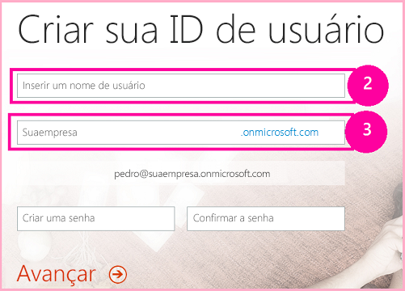
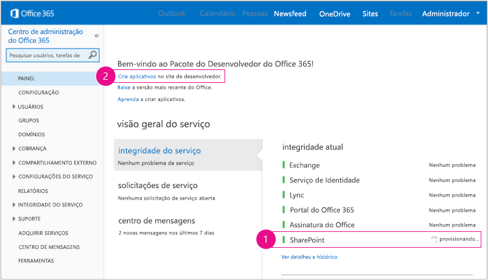
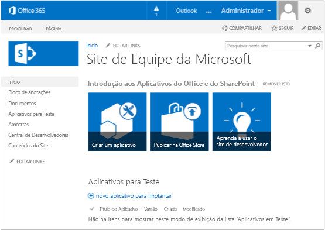

# Configurar um ambiente de desenvolvimento para suplementos do SharePoint no Office 365
Configurar um ambiente de desenvolvimento para Suplementos do SharePoint em um Site de Desenvolvedor do Office 365.
Leia  [Ferramentas e ambientes para o desenvolvimento de suplementos do SharePoint](tools-and-environments-for-developing-sharepoint-add-ins.md) para compreender as suas opções, antes de continuar com qualquer procedimento neste artigo. Confira [Suplementos do SharePoint](sharepoint-add-ins.md), caso não saiba que tipo de Suplementos do SharePoint deseja criar.
  
    
    

## Instalar o Visual Studio e as ferramentas no seu computador

- Se você ainda não tiver instalado o **Visual Studio** 2013 ou posterior, instale-o seguindo as instruções em [Install Visual Studio](http://msdn.microsoft.com/library/da049020-cfda-40d7-8ff4-7492772b620f.aspx). Recomendamos o uso da  [versão mais recente do Microsoft Download Center](https://www.visualstudio.com/downloads/download-visual-studio-vs).
    
  
- O Visual Studio inclui o **Microsoft Office Developer Tools for Visual Studio**, mas, às vezes, uma versão das ferramentas é lançada entre as atualizações do Visual Studio. Para verificar se você tem a versão mais recente das ferramentas, execute o [instalador do Microsoft Office Developer Tools para Visual Studio 2013](http://aka.ms/OfficeDevToolsForVS2013) ou o [instalador do Microsoft Office Developer Tools for Visual Studio 2015](http://aka.ms/OfficeDevToolsForVS2015). 
    
  

### Registro detalhado no Visual Studio

Siga estas etapas, se você deseja ativar o registro detalhado:
  
    
    

1. Abra o registro e navegue até o **HKEY_CURRENT_USER\\Software\\Microsoft\\VisualStudio\\ _nn.n_\\SharePointTools**, em que _nn.n_ é a versão do Visual Studio, como 12.0 ou 14.0.
    
  
2. Adicione uma chave DWORD nomeada **EnableDiagnostics**.
    
  
3. Forneça o valor **1** para a chave.
    
  
O caminho de registro será alterado em futuras versões do Visual Studio.
  
    
    

## Increva-se em um Office 365 Developer Site

> [!OBSERVAçãO]
>  É possível que você já tenha acesso a um Office 365 Developer Site:> **Você é um assinante do MSDN?** Assinantes do Visual Studio Enterprise com MSDN recebem uma Assinatura de Desenvolvedor do Office 365 como benefício. [Resgate seu benefício agora.](https://msdn.microsoft.com/subscriptions/manage/default.aspx)> **Você tem um dos planos de assinatura do Office 365 a seguir?**> **Se sim, um administrador da assinatura do Office 365 pode criar um Site do Desenvolvedor** usando o [centro de administração do Office 365](https://portal.microsoftonline.com/admin/default.aspx). Para saber mais, consulte  [Criar um site do desenvolvedor em uma assinatura existente do Office 365](create-a-developer-site-on-an-existing-office-365-subscription.md). 
  
    
    

Três formas de obter um plano do Office 365. 
  
    
    

- Inscreva-se em uma conta de desenvolvedor gratuita do Office 365 por um ano por meio do Office 365 Developer Program.  [Obter mais informações](http://dev.office.com/devprogram) ou vá direto para o [o formulário de inscrição](https://profile.microsoft.com/RegSysProfileCenter/wizardnp.aspx?wizid=14b845d0-938c-45af-b061-f798fbb4d170). Você receberá um email depois de se inscrever no programa para desenvolvedores com um link para inscrever-se na conta de desenvolvedor. Use as instruções abaixo.
    
  
- Comece com uma  [avaliação gratuita de 30 dias](https://portal.microsoftonline.com/Signup/MainSignUp.aspx?OfferId=6881A1CB-F4EB-4db3-9F18-388898DAF510&amp;DL=DEVELOPERPACK) com uma licença de usuário.
    
  
- Compre uma  [assinatura de desenvolvedor do Office 365](https://portal.microsoftonline.com/Signup/MainSignUp.aspx?OfferId=C69E7747-2566-4897-8CBA-B998ED3BAB88&amp;DL=DEVELOPERPACK). 
    
  

> [!DICA]
> Abra estes links em outra janela ou guia para manter as instruções a seguir acessíveis. 
  
    
    

**Figura 1. Nome de domínio do Site de Desenvolvedor do Office 365**

  
    
    

  
    
    

  
    
    

  
    
    

  
    
    

1. A primeira página (não mostrada) do formulário de inscrição é auto-explicativa. Basta fornecer as informações solicitadas e escolher **Avançar**.
    
  
2. Na segunda página, mostrada na Figura 1, especifique uma ID de usuário para o administrador da assinatura.
    
  
3. Crie um subdomínio do **.onmicrosoft.com**. 
    
    Depois de se inscrever, você deve usar as credenciais resultantes (no formato  _IDdeUsuário_@ _seudomínio_.onmicrosoft.com) para entrar no site de portal do Office 365 em que administra a sua conta. Seu Site de Desenvolvedor do SharePoint Online é provisionado no seu novo domínio: **http:// _seudomínio_.sharepoint.com**.
    
  
4. Escolha **Avançar** e preencha a última página do formulário. Se você optar por fornecer um número de telefone para obter um código de confirmação, é possível fornecer um número de celular ou de telefone fixo, mas *não*  um número VoIP (Voice over Internet Protocol).
    
  

    
> [!OBSERVAçãO]
> Se você estiver conectado a outra conta da Microsoft quando tentar se inscrever em uma conta de desenvolvedor, é possível que receba esta mensagem: "A ID de usuário que você inseriu não funcionou. Aparentemente, ela não é válida. Verifique se você inseriu a ID de usuário atribuída pela sua organização. Sua ID de usuário, geralmente, é similar a  *nome@exemplo.com*  ou *nome@exemplo.onmicrosoft.com*  ."> Se você receber essa mensagem, faça logoff da conta da Microsoft que estava usando e tente novamente. Se continuar recebendo a mensagem, limpe o cache do navegador ou alterne para a **Navegação InPrivate** e, em seguida, preencha o formulário.
  
    
    

Depois de concluir o processo de inscrição, o navegador abre a página de instalação do Office 365. Escolha o ícone de Administrador para abrir a página do centro de administração.
  
    
    

**Figura 2. Página do centro de administração do Office 365**

  
    
    

  
    
    

  
    
    

  
    
    

1. Aguarde até que o seu Site do Desenvolvedor conclua o provisionamento. Depois que o provisionamento for concluído, atualize a página do centro de administração do no seu navegador.
    
  
2. Em seguida, escolha o link **Criar suplementos** no canto superior esquerdo da página para abrir o Site do Desenvolvedor. Você deve visualizar um site semelhante ao mostrado na Figura 3. Há uma lista de **Suplementos em teste** na página. Isso confirma que o site foi criado com um modelo do Site do Desenvolvedor do SharePoint. Caso veja um site de equipe normal, aguarde alguns minutos e inicie seu site novamente.
    
  
3. Anote a URL do site. Ela é usada quando você cria Suplementos do SharePoint projetos no Visual Studio.
    
  

**Figura 3. Home page do seu Site do Desenvolvedor com a lista Suplementos em teste**

  
    
    

  
    
    

  
    
    

  
    
    

  
    
    

## Recursos adicionais

-  [Suplementos do SharePoint](sharepoint-add-ins.md)
    
  
-  [Introdução à criação de suplementos do SharePoint hospedados pelo provedor](get-started-creating-provider-hosted-sharepoint-add-ins.md)
    
  
-  [Introdução à criação de Suplementos do SharePoint hospedados no SharePoint](get-started-creating-sharepoint-hosted-sharepoint-add-ins.md)
    
  

  
    
    

