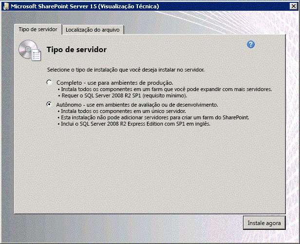

# Configurar um ambiente de desenvolvimento local para suplementos do SharePoint
Saiba como configurar um ambiente de desenvolvimento especificamente adequado ao desenvolvimento de Suplementos do SharePoint com uma instalação local do SharePoint.
## Instalar o sistema operacional para seu ambiente de desenvolvimento para Suplementos do SharePoint
<a name="bk_installOS"> </a>

Os requisitos para um ambiente de desenvolvimento são menos rigorosos e onerosos do que os requisitos para um ambiente de produção e as diretrizes descritas aqui não têm suporte para instalação em ambiente de produção. Confira  [Visão geral da instalação e configuração do SharePoint 2013](https://technet.microsoft.com/pt-br/library/ee667264%28v=office.15%29),  [Requisitos de hardware e software do SharePoint 2013](https://technet.microsoft.com/pt-br/library/cc262485%28v=office.15%29) e [Configurar um ambiente para suplementos do SharePoint](http://technet.microsoft.com/pt-br/library/fp161236%28office.15%29.aspx) para obter instruções sobre a configuração de uma instalação de ambiente de produção do SharePoint.
  
    
    
Em qualquer ambiente de desenvolvimento, você deverá usar um computador com uma CPU compatível com x64 e pelo menos 16 GB de RAM para instalar e executar o SharePoint; é preferível utilizar 24 GB de RAM.
  
    
    
Dependendo dos seus requisitos e do seu orçamento específicos, você poderá escolher uma destas opções:
  
    
    

- Instalar o SharePoint no Windows Server 2008 R2 Service Pack 1 x64 ou no Windows Server 2012.
    
  
- Use o Microsoft Hyper-V e instale o SharePoint em uma máquina virtual que esteja executando um sistema operacional convidado Windows Server 2008 R2 Service Pack 1 x64 ou Windows Server 2012. Consulte  [Usar as configurações de prática recomendada para máquinas virtuais do SharePoint 2013 e ambiente Hyper-V](http://technet.microsoft.com/pt-br/library/ff621103%28v=office.15%29.aspx) para obter orientação sobre a configuração de uma máquina virtual do Microsoft Hyper-V para o SharePoint.
    
  

> [!OBSERVAçãO]
> A instalação do SharePoint só tem suporte no Windows Server 2008 R2 Service Pack 1 x64 ou no Windows Server 2012. Caso pretenda desenvolver o Suplementos do SharePoint para o SharePoint, no Windows 7 ou no Windows 8, inscreva-se em um Site do Desenvolvedor do Office 365 e desenvolva suplementos remotamente. 
  
    
    


## Instalar os pré-requisitos para o sistema operacional e o SharePoint
<a name="bk_prereqsOS"> </a>


1. Execute a ferramenta PrerequisiteInstaller.exe que está incluída em seus arquivos de instalação.
    
  
2. Execute a ferramenta Setup.exe que está incluída em seus arquivos de instalação.
    
  
3. Aceite os Termos de Licença de Software da Microsoft.
    
  
4. Na página **Escolha a instalação desejada**, escolha **Autônoma**.
    
   **Figura 1. Opção de tipo de instalação**

  

     
  

  

  
5. Se ocorrer algum erro na instalação, examine o arquivo de log. Para localizar o arquivo de log, abra uma janela do Prompt de Comando e então digite os comandos a seguir no prompt de comando. Também será exibido um link para o arquivo de log quando a instalação for concluída.
    
  ```
  
cd %temp%
dir /od *.log
  ```

6. Após a conclusão da instalação, será solicitado que você inicie o Assistente de Configuração de Produtos e Tecnologias do SharePoint.
    
    > [!OBSERVAçãO]
      > O Assistente de Configuração de Produtos e Tecnologias do SharePoint poderá falhar se você estiver usando um computador que tenha ingressado em um domínio mas que não esteja conectado a um controlador de domínio. Caso você veja essa falha, conecte-se a um controlador de domínio diretamente ou por meio de uma conexão VPN (Rede Virtual Privada) ou entre com uma conta local com privilégios administrativos no computador. 
7. Após a conclusão do assistente de configuração, você verá a página **Seleção de Modelo** do novo site do SharePoint. Nessa página, escolha o modelo **Site do Desenvolvedor**. Você só poderá implantar Suplementos do SharePoint do Visual Studio para um Site do Desenvolvedor.
    
   **Figura 2. Escolher a página do modelo de site**

  

     
  

  

  

## Configurar serviços no SharePoint para uso de suplementos de servidor para servidor
<a name="Servertoserver"> </a>

Nesta etapa, você configura serviços no SharePoint para uso de suplementos de servidor para servidor. Essas etapas garantem que você vai poder criar suplementos hospedados pelo provedor de alta confiança. Confira  [Criar o SharePoint de alta confiança Add-ins](create-high-trust-sharepoint-add-ins.md) para saber mais sobre a criação desse tipo de suplemento.
  
    
    

1. Verifique se o Serviço de Gerenciamento de Aplicativos e o Aplicativo de Perfil de Usuário estão configurados. (Este recurso se chama "Serviço de Gerenciamento de Aplicativos" porque o Suplementos do SharePoint era originalmente chamado de "aplicativos do SharePoint".) As etapas são as seguintes:
    
1. Na **Administração Central**, em **Gerenciamento de Aplicativos**, selecione **Gerenciar aplicativos de serviço**.
    
  
2. Na página **Aplicativos de Serviço**, verifique se os seguintes serviços foram iniciados:
    
  - Aplicativo de Serviço de Perfil de Usuário
    
  
  - Serviço de Gerenciamento de Aplicativos
    
  
3. Em **Gerenciamento de Aplicativos**, selecione **Gerenciar serviços no servidor**. 
    
  
4. Na página **Serviços no Servidor**, verifique se os seguintes serviços foram iniciados:
    
  - Serviço de Perfil de Usuário 
    
  
2. Verifique se pelo menos um perfil foi criado no **Aplicativo de Serviço de Perfil de Usuário**. As etapas são as seguintes:
    
1. Na **Administração Central**, em **Gerenciamento de Aplicativos**, selecione **Gerenciar aplicativos de serviço**.
    
  
2. Em seguida, selecione **Aplicativo de Serviço de Perfil de Usuário**.
    
  
3. Na página **Gerenciar Serviço de Perfil: Aplicativo de Serviço de Perfil de Usuário**, em **Pessoas**, selecione **Gerenciar Perfis de Usuário**.
    
  
4. Na página **Gerenciar Perfis de Usuário**, selecione **Novos Perfis**.
    
  
5. Na página **Adicionar Perfil de Usuário**, digite seu nome de conta e seu endereço de email.
    
  
6. Selecione **Salvar e Fechar**.
    
    > [!OBSERVAçãO]
      > Se você obtiver uma mensagem dizendo que o perfil que você está tentando criar já existe, selecione **Cancelar e Voltar**. 
7. Novamente na página **Gerenciar Perfis de Usuário**, você deverá ver **Número total de perfis: 1**.
    
  

## Instalar o Visual Studio e o Office Developer Tools for Visual Studio
<a name="SP15Appdevonprem_bk_installVS"> </a>


- Se você ainda não tiver instalado o **Visual Studio** 2013 ou posterior, instale-o seguindo as isntruções em [Install Visual Studio](http://msdn.microsoft.com/library/da049020-cfda-40d7-8ff4-7492772b620f.aspx). Recomendamos o uso da  [versão mais recente do Microsoft Download Center](https://www.visualstudio.com/downloads/download-visual-studio-vs).
    
  
- O Visual Studio inclui o **Microsoft Office Developer Tools for Visual Studio**, mas, às vezes, uma versão das ferramentas é lançada entre as atualizações do Visual Studio. Para verificar se você tem a versão mais recente das ferramentas, execute o [instalador do Microsoft Office Developer Tools para Visual Studio 2013](http://aka.ms/OfficeDevToolsForVS2013) ou o [instalador do Microsoft Office Developer Tools para Visual Studio 2015](http://aka.ms/OfficeDevToolsForVS2015).
    
  

### Registro detalhado no Visual Studio

Siga estas etapas se quiser ativar o registro extenso:
  
    
    

1. Abrir o registro e navegue até **HKEY_CURRENT_USER\\Software\\Microsoft\\VisualStudio\\ _nn.n_\\SharePointTools**, em que _nn.n_ é a versão do Visual Studio, como 12.0 or 14.0.
    
  
2. Adicione uma chave DWORD chamada **EnableDiagnostics**.
    
  
3. Atribua à chave o valor **1**.
    
  
O caminho do registro mudará em versões futuras do Visual Studio
  
    
    

## Configurar um domínio do suplemento isolado no SharePoint
<a name="SP15appdevonprem_bk_configure"> </a>

Leia  [Host webs, suplemento webs e o domínio isolado](host-webs-add-in-webs-and-sharepoint-components-in-sharepoint-2013.md#IsolatedDomain) antes de continuar com qualquer procedimento nesta seção.
  
    
    
Você deve criar um domínio isolado no farm de teste do SharePoint. Além disso, a instalação do SharePoint exige um um domínio de cabeçalho de host curinga geral onde ele pode provisionar suplementos hospedados pelo SharePoint.
  
    
    
Para fins de desenvolvimento, você pode modificar seu arquivo de hosts à medida que for necessário rotear seu computador de desenvolvimento para a instância de teste em um Suplemento do SharePoint. O Visual Studio modifica seu arquivo de hosts automaticamente quando você cria e implanta o suplemento. 
  
    
    

> [!OBSERVAçãO]
> Para a produção de farms, você deve criar uma estratégia de roteamento de DNS em sua intranet e, opcionalmente, configurar o seu firewall. Confira  [Instalar e gerenciar suplementos do SharePoint](https://technet.microsoft.com/pt-br/library/fp161232%28v=office.15%29) para saber mais sobre como criar e configurar um ambiente de produção para Suplementos do SharePoint.
  
    
    

Execute as etapas no procedimento a seguir para criar um domínio do suplemento isolado.
  
    
    

> [!OBSERVAçãO]
> Você deve executar todas as etapas no procedimento a seguir enquanto estiver conectado como o administrador de farm e deve executar o prompt de comando e o Shell de Gerenciamento do SharePoint como um administrador. 
  
    
    


### Criar um domínio do suplemento isolado em seu computador de desenvolvimento


1. Garanta que os serviços spadmin e sptimer estejam em execução abrindo um prompt de comando e digitando os comandos a seguir.
    
  ```
  
net start spadminv4
net start sptimerv4
  ```

2. Crie seu domínio do suplemento isolado executando o Shell de Gerenciamento do SharePoint como um administrador e digitando o seguinte comando. Substitua  _contosoaddins.com_ por seu domínio de suplementos. Ele *não*  deve ser um subdomínio do domínio do SharePoint do host. Se fizer isso, vai anular muitas das vantagens de segurança de ter domínios de suplementos isolados. Por exemplo, se o domínio de host for contoso.com, não use addins.contoso.com como o domínio de suplementos.
    
  ```
  
Set-SPAppDomain "contosoaddins.com"
  ```

3. Verifique se os serviços SPSubscriptionSettingsService e AppManagementServiceInstance estão em execução digitando o comando a seguir no Shell de Gerenciamento do SharePoint.
    
  ```
  Get-SPServiceInstance | where{$_.GetType().Name -eq "AppManagementServiceInstance" -or $_.GetType().Name -eq "SPSubscriptionSettingsServiceInstance"} | Start-SPServiceInstance
  ```

4. Verifique se os serviços SPSubscriptionSettingsService e AppManagementServiceInstance estão em execução digitando o comando a seguir no Shell de Gerenciamento do SharePoint. A saída indicará se cada serviço está online.
    
  ```
  Get-SPServiceInstance | where{$_.GetType().Name -eq "AppManagementServiceInstance" -or $_.GetType().Name -eq "SPSubscriptionSettingsServiceInstance"}
  ```

5. Você deve especificar uma conta sob a qual as instâncias de serviço SPSubscriptionService e AppManagementServiceInstance serão executadas. Essa conta deverá ser uma SPManagedAccount. É possível criar uma SPManagedAccount digitando o comando a seguir no Shell de Gerenciamento do SharePoint (serão solicitados conta de domínio\\usuário e senha).
    
  ```
  $account = New-SPManagedAccount
  ```

6. Especifique uma conta, um pool de aplicativos e configurações de banco de dados para os serviços SPSubscriptionService e AppManagementServiceInstance digitando o código a seguir no Shell de Gerenciamento do SharePoint. Caso você tenha criado uma SPManagedAccount na etapa anterior, use o nome dessa conta aqui.
    
  ```
  $account = Get-SPManagedAccount "domain\\user"
$appPoolSubSvc = New-SPServiceApplicationPool -Name SettingsServiceAppPool -Account $account
$appPoolAppSvc = New-SPServiceApplicationPool -Name AppServiceAppPool -Account $account
$appSubSvc = New-SPSubscriptionSettingsServiceApplication -ApplicationPool $appPoolSubSvc -Name SettingsServiceApp -DatabaseName SettingsServiceDB 
$proxySubSvc = New-SPSubscriptionSettingsServiceApplicationProxy -ServiceApplication $appSubSvc
$appAppSvc = New-SPAppManagementServiceApplication -ApplicationPool $appPoolAppSvc -Name AppServiceApp -DatabaseName AppServiceDB
$proxyAppSvc = New-SPAppManagementServiceApplicationProxy -ServiceApplication $appAppSvc

  ```

7. Especifique o prefixo do seu suplemento (confira  [Host webs, suplemento webs e o domínio isolado](host-webs-add-in-webs-and-sharepoint-components-in-sharepoint-2013.md#IsolatedDomain)) ao digitar o seguinte código no Shell de Gerenciamento do SharePoint.
    
  ```
  
Set-SPAppSiteSubscriptionName -Name "add-in" -Confirm:$false
  ```

 ** Realize o procedimento a seguir apenas se o seu ambiente usa um servidor proxy.** Depois de criar seu domínio do suplemento isolado, execute as etapas no procedimento a seguir para adicionar o domínio à sua lista de omissões no Internet Explorer. Isso garante que você possa navegar até esse domínio, depois de implantar um suplemento hospedado no SharePoint ou um suplemento hospedado pelo provedor, que inclui um suplemento da Web.
  
    
    

### Adicionar seu domínio do suplemento isolado à lista de omissões no Internet Explorer


1. No Internet Explorer, vá para **Ferramentas**.
    
  
2. Escolha **Opções da Internet**.
    
  
3. Na guia **Conexões**, escolha o botão **Configurações da LAN**.
    
  
4. Desmarque a caixa de seleção **Detectar automaticamente as configurações**.
    
  
5. Marque a caixa de seleção **Usar um servidor de proxy para sua LAN**.
    
  
6. Escolha o botão **Avançado** e adicione*.SeuDominiodoSuplemento.com à lista **Exceções**.
    
  
7. Escolha o botão **OK**.
    
  
8. Escolha o botão **OK** para fechar a caixa de diálogo **Configurações da Rede Local (LAN)**.
    
  
9. Escolha o botão **OK** para fechar a caixa de diálogo **Opções da Internet**.
    
  
Confira  [Implantando e instalando os suplementos do SharePoint: métodos e opções](deploying-and-installing-sharepoint-add-ins-methods-and-options.md) para saber mais sobre suas opções de implantação de suplementos.
  
    
    

> [!DICA]
> Depois de implantar um suplemento hospedado no SharePoint em sua instalação, talvez seja solicitado que você faça logon com suas credenciais ao tentar iniciá-lo. Será necessário desabilitar a verificação de loopback para livrar-se desses avisos. Consulte  [Você recebe o erro 401.1 quando navega em um site que usa a Autenticação Integrada e que está hospedado no IIS 5.1 ou em uma versão mais recente](http://support.microsoft.com/pt-br/kb/896861) para obter instruções sobre como desabilitar a verificação de loopback.
  
    
    


## Recursos adicionais
<a name="SP15SetupSPO365_bk_addlresources"> </a>


-  [Suplementos do SharePoint](sharepoint-add-ins.md)
    
  
-  [Introdução à criação de suplementos do SharePoint hospedados pelo provedor](get-started-creating-provider-hosted-sharepoint-add-ins.md)
    
  
-  [Introdução à criação de Suplementos do SharePoint hospedados no SharePoint](get-started-creating-sharepoint-hosted-sharepoint-add-ins.md)
    
  

  
    
    

