# Diretrizes de design UX de suplementos do SharePoint
Saiba mais sobre a experiência do usuário geral diretrizes de design (UX) para suplementos no SharePoint 2013, incluindo escolhendo o chrome, usando CSS, gerenciamento de licenças de usuário e outras tarefas de design.
Suplementos são um novo conceito para SharePoint 2013, permitindo que os usuários finais adicionar nova funcionalidade aos seus sites garantindo ainda confiabilidade do site do SharePoint em si. Criação de um suplemento boa requer não apenas fazendo funcionalidade ótima (embora o que é importante óbvios), mas também garantir que o suplemento estiver correto e se adapta perfeitamente o site onde ele está instalado.
  
    
    


## Escolhendo o chrome para seu suplemento
<a name="UXGuide_AppChrome"> </a>

A primeira coisa que você precisa determinar quando você estiver criando um suplemento está quanto ou pouca você deseja suas páginas de marca e onde deseja que eles sejam hospedados. Dependendo dessas opções, qual tecnologia que você usa para o chrome de energia será relativamente óbvia:
  
    
    

- **ASPX páginas hospedado no SharePoint:** Use o modelo de suplemento.
    
  
- **Páginas HTML hospedadas no SharePoint ou em qualquer uma das páginas fora do SharePoint:** Use o controle de chrome.
    
  
- **Páginas da marca personalizada:** Use seu próprio chrome.
    
  

### Usando o modelo de suplemento para páginas hospedado no SharePoint
<a name="UXGuide_AppTemplate"> </a>

O modelo de suplemento pode ser usado somente para páginas ASPX hospedado no SharePoint. O modelo inclui a página mestra de **app.master** (que contém o chrome apropriado para um suplemento e destina-se ao tema com o site do host), e ele oculta algumas funcionalidades do SharePoint que não funcionaria ou não fazem sentido dentro de uma web suplemento. Figura 1 mostra uma página hospedado no SharePoint que usa o modelo de suplemento.
  
    
    

**Figura 1. Página hospedado no SharePoint usando o modelo de suplemento**

  
    
    

  
    
    
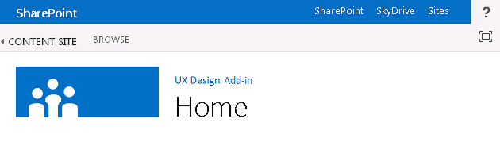
  
    
    
O modelo de suplemento é o padrão no Visual Studio quando você cria um web suplemento e páginas na web.
  
    
    

### Usando o controle de chrome em Suplementos do SharePoint
<a name="UXGuide_ChromeControl"> </a>

Se você não estiver criando páginas ASPX hospedado no SharePoint, mas você ainda quer o add-in para ajustá-la naturalmente com o site de host que ele é usado, o controle de chrome é a escolha certa. Figura 2 mostra o controle do chrome.
  
    
    

**Figura 2. Controle de Chrome em uma página da Web**

  
    
    

  
    
    

  
    
    

  
    
    

**Assista ao vídeo: controle de chrome do SharePoint 2013**

  
    
    

  
    
    

  
    
    

  
    
    

  
    
    

  
    
    

### Usar o controle de Cromado


1. Adicione uma referência para a biblioteca de controles. Há duas maneiras de fazer isso:
    
  - Aponte para a biblioteca na raiz da pasta layouts, conforme mostrado no exemplo a seguir.
    
  ```
  
<script
    type="text/javascript" 
    src="http://{server URL}/_layouts/15/sp.ui.controls.js">
</script>
  ```

  - Copie a biblioteca para seu próprio site e fazer referência a ela a partir daí.
    
    > **CUIDADO**
      > Se você optar por essa alternativa seu suplemento será não beneficiar atualizações para o controle.
2. Adicione o elemento de DOM de espaço reservado onde o controle será processado, conforme mostrado neste exemplo.
    
  ```
  
<div id='chromeControlContainer'></div>
  ```

3. Criar uma instância do controle.
    
  ```
  function addchromecontrol(){
    var options = {};
    options.siteTitle ="{host site title}";
    options.siteUrl = "{host URL}";
    options.appHelpPageUrl = "{help page URL}";
    options.appIconUrl = "{app icon URL}";
    options.appTitle = "add-in Title";
    nav = new SP.UI.Controls.Navigation("chromeControlContainer", options);
    nav.setVisible(true);
}
  ```

4. (Opcional) Se você não quiser ter a área de título na sua página, você pode removê-lo, execute o seguinte código de JavaScript.
    
  ```
  
nav.setBottomHeaderVisible(false);
  ```

O controle de chrome fornece para dois opcionais suplemento ícones: uma na barra de navegação superior e uma na área de título. O ícone de suplemento na barra de navegação superior é 24 x 24 pixels (px) e o ícone na área de título é do mesmo tamanho que ícones de site do SharePoint — até 64 px alta por até 180 px longa. Recomendamos que você use uma imagem PNG que você tenha testado nos planos de fundo brancos, pretos, cinzas, brilhantes e mudo porque usuários e administradores podem alterar o tema do site. Para obter mais informações sobre como usar o controle de chrome, consulte  [Use o controle de cromo do cliente no SharePoint Add-ins](use-the-client-chrome-control-in-sharepoint-add-ins.md).
  
    
    

### Criar um personalizado com marca a interface do usuário em Suplementos do SharePoint
<a name="UXGuide_CustomUI"> </a>

Se, em vez de alinhamento para o host tema do site e o ajuste para o site do SharePoint onde seu suplemento está instalado, você quiser usar sua própria marca dentro de seu suplemento, você terá que construir sua chrome do zero. No entanto, você ainda deve ter um link "Voltar ao site" no canto superior esquerdo da página (superior direito em idiomas de [RTL] da direita para a esquerda) que redireciona o usuário para o local onde o suplemento está instalado.
  
    
    

## Usando a web host CSS em Suplementos do SharePoint
<a name="UXGuide_CSS"> </a>

Usando os mesmos estilos que são usados na web host, você pode garantir que seus suplementos permanecerá consistentes com o site do SharePoint que eles vêm. Os estilos reais podem alterar com base no design do site, mas referenciando o arquivo CSS da web host, você saberá que seu suplemento cabe na independentemente de onde ele está instalado.
  
    
    
Para obter os estilos CSS da web host, você precisa fazer referência a seu arquivo CSS. Você pode fazer isso de várias maneiras diferentes.
  
    
    

### Para fazer referência CSS arquivo da web host


1. Se você estiver usando o modelo de suplemento ou controle de suplemento chrome, isso é feita automaticamente para você.
    
  
2. Se você estiver dentro da web suplemento, você pode usar os controles **CssRegistration** e **CssLink** para referenciar o arquivo CSS colocando o código a seguir em sua página mestra ou a página ASPX:
    
  ```HTML
  <SharePoint:CssRegistration runat="server" name="default" />
<SharePoint:CssLink runat="server />

  ```

3. Você pode usar um elemento < link > para referenciar o arquivo CSS criando uma URL de host de URL da web, conforme mostrado neste exemplo.
    
  ```HTML
  
<link rel="stylesheet" href="{host web URL}/_layouts/15/defaultcss.ashx" />
  ```


    Se você usar essa abordagem, você precisa executar JavaScript na página para obter o host URL da web desativar a cadeia de caracteres de consulta. Em seguida, você pode inserir URL da web host no elemento **link** antes de gravar o elemento DOM. da página
    
  
A primeira coisa a fazer quando você estiver estilo seu suplemento é usar HTML semântica tanto quanto possível. Isso significa que usando **H1**, **H2**, **H3**e assim por diante, para vários títulos e marcas de entrada para botões. Você também deve tentar usar estilos de núcleo do SharePoint tanto quanto possíveis para que quando o tema do site do host muda, seu suplemento seleciona essas alterações diretamente e automaticamente. As tabelas a seguir mostram como os estilos são usados no tema padrão.
  
    
    

**Tabela 1. Estilos de texto de corpo**


|**Exemplo**|**Usado para**|**Style**|
|:-----|:-----|:-----|
||Texto de corpo extra grandes <br/> |.MS-textXLarge <br/> |
|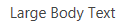|Texto de corpo grande <br/> |ms-textlarge <br/> |
||Corpo de texto normal <br/> |Herdadas automaticamente <br/> |
||Texto de corpo pequenas <br/> |ms-textsmall <br/> |
||Texto de metadados <br/> |ms-metadata <br/> |
   

**Tabela 2. Estilos de título e o cabeçalho**


|**Exemplo**|**Usado para**|**Style**|
|:-----|:-----|:-----|
||Título principal na página <br/> |ms-core-pagetitle <br/> |
|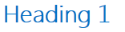|Título de caixas de diálogo, formulários, blogs e postagens de discussão. É um título de "principal" alternativo para tipos de conteúdo especiais ou suplementos que ocupam a pagethat inteira que você deseja ser diferente de uma página de Web Parts ou wiki regular. <br/> |H1 <br/> |
||Título secundário em relação H1. Por exemplo, comunidades usa H1 ênfase para o título de uma postagem e ênfase H2 para o melhor "resposta" à postagem. <br/> |H2 <br/> |
||Geralmente é um subtítulo em H2. <br/> |H3 <br/> |
||Subtítulos sob H3. <br/> |H4 <br/> |
||Título do principal/principal Web Part em uma página, ou cabeçalhos de seção principal. <br/> |ms-webpart-titletext <br/> |
||Título para títulos dentro de caixas de diálogo ou textos explicativos. <br/> |ms-dlg-heading <br/> |
   

**Tabela 3. Estilos de navegação**


|**Exemplo**|**Usado para**|**Style**|
|:-----|:-----|:-----|
|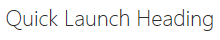|Título da barra de navegação à esquerda. <br/> |.MS-core-listMenu-verticalBox >.ms core-listMenu-raiz > li >.ms core-listMenu-item <br/> |
||Link na barra de navegação à esquerda. <br/> |.MS-core-listMenu-verticalBox <br/> |
||Item selecionado na barra de navegação à esquerda. <br/> |.MS-core-listMenu-verticalBox +.ms-accentText <br/> |
|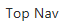|Item na barra de navegação superior. <br/> ||
||Item selecionado na barra de navegação superior. <br/> ||
   

**Tabela 4. Comando estilos**


|**Exemplo**|**Usado para**|**Style**|
|:-----|:-----|:-----|
|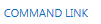|Links de ação principal esperada do usuário dentro de um determinado recipiente ou página. Por exemplo, isso seria usado para os comandos sob um texto explicativo de estilo. Esse sempre será a mesma cor para comandos visitados e não visitados. <br/> |ms-commandlink <br/> |
|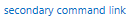|Também usado para links de ação de estilos, mas para ações que estão secundárias ao conteúdo. Esse estilo é usado para essas ações secundárias, para que eles não competem com conteúdo de atenção. <br/> |ms-secondarycommandlink <br/> |
||Links no texto explicativo. <br/> |ms-calloutlink <br/> |
   

**Tabela 5. Estilos de modificadora**


|**Exemplo**|**Usado para**|**Style**|
|:-----|:-----|:-----|
||Classe auxiliar que fornecerá a cor de destaque do tema atual para texto. <br/> |ms-accenttext <br/> |
||Links no conteúdo deve herdar de comportamento e estilo de hiperlink padrão. Estilo de hiperlink aplica uma cor e um efeito de foco para indicar que se trata de um link em vez de texto normal. <br/> |Herdada do usando < uma >. <br/> |
|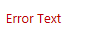|Mensagens de erro que ocorrem em formulários. <br/> |ms-error <br/> |
||Classe auxiliar que fornece um cinza suaves para texto que deve ser menor enfatizado de corpo de texto normal. <br/> |ms-soften <br/> |
||Classe auxiliar que se aplica a cor "desativada" para texto, que é usado para indicando estados desativados. <br/> |ms-disabled <br/> |
||Classe auxiliar que transforma o texto em letras maiúsculas. <br/> |ms-uppercase <br/> |
||Classe auxiliar para o estilo do texto como formulários. <br/> |ms-helper <br/> |
||Tracejado divisor de linha que é usado para dividir seções no início rápido e nos menus. <br/> |hr <br/> |
   

**Tabela 6. Estilos de interface de usuário de parte**


|**Exemplo**|**Usado para**|**Style**|
|:-----|:-----|:-----|
||Texto principal embutido na parte superior de uma parte. <br/> |.MS-textXLarge + suavização.ms <br/> |
||Comandos na linha superior de uma parte; no máximo deve haver apenas um ou dois por parte. <br/> |ms-herocommandlink <br/> |
|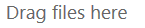|Texto mostrado para atraia o usuário para interagir com a parte quando ele não contém dados. <br/> |ms-attractmode <br/> |
||Texto mostrado ao usuário quando não há nenhum dado disponível. <br/> |ms-emptymode <br/> |
||Controles de modo de exibição, como uma tabela dinâmica. <br/> |mspivotlink <br/> |
|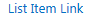|Itens de lista que também são links. <br/> |ms-listlink <br/> |
   

**Tabela 7. Estilos de plano de fundo e borda**


|**Exemplo**|**Usado para**|**Style**|
|:-----|:-----|:-----|
||Para alterar o estilo de um retângulo que deve ser enfatizado muito na página. <br/> |ms-emphasis <br/> |
||Borda de um elemento enfatizada. <br/> |ms-emphasisborder <br/> |
||Uma ênfase mais sutil de um elemento. <br/> |ms-subtleemphasis <br/> |
||Comandos em um elemento estilizado com ms-subtleEmphasis. <br/> |ms-subtleemphasiscommand <br/> |
||Comando desabilitado em um elemento estilizado com ms-subtleEmphasis. <br/> |ms-subtleemphasiscommand-disabled <br/> |
||Elementos de navegação do lado. <br/> |ms-sidenav <br/> |
|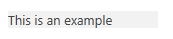|Para alterar o estilo do elemento de navegação lado selecionado. <br/> |ms-sidenav-selected <br/> |
||Para enfatizar um elemento usando uma borda. <br/> |ms-lines <br/> |
||Para enfatizar um elemento usando uma borda sutil. <br/> |ms-subtlelines <br/> |
||Para enfatizar um elemento usando uma borda colorida ou forte. <br/> |ms-stronglines <br/> |
||Para enfatizar um elemento desabilitado usando uma borda. <br/> |ms-disabledlines <br/> |
||Para enfatizar um elemento usando uma borda de ênfase. <br/> |ms-accentlines <br/> |
|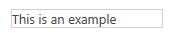|Para conter janelas pop-up. <br/> |ms-popupborder <br/> |
|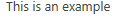|Para aplicar uma sobreposição no elemento de plano de fundo. <br/> |ms-bgoverlay <br/> |
|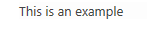|Para tornar o plano de fundo de um elemento aparecem desabilitadas. <br/> |.MS-bgDisabled <br/> |
|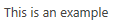|Para aplicar a cor de fundo do cabeçalho. <br/> |ms-bgheader <br/> |
||Para aplicar a cor de fundo do rodapé. <br/> |ms-bgfooter <br/> |
||Elementos que devem ter uma cor realçada ao focalizar. O exemplo mostra o elemento quando o mouse não é passar o mouse sobre ele. <br/> |.MS-bgHoverable <br/> |
|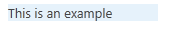|Elementos que devem ter uma cor realçada ao focalizar. O exemplo mostra o elemento quando o mouse é passar o mouse sobre ele. <br/> |.MS-bgHoverable <br/> |
||Para mostrar a seleção em um elemento. <br/> |ms-bgselected <br/> |
||Elementos na barra superior da página. <br/> |ms-topbar <br/> |
   
Para obter mais informações, consulte  [Use a folha de estilos de um site SharePoint no SharePoint Add-ins](use-a-sharepoint-website-s-style-sheet-in-sharepoint-add-ins.md).
  
    
    

## Itens comuns de estilos consistentemente em Suplementos do SharePoint
<a name="UXGuide_Styling"> </a>

Para ajudar os usuários a aprender habilidades que traduzem entre o SharePoint e suplementos, você deve estilo consistentemente muitos elementos em comum.
  
    
    

### Navegação interna

Para fornecer a navegação em seu suplemento, há dois principais padrões para acompanhar: a esquerda de navegação e navegação superior. Qual opção você usar depende de um pouco sobre o que o conteúdo é o restante do seu suplemento. Em geral, esquerdo será a escolha correta, especialmente se você está mudando entre listas diferentes, ou o foco do seu suplemento for um modo de exibição de detalhes mestre. Por outro lado, se sua navegação principalmente alternar entre o que poderia ser considerado diferentes modos de exibição da mesma lista, você pode escolher usar a navegação superior, em vez disso.
  
    
    
Navegação à esquerda e navegação superior tem representações de modelo de objeto que vai ser estilizadas corretamente quando elas são definidas no SharePoint. Fora páginas do SharePoint, você terá um pouco mais trabalho para criar a marcação de navegação à esquerda ou superior por conta própria e adicione as classes CSS apropriadas para que fique estilizado corretamente.
  
    
    

### Toolbars

Em muitos casos, você terá um pequeno número de comandos que você deseja expor rapidamente para o usuário. Se você já estiver usando a faixa de opções na sua página, a melhor opção é adicionar esses comandos a lógicas locais dentro da faixa de opções existente. No entanto, no caso onde você ainda não tiver uma faixa de opções na página, provavelmente não faz sentido para adicionar uma para alguns comandos. Nesse caso, recomendamos que você adicionar uma barra de ferramentas contextual para o item onde os comandos serão aplicada. Você deve usar um dos glifo, estilo de texto com ms-commandLink ou ambas, para representar seus comandos na barra de ferramentas que devem ter a mesma cor de plano de fundo que o restante da página.
  
    
    

### Listas

Listas são uma maneira comum para representar os dados aos usuários. Se o suplemento estiver usando páginas do SharePoint, você pode usar a Web Part de exibição de lista para representar os dados aos usuários e obter o estilo e a interação que vem com ele. No entanto, se você tiver suas páginas em outro lugar, ou se desejar mais controle sobre a interação que os usuários têm com a sua lista, você deve imitar o estilo de listas no SharePoint, fornecendo seu próprio processamento e interação. A seguir estão alguns problemas de estilo a serem lembrados quando você estiver usando listas no seu suplemento:
  
    
    

- **Modos de exibição:** Quando que representa vários modos de exibição em uma única lista, você deve usar uma tabela dinâmica na parte superior da lista, como regulares listas do SharePoint. Você nunca deve usar tabelas dinâmicas como uma forma de representando dados de detalhe-mestre.
    
  
- **Filtros:** Ao fornecer um filtro em uma lista existente ou uma disposição de detalhes mestre, você deve usar uma barra lateral que está alinhado com o lado esquerdo da área de conteúdo e que está pelo menos 300 pixels ampla. Você também deve copiar o estilo de seleção do SharePoint para indicar ao usuário que filtros ou itens está selecionado.
    
  
- **Formulários:** Quando um usuário está exibindo ou editando um único item, você deve usar os formulários do SharePoint internos ou simular seus estilos para uma experiência consistente.
    
  

### Formulários, caixas de diálogo e textos explicativos

Há três padrões de para fornecer ao usuário com mais informações sobre um objeto ou para fornecer uma interface de usuário (UI) para entrada do usuário: formulários de página inteira, caixas de diálogo e textos explicativos. Qualquer um que você usa depende da intenção de usuário e quantas informações serão mostradas ou solicitadas.
  
    
    

- **Formulários de página inteira:** Esta é a melhor opção quando desejar que os usuários insiram várias partes diferentes de informações ou deseja mostrá-las muitas informações estruturadas de uma só vez. Formulários de página inteira também fazem mais sentido em cenários onde os modelos de interação mais complexos, como a faixa de opções, são necessários. Nesse caso, aponte o usuário para a página de formulário quando necessário. Você deve certificar-se de que há uma maneira clara de salvar ou cancelar suas alterações, usando os botões ou a faixa de opções. Em formulários muito longos que requerem a rolagem, ela é uma boa ideia para colocar as opções de **Salvar** e **Cancelar** na parte superior e a parte inferior do formulário.
    
  
- **Caixas de diálogo:** Estas são modais contêineres de interface do usuário que normalmente são usados para mostrar mais informações ou ações de maneira contextual. Eles também são usados para mais curta formulários ou entrada do usuário. Em geral, a interface do usuário que está hospedado dentro de uma caixa de diálogo deve ser simples e adequado para uma superfície de renderização menor. Mais formulários ou modelos de interação mais complexos, como a faixa de opções, são melhor servidos por formulários de página inteira, em vez disso.
    
  
- **Textos explicativos:** Eles fornecem informações contextuais relevantes e ações em torno de um item específico. Textos explicativos são geralmente usados para mostrar o usuário mais informações ou ações sobre um item em uma interface do usuário leve. Se as barras de rolagem ou entrada de usuário forem necessário, o texto explicativo provavelmente não é uma boa opção.
    
  

### Animação

Embora a animação pode levar a uma experiência mais vibrante e atraente, você deve estar cuidado para não sobrecarregá-la na sua interface do usuário. Animação que é feita também será mal perceptível pelo usuário, mas dará a impressão de interface de usuário mais rápida e melhor desempenho. Ao usar animação, você deverá garantir respeita conceitos como física e inércia e fornecer a interface do usuário que parece natural e normal. É altamente recomendável contra exageradas animações, como excessivo saltando ou elasticidade ou ter objetos voar pela tela na ação do usuário menor. Objetos geralmente devem tomar um caminho direto para seu destino e muitas vezes precisará somente o primeiro ou último 10 por cento a alteração real seja animada para dar ao usuário sentido de que ela é movida.
  
    
    

### Guias e tabelas dinâmicas

No SharePoint, o único lugar onde você deve usar guias está na faixa de opções. Todos os lugares em mais no SharePoint devem usar tabelas dinâmicas para expressar o conceito de alterando a área de conteúdo.
  
    
    

## Estrutura de interface do usuário do Office com o SharePoint suplementos perguntas Frequentes
<a name="Fabric"> </a>

Use essas perguntas Frequentes para entender como usar a estrutura de interface do usuário do Office e tornar sua Suplemento do SharePoint aparência com o restante do Office 365.
  
    
    
 **1. qual é a estrutura de interface do usuário do Office?**
  
    
    
Estrutura de interface do usuário do Office é uma estrutura de front-end, responde primeiro mobile que permite que você crie experiências da web usando a linguagem de Design do Office. Ele é implementado com um conjunto de fontes e classes CSS que fornecem componentes de interface do usuário, ícones, animação e a paleta de cores oficial do Office. Para obter detalhes, consulte  [Tecidos de interface do usuário do Office](https://github.com/OfficeDev/Office-UI-Fabric).
  
    
    
 **2. Posso usar a estrutura de interface do usuário do Office no meu SharePoint suplementos?**
  
    
    
Sim. Suas páginas de suplemento podem fazer referência os arquivos de estrutura de interface do usuário do Office da mesma forma que outras estruturas CSS, como inicialização, referenciadas.
  
    
    
 **3. Quando devo usar estrutura de interface do usuário do Office com o SharePoint suplementos?**
  
    
    
Usá-lo quando quiser que seu suplemento ter a aparência do Office 365. É uma alternativa para usar o arquivo CSS da web host do SharePoint.
  
    
    
 **4. como pode tecidos de interface do usuário do Office ser usado no SharePoint suplementos?**
  
    
    
Basta adicionar os arquivos de estrutura de interface do usuário do Office ao seu projeto de desenvolvimento e incluir uma referência para a biblioteca de fabric.css à sua página HTML ou ASPX. Para obter detalhes, consulte  [Introdução](https://github.com/OfficeDev/Office-UI-Fabric#get-started).
  
    
    
 **5. como pode componentes de estrutura de interface do usuário do Office ser usado no SharePoint suplementos?**
  
    
    
Basta adicione uma referência para a biblioteca de fabric.components.css à sua página HTML ou ASPX. Para obter detalhes, consulte  [Introdução](https://github.com/OfficeDev/Office-UI-Fabric/blob/master/ghdocs/GETTINGSTARTED.md).
  
    
    
 **6. Posso usar estrutura de interface do usuário do Office junto com web de host de um SharePoint Add-in CSS?**
  
    
    
No momento, é recomendável contra misturar tecidos de interface do usuário do Office com o host na web CSS. Isso é para evitar conflitos de nome de classe e incompatibilidades de estilo.
  
    
    
 **7. tecidos de interface do usuário do Office suporta temas do SharePoint?**
  
    
    
Não. Estrutura de interface do usuário do Office não oferece suporte a temas do SharePoint. No entanto, aplicando tecidos de interface do usuário do Office temas não entrarão em conflito com temas do SharePoint.
  
    
    

## Ampliar o SharePoint UI de suplementos
<a name="UXGuide_Extending"> </a>

SharePoint permite suplementos estender algumas da interface do usuário existente, que permite disponibilizar seu suplemento nos lugares onde os usuários podem precisar. Você pode estender o host da interface do usuário da web usando os seguintes métodos:
  
    
    

- **Suplemento partes:** Habilite a superfície de um elemento **iframe** para conter conteúdo de seu suplemento.
    
  
- **Ações personalizadas:** Você pode estender a faixa de opções ou o menu contextual por meio de ações personalizadas. Ações personalizadas Verifique seu suplemento disponível em documentos ou itens de lista, ou em qualquer outro lugar que na faixa de opções é mostrada.
    
  

### Adicionando o suplemento partes à web host

Partes são uma maneira para seu suplemento para superfície algumas informações ou uma pequena interação ponto na web host onde o suplemento está instalado. Usuários finais pode incorporar essas partes em suas páginas usando a estrutura de Web Part no SharePoint. Figura 3 mostra a parte de nuvem de marcas como exemplo de uma parte.
  
    
    

**Figura 3. Parte de nuvem de marcas**

  
    
    

  
    
    

  
    
    
Na Figura 3, na **Nuvem de marcas de suplemento do Design de UX** é o título da parte. A nuvem de marcas próprio é atendida do conteúdo do suplemento, e ele é hospedado em um elemento **iframe** e totalmente isolado na página de hospedagem. Como o conteúdo de suplemento está usando o arquivo CSS da web host, caiba no perfeitamente com a página de host.
  
    
    
Alguns tipos de interface do usuário emprestar próprios bem a sejam expostos por meio de parte da interface do usuário. Por exemplo, talvez você queira fornecer um conjunto de atalhos nas experiências diferentes do seu suplemento ou até mesmo um ponto de partida único que os usuários podem incorporar em outras páginas. Outro uso pode ser mostrar um pequeno subconjunto dos dados no suplemento ou mostrar as alterações mais recentes para algo. Talvez você queira fornecer uma zona interativa pequena para realizar ações rápidas com o suplemento sem precisar abri-lo para fazê-lo. Que tipo de peça que você fornecer será determinada pelos cenários seu suplemento oferece suporte. Você deve ter em mente que nem todos os suplementos terá partes, você deve fornecê-las somente se elas fazem sentido para a experiência do usuário.
  
    
    
A página exibida dentro da part será hospedada em um **iframe**, para que você deverá garantir que qualquer JavaScript que você escreve está ciente de que e é inteligente sobre como acessar coisas como o objeto de janela. Mesmo se o resto do seu suplemento muito é marcado, você deve considerar a adoção da web host estilo de sua parte, porque ele será incorporado em páginas da web host e ficará gritante e unappealing se ela não couber. Para poder usar o estilo da web host, você precisará criar o link para o arquivo CSS padrão manualmente. Para obter mais informações, consulte  [como: referenciar o arquivo CSS da web host](sharepoint-add-ins-ux-design-guidelines.md#UXGuide_CSSHowto) neste artigo. Também não deve haver qualquer chrome na página, porque ele será incorporado em uma página que já tem cromado em si.
  
    
    
A página tem que funcionar perfeitamente em um **iframe** em diferentes domínios, para tê que certificar-se de que você não especificar mesma origem somente para X-enquadramento-opções desta página. Por padrão, as páginas do SharePoint especificar que somente devem estar em um **iframe** dentro do mesmo domínio. Portanto para páginas que são hospedadas no SharePoint, você terá deixar de usar esse comportamento para as páginas que você deseja mostrar em partes, adicionando a **AllowFraming** Web Part em algum lugar na página, conforme mostrado no exemplo a seguir.
  
    
    


```
<WebPartPages:AllowFraming ID="AllowFraming1" runat="server" />
```

Porque você não pode impor que domínios as páginas estão iframed em, as páginas você hospedar no suplemento partes são vulnerável a um ataque de segurança clickjacking. No clickjacking ataques, páginas podem estar em um iframe em uma página mal-intencionado e os usuários podem ser levados a escolhendo botões para realizar ações que elas não são atento. Ao criar sua página, você deve estar ciente deste e verifique se que você não estiver expor qualquer funcionalidade na página para a parte que seria perigosa se reproduzidos em uma página mal-intencionado.
  
    
    
Embora os usuários podem definir manualmente um tamanho diferente de sua parte, você será capaz de definir um tamanho específico para a parte na definição da parte. Você também tem a capacidade de solicitar que a sua parte é redimensionada dinamicamente por meio de **postmessages**. Por padrão, é recomendável que os tamanhos de escolha de parte em incrementos de 30px (por exemplo, 150px ou 210px) para que quando partes de suplementos diferentes são combinados na mesma página, o usuário ainda conseguem acessar uma sensação que cada uma das partes foi criada para trabalhar no mesmo espaço. Se sua parte destina-se para simular uma peça do Introdução experiência, ele deve ter uma altura e largura do 150px. Se a parte destina-se a exibir em uma coluna lateral para mostrar os detalhes, ele deve ter uma largura de 300px.
  
    
    
Se sua parte exibe conteúdo dinâmico, é uma boa ideia para solicitar um redimensionamento para reduzir tendo scrollbars incorporado em uma página. O exemplo a seguir mostra como usar **postmessages** para redimensionar a parte:
  
    
    


```
window.parent.postMessage('<message senderId={your ID}>resize(120, 300)</message>', {hostweburl});
```

No exemplo acima, o valor de **senderId** será definido na seqüência de consulta da página automaticamente pelo código do suplemento parte quando a página é processada. Sua página precisaria apenas ler o valor de **SenderId** de seqüência de consulta e usá-lo ao solicitar um redimensionamento. Você pode recuperar a URL do host da cadeia de consulta anexando os tokens **StandardTokens** ou **HostUrl** para o atributo **Src** em sua definição de parte do suplemento.
  
    
    
Para especificar uma parte da Web do host, você deve especificar um cliente de Web Part no arquivo de recurso no pacote suplemento (não o arquivo de recurso no WSP no pacote). Você pode criar uma peça que poderia ser configurável pelo usuário final, como especificando um CEP. A marcação a seguir especifica uma parte do suplemento e o elemento **Properties** é opcional:
  
    
    


```XML
<ClientWebPart
    Name="Sample Add-in Part" 
    DefaultWidth="600" 
    DefaultHeight="300" 
    Title="Sample Add-in Part" 
    Description="This is a sample part with properties.">
    <Content Type="html" Src="~appWebUrl/Pages/Part.aspx?Property1=_prop1_&amp;amp;Property2=_prop2_&amp;amp;Property3=_prop3_&amp;amp;Property4=_prop4_" />
    <Properties>
        <Property 
            Name="prop1" 
            Type="string" 
            WebBrowsable="true" 
            WebDisplayName="First Property" 
            WebDescription="Description 1" 
            WebCategory="Custom Properties" 
            DefaultValue="String Property" 
            RequiresDesignerPermission="true" />
        <Property 
            Name="prop2" 
            Type="boolean" 
            WebBrowsable="true" 
            WebDisplayName="Second Property" 
            WebDescription="Description 2" 
            WebCategory="Custom Properties" 
            DefaultValue="TRUE" 
            RequiresDesignerPermission="true" />
        <Property 
            Name="prop3" 
            Type="int" 
            WebBrowsable="true" 
            WebDisplayName="Third Property" 
            WebDescription="Description 3" 
            WebCategory="Custom Properties" 
            DefaultValue="1" 
            RequiresDesignerPermission="true" />
        <Property 
            Name="prop4" 
            Type="enum" 
            WebBrowsable="true" 
            WebDisplayName="Fourth Property" 
            WebDescription="Description 4" 
            WebCategory="Custom Properties" 
            DefaultValue="one" 
            RequiresDesignerPermission="true" >
            <EnumItems>
                <EnumItem Value="one" WebDisplayName="One" />
                <EnumItem Value="two" WebDisplayName="Two" />
                <EnumItem Value="three" WebDisplayName="Three" />
            </EnumItems>
        </Property>
    </Properties>
</ClientWebPart>
```

No seu elemento **ClientWebPart**, você desejará especificar as seguintes ações:
  
    
    

- **Nome:** Um nome interno que é usado para identificar o suplemento; deve ser exclusivo.
    
  
- **DefaultWidth/DefaultHeight:** O tamanho padrão da Web Part. Se necessário, você pode redimensionar a página dentro da part.
    
  
- **Título:** O nome que é exibido para os usuários finais quando eles adicionarem seu part a uma página por meio do Adicionador de Web Part.
    
  
- **Descrição:** A descrição que é mostrada para usuários finais quando eles adicionam sua parte a uma página por meio do Adicionador de Web Part.
    
  
Você pode especificar propriedades de parte do tipo **string**, **enum**, **int**e **Boolean**. Você pode especificar a categoria de **toolpart** que você deseja que suas propriedades apareçam na usando o atributo **WebCategory**. Os atributos no elemento **Property** que você deseja especificar são da seguinte maneira:
  
    
    

- **Nome:** O nome usado para corresponder a essa propriedade com um token de seqüência de consulta para substituir.
    
  
- **WebDisplayName:** O nome usado na parte de ferramenta.
    
  
- **WebCategory:** A parte de ferramenta no painel de ferramentas para adicionar essa propriedade.
    
  
- **Tipo:** O tipo de dados de entrada que é esperado do usuário. Tipo pode ser **string**, **enum**, **int**ou **Boolean**.
    
  
- **ValorPadrão:** O valor padrão para a propriedade.
    
  
Quando a parte é adicionada à página, as cadeias de caracteres na seqüência de consulta que correspondem a _propertyName_ padrão são substituídas automaticamente com o valor da propriedade com esse nome na instância do Web Part ou o valor padrão se o usuário não foi configurá-lo. Você faria então executar código dentro da página para analisar a cadeia de caracteres de consulta e retirar as propriedades usá-las em processamento e interação em sua página.
  
    
    
Você também pode optar por ter o ID de parte do Web enviados na seqüência de consulta usando a cadeia de caracteres _wpid_ para representar onde desejar a ser substituído na seqüência de consulta. Isso pode ser útil em diferenciando instâncias de parte diferente se você quiser ser capaz de armazenar informações sobre as opções do usuário ou interações em uma base por instância. Para obter mais informações, consulte  [Criar partes do suplemento para instalar com o SharePoint Add-in](create-add-in-parts-to-install-with-your-sharepoint-add-in.md).
  
    
    

### Adicionando ações personalizadas à web host

Se você tiver funcionalidades que faria sentido para superfície no contexto de documentos ou itens de lista, ou nas guias da faixa de opções específico na web host, você pode adicionar os para o menu de contexto ou a faixa de opções usando ações personalizadas. Para expor ações personalizadas da web host, você precisará defini-los no mesmo tipo de arquivo de recurso soltas no pacote de suplemento como aquela que contém definições de **ClientWebPart**.
  
    
    

**Figura 4. Uma ação personalizada no menu contextual**

  
    
    

  
    
    
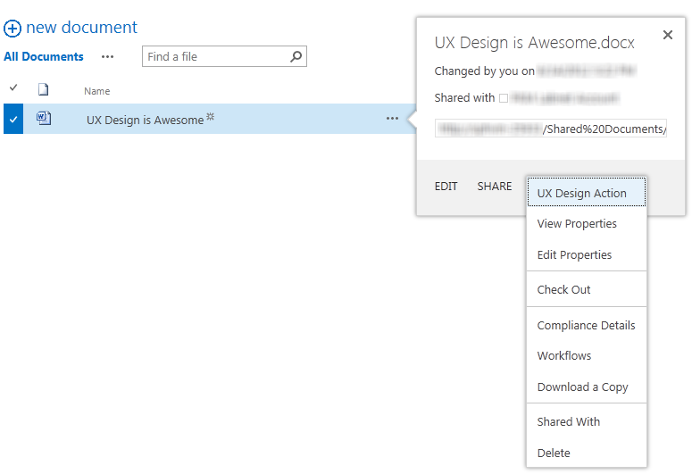
  
    
    
O código para ações personalizadas que forem reproduzidos na web host é o mesmo como em versões anteriores do SharePoint, com as seguintes restrições:
  
    
    

- O atributo **Location** deve ser **CommandUI.Ribbon** ou **EditControlBlock**.
    
  
- **CustomAction** não pode conter JavaScript:
    
  - Qualquer **UrlActions** ou **CommandActions** deve ser uma URL para navegar até. A URL pode ser parametrizada com tokens de ações personalizadas normal além os tokens de aplicativo específico.
    
  
  - **EnabledScript** não é permitido em personalizações da faixa de opções.
    
  
Normalmente quando um usuário escolhe uma ação personalizada, ele vai navegá-las para a URL que você especificou com qualquer tokens resolvidos com base nas suas seleções. No entanto, há alguns casos onde você pode o usuário permaneça no contexto na página, como para ações rápidas em um documento específico. Se você quiser ter sua ação personalizada abrir uma caixa de diálogo em vez de navegar, você deve adicionar os seguintes atributos ao elemento **CustomAction**.
  
    
    


```

HostWebDialog="TRUE"
HostWebDialogHeight="500" 
HostWebDialogWidth="500"
```

O atributo de **HostWebDialogHeight** e o atributo **HostWebDialogWidth** são opcionais. Se os atributos não forem especificados, será usado o tamanho padrão para uma caixa de diálogo no SharePoint. Em geral, no entanto, você deve especificar o tamanho da sua caixa de diálogo para que ele estiver correto e não usa scrollbars quando ele é exibido ao usuário.
  
    
    
A caixa de diálogo sempre inclui um botão **Fechar** em cromado da caixa de diálogo. Você também pode incluir botões na página que fechará a caixa de diálogo e informar a página de origem se ele precisa atualizar. Se você já fez algo que poderia ser refletidas no modo de exibição o usuário está vendo (por exemplo: Atualizando propriedades em um documento), você deve atualizar a página. Por outro lado, se você não atualizar nada (por exemplo: uma ação de "Cancelar" ou enviar um arquivo para um arquivo morto sem atualizar quaisquer propriedades), você pode saber a página que nenhuma atualização é necessária. Os exemplos a seguir mostram como enviar mensagens de POSTAGEM para fechar a caixa de diálogo.
  
    
    


```

window.parent.postMessage('CloseCustomActionDialogRefresh', '*');
window.parent.postMessage('CloseCustomActionDialogNoRefresh', '*');
```

Dependendo se você usa **CloseCustomActionDialogRefresh** ou **CloseCustomActionDialogNoRefresh**, fecha a caixa de diálogo e ele ou atualiza a página atrás dela ou não.
  
    
    
Você não pode adicionar uma guia personalizada à faixa de opções da web host do seu suplemento. Você só pode adicionar grupos personalizados ou controles individuais. Você não deve substituir qualquer um dos controles de faixa de opções do SharePoint padrão. Você deve ter seus controles existem lado a lado com os controles do SharePoint.
  
    
    
Se você tiver alguns controles relacionados uns aos outros, ou que o usuário provavelmente associará usando o suplemento, você deve agrupá-los em seu próprio grupo personalizado para que o usuário é mais provável encontrá-los. Se, por outro lado, é mais provável de ser algo a funcionalidade que você está adicionando o usuário considera parte da experiência do núcleo de site, tente ajustar controle em um ponto de lógico nos locais da faixa de opções existente. Para obter mais informações, consulte  [Criar ações personalizadas para implantar o SharePoint Add-ins](create-custom-actions-to-deploy-with-sharepoint-add-ins.md).
  
    
    

## Fornecer uma página de configurações de suplemento configuração
<a name="UXGuide_Settings"> </a>

Em muitos casos, faz sentido para o seu suplemento ter algumas informações de configuração que o usuário pode alterar e expor essas informações por meio do uso uma página de configurações. Ideal, você pode escolher razoáveis padrões para essas configurações, e os usuários podem escolher Ir para as configurações de interface do usuário somente se eles precisam modificar esses padrões. Em alguns casos, o suplemento exigirá determinadas informações ou opções para ser fornecido antes do suplemento pode funcionar. Quando seu suplemento requer informações para que ele possa funcionar, você deve fornecer uma experiência de usuário que orienta o usuário para a página de configurações para atualizar a configuração.
  
    
    
Você deve adicionar que as configurações de URL da página para o menu de superior direita do aplicativo se apropriado para que os usuários possam encontrá-lo facilmente. Se seu suplemento tem uma introdução experiência ou outras configurações, é possível adicioná-los também. Para obter mais informações, consulte  [Use o controle de cromo do cliente no SharePoint Add-ins](use-the-client-chrome-control-in-sharepoint-add-ins.md).
  
    
    
Você também deve ter em mente que o usuário que está visitando atualmente o suplemento talvez não seja possível configurá-lo. A interface do usuário também não pense que o usuário atual é capaz de concluir a configuração. Seu suplemento deve orientar o usuário para encontrar a pessoa certa se eles não é possível configurá-lo.
  
    
    

## Gerenciar licenças de usuário em suplementos
<a name="UXGuide_License"> </a>

Se seu suplemento não é gratuito, você deve encontrar um bom equilíbrio entre os recursos que estão disponíveis ou restrito nos modos de avaliação ou não licenciados versus a versão totalmente paga.
  
    
    
Se você fornecer uma avaliação de tempo limitado, a versão de avaliação deve agir como a versão paga durante o período de avaliação. Dar aos usuários uma realista expectativas dos quais elas receberão quando pagam para o suplemento. Se você optar por restringir nada durante o período de avaliação, ser muito claro sobre como o usuário pode obter mais quando pagam. Para tentativas ilimitadas, você deve expor funcionalidade muito como você acha que é necessário para o usuário ter uma boa noção do valor de fazer seu suplemento claro quais são os benefícios extras seria obter por pagar por ele.
  
    
    
Quando as pessoas vêem primeiro seu suplemento, eles não podem ter uma licença para ele. Por exemplo, um usuário pode adicionar seu suplemento a um site de equipe, mas esquecer licenciar ninguém. Outros usuários no site de equipe poderiam estar usando seu suplemento sem uma licença até que o Gerenciador de licença corrige a situação. Você deve certificar-se de que eles obtêm uma boa impressão para que eles serão mais prováveis demanda ou comprar uma licença. É uma boa ideia sempre permitir que usuários, exibir e navegar entre os dados no seu suplemento seja claro sobre como tendo uma licença permitirá mais recursos, mas não lembrá-la mais de uma vez por sessão.
  
    
    
Se o valor de núcleo do seu aplicativo está na exibição de dados (e não quiser fornecer que ausente gratuitamente), você deve mostrar um subconjunto limitado dos dados ou mostrar os dados sem nenhuma interatividade. Você não deve bloquear usuários não licenciados da exibição que seus usuários não licenciados do suplemento devem obter uma amostra de que seu suplemento pode fazer para que elas para que elas fiquem mais prováveis comprá-lo.
  
    
    

### Usuários fazerem para obter uma licença

No caso em que um usuário de licença não está licenciado ou avaliação está usando seu suplemento, você deve incentivá-los para obter uma licença completa. Há duas maneiras para incentivar os usuários para obter uma licença completa:
  
    
    

- Com uma barra de status na parte superior da página que indica seu estado de licença.
    
  
- Em contexto quando o usuário tenta acessar conteúdo ou funcionalidade que requer uma licença.
    
  
Você deve ser muito cuidado ao uso excessivo o segundo caso de avisos de licença. É uma melhor experiência do usuário quando você usa a mensagem de status de nível superior e desabilite qualquer funcionalidade não licenciada que to permitem que o usuário desagradavelmente surpreso pelo impossibilidade de fazer algo. Nos dois casos, sua mensagem deve ser amigável e encorajador em vez de stern. Você deve conceder ao usuário um link para a página de detalhes de suplemento vendas para seu suplemento, onde eles podem obter uma licença.
  
    
    

### Barra de status de licenciamento

O SharePoint tem uma barra de status internos que você pode usar nas páginas do SharePoint chamando JavaScript API. Você também pode copiar o estilo da barra de status interno. Você deve usar o "aviso" amarelo "cor, com uma mensagem apropriada para a situação que o usuário esteja, por exemplo:
  
    
    

- Para usuários de uma **versão de avaliação ilimitado**: Este é uma versão de avaliação do _<app name>_. Clique aqui para comprar a versão completa e desbloquear  _<paid functionality>_.
    
  
- Para usuários de uma **versão de avaliação de tempo limitado ainda**: lá [is|are] _<amount of time, expressed in a human-readable metric like "3 days" not "73:42:12">_ deixada nesta versão de avaliação do _<app name>_. Clique aqui para comprar a versão completa e certifique-se de que você não perca um momento de todas as funcionalidades.
    
  
- Para usuários de uma **avaliação de tempo limitado de expirar**: Infelizmente, é nenhuma mais tempo deixado nesta versão de avaliação do _<app name>_. Clique aqui para comprar a versão completa e retornar à total funcionalidade.
    
  
- Para os usuários **sem licença**: Infelizmente, você não tiver uma licença para _<app name>_. Clique aqui para comprar a versão completa e habilitar  _<paid functionality>_.
    
  

## Outras considerações de design para Suplementos do SharePoint
<a name="UXGuide_Other"> </a>

Além dos que já foram explorado, você deve manter esses itens em mente quando você estiver criando o Add-in do SharePoint.
  
    
    

### Manter as informações necessárias em cookies

Haverá muitas informações que seu suplemento precisará poderá interagir com o SharePoint, como a URL do site do host ou a mensagem de POSTAGEM com credenciais do SharePoint. Manter informações em um cookie de cliente significa que seu suplemento não precisa manter solicitando as informações do SharePoint, que leva para uma experiência suave e melhor desempenho para o usuário final.
  
    
    

### Solicitar um novo token OAuth

Se seu suplemento não tiver credenciais, você pode solicitar uma nova redirecionando o usuário para a página de redirecionamento com sua ID de suplemento e a URL que o usuário tentar ir para. A URL deve ser sob o domínio da URL redirecionar registrado para a identificação de suplemento OAuth que você está usando. A URL a seguir é um exemplo de como redirecionar os usuários de suplemento. (Espaços reservados são entre chaves).
  
    
    
 `{hostWebURL}/_layouts/15/appredirect.aspx?client_id={OAuth_app_ID}&amp;redirect_uri={redirectUrl}`
  
    
    

### Verificação de modo somente leitura nos sites do SharePoint

Devido a atualizações ou manutenção do site, pode haver ocasiões em SharePoint é no modo somente leitura no momento que o usuário acessa seu suplemento. Se você vai permitir que o usuário manipular os dados do SharePoint, você deverá garantir que você não permitir que o usuário faça as alterações que não podem ser salvos no servidor. Desative a edição IU quando no modo somente leitura. Para verificar se o site está em modo somente leitura, você pode chamar essa API:
  
    
    
 `{hostWebUrl}/_api/site/ReadOnly`
  
    
    

## Recursos adicionais
<a name="bk_addresources"> </a>


-  [Design de eu para o SharePoint Add-ins](ux-design-for-sharepoint-add-ins.md)
    
  
-  [Criar componentes UX do SharePoint 2013](create-ux-components-in-sharepoint-2013.md)
    
  
-  [Use a folha de estilos de um site SharePoint no SharePoint Add-ins](use-a-sharepoint-website-s-style-sheet-in-sharepoint-add-ins.md)
    
  
-  [Use o controle de cromo do cliente no SharePoint Add-ins](use-the-client-chrome-control-in-sharepoint-add-ins.md)
    
  
-  [Criar partes do suplemento para instalar com o SharePoint Add-in](create-add-in-parts-to-install-with-your-sharepoint-add-in.md)
    
  
-  [Criar ações personalizadas para implantar o SharePoint Add-ins](create-custom-actions-to-deploy-with-sharepoint-add-ins.md)
    
  
-  [Personalizar um modo de exibição de lista de suplementos do SharePoint usando o processamento do lado do cliente](customize-a-list-view-in-sharepoint-add-ins-using-client-side-rendering.md)
    
  

  
    
    

