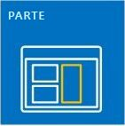
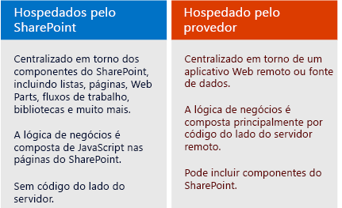

# Suplementos do SharePoint
Os Suplementos do SharePoint são extensões autocontidas de sites do SharePoint que você cria e que são executadas sem código personalizado no servidor do SharePoint.
## Visão geral do Suplementos do SharePoint

Existem dois tipos básicos de Suplementos do SharePoint: hospedados pelo SharePoint e hospedados pelo provedor. Para tomar a melhor decisão sobre o tipo a ser desenvolvido para o seu cenário, aprenda o que os dois tipos de Suplementos do SharePoint têm em comum.
  
    
    

> [!OBSERVAçãO]
> Um aplicativo de dispositivo, como um aplicativo móvel, não é realmente um "Suplemento do SharePoint", mesmo quando acessa o SharePoint. O mesmo se aplica a um aplicativo da Web que é iniciado fora do SharePoint. Caso pretenda desenvolver qualquer um desses tipos de aplicativo, confira  [SharePoint de acesso do dispositivo móvel e nativo apps](http://msdn.microsoft.com/library/42014171-5ee5-421d-9cde-413efc3aecef%28Office.15%29.aspx). 
  
    
    

- **Um Suplemento do SharePoint é um conjunto de partes autocontidas de funcionalidade** que estende os recursos de sites do SharePoint para resolver problemas de negócios bem definidos.
    
  
- **Os suplementos não têm código personalizado executado nos servidores do SharePoint**. Em vez disso, toda a lógica personalizada se move para "cima" para a nuvem ou para "baixo" para computadores cliente ou "acima" para um servidor local que esteja fora do farm do SharePoint ou da assinatura do SharePoint Online. Manter código personalizado fora dos servidores do SharePoint oferece reafirmação para administradores do SharePoint de que o suplemento não danifica os servidores deles ou não reduz o desempenho dos sites do SharePoint Online.
    
  
- **A lógica de negócios em um Suplemento do SharePoint pode acessar dados do SharePoint por meio de uma das várias APIs cliente incluídas no SharePoint**. A API que você vai usar para o seu suplemento depende de determinadas decisões de design tomadas.
    
  
- **Quase todos os principais tipos de componentes do SharePoint podem fazer parte de um Suplemento do SharePoint**, incluindo páginas, listas, fluxos de trabalho, tipos de conteúdo personalizado, modelos de lista, Web Parts e mais.
    
  
- **Os sites do SharePoint nos quais os Suplementos do SharePoint estão instalados e dos quais os usuários os iniciam são chamados de hosts da Web.** Os componentes do SharePoint, no entanto, geralmente ficam em uma Web filho especial do host da Web chamada desuplemento da Web.
    
  
- O **Suplementos do SharePoint pode se ajustar a um site do SharePoint de diversas maneiras**:
    
|||
|:-----|:-----|
||**Como uma experiência de página inteira imersiva** que pode ter a aparência de uma página do SharePoint.   |
||**Como parte de uma página da Web, o uso de um tipo especial de controle, chamado parte do suplemento**, para utilizar um elemento iframe que contém o suplemento.   |
||**Como comandos da interface do usuário que estendem faixas de opções e menus** para listas, documentos e mais.   |
   
- **Todos os Suplementos do SharePoint instalados pelos usuários obtêm um bloco na página **Conteúdo do Site** do site do SharePoint.** Clicar no bloco executa o suplemento.
    
  
- **Um Suplemento do SharePoint é configurado usando um  *manifesto de suplemento* ** - um arquivo XML que declara as propriedades básicas do suplemento, onde ele é executado e o que o SharePoint deve fazer quando o suplemento é iniciado. Entre outras coisas, o manifesto pode especificar quais idiomas têm suporte do suplemento, de quais serviços e funcionalidade do SharePoint ele depende e as permissões para ohost da Web necessárias para o suplemento (Suplementos do SharePoint têm controle total de seus própriossuplementos da Web).
    
  
- **Você distribui Suplementos do SharePoint em pacotes de suplementos**, que sempre incluem pelo menos o manifesto do suplemento (quando não há componentes do SharePoint, o manifesto do suplemento pode ser o único item do pacote do suplemento). Quando o suplemento tem componentes do SharePoint no suplemento da Web, eles são incluídos no pacote como um conjunto de arquivos XML. Os componentes remotos hospedados fora do SharePoint, como um aplicativo da Web ou um banco de dados remoto, não são incluídos no pacote e são implantados separadamente do pacote do suplemento (No entanto, o manifesto do suplemento especifica as URLs dos componentes remotos).
    
  
- **Os pacotes de suplementos também podem incluir Suplementos do Office.** Quando o Suplemento do SharePoint é instalado, o Suplemento do Office é adicionado a um catálogo de Suplementos do Office no SharePoint. Os usuários podem instalá-lo a partir do catálogo em aplicativos do Office como o Word ou o Excel.
    
  

> [!DICA]
> **Examine alguns Suplementos do SharePoint na** [Office Store](https://store.office.com/appshome.aspx?productgroup=SharePoint) para ter uma ideia do que você pode desenvolver. Ou abra um site do SharePoint 2013 e instale alguns dos Suplementos do SharePoint gratuitos. Basta navegar até ** Conteúdo do Site | Adicionar um suplemento | SharePoint Store**. 
  
    
    

### Alguns pontos para desenvolvedores experientes do SharePoint

Nós substituímos o soluçăos em área restrita que contém código personalizado do lado servidor. Ainda oferecemos suporte a soluçăos em área restrita "Sem código" e a soluçăos em área restrita que contenha somente JavaScript.
  
    
    
Os Suplementos do SharePoint não usam o modelo de objeto do SharePoint do lado do servidor. Os modelos de objeto do cliente são amplamente expandidos no SharePoint 2013. Embora algumas APIs no modelo de objeto do SharePoint não estejam disponíveis nos modelos de objeto de cliente, elas são classes quase que inteiramente administrativas e relacionadas à segurança. A lógica personalizada do SharePoint que atende a essas áreas é mais adequada a um script do Windows PowerShell ou a uma farm solution clássica do SharePoint. Para saber como escolher entre Suplementos do SharePoint, soluções de farm clássicas do SharePoint e soluçăos em área restrita, confira  [Suplementos do SharePoint em comparação com soluções do SharePoint](http://msdn.microsoft.com/library/0e9efadb-aaf2-4c0d-afd5-d6cf25c4e7a8%28Office.15%29.aspx).
  
    
    

## Duas maneiras de distribuir ou de vender um pacote de suplementos

Você pode distribuir um pacote de suplemento de duas maneiras:
  
    
    

- **Para um catálogo de suplementos da organização**, dedicado a um conjunto de sites do SharePoint na assinatura do SharePoint Online ou em um farm local. Esse método é usado quando o suplemento é criado de forma personalizada para uma organização em particular.
    
  
- **Para a  [Office Store](https://store.office.com/appshome.aspx?productgroup=SharePoint)**. A loja lida com o processo de marketing para você, desde a descoberta até a compra e as atualizações. A Microsoft tem um **Painel do Vendedor** para ajudar você a vender suplementos através da Office Store.
    
  
Depois de implantar o suplemento de uma dessas maneiras, ele estará disponível para instalação na página **Adicionar um suplemento** de sites do SharePoint. Se o suplemento precisar de permissões para o host da Web ou para sua assinatura principal, o SharePoint solicitará ao usuário que instale o suplemento que conceda essas permissões.
  
    
    
Quando você precisar atualizar um suplemento para corrigir um bug ou para adicionar funcionalidades, faça as alterações e eleve o número de versão do suplemento no respectivo manifesto. Em seguida, reimplante o pacote do suplemento na loja ou no catálogo de suplementos. Em até 24 horas, os usuários recebem um aviso na interface do usuário do SharePoint informando que há uma atualização disponível. Eles podem instalar a atualização com um único clique.
  
    
    

## Dois tipos de Suplementos do SharePoint: hospedados pelo SharePoint e hospedados pelo provedor

  
    
    

  
    
    

### Suplementos do SharePoint hospedados pelo SharePoint

Os suplementos hospedados pelo SharePoint consistem quase que inteiramente de componentes do SharePoint em um suplemento da Web. Algumas vezes, diz-se que eles têm seu centro no SharePoint.
  
    
    
Assim como todos os Suplementos do SharePoint, um usuário pode executar um suplemento hospedado no SharePoint a partir de um bloco na página **Conteúdo do Site** dos sites do SharePoint nos quais está instalado. Opcionalmente, também pode ter dois tipos de componentes da interface do usuário no host da Web: partes do suplemento e ações personalizadas (ou seja, botões da Faixa de Opções ou itens de menu personalizados). **Todo o restante em um suplemento hospedado no SharePoint é implantado no suplemento da Web.** Esses componentes são definidos de forma declarativa usando arquivos XML e podem incluir, entre outros:
  
    
    

||||
|:-----|:-----|:-----|
|Páginas personalizadas    |Fluxos de trabalho    |Módulos (conjuntos de arquivos)    |
|Modelos de lista    |Instâncias de lista e de biblioteca    |Formulários e exibições de lista personalizados    |
|Tipos de conteúdo personalizados    |Modelos da Web    |Colunas internas (não colunas personalizadas)    |
|Web Parts internas (não Web Parts personalizadas)    |Arquivos do JavaScript    |Botões e itens de menu personalizados para o suplemento da Web    |
   

  
    
    
Toda a lógica de negócios em um suplemento hospedado pelo SharePoint usa um JavaScript diretamente em uma página personalizada ou em um arquivo JavaScript referenciado de uma página personalizada. Uma versão do JavaScript do Modelo de Objeto do SharePoint (JSOM) está disponível para que seja mais simples para o suplemento executar operações de criação, de leitura, de atualização e de exclusão (CRUD) em dados do SharePoint.
  
    
    
As páginas personalizadas em um suplemento hospedado pelo SharePoint geralmente são páginas ASP.NET (ASPX) e podem referenciar declarativamente controles ASP.NET e controles prontos do SharePoint, mas não pode haver code-behind. No entanto, é possível personalizar os controles do SharePoint usando uma opção de renderização do lado cliente e o JavaScript personalizado.
  
    
    
O JavaScript em suplementos hospedados pelo SharePoint pode acessar dados e recursos que estejam fora do suplemento da Web usando uma de duas técnicas para trabalhar com segurança com a mesma política de origem do navegador: uma biblioteca entre domínios especial do JavaScript ou uma classe WebProxy específica do JavaScript. Usando essas técnicas, um suplemento hospedado pelo SharePoint pode trabalhar com dados no host da Web, em sua assinatura principal ou em qualquer local da Internet.
  
    
    

### Suplementos do SharePoint hospedados pelo provedor

Todos os componentes do SharePoint que podem estar em um suplemento hospedado pelo SharePoint também podem estar em um suplemento hospedado pelo provedor. Mas os suplementos hospedados pelo provedor são diferentes dos suplemento hospedados pelo SharePoint porque incluem pelo menos um componente remoto, um aplicativo da Web, um serviço ou um banco de dados hospedado externamente ao farm do SharePoint ou à assinatura do SharePoint Online. Isso poderia ser um servidor na mesma rede corporativa de um farm do SharePoint ou um serviço de nuvem. Os componentes externos podem ser hospedados em qualquer pilha de hospedagem da Web, incluindo a pilha Linux, Apache, MySQL, PHP (LAMP).
  
    
    

> [!OBSERVAçãO]
> **O "provedor" é quem detém a conta do servidor ou da nuvem.** Pode ser a mesma empresa ou organização que possue o farm do SharePoint ou a locação do SharePoint Online na qual o suplemento deve estar instalado. Mas o desenvolvedor do suplemento pode ser também o provedor. Normalmente, quando o suplemento é criado para uma organização, ela fornece a hospedagem. No entanto, quando um suplemento é criado para várias organizações, é mais provável que o desenvolvedor hospede os componentes remotos. A hospedagem do desenvolvedor é obrigatória quando o Suplemento do SharePoint é comercializado por meio da Office Store, porque o desenvolvedor não tem qualquer informação de contato dos compradores do suplemento. Nesse cenário, as diversas instâncias do suplemento reconhecem a URI do componente remoto porque ele é especificado no manifesto do suplemento.
  
    
    

Você tem flexibilidade completa da estrutura de hospedagem usada para os componentes remotos. E não precisa usar uma pilha da Microsoft. Qualquer estrutura de hospedagem da Web pode ser usada, incluindo LAMP (Linux, servidor Apache, MySQL, PHP), MEAN (MongoDB, ExpressJS, AngularJS, Nodejs), Java, Python e outras; e não há problemas em usar ferramentas de desenvolvimento que não sejam da Microsoft. Além disso, os componentes remotos podem ser hospedados em serviços de nuvem que não sejam da Microsoft.
  
    
    
 **Você pode dar a mesma aparência das páginas do SharePoint às páginas remotas do suplemento** usando um controle de cromo especial.
  
    
    
 **Os dados remotos podem ser blobs, caches, filas de mensagens, redes de entrega de conteúdo (CDN) e bancos de dados**, entre outros. E os bancos de dados podem ser de qualquer tipo, incluindo relacionais e orientados a objetos. Os dados remotos podem ser acessados em uma variedade de formas. Por exemplo, você pode usar o Business Connectivity Services (BCS) para expor os dados em uma lista do SharePoint. Outra opção é expor dados em uma grade de uma página em um aplicativo Web remoto.
  
    
    
 **Os Suplementos do SharePoint usam as APIs do SharePoint para se conectarem e se integrarem aos recursos do SharePoint** — pesquisa, fluxo de trabalho, redes sociais, taxonomia, perfis de usuário, BCS e mais. Isso permite que eles leiam documentos, façam pesquisas, conectem pessoas e executem operações CRUD. Há mais de um conjunto de APIs:
  
    
    

- Quando os componentes remotos forem implementados com o .NET, a biblioteca **Modelo de Objeto do Lado Cliente do SharePoint (CSOM)** de código gerenciado estará disponível.
    
  
- Para componentes remotos que não estejam baseados em .NET, há um conjunto de **APIs REST/OData** que poderá ser usado para acessar dados do SharePoint. Eles também poderão ser usados de um cliente .NET caso você prefira trabalhar com uma interface OData.
    
  
- A **biblioteca JSOM**, mencionada anteriormente, não pode ser usada em uma página remota, mas os suplementos hospedados pelo provedor podem ter páginas personalizadas do SharePoint em um suplemento da Web e o JavaScript nessas páginas pode usar a biblioteca JSOM.
    
  
 **Suplementos hospedados pelo provedor que acessam o SharePoint são entidades de segurança, assim como usuários e grupos**. A entidade do suplemento deve ser autenticada e autorizada, assim como o usuário. O suplemento deve ter permissões para executar operações nos dados do SharePoint, no host da Web. Na maioria dos cenários, as permissões efetivas de um usuário trabalhando com o SharePoint por meio de um Suplemento do SharePoint são a interseção das permissões do usuário e do suplemento, embora haja alguns cenários em que um usuário pode realizar ações com um suplemento, que não seriam possíveis, caso não tivesse permissão para fazê-las.
  
    
    
 **Os suplementos hospedados pelo provedor podem se conectar a qualquer serviço da Web interno ou público** e, ao contrário de aplicativos hospedados pelo SharePoint, eles podem ** manipular listas do SharePoint e eventos de itens de lista**, como a adição de um item a uma biblioteca de documentos.
  
    
    

## Escolher seu caminho de desenvolvimento do SharePoint

Pronto para começar?
  
    
    

- **Se você for um desenvolvedor do SharePoint experiente, recomendamos que comece com os suplementos hospedados pelo SharePoint.** Eles são os mais semelhantes aos tipos de extensões do SharePoint criados anteriormente.
    
     [Introdução à criação de Suplementos do SharePoint hospedados no SharePoint](get-started-creating-sharepoint-hosted-sharepoint-add-ins.md)
    
  
- **Se você for um desenvolvedor de aplicativos Web ASP.NET experiente, recomendamos que comece com os suplementos hospedados pelo provedor.** Eles são criados com base nos aplicativos da Web.
    
     [Introdução à criação de suplementos do SharePoint hospedados pelo provedor](get-started-creating-provider-hosted-sharepoint-add-ins.md)
    
  
- **Caso pretenda desenvolver um suplemento hospedado pelo provedor em uma pilha que não seja da Microsoft, veja como começar:**
    
  - Instale as ferramentas apropriadas à sua pilha, caso ainda não as tenha.
    
  
  - Obtenha uma conta de desenvolvedor no Office 365 para fins de testes e de depuração. Para obter detalhes, vá para  [Configurar um ambiente de desenvolvimento para suplementos do SharePoint no Office 365](set-up-a-development-environment-for-sharepoint-add-ins-on-office-365.md) ou, se já tiver uma assinatura do Office 365, só será necessário [criar um Site do Desenvolvedor nela.](create-a-developer-site-on-an-existing-office-365-subscription.md)
    
  
  - Seu suplemento vai usar APIs REST/OData do SharePoint para executar operações CRUD em dados do SharePoint:
    
  - Encontre nossa documentação explicativa no artigo  [Conheça o serviço REST do SharePoint 2013](get-to-know-the-sharepoint-2013-rest-service.md) e outros artigos que estão vinculados a ele.
    
  
  - Encontre documentação de referência em  [Referência de API REST para SharePoint 2013](http://msdn.microsoft.com/library/3514e753-19f9-4b41-a1ae-f35c5ffc17d2%28Office.15%29.aspx).
    
  
  - Se você não estiver usando o Visual Studio, terá de criar o arquivo de manifesto do suplemento e o pacote do suplemento. Para saber mais, confira  [Explore a estrutura de manifesto de aplicativo e o pacote de um SharePoint Add-in](explore-the-app-manifest-structure-and-the-package-of-a-sharepoint-add-in.md). Há muitas vantagens de economia de tempo na utilização do Visual Studio e do Microsoft Office Developer Tools for Visual Studio para criar o manifesto e o pacote. Recomendamos considerá-las, mesmo se usar outra ferramenta para criar o suplemento da Web remoto. A  [edição Community do Visual Studio](https://www.visualstudio.com/news/vs2013-community-vs.aspx) é gratuita.
    
  
  - Há exemplos de suplementos hospedados pelo provedor para algumas linguagens e plataformas diferentes da Microsoft na  [seção OfficeDev do GitHub](https://github.com/OfficeDev); por exemplo,  [PHP-App-for-SharePoint](https://github.com/OfficeDev/PHP-App-for-SharePoint).
    
  

> [!OBSERVAçãO]
> Se você for iniciante no desenvolvimento no SharePoint e na Web, você se beneficiará mais ao começar com o curso gratuito na Microsoft Virtual Academy ou ao trabalhar com um livro sobre desenvolvimento no SharePoint 2013 . 
  
    
    

## Ver também

#### Outros recursos

  
    
    
 [Promoção do desenvolvimento das soluções principais do Microsoft SharePoint Server 2013](http://www.microsoftvirtualacademy.com/training-courses/developing-microsoft-sharepoint-server-2013-core-solutions-jump-start)
