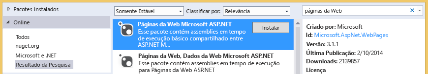

# Solucionando problemas de bibliotecas
Neste tópico, você pode aprender sobre problemas que podem ocorrer quando você acessa uma biblioteca de documentos do SharePoint de um suplemento de negócios nuvem e as técnicas que você pode usar para resolver esses problemas.

  
    
    

## Erro: Este suplemento não oferece suporte para carregar documentos do seu navegador atual

Ao tentar carregar um documento em uma biblioteca de documentos associados em um suplemento de negócios nuvem, o carregamento falhará com a mensagem de erro "Este suplemento não suporta carregar documentos do seu navegador atual. Use a versão mais recente". Esse problema ocorre apenas em determinados navegadores mais antigos que não oferecem suporte a API de FileReader HTML5. Adicionando um pacote do NuGet ao seu projeto e reimplantar o suplemento pode ser corrigido.
  
    
    

### Para evitá-lo

1. No **Solution Explorer**, abra o menu de atalho para o projeto do **servidor** e escolha **Manage NuGet Packages**.
    
  
2. Na caixa de diálogo **Manage NuGet Packages**, expanda o nó **Online** e, na caixa de **Pesquisa Online**, insira páginas da web, conforme mostrado na Figura 1.
    
   **Figura 1. Seleções na caixa de diálogo Manage NuGet Packages**

  

     
  

  

  
3. Na lista de resultados, escolha as **páginas da Web do Microsoft ASP.NET** e escolha o botão **instalar**.
    
    Abre a caixa de diálogo **Aceitação da licença**.
    
  
4. Na caixa de diálogo **Aceitação de licença**, revise os termos de licença e, se você concordar com os termos escolha o botão **eu aceito**.
    
  
5. Quando o pacote estiver concluída, escolha o botão **Fechar**.
    
  
6. Publique o suplemento atualizado no seu site do SharePoint.
    
  

## Recursos adicionais

-  [Associar uma biblioteca de documentos uma entidade](associate-a-document-library-with-an-entity.md)
    
  

