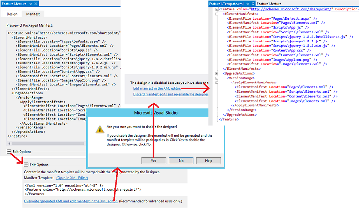

# Atualizar componentes de suplemento web no SharePoint 2013
Atualizar páginas, listas, tipos de conteúdo e outros componentes de suplemento web em um Suplemento do SharePoint.
## Pré-requisitos para a atualização do suplemento de web components
<a name="Prerequisites"> </a>

Estar familiarizado com  [Suplementos de atualização para o SharePoint](update-sharepoint-add-ins.md) e os pré-requisitos e os conceitos fundamentais incluídos nele.
  
    
    
Este tópico pressupõe que você tenha desenvolvido e testado a versão mais recente do add-in, conforme descrito no  [Criar e depurar a nova versão, como se fosse um novo suplemento](update-sharepoint-add-ins.md#DebugFirst).
  
    
    

## Atualizar os componentes do SharePoint no suplemento da web
<a name="UpdatingAppWeb"> </a>

Todos os componentes do SharePoint que são implantados na Web suplemento estão contidos em **Web**-recursos com escopo no pacote do suplemento. Para que o motivo, atualizando esses componentes é uma questão de atualizar um ou mais dos recursos. Esse processo não tiver sido alterado desde SharePoint 2010 e documentado  [How to: Add Elements to an Existing Feature](http://msdn.microsoft.com/library/b007f419-e0d6-4e3a-a3ae-b8e448656d02%28Office.15%29.aspx) no SharePoint 2010 SDK. Outros artigos no nó [Upgrading Features](http://msdn.microsoft.com/library/e917f709-6491-4d50-adbe-2ab8f35da990%28Office.15%29.aspx) podem ser útil também, mas considere que suplementos não devem incluir código personalizado no servidor do SharePoint, portanto, alguns aspectos do recurso atualizando em SharePoint 2010 não são relevantes para a atualização de suplementos. Por exemplo, você não pode usar o elemento [CustomUpgradeAction](http://msdn.microsoft.com/library/16a2182e-80aa-4184-8071-8f717ee5c572%28Office.15%29.aspx) quando você atualiza o recurso de um Suplemento do SharePoint.
  
    
    

### O que pode e não pode ser feito de forma declarativa

Com um hospedado no SharePoint suplemento, você só pode usar a marcação XML para atualizar um add-in e há algumas limitações em como você pode alterar um suplemento em uma atualização de forma declarativa. Em um provedor hospedado suplemento, você pode implementar um  [manipulador de UpdatedEventEndpoint](create-a-handler-for-the-update-event-in-sharepoint-add-ins.md) para fazer as coisas que não podem ser feitas de forma declarativa.
  
    
    
A adição de componentes para um suplemento é fácil. Qualquer componente que é qualificado a serem incluídos em um suplemento também pode ser adicionado em uma atualização. (Para obter detalhes sobre quais componentes podem ser em um suplemento, consulte  [Tipos de componentes do SharePoint que podem estar em um SharePoint Add-in](host-webs-add-in-webs-and-sharepoint-components-in-sharepoint-2013.md#TypesOfSPComponentsInApps).) Mas, quando você deseja modificar um componente existente de forma declarativa, considere os seguintes pontos.
  
    
    

- O tipo de dados de uma lista ou de um campo (coluna) do tipo de conteúdo não pode ser alterado após a implantação inicial em nenhuma circunstância. Em particular, não altere o tipo de dados de um campo como parte de uma atualização suplemento ( *não mesmo programaticamente*  ). Como alternativa, você pode adicionar um novo campo. Se o suplemento inclui personalizado item criar, editar ou exibir formulários; Certifique-se de fazer as alterações correspondentes nesses formulários. Por exemplo, adicionar a interface do usuário para o novo campo e remover a interface do usuário para o antigo. (Em um provedor hospedado suplemento, você pode programaticamente mover dados do campo antigo para o novo e exclua o antigo.)
    
  
- Instâncias de lista, listas, tipos de conteúdo ou campos não podem ser excluídos na atualização marcação.
    
  
- Arquivos não podem ser excluídos da web suplemento na marcação de atualização. No entanto, você pode alterar o conteúdo de qualquer arquivo.
    
  
- Os elementos **CustomUpgradeAction** e **MapFile** não podem ser usados ao atualizar um Suplemento do SharePoint, embora eles podem aparecer disponíveis no Visual Studio intellisense.
    
  

### Atualizar a web suplemento pela primeira vez

Os procedimentos desta seção explicam como adicionar ou atualizar tipos de conteúdo, listas, arquivos e outros componentes do SharePoint no suplemento de web. Para manter a simplicidade, assumimos que todos os componentes fazem parte de um recurso único da web add-in, mas suplemento webs podem ter vários recursos e você pode atualizar mais de um na mesma atualização.
  
    
    
O Microsoft Office Developer Tools for Visual Studio são voltado para a criação de novos suplementos e em alguns casos, o comportamento padrão das ferramentas não é ideal quando você está atualizando um suplemento. Para obter mais controle sobre o processo, você deve começar por meio da desabilitação do Designer de recurso usando o procedimento a seguir, para que você pode editar o recurso bruto XML diretamente.
  
    
    

### Para editar o XML de recurso


1. No **Solution Explorer**, abra o arquivo de .features  _{FeatureName}_. Ele é aberto no designer de recurso.
    
  
2. Abra a guia **manifesto** e expanda **Opções Editar**.
    
  
3. Escolha **Substituir gerado XML e edite o manifesto no editor XML**.
    
  
4. Escolha **Sim** para o prompt para desabilitar o designer.
    
  
5. O modo de exibição que é aberta, escolha **Editar manifesto no editor XML**. O  _{FeatureName}_. Arquivo Template. XML é aberto.
    
   **Abrindo o editor de XML de recurso**

  

     
  

  

  

> **CUIDADO**
> Não adicione "<!--->" comentários para o arquivo de .features  _{FeatureName}_. Comentários não são compatíveis com a infraestrutura de atualização e a atualização irá falhar se os comentários são no arquivo. Eles são usados nos exemplos deste artigo marcação apenas para indicar a você onde sua marcação deve ir.
  
    
    

Use as seguintes etapas para atualizar o suplemento web recurso.
  
    
    

### Para atualizar a web suplemento recurso na primeira vez


1. Incremente o atributo **Version** do elemento de [recurso](http://msdn.microsoft.com/library/265cd648-1a7e-410f-a1d7-0da8c64b4006%28Office.15%29.aspx) , se o Office Developer Tools for Visual Studio já não fez isso quando você incrementado o número da versão no manifesto do suplemento. (As ferramentas não fazem isso em todos os cenários, portanto você precisa verificar.) Você deve usar o mesmo número de versão que você pode usar para o suplemento. Considere mesmo aumentando a versão do recurso quando outros componentes do add-in estão sendo atualizados, mas não o suplemento web recurso em si. A lógica do elemento [VersionRange](http://msdn.microsoft.com/library/cd715e38-6ec3-43b2-8007-6d0ed8865d91%28Office.15%29.aspx) (que é discutido na seção [Atualizações subseqüentes da web suplemento](#SubsequentUpgrades)) é mais fácil gerenciar quando a versão add-in e a versão do recurso são sempre as mesmas.
    
  
2. Não exclua nada na seção  [ElementManifests](http://msdn.microsoft.com/library/d8d4db7e-2bc2-40c6-958b-d5683bdee87a%28Office.15%29.aspx) do arquivo. Nada é excluído nunca a partir desta seção.
    
  
3. Se ainda não estiverem presentes, adicione os seguintes elementos no arquivo:
    
  - Um elemento filho do  [UpgradeActions](http://msdn.microsoft.com/library/5af24ac1-a290-454d-b32b-bc7f7a4634f0%28Office.15%29.aspx) no elemento **Feature**. Faça *não*  adicionar atributos **ReceiverAssembly** ou **ReceiverClass** ao elemento. Eles têm sem uso quando você está atualizando um Suplemento do SharePoint. (Esses atributos referir-se a um assembly personalizado, que não é suportado no Suplementos do SharePoint. Se você incluir um assembly personalizado em um suplemento, SharePoint não instalará o add-in.)
    
  
  - Um elemento filho do **VersionRange** no elemento **UpgradedActions**. Não adicione **BeginVersion** ou **EndVersion** atributos ao elemento. Eles têm nenhuma finalidade quando um add-in está sendo atualizado pela primeira vez. Seu uso será discutido na seção [Atualizações subseqüentes da web suplemento](#SubsequentUpgrades).
    
  
  - Um elemento filho do  [ApplyElementManifests](http://msdn.microsoft.com/library/c087a0c3-1e27-4034-b4da-e025991454d6%28Office.15%29.aspx) no elemento **VersionRange**.
    
  

    Neste ponto o arquivo deve se parecer com o exemplo a seguir.
    
    > **IMPORTANTE**
      > O Office Developer Tools for Visual Studio talvez já adicionado a marcação acima e copiados alguns elementos da seção **ElementManifests** à seção **ApplyElementManifests** como uma ilustração. *Excluí-las.*  Embora você pode acabar colocar alguns deles novamente nas etapas posteriores, é mais fácil e segura iniciar com uma seção vazia **ApplyElementManifests**. Entradas redundantes para componentes que não foram alteradas podem ter consequências ruim, incluindo possivelmente aumentando o processo de atualização suficiente o que ele vezes-out e falha.


  ```XML
  
<Feature <!-- Some attributes omitted -->
               Version="2.0.0.0">
  <ElementManifests>
    <!-- ElementManifest elements omitted -->
  </ElementManifests>
  <UpgradeActions>
   <VersionRange>
     <ApplyElementManifests>
       
     </ApplyElementManifests>
   </VersionRange>
  </UpgradeActions>
</Feature>
  ```


### Para adicionar componentes para o suplemento


1. Adicione quaisquer novos componentes ao recurso exatamente como faria se estivesse criando um novo projeto Suplemento do SharePoint.
    
  
2. Quando você adiciona um componente de um tipo que não estava em que a versão anterior do add-in, como a adição de uma lista para um suplemento que não tinha anteriormente uma lista, o Office Developer Tools for Visual Studio adicionará um arquivo Elements XML ao projeto. Esse é o manifesto de elementos do componente. Você deve adicionar o novo número de versão do add-in este arquivo (por exemplo, elements.2.0.0.0.xml). Isso pode ser útil na solução de problemas. Certifique-se de fazer a alteração no **Solution Explorer** para garantir que faz referência ao arquivo, como no csproj arquivo e o recurso de XML, são alterados de acordo.
    
  
3. Para cada novo manifesto do elemento, adicione um elemento  [ElementManifest](http://msdn.microsoft.com/library/5a6a2865-5d31-45a2-a402-6da6e0f5567a%28Office.15%29.aspx) como um filho ao **ElementManifests** e os elementos de **ApplyElementManifests** do recurso xml. (O exato mesmo **ElementManifest** elemento em ambos os lugares.) O atributo **Location** do elemento deve apontar para o caminho relativo do arquivo elements.2.0.0.0.xml. Por exemplo, se você adicionou uma lista de chamada MyCustomList, o elemento **ElementManifest** será semelhante a seguir.
    
  ```XML
  
<ElementManifest Location="MyCustomList\\elements.2.0.0.0.xml" />
  ```

4. Alguns tipos de componentes adicionar arquivos ao projeto. Por exemplo, um arquivo Schema. XML é criado quando você adiciona uma lista; e quando você adiciona uma página, um arquivo de página é criado. Para cada arquivo tal, adicione um elemento  [ElementFile](http://msdn.microsoft.com/library/bd43638e-8f18-4a0d-b122-1c055f97aa71%28Office.15%29.aspx) como um filho ao elemento **ElementManifests**. (Não adicioná-lo ao elemento **ApplyElementManifests**.) O atributo **Location** deve apontar para o caminho relativo do arquivo. Por exemplo, se você adicionou uma lista, o elemento **ElementFile** para o Schema. XML será semelhante a seguir.
    
  ```XML
  <ElementFile Location="MyCustomList\\Schema.xml" />
  ```

5. Quando você adiciona outro item de um tipo que já estava na versão anterior do add-in, o Office Developer Tools for Visual Studio podem adicionar uma referência para o novo item a um manifesto elementos existente, em vez de criar um novo. Por exemplo, a forma padrão para adicionar uma página para um suplemento de web é com o botão direito no nó de **páginas** no **Solution Explorer** e navegue por meio de **Adicionar | Novo Item | Página | Adicionar**. O Office Developer Tools for Visual Studio irá adicionar um novo elemento **File** ao módulo **Pages** em que o arquivo de manifesto elementos existente (geralmente chamado elements. xml) em vez de criar um novo manifesto do elemento.
    
    Isso não é recomendável. A prática recomendada é a fim de evitar, quando possível, edição de qualquer elemento existente arquivos de manifesto ao atualizar um suplemento (ou seja, qualquer elemento manifestos de versões anteriores do suplemento). Em geral, novos itens devem estar no novos arquivos de manifesto de elemento (que fazem sozinhos referenciada no elemento **ApplyElementManifests** do recurso XML). (Algumas das exceções a essa prática são descritas posteriormente.) Por exemplo, para adicionar uma nova página, siga estas etapas:
    
1. Crie um novo módulo chamado Pages.2.0.0.0
    
  
2. Remova o arquivo txt dela que oOffice Developer Tools for Visual Studio adicionar automaticamente.
    
  
3. Renomeie o manifesto de elementos no novo módulo para elements.2.0.0.0.xml.
    
  
4. Com o botão direito do módulo **Pages.2.0.0.0** e, em seguida, navegar **Adicionar | Novo Item | Página | Adicionar**. A nova página é criada e é referenciado no manifesto de elementos da **Pages.2.0.0.0** em vez de **páginas**.
    
  
5. Certifique-se de que haja um elemento **ElementsFile** para a nova página no elemento **ElementManifests** do recurso de XML e certifique-se de que haja um elemento **ElementManifest** para o arquivo elements.2.0.0.0.xml nas seções **ElementManifests** tanto o **ApplyElementManifests**.
    
  

    Outra opção em qualquer situação na qual o Office Developer Tools for Visual Studio alterou um manifesto de elementos existentes, é criar um novo elements.2.0.0.0.xml manualmente e mover a marcação que foi adicionada ao antigo manifesto para o novo. (Você pode colocar uma nova nos mesmos nós **Solution Explorer** antigo se desejar).
    
  
6. Se você adicionar um campo a um tipo de conteúdo no recurso, adicione um elemento  [AddContentTypeField](http://msdn.microsoft.com/library/cb04a3ac-f41a-4ffe-aaa1-d4bf3fb6347d%28Office.15%29.aspx) para a seção **VersionRange**. Certifique-se de atribuir os valores corretos para os atributos **ContentTypeId** e **FieldId**. Opcionalmente, use o atributo **PushDown** para especificar se o novo campo deve ser adicionado a qualquer derivados tipos de conteúdo. O exemplo a seguir é um exemplo.
    
  ```XML
  <VersionRange>
  <AddContentTypeField 
    ContentTypeId="0x0101000728167cd9c94899925ba69c4af6743e"
    FieldId="{CCDD361F-A3FB-40D8-A272-3A3C858F4116}"
    PushDown="TRUE" />
  <!-- Other child elements of VersionRange -->
</VersionRange>
  ```


### Para modificar os componentes existentes do add-in


1. Se você tiver alterado um arquivo que é referenciado em um arquivo de manifesto de elementos, como um arquivo default. aspx, você não precisará alterar o elemento de **ElementFile** para o arquivo nisso. Mas, você precisará informar a infraestrutura de atualização para substituir a versão antiga do arquivo com o novo nome. Para fazer isso, adicionando um elemento **ElementManifest** para o módulo para a seção **ApplyElementManifests**. Como já existe tal elemento na seção **ElementManifests**, simplesmente copiando (não mudando) para o **ApplyElementManifests** às vezes é uma opção, mas isso só é aconselhável se cada arquivo que é referenciado no manifesto foi alterado. Como uma prática geral, você não deve substituir um arquivo inalterado com uma cópia do próprio. Em alguns cenários, isso pode ter efeitos ruim. Por exemplo, se a página tiver sido configurada para permitir que usuários personalizá-lo, substituindo-pode causar as personalizações a ser removido. (Se você tivesse alterado a página, então você teria que aceitar este consequência, mas você não deseja impor este inconveniência em seus clientes pointlessly.)
    
    Para garantir que somente os arquivos alterados no módulo serão substituídos, crie um segundo manifesto do elemento para o módulo que referencia somente os arquivos alterados e aplique manifesto do segundo no **ApplyElementManifests** seguindo estas etapas.
    
1. Com o botão direito no nó do módulo no **Solution Explorer** e adicione um arquivo XML (e não em uma página), denominado elements.2.0.0.0.xml.
    
  
2. Selecione o novo arquivo no **Solution Explorer** para tornar seu painel propriedade visível e alterar a propriedade **Deployment Type** para **ElementManifest**. Isso é importante para garantir que a alça de Office Developer Tools for Visual Studio o arquivo adequadamente.
    
  
3. Copie o conteúdo do manifesto original para a nova e exclua do novo manifesto todos os elementos do  [arquivo](http://msdn.microsoft.com/library/c270e4ce-8110-4da7-b0e7-c223604bfce7%28Office.15%29.aspx) que correspondem aos arquivos que **não** foram alteradas.
    
  
4. Adicione um elemento **ElementManifest** para a seção **ApplyElementManifests** que faz referência ao arquivo de manifesto novo, como neste exemplo.
    
  ```XML
  
<ElementManifest Location="Pages\\elements.2.0.0.0.xml" />
  ```


    > **OBSERVAçãO**
      > Não exclua o manifesto original. O XML de recurso está usando ambas aqueles antigas e novas.> Não copie quaisquer elementos **ElementFile** da seção **ElementManifests** à seção **ApplyElementManifests**, mesmo se o arquivo que é referenciado no **ElementFile** tiver sido alterado.
2. Abra cada arquivo de manifesto do elemento mencionado na seção **ApplyElementManifests** e garantir que quaisquer elementos do [arquivo](http://msdn.microsoft.com/library/c270e4ce-8110-4da7-b0e7-c223604bfce7%28Office.15%29.aspx) tenham um atributo de **ReplaceContents** e que ele está definido como **TRUE**. O exemplo a seguir é um exemplo. O Office Developer Tools for Visual Studio talvez ainda tiver feito isso, mas você deve verificar a ele. Fazer isso mesmo para os manifestos de elemento de versões anteriores do suplemento. Essa é uma das poucas maneiras em que ele é uma boa prática para editar um arquivo de manifesto de elemento existente.
    
  ```XML
  <Module Name="Pages">
  <File Path="Pages\\Default.aspx" Url="Pages/Default.aspx" ReplaceContent="TRUE" />
</Module>
  ```

3. Páginas podem ter Web Parts incorporada-los conforme explicado em  [Incluir uma Web Part em uma página da Web na web suplemento](include-a-web-part-in-a-webpage-on-the-add-in-web.md). Se você altera uma página que tem uma Web Part nele (ou alterar as propriedades da Web Part), não há uma etapa adicional: você precisa adicionar a seguinte marcação à página para impedir que o SharePoint adicionando uma segunda cópia da Web Part para a página. A marcação deve ser adicionada ao elemento **asp:Content** com a ID `PlaceHolderAdditionalPageHead`. (O Office Developer Tools for Visual Studio já tenha adicionado-lo quando a página foi criada pela primeira vez, mas você deve verificar se ele existe.)
    
  ```XML
  
<meta name="WebPartPageExpansion" content="full" />
  ```


    > **OBSERVAçãO**
      > Se a página tiver sido configurada para permitir que usuários personalizá-la, em seguida, essa marcação tem o efeito de lado de remover as personalizações. Os usuários terão de ser repetidos-los.> Se a Web Part foi adicionada ao seguinte página que as orientações em  [Incluir uma Web Part em uma página da Web na web suplemento](include-a-web-part-in-a-webpage-on-the-add-in-web.md), em seguida, a marcação de Web Part são no manifesto elementos, portanto, alterar as propriedades de Web Part é uma exceção à regra geral que você não deve editar um arquivo de manifesto do elemento como parte de uma atualização do suplemento.
4. Como alternativa para alterar uma página, você também tem a opção de usar o redirecionamento para uma nova página usando as etapas a seguir.
    
1. Criar uma nova página e configurar sua marcação de atualização, conforme descrito no procedimento **para adicionar componentes para o suplemento** acima.
    
  
2. Abra a página antiga e remover todas as marcações do elemento **asp:Content** com a ID `PlaceHolderAdditionalPageHead`.
    
  
3. Adicione a seguinte marcação ao elemento **asp:Content** e, em seguida, substitua _{RelativePathToNewPageFile}_ o novo caminho e nome de arquivo. Esse script irá redirecionar o navegador para a nova página e incluir os parâmetros de consulta. Ele também manterá a página antiga sem o histórico do navegador.
    
  ```
  <script type="text/javascript">
        var queryString = window.location.search.substring(1);
        window.location.replace("{RelativePathToNewPageFile}" + "?" + queryString);
</script>
  ```

4. Exclua quaisquer outros elementos de **asp:Content** na página.
    
  
5. Se a página que você está substituindo é a página inicial para o suplemento, altere o elemento **StartPage** no manifesto suplemento para apontar para a nova página.
    
  
5. Se a web de suplemento do add-in não contiver um **CustomAction** ou um **ClientWebPart**e modificá-lo como parte de uma atualização, você deve modificar o manifesto do elemento pois é onde esses componentes são definidos. (Isso é uma exceção à prática geral que você não deve editar um manifesto do elemento de uma versão anterior do add-in ao atualizar o add-in.) Você também precisará copiar (não mover) o elemento **ElementManifest** da seção **ElementManifests** à seção **ApplyElementManifests**.
    
  

#### Exemplo do XML de recurso para atualizar um add-in na primeira vez

O exemplo a seguir é um exemplo de uma completa  _{FeatureName}_. Arquivo Template. XML para uma atualização de tempo primeiro de um suplemento. O suplemento atualizado neste exemplo inclui um arquivo default. aspx modificado mencionado no arquivo  `Pages\\Elements.xml` e implanta o três novos arquivos jQuery, cada um deles é referenciado no arquivo `Scripts\\Elements.xml` . Observe que todo o s **ElementFile**vá na seção **ElementManifests** e observe como `<ElementManifest Location="Pages\\Elements.xml" />` foi copiado (não movido) a partir da seção **ElementManifests** à seção **ApplyElementManifests**.
  
    
    

```XML

<Feature xmlns="http://schemas.microsoft.com/sharepoint/" Title="MyApp Feature1"
      Description="SharePoint Add-in Feature" Id="85d309a8-107e-4a7d-b3a2-51341d3b11ff" 
      Scope="Web" Version="2.0.0.0">
  <ElementManifests>
    <ElementFile Location="Pages\\Default.aspx" />
    <ElementManifest Location="Pages\\Elements.xml" />
    <ElementFile Location="Content\\App.css" />
    <ElementManifest Location="Content\\Elements.xml" />
    <ElementFile Location="Images\\AppIcon.png" />
    <ElementManifest Location="Images\\Elements.xml" />
    <ElementFile Location="Scripts\\jquery-3.0.0.intellisense.js" />
    <ElementFile Location="Scripts\\jquery-3.0.0.js" />
    <ElementFile Location="Scripts\\jquery-3.0.0.min.js" />
  </ElementManifests> 
  <UpgradeActions>
      <VersionRange>      
        <ApplyElementManifests>
          <ElementManifest Location="Pages\\Elements.xml" />
          <ElementManifest Location="Scripts\\elements.2.0.0.0.xml" />
        </ApplyElementManifests>
      </VersionRange>
  </UpgradeActions>
</Feature>

```


### Atualizações subseqüentes da web suplemento
<a name="SubsequentUpgrades"> </a>

Quando você atualiza um Suplemento do SharePoint para o tempo de segundo (ou terceiro e assim por diante), você precisa considerar que alguns de seus clientes podem não ter feito as atualizações anteriores. Portanto, se um usuário responde ao prompt "atualização está disponível" após sua atualização mais recente é implantada para o catálogo de suplemento da organização ou para o Office Store, sua instância do add-in pode ser atualizada por meio de várias versões em um processo de atualização única. Na maioria das vezes, isso é exatamente o que deverá ocorrer: você deseja que cada versão anterior do suplemento atualizado para a versão mais recente. Mas você não quiser sempre cada ação de atualização para a web suplemento recurso ocorrer novamente para cada instância do add-in. Há algumas ações de atualização não devem ocorrer várias vezes em uma determinada instância. Por exemplo, se você adicionar um campo a um tipo de conteúdo em uma atualização, você não deseja desse campo adicionado novamente na próxima atualização. O procedimento a seguir mostra como usar o elemento de **VersionRange** para controlar quais ações de atualização ocorrem com base na versão do recurso que está sendo atualizado.
  
    
    

### Para alterar o suplemento web recurso no atualizações posteriores


1. Abra o  _FeatureName_. Template. XML do arquivo para edição, conforme descrito no procedimento **para editar o XML de recurso** neste artigo e incrementar o atributo **Version** do elemento de [recurso](http://msdn.microsoft.com/library/265cd648-1a7e-410f-a1d7-0da8c64b4006%28Office.15%29.aspx) . Você deve usar o mesmo número de versão para o recurso de como você usou para o suplemento.
    
    Para fins de um exemplo contínuo, vamos supor que você atualizou anteriormente o add-in da versão 1.0.0.0 para 2.0.0.0 de versão e agora você está atualizando a versão 3.0.0.0. Portanto, defina o atributo **Version** como 3.0.0.0.
    
  
2. Adicione um novo elemento **VersionRange** em todos os elementos de **VersionRange** existente. Faça *não*  adicionar um atributo **BeginVersion** ou **EndVersion** a esse elemento.
    
  
3. Preencha o elemento **VersionRange**, conforme descrito no procedimento **para atualizar a hora de recurso o primeiro suplemento web** neste artigo para levar em conta as alterações feitas nesta versão atualizada do recurso. Sempre que esse procedimento se refere à seção **ApplyElementManifests**, trate-o como referir-se ao elemento **ApplyElementManifests** que é um filho do elemento **VersionRange** que você adicionou; ou seja, o *menor*  um no arquivo XML de recurso.
    
  
4. Vá para o elemento anterior do **VersionRange** — aquele adicionado a última vez que você atualizado o suplemento (de 1.0.0.0 para 2.0.0.0 no exemplo contínuo) — e adicione um atributo **EndVersion** a ele. Você deseja que as ações de atualização neste **VersionRange** ser aplicada a todas as versões do add-in para o qual já não tiverem sido aplicada (versão 1.0.0.0), mas você não deseja ser reaplicadas versões aos quais eles já foram aplicado (versão 2.0.0.0). O valor de **EndVersion** é *exclusivo*  , portanto, você pode defini-la para a versão mais baixa para o qual você fazer *não*  deseja que as ações de atualização são aplicadas. No exemplo contínuo, você defini-la para 2.0.0.0. Seu arquivo agora deve ser semelhante ao seguinte.
    
  ```XML
  
<Feature <!-- Some attributes omitted -->
               Version="3.0.0.0">
  <ElementManifests>
    <!-- ElementManifest elements omitted -->
  </ElementManifests>
  <UpgradeActions>
    <VersionRange EndVersion="2.0.0.0">
      <!--  Child elements for upgrade from 1.0.0.0 to 2.0.0.0 go here. -->
    </VersionRange>
   <VersionRange>
      <!--  Child elements for upgrade from 2.0.0.0 to 3.0.0.0 go here. -->
   </VersionRange>
  </UpgradeActions>
</Feature>
  ```


    Cada vez que você atualize o recurso, siga o mesmo padrão encontrado. Adicione um novo **VersionRange** para as ações de atualização mais recentes. Em seguida, adicionar um elemento **EndVersion** para o elemento **VersionRange** *anterior*  e defini-la como o número da versão anterior. No exemplo contínuo, o arquivo lembraria o seguinte para a atualização de 3.0.0.0 para 4.0.0.0.
    


  ```XML
  
<Feature <!-- Some attributes omitted -->
               Version="4.0.0.0">
  <ElementManifests>
    <!-- Child elements omitted -->
  </ElementManifests>
  <UpgradeActions>
    <VersionRange EndVersion="2.0.0.0">
       <!-- Child elements for upgrade from 1.0.0.0 to 2.0.0.0 go here. -->
    </VersionRange>
    <VersionRange EndVersion="3.0.0.0">
       <!-- Child elements for upgrade from 2.0.0.0 to 3.0.0.0 go here. -->
    </VersionRange>
    <VersionRange>
       <!-- Child elements for upgrade from 3.0.0.0 to 4.0.0.0 go here. -->
    </VersionRange>
  </UpgradeActions>
</Feature>
  ```


    Observe que o elemento de **VersionRange** mais recente não possui nenhum **BeginVersion** ou **EndVersion** atributos. Isso garante que as ações que entram nesse elemento **VersionRange** são aplicadas a todas as versões anteriores do recurso, que é o que você deseja porque todas as alterações mais recentes são referenciadas neste **VersionRange**e nenhum deles já tenha ocorrido para qualquer instância do recurso de atualização.
    
    Observe também que o atributo **BeginVersion** não é usado em qualquer uma do s **VersionRange**. Isso ocorre porque o valor padrão para o atributo **BeginVersion** é 0.0.0.0 e que é o valor que você deseja porque você deseja que todas as ações de atualização aplicadas a cada instância do add-in que é anterior à versão que é especificado no atributo **EndVersion**.
    
    > **IMPORTANTE**
      > O elemento **VersionRange** determina apenas quais versões do recurso as atualizações são aplicadas aos. Ele não determinar quais versões do add-in de obtém uma notificação que está disponível uma atualização — notificação é disparada somente pelo número de versão do suplemento. Dentro de 24 horas de uma nova versão do add-in está sendo disponível no catálogo de suplemento da organização ou o Office Store, cada instância instalada do add-in, independentemente da versão, tem a notificação de que está disponível uma atualização aparecer no seu lado a lado na página **Conteúdo** do Site.> O **VersionRange** não afeta o novo número de versão do recurso recém-atualizados ou o suplemento recém-atualizados. Esses dois números sempre são alterados para o número da versão mais recente, independentemente de qual intervalo de versão que o recurso se encontrava antes da atualização. Isso oferece outro bom motivo para evitar o uso de um atributo **BeginVersion**. O atributo **BeginVersion** pode ser usado para bloquear algumas ações de atualização nunca ocorra em algumas instâncias do suplemento. Mas ele não pode bloquear o recurso ou versões de suplemento seja gerado para a versão mais recente. Portanto, o uso de um atributo **BeginVersion** foi possível criar uma situação na qual duas instâncias do seu suplemento poderia ter o mesmo número de versão do suplemento e a web de suplemento mesma número de versão do recurso, mas têm componentes diferentes nos seus webs suplemento.

## Verificar a implantação do suplemento de web components
<a name="VerifyDeployAppWebComp"> </a>

Siga estas etapas para verificar a implantação da web suplemento recurso e seus componentes.
  
    
    

### Para verificar o provisionamento da web suplemento


1. Abra a página de **Configurações do Site** da web host. Na seção **Administração do conjunto de sites**, escolha o link da **hierarquia do Site**.
    
  
2. Na página de **Hierarquia do Site**, você verá sua web suplemento listada por sua URL. Não iniciá-lo. Em vez disso, copie a URL e usar a URL nas etapas restantes.
    
  
3. Navegue até  _URL_of_app_web_/_layouts/15/ManageFeatures.aspx e, na página **Recursos** do Site que será aberta, verifique se que o recurso é um membro da lista alfabética de recursos e que seu status está **ativo**.
    
  
4. Se sua web suplemento recurso inclui colunas de site personalizadas, abra  _URL_of_app_web_/_layouts/15/mngfield.aspx e, na página **Colunas de Site** que será aberta, verifique se suas novas colunas de site personalizadas estão listadas.
    
  
5. Se sua web suplemento recurso inclui todos os tipos de conteúdo personalizados, abra  _URL_of_app_web_/_layouts/15/mngctype.aspx e, na página **Tipos de conteúdo de Site** que abre, verifique se seus novos tipos de conteúdo estão listados.
    
  
6. Para cada tipo de conteúdo personalizado e cada tipo de conteúdo ao qual você adicionou uma coluna, escolha o link para o tipo de conteúdo. Na página **Tipo de conteúdo de Site** que será aberta, verifique se o tipo de conteúdo tem as colunas de site, que ele deve ter.
    
  
7. Se a sua web suplemento recurso inclui qualquer instâncias da lista, open  _URL_of_app_web_/_layouts/15/mcontent.aspx e, na página de **listas e bibliotecas de Site** que será aberta, verifique se há um link de **Personalizar "name_of_list"** para cada instância de lista personalizada.
    
  
8. Para cada uma dessas instâncias de lista personalizada, escolha o link **Personalizar "name_of_list"** e verifique se na página de configurações de lista lista tem as esperada de tipos de conteúdo e colunas.
    
    > **OBSERVAçãO**
      > Se não houver nenhuma seção **Tipos de conteúdo** na página, você deve habilitar o gerenciamento de tipos de conteúdo. Escolha o link de **Configurações avançadas** e, na página Configurações avançadas, habilitar o gerenciamento de tipos de conteúdo e escolha **OK**. Você retorna à página anterior e agora é uma lista de **Tipos de conteúdo** de seção.
9. Na parte superior da página é o **endereço da web** da lista. Se você incluiu itens de exemplo em sua definição de instância de lista, copie o endereço e colá-lo na barra de endereços do navegador e, em seguida, navegue até a lista. Verifique se a lista tem os itens de amostra que você criou.
    
  

## Próximas etapas
<a name="Next"> </a>

Retornar às  [Principais etapas atualizando um suplemento](update-sharepoint-add-ins.md#MajorAppUpgradeSteps)ou ir diretamente para um dos artigos a seguir para saber como atualizar o próximo componente principal da sua Suplemento do SharePoint.
  
    
    

-  [Atualizar os componentes da web de host no SharePoint 2013](update-host-web-components-in-sharepoint-2013.md)
    
  
-  [Criar um manipulador para o evento de atualização no SharePoint Add-ins](create-a-handler-for-the-update-event-in-sharepoint-add-ins.md)
    
  
-  [Atualizar componentes remotos no SharePoint Add-ins](update-remote-components-in-sharepoint-add-ins.md)
    
  

## Recursos adicionais
<a name="bk_addresources"> </a>


-  [Suplementos de atualização para o SharePoint](update-sharepoint-add-ins.md)
    
  
-  [How to: Add Elements to an Existing Feature](http://msdn.microsoft.com/library/b007f419-e0d6-4e3a-a3ae-b8e448656d02%28Office.15%29.aspx) a Microsoft SharePoint 2010 Software Development Kit (SDK).
    
  
-  [Upgrading Features](http://msdn.microsoft.com/library/e917f709-6491-4d50-adbe-2ab8f35da990%28Office.15%29.aspx) a Microsoft SharePoint 2010 Software Development Kit (SDK).
    
  

