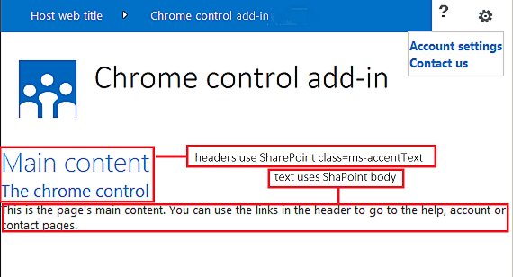

# Use o controle de cromo do cliente no SharePoint Add-ins
Saiba como usar o controle de cromo em suplementos no SharePoint 2013.
O controle de cromo no SharePoint 2013 permite que você use o estilo do cabeçalho de um site do SharePoint específico em seu suplemento sem a necessidade para registrar uma biblioteca do servidor ou usar uma ferramenta ou tecnologia específica. Para usar essa funcionalidade, você deve registrar uma biblioteca de JavaScript do SharePoint por meio de uma marca standard < script >. Você pode fornecer um espaço reservado, usando um elemento de **div** HTML e personalizar ainda mais o controle usando as opções disponíveis. O controle herda sua aparência do site do SharePoint especificado.
  
    
    


## Pré-requisitos para uso dos exemplos neste artigo
<a name="SP15Usechromecontrol_Prereq"> </a>

Para acompanhar as etapas deste exemplo, será necessário:
  
    
    

- 2015 do Visual Studio
    
  
- Um ambiente de desenvolvimento SharePoint 2013 (suplemento isolamento necessário para os cenários de local)
    
  
Para obter orientação sobre como configurar um ambiente de desenvolvimento que atenda às suas necessidades, consulte  [Start building Office and SharePoint Add-ins](http://msdn.microsoft.com/library/187f8c8c-1b15-471c-80b5-69a40e67deea.aspx).
  
    
    

### Principais conceitos saber antes de usar o controle de cromo

A tabela a seguir lista os artigos úteis que podem ajudá-lo a entender os conceitos envolvidos em um cenário que usa o controle de cromo.
  
    
    

**Tabela 1. Conceitos principais para usar o controle de cromo**


|**Título do artigo**|**Descrição**|
|:-----|:-----|
| [Suplementos do SharePoint](sharepoint-add-ins.md) <br/> |Saiba mais sobre o novo modelo suplemento em SharePoint 2013 que permite que você crie suplementos, que são pequenas e fácil de usar soluções para usuários finais. <br/> |
| [Design de eu para o SharePoint Add-ins](ux-design-for-sharepoint-add-ins.md) <br/> |Saiba mais sobre as opções de experiência (eu) do usuário e a alternativas que você precisa ao construir Suplementos do SharePoint. <br/> |
| [Host webs, suplemento webs e componentes do SharePoint no SharePoint 2013](host-webs-add-in-webs-and-sharepoint-components-in-sharepoint-2013.md) <br/> |Saiba mais sobre a distinção entre webs de host e o suplemento webs. Descubra quais componentes SharePoint 2013 podem ser incluídos em um Suplemento do SharePoint, quais componentes são implantados na Web de host, quais componentes são implantados na Web de suplemento e como o suplemento web é implantada em um domínio isolado. <br/> |
   

## Exemplo de código: usar o controle de cromo em seu suplemento hospedado em nuvem
<a name="SP15Usechromecontrol_Codeexample"> </a>

Um suplemento hospedado em nuvem inclui pelo menos um componente remoto. Para obter mais informações, consulte  [Escolha os padrões para desenvolver e hospedar o Add-in do SharePoint](choose-patterns-for-developing-and-hosting-your-sharepoint-add-in.md). Para usar o controle de cromo em seu suplemento hospedado em nuvem, siga estas etapas:
  
    
    

1. Crie o Suplemento do SharePoint e projetos web remoto.
    
  
2. Opções de envio padrão configuração na seqüência de consulta.
    
  
3. Adicione uma página da Web para o projeto da web.
    
  
A Figura 1 mostra uma página da Web remota com o controle de cromo.
  
    
    

**Figura 1. Webpage remota com o controle de cromo**

  
    
    

  
    
    

  
    
    

### Para criar o Suplemento do SharePoint e projetos web remoto


1. Abra 2015 do Visual Studio como administrador. (Para fazer isso, clique com botão direito no ícone 2015 do Visual Studio, no menu **Iniciar** e escolha **Executar como administrador** ).
    
  
2. Crie um novo projeto usando o modelo de **suplemento do SharePoint**.
    
    Figura 2 mostra a localização do modelo **do suplemento do SharePoint** no Visual 2015 Studio, em **modelos**, **Visual c#**, **Office/SharePoint**, **suplementos do Office**.
    

   **Figura 2. Add-in SharePoint modelo do Visual Studio**

  

     
  

  

  
3. Forneça a URL do site do SharePoint que você deseja usar para depuração.
    
  
4. Selecione **hospedado em provedor**, como a opção de hospedagem para seu suplemento. Para obter um exemplo de código hospedado no SharePoint, consulte  [SharePoint-adicionar-em-JSOM-BasicDataOperations](https://github.com/OfficeDev/SharePoint-Add-in-JSOM-BasicDataOperations).
    
    Depois que o assistente for concluído, você deve ter uma estrutura no **Gerenciador de soluções** que se assemelha a Figura 3.
    

   **Figura 3. Add-in para projetos do SharePoint no Solution Explorer**

  

     
  

  

  

### Para enviar as opções de configuração de padrão na sequência de consulta


1. Abra o arquivo de Appmanifest.xml no editor de manifesto.
    
  
2. Adicione o token **{StandardTokens}** e um parâmetro adicional _SPHostTitle_ para a cadeia de caracteres de consulta. Figura 4 mostra o editor de manifesto com os parâmetros de cadeia de caracteres de consulta configurada.
    
   **Figura 4. Editor de manifesto com os parâmetros de cadeia de caracteres de consulta para o controle de cromo**

  

     
  

    O controle de cromo leva automaticamente os seguintes valores da cadeia de consulta:
    
  - **SPHostUrl**
    
  
  - **SPHostTitle**
    
  
  - **SPAppWebUrl**
    
  
  - **SPLanguage**
    
  

    **{StandardTokens}** incluem **SPHostUrl** e **SPAppWebUrl**.
    
  

### Para adicionar uma página que usa o controle de cromo do projeto da web


1. Com o botão direito do projeto da web e, em seguida, adicione um novo formulário da Web.
    
  
2. Copie a seguinte marcação e colá-lo na página ASPX. A marcação executa as seguintes tarefas:
    
  - Carrega a biblioteca AJAX a partir do Microsoft CDN (rede de fornecimento de conteúdo).
    
  
  - Carrega a biblioteca jQuery a partir do Microsoft CDN.
    
  
  - Carrega o SP. INTERFACE DO USUÁRIO. Arquivo de Controls.js utilizando a função do jQuery **getScript**.
    
  
  - Define uma função de retorno de chamada para o evento **onCssLoaded**.
    
  
  - Prepara as opções para o controle de cromo.
    
  
  - Inicializa o controle de cromo.
    
  

  ```HTML
  
<!DOCTYPE html>
<html xmlns="http://www.w3.org/1999/xhtml">
<head>
    <title>Chrome control host page</title>
    <script 
        src="//ajax.aspnetcdn.com/ajax/4.0/1/MicrosoftAjax.js" 
        type="text/javascript">
    </script>
    <script 
        type="text/javascript" 
        src="//ajax.aspnetcdn.com/ajax/jQuery/jquery-1.7.2.min.js">
    </script>      
    <script 
        type="text/javascript"
        src="ChromeLoader.js">
    </script>
<script type="text/javascript">
"use strict";

var hostweburl;

//load the SharePoint resources
$(document).ready(function () {
    //Get the URI decoded URL.
    hostweburl =
        decodeURIComponent(
            getQueryStringParameter("SPHostUrl")
    );

    // The SharePoint js files URL are in the form:
    // web_url/_layouts/15/resource
    var scriptbase = hostweburl + "/_layouts/15/";

    // Load the js file and continue to the 
    //   success handler
    $.getScript(scriptbase + "SP.UI.Controls.js", renderChrome)
});

// Callback for the onCssLoaded event defined
//  in the options object of the chrome control
function chromeLoaded() {
    // When the page has loaded the required
    //  resources for the chrome control,
    //  display the page body.
    $("body").show();
}

//Function to prepare the options and render the control
function renderChrome() {
    // The Help, Account and Contact pages receive the 
    //   same query string parameters as the main page
    var options = {
        "appIconUrl": "siteicon.png",
        "appTitle": "Chrome control add-in",
        "appHelpPageUrl": "Help.html?"
            + document.URL.split("?")[1],
        // The onCssLoaded event allows you to 
        //  specify a callback to execute when the
        //  chrome resources have been loaded.
        "onCssLoaded": "chromeLoaded()",
        "settingsLinks": [
            {
                "linkUrl": "Account.html?"
                    + document.URL.split("?")[1],
                "displayName": "Account settings"
            },
            {
                "linkUrl": "Contact.html?"
                    + document.URL.split("?")[1],
                "displayName": "Contact us"
            }
        ]
    };

    var nav = new SP.UI.Controls.Navigation(
                            "chrome_ctrl_placeholder",
                            options
                        );
    nav.setVisible(true);
}

// Function to retrieve a query string value.
// For production purposes you may want to use
//  a library to handle the query string.
function getQueryStringParameter(paramToRetrieve) {
    var params =
        document.URL.split("?")[1].split("&amp;");
    var strParams = "";
    for (var i = 0; i < params.length; i = i + 1) {
        var singleParam = params[i].split("=");
        if (singleParam[0] == paramToRetrieve)
            return singleParam[1];
    }
}
</script>
</head>

<!-- The body is initally hidden. 
     The onCssLoaded callback allows you to 
     display the content after the required
     resources for the chrome control have
     been loaded.  -->
<body style="display: none">

    <!-- Chrome control placeholder -->
    <div id="chrome_ctrl_placeholder"></div>

    <!-- The chrome control also makes the SharePoint
          Website stylesheet available to your page -->
    <h1 class="ms-accentText">Main content</h1>
    <h2 class="ms-accentText">The chrome control</h2>
    <div id="MainContent">
        This is the page's main content. 
        You can use the links in the header to go to the help, 
        account or contact pages.
    </div>
</body>
</html>
  ```

3. Você também pode usar o controle de cromo modo declarativo. No exemplo de código a seguir, a marcação HTML declara o controle sem usar o código JavaScript para configurar e inicializar o controle. A seguinte marcação executa as seguintes tarefas:
    
  - Fornece um espaço reservado para o SP. INTERFACE DO USUÁRIO. Arquivo de JavaScript Controls.js.
    
  
  - Carrega dinamicamente SP. INTERFACE DO USUÁRIO. Arquivo Controls.js
    
  
  - Fornece um espaço reservado para o controle de cromo e especifica o embutido de opções com a marcação HTML.
    
  

  ```HTML
  
<!DOCTYPE html>
<html xmlns="http://www.w3.org/1999/xhtml">
<head>
    <title>Chrome control host page</title>
    <script 
        src="http://ajax.aspnetcdn.com/ajax/4.0/1/MicrosoftAjax.js" 
        type="text/javascript">
    </script>
    <script 
        type="text/javascript" 
        src="http://ajax.aspnetcdn.com/ajax/jQuery/jquery-1.7.2.min.js">
    </script>      
    <script type="text/javascript">
    var hostweburl;

    // Load the SharePoint resources.
    $(document).ready(function () {

        // Get the URI decoded add-in web URL.
        hostweburl =
            decodeURIComponent(
                getQueryStringParameter("SPHostUrl")
        );

        // The SharePoint js files URL are in the form:
        // web_url/_layouts/15/resource.js
        var scriptbase = hostweburl + "/_layouts/15/";

        // Load the js file and continue to the 
        // success handler.
        $.getScript(scriptbase + "SP.UI.Controls.js")
    });

    // Function to retrieve a query string value.
    // For production purposes you may want to use
    // a library to handle the query string.
    function getQueryStringParameter(paramToRetrieve) {
        var params =
            document.URL.split("?")[1].split("&amp;");
        var strParams = "";
        for (var i = 0; i < params.length; i = i + 1) {
            var singleParam = params[i].split("=");
            if (singleParam[0] == paramToRetrieve)
                return singleParam[1];
        }
    }
    </script>
</head>
<body>

    <!-- Chrome control placeholder 
           Options are declared inline.  -->
    <div 
        id="chrome_ctrl_container"
        data-ms-control="SP.UI.Controls.Navigation"  
        data-ms-options=
            '{  
                "appHelpPageUrl" : "Help.html",
                "appIconUrl" : "siteIcon.png",
                "appTitle" : "Chrome control add-in",
                "settingsLinks" : [
                    {
                        "linkUrl" : "Account.html",
                        "displayName" : "Account settings"
                    },
                    {
                        "linkUrl" : "Contact.html",
                        "displayName" : "Contact us"
                    }
                ]
             }'>
    </div>
    
    <!-- The chrome control also makes the SharePoint
          Website style sheet available to your page. -->
    <h1 class="ms-accentText">Main content</h1>
    <h2 class="ms-accentText">The chrome control</h2>
    <div id="MainContent">
        This is the page's main content. 
        You can use the links in the header to go to the help, 
        account or contact pages.
    </div>
</body>
</html>
  ```


    SP. INTERFACE DO USUÁRIO. Biblioteca de Controls.js processará automaticamente o controle se encontrar o atributo **data-ms-control="SP.UI.Controls.Navigation"** em um elemento **div**.
    
  

### Para editar o elemento de página inicial no manifesto do suplemento


1. Clique duas vezes no arquivo **AppManifest.xml** no **Solution Explorer**.
    
  
2. No menu suspenso **página inicial**, selecione a página da Web que usa o controle de cromo.
    
  

### Para criar e executar a solução


1. Certifique-se de que o projeto Suplemento do SharePoint é definido como o projeto de inicialização.
    
  
2. Pressione a tecla F5.
    
    > **OBSERVAçãO**
      > Quando você pressiona F5, Visual Studio aproveita a solução, implanta o suplemento e abre a página de permissões para o suplemento.
3. Escolha o botão **De confiança**.
    
  
4. Clique no ícone do suplemento **ChromeControlCloudhosted**.
    
  
5. Quando você usar o controle de cromo em suas páginas da Web, você também pode usar a folha de estilo do site do SharePoint, conforme mostrado na Figura 4.
    
   **Figura 5. Folha de estilo do site do SharePoint usada na página**

  

     
  

  

  

**Tabela 2. A solução de problemas**


|**Problema**|**Solução**|
|:-----|:-----|
|Exceção não tratada **SP é indefinido**. <br/> |Certificar-se de que seu navegador carrega SP. INTERFACE DO USUÁRIO. Arquivo Controls.js. <br/> |
|O controle de cromo não é processado devidamente. <br/> |O controle de cromo suporta apenas os modos de documentos, Internet Explorer 8 e superior. Verifique se que seu navegador renderiza sua página no modo de documento do Internet Explorer 8 ou superior. <br/> |
|Erro de certificado. <br/> |Defina a propriedade **SSL habilitado** do seu projeto web como false. No projeto Suplemento do SharePoint, defina a propriedade do **Projeto da Web** comoNenhume, em seguida, defina a propriedade volta ao nome do seu projeto de web. <br/> |
   

## Próximas etapas
<a name="SP15Usechromecontrol_Nextsteps"> </a>

Este artigo demonstrado como usar o controle de cromo em um Suplemento do SharePoint. Como próxima etapa, você pode aprender sobre outros componentes eu que estão disponíveis para Suplementos do SharePoint. Para saber mais, consulte o seguinte:
  
    
    

-  [Amostra de código: usar o controle de cromo em um suplemento hospedado em nuvem](http://code.msdn.microsoft.com/SharePoint-2013-Work-with-089ecc6f)
    
  
-  [Código de exemplo: Use o controle de cromo e a biblioteca de entre domínios (CSOM)](http://code.msdn.microsoft.com/SharePoint-2013-Use-the-97c30a2e)
    
  
-  [Código de exemplo: Use o controle de cromo e a biblioteca de entre domínios (REST)](http://code.msdn.microsoft.com/SharePoint-2013-Use-the-a759e9f8)
    
  
-  [Use a folha de estilos de um site SharePoint no SharePoint Add-ins](use-a-sharepoint-website-s-style-sheet-in-sharepoint-add-ins.md)
    
  
-  [Criar ações personalizadas para implantar o SharePoint Add-ins](create-custom-actions-to-deploy-with-sharepoint-add-ins.md)
    
  
-  [Criar partes do suplemento para instalar com o SharePoint Add-in](create-add-in-parts-to-install-with-your-sharepoint-add-in.md)
    
  

## Recursos adicionais
<a name="SP15Usechromecontrol_Addresources"> </a>


-  [Configurar um ambiente de desenvolvimento local para suplementos do SharePoint](set-up-an-on-premises-development-environment-for-sharepoint-add-ins.md)
    
  
-  [Design de eu para o SharePoint Add-ins](ux-design-for-sharepoint-add-ins.md)
    
  
-  [Diretrizes de design UX de suplementos do SharePoint](sharepoint-add-ins-ux-design-guidelines.md)
    
  
-  [Criar componentes UX do SharePoint 2013](create-ux-components-in-sharepoint-2013.md)
    
  
-  [Três maneiras de pensar sobre opções de design para o SharePoint Add-ins](three-ways-to-think-about-design-options-for-sharepoint-add-ins.md)
    
  
-  [Aspectos importantes do Add-in SharePoint arquitetura e desenvolvimento cenário](important-aspects-of-the-sharepoint-add-in-architecture-and-development-landscap.md)
    
  

