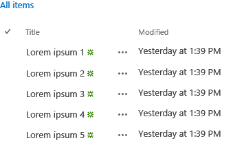

# Use o widget experimental do modo de exibição de lista de área de trabalho no SharePoint Add-ins
Aprenda a usar o widget do modo de exibição de lista de área de trabalho em qualquer página da web, mesmo se a página não for hospedada na SharePoint. Use o widget do modo de exibição de lista seus suplementos para exibir dados em listas que são hospedadas em um site SharePoint.
> **OBSERVAçãO**
> Widgets da Web do Office - Experimental são fornecidos apenas para fins de pesquisa e comentários. Não use em cenários de produção. O comportamento do Office Web Widgets pode ser alterado significativamente em futuras versões. Leia e revise o  [Office Web Widgets - termos de licença Experimental](office-web-widgetsexperimental-license-terms.md).
  
    
    

Você pode usar o widget do modo de exibição de lista para exibir os dados em uma lista de SharePoint semelhante ao widget regular do modo de exibição de lista, mas você pode usá-lo em seus suplementos e os sites que não são necessariamente hospedados em SharePoint.
**Figura 1. Widget da área de trabalho do modo de exibição de lista a exibição de dados em uma lista**

  
    
    

  
    
    

  
    
    

  
    
    

  
    
    

## Introdução

Você pode especificar o modo de exibição na lista SharePoint que você deseja usar para exibir os dados. O widget do modo de exibição de lista exibe as colunas e os itens na ordem especificada pelo modo de exibição.
  
    
    
O widget do modo de exibição de lista usa a biblioteca de domínio cruzado para obter os dados de lista. Por esse motivo, a comunicação acontece no nível do cliente.
  
    
    

> **CUIDADO**
> O widget do modo de exibição de lista de área de trabalho não habilitar todos os cenários de modo de exibição de lista nativo.
  
    
    

Os cenários a seguir não foram habilitados na versão atual do widget:
  
    
    

- Use o widget em esquemas de autenticação que não são suportados originariamente pela biblioteca de domínio cruzado.
    
  
- Use o widget com fontes de dados que não seja SharePoint listas ou bibliotecas.
    
  
- Dados vincular o widget.
    
  
- Modos de exibição do usuário sensível ao toque.
    
  
- Usuário edição embutida.
    
  
- Mostra informações de presença.
    
  
- Fornecer modelos de processamento personalizado.
    
  
- Cenários no local. Neste momento, o widget só funciona na SharePoint Online.
    
  

## Pré-requisitos para uso dos exemplos neste artigo

Para seguir os exemplos neste artigo, você precisará dos seguintes itens:
  
    
    

- Visual Studio 2013
    
  
- NuGet Package Manager. Para obter mais informações, consulte  [Instalando NuGet](http://go.microsoft.com/fwlink/?LinkId=271465).
    
  
- Um ambiente de desenvolvimento SharePoint 2013 (isolamento de aplicativo necessário para os cenários de local).
    
  
- Office Web Widgets - pacote NuGet Experimental. Para obter mais informações sobre como instalar um pacote do NuGet, consulte  [Gerenciando NuGet pacotes usando a caixa de diálogo](http://docs.nuget.org/docs/start-here/managing-nuget-packages-using-the-dialog). Você também pode navegar a  [página de galeria do NuGet](http://www.nuget.org/packages/Microsoft.Office.WebWidgets.Experimental/).
    
  

## Usar o widget do modo de exibição de lista de área de trabalho em um provedor hospedado Suplemento do SharePoint

Neste exemplo, há uma página simples hospedada fora SharePoint que declara um widget do modo de exibição de lista de área de trabalho.
  
    
    
Para usar o widget do modo de exibição de lista, faça o seguinte:
  
    
    

- Crie projetos da web e Suplemento do SharePoint.
    
  
- Crie uma lista na web add-in. Essa etapa também garante que um suplemento de web é criado quando os usuários implantar o suplemento.
    
    > **OBSERVAçãO**
      > Biblioteca do domínio cruzado requer a existência de um suplemento de web. O widget do modo de exibição de lista se comunica com SharePoint usando a biblioteca de domínio cruzado.
- Crie uma página de suplemento que declara uma instância de widget do modo de exibição de lista usando marcação HTML.
    
  

### Para criar um Suplemento do SharePoint e projetos web


1. Abra o Visual Studio 2013 como administrador. (Para fazer isso, escolha o ícone do Visual Studio 2013 no menu **Iniciar** e escolha **Executar como administrador** ).
    
  
2. Crie um novo projeto usando o modelo **Suplemento do SharePoint 2013**. O modelo de Suplemento do SharePoint 2013 está localizado em **modelos** > **Visual c#**, **Office /SharePoint**> **suplementos**.
    
  
3. Forneça a URL do site SharePoint que você deseja usar para depuração.
    
  
4. Selecione **hospedado em provedor**, como a opção de hospedagem para seu suplemento.
    
    > **OBSERVAçãO**
      > Você também pode usar o widget do modo de exibição de lista de área de trabalho com outras opções de hospedagem ou mesmo com suplementos do Office ou seu próprio site.
5. Selecione o **Aplicativo de formulários ASP.NET Web** como o tipo de projeto de aplicativo web.
    
  
6. Selecione o **Serviço de controle de acesso do Windows Azure** como a opção de autenticação.
    
  

### Para criar uma lista na web suplemento


1. Escolha o projeto Suplemento do SharePoint no **Solution Explorer**. Escolha **Adicionar** > **Novo Item …**
    
  
2. Escolher **itens do Visual c#** > **Office /SharePoint**> **lista**. Digite **anúncios** na caixa de texto **nome**. Escolha **Adicionar**.
    
  
3. Escolha **criar uma instância de lista com base em um modelo de lista existente**. Escolha o modelo de **comunicados**. Escolha **Concluir**.
    
  

### Para adicionar uma nova página que usa o widget do modo de exibição de lista de área de trabalho


1. Escolha a pasta de **páginas** no projeto da web no **Solution Explorer**.
    
  
2. Copie o código a seguir e cole-o em um arquivo **ASPX** no projeto. O código executa as seguintes tarefas:
    
  - Adiciona referências às bibliotecas necessárias do Office e aos recursos.
    
  
  - Fornece um espaço reservado para o widget do modo de exibição de lista.
    
  
  - Inicializa o tempo de execução de controles.
    
  
  - Executa o método **renderAll** do runtime controles do Office.
    
  

  ```
  
<!DOCTYPE html>
<html>
<head>
    <!-- IE9 or superior -->
    <meta http-equiv="x-ua-compatible" content="IE=10">
    <title>Desktop List View HTML Markup</title>

    <!-- Controls Specific CSS File -->
    <link rel="stylesheet" type="text/css" href="/Scripts/Office.Controls.css" />

    <!-- Ajax, jQuery, and utils -->
    <script 
        src=" https://ajax.aspnetcdn.com/ajax/4.0/1/MicrosoftAjax.js.js">
    </script>
    <script 
        src=" https://ajax.aspnetcdn.com/ajax/jQuery/jquery-1.9.1.min.js">
    </script>
    <script type="text/javascript">

        // Function to retrieve a query string value.
        // For production purposes you may want to use
        //  a library to handle the query string.
        function getQueryStringParameter(paramToRetrieve) {
            var params =
                document.URL.split("?")[1].split("&amp;");
            var strParams = "";
            for (var i = 0; i < params.length; i = i + 1) {
                var singleParam = params[i].split("=");
                if (singleParam[0] == paramToRetrieve)
                    return singleParam[1];
            }
        }
    </script>

    <!-- Cross-Domain Library and Office controls runtime -->
    <script type="text/javascript">
        //Register namespace and variables used through the sample
        Type.registerNamespace("Office.Samples.ListViewBasic");
        //Retrieve context tokens from the querystring
        Office.Samples.ListViewBasic.appWebUrl =
            decodeURIComponent(getQueryStringParameter("SPAppWebUrl"));
        Office.Samples.ListViewBasic.hostWebUrl =
            decodeURIComponent(getQueryStringParameter("SPHostUrl"));
        Office.Samples.ListViewBasic.ctag =
            decodeURIComponent(getQueryStringParameter("SPClientTag"));

        //Pattern to dynamically load JSOM and the cross-domain library
        var scriptbase =
            Office.Samples.ListViewBasic.hostWebUrl + "/_layouts/15/";

        //Get the cross-domain library
        $.getScript(scriptbase + "SP.RequestExecutor.js", 
            //Get the Office controls runtime and 
            //  continue to the createControl function
            function () {
                $.getScript("../Scripts/Office.Controls.js", createControl);
            }
        );
    </script>

    <!-- List View -->
    <script 
        src="../Scripts/Office.Controls.ListView.debug.js" 
        type="text/javascript">
    </script>

    <!-- SharePoint CSS -->
    <script type="text/javascript">
        document.addEventListener("DOMContentLoaded", function () {
            // The resource files are in a URL in the form:
            // web_url/_layouts/15/Resource.ashx
            var scriptbase =
                Office.Samples.ListViewBasic.appWebUrl + "/_layouts/15/";

            // Dynamically create the invisible iframe.
            var blankiframe;
            var blankurl;
            var body;
            blankurl =
                Office.Samples.ListViewBasic.appWebUrl + "/Pages/blank.html";
            blankiframe = document.createElement("iframe");
            blankiframe.setAttribute("src", blankurl);
            blankiframe.setAttribute("style", "display: none");
            body = document.getElementsByTagName("body");
            body[0].appendChild(blankiframe);

            // Dynamically create the link element.
            var dclink;
            var head;
            dclink = document.createElement("link");
            dclink.setAttribute("rel", "stylesheet");
            dclink.setAttribute("href",
                                scriptbase +
                                "defaultcss.ashx?ctag=" +
                                Office.Samples.ListViewBasic.ctag
                                );
            head = document.getElementsByTagName("head");
            head[0].appendChild(dclink);
        }, false);
    </script>
</head>
<body>
    Basic List View sample (HTML markup declaration):
    <div id="ListViewDiv"
         data-office-control="Office.Controls.ListView"
         data-office-options='{"listUrl" : getListUrl()}'>
    </div>

    <script type="text/javascript">
        function createControl() {
            //Initialize Controls Runtime
            Office.Controls.Runtime.initialize({
                sharePointHostUrl: Office.Samples.ListViewBasic.hostWebUrl,
                appWebUrl: Office.Samples.ListViewBasic.appWebUrl
            });

            //Render the widget, this must be executed after the
            //placeholder DOM is loaded
            Office.Controls.Runtime.renderAll();
        }

        function getListUrl() {
            return Office.Samples.ListViewBasic.appWebUrl +
                    "/_api/web/lists/getbytitle('Announcements')";
        }
    </script>
</body>
</html>
  ```


> **OBSERVAçãO**
> O exemplo de código acima especifica explicitamente os host web e o suplemento web URLs para inicializar o tempo de execução de controles do Office. No entanto, se o suplemento de web e URLs de web de host são especificados nos **SPAppWebUrl** **SPHostUrl** consulta string parâmetros e, respectivamente; Você pode passar um objeto vazio e o código tentará obter os parâmetros automaticamente. Os parâmetros **SPAppWebUrl** e **SPHostUrl** estão incluídos na seqüência de consulta quando você usa o token **{StandardTokens}**.
  
    
    

O exemplo a seguir mostra como passar um objeto vazio para o método initialize:
  
    
    


```

// Initialize with an empty object and the code
// will attempt to get the tokens from the
// query string directly.
Office.Controls.Runtime.initialize({});
```


### Para criar e executar a solução


1. Pressione a tecla F5.
    
    > **OBSERVAçãO**
      > Quando você pressiona F5, Visual Studio cria a solução, implanta o suplemento e abre a página de permissões para o suplemento.
2. Escolha o botão **De confiança**.
    
  
3. Escolha o ícone de suplemento na página **Conteúdo do Site**.
    
  
Você também pode baixar esta amostra da Galeria de código, consulte o exemplo de código  [uso do widget experimental do modo de exibição de lista de área de trabalho em um suplemento](http://code.msdn.microsoft.com/SharePoint-2013-Use-the-c3edb076) .
  
    
    

## 

Este artigo mostra como usar o widget do modo de exibição de lista de área de trabalho no seu suplemento usando HTML. Você também pode explorar os seguintes cenários e detalhes sobre o widget.
  
    
    

### Use JavaScript para declarar o widget do modo de exibição de lista de área de trabalho

Dependendo da sua preferência, convém usar o JavaScript em vez de HTML para declarar o widget. Se este for o caso, você pode usar a seguinte marcação como o espaço reservado do widget.
  
    
    

```HTML

<div id="ListViewDiv"></div>
```

Use o seguinte código JavaScript para instanciar o modo de exibição de lista.
  
    
    


```
new Office.Controls.ListView(
    document.getElementById("ListViewDiv"), {
        listUrl: Office.Samples.ListViewBasic.appWebUrl + "/_api/web/lists/getbytitle('Announcements')"
    });
```

Para obter um exemplo que mostra como executar as tarefas, consulte a página de **JSSimple.html** na amostra de código de [uso do widget experimental do modo de exibição de lista de área de trabalho em um suplemento](http://code.msdn.microsoft.com/SharePoint-2013-Use-the-c3edb076) .
  
    
    

### Especifique um modo de exibição para exibir os dados

Você pode especificar um modo de exibição existente na sua lista de SharePoint, o widget do modo de exibição de lista exibe os dados usando a especificação de modo de exibição.
  
    
    
Se você estiver usando a marcação HTML para declarar o widget, você pode usar a seguinte sintaxe para especificar um modo de exibição.
  
    
    


```

<div id="ListViewDiv"
        data-office-control="Office.Controls.ListView"
        data-office-options="{listUrl: 'list URL',
                            viewID: 'GUID'
                            }">
</div> 

```

Se você estiver declarando o widget usando JavaScript, use a seguinte sintaxe para especificar um modo de exibição.
  
    
    


```

new Office.Controls.ListView(
    document.getElementById("ListViewDiv"), {
        listUrl: "list URL",
        viewID: "GUID"
    });
```


## Conclusion

Você pode usar o widget experimental do modo de exibição de lista de área de trabalho para exibir dados em listas de SharePoint. O widget exibe dados em modo somente leitura. Forneça idéias e comentários no  [site Office Developer plataforma UserVoice](http://officespdev.uservoice.com/).
  
    
    

## Recursos adicionais
<a name="bk_addresources"> </a>


-  [Office Web Widgets - visão geral Experimental](office-web-widgetsexperimental-overview.md)
    
  
-  [Office Web Widgets - termos de licença Experimental](office-web-widgetsexperimental-license-terms.md)
    
  
-  [Office Web Widgets - página de galeria do NuGet Experimental](http://www.nuget.org/packages/Microsoft.Office.WebWidgets.Experimental/)
    
  
-  [Amostra de código: usar o widget experimental do modo de exibição de lista de área de trabalho em um suplemento](http://code.msdn.microsoft.com/SharePoint-2013-Use-the-c3edb076)
    
  
-  [Use o widget experimental do modo de exibição de lista de área de trabalho no SharePoint Add-ins](use-the-experimental-desktop-list-view-widget-in-sharepoint-add-ins.md)
    
  

