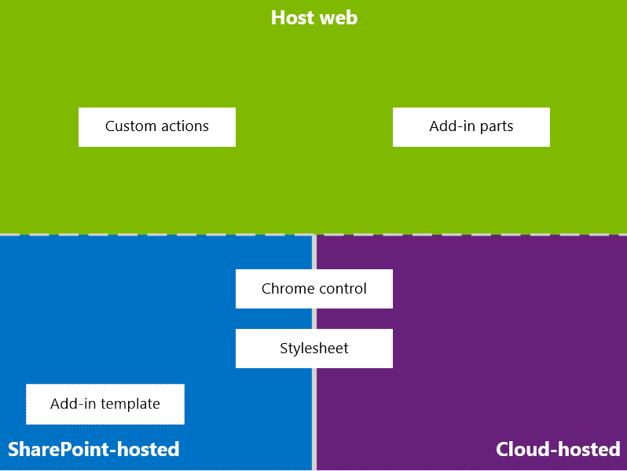
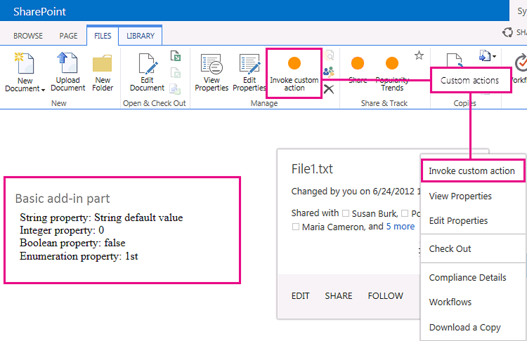

# Design de eu para o SharePoint Add-ins
Saiba mais sobre a experiência do usuário Opções (eu) que estão disponíveis quando você cria suplementos no SharePoint 2013.
Como um desenvolvedor, você sempre deve conceder alta prioridade para a experiência do usuário (eu) quando você estiver criando suplementos. O modelo de Suplementos do SharePoint oferece muitos componentes de eu e mecanismos que o ajudarão a desenvolver uma excelente experiência de usuário. A experiência do usuário no modelo do suplemento também é flexível o suficiente para permitir que você use as técnicas e plataformas que melhor se adapte às necessidades dos usuários finais.
  
    
    

## Visão geral do suplemento eu em SharePoint 2013

Como os desenvolvedores de suplemento, você precisa saber a arquitetura de seu suplemento. Após determinar como seu suplemento será distribuído em remoto e plataformas do SharePoint, você pode decidir entre as alternativas disponíveis para construir sua UX suplemento. Você pode pedir para si mesmo as seguintes perguntas:
  
    
    

- O que posso usar se eu estou criando um hospedado em nuvem suplemento?
    
  
- O que posso usar se eu estou criando um hospedado no SharePoint suplemento? Para obter mais informações, consulte  [Escolha os padrões para desenvolver e hospedar o Add-in do SharePoint](choose-patterns-for-developing-and-hosting-your-sharepoint-add-in.md).
    
  
- Como posso me conectar minha eu na Web host? Para obter mais informações, consulte  [Host webs, suplemento webs e componentes do SharePoint no SharePoint 2013](host-webs-add-in-webs-and-sharepoint-components-in-sharepoint-2013.md).
    
  
O diagrama a seguir mostra os principais cenários e opções a serem consideradas quando estiver criando seu suplemento UX o.
  
    
    

**Figura 1. Opções e suplemento eu principais cenários**

  
    
    

  
    
    

  
    
    
Escolha seu design, você deve considerar fundamentalmente quais partes do suplemento são hospedados no SharePoint e quais não são. Você também deve considerar como seu suplemento interage com a web de host.
  
    
    

## Suplemento cenários eu em hospedado em nuvem suplementos

Suponha que você determine que algumas das sua experiência do usuário não está hospedado no SharePoint. Nesses cenários, espera-se que os usuários finais caminham bidirecionalmente entre um site do SharePoint e o suplemento hospedado em nuvem. Você pode usar as ferramentas e técnicas na plataforma, mas o SharePoint também fornece recursos para ajudá-lo a projetar uma experiência tranquila para usuários.
  
    
    
Os seguintes recursos eu estão disponíveis para hospedado em nuvem suplementos no SharePoint 2013:
  
    
    

- **Chrome controle:** Ocontrole de cromo permite que você use o cabeçalho de navegação de um site do SharePoint específico em seu suplemento sem a necessidade para registrar uma biblioteca do servidor ou usar uma ferramenta ou tecnologia específica. Para usar essa funcionalidade, você deve registrar uma biblioteca do SharePoint JavaScript por meio de marcas standard < script >. Você pode fornecer um espaço reservado, usando um elemento de **div** HTML e personalizar ainda mais o controle usando as opções disponíveis. O controle herda sua aparência do site do SharePoint especificado. Para obter mais informações, consulte [Use o controle de cromo do cliente no SharePoint Add-ins](use-the-client-chrome-control-in-sharepoint-add-ins.md).
    
   **Assista ao vídeo: controle de cromo do SharePoint 2013**

  

  
    
    

  
    
    

  
    
    

  
    
    
- **Stylesheet:** Você pode fazer referência a folha de estilo de um site SharePoint em sua Suplemento do SharePoint e usá-lo ao estilo suas páginas da Web usando as classes disponíveis. Além disso, se os usuários finais alterar o tema do site do SharePoint, seu suplemento poderá adotar o novo conjunto de estilos sem modificar a referência em seu suplemento. Para obter mais informações, consulte [Use a folha de estilos de um site SharePoint no SharePoint Add-ins](use-a-sharepoint-website-s-style-sheet-in-sharepoint-add-ins.md).
    
  
Figura 2 mostra os recursos no modelo de Suplementos do SharePoint para hospedado em nuvem suplementos.
  
    
    

**Figura 2. Suplemento de recursos de eu para hospedado em nuvem suplementos**

  
    
    

  
    
    

  
    
    

  
    
    

  
    
    

## Suplemento cenários eu em hospedado no SharePoint suplementos

Se o suplemento estiver hospedado no SharePoint, a experiência do usuário é menos provável mudarem muito quando os usuários movem bidirecionalmente entre web host e o suplemento de web. Quando o suplemento for implantado, o suplemento web leva a folha de estilos e temas da web host. Você ainda pode usar a planilha de controle e o estilo do chrome em um add-in hospedado no SharePoint, mas a diferença mais significativa com cenários hospedados em nuvem é a disponibilidade do modelo de suplemento.
  
    
    
O recurso de eu a seguir está disponível para hospedado no SharePoint suplementos:
  
    
    

- **Modelo suplementar:** O modelo de suplemento inclui a página mestre **app.master**. É a opção padrão quando você cria um suplemento de web.
    
  
Hospedado no SharePoint suplementos também se beneficiam próprios recursos e tecnologias do SharePoint, como a faixa de opções, a infra-estrutura de web parts e a renderização do lado do cliente existentes.
  
    
    

## Cenários para conectar o suplemento eu na Web de host

Alguns dos casos de uso para seu suplemento podem ser acionado dentro da web do host. SharePoint oferece maneiras para abrir o add-in de uma biblioteca de documentos ou lista além das maneiras para mostrar algumas das sua eu suplemento nas páginas hospedado no SharePoint.
  
    
    
Os seguintes recursos eu estão disponíveis para conectar seu suplemento eu na Web do host:
  
    
    

- **Ações personalizadas**: você pode usar ações personalizadas para conectar web host eu com seu suplemento. Existem dois tipos de ações personalizadas:faixa de opções ouECB. Uma ação personalizada pode enviar parâmetros como a lista ou o item no qual ele foi invocado para uma página remota. Para obter mais informações, consulte  [Criar ações personalizadas para implantar o SharePoint Add-ins](create-custom-actions-to-deploy-with-sharepoint-add-ins.md).
    
  
- **Partes do suplemento:** Você pode incluir alguns dos sua experiência do usuário em suplementos em web host usando o suplemento partes. A parte de suplemento está disponível na Web Part da Galeria de web host quando você implanta os usuários do suplemento pode adicionar a parte do suplemento a uma página usando o controle do **Adicionador de Web Parts**. Para obter mais informações, consulte [Criar partes do suplemento para instalar com o SharePoint Add-in](create-add-in-parts-to-install-with-your-sharepoint-add-in.md).
    
  
A Figura 3 mostra os recursos no modelo de Suplementos do SharePoint para conectar seu suplemento eu na Web do host.
  
    
    

**Figura 3. Suplemento de recursos de eu para a web de host**

  
    
    

  
    
    

  
    
    

  
    
    

  
    
    

## Recursos adicionais

Para saber como usar as opções de eu suplemento Suplementos do SharePoint, consulte os seguintes recursos:
  
    
    

-  [Suplementos de design para o SharePoint](design-sharepoint-add-ins.md)
    
  
-  [Suplementos do SharePoint](sharepoint-add-ins.md)
    
  
-  [Três maneiras de pensar sobre opções de design para o SharePoint Add-ins](three-ways-to-think-about-design-options-for-sharepoint-add-ins.md)
    
  
-  [Aspectos importantes do Add-in SharePoint arquitetura e desenvolvimento cenário](important-aspects-of-the-sharepoint-add-in-architecture-and-development-landscap.md)
    
  
-  [Host webs, suplemento webs e componentes do SharePoint no SharePoint 2013](host-webs-add-in-webs-and-sharepoint-components-in-sharepoint-2013.md)
    
  
-  [Diretrizes de design UX de suplementos do SharePoint](sharepoint-add-ins-ux-design-guidelines.md)
    
  
-  [Criar componentes UX do SharePoint 2013](create-ux-components-in-sharepoint-2013.md)
    
  
-  [Use a folha de estilos de um site SharePoint no SharePoint Add-ins](use-a-sharepoint-website-s-style-sheet-in-sharepoint-add-ins.md)
    
  
-  [Use o controle de cromo do cliente no SharePoint Add-ins](use-the-client-chrome-control-in-sharepoint-add-ins.md)
    
  
-  [Criar partes do suplemento para instalar com o SharePoint Add-in](create-add-in-parts-to-install-with-your-sharepoint-add-in.md)
    
  
-  [Criar ações personalizadas para implantar o SharePoint Add-ins](create-custom-actions-to-deploy-with-sharepoint-add-ins.md)
    
  

