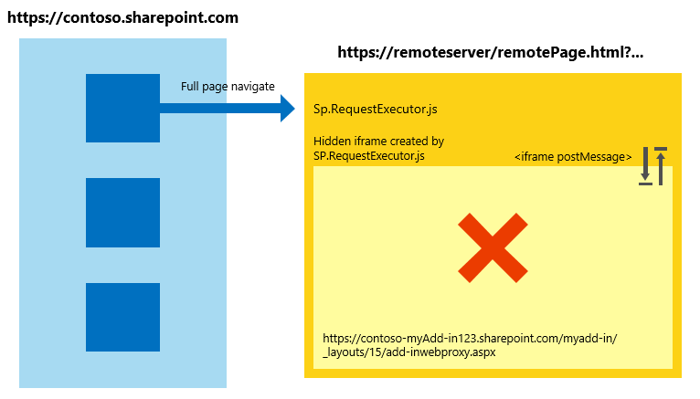

# Trabalhar com a biblioteca entre domínios entre diferentes zonas de segurança do Internet Explorer no SharePoint Add-ins
Saiba como usar a biblioteca do domínio cruzado em SharePoint 2013 quando as páginas da web e o suplemento de host estão em zonas de segurança diferentes no Windows Internet Explorer.
Se você estiver usando a biblioteca do SharePoint 2013 entre domínios para seus suplementos, você deve estar ciente do funcionam das zonas de segurança no Internet Explorer. O suplemento poderá encontrar alguns problemas de comunicação, se o site do SharePoint e o suplemento estão em zonas diferentes. Este artigo explica o que acontece quando você usa a biblioteca entre domínios em diferentes zonas de segurança do Internet Explorer.
  
    
    


## Cenários de zona cruzado no Internet Explorer usando a biblioteca do SharePoint entre domínios
<a name="bk_crosszonescenarios"> </a>

Por motivos de segurança, o Internet Explorer impede páginas que estão em diferentes níveis de integridade (também conhecido como zonas de segurança) compartilhar cookies, porque cada nível de integridade tem seu próprio repositório de cookie. O nível de integridade de uma página é determinado pela sua página de nível superior, e qualquer quadro dentro dessa página irá compartilhar o mesmo nível de integridade. Para obter mais informações, consulte  [Esteja ciente de compartilhamento de Cookie nos cenários de zona cruzado](http://blogs.msdn.com/b/ieinternals/archive/2011/03/10/internet-explorer-beware-cookie-sharing-in-cross-zone-scenarios.aspx).
  
    
    
A biblioteca do SharePoint entre domínios usa um ocultas **IFrame** e uma página de proxy do lado do cliente hospedado no SharePoint para habilitar a comunicação do cliente usando JavaScript. A biblioteca de entre domínios está disponível quando você faz referência o arquivo sp.requestexecutor.js em suas páginas. Para obter mais informações, consulte [Acessar dados do SharePoint 2013 de suplementos usando a biblioteca de domínio cruzado](access-sharepoint-2013-data-from-add-ins-using-the-cross-domain-library.md).
  
    
    
Quando a página de suplemento remota e o site do SharePoint estão em zonas de segurança diferentes, não não possível enviar os cookies de autorização. Se nenhum cookie de autorização, e o **IFrame** tentar carregar a página de proxy, ele será redirecionado para a página de entrada do SharePoint. Página de entrada do SharePoint não pode estar contida em um **IFrame** por motivos de segurança. Nesses cenários, a biblioteca não é possível carregar a página de proxy e comunicação com o SharePoint não é possível.
  
    
    
O diagrama a seguir mostra um cenário de zona cruzado no qual a página de proxy não pode ser carregada. A página superior coloca o quadro na zona de segurança como  `http://remoteserver/remotepage.html`. A página de proxy não carregar.
  
    
    

**Figura 1. Cenário de zona cruzado onde a página de proxy não pode ser carregada**

  
    
    

  
    
    

  
    
    
Eis alguns exemplos em que a biblioteca de domínio cruzado não poderá carregar a página de proxy:
  
    
    

- Seus clientes estão usando SharePoint Online, e sua página de suplemento remoto está hospedada em um servidor da intranet. Este cenário é propenso a página de proxy Carregando problema porque a URL do SharePoint Online não está geralmente na zona da intranet Local. Este é um cenário muito comum durante o desenvolvimento inicial de um suplemento porque você pode estar usando o IIS Express ou em outro servidor local para hospedar a página sem um domínio totalmente qualificado da internet.
    
  
- Seus clientes estão usando o SharePoint local com autenticação baseada em formulários e sua página remoto está hospedada em um serviço em nuvem (por exemplo, Microsoft Azure ).
    
  

## Manipulação de cenários de zona cruzado em Suplementos do SharePoint
<a name="bk_handlingcrosszone"> </a>

Há duas maneiras de resolver esse problema durante o desenvolvimento de suplemento (altamente recomendado) e suplemento tempo de execução.
  
    
    

### Práticas recomendadas: Use o padrão de apphost

Para lidar com um cenário de zona cruzado, recomendamos que você tenha uma página de apphost no SharePoint. A página de apphost é uma página do SharePoint que contém a página remota em um **IFrame**. Tudo dentro do **IFrame** na página apphost existe na zona de segurança como um suplemento de web. Biblioteca do domínio cruzado na página remota pode receber os cookies de autorização e carrega a página de proxy com êxito.
  
    
    
O diagrama a seguir mostra um cenário de zona cruzado sendo manipulado pelo usando o padrão de página apphost.
  
    
    

**Figura 2. Cenário de zona cruzado manipulação usando o padrão de página apphost**

  
    
    

  
    
    

  
    
    
O código necessário para a página apphost é simple. A parte principal da página apphost é um elemento **SPAppIFrame**. Você deve usar CSS para tornar o **IFrame** invisível para que ele não interfere no seu suplemento.
  
    
    
A marcação a seguir está um exemplo de uma página de apphost simples. A marcação executa as seguintes tarefas:
  
    
    

- Declara as diretivas necessárias ao usar os componentes do SharePoint.
    
  
- Declara estilos para tornar o **IFrame** invisível.
    
  
- Declara o **SPAppIFrame** e define o destino para a página inicial do suplemento.
    
  


```HTML

<%@ Page
    Inherits="Microsoft.SharePoint.WebPartPages.WebPartPage, Microsoft.SharePoint, Version=15.0.0.0, Culture=neutral, PublicKeyToken=71e9bce111e9429c" 
    language="C#" %>
<%@ Register 
    Tagprefix="SharePoint" 
    Namespace="Microsoft.SharePoint.WebControls" 
    Assembly="Microsoft.SharePoint, Version=15.0.0.0, Culture=neutral, PublicKeyToken=71e9bce111e9429c" %>
<%@ Register 
    Tagprefix="Utilities" 
    Namespace="Microsoft.SharePoint.Utilities" 
    Assembly="Microsoft.SharePoint, Version=15.0.0.0, Culture=neutral, PublicKeyToken=71e9bce111e9429c" %>
<%@ Register 
    Tagprefix="WebPartPages" 
    Namespace="Microsoft.SharePoint.WebPartPages" 
    Assembly="Microsoft.SharePoint, Version=15.0.0.0, Culture=neutral, PublicKeyToken=71e9bce111e9429c" %>

<html>
<head>
    <title>Your add-in page title</title>
    <style type="text/css">
        html, body
        {
            overflow:hidden;
        }
        
        body
        {
            margin:0px;
            padding:0px;
        }
         
        iframe 
        {
            border:0px;
            height:100%;
            width:100%;
        }
    </style>
</head>

<body>
    <SharePoint:SPAppIFrame 
        runat="server" 
        src="~remoteAppUrl/StartPage.html?{StandardTokens}" 
        frameborder="0">
    </SharePoint:SPAppIFrame>
</body>
</html>
```

Se desejar que os usuários link profundo em partes do seu suplemento, sua página apphost e o conteúdo do **IFrame** pode colaborar que possibilitam. Uma alternativa é usar a comunicação de pós-mensagem **IFrame** e URLs individuais por página no suplemento remoto. Para que os URLs individuais por página, você pode criar páginas individuais na web add-in ou usar os parâmetros de seqüência de consulta em uma página.
  
    
    

### Abordagem alternativa: adicione os sites para a mesma zona de segurança no Internet Explorer

Se um suplemento não foi projetado seguindo o padrão de apphost, você ainda pode permitir para funcionar com a adição de domínios a seguir na mesma zona de segurança:
  
    
    

- O domínio do seu site do SharePoint (por exemplo,  `https://contoso.sharepoint.com`).
    
  
- O domínio do hospedado em nuvem suplemento ( `http://remoteserver`).
    
  
- O domínio do hospedado pela Microsoft entrar páginas e serviços ( `*.microsoftonline.com`).
    
  
Os administradores podem usar diretivas do Active Directory para enviar alterações para todos os computadores na organização.
  
    
    

## Implicações de segurança do usando o padrão de apphost
<a name="bk_securityimplications"> </a>

É importante destacar o padrão de apphost efetivamente coloca sua página remoto na zona de segurança como um suplemento de web. Certifique-se de que você entenda as implicações da adição de um site para uma zona de segurança. Para obter mais informações, consulte  [como usar as zonas de segurança no Internet Explorer](http://support.microsoft.com/kb/174360).
  
    
    

## Trabalhando em outros navegadores: Firefox, Chrome e Safari
<a name="bk_otherbrowsers"> </a>

Outros navegadores, como Google Chrome, Mozilla Firefox e Apple Safari, não implementam o conceito de zona de segurança. Se um navegador não isolar os cookies em armazenamento separado, ele provavelmente não encontrará as dificuldades descritas neste artigo. Recomendamos que você siga o padrão de apphost no seu usando suplementos apphost padrão garante que o add-in funciona nos navegadores mencionados e o Internet Explorer, independentemente de qual zona de segurança SharePoint está em.
  
    
    

## Recursos adicionais
<a name="bk_addresources"> </a>


-  [Seguro cliente e o acesso a dados modelos de objeto para o SharePoint Add-ins](secure-data-access-and-client-object-models-for-sharepoint-add-ins.md)
    
  
-  [Acessar dados do SharePoint 2013 de suplementos usando a biblioteca de domínio cruzado](access-sharepoint-2013-data-from-add-ins-using-the-cross-domain-library.md)
    
  
-  [Suplementos do SharePoint](sharepoint-add-ins.md)
    
  
-  [Autorização e autenticação do SharePoint Add-ins](authorization-and-authentication-of-sharepoint-add-ins.md)
    
  
-  [Três maneiras de pensar sobre opções de design para o SharePoint Add-ins](three-ways-to-think-about-design-options-for-sharepoint-add-ins.md)
    
  
-  [Aspectos importantes do Add-in SharePoint arquitetura e desenvolvimento cenário](important-aspects-of-the-sharepoint-add-in-architecture-and-development-landscap.md)
    
  
-  [Host webs, suplemento webs e componentes do SharePoint no SharePoint 2013](host-webs-add-in-webs-and-sharepoint-components-in-sharepoint-2013.md)
    
  
-  [Armazenamento de dados no SharePoint Add-ins](important-aspects-of-the-sharepoint-add-in-architecture-and-development-landscap.md#Data)
    
  
-  [Criar uma página personalizada de proxy para a biblioteca entre domínios no SharePoint 2013](create-a-custom-proxy-page-for-the-cross-domain-library-in-sharepoint-2013.md)
    
  
-  [Segurança de domínio cruzado do lado do cliente](http://msdn.microsoft.com/en-us/library/cc709423%28v=vs.85%29.aspx)
    
  

