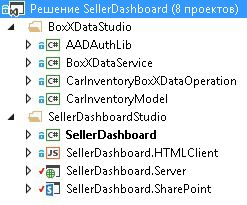
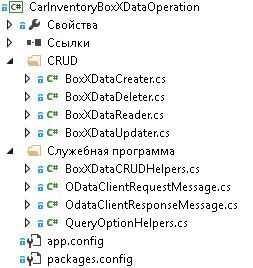
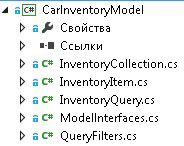
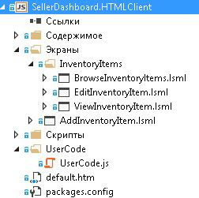
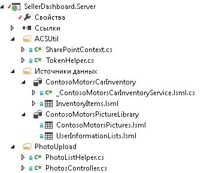
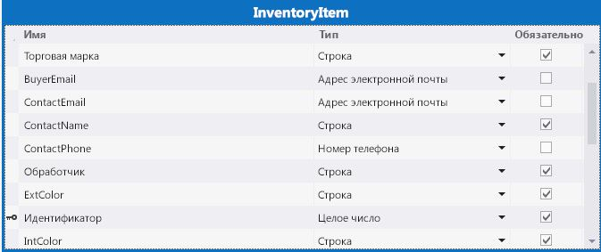
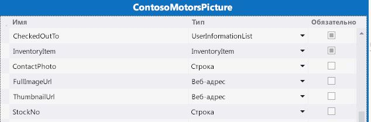
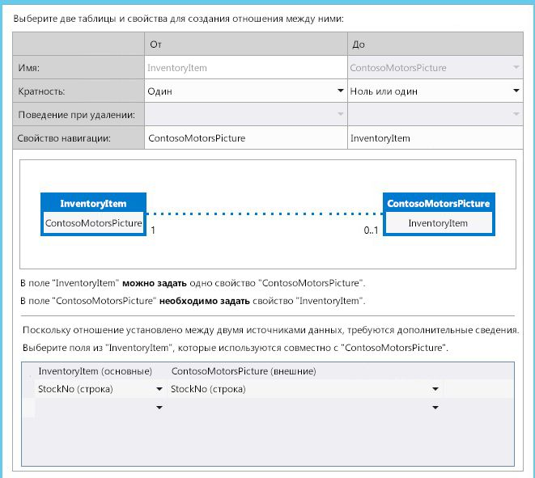
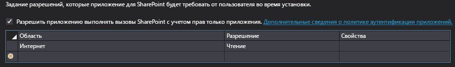

# Создание облачной бизнес-надстройки, использующей шлюз SAP
 Узнайте, как создать надстройку LightSwitch для SharePoint с размещением у поставщика для доступа к данным SAP с помощью шлюза SAP для Майкрософт.
В этой статье рассмотрены основные шаги, выполненные группой разработчиков Майкрософт при создании надстройки LightSwitch для SharePoint с размещением у поставщика, которая может получать доступ к данным SAP с помощью шлюза SAP для Майкрософт. Эта надстройка поддерживает операции CRUD с данными SAP, её можно использовать для просмотра библиотеки изображений SharePoint, а также отправки файлов в эту библиотеку.
  
    
    

Цель этой статьи — показать основные черты надстройки, которые могут пригодиться для создания аналогичных надстроек. В статье приведен соответствующий пример кода, чтобы можно было наглядно показать, как создается рабочее решение.
 **Загрузка примера.** [Пример: разработка облачной бизнес-надстройки для доступа к шлюзу SAP для Майкрософт](https://code.msdn.microsoft.com/Sample-Developing-a-Cloud-25d6d1ea)
  
    
    


## Подготовка к работе

Ниже представлены необходимые условия для процедур, описанных в этой статье.
  
    
    

- **Сайт разработчика Office 365**, размещенный в домене Office 365, который связан с областью клиентов Microsoft Azure Active Directory (Azure AD). См. статью [Получение подписки на Office 365 для разработчиков, настройка инструментов и среды, а также начало развертывания надстроек](http://msdn.microsoft.com/ru-ru/library/office/fp179924%28v=office.15%29.aspx) или [Создание сайта разработчика с помощью существующей подписки Office 365](http://msdn.microsoft.com/ru-ru/library/office/jj692554%28v=office.15%29.aspx)
    
  
- Выпуск **Visual Studio 2013 c обновлением 4** или более поздних версий, который можно скачать на веб-странице [Знакомство с Visual Studio 2013](http://msdn.microsoft.com/ru-ru/library/dd831853.aspx).
    
  
- **Инструменты разработчика Microsoft Office для Visual Studio.** Версия, включенная в обновление 4 (или более поздних версий) для Visual Studio 2013.
    
  
- **Шлюз SAP для Майкрософт** развертывается и настраивается в Microsoft Azure. Дополнительные сведения см. в документации для [шлюза SAP для Майкрософт](http://go.microsoft.com/fwlink/?LinkId=507635).
    
  
- **Учетная запись организации в Microsoft Azure.** См. раздел [Создание учетной записи пользователя организации в Azure AD](http://go.microsoft.com/fwlink/?LinkID=512580).
    
    > **Примечание**
      > Войдите в учетную запись Office 365 (login.microsoftonline.com), чтобы изменить временный пароль после ее создания. 
- **Конечная точка SAP OData** с демонстрационными данными в ней. См. документацию по [шлюзу SAP для Майкрософт](http://go.microsoft.com/fwlink/?LinkId=507635).
    
  
- **Базовые сведения о службе Azure AD.** См. статью [Начало работы с Azure AD](http://msdn.microsoft.com/ru-ru/library/azure/dn655157.aspx).
    
  
- **Базовые сведения о создании надстройки для SharePoint.** См. статью [Инструкции. Создание базовой надстройки для SharePoint с размещением на узле поставщика](http://msdn.microsoft.com/ru-ru/library/office/fp142381%28v=office.15%29.aspx).
    
  
- **Базовые сведения об OAuth 2.0 в Azure AD.** См. статью [OAuth 2.0 в Azure AD](http://msdn.microsoft.com/ru-ru/library/azure/dn645545.aspx) и ее разделы.
    
  

## Обзор решения

Contoso Motors — это вымышленная компания по продаже автомобилей, которая служит примером реальных предприятий такого плана. Дилерский центр этой компании предоставляет информацию о складе торговым представителям и другим дилерским центрам. С помощью этого приложения продавцы могут проверять текущее состояние склада автомобилей, к которому у надстройки есть прямой доступ из SAP через шлюз SAP для Майкрософт. Все данные хранятся в SAP, а изображение каждой машины — в библиотеке изображений SharePoint Online. Данные SAP и библиотеки изображений SharePoint объединяются и отображаются в надстройке. В ней менеджеры и администраторы могут выполнять стандартные операции CRUD с подробными данными о каждом автомобиле в SAP.
  
    
    
В примере этой статьи надстройка SellerDashboard управляет данными инвентаризации автомобилей из SAP и соответствующими изображениями в библиотеке изображений SharePoint. В этой надстройке стандартные операции CRUD (создание, чтение, обновление и удаление) можно выполнять с подробными сведениями о каждом автомобиле в SAP.
  
    
    

> **Совет**
> Видео с описанием надстройки:  [Технический вебинар — шлюз SAP для Майкрософт и модель разработки Microsoft Azure](http://go.microsoft.com/fwlink/?LinkId=517378) на портале BrightTalk. Демонстрация работы надстройки начинается с временной отметки 48:00.
  
    
    

 **Архитектура кода**
  
    
    
Решение SellerDashboard содержит восемь проектов. Как показано на изображении ниже, оно разделено на две категории: BoxXDataStudio и SellerDashboardStudio.
  
    
    

  
    
    

  
    
    

### BoxXDataStudio

Эта студия содержит все компоненты, необходимые для взаимодействия со шлюзом SAP для Майкрософт.
  
    
    

- **AADAuthLib**
    
    Этот компонент используется для выполнения  [потока Authorization Code Grant](https://msdn.microsoft.com/ru-ru/library/azure/dn645542.aspx), который использует шаблон Singleton.
    
    Фрагмент кода ниже показывает основную функцию компонента AADAuthLib. Дополнительные сведения см. во вспомогательном классе примера кода AADAuthLib/AuthUtil.cs.
    


 ```cs
  
// Use the auth code, acquire the refresh token and access token, and store them in the current session
        public bool AcquireTokenFromAuthCode(string authCode, string redirectUrl = "redirectUrl")
        {
            if (!IsAuthorized &amp;&amp; !string.IsNullOrEmpty(authCode))
            {
                AuthenticationResult authResult = _authContext.AcquireTokenByAuthorizationCode(authCode,
                    new Uri(ConfigurationManager.AppSettings["ida:" + redirectUrl]),
                    _clientCredential,
                    ConfigurationManager.AppSettings["ida:ResourceUrl"]);

                HttpContext.Current.Session["RefreshToken"] = authResult.RefreshToken;
                HttpContext.Current.Session["AccessToken-" + ConfigurationManager.AppSettings["ida:ResourceUrl"]] = new Tuple<string, DateTimeOffset>(authResult.AccessToken, authResult.ExpiresOn);

                return true;
            }

            return false;
  }

 // Provide the access token, which is stored in the current session, if the access token expired, use the refresh token get a new one.
 public string AccessToken
        {
            get
            {
                if (!IsAuthorized) throw new UnauthorizedAccessException();

                var accessToken = HttpContext.Current.Session["AccessToken-" + ConfigurationManager.AppSettings["ida:ResourceUrl"]] as Tuple<string, DateTimeOffset>;

                if (IsAccessTokenValid(accessToken))
                {
                    return accessToken.Item1;
                }

                accessToken = RenewAccessToken();
                HttpContext.Current.Session["AccessToken-" + ConfigurationManager.AppSettings["ida:ResourceUrl"]] = accessToken;

                return accessToken.Item1;
            }
  }
 ```

- **BoxXDataService**
    
    Это служба WCF RIA, представляющая собой интерфейс, который используется серверным компонентом SellerDashboard, размещенном в Azure, и использующая источник данных SAP через шлюз SAP для Майкрософт.
    
    Фрагмент кода ниже — это веб-метод CRUD, который поддерживает служба WCF RIA. Дополнительные сведения см. в файле BoxXDataService/BoxXDataService.cs.
    


 ```cs
  
[Query(IsDefault = true)]
        public IQueryable<InventoryItem> GetAllCarInventory()
        {
            BoxXDataReader dataReader = BoxXDataReader.Instance;
            IInventoryCollection dataCollection = ModelFactory.CreateInventoryCollection(dataReader.SchemaPropertyNames);
            IInventoryQuery query = QueryFactory.CreateQuery();
            dataReader.GetData(dataCollection, query);

            return dataCollection.Items.Cast<InventoryItem>().AsQueryable();
        }

        [Update]
        public void UpdateCarInventoryItem(InventoryItem carInventoryItem)
        {
            BoxXDataUpdater dataUpdater = BoxXDataUpdater.Instance;
            dataUpdater.UpdateInventoryItem(carInventoryItem);
        }

        [Insert]
        public void InsertCarInventoryItem(InventoryItem carInventoryItem)
        {
            BoxXDataCreater dataCreater = BoxXDataCreater.Instance;
            dataCreater.CreateInventoryItem(carInventoryItem);
        }

        [Delete]
        public void DeleteCarInventoryItem(InventoryItem carInventoryItem)
        {
            BoxXDataDeleter.DeleteInventoryItem(carInventoryItem.ID);
 }
 ```

- **CarInventoryBoxXDataOperation**
    
    Это внедрение операций CRUD для BoxXDataService. На изображении ниже показана архитектура основного кода CarInventoryBoxXDataOperation. Пространство имен CRUD используется для реализации операций CRUD, а пространство имен Util — это вспомогательный код для пространства имен CRUD.
    
     
  

  

  
- **CarInventoryModel**
    
    Это проект библиотеки, используемый для внедрения модели данных и служебных программ. Определение модели данных должно соответствовать метаданным конечной точки OData, которая используется шлюзом SAP для Майкрософт на базе схемы данных SAP. BoxXDataService и CarInventoryBoxXDataOperation используют ее для преобразования элемента базы данных SAP в экземпляр склада автомобилей.
    
    На изображении ниже показаны основные компоненты.
    
  

  
    
    

  
    
    

  
    
    

  
    
    

### SellerDashboardStudio

SellerDashboardStudio содержит стандартные компоненты надстройки LightSwitch для SharePoint.
  
    
    

- **SellerDashboard**
    
    SellerDashboard — это запускаемый проект, который используется для публикации надстройки SellerDashboard на веб-сайте Azure, а также надстройки SharePoint на сайте разработчика SharePoint.
    
  
- **SellerDashboard.HTMLClient**
    
    Этот компонент содержит экраны, пользовательский элемент управления и элемент управления для отправки фотографий. На изображении ниже показаны его основные компоненты.
    
  
- 
     
  

    SellerDashboard.HTML.Client содержит четыре экрана.
    
  - BrowseInventoryItems — начальный экран, который используется для просмотра основных сведений обо всех складских позициях.
    
  
  - ViewInventoryItem — подробный экран, который используется для отображения подробного представления по каждой складской позиции.
    
  
  - EditInventoryItem — всплывающий экран для редактирования, который используется для внесения изменений в данные о складской позиции.
    
  
  - AddInventoryItem — всплывающий экран для добавления, который используется для добавления новой складской позиции.
    
  

    Файл UserCode.js содержит код пользовательского элемента управления UX.
    
    Файлы photohelper.js и sharepointauthhelper.js, а также файлы папки сценариев созданы в соответствии с руководством, описанным в статье  [Пошаговое руководство. Создание надстройки для SharePoint с помощью LightSwitch](http://msdn.microsoft.com/ru-ru/library/jj969621.aspx).
    
  
- **SellerDashboard.Server**
    
    Этот компонент содержит источники данных WCF RIA и SharePoint, а также веб-API для отправки фотографий. На изображении ниже показаны его основные компоненты.
    
     
  

    SharePointContext.cs и TokenHelper.cs — вспомогательные классы, которые предоставляют контекст клиента для проверки подлинности в SharePoint. Это позволяет использовать веб-API для отправки фотографий, чтобы добавлять фотографии автомобилей в библиотеку изображений. Файлы PhotoListHelper.cs и PhotosController.cs внедряют веб-API для отправки фотографий. Дополнительные сведения о том, как надстройка LightSwitch использует веб-API для отправки фотографий, см. в статье  [Пошаговое руководство. Создание надстройки для SharePoint с помощью LightSwitch](http://msdn.microsoft.com/ru-ru/library/jj969621.aspx).
    
  
- **SellerDashboard.SharePoint**
    
    Этот компонент добавляется после решения LightSwitch, чтобы включить проект SharePoint. Его можно использовать, чтобы настроить сайт SharePoint, используемый для библиотеки изображений, и задать необходимое разрешение для надстройки. Для SellerDashboard необходимо предоставить уровень разрешений "Полный доступ" на сайте SharePoint, на котором размещена библиотека изображений.
    
  

## Реализация


  
    
    

### Обзор

На изображении ниже представлены компоненты, в состав которых входит SellerDashboard. Сплошная линия показывает поток данных, пунктирная — поток OAuth. Компоненты зеленого цвета относятся к операциям с данными SAP, синего — к операциям с библиотекой изображений SharePoint, а компоненты оранжевого цвета показывают операции с самим приложением SellerDashboard.
  
    
    
 **Решение SellerDashboard**
  
    
    

  
    
    

  
    
    

  
    
    

  
    
    

### Разнородные данные

LightSwitch поддерживает интеграцию данных благодаря добавлению связи между двумя источниками данных в конструкторе.
  
    
    
 **Источник данных SAP**
  
    
    

-  *Схема данных в базе данных SAP* 
    
    Во фрагменте кода ниже представлен пример схемы данных шлюза SAP для Майкрософт.
    


 ```XML
  
<?xml version="1.0" encoding="UTF-8"?> 
- <edmx:Edmx xmlns:sap="http://www.sap.com/Protocols/SAPData" xmlns:m="http://schemas.microsoft.com/ado/2007/08/dataservices/metadata" 
xmlns:edmx:"http://schemas.microsoft.com/ado/2007/06/edmx" Version="1.0">
   - <edmx:DataServices m:DataServiceVersion="2.0">
      - <Schema xml:lang="en" xmlns="http://schemas.microsoft.com/ado/2008/09/edm" Namespace="ZCAR_POC_SRV">
         - <EntityType sap:content-version="1" Name="ContosoMotors">
              - <Key>
                     <PropertyRef Name="ID"/>
               </Key>
               <Property Name="ContactPhone" Type="Edm.String"/>
               <Property Name="ContactEmail" Type="Edm.String"/>
               <Property Name="ID" Type="Edm.Int32" Nullable="false"/>
               <Property Name="BuyerEmail" Type="Edm.String" MaxLength="255"/>
               <Property Name="MaxPower" Type="Edm.Int32" Nullable="false"/>
               <Property Name="Engine" Type="Edm.String" Nullable="false" MaxLength="255"/>
               <Property Name="BodyStyle" Type="Edm.String" Nullable="false" MaxLength="255"/>
               <Property Name="Transmission" Type="Edm.String" Nullable="false" MaxLength="255"/>
               <Property Name="Year" Type="Edm.Int32" Nullable="false"/>
               <Property Name="Model" Type="Edm.String" Nullable="false" MaxLength="255"/>
               <Property Name="Brand" Type="Edm.String" Nullable="false" MaxLength="255"/>
               <Property Name="ExtColor" Type="Edm.String" Nullable="false" MaxLength="255"/>
              <Property Name="IntColor" Type="Edm.String" Nullable="false" MaxLength="255"/>
              <Property Name="ContactName" Type="Edm.String" Nullable="false" MaxLength="255"/>
              <Property Name="Price" Type="Edm.String" Nullable="false"/>
              <Property Name="StockNo" Type="Edm.String" Nullable="false"/>
              <Property Name="Arrived_Date" Type="Edm.DateTime" Nullable="false" Precision="0"/>
              <Property Name="Status" Type="Edm.String" Nullable="false" MaxLength="255"/>
      </EntityType>
   - <EntityContainer Name="ZCAR_POC_SRV_Entities" m:IsDefaultEntityContainer="true">
          <EntitySet sap:content-version="1" Name="ContosoMotorsCollection" sap:searchable="true" EntityType="ZCAR_POC_SRV.ContosoMotors"/>
     </EntityContainer>
     <atom:link xmlns:atom="http://www.w3.org/2005/Atom" href="http://contoso.cloudapp.net:8080/perf/sap/opu/odata/sap/ZCAR_POC_SRV/$metadata" rel="self"/>
     <atom:link xmlns:atom="http://www.w3.org/2005/Atom" href="http://contoso.cloudapp.net:8080/perf/sap/opu/odata/sap/ZCAR_POC_SRV/$metadata" rel="latest-version"/>
</Schema>
</edmx:DataServices>
</edms:Edmx>               

 ```


    Это наша тестовая база данных. Тип свойства и значение, допускающее значение null, зависит от сценария. ИД — это PropertyRef и основа операции CRUD OData. Свойство StockNo используется для интеграции данных с изображением автомобиля, которое хранится в библиотеке изображений SharePoint.
    
  
-  *Модель данных, которая задается для службы RIA* 
    
 ```cs
  
public interface IInventoryItem
    	{
        IEnumerable<InventoryPropertyName> ValidPropertyNames { get; }
        bool IsValid { get; }

        int ID { get; set; }
        DateTime ArrivedDate { get; set; }
        string BodyStyle { get; set; }
        string Brand { get; set; }
        string BuyerEmail { get; set; }
        string ContactEmail { get; set; }
        string ContactName { get; set; }
        string ContactPhone { get; set; }
        string Engine { get; set; }
        string ExtColor { get; set; }
        IEnumerable<Uri> Images { get; }
        string IntColor { get; set; }
        int MaxPower { get; set; }
        string Model { get; set; }
        decimal Price { get; set; }
        bool Removed { get; }
        string Status { get; set; }
        string StockNo { get; set; }
        string Transmission { get; set; }
        int Year { get; set; }

        void AddImageUrl(Uri url);
        bool CopyFrom(IInventoryItem other);
        object GetPropertyValue(InventoryPropertyName property);
        void MarkAsRemoved();
        void SetPropertyValue(InventoryPropertyName property, object value);
       }

    	public interface IInventoryCollection
       {
        IEnumerable<InventoryPropertyName> QueriedPropertyNames { get; }
        IEnumerable<IInventoryItem> Items { get; }
        bool Valid { get; }

        IInventoryItem this[int id] { get; }
        bool Contains(int id);
        void AddItem(IInventoryItem inventoryItem);
        IInventoryCollection Filter(Predicate<IInventoryItem> match);
        bool CopyFrom(IInventoryCollection other);
}

 ```


    Любое свойство, которое не включено в схему базы данных SAP, можно игнорировать. Например, свойство **Images** добавлено для масштабируемости. Эта модель данных — нечто среднее между реальной базой данных SAP и источником данных SellerDashboard.Server. Проект LightSwitch содержит два компонента: для просмотра и для сервера. При добавлении внешнего источника данных сервера приложение LightSwitch помогает создать слой абстрактных данных, который добавляется к источнику данных сервера.
    
    Большинство свойств имеют тот же тип, что и свойства в схеме базы данных SAP (кроме свойства StockNo). Его тип изменился с **int** на **string**, так как StockNo используется для определения связи между данными SAP и библиотекой изображений SharePoint.
    
    > **Совет**
      > Свойство StockNo должно иметь тип **String**, потому что для значения, сохраненного в библиотеке изображений SharePoint, указан тип **Text**. Эти два типа должны совпадать, чтобы можно было сделать данные разнородными.

    Оба интерфейса реализуются в файлах CarInventoryModel/InventoryItem.cs и CarInventoryModel/InventoryCollection.cs.
    
  
-  *Источник данных, используемый компонентом сервера LightSwitch* 
    
     
  

    При добавлении службы WCF RIA (BoxXDataService) на сервер SellerDashboard также добавляется модель данных, определенная в CarInventoryModel, и получается соответствующая таблица данных. Можно изменить тип некоторых свойств. Например, тип **BuyerEmail** можно изменить, указав вместо типа **String** тип **Email Address**, а приложение LightSwitch поддержит проверку формата электронной почты на стороне клиента.
    
  
 **Библиотека изображений SharePoint**
  
    
    
Библиотека изображений, размещенная на хост-сайте SharePoint, называется ContosoMotorsPictureLibrary и содержит три новых столбца с именами StockNo, ThumbnailUrl и FullImageUrl. Каждое из них настроено как поле типа **Text**.
  
    
    

> **Совет**
> Имена столбцов присваиваются с учетом регистра. 
  
    
    

 Столбец StockNo используется для создания связи с данными SAP. Столбцы ThumbnailUrl и FullImageUrl — для получения URL-адреса соответствующего изображения удобным способом.
  
    
    
 *Источник данных, используемый приложением LightSwitch со стороны сервера* 
  
    
    
ContosoMotorsPicture — это модель источника данных LightSwitch, которая указывает на библиотеку изображений хост-сайта SharePoint в компоненте сервера LightSwitch.
  
    
    

  
    
    

  
    
    
 **Связь данных**
  
    
    
Добавьте связь "один к нулю" или "один к одному" между InventoryItem и ContosoMotorsPicture. На изображении ниже показано, как это будет выглядеть при использовании LightSwitch в Visual Studio.
  
    
    

  
    
    

  
    
    

  
    
    

  
    
    

### OAuth, Azure AD и служба контроля доступа

В этом разделе рассматривается, как надстройка реализует OAuth в Azure AD и службе контроля доступа.
  
    
    
 **Обзор**
  
    
    
SellerDashboard — это размещенная у поставщика надстройка для SharePoint, которая должна работать с двумя источниками данных: библиотекой изображений SharePoint и данными SAP с помощью шлюза SAP для Майкрософт.
  
    
    
Чтобы иметь доступ к библиотеке изображений SharePoint, приложение SellerDashboard должно пройти проверку подлинности в службе контроля доступа и получить от нее маркер доступа. Но чтобы получить доступ к данным SAP, приложение SellerDashboard должно получить другой маркер доступа от Azure AD, так как шлюз SAP для Майкрософт использует Azure AD для проверки подлинности и авторизации.
  
    
    

  
    
    

  
    
    
 **Реализация**
  
    
    
SellerDashboard — это размещенная у поставщика надстройка для SharePoint, которая поддерживает отправку изображений с помощью клиентской объектной модели SharePoint. Контекст SharePoint, который используется для создания контекста клиента для узла SharePoint, кэшируется, а контекст клиента затем используется при передаче данных через веб-API.
  
    
    
Когда завершена авторизация с использованием OAuth и службы контроля доступа, запрос на проверку подлинности отправляется в Azure AD. Для этого надстройка использует файл cookie для входа на сайт Login.MicrosoftOnline.com и завершения потока кода авторизации Azure AD, который возвращает маркер обновления. Надстройка кэширует этот маркер на случай будущих запросов на проверку подлинности во время сеанса. Ниже представлен код, который при этом используется.
  
    
    



```cs

protected override void Page_Load(object sender, EventArgs e)
{
    if (!IsPostBack)
    {
 SharePointContext spContext = SharePointContextProvider.Current.GetSharePointContext(Context);
        if (spContext != null)
        {
     // Cache the SharePoint Context, which will be used to create Client Context for SharePoint host
            _spContext = spContext;
        }

		
        // Acquire refresh token and access token, and store them in the current session, which will be used do the OAuth with AAD for operating the SAP data
        AuthUtil.Instance.AcquireTokenFromAuthCode(Request.QueryString["code"]);

        if (!AuthUtil.Instance.IsAuthorized)
        {
             Response.Redirect(AuthUtil.Instance.AuthCodeUrl);
        }
     }

     base.Page_Load(sender, e);
 }
```

Дополнительные сведения см. в файлах SellerDashBoard.Server/SharePointLaunch.aspx.cs и AADAuthLib/AuthUtil.cs, указанных в примере кода.
  
    
    
SellerDashboard.Server содержит файлы SharePointContext.cs и TokenHelper.cs, которые используются для получения контекста клиента только для надстройки для узла SharePoint. Набор Visual Studio автоматически добавляет эти файлы в проект SharePoint и присваивает ему имя < *имя_вашего_проекта*  >Web (например, SharePointAppWeb). Затем можно скопировать эти файлы в код источника надстройки SellerDashboard и включить их в свой проект.
  
    
    

### Операции CRUD с данными SAP с помощью шлюза SAP для Майкрософт

Фрагменты кода ниже показывают основную логику кода для операций CRUD. Дополнительные сведения см. в варианте реализации CarInventoryBoxXDataOperation в примере кода.
  
    
    
 **BoxXDataCreater**
  
    
    



```cs

        public void CreateInventoryItem(IInventoryItem inventoryItem)
        {
            if (_model == null)
            {
                _model = BoxXDataCRUDHelpers.GetMetadata(BoxXDataCRUDHelpers.MetadataUrl);
            }

            // Create new entry request generate
            var requestMessage = new ODataClientRequestMessage(new Uri(BoxXDataCRUDHelpers.DataCollectionUrl),
                                                                ODataConstants.MethodPost);
            BoxXDataCRUDHelpers.CreateEntryRequestHeaderSetter(requestMessage, AuthUtil.Instance.AccessToken);
            BoxXDataCRUDHelpers.SetODataRequestContent(requestMessage, _model, inventoryItem);

            // Create new entry request execute
            IODataResponseMessage responseMessage = requestMessage.GetResponse();

        }
BoxXDataReader
 public void GetData(IInventoryCollection dataCollection, IInventoryQuery query)
        {
            GetValueWithoutLocallyFiltering(dataCollection, query);

            if (query.Filters.Any())
            {
                var filteredCollection = dataCollection.Filter(inventoryItem =>
                    query.Filters.Any(filter => filter.Match(inventoryItem)));

                dataCollection.CopyFrom(filteredCollection);
            }
        }
```

 **BoxXDataUpdater**
  
    
    



```cs

public void UpdateInventoryItem(IInventoryItem inventoryItem)
        {
            if (_model == null)
            {
                _model = BoxXDataCRUDHelpers.GetMetadata(BoxXDataCRUDHelpers.MetadataUrl);
            }

            // Update existing entry request generate
            var requestMessage = new ODataClientRequestMessage(new Uri(BoxXDataCRUDHelpers.DataCollectionUrl + '(' + inventoryItem.ID + ')'),
                                                                ODataConstants.MethodPut);
            BoxXDataCRUDHelpers.UpdateEntryRequestHeaderSetter(requestMessage, AuthUtil.Instance.AccessToken);
            BoxXDataCRUDHelpers.SetODataRequestContent(requestMessage, _model, inventoryItem);

            // Update existing entry request execute
            IODataResponseMessage responseMessage = requestMessage.GetResponse();
        }
BoxXDataDeleter
 public static void DeleteInventoryItem(int ID)
        {
            // Delete existing entry request generate
            var requestMessage = new ODataClientRequestMessage(new Uri(BoxXDataCRUDHelpers.DataCollectionUrl + '(' + ID + ')'),
                                                                ODataConstants.MethodDelete);
            BoxXDataCRUDHelpers.DeleteEntryRequestHeaderSetter(requestMessage, AuthUtil.Instance.AccessToken);

            // Delete existing entry request execute
            IODataResponseMessage responseMessage = requestMessage.GetResponse();
        }
```


### Отправка фотографий в библиотеку изображений SharePoint

Для отправки фотографий в библиотеку изображений SharePoint нужны соответствующие элемент управления и реализованный веб-интерфейс API. При этом используется код, представленный ниже, который создан в соответствии с инструкциями, описанными в статье  [Пошаговое руководство. Создание надстройки для SharePoint с помощью LightSwitch](http://msdn.microsoft.com/ru-ru/library/jj969621.aspx).
  
    
    
 **Чтобы изменить файл photohelper.js:**
  
    
    
В uploadForm добавляется новое поле, которое используется для передачи столбца StockNo в веб-API для отправки фотографий.
  
    
    



```

uploadForm = $(
             '<form id="uploadForm" method="POST" enctype="multipart/form-data" action="' + API_URL + '"  data-ajax="false" target="uploadTargetIFrame">' +
             '   <input name="fileInput" id="fileInput" type="file" size="30" data-theme="c" accept="image/*" multiple="true"/>' +
             '   <input type="hidden" name=' + screen.InventoryItem.StockNo + '>' +
             '</form>');

```

Добавьте логику для кэширования URL-адреса изображения, а также логику для обратного преобразования изображения.
  
    
    



```

function completeUpload(uploadedFiles) {
            var fullImageUrl = uploadedFiles[0];
            var photoNameWithExt = fullImageUrl.substr(fullImageUrl.lastIndexOf('/') + 1);
            var photoNameWithoutExt = photoNameWithExt.substr(0, photoNameWithExt.lastIndexOf("."));
            var photoPathUri = fullImageUrl.substr(0, fullImageUrl.lastIndexOf('/'));
            var photoExt = photoNameWithExt.substr(photoNameWithExt.lastIndexOf(".") + 1, photoNameWithExt.length);
            var thumbnailUrl = photoPathUri + "/_t/" + photoNameWithoutExt + "_" + photoExt + ".jpg";
            setCacheUrl(screen.InventoryItem.StockNo, fullImageUrl + "*#00#" + thumbnailUrl);
            setDetailsCarPicture(fullImageUrl);
            screen.closePopup();
        }
```

 **Чтобы изменить PhotosController.cs:**
  
    
    
Для узла SharePoint используйте контекст клиента только для приложения, который создается с помощью кэшированного контекста SharePoint.
  
    
    
Это необходимо, так как ContosoMotorsPictureLibrary относится не к надстройке SellerDashboard, а к хост-сайту SharePoint. Кроме того, при удалении фотографий удаляется соответствующий код.
  
    
    



```cs

private ClientContext AppWebContext
    {
        get
        {
            if (appWebContext == null)
            {
                appWebContext = SharePointLaunch.getAppWebContext();
            }
            return appWebContext;
        }
    }

```

 **Чтобы изменить PhotoListHelper.cs:**
  
    
    
Добавьте логику обновления изображения, которая удалит старый элемент изображения (если он существует) и добавит новый. Назначьте StockNo для нового элемента изображения, одновременно задав ему значения FullImageUrl и ThumbnailUrl.
  
    
    



```cs

            // Delete the old picture item
            foreach (ListItem item in items)
            {
                if (!string.IsNullOrEmpty((string)(item["StockNo"])))
                {
                    string tempStockNo = item["StockNo"].ToString();
                    if (tempStockNo.Equals(stockNo))
                    {
                        item.DeleteObject();
                        siteContext.ExecuteQuery();
                        break;
                    }
                }
            }

            // Update the new picture item
            foreach (ListItem item in items)
            {
                string fullImageName = item["FileLeafRef"].ToString();
                string thumbnailName = fullImageName.Replace('.', '_') + ".jpg";

                if (photoUri.Contains(fullImageName))
                {
                    item["StockNo"] = stockNo;
                    item["FullImageUrl"] = photoUri;
                    item["ThumbnailUrl"] = photoUri.Replace(fullImageName, "_t/" + thumbnailName);
                    item.Update();
                    siteContext.ExecuteQuery();
                    break;
                }
            }



```


### Взаимодействие с пользователем

По специальному запросу сценария многие пользовательские элементы управления реализуются для поддержки этого запроса. Соответствующий код можно найти в файле UserCode.js. Простой пользовательский интерфейс можно быстро создать с помощью конструктора LightSwitch. Шаблон "Набор общих экранов" может соответствовать пробному запросу. Вопрос взаимодействия с пользователем не рассматривается подробно в этом документе, так как это не его основная тема.
  
    
    

## Развертывание приложения

Выполните действия, описанные в этом разделе, чтобы развернуть надстройку. Перед её развертыванием убедитесь, что шлюз SAP для Майкрософт был развернут и настроен для клиента Azure.
  
    
    

### Создание веб-сайта Azure


1. Войдите на  [портал Microsoft Azure](http://go.microsoft.com/fwlink/?LinkID=512959) как глобальный администратор.
    
  
2. В меню слева выберите элемент **Веб-сайты**.
    
    > **Примечание**
      > Этот веб-сайт необходимо использовать, чтобы разместить на сервере поставщика надстройку SharePoint для SellerDashboard. 
3. На панели команд в нижней части страницы выберите элемент **Создать**.
    
  
4. Выберите элементы **Вычисления > Веб-сайт > Быстрое создание**.
    
  
5. В поле **URL-адрес** введите первую часть необходимого URL-адреса, а затем последовательно выберите элементы "План размещения веб-сайтов" и **Создание веб-сайта**. Скопируйте этот URL-адрес, так как он вам понадобится для регистрации надстройки (как это сделать, описано ниже). Например, укажите Constoso.azurewebsites.net.
    
  

### Регистрация приложения SharePoint

Пустая надстройка для SharePoint используется для того, чтобы предоставить надстройке для SharePoint разрешения на чтение, необходимые для извлечения изображений автомобилей из библиотеки изображений в службе SharePoint Online. Выполните действия, указанные ниже, чтобы зарегистрировать надстройку для SharePoint на сайте SharePoint, на котором размещена эта библиотека, и предоставить этой надстройке доступ к сайту для чтения.
  
    
    

### Регистрация надстройки для SharePoint


1. Откройте решение в обозревателе решений.
    
  
2. В окне свойств надстройки для SharePoint введите **URL-адрес сайта** SharePoint, содержащего библиотеку изображений. Когда отобразится соответствующий запрос, войдите на сайт в качестве владельца.
    
  
3. Задайте разрешение на чтение в манифесте приложения.
    
     
  

  

  
4. Укажите надстройку как запускаемый проект и запустите проект. Значения ClientID и ClientSecret можно найти в файле ContosoMotorsCarInventoryWeb/Web.config. Код должен выглядеть так:
    
 ```XML
  
<add key="ClientId" value="06af1059-8916-4851-a271-2705e8cf53c6"/>
<add key="ClientSecret" value="LypZu2yVajlHfPLRn5J2hBrwCk5aBOHxE4PtKCjIQkk="/>
 ```

5. Замените значения ClientID и ClientSecret в разделе "Hosted app configuration" (Конфигурации размещенний надстройки) файла ContosoMotorsCarInventoryWeb/TokenHelper.cs значениями, указанными выше. Код должен выглядеть так:
    
 ```cs
  
private static readonly string ClientId = "06af1059-8916-4851-a271-2705e8cf53c6";
private static readonly string ClientSecret = "LypZu2yVajlHfPLRn5J2hBrwCk5aBOHxE4PtKCjIQkk=";

 ```


### Регистрация веб-приложения в Azure AD

В этом разделе описывается, как зарегистрировать пример надстройки на портале управления Azure.
  
    
    

1. Войдите на  [портал управления Azure](http://go.microsoft.com/fwlink/?LinkID=512959) с помощью учетной записи администратора службы Azure или соадминистратора.
    
  
2. В области навигации слева выберите элемент **Active Directory**.
    
  
3. На странице Active Directory выберите каталог, настроенный для шлюза SAP для Майкрософт.
    
    > **Совет**
      >  Если вы не знаете, какой каталог использовался, обратитесь к администратору шлюза SAP для Майкрософт. Совет: это каталог, содержащий пользователей и группы шлюза SAP для Майкрософт.
4. На верхней панели навигации выберите элемент **ПРИЛОЖЕНИЯ**.
    
  
5. В нижней части страницы выберите элемент **Добавить**.
    
  
6. В открывшемся диалоговом окне выберите элемент **Добавить приложение, разрабатываемое моей организацией**.
    
  
7. В диалоговом окне **Добавление приложения** введите имя приложения, например SellerDashboard.
    
  
8. Выберите тип приложения **Веб-приложение и/или веб-API** и щелкните стрелку вправо.
    
  
9. В диалоговом окне **Добавить свойства** укажите URL-адрес созданного ранее сайта (в разделе создания веб-сайта Azure) в качестве URL-АДРЕСА ВХОДА. Например, *https://Constoso.azurewebsites.net*  .
    
  
10. В поле **URI КОДА ПРИЛОЖЕНИЯ** присвойте приложению уникальный универсальный код ресурса (URI). Можно использовать имя приложения, добавленное в конец **URL-АДРЕСА ВХОДА**. Например,  *https://Constoso.azurewebsites.net/SellerDashboard*  , где Constoso.azurewebsites.net — ранее созданный сайт.
    
  
11. Щелкните флажок, чтобы создать приложение. 
    
    Откроется панель мониторинга Azure для приложения, где будет показано сообщение об успешном выполнении.
    
  

> **Примечание**
> Необходимо дважды зарегистрировать надстройку с помощью Azure AD: один раз для отладки, второй — для развертывания в рабочей среде, как описано в шаге 10. > Чтобы зарегистрировать надстройку для отладки, используйте **URL-АДРЕС ВХОДА** и **URI КОДА ПРИЛОЖЕНИЯ** с URL-адресом отладки проекта SellerDashboard.Server, чтобы можно было запустить отладчик Visual Studio (F5). Этот URL-адрес будет выглядеть так: https://localhost. *nnnn*  , где *nnnn*  — номер порта. Этот URL-адрес можно найти в области свойств в Visual Studio.> Затем, когда вы будете готовы к развертыванию в рабочей среде, укажите правильный URL-адрес продукта для регистрации. 
  
    
    


### Настройка параметров приложения

Настройте параметры приложения, созданного на предыдущем шаге. 
  
    
    

1. В верхней части страницы приложения выберите элемент **Настройка**.
    
  
2. Настройте требуемые параметры и запомните или запишите параметры конфигурации, как описано в следующей таблице.
    

|**Параметр**|**Действие**|
|:-----|:-----|
|Идентификатор клиента  <br/> |Скопируйте значение, которое отображается в поле "Идентификатор клиента".  <br/> |
|Секрет клиента  <br/> | Создайте новый ключ приложения: <br/>  В разделе "Ключи" выберите длительность действия ключа (1 или 2 года). <br/>  На панели команд в нижней части страницы нажмите кнопку **Сохранить**.  <br/>  Теперь отобразится значение ключа. <br/>  Скопируйте и сохраните его для использования в будущем. Вы не сможете получить его после закрытия страницы. <br/> |
|URI кода приложения  <br/> |Скопируйте значение, которое отображается в поле **URI кода надстройки**.  <br/> |
   

    Держите эти сведения под рукой, так как они вам понадобятся чуть позже.
    
  
3. В разделе **Разрешения для других приложений** выполните такие действия:
    
1. Выберите приложение для шлюза SAP для Майкрософт.
    
  
2. В столбце **Делегированные разрешения** установите флажки разрешений для шлюза SAP для Майкрософт, необходимых надстройке для SharePoint с размещением у поставщика для SellerDashboard.
    
  
4. На панели команд в нижней части страницы нажмите кнопку **Сохранить**.
    
  

### Изменение конфигурации, необходимой для развертывания


1. Найдите файл SellerDashboardHTMLClient/UserCode.js и такой заполнитель кода:
    
 ```cs
  
sharePointUrl: "Replace with your SharePoint host site",
// https://fake_domain.sharepoint.com/sites/Developer
SharePointRootUrl: "Replace with your SharePoint root site"
 // https://fake_domain.sharepoint.com/ 

 ```


1. Измените значение sharePointUrl на адрес сайта SharePoint, где будет установлена надстройка и который содержит библиотеку изображений.
    
  
2. Измените значение sharePointRootUrl на адрес соответствующего корневого сайта SharePoint.
    
  
2. Найдите файл SellerDashboard.Server/Web.config в решении SellerDashboard и такой заполнитель конфигурации:
    
 ```XML
  
<add key="ClientSecret" value="MwMp1yxOyy8BGhfD5d9VvuqlRbhaqWESxVNLzgpYNHU=" />
<add key="ClientId" value="ed138b32-c89d-4f22-b74d-7d9d5044b260" />
<add key="Ida:ClientId" value="Replace with Azure register add-in client id" />
<add key="Ida:ClientSecret" value="Replace with Azure register add-in client secret" />
<add key="Ida:TenantId" value="Replace with the SAP Gateway for Microsoft tenant domain, for example <yourDomain>.onmicrosoft.com" />
<add key="Ida:RedirectUrl" value="Replace with the Azure host site, for example https://contoso.azurewebsites.net/SharePointLaunch.aspx" />
<add key="Ida:ResourceUrl" value="Replace with the SAP Gateway for Microsoft instance, for example http://contoso.cloudapp.net/" />
<add key="Ida:ODataServiceBaseUrl" value="Replace with the SAP OData endpoint url, for example https://contoso.cloudapp.net:8081/perf/sap/opu/odata/sap/ZCAR_POC_SRV/" />
<add key="Ida:ODataServiceMetadataUrl" value="Replace with the SAP OData endpoint metadata url, for example https://contoso.cloudapp.net:8081/perf/sap/opu/odata/sap/ZCAR_POC_SRV/$metadata" />
<add key="Ida:DataCollection" value="Replace with OData EntitySet name, for example ContosoMotorsCollection" />
<add key="Ida:ODataFeedOrEntryFormat" value="application/atom+xml" />
<add key="Ida:ODataMetadataFormat" value="application/xml" />
<add key="Ida:ODataContentType" value="application/xml" />
<add key="Ida:ODataVersion" value="2.0" />
<add key="Ida:ODataMaxVersion" value="3.0" />
<add key="Ida:ODataWriterTypeName" value="Replace with the OData EntityType, for example ZCAR_POC_SRV.ContosoMotors" />
<add key="Ida:DefaultID" value="1024" />
<add key="Ida:DefaultStockNo" value="2048" />
<add key="Ida:SPPicLib" value="Replace with you picture library name, for example ContosoMotorsPictureLibrary" />
 ```


1. Замените значения ClientId и ClientSecret значениями, полученными на предыдущем шаге.
    
  
2. Замените значения Ida:ClientId и Ida:ClientSectet значениями из приложения Azure AD.
    
  
3. Измените значение Ida:TenantId на < *ваш_домен*  >.onmicrosoft.com.
    
    Например, если учетная запись вашей организации proverka@< *ваш_домен*  >.onmicrosoft.com, то вам нужно значение < *ваш_домен*  >.onmicrosoft.com.
    
  
4. Замените значение Ida:RedirectUrl адресом тестового сайта, созданного на портале Azure, на котором размещена эта надстройка.
    
  
5. Замените значение Ida:ResourceUrl экземпляром шлюза SAP для Майкрософт, который был развернут и настроен в Azure.
    
  
6. Измените значение Ida:ODataServiceBaseUrl на URL-адрес конечной точки OData экземпляра шлюза SAP для Майкрософт.
    
  
7. Измените значение Ida:ODataServiceMetadataUrl на URL-адрес метаданных конечной точки OData экземпляра шлюза SAP для Майкрософт.
    
  
8. Замените значение Ida:DataCollection. Его можно получить из метаданных. Например, используйте ContosoMotorsCollection.
    
  
9. Замените значение Ida:ODataWriterTypeName. Правильное значение можно получить из метаданных. 
    
    Воспользуйтесь примером ниже.
    


 ```XML
  
ZCAR_POC_SRV.ContosoMotors

<EntityContainer Name="ZCAR_POC_SRV_Entities" m:IsDefaultEntityContainer="true">
     <EntitySet sap:content-version="1" Name="ContosoMotorsCollection" sap:searchable="true" EntityType="ZCAR_POC_SRV.ContosoMotors"/>
</EntityContainer>
<atom:link xmlns:atom="http://www.w3.org/2005/Atom" href="http://contoso.cloudapp.net:8080/perf/sap/opu/odata/sap/ZCAR_POC_SRV.ContosoMotors"/>
 ```

10. Замените значение Ida:SPPicLib именем библиотеки изображений, созданной на хост-сайте SharePoint.
    
  

### Публикация проекта


1. Найдите проект SellerDashboard в решении SellerDashboard.
    
  
2. Щелкните SellerDashboard правой кнопкой мыши, чтобы опубликовать проект.
    
  
3. Выберите элемент **Размещено у поставщика**.
    
  
4. Выберите элемент **Windows Azure**.
    
  
5. Войдите с правами глобального администратора.
    
  
6. Выберите веб-сайт, созданный в Azure.
    
  
7. Укажите, что необходимо использовать HTTPS.
    
  
8. Используйте строку подключения данных по умолчанию.
    
  
9. Укажите в качестве хост-сайта веб-сайт, созданный в Azure, введите значения ClientId и ClientSecret, полученные на предыдущем шаге.
    
  
10. Опубликуйте.
    
     Вы получите опубликованный пакет.
    
  

### Установка приложения


1. Войдите на сайт развертывания SharePoint с правами администратора.
    
  
2. На домашней странице сайта выберите элемент **Создайте надстройку для развертывания**.
    
  
3. Выберите пакет, полученный при публикации.
    
  
4. Разверните его и внесите в список доверенных.
    
  

## Список внешних кодов


  
    
    


|**Веб-источник**|**Коллекция**|**Расположение кода**|**Лицензия**|
|:-----|:-----|:-----|:-----|
| [Учебник по надстройкам для проведения опросов. Разработка надстройки для SharePoint с помощью LightSwitch](http://code.msdn.microsoft.com/Survey-App-Tutorial-a70d0afd) <br/>  [Пошаговое руководство. Создание надстройки для SharePoint с помощью LightSwitch](http://msdn.microsoft.com/ru-ru/library/jj969621.aspx) <br/> |**Средство отправки фотографий:** <br/> PhotoListHelper.cs  <br/> PhotosController.cs  <br/> Global.asax.cs  <br/> | [Учебник по надстройкам для проведения опросов. Разработка надстройки для SharePoint с помощью LightSwitch (C#)](http://www.getcodesamples.com/src/2571E87E/) <br/> |Apache License 2.0  <br/> |
|null  <br/> |**Проверка подлинности службы контроля доступа:** <br/> SharePointContext.cs  <br/> TokenHelper.cs  <br/> |**Внутренние шаблоны VS:** <br/> Visual C#/Office/SharePoint/Apps/AppforSharePoint  <br/> ||
   

