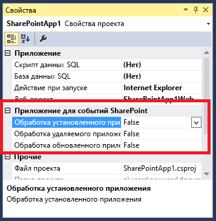

# Создание приемника событий надстройки в надстройках для SharePoint
Создание обработчиков для событий установки и удаления Надстройка SharePoint в Надстройки SharePoint.
## Необходимые условия
<a name="SP15appevent_prereq"> </a>

В этой статье предполагается, что вы уже имеете представление о Надстройки SharePoint с размещением у поставщика, а также создали несколько приложений, которые хоть немного сложнее, чем "Hello World". Кроме того, предполагается, что вы прочли статью  [Обработка событий в надстройках SharePoint](handle-events-in-sharepoint-add-ins.md). 
  
    
    

## Дополнительные примеры кода
<a name="SP15appevent_prereq"> </a>

Ознакомившись с развернутым примером, приведенным в этой статье, вы получите готовый пример кода. Ниже представлены другие примеры. Не все они соответствуют архитектуре, описанной в этой статье. Существует несколько хороших способов создать приемник событий надстроек. Кроме того, помните, что руководства от Майкрософт могут изменяться со временем. 
  
    
    

-  [OfficeDev/PnP/Samples/Core.AppEvents.HandlerDelegation](https://github.com/OfficeDev/PnP/tree/master/Samples/Core.AppEvents.HandlerDelegation) во многом совпадает с развернутым примером в этой статье.
    
  
-  [OfficeDev/PnP/Samples/Core.AppEvents](https://github.com/OfficeDev/PnP/tree/master/Samples/Core.AppEvents) показывает, как выполнить ту же задачу, что и в предыдущем примере, в сценариях, в которых нельзя использовать стратегию делегирования обработчиков.
    
  
-  [OfficeDev/PnP/Samples/Core.EventReceivers](https://github.com/OfficeDev/PnP/tree/master/Samples/Core.EventReceivers)
    
  
-  [Создание размещаемой у поставщика надстройки для настройки установки надстроек](https://code.msdn.microsoft.com/SharePoint-2013-Create-a-f27752e0)
    
  

## Добавление приемника события установки надстройки
<a name="SP15appevent_prereq"> </a>


1. Откройте в Visual Studio проект размещаемого у поставщика Надстройка SharePoint (при добавлении обработчика события к надстройке, размещаемой в SharePoint, Инструменты разработчика Office для Visual Studio преобразует ее в надстройку, размещаемую у поставщика).
    
  
2. В **Обозревателе решений** выберите узел для Надстройка SharePoint.
    
  
3. В окне **Свойства** задайте для параметра **Управление установленными надстройками** значение **True**. 
    
   **Рис. 1. События надстроек в окне свойств**

  

     
  

    Инструменты разработчика Office для Visual Studio сделает следующее:
    
  - Добавит файл с именем AppEventReceiver.svc, который содержит заготовку кода на языке C# (или VB.NET). Это служба, которая будет обрабатывать событие надстройки.
    
  
  - В раздел **Свойства** файла AppManifest.xml добавляется следующая запись: `<InstalledEventEndpoint>~remoteAppUrl/AppEventReceiver.svc</InstalledEventEndpoint>`. Она регистрирует приемник событий надстройки в SharePoint. (Обратите внимание, что маркер **~remoteAppUrl** также используется для удаленного веб-приложения в размещаемом у поставщика Надстройка SharePoint. Инструменты разработчика Office для Visual Studio предполагает, что домены веб-приложения и обработчика события совпадают. В редких случаях, когда это не так, необходимо вручную заменить маркер **~remoteAppUrl** настоящим доменом службы.)
    
  
  - Если в проекте Надстройка SharePoint еще нет веб-проекта, Инструменты разработчика Office для Visual Studio создают его. Инструменты также обеспечивают настройку манифеста надстройки для размещения у поставщика. Кроме того, они добавят страницы, сценарии, CSS-файлы и другие элементы. (Если из удаленных компонентов надстройки требуется только веб-служба обработки событий, вы можете удалить их из проекта. Кроме того, следует обеспечить, что элемент **StartPage** в манифесте надстройки не указывает на удаленную страницу.)
    
  
4. Если Visual Studio и ваша тестовая ферма SharePoint развернуты на разных компьютерах, настройте проект для отладки с помощью служебной шины Microsoft Azure. Дополнительные сведения см. в статье  [Устранение неполадок и отладка удаленного приемника событий в надстройке для SharePoint](debug-and-troubleshoot-a-remote-event-receiver-in-a-sharepoint-add-in.md). 
    
  
5. Если в файле AppEventReceiver.svc есть метод  `ProcessOneWayEvent`, его реализация должна содержать только строку  `throw new NotImplementedException();`, поскольку этот метод невозможно использовать в обработчике событий надстройки.  *Обработчики событий надстройки должны возвращать объект, который сообщает среде SharePoint, следует ли завершить событие или отменить его, а метод  `ProcessOneWayEvent` не возвращает никаких данных.* 
    
  
6. Файл будет включать метод  `ProcessEvent`, который имеет следующий вид. (Он также может содержать блок кода, который иллюстрирует получение контекста клиента. Удалите или закомментируйте его.) 
    
    Обратите внимание на следующие особенности этого кода:
    
  - Объект  [SPRemoteEventProperties](https://msdn.microsoft.com/library/Microsoft.SharePoint.Client.EventReceivers.SPRemoteEventProperties.aspx) отправляется веб-службе обработчика в виде сообщения SOAP, которое содержит контекстные сведения из SharePoint, включая свойство [EventType](https://msdn.microsoft.com/library/Microsoft.SharePoint.Client.EventReceivers.SPRemoteEventProperties.EventType.aspx) , которое идентифицирует событие.
    
  
  - Объект  [SPRemoteEventResult](https://msdn.microsoft.com/library/Microsoft.SharePoint.Client.EventReceivers.SPRemoteEventResult.aspx) , возвращаемый обработчиком, содержит свойство [Status](https://msdn.microsoft.com/library/Microsoft.SharePoint.Client.EventReceivers.SPRemoteEventResult.Status.aspx) , которое может принимать значения [SPRemoteEventServiceStatus](https://msdn.microsoft.com/library/Microsoft.SharePoint.Client.EventReceivers.SPRemoteEventServiceStatus.aspx) . **Continue**, **SPRemoteEventServiceStatus.CancelNoError** и **SPRemoteEventServiceStatus.CancelWithError**. По умолчанию свойство **Status** имеет значение **Continue**, которое сообщает среде SharePoint, что необходимо завершить событие. Остальные два значения сообщают SharePoint, что нужно:
    
  - Повторно запустить обработчик до трех раз.
    
  
  - Если по-прежнему возвращается состояние отмены, отменить событие и отменить все действия, выполненные в рамках события. 
    
  


 ```cs
  
public SPRemoteEventResult ProcessEvent(SPRemoteEventProperties properties)
{
    SPRemoteEventResult result = new SPRemoteEventResult();

    return result;
}
 ```

7. Сразу под строкой, которая объявляет переменную  `result`, добавьте следующую серию операторов, чтобы определить, какое событие обрабатывается. 
    
 ```cs
  
switch (properties.EventType)
{
    case SPRemoteEventType.AppInstalled:
        break;
    case SPRemoteEventType.AppUpgraded:
        break;
    case SPRemoteEventType.AppUninstalling:
        break;
}
 ```


    > **Примечание**
      > События **AppInstalled**, **AppUpdated** и **AppInstalling**, если для них есть обработчики, зарегистрируют свои URL-адреса в манифесте надстройки. Таким образом, для них  *можно*  использовать разные конечные точки, но в данной статье (и Инструменты разработчика Office для Visual Studio) предполагается, что они используют одну и ту же конечную точку, поэтому код должен определить, какое событие его вызвало.
8. Как объясняется в разделе  [Включение логики отката и логики проверки выполненных действий в обработчики событий надстроек](handle-events-in-sharepoint-add-ins.md#Rollback), если в логике установки происходит сбой, почти всегда следует отменять установку, среда SharePoint должна отменить действия, выполненные для установки, а вам нужно отменить все действия, выполненные обработчиком. Для этого можно добавить следующий код в оператор **case** для события AppInstalled.
    
 ```cs
  
case SPRemoteEventType.AppInstalled:
  try
  {
      // Add-in installed event logic goes here.
  }
  catch (Exception e)
  {
      result.ErrorMessage = e.ErrorMessage;
      result.Status = SPRemoteEventServiceStatus.CancelWithError;

      // Rollback logic goes here.
  }
  break;
 ```


    > **Примечание**
      > Переместите код установки, выполнение которого занимает более 30 с, в саму надстройку. Вы можете добавить его в логику первого запуска, которая выполняется, когда надстройка запускается впервые. Надстройка может отображать сообщение (например, "Идет подготовка") или запрос на запуск кода инициализации для пользователя. > Если логика первого запуска нецелесообразна для вашей надстройки, обработчик события может запускать удаленный асинхронный процесс, а затем сразу возвращать объект  [SPRemoteEventResult](https://msdn.microsoft.com/library/Microsoft.SharePoint.Client.EventReceivers.SPRemoteEventResult.aspx) , где для свойства **Status** задано значение **Continue**. Недостаток этого подхода заключается в том, что невозможно сообщить среде SharePoint о необходимости отменить установку надстройки. 
9. Как описано в разделе  [Стратегии архитектуры обработчиков событий надстройки](handle-events-in-sharepoint-add-ins.md#Strategies), стратегия делегирования обработчиков, предпочтительна, но ее можно использовать не во всех сценариях. В данном примере показано, как реализовать стратегию делегирования обработчиков при добавлении списка на хост-сайт. (Сведения о том, как создать похожий обработчик события AppInstalled, не использующий стратегию делегирования обработчиков, см. в примере  [OfficeDev/PnP/Samples/Core.AppEvents](https://github.com/OfficeDev/PnP/tree/master/Samples/Core.AppEvents).)
    
    Ниже представлена новая версия блока **case** для события AppInstalled. Обратите внимание, что логика инициализации, которая применяется ко всем событиям, находится над блоком **switch**. Так как устанавливаемый список будет удален в обработчике события AppUninstalling, этот список определяется там же.
    


 ```cs
  
SPRemoteEventResult result = new SPRemoteEventResult();
String listTitle = "MyList";

switch (properties.EventType)
{               
    case SPRemoteEventType.AppInstalled:
                    
   try
   {
        string error = TryCreateList(listTitle, properties);
        if (error != String.Empty)
        {
            throw new Exception(error);            
        }
   }
    catch (Exception e)
   {
        // Tell SharePoint to cancel the event.
        result.ErrorMessage = e.Message;
        result.Status = SPRemoteEventServiceStatus.CancelWithError;               
    }
        break;
    case SPRemoteEventType.AppUpgraded:
       break;
    case SPRemoteEventType.AppUninstalling:
       break;
}                      
 ```

10. Добавьте метод создания списка в класс **AppEventReceiver** как метод **private** со следующим кодом. Обратите внимание, что класс `TokenHelper` содержит специальный метод, оптимизированный для получения контекста клиента для события надстройки. Значение **false** для последнего параметра указывает, что контекст предназначен для хост-сайта.
    
 ```cs
  
private string TryCreateList(String listTitle, SPRemoteEventProperties properties)
 {    
    string errorMessage = String.Empty;          

    using (ClientContext clientContext =
        TokenHelper.CreateAppEventClientContext(properties, useAppWeb: false))
    {
        if (clientContext != null)
        {
        }
    }
    return errorMessage;
}

 ```

11. Логика отката, по сути, является логикой обработки исключений, а SharePoint CSOM (клиентская объектная модель) включает область  [ExceptionHandlingScope](https://msdn.microsoft.com/library/Microsoft.SharePoint.Client.ExceptionHandlingScope.aspx) , которая позволяет веб-службе делегировать обработку исключений серверу SharePoint (см. также [Использование области обработки исключений](http://msdn.microsoft.com/library/103619ef-1ba3-44e3-93e1-5e0685bc616e%28Office.15%29.aspx)). Добавьте следующий код в блок **if** из предыдущего фрагмента.
    
 ```cs
  
ExceptionHandlingScope scope = new ExceptionHandlingScope(clientContext);

using (scope.StartScope()) 
{ 
    using (scope.StartTry()) 
    { 
    }         
    using (scope.StartCatch()) 
    {                                 
    } 
    using (scope.StartFinally()) 
    { 
    } 
} 
 clientContext.ExecuteQuery();

if (scope.HasException)
{
    errorMessage = String.Format("{0}: {1}; {2}; {3}; {4}; {5}", 
        scope.ServerErrorTypeName, scope.ErrorMessage, 
        scope.ServerErrorDetails, scope.ServerErrorValue, 
        scope.ServerStackTrace, scope.ServerErrorCode);
}
 ```

12. В предыдущем фрагменте указан только один вызов SharePoint ( **ExecuteQuery**), но его недостаточно. Каждый объект, на который будет ссылаться область исключений, необходимо сначала загрузить в клиент. Для этого добавьте следующий код  *перед*  конструктором **ExceptionHandlingScope**.
    
 ```cs
  
ListCollection allLists = clientContext.Web.Lists;
IEnumerable<List> matchingLists =
    clientContext.LoadQuery(allLists.Where(list => list.Title == listTitle));
clientContext.ExecuteQuery();

var foundList = matchingLists.FirstOrDefault();
 List createdList = null;
 ```

13. Код для создания списка хост-сайтов добавляется в блок  [StartTry](https://msdn.microsoft.com/library/Microsoft.SharePoint.Client.ExceptionHandlingScope.StartTry.aspx) , для начала код должен проверить, был ли уже добавлен этот список (как описывается в разделе [Включение логики отката и логики проверки выполненных действий в обработчики событий надстроек](handle-events-in-sharepoint-add-ins.md#Rollback)). Логику If-Then-Else можно делегировать серверу SharePoint с помощью класса  [ConditionalScope](https://msdn.microsoft.com/library/Microsoft.SharePoint.Client.ConditionalScope.aspx) (см. также [Использование условной области](http://msdn.microsoft.com/library/560112e9-c3ed-4b8f-9cd4-c8bc5d60d63c%28Office.15%29.aspx)). Добавьте следующий код в блок **StartTry**.
    
 ```cs
  
ConditionalScope condScope = new ConditionalScope(clientContext,
        () => foundList.ServerObjectIsNull.Value == true, true);
using (condScope.StartScope())
{
    ListCreationInformation listInfo = new ListCreationInformation();
    listInfo.Title = listTitle;
    listInfo.TemplateType = (int)ListTemplateType.GenericList;
    listInfo.Url = listTitle;
    createdList = clientContext.Web.Lists.Add(listInfo);                                
}
 ```

14. Блок  [StartCatch](https://msdn.microsoft.com/library/Microsoft.SharePoint.Client.ExceptionHandlingScope.StartCatch.aspx) должен отменить создание списка, но для начала он должен проверить, создан ли список, так как исключение могло быть вызвано в блоке **StartTry** до того, как создание списка было завершено. Добавьте следующий код в блок **StartCatch**.
    
 ```cs
  
ConditionalScope condScope = new ConditionalScope(clientContext,
        () => createdList.ServerObjectIsNull.Value != true, true);
using (condScope.StartScope())
{
    createdList.DeleteObject();
} 
 ```


    > **Совет**
      > **УСТРАНЕНИЕ НЕПОЛАДОК**. Чтобы проверить, добавлен ли блок **StartCatch** в нужное время, необходимо найти способ вызвать исключение среды выполнения на сервере SharePoint. Команда **throw** и деление на ноль не подходят для этого, так как они вызывают исключения *на стороне клиента*  , прежде чем клиент успеет упаковать код и отправить его на сервер (с помощью метода **ExecuteQuery**). Вместо этого добавьте следующие строки в блок **StartTry**. Клиентская среда выполнения позволяет это сделать, но вызывает исключение на стороне сервера, что нам и нужно. >  `List fakeList = clientContext.Web.Lists.GetByTitle("NoSuchList");`
  
    
    
 `clientContext.Load(fakeList);`

    Метод TryCreateList должен иметь следующий вид (блок  [StartFinally](https://msdn.microsoft.com/library/Microsoft.SharePoint.Client.ExceptionHandlingScope.StartFinally.aspx) необходим, даже если он не используется).
    


 ```cs
  
private string TryCreateList(String listTitle, SPRemoteEventProperties properties)
{    
    string errorMessage = String.Empty;  

    using (ClientContext clientContext = 
        TokenHelper.CreateAppEventClientContext(properties, useAppWeb: false))
    {
        if (clientContext != null)
        {
            ListCollection allLists = clientContext.Web.Lists;
            IEnumerable<List> matchingLists = 
                clientContext.LoadQuery(allLists.Where(list => list.Title == listTitle));
            clientContext.ExecuteQuery();
            var foundList = matchingLists.FirstOrDefault();
            List createdList = null;

            ExceptionHandlingScope scope = new ExceptionHandlingScope(clientContext); 
            using (scope.StartScope()) 
            { 
                using (scope.StartTry()) 
                { 
                    ConditionalScope condScope = new ConditionalScope(clientContext, 
                            () => foundList.ServerObjectIsNull.Value == true, true);  
                    using (condScope.StartScope())
                    {
                        ListCreationInformation listInfo = new ListCreationInformation();
                        listInfo.Title = listTitle;
                        listInfo.TemplateType = (int)ListTemplateType.GenericList;
                        listInfo.Url = listTitle;
                        createdList = clientContext.Web.Lists.Add(listInfo);
                    }
                } 
                
                using (scope.StartCatch()) 
                { 
                    ConditionalScope condScope = new ConditionalScope(clientContext, 
                            () => createdList.ServerObjectIsNull.Value != true, true);
                    using (condScope.StartScope())
                    {
                        createdList.DeleteObject();
                    }    
                } 

                using (scope.StartFinally()) 
                { 
                } 
            } 
            clientContext.ExecuteQuery();

            if (scope.HasException)
            {
                    errorMessage = String.Format("{0}: {1}; {2}; {3}; {4}; {5}", 
                    scope.ServerErrorTypeName, scope.ErrorMessage, 
                    scope.ServerErrorDetails, scope.ServerErrorValue, 
                    scope.ServerStackTrace, scope.ServerErrorCode);
            }
        }
    }
    return errorMessage;
}
 ```


    > **Совет**
      > **ОТЛАДКА**. Независимо от того, используется ли стратегия делегирования обработчиков, при пошаговой отладке кода с помощью отладчика помните, что когда обработчик возвращает состояние отмены, SharePoint будет повторно вызывать обработчик до трех раз. Поэтому отладчик может обойти код до четырех раз. 

    > **Совет**
      > **АРХИТЕКТУРА КОДА**. Так как вы можете устанавливать компоненты на сайте надстройки с описательной разметкой вне обработчика, вам вряд ли понадобится использовать 30 с, доступные обработчику для взаимодействия с сайтом надстройки. Но если это произойдет, помните, что коду требуется отдельный объект  [ClientContext](https://msdn.microsoft.com/library/Microsoft.SharePoint.Client.ClientContext.aspx) для сайта надстройки. Это означает, что сайт надстройки и хост-сайт отличаются друг от друга так же, как база данных SQL Server отличается от каждого из этих компонентов. Таким образом, метод, который отправляет вызов на сайт надстройки, находится в блоке **try** блока **case** для события AppInstalled, как и метод TryCreateList в нашем примере. Однако обработчику *не*  требуется отменять действия, выполненные на сайте надстройки. Если он обнаружит ошибку, достаточно отменить событие, ведь SharePoint удалит весь сайт надстройки в случае отмены события.

## Создание приемника событий удаления надстройки
<a name="SP15appevent_prereq"> </a>


1. Задайте для свойства **Управление удалением надстроек** проекта значение **True**. Инструменты  *не*  создают еще один файл веб-службы, если такой файл уже существует, но добавляют элемент **UninstallingEventEndpoint** в манифест надстройки.
    
  
2. Код в блоке **case** события AppUninstalling должен удалять элементы надстройки, в которых нет необходимости после ее удаления со второго уровня корзины. Тем не менее, по мере возможности следует "утилизировать" компоненты, а не полностью удалять их. Это связано с тем, что в случае отмены события удаления их потребуется восстановить. В этом случае надстройка останется на втором уровне корзины, а пользователь сможет восстановить его и использовать снова. Для восстановления работоспособности надстройки может быть достаточно заново создать удаленный компонент, но все данные и параметры конфигурации компоненты будут потеряны.
    
    Эту стратегию относительно легко использовать для компонентов SharePoint, поскольку в SharePoint есть корзина, из которой можно восстанавливать объекты, а также API-интерфейсы CSOM для доступа к ней. В следующих разделах показано, как это сделать. Для других платформ могут потребоваться другие методы. Например, если вам нужно удалить строку из таблицы SQL Server в обработчике удаления надстройки, хранимая процедура T-SQL в обработчике может добавить в таблицу столбец IsDeleted и присвоить ему значение **True** для этой строки. Если в процедуре произойдет ошибка, логика отката восстановит значение **False**. Если процедура выполнится без ошибок, то непосредственно перед возвратом соответствующего флага она может задать таймер для удаления элемента.
    
    Иногда требуется сохранить данные, например списки, даже после удаления надстройки, но в качестве примера ниже представлен обработчик события, который удаляет список, созданный обработчиком события установки.
    


 ```cs
  
case SPRemoteEventType.AppUninstalling:

try
{
    string error = TryRecycleList(listTitle, properties);
    if (error != String.Empty)
    {
        throw new Exception(error);
    }
}
catch (Exception e)
{
    // Tell SharePoint to cancel the event.
    result.ErrorMessage = e.Message;
    result.Status = SPRemoteEventServiceStatus.CancelWithError;
}
break;
 ```

3. Добавьте вспомогательный метод для перемещения списка в корзину. Обратите внимание на следующие особенности кода:
    
  - Код перемещает список в корзину, а не безвозвратно удаляет его. Это позволяет восстановить его, включая все данные, в случае сбоя события, что и делает блок **StartCatch**. Таким образом, если метод выполнится успешно, а событие завершится, то надстройка будет безвозвратно удалена со второго уровня корзины, но список останется на первом ее уровне. 
    
  
  - Код проверяет наличие списка, прежде чем удалять его, поскольку пользователь уже мог удалить список с помощью пользовательского интерфейса SharePoint. Аналогичным образом, код отката проверяет наличие списка в корзине, прежде чем восстанавливать его, поскольку пользователь мог восстановить список или переместить его на второй уровень корзины. 
    
  
  - Есть две условных области, которые проверяют существование списка, определяя, имеет ли ссылка на него значение **null**. Но обе области содержат блок **if**, который повторно проверяет тот же объект на нулевое значение. Внешние проверки с блоками условных областей выполняются на сервере, но внутренние проверки также необходимы. Это связано с тем, что среда выполнения клиента построчно просматривает код для создания XML-сообщения, которое метод **ExecuteQuery** отправит на сервер. По достижении ссылок на объекты **foundList** и **recycledList** одна из этих строк вызывает исключение Null Reference, если они не заключены во внутренние проверки на нулевые ссылки.
    
  

 ```cs
  
private string TryRecycleList(String listTitle, SPRemoteEventProperties properties)
{
    string errorMessage = String.Empty;

    using (ClientContext clientContext = 
        TokenHelper.CreateAppEventClientContext(properties, useAppWeb: false))
    {
        if (clientContext != null)
        {
            ListCollection allLists = clientContext.Web.Lists;
            IEnumerable<List> matchingLists = 
                clientContext.LoadQuery(allLists.Where(list => list.Title == listTitle));
            RecycleBinItemCollection bin = clientContext.Web.RecycleBin;
            IEnumerable<RecycleBinItem> matchingRecycleBinItems = 
                clientContext.LoadQuery(bin.Where(item => item.Title == listTitle));        
            clientContext.ExecuteQuery();

            List foundList = matchingLists.FirstOrDefault();
            RecycleBinItem recycledList = matchingRecycleBinItems.FirstOrDefault();    

            ExceptionHandlingScope scope = new ExceptionHandlingScope(clientContext);
            using (scope.StartScope())
            {
                using (scope.StartTry())
                {
                    ConditionalScope condScope = new ConditionalScope(clientContext, 
                        () => foundList.ServerObjectIsNull.Value == false, true);
                    using (condScope.StartScope())
                    {
                        if (foundList != null)
                        {
                            foundList.Recycle();
                        }
                    }
                }
                using (scope.StartCatch())
                {
                    ConditionalScope condScope = new ConditionalScope(clientContext, 
                         () => recycledList.ServerObjectIsNull.Value == false, true);
                    using (condScope.StartScope())
                    {
                        if (recycledList != null)
                        {
                            recycledList.Restore(); 
                        }
                    }
                }
                using (scope.StartFinally())
                {
                }
            }
            clientContext.ExecuteQuery();

            if (scope.HasException)
            {
                errorMessage = String.Format("{0}: {1}; {2}; {3}; {4}; {5}", 
                    scope.ServerErrorTypeName, scope.ErrorMessage, 
                    scope.ServerErrorDetails, scope.ServerErrorValue, 
                    scope.ServerStackTrace, scope.ServerErrorCode);
            }
        }
    }
    return errorMessage;
}
 ```


### Отладка и тестирование приемника событий удаления надстройки


1. Откройте все следующие страницы в отдельных окнах или вкладках:
    
  - **Контент сайта**
    
  
  - **Параметры сайта — Корзина** (_layouts/15/AdminRecycleBin.aspx?ql=1)
    
  
  - **Корзина — Корзина второго уровня** (_layouts/15/AdminRecycleBin.aspxView=2&amp;?ql=1)
    
  
2. Нажмите клавишу F5 и подтвердите доверие надстройке по запросу. Откроется начальная страница надстройки. Если вы собираетесь лишь протестировать обработчик удаления, окно браузера можно закрыть.  *Но если вы отлаживаете обработчик, оставьте его открытым. При закрытии окна сеанс отладки завершится.* 
    
  
3. Обновите страницу **Контент сайта**, а когда откроется надстройка, удалите ее.
    
  
4. Обновите страницу **Параметры сайта — Корзина**. Надстройка появится в начале списка. Установите флажок рядом с ней и выберите элемент **Удалить выделенные объекты**.
    
  
5. Обновите страницу **Корзина — Корзина второго уровня**. Надстройка появится в начале списка. Установите флажок рядом с ней и выберите элемент **Удалить выделенное**. SharePoint сразу вызовет обработчик удаления надстройки.
    
  

## Создание приемника событий обновления надстройки
<a name="SP15appevent_prereq"> </a>

Подробные сведения о создании обработчика обновления надстройки см. в статье  [Создание обработчика для события обновления в надстройках для SharePoint](create-a-handler-for-the-update-event-in-sharepoint-add-ins.md).
  
    
    

## Ограничения на URL-адрес и размещение производственного приемника событий надстройки
<a name="SP15appevent_prereq"> </a>

Приемник событий надстройки можно разместить в облаке или на локальном сервере, который не используется в качестве сервера SharePoint. URL-адрес производственного приемника не может использовать определенный порт. Это значит, что вам необходимо использовать порт 443 для HTTPS (рекомендовано) или порт 80 для HTTP. При использовании HTTPS, если приемник размещен локально, а надстройка — на Microsoft SharePoint Online, сервер размещения должен иметь доверенный сертификат, выданный центром сертификации. (Самозаверяющий сертификат действует, только если надстройка расположена в локальной ферме SharePoint.)
  
    
    

## Дополнительные ресурсы
<a name="SP15appevent_addlresources"> </a>


-  [Обработка событий в надстройках SharePoint](handle-events-in-sharepoint-add-ins.md)
    
  

