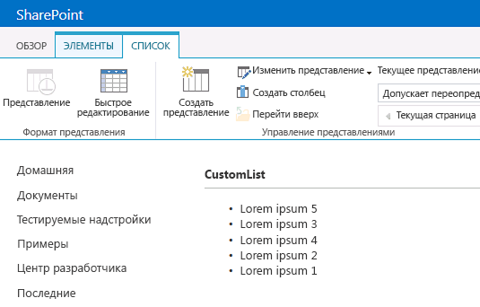

# Настройка представления списка в надстройках для SharePoint с использованием способа отображения на стороне клиента
Узнайте, как настраивать представление списка в надстройке с размещением в SharePoint с помощью технологии обработки на стороне клиента в SharePoint 2013.
В SharePoint 2013обработка на стороне клиента обеспечивает способ создания собственного вывода для ряда элементов управления, размещенных на странице SharePoint. Она позволяет использовать хорошо знакомые технологии, такие как HTML и JavaScript, для задания логики обработки представлений списка SharePoint. При использовании обработки на стороне клиента можно указывать собственные ресурсы JavaScript и размещать их в соответствии с вариантами хранения данных, доступными для ваших надстроек, например, в библиотеке документов. Надстройка, размещенная в SharePoint, включает только компоненты SharePoint. Ее ресурсы размещаются на изолированном дочернем сайте хост-сайта, который называется сайтом надстройки.
  
    
    


## Предварительные требования для использования примеров в этой статье
<a name="SP15CSRlistview_Prereq"> </a>

Для выполнения действий, приведенных в данном примере, необходимо следующее.
  
    
    

-  [Visual Studio 2015 и последняя версия Microsoft Office Developer Tools ](https://www.visualstudio.com/features/office-tools-vs)
    
  
- Среда разработки SharePoint 2013 (для локальных сценариев требуется изоляция надстроек).
    
  
Руководство по настройке среды разработки, соответствующей вашим потребностям, можно найти в статье  [Начало создания приложений для Office и SharePoint](http://msdn.microsoft.com/library/187f8c8c-1b15-471c-80b5-69a40e67deea%28Office.15%29.aspx).
  
    
    

### Основные понятия, помогающие разобраться в настройках представлений списка с использованием обработки на стороне клиента

В следующей таблице приведены полезные статьи, которые помогут изучить основные понятия и этапы, входящие в сценарий настройки представлений списка.
  
    
    

**Таблица 1. Основные понятия для настройки представлений списка в надстройке**


|**Название статьи**|**Описание**|
|:-----|:-----|
| [Надстройки SharePoint](sharepoint-add-ins.md) <br/> |Изучите новую модель надстроек в Microsoft SharePoint 2013, позволяющую создавать небольшие и удобные в использовании надстройки для конечных пользователей.  <br/> |
| [Проектирование пользовательского интерфейса для надстроек SharePoint](ux-design-for-sharepoint-add-ins.md) <br/> |Изучите варианты взаимодействия с пользователями, которые доступны при создании надстроек для SharePoint.  <br/> |
| [Хост-сайты, сайты надстроек и компоненты SharePoint в SharePoint 2013](host-webs-add-in-webs-and-sharepoint-components-in-sharepoint-2013.md) <br/> |Изучите различия между хост-сайтами и сайтами надстроек. Узнайте, какие компоненты SharePoint 2013 можно включать в надстройку для SharePoint, какие компоненты разворачиваются на хост-сайте, какие компоненты разворачиваются на сайте надстройки, и как выполняется развертывание сайта надстройки в изолированном домене.  <br/> |
   

## Пример кода. Настройка представления списка с использованием обработки на стороне клиента
<a name="SP15CSRlistview_Codeexample"> </a>

Чтобы настроить представление списка, разворачиваемое на сайте надстройки, с использованием обработки на стороне клиента, выполните следующие действия.
  
    
    

1. Создайте проект надстройки для SharePoint.
    
  
2. Создайте новое определение списка с настраиваемым представлением.
    
  
3. Создайте настраиваемую логику обработки в файле JavaScript.
    
  
На рисунке 1 показано представление списка объявлений, обработанное на стороне клиента.
  
    
    

**Рисунок 1. Настраиваемое представление списка объявлений**

  
    
    

  
    
    

  
    
    

### Создание проекта надстройки для SharePoint


1. Откройте Visual Studio 2015 от имени администратора. Для этого щелкните правой копкой мыши значок **Visual Studio** в меню **Пуск** и выберите пункт **Запуск от имени администратора**.
    
  
2. Создайте новый проект с помощью шаблона **Надстройка SharePoint**.
    
    На рисунке 2 показано расположение шаблона **Надстройка SharePoint** в Visual Studio 2015: **Шаблоны** > **Visual C#** > **Office/SharePoint** > **Надстройки Office**.
    

   **Рисунок 2. Шаблон "Надстройка SharePoint 2013"**

  

     
  

  

  
3. Предоставьте URL-адрес веб-сайта SharePoint, который планируется использовать для отладки.
    
  
4. Выберите **SharePoint-hosted** (Размещение в SharePoint) в качестве варианта размещения надстройки.
    
  

### Создание нового определения списка


1. Щелкните правой кнопкой мыши проект надстройки для SharePoint и добавьте новый элемент **List**. Создайте настраиваемый список на основе объявлений.
    
  
2. Скопируйте следующую разметку и вставьте ее в элемент **Views** файла Schema.xml вашего компонента списка. Эта разметка выполняет следующие задачи.
    
  - Объявляет новое представление с именем Overridable и атрибутом BaseViewID=2.
    
  
  - Предоставляет значение для элемента **JSLink**, которое указывает на файл JavaScript с надстройкой.
    
    > **Примечание**
      > Свойство JSLink не поддерживается в списках Survey или Events. Календарь SharePoint представляет собой список Events. 

 ```XML
  
<View BaseViewID="2"
      Name="8d2719f3-c3c3-415b-989d-33840d8e2ddb" 
      DisplayName="Overridable" 
      Type="HTML" 
      WebPartZoneID="Main" 
      SetupPath="pages\\viewpage.aspx" 
      Url="Overridable.aspx"
      DefaultView="TRUE">
  <ViewFields>
    <FieldRef Name="Title" />
  </ViewFields>
  <Query />
  <Toolbar Type="Standard" />
  <XslLink>main.xsl</XslLink>
  <JSLink Default="TRUE">~site/Scripts/CSRListView.js</JSLink>
</View>
 ```


### Создание настраиваемой логики обработки в файле JavaScript.


1. Щелкните правой кнопкой мыши папку **Scripts** и добавьте новый файл JavaScript. Дайте этому файлу имяCSRListView.js.
    
  
2. Скопируйте следующий код и вставьте его в файл CSRListView.js. Этот код выполняет следующие задачи.
    
  - Предоставляет обработчики событий для событий **PreRender** и **PostRender**.
    
  
  - Предоставляет шаблоны для наборов шаблонов заголовков, нижних колонтитулов и элементов.
    
  
  - Регистрирует шаблоны.
    
  

 ```
  
(function () {
    // Initialize the variable that stores the objects.
    var overrideCtx = {};
    overrideCtx.Templates = {};

    // Assign functions or plain html strings to the templateset objects:
    // header, footer and item.
    overrideCtx.Templates.Header = "<B><#=ctx.ListTitle#></B>" +
        "<hr><ul id='unorderedlist'>";

    // This template is assigned to the CustomItem function.
    overrideCtx.Templates.Item = customItem;
    overrideCtx.Templates.Footer = "</ul>";

    // Set the template to the:
    //  Custom list definition ID
    //  Base view ID
    overrideCtx.BaseViewID = 2;
    overrideCtx.ListTemplateType = 10057;

    // Assign a function to handle the
    // PreRender and PostRender events
    overrideCtx.OnPreRender = preRenderHandler;
    overrideCtx.OnPostRender = postRenderHandler;

    // Register the template overrides.
    SPClientTemplates.TemplateManager.RegisterTemplateOverrides(overrideCtx);
})();

// This function builds the output for the item template.
// It uses the context object to access announcement data.
function customItem(ctx) {

    // Build a listitem entry for every announcement in the list.
    var ret = "<li>" + ctx.CurrentItem.Title + "</li>";
    return ret;
}

// The preRenderHandler attends the OnPreRender event
function preRenderHandler(ctx) {

    // Override the default title with user input.
    ctx.ListTitle = prompt("Type a title", ctx.ListTitle);
}

// The postRenderHandler attends the OnPostRender event
function postRenderHandler(ctx) {

    // You can manipulate the DOM in the postRender event
    var ulObj;
    var i, j;

    ulObj = document.getElementById("unorderedlist");
    
    // Reverse order the list.
    for (i = 1; i < ulObj.children.length; i++) {
        var x = ulObj.children[i];
        for (j = 1; j < ulObj.children.length; j++) {
            var y = ulObj.children[j];
            if(x.innerText<y.innerText){                  
                ulObj.insertBefore(y, x);
            }
        }
    }
}
 ```


### Построение и запуск решения


1. Нажмите клавишу F5.
    
    > **Примечание**
      > Когда вы нажимаете клавишу F5, Visual Studio выполняет построение решения, разворачивает надстройку и открывает страницу разрешений для надстройки. 
2. Нажмите кнопку **Trust It (Доверять)**.
    
  
3. Перейдите в настраиваемый список, введя адрес  _/Lists/<ваш_экземпляр_списка>_, соответствующий вашему каталогу надстройки в домене сайта надстройки (а не домене хост-сайта). Добавьте пару объявлений. На ленте выберите представление **Overridable**.
    
  

## Дальнейшие действия
<a name="SP15CSRlistview_Nextsteps"> </a>

В этой статье демонстрируется настройка представления списка в надстройке для SharePoint с использованием обработки на стороне клиента. Далее вы можете изучить другие компоненты взаимодействия с пользователем, доступные в надстройках для SharePoint. Дополнительные сведения можно найти в следующих источниках.
  
    
    

- Примеры кода. [Настройка представления списка в надстройке с использованием обработки на стороне клиента](http://code.msdn.microsoft.com/SharePoint-2013-Customize-61761017)
    
  
-  [Использование таблицы стилей веб-сайта SharePoint в надстройках для SharePoint](use-a-sharepoint-website-s-style-sheet-in-sharepoint-add-ins.md)
    
  
-  [Использование клиентского элемента управления хрома в надстройках для SharePoint](use-the-client-chrome-control-in-sharepoint-add-ins.md)
    
  
-  [Выполнение пользовательских действий для развертывания надстроек для SharePoint](create-custom-actions-to-deploy-with-sharepoint-add-ins.md)
    
  
-  [Создание веб-частей надстройки для установки совместно с надстройкой для SharePoint](create-add-in-parts-to-install-with-your-sharepoint-add-in.md)
    
  

## Дополнительные ресурсы
<a name="SP15CSRlistview_AddResources"> </a>


-  [Настройка локальной среды разработки надстроек SharePoint](set-up-an-on-premises-development-environment-for-sharepoint-add-ins.md)
    
  
-  [Проектирование пользовательского интерфейса для надстроек SharePoint](ux-design-for-sharepoint-add-ins.md)
    
  
-  [Создание компонентов UX в SharePoint 2013](create-ux-components-in-sharepoint-2013.md)
    
  
-  [Существует три способа рассмотрения возможностей проектирования надстроек SharePoint](three-ways-to-think-about-design-options-for-sharepoint-add-ins.md)
    
  
-  [Важные аспекты архитектуры и разработки надстройки SharePoint](important-aspects-of-the-sharepoint-add-in-architecture-and-development-landscap.md)
    
  

