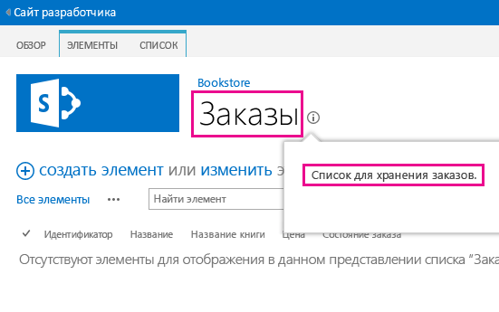
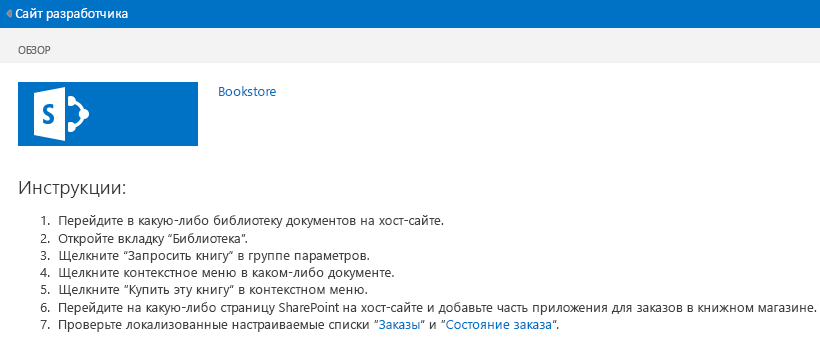
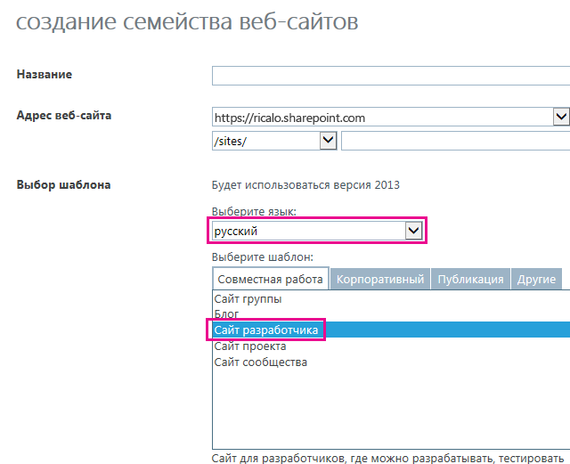

# Локализация надстроек для SharePoint
Локализуйте надстройку SharePoint с помощью файлов ресурсов, файлов ресурсов JavaScript и других методов.
> **Примечание**
> В этой статье предполагается, что вы знакомы с основами создания надстроек SharePoint, компонентами SharePoint, разницей между сайтами надстроек и хост-сайтами,  [типами компонентов SharePoint, которые могут находиться в надстройке](host-webs-add-in-webs-and-sharepoint-components-in-sharepoint-2013.md#TypesOfSPComponentsInApps), и основами локализации с помощью RESX-файлов. 
  
    
    


## Подготовка к локализации надстройки SharePoint
<a name="Prerequisites"> </a>

Прежде чем начать, определите следующее: 
  
    
    

- Языковые стандарты, которые должна поддерживать надстройка. SharePoint Online и локальная система SharePoint с установленными языковыми пакетами позволяют создавать веб-сайты на определенном языке. Определите, какие локализованные веб-сайты будут использовать ваши клиенты и для каких из них необходимо локализовать компоненты надстройки.
    
  
- Компоненты, которые необходимо локализовать в надстройке.
    
  
Обратите внимание на следующие моменты:
  
    
    

-  В этой статье предполагается, что вы используете последнюю версию Инструментов разработчика Microsoft Office для [Visual Studio 2013](http://aka.ms/OfficeDevToolsForVS2013) или [Visual Studio 2015](http://aka.ms/OfficeDevToolsForVS2015).
    
    > **Примечание**
      > Если тестовый веб-сайт SharePoint является локальной фермой SharePoint, а не сайтом разработчика Microsoft SharePoint Online, возможно, понадобится установить языковые пакеты для языков, на которые выполняется перевод Надстройка SharePoint. Дополнительные сведения см. в статьях  [Установка и удаление языковых пакетов для SharePoint 2013](http://technet.microsoft.com/ru-ru/library/cc262108%28v=office.15%29.aspx) и [Языковые пакеты в SharePoint Server 2013](http://technet.microsoft.com/ru-ru/library/ff463597%28v=office.15%29.aspx), а также в ссылках для загрузки в последней статье. 
- Снимки экранов и примеры кода в этой статье демонстрируют пример  [SharePoint-Add-in-Localization](https://github.com/OfficeDev/SharePoint-Add-in-Localization). Вы можете скачать пример, чтобы увидеть результаты описанных здесь процедур.
    
  

## Локализация компонентов сайта надстройки
<a name="LocalizingAppWeb"> </a>

Сайт надстройки может содержать определенные типы компонентов SharePoint. Дополнительные сведения см. в разделе  [Типы компонентов SharePoint, которые могут находиться в надстройке для SharePoint](host-webs-add-in-webs-and-sharepoint-components-in-sharepoint-2013.md#TypesOfSPComponentsInApps). Чтобы локализовать компоненты, развернутые на сайте надстройки, добавьте RESX-файлы в модули в компоненте, который содержит компонент сайта надстройки. Добавьте ссылки на ресурсы в разметку компонента. Ниже описано, как это сделать. Однако дополнительные страницы сайта в надстройке SharePoint используют файлы строковых переменных JavaScript, а не RESX-файлы, как описано ниже.
  
    
    

> **Примечание**
> Несколько компонентов сайтов надстройки не могут использовать один набор файлов ресурсов. Для каждого компонента в WSP-файле необходимо создать отдельный набор файлов ресурсов. 
  
    
    


### Создание файлов ресурсов сайта надстройки


1. Откройте проект надстройки SharePoint в Visual Studio. Пример, из которого взяты снимки экрана в этом разделе, представляет из себя размещенную у поставщика надстройку с веб-формами ASP.NET в качестве удаленного веб-приложения, входящего в проект.
    
  
2. В **обозревателе решений** откройте контекстное меню для имени компонента, а затем выберите пункт **Добавить ресурс компонента**.
    
  
3. В диалоговом окне **Добавление ресурса** выберите **Инвариантный язык (Инвариантная страна)**, а затем нажмите кнопку **ОК**. Файл Resources.resx добавляется в папку компонента в **обозревателе решений** и открывается в **редакторе ресурсов**Visual Studio.
    
    При редактировании этот файл "инвариантного языка" содержит строки, используемые в коллекции **компонентов** на всех сайтах на тех языках, для которых вы *не*  собираетесь предоставлять локализованную версию строк. Следовательно, язык, используемый для строк в этом файле, должен быть языком, наиболее подходящим в качестве второго языка для тех, кто использует SharePoint. Традиционно в этих целях используется английский язык, но в некоторых сценариях лучшим вариантом может быть другой язык. Например, в некоторых регионах наиболее распространенным вторым языком может быть французский, а не английский. В приведенном в данном разделе примере в качестве инвариантного языка используется английский.
    
    > **Примечание**
      > Надстройку SharePoint невозможно установить на веб-сайте, язык которого не указан в разделе **Поддерживаемые языковые стандарты** манифеста надстройки. Помните, что даже если в этой статье рассматриваются языки, на которые вы *не*  собираетесь локализовать надстройку, их все равно необходимо добавить в манифест надстройки. Дополнительные сведения о поддерживаемых языковых стандартах в манифесте надстройки см. в разделе **Создание файлов ресурсов для хост-сайта** этой статьи.
4. В столбце **Имя** верхней строки **редактора ресурсов** введите описательное имя строки (или другого ресурса), напримерOrdersListInstance_Title иOrdersListInstance_Description. Эти имена локализуемых ресурсов сами не локализуются. Каждому ресурсу необходимо присвоить собственное имя.
    
  
5. В столбце **Значение** введите соответствующую строку (или URL-адрес, или другой ресурс) на инвариантном языке, напримерЗаказы иСписок для хранения заказов.
    
  
6. Добавьте дополнительные пары имен и значений для всех строк и ресурсов, которые необходимо локализовать в любом из компонентов.
    
  
7. Сохраните файл.
    
  
8. Добавьте в компонент еще один файл ресурсов схожим образом, но выберите конкретный язык вместо значения **Инвариантный язык (Инвариантная страна)**. Например, можно выбрать **Испанский (Испания)**. Файл Resources.LL-CC.resx (в котором  `LL` и `CC` [совместимы с IETF](http://tools.ietf.org/html/rfc1766)-кодами языка и региональных параметров) добавляется в папку компонента в **обозревателе решений**, и этот файл открывается в **редакторе ресурсов**Visual Studio.
    
  
9. С помощью **редактора ресурсов** скопируйте все строки из файла Resource.resx и вставьте их в новый файл Resources.LL-CC.resx. (Если команда **Копировать** не включена в контекстном меню редактора ресурсов, скопируйте строки в буфер обмена с помощью сочетания клавишCtrl-C.)
    
  
10. В файле Resources.LL-CC.resx замените ячейки **Значение** на переведенные версии строковых значений. Для URL-адресов и других ресурсов, не являющихся строками, замените значение новым значением, соответствующим языку и региональным параметрам.
    
  
11. Сохраните новый файл.
    
  
12. Повторите последние четыре действия для каждого иностранного языка.
    
    > **Примечание**
      > Рекомендуем добавить языковой файл для того языка, который используется в качестве инвариантного. В этом случае строки можно скопировать, не изменяя значения строк. Во многих ситуациях наличие языкового файла для языка, который используется в файле ресурсов как инвариантный, не требуется, особенно когда единственными ресурсами в файлах являются строки. Но файлы ресурсов могут также содержать изображения, значки, файлы и другие типы ресурсов. Иногда необходимо, чтобы файл ресурсов для инвариантного языка использовал изображение или другой ресурс, который отличается от соответствующего ресурса в  *любом*  из языковых файлов.
13. Убедитесь, что свойство **Действие при построении** для каждого файла имеет значение **Контент**.
    
  

### Вызов локализованных ресурсов в настраиваемых списках


1. Чтобы локализовать свойства заголовка и описания в настраиваемом списке, откройте файл **Elements.xml** экземпляра списка. Например, в примере в этом разделе вы последовательно выберите **BookstoreApp** > **Order Status** > **OrderStatusInstance** > **Elements.xml** в **обозревателе решений**.
    
  
2. В атрибуте **Title** введите$Resources: _StringName_, где  _StringName_ — это имя (не значение), которое вы присвоили в предыдущей процедуре строке, задающей название настраиваемого списка, например$Resources: OrdersListInstance_Title. Обратите внимание: в отличие от некоторых ситуаций, в которых используются RESX-файлы, имя файла ресурсов  *не*  является частью того, что вы вводите.
    
  
3. Используйте атрибут **Description** для вызова строкового ресурса описания списка таким же образом, например$Resources:OrdersListInstance_Description. Ниже приведена разметка, использующая локализованные строки в файле Elements.xml этого экземпляра списка.
    
 ```XML
  
<?xml version="1.0" encoding="utf-8"?>
<Elements xmlns="http://schemas.microsoft.com/sharepoint/">
  <ListInstance 
      Title="$Resources:OrdersListInstance_Title" 
      OnQuickLaunch="TRUE" 
      TemplateType="10000" 
      Url="Lists/Orders" 
      Description="$Resources:OrdersListInstance_Description">
  </ListInstance>
</Elements>
 ```


    На следующем изображении приведен локализованный настраиваемый список на английском языке.
    

   **Локализованный настраиваемый список**

  

     
  

  

  

### Локализация имен столбцов настраиваемого списка


1. Вы не можете локализовать имена столбцов настраиваемого списка тем же образом, которым локализуете заголовок и описание. Чтобы локализовать имена столбцов, вам необходимо объявить поля списка в файле **Elements.xml**, а затем задать в качестве значения атрибута **DisplayName** ссылки в файлах ресурсов сайта надстройки. Для начала откройте файл **Schema.xml** настраиваемого списка. Найдите узел **Fields** и скопируйте все его узлы **Field**.
    
  
2. Откройте файл **Elements.xml** настраиваемого списка. Убедитесь, что открыт файл Elements.xml определения списка, а не экземпляра списка. Вставьте узлы из предыдущего шага в качестве дочерних в узел **Elements**.
    
  
3. Для каждого узла **Field** введите значение$Resources: _StringName_ в атрибуте **DisplayName**, где  _StringName_ — это имя записи в файле ресурсов сайта надстройки.
    
  
4. В файле **Schema.xml** настраиваемого списка удалите атрибут **DisplayName** каждого ранее скопированного узла **Field**. Ниже приведен пример разметки, которая использует локализованные строки в файле **Elements.xml** определения списка.
    
 ```
  
<?xml version="1.0" encoding="utf-8"?>
<Elements xmlns="http://schemas.microsoft.com/sharepoint/">
    <ListTemplate
        Name="Orders"
        Type="10000"
        BaseType="0"
        OnQuickLaunch="TRUE"
        SecurityBits="11"
        Sequence="410"
        DisplayName="Orders"
        Description="My List Definition"
        Image="/_layouts/15/images/itgen.png"/>
    <Field
        Name="Bookname"
        ID="{2ef60a05-29b6-41db-9611-c0cf7d8e73c5}"
        DisplayName="$Resources:OrdersListColumn_Bookname"
        Type="Text"
        Required="TRUE" />
    <Field
        Name="Price"
        ID="{7af42815-d69e-426a-a1c8-9da5610e362c}"
        DisplayName="$Resources:OrdersListColumn_Price"
        Type="Currency"
        Required="FALSE" />
    <Field
        Name="Orderstatus"
        ID="{687ee751-2e0a-4099-966e-d2c225d48234}"
        DisplayName="$Resources:OrdersListColumn_Orderstatus"
        Type="Lookup"
        Required="FALSE"
        List="Lists/Order status"
        ShowField="Title" />
</Elements>
 ```


### Создание файлов ресурсов JavaScript для настраиваемых страниц


1. Настраиваемые страницы сайта в надстройке SharePoint используют файлы строковых переменных JavaScript вместо RESX-файлов. 
    
    Для начала в **обозревателе решений** добавьте папкуScripts в проект надстройки SharePoint (но не в проект веб-приложения), если такой папки еще нет. Щелкните папку **Scripts** правой кнопкой мыши и выберите **Добавить** > **Новый элемент** > **Интернет** > **Файл JavaScript**. Присвойте файлу имя Resources. _LL_- _CC_.js (где  _LL_ — это код языка, а _CC_ — код страны/региона или региональных параметров); например,Resources.en-US.js.
    
  
2. Повторите это действие для каждого иностранного языка. У вас должны быть пустые файлы JavaScript для каждого языка.  *Не*  создавайте файл инвариантного языка с именем "Resources.js". Причина будет разъяснена в следующей процедуре.
    
  
3. Откройте первый из новых файлов JavaScript.
    
  
4. Для каждой локализуемой строки на каждой из настраиваемых страниц объявите в файле переменную с именем, которое идентифицирует цель строки, и назначьте ей значение, соответствующее языку. Ниже приведено содержимое файла Resources.en-US.js.
    
 ```
  
var instructionstitle = "Instructions:";
var step01 = "Go to any document library in the host web.";
var step02 = "Go to the Library tab.";
var step03 = "Click \\"Request a book\\" in the Settings group.";
var step04 = "Click the contextual menu in any document.";
var step05 = "Click \\"Buy this book\\" in the contextual menu.";
var step06 = "Go to any SharePoint page in the host web and add the" +
    " Bookstore orders add-in part.";
var step07 = "Review the localized <a href=\\"../Lists/Orders\\">Orders</a>" +
    " and <a href=\\"../Lists/Order status\\">Order status</a> custom lists.";

 ```

5. Скопируйте содержимое этого файла во все остальные файлы JavaScript и сохраните эти файлы.
    
  
6. В каждом файле замените значение каждой переменной новым значением, соответствующим языку этого файла.  *Не изменяйте имена переменных.* 
    
  

### Вызов локализованных переменных в настраиваемых страницах ASPX


1. В **обозревателе решений** откройте файл настраиваемой страницы ASPX.
    
  
2. Убедитесь, что при загрузке страницы загружается только один из локализованных файлов JavaScript, и что это тот файл, который соответствует языку сайта надстройки SharePoint. Для этого добавьте следующую разметку в элемент **asp:content** страницы, которая включает `ContentPlaceholderId` со значением `PlaceholderAdditionalPageHead`.  *В этой разметке нет заполнителей. Вводите разметку в точности, как указано здесь.* 
    
 ```HTML
  
<script type="text/javascript" src="../scripts/Resources.<SharePoint:EncodedLiteral runat='server' text='<%$Resources:wss,language_value%>' EncodeMethod='HtmlEncode' />.js"></script>
 ```


    Эта разметка загружает один из ваших файлов JavaScript. Она определяет, какой языковой файл следует загрузить, читая ресурс SharePoint с именем "language_value". Этот ресурс разрешается в имя языка и региональных параметров в шаблоне  _LL_- _CC_, описанном выше. В частности, он разрешается в язык сайта надстройки.
    
    > **Примечание**
      > Ресурс SharePoint "language_value" никогда не имеет значение NULL, поэтому этот скрипт никогда не вызывает файл с именем "Resources.js". Вот почему вы не создаете этот файл в предыдущей процедуре. Если значением "language_value" является язык, для которого отсутствует JS-файл, то этот скрипт не загружает ничего. В следующем действии объясняется, каким образом строки получают значение инвариантного языка в такой ситуации. 
3. Для каждого локализуемого элемента и значения атрибута на странице предоставьте значение по умолчанию на инвариантном языке, но затем используйте JavaScript для назначения соответствующей переменной из файла Resources. _LL_- _CC_.js. Например, если название страницы содержится в элементе **h2**, предоставьте этому элементу атрибут **id**, а затем вставьте элемент **script** под локализованным элементом, чтобы назначить локализованные строки свойству **innerText** локализованных элементов. Этот код локализации должен запускаться, только если файл Resources. _LL_- _CC_.js загружен и объявил переменные. Поэтому вставьте его в условный блок, который скачала проверяет, определена ли одна из переменных. Если переменная не определена, скрипт ресурсов не загружен и значения по умолчанию (инвариантные) должны оставаться без изменений. Ниже приведен пример.
    
    > **Совет**
      > Слово "INVARIANT" добавлено в первую из инвариантных строк. Это действие не выполняется для рабочей надстройки, но с его помощью при тестировании можно быстро проверить, используются ли строки на инвариантном языке, а также загружен ли файл Resources. _LL_- _CC_.js для вашего инвариантного языка. 

 ```HTML
  <h2 id="instructionsheading">INVARIANT Instructions</h2>
<ol>
    <li id="step01">Go to any document library in the host web.</li>
    <li id="step02">Go to the Library tab.</li>
    <li id="step03">Click "Request a book" in the Settings group.</li>
    <li id="step04">Click the contextual menu in any document.</li>
    <li id="step05">Click "Buy this book" in the contextual menu.</li>
    <li id="step06">Go to any SharePoint page in the host web and add the Bookstore orders add-in part.</li>
    <li id="step07">Review the localized <a href="../Lists/Orders">Orders</a> and <a href="../Lists/Order status">Order status</a> custom lists.</li>
</ol>

<!-- Use the localized strings in the resource JavaScript file -->
<script type="text/javascript">
    window.onload = function () {
        <!-- Test whether a Resources.LL-CC.js loaded.
             If none was, the invariant values remain unchanged. -->
        if (typeof instructionstitle != 'undefined')  
        {
            document.getElementById("instructionsheading").innerText = instructionstitle;
            document.getElementById("step01").innerText = step01;
            document.getElementById("step02").innerText = step02;
            document.getElementById("step03").innerText = step03;
            document.getElementById("step04").innerText = step04;
            document.getElementById("step05").innerText = step05;
            document.getElementById("step06").innerText = step06;
            document.getElementById("step07").innerHTML = step07;
        }
    }
</script>

 ```


    На рисунке ниже показано, как будет выглядеть английская версия страницы после создания надстройки. 
    

   **Веб-страница, использующая локализованные строки из файла ресурсов JavaScript**

  

     
  

  

  

## Локализация компонентов хост-сайта
<a name="LocalizingHostWeb"> </a>

Название надстройки, заданное в файле AppManifest.xml, можно локализовать. Это то, что видят пользователи на странице **Your Add-ins**. Хост-сайт для надстройки SharePoint может также включать дополнительное действие, веб-часть приложения или и то, и другое. Они разворачиваются в компоненте хост-сайта. Все эти компоненты могут иметь локализуемые строки.
  
    
    
Основной способ локализации компонентов хост-сайта такой же, что и для локализации компонентов сайта надстройки: локализованные ресурсы перечисляются в RESX-файле и вызываются из файлов разметки. Однако Visual Studio не имеет такого объема инструментальной поддержки этого процесса, который применяется для компонентов хост-сайта. Для этого использует выполняемый вручную процесс, который описан ниже в данном разделе.
  
    
    

### Создание файлов ресурсов для хост-сайта


1. Выберите файл AppManifest.xml в **обозревателе решений**, чтобы открыть конструктор манифеста надстройки.
    
  
2. Откройте вкладку **Поддерживаемые языки**.
    
  
3. В верхней пустой ячейке столбца **Языки** откройте раскрывающийся список и выберите первый языковой стандарт, для которого вы хотите обеспечить поддержку. Создаются два файла, которые добавляются в проект приложения Надстройка SharePoint: Resources.resx, который является файлом ресурсов инвариантного языка, и Resources. _LL_- _CC_.resx, который будет содержать локализованные ресурсы.  *Не изменяйте имена этих файлов.* 
    
  
4. Повторите предыдущее действие для каждого языкового стандарта, который требуется поддерживать с помощью локализованной версии надстройки. Дополнительный файл Resources. _LL_- _CC_.resx создается для каждого языкового стандарта.
    
    > **Примечание**
      > Для свойства **Действие при построении** каждого из этих файлов установлено значение **Контент**, а не **Ресурс**.  *Не изменяйте этот параметр.* 
5. Кроме того, добавьте записи языковых стандартов для каждого языкового стандарта, с которым должна устанавливаться надстройка, но для которого используется инвариантный язык; то есть языковые стандарты, для которых  *не*  будет предоставляться локализованная версия надстройки. *Удалите RESX-файлы, созданные для этих языковых стандартов.* 
    
  
6. Откройте файл Resources.resx и добавьте имена и значения ресурсов в файл, как это делалось в файлах ресурсов сайта надстройки. Как минимум, необходим файл ресурсов для названия надстройки. Компонент хост-сайта никак не отображается в интерфейсе пользователя SharePoint, поэтому вам не нужны локализованные строки для названия или описания этого компонента. Если компонент имеет дополнительное действие, то потребуется ресурс для атрибута **Title** элемента **CustomAction** и, возможно, других строк в разметке дополнительного действия. Если имеется веб-часть надстройки, то потребуются ресурсы для атрибутов **Title** и **Description** элемента **ClientWebPart**. Если веб-часть надстройки включает настраиваемые свойства, то каждый элемент **Property** имеет атрибуты, которые также необходимо локализовать. Для каждого из них потребуется строка в файле ресурсов.
    
  
7. Скопируйте содержимое файла Resources.resx во все остальные файлы Resources. _LL_- _CC_.resx.
    
  
8. Локализуйте все ресурсы во всех файлах Resources. _LL_- _CC_.resx, как это делалось для файлов ресурсов сайта надстройки.
    
  

### Вызов локализованных ресурсов в манифесте надстройки и других XML-файлах


1. Откройте файл AppManifest.xml и замените значение элемента **Title** вызовом соответствующей строки ресурса. Например, если строка получила имяAddin_Title, элемент **Title** должен выглядеть следующим образом:
    
 ```XML
  
<Title>$Resources:Addin_Title;</Title>
 ```


    > **Внимание!**
      > Значение **Title** может содержать в себе *только*  вызов ресурса. В нем не может находиться никакой другой текст, символы или пробелы.
2. Чтобы вызвать локализованные ресурсы в других файлах XML, таких как Elements.xml для веб-частей надстроек и дополнительных действий, вы можете использовать тот же формат, который вы использовали в файле манифеста надстройки.
    
  

## Локализация удаленных компонентов в надстройке SharePoint
<a name="LocalizingAutohosted"> </a>

Если удаленные компоненты используют формат PHP или другой формат, не являющийся форматом Майкрософт, см. инструкции по локализации для соответствующей платформы. Если удаленные компоненты представляют из себя ASP.NET, они локализуются точно так же, как компоненты любого другого приложения ASP.NET. Дополнительные сведения см. в статье  [ASP.NET Globalization and Localization](http://msdn.microsoft.com/library/8ef3838e-9d05-4236-9dd0-ceecff9df80d.aspx).
  
    
    
Переопределите язык страницы и потока, чтобы он соответствовал языку хост-сайта. Для этого необходимо переопределить унаследованный метод **InitializeCulture** в коде программной части страниц ASP.NET. Чтобы определить язык хост-сайта, используйте параметр запроса **SPLanguage**, который SharePoint передает на удаленную страницу. Приведенный ниже код показывает, как сделать это в ASP.NET. Следует выполнить параллельные задачи в веб-приложении PHP или на другой платформе.
  
    
    



```cs
protected override void InitializeCulture()
{
    if (Request.QueryString["SPLanguage"] != null)
    {
        string selectedLanguage = Request.QueryString["SPLanguage"];
        
        // Override the page language.
        UICulture = selectedLanguage;
        Culture = selectedLanguage;

        // Reset the thread language.
        Thread.CurrentThread.CurrentCulture =
            CultureInfo.CreateSpecificCulture(selectedLanguage);
        Thread.CurrentThread.CurrentUICulture = new
            CultureInfo(selectedLanguage);
    }
    base.InitializeCulture();
}
```


## Локализация удаленного элемента управления хрома JavaScript и SharePoint
<a name="JSandChrome"> </a>

Если в JavaScript вашего веб-приложения имеются локализуемые строковые значения, их можно локализовать с помощью файлов ресурсов JavaScript. Особенно важный пример локализуемого JavaScript —  [элемент управления хрома SharePoint](use-the-client-chrome-control-in-sharepoint-add-ins.md), с помощью которого удаленные страницы можно оформить как страницы SharePoint. В этом разделе в качестве примера будет использована локализация элемента управления хрома.
  
    
    

> **Примечание**
> В этом разделе рассматривается только локализация строк. Если требуется выполнить более сложные задачи локализации, например локализовать даты или денежные единицы, возможно, следует воспользоваться библиотекой локализации или глобализации, например  [надстройкой по глобализации для jQuery](https://github.com/jquery/globalize). 
  
    
    


### Локализация элемента управления хрома


1. После того как элемент управления хрома заработает, вернитесь к методу  `renderChrome`, в котором заданы параметры этого элемента.
    
 ```
  
function renderChrome() {
    var options = {
        "appIconUrl": "siteicon.png",
        "appTitle": "My SharePoint add-in", // Localizable string
        "appHelpPageUrl": "Help.html?"
            + document.URL.split("?")[1],
        "onCssLoaded": "chromeLoaded()",
        "settingsLinks": [
            {
                "linkUrl": "Account.html?"
                    + document.URL.split("?")[1],
                "displayName": "Account settings" // Localizable string
            },
            {
                "linkUrl": "Contact.html?"
                    + document.URL.split("?")[1],
                "displayName": "Contact us" // Localizable string
            }
        ]
    };

 ```

2. Как указывалось в примечаниях, имеется по крайней мере три локализуемых строки. Замените каждую из них именем переменной, которое будет объявлено позже.
    
 ```
  
function renderChrome() {
    var options = {
        "appIconUrl": "siteicon.png",
        "appTitle": chromeAppTitle, // Localized value
        "appHelpPageUrl": "Help.html?"
            + document.URL.split("?")[1],
        "onCssLoaded": "chromeLoaded()",
        "settingsLinks": [
            {
                "linkUrl": "Account.html?"
                    + document.URL.split("?")[1],
                "displayName": chromeAccountLinkName // Localized value
            },
            {
                "linkUrl": "Contact.html?"
                    + document.URL.split("?")[1],
                "displayName": chromeContactUsLinkName // Localized value
            }
        ]
    };

 ```

3. Добавьте файл JavaScript с именем ChromeStrings.js в проект веб-приложения. В нем необходимо объявить переменные, использованные на предыдущем шаге, и назначить каждой из них значение на инвариантном языке.
    
 ```
  
var chromeAppTitle = "My SharePoint add-in";
var chromeAccountLinkName = "Account settings";
var chromeContactUsLinkName = "Contact us";

 ```

4. Для каждого языка, на который локализуется надстройка, добавьте еще один файл JavaScript с именем ChromeStrings. _LL-CC_.js, где  _LL-CC_ — идентификатор языка. *Основа имени файла, в данном случае "ChromeStrings", должна совпадать с основой, использованной для файла инвариантного языка.*  Скопируйте содержимое файла инвариантного языка в каждый из локализованных файлов и замените значения на переведенные версии.
    
 ```
  
var chromeAppTitle = "Mi aplicación SharePoint";
var chromeAccountLinkName = "Preferencias";
var chromeContactUsLinkName = "Contacto";

 ```

5. В любом файле страницы, содержащем вызов скрипта SP.UI.controls.js, добавьте вызов файла ChromeStrings.js над этим скриптом. Например, если вызов скрипта SP.UI.controls.js загружается в промежуточный файл с именем ChromeLoader.js, разметка на странице на данном этапе должна выглядеть, как показано ниже.
    
 ```
  
<Scripts>
  <asp:ScriptReference Path="Scripts/ChromeStrings.js" />
  <asp:ScriptReference Path="Scripts/ChromeLoader.js" />
</Scripts>
 ```

6. Добавьте атрибут **ResourceUICultures** в элемент **ScriptReference**, вызывающий ваши строки. Его значением является список поддерживаемых языков с разделителями-запятыми.
    
 ```
  
<Scripts>
  <asp:ScriptReference Path="Scripts/ChromeStrings.js" ResourceUICultures="en-US,es-ES" />
  <asp:ScriptReference Path="Scripts/ChromeLoader.js" />
</Scripts>
 ```


    Благодаря атрибуту **ResourceUICultures**ASP.NET будет выполнять поиск файла с именем ChromeStrings. _LL-CC_.js, где  _LL-CC_ является языком страницы, и загружать этот файл. Если он не найдет такого файла, будет загружен файл ChromeStrings.js.
    
  

## Тестирование локализованной надстройки SharePoint
<a name="TestingLocalizedApps"> </a>

Протестируйте надстройку перед тем, как развернуть ее на веб-сайте SharePoint, который подготовлен к работе на одном из языков, поддерживаемых надстройкой. Вы можете протестировать свою надстройку на веб-сайте SharePoint Online или локальном веб-сайте.
  
    
    

### Тестирование надстройки на веб-сайте SharePoint Online


1. Перейдите в центр администрирования Office 365.
    
  
2. Выберите **параметры службы** в навигационном меню, а затем выберите **сайты**.
    
  
3. В семействах веб-сайтов выберите **Создание семейства веб-сайтов**.
    
  
4. В области **выбора языка** выберите язык, на котором хотите протестировать свою надстройку.
    
  
5. В области **выбора шаблона** выберите **Сайт разработчика**.
    
  
6. В своем проекте приложения Надстройка SharePoint обновите свойство **SiteUrl**, указав URL-адрес нового семейства веб-сайтов.
    
  
7. Нажмите клавишу F5, чтобы запустить надстройку.
    
  

**Страница создания семейства веб-сайтов**

  
    
    

  
    
    

  
    
    

### Тестирование надстройки на локальном веб-сайте


1. Установите языковой пакет, с которым хотите протестировать надстройку. Дополнительные сведения см. в статьях  [Установка или удаление языковых пакетов для SharePoint 2013](http://technet.microsoft.com/library/cc262108.aspx) и [Языковые пакеты в SharePoint Server 2013](http://technet.microsoft.com/ru-ru/library/ff463597%28v=office.15%29.aspx).
    
  
2. Откройте центр администрирования для фермы.
    
  
3. В области **Управление приложениями** выберите **Создание семейств веб-сайтов**.
    
  
4. В области **выбора языка** выберите язык, на котором хотите протестировать свою надстройку.
    
  
5. В области **выбора шаблона** выберите **Сайт разработчика**.
    
  
6. В своем проекте приложения Надстройка SharePoint обновите свойство **SiteUrl**, указав URL-адрес недавно созданного семейства веб-сайтов.
    
  
7. Нажмите клавишу F5, чтобы запустить надстройку.
    
  

## Дополнительные ресурсы
<a name="SP15Localizeapp_addlresources"> </a>


-  [Разработка надстроек для SharePoint](develop-sharepoint-add-ins.md)
    
  
-  [Локализация надстроек для Office](http://msdn.microsoft.com/library/5a1a1cd7-b716-4597-b51f-fa70357d0833%28Office.15%29.aspx)
    
  
-  [Глобализация и локализация ASP.NET](http://msdn.microsoft.com/library/8ef3838e-9d05-4236-9dd0-ceecff9df80d.aspx)
    
  
-  [SharePoint-Add-in-Localization](https://github.com/OfficeDev/SharePoint-Add-in-Localization)
    
  

