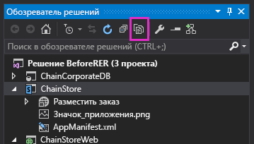

# Программное развертывание настраиваемой кнопки в надстройке, размещаемой у поставщика
В данной статье рассказывается, как программно зарегистрировать настраиваемую кнопку ленты для настраиваемого списка в одной и той же Надстройка SharePoint, размещаемой у поставщика.
Это девятая часть из серии статей о том, как разрабатывать Надстройки SharePoint, размещаемые у поставщиков. Сначала вам необходимо ознакомиться со статьей  [Надстройки SharePoint](sharepoint-add-ins.md) и с указанными ниже предыдущими статьями этой серии.
  
    
    


-  [Знакомство с созданием надстроек SharePoint с размещением у поставщика](get-started-creating-provider-hosted-sharepoint-add-ins.md)
    
  
-  [Придание надстройке, размещаемой у поставщика, внешнего вида и удобства использования SharePoint](give-your-provider-hosted-add-in-the-sharepoint-look-and-feel.md)
    
  
-  [Включение настраиваемой кнопки в надстройку, размещаемую у поставщика](include-a-custom-button-in-the-provider-hosted-add-in.md)
    
  
-  [Краткий обзор объектной модели SharePoint](get-a-quick-overview-of-the-sharepoint-object-model.md)
    
  
-  [Добавление операций записи SharePoint в надстройку, размещаемую у поставщика](add-sharepoint-write-operations-to-the-provider-hosted-add-in.md)
    
  
-  [Включение веб-части надстройки в надстройку, размещаемую у поставщика](include-an-add-in-part-in-the-provider-hosted-add-in.md)
    
  
-  [Обработка событий надстройки в надстройке, размещаемой у поставщика](handle-add-in-events-in-the-provider-hosted-add-in.md)
    
  
-  [Добавление кода, выполняемого при первом запуске, в надстройку, размещаемую у поставщика](add-first-run-logic-to-the-provider-hosted-add-in.md)
    
  

> **Примечание**
> Если вы изучали предыдущие статьи этой серии о надстройках, размещаемых в SharePoint, то у вас уже есть решение для Visual Studio, которое можно использовать для работы с данной статьей. Кроме того, вы можете скачать репозиторий  [SharePoint_SP-hosted_Add-Ins_Tutorials](https://github.com/OfficeDev/SharePoint_SP-hosted_Add-Ins_Tutorials) и открыть файл BeforeProgrammaticButton.sln.
  
    
    

Из данной статьи вы узнаете, как включать настраиваемую кнопку ленты в Надстройка SharePoint, когда список, лента которого получает кнопку, также развертывается программным способом в той же самой надстройке.
## Повторное добавление настраиваемой кнопки в проект


> **Примечание**
>  При повторном открытии решения параметры раздела "Начальные проекты" в Visual Studio обычно сбрасываются к значениям, используемым по умолчанию. Сразу же после повторного открытия примера решения в этой серии статей всегда выполняйте указанные ниже действия.>  Щелкните правой кнопкой мыши узел решения в верхней части **обозревателя решений** и выберите пункт **Настроить начальные проекты**. >  Убедитесь, что для всех трех проектов в столбце **Действие** задано значение **Запустить**. 
  
    
    

В предыдущей статье вы удалили настраиваемую кнопку ленты **AddEmployeeToCorpDB** из проекта. Добавьте ее обратно, выполнив указанные ниже действия.
  
    
    

1. В верхней части **обозревателя решений** на небольшой панели инструментов нажмите кнопку **Показать все файлы**.
    
     
  

  

  
2. В проекте **ChainStore** щелкните правой кнопкой мыши **AddEmployeeToCorpDB** и выберите пункт **Включить в проект**.
    
  
3. Еще раз нажмите кнопку **Показать все файлы**.
    
  
4. В проекте **ChainStore** разверните **AddEmployeeToCorpDB**, а затем откройте файл elements.xml. 
    
  

## Дилемма и ее решение

В файле elements.xml атрибут **RegistrationId** элемента **CustomAction** служит для идентификации списка, на ленту которого вы добавляете кнопку: `{$ListId:Lists/Local Employees;}`. Это отлично работало, когда список уже был добавлен на хост-сайт вручную. Но теперь при развертывании списка программным способом в коде, выполняемом при первом запуске, когда SharePoint устанавливает надстройку и пытается развернуть кнопку, списка еще не существует. В этом случае установка надстройки может привести к созданию исключения и завершиться со сбоем.
  
    
    
Развертывание списка в обработчике событий установки, а не в коде, выполняемом при первом запуске, не решит дилемму. Это связано с тем, что SharePoint развертывает настраиваемые описательным определенные компоненты, например настраиваемую кнопку (и часть надстройки **Place Order**),  *перед тем как*  запустить настраиваемый обработчик, поэтому когда SharePoint пытается развернуть кнопку, списка еще не существует.
  
    
    
Создание настраиваемой кнопки полностью программным способом непрактично по причинам, которые слишком сложны, чтобы обсуждать их здесь. К счастью, это не нужно. Существует относительно безболезненный способ полупрограммного создания настраиваемой кнопки и назначения ее настраиваемому списку. Ниже перечислены необходимые для этого основные действия.
  
    
    

1. Оставьте описательно определенную кнопку в проекте, но назначьте ее ленте какого-либо приложения, которое всегда имеется на сайтах SharePoint, а не ленте списка, который развертывается программным способом с помощью той же надстройки. 
    
  
2. В коде, выполняемом при первом запуске, после кода для программного создания списка программным способом добавьте на ленту списка неопределенную кнопку.
    
  
3. Инициализируйте свойства новой кнопки, используя значения свойств исходной кнопки. Итак, на данный момент у нас имеются две идентичные кнопки. Вторая кнопка назначена ленте списка **Local Employees** (Местные сотрудники).
    
  
4. Удалите исходную кнопку программным способом.
    
  

## Регистрация настраиваемой кнопки программным способом

В процедуре ниже показано, как реализовать эту стратегию.
  
    
    

1. В проекте **ChainStore** разверните **AddEmployeeToCorpDB**, откройте файл elements.xml, а затем измените значение атрибута **RegistrationId** элемента **CustomAction** на число 100. Это идентификатор типа списка. Даже если на веб-сайте нет экземпляров списка этого типа, они имеются на всех веб-сайтах SharePoint. Теперь атрибут должен иметь указанный ниже вид.
    
 ```XML
  
RegistrationId="100"
 ```

2. В файле SharePointComponentDeployer.cs добавьте указанную ниже строку в метод  `DeployChainStoreComponentsToHostWeb` сразу же после строки, в которой вызывается метод `CreateLocalEmployeesList`. Вы создадите этот метод на следующем этапе.
    
 ```cs
  ChangeCustomActionRegistration();
 ```

3. Добавьте указанный ниже метод в класс  `SharePointComponentDeployer`. Обратите внимание на указанные ниже особенности этого кода.
    
  - Так как дополнительное действие, то есть настраиваемая кнопка, было зарегистрировано на ленте для  *типа*  списка, область его действия распространяется на весь веб-сайт и находится в коллекции дополнительных действий веб-сайта. Таким образом, код получает его из этой коллекции.
    
  
  - Значение  `action.Name` поступает из атрибута **ID** элемента **CustomAction** в файле element.xml в **AddEmployeeToCorpDB**.
    
    > **Важно!**
      > **Вам необходимо изменить значение  `action.Name` в коде ниже, чтобы оно совпадало со значением в файле elements.xml.** Часть GUID имени будет другой. Обратите внимание, что между GUID и остальной частью имени имеется символ точки. Ниже приведен пример строки.>  `where action.Name == "4a926a42-3577-4e02-9d06-fef78586b1bc.AddEmployeeToCorpDB"`

 ```cs
  private static void ChangeCustomActionRegistration()
{
    using (var clientContext = sPContext.CreateUserClientContextForSPHost())
    {
         var query = from action in clientContext.Web.UserCustomActions
                     where action.Name == "{button_GUID} .AddEmployeeToCorpDB"
                     select action;
          IEnumerable<UserCustomAction> matchingActions = clientContext.LoadQuery(query);	       
	         clientContext.ExecuteQuery();
	
          UserCustomAction webScopedEmployeeAction = matchingActions.Single();

         // TODO8: Get a reference to the (empty) collection of custom actions 
         // that are registered with the custom list.

         // TODO9: Add a blank custom action to the list's collection.

         // TODO10: Copy property values from the descriptively deployed
         // custom action to the new custom action

        // TODO11: Delete the original custom action.         

          clientContext.ExecuteQuery();
    }
}
 ```

4. Замените  `TODO8` указанным ниже кодом.
    
    Обратите внимание, что если вы отзовете надстройку, созданные ею компоненты не будут удалены. По завершении работы кода, выполняемого при первом запуске, в коллекции **UserCustomActions** списка появится дополнительное действие, которое не будет отозвано при следующем нажатии клавиши F5. Во избежание путаницы в последней строке в этом коде метод `listActions.Clear();` очищает коллекцию.
    


 ```cs
  
var queryForList = from list in clientContext.Web.Lists
                   where list.Title == "Local Employees"
                   select list;
IEnumerable<List> matchingLists = clientContext.LoadQuery(queryForList);
clientContext.ExecuteQuery();

List employeeList = matchingLists.First();
var listActions = employeeList.UserCustomActions;
clientContext.Load(listActions);
listActions.Clear();
 ```

5. Замените  `TODO9` указанной ниже строкой, которая добавляет неопределенное дополнительное действие в список **Local Employees** (Местные сотрудники).
    
 ```cs
  
var listScopedEmployeeAction = listActions.Add();
 ```

6. Замените  `TODO10` указанным ниже кодом. Обратите внимание на указанные ниже особенности этого кода.
    
  - Он назначает значения свойств кнопки уровня веб-сайта (которая была развернута с помощью описательной разметки) соответствующим свойствам кнопки уровня списка, так что эти две кнопки становятся идентичными за исключением области их действия.
    
  
  - Свойство **Sequence** указывает относительный порядок, в котором кнопка будет отображена в своей области на ленте. В данном случае кнопка находится в разделе **Actions** (Действия) на вкладке **Items** (Элементы) ленты. В описательной разметке это значение было равно 10001. Это достаточно большое значение, чтобы кнопка отображалась после (справа от) всех встроенных кнопок, которые SharePoint самостоятельно помещает в раздел **Actions** (Действия) ленты.
    
  

 ```cs
  listScopedEmployeeAction.Title = webScopedEmployeeAction.Title;
listScopedEmployeeAction.Location = webScopedEmployeeAction.Location;
listScopedEmployeeAction.Sequence = webScopedEmployeeAction.Sequence;
listScopedEmployeeAction.CommandUIExtension = webScopedEmployeeAction.CommandUIExtension;
listScopedEmployeeAction.Update();
 ```

7. Замените  `TODO11` указанной ниже строкой, в которой выполняется удаление исходной описательным способом определенной кнопки. Если бы у нас не было этой строки, то на каждом списке на веб-сайте, для которого используется шаблон списка 100, была бы настраиваемая кнопка. Так как функциональность кнопки тесно связана со списком **Local Employees** (Местные сотрудники), то нет никакого смысла размещать эту кнопку в других списках. Кроме того, без этой строки кнопка будет *дважды*  размещена в списке **Local Employees** (Местные сотрудники), так как для этого списка используется шаблон 100.
    
 ```cs
  
webScopedEmployeeAction.DeleteObject();
 ```


    Теперь весь метод должен иметь указанный ниже вид (за исключением того, что заполнитель необходимо заменить на GUID).
    


 ```cs
  private static void ChangeCustomActionRegistration()
{
    using (var clientContext = SPContext.CreateUserClientContextForSPHost())
    {
         var query = from action in clientContext.Web.UserCustomActions
                     where action.Name == "{button_GUID} .AddEmployeeToCorpDB"
                     select action;
          IEnumerable<UserCustomAction> matchingActions = clientContext.LoadQuery(query);	       
	         clientContext.ExecuteQuery();
	
          UserCustomAction webScopedEmployeeAction = matchingActions.Single();

         var queryForList = from list in clientContext.Web.Lists
                            where list.Title == "Local Employees"
                            select list;
         IEnumerable<List> matchingLists = clientContext.LoadQuery(queryForList);
         clientContext.ExecuteQuery();

        List employeeList = matchingLists.First();
        var listActions = employeeList.UserCustomActions;
        clientContext.Load(listActions);
        listActions.Clear();

        var listScopedEmployeeAction = listActions.Add();

        listScopedEmployeeAction.Title = webScopedEmployeeAction.Title;
        listScopedEmployeeAction.Location = webScopedEmployeeAction.Location;
        listScopedEmployeeAction.Sequence = webScopedEmployeeAction.Sequence;
        listScopedEmployeeAction.CommandUIExtension = webScopedEmployeeAction.CommandUIExtension;
        listScopedEmployeeAction.Update();

        webScopedEmployeeAction.DeleteObject();         

        clientContext.ExecuteQuery();
    }
}
 ```


## Запрос полного контроля над хост-сайтом

Так как теперь надстройка добавляет и удаляет дополнительные действия уровня веб-сайта, необходимо расширить разрешения для нее с уровня "Управление" до уровня "Полный контроль". Выполните указанные ниже действия.
  
    
    

1. В **обозревателе решений** в проекте **ChainStore** откройте файл AppManifest.xml.
    
  
2. Перейдите на вкладку **Разрешения**. Для поля **Область** оставьте значение **Интернет**, а в поле **Разрешение** в раскрывающемся списке выберите пункт **Полный контроль**.
    
  
3. Сохраните файл.
    
  

## Запуск надстройки и тестирование развертывания кнопки


  
    
    

1. Откройте страницу **Site Contents** (Содержание сайта) веб-сайта магазина в Гонконге *и удалите список **Local Employees** (Местные сотрудники).* 
    
    > **Примечание**
      > При отзыве надстройки в Visual Studio не будут удалены созданные ею списки, поэтому вам необходимо вручную удалять их при каждом тестировании создающего их кода. 
2. Нажмите клавишу F5, чтобы развернуть и запустить вашу надстройку. Visual Studio размещает удаленное веб-приложение в IIS Express, а базу данных SQL — в SQL Express. Кроме того, он создает временную установку надстройки на вашем тестовом сайте SharePoint и немедленно запускает ее. Прежде чем откроется начальная страница надстройки, вам будет предложено предоставить надстройке необходимые разрешения.
    
  
3. Когда откроется начальная страница надстройки, нажмите кнопку **Back to Site** (Вернуться на сайт) на размещенном в верхней части элементе управления хрома.
    
  
4. Перейдите на страницу **Site Contents** (Содержание сайта). На ней будет список **Local Employees** (Список сотрудников), так как код, выполняемый при первом запуске, добавил его.
    
    > **Примечание**
      > Если этого списка нет или у вас имеются другие свидетельства того, что код, выполняемый при первом запуске, не выполняется, то возможно, что при нажатии клавиши F5 таблица **Tenants** (Клиенты) не очищается. Самая распространенная причина этого заключается в том, что проект **ChainCorporateDB** больше не задан в качестве начального проекта в Visual Studio. См. примечание в верхней части данной статьи о том, как устранить эту проблему. Кроме того, убедитесь, что вы настроили базу данных так, чтобы она перестраивалась, как описано в разделе [Настройка Visual Studio для перестройки корпоративной базы данных при каждом сеансе отладки](give-your-provider-hosted-add-in-the-sharepoint-look-and-feel.md#Rebuild). 
5. Откройте список и добавьте в него элемент.
    
  
6. В представлении списка выберите этот элемент и откройте вкладку **Item** (Элемент) на ленте. На ленте имеется кнопка **Add to Corporate DB** (Добавить в корпоративную базу данных).
    
  
7. Нажмите эту кнопку, после чего сотрудник будет добавлен в корпоративную базу данных, а значение поля **Added to Corporate DB** (Добавлен в корпоративную базу данных) изменится на **Yes** (Да).
    
  
8. Вернитесь на страницу **Site Contents** (Содержание сайта) и выберите **add an add-in** (Добавить надстройку).
    
  
9. Добавьте новый **настраиваемый список**. По умолчанию он будет иметь тип Generic. Типу Generic соответствует значение 100. После создания списка откройте вкладку **Item** (Элемент) на ленте. Обратите внимание, что кнопки **Add to Corporate DB** (Добавить в корпоративную базу данных) *нет*  на ленте. Это связано с тем, что ваш код удалил кнопку уровня веб-сайта.
    
  
10. Чтобы завершить сеанс отладки, закройте окно браузера или остановите отладку в Visual Studio. При каждом нажатии клавиши F5 Visual Studio будет отзывать предыдущую версию надстройки и устанавливать ее последнюю версию.
    
  
11. Вы будете работать с этой надстройкой и решением Visual Studio и при изучении других статей, поэтому при перерывах в работе рекомендуется отзывать надстройку. В **обозревателе решений** щелкните проект правой кнопкой мыши и выберите пункт **Отозвать**.
    
  

## 
<a name="Nextsteps"> </a>

 Для событий в списках и элементах списков также можно использовать настраиваемые обработчики в SharePoint. Сведения о том, как создать такой обработчик и развернуть его в коде, выполняемом при первом запуске, см. в статье [Обработка событий элемента списка в надстройке, размещаемой у поставщика](handle-list-item-events-in-the-provider-hosted-add-in.md). 
  
    
    

