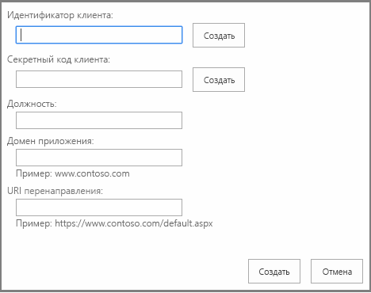

# Регистрация надстроек для SharePoint 2013
Зарегистрируйте свои Надстройки SharePoint в Azure ACS с помощью Visual Studio, Панель мониторинга продаж или страницы AppRegNew.aspx и получите регистрационную информацию.
Чтобы удаленные компоненты надстройки SharePoint, размещаемой у поставщика, могли взаимодействовать с SharePoint с помощью OAuth, необходимо сначала зарегистрировать надстройку в облачной службе  [Azure ACS](https://msdn.microsoft.com/ru-ru/library/azure/gg429788.aspx) и службе управления надстройками SharePoint клиента или фермы.
  
    
    


> **Примечание**
> Это не требуется для надстроек, размещаемых в SharePoint. 
  
    
    


Чтобы зарегистрировать надстройку в Azure ACS, укажите следующие сведения:
  
    
    


- GUID надстройки, называемый идентификатором клиента;
    
  
- пароль для надстройки, называемый секретом клиента;
    
  
- отображаемое имя надстройки, используемое на странице согласия, на которой пользователь указывает, доверяет ли он надстройке;
    
  
- URL-адрес домена, в котором размещена удаленная надстройка;
    
  
- URL-адрес перенаправления.
    
  
В результате регистрации надстройки у нее появится удостоверение и она станет  *субъектом безопасности*  , называемымсубъектом надстройки. После установки надстройки администраторы SharePoint смогут получить сведения об этом субъекте надстройки.Когда пользователь впервые предоставляет надстройке права на доступ к ресурсам SharePoint (это может произойти при установке или выполнении приложения в зависимости от того, как оно разработано), SharePoint получает информацию о надстройке из Azure ACS. Затем SharePoint сохраняет эти сведения в базе данных службы управления приложениями клиента или фермы SharePoint. Секрет клиента хранится только в Azure ACS. SharePoint никогда не получает секрет надстройки. Служба базы данных контента и другие компоненты, например служба профилей пользователей, могут получать отображаемое имя надстройки и другие основные сведения о ней непосредственно из общей службы управления приложениями. Дополнительные сведения см. в разделе  [Получение сведений о регистрации надстройки и субъекте надстройки ](register-sharepoint-add-ins-2013.md#Retrieve) данной статьи.
> **Примечание**
> В данной статье предполагается, что вы знакомы с основными понятиями и принципами платформы OAuth 2.0. Дополнительные сведения см. на веб-сайте  [OAuth.net](http://oauth.net/) и на веб-странице [Протокол веб-авторизации (oauth)](http://datatracker.ietf.org/doc/active/). 
  
    
    


## Регистрация надстройки SharePoint в Azure ACS

Вы можете зарегистрировать вашу надстройку тремя способами в зависимости от текущего этапа ее разработки, ее архитектуры и от того, где вы собираетесь ее публиковать.
  
    
    


|**Метод регистрации**|**Сведения**|
|:-----|:-----|
|Для создания временного удостоверения надстройки используйте Visual Studio и Инструменты разработчика Microsoft Office для Visual Studio.  <br/> |Мастер Инструменты разработчика Office для Visual Studio создает временную регистрацию для вашей надстройки в ACS и службе управления приложениями вашего тестового веб-сайта SharePoint. Этот идентификатор используется при запуске надстройки из Visual Studio (с помощью клавиши F5). Кроме того, это средство вставляет идентификатор и секрет клиента в файлы web.config и AppManifest.xml.  <br/> Когда вы будете готовы опубликовать свою надстройку, воспользуйтесь мастером публикации Visual Studio, чтобы перейти в Панель мониторинга продаж и зарегистрировать ее. Если вы не собираетесь размещать надстройку SharePoint в Магазин Office, то для ее регистрации воспользуйтесь страницей AppRegNew.aspx. (Ниже приведены конкретные инструкции.)  <br/> > **Примечание**> Если вашей надстройке требуется разрешение для динамического доступа к ресурсам SharePoint во время ее выполнения (вместо того чтобы устанавливать надстройку), то невозможно использовать Visual Studio для создания удостоверений надстроек.           |
|Зарегистрируйте надстройку с помощью Панель мониторинга продаж.  <br/> |Если вы планируете использовать свою надстройку в нескольких клиентах или фермах SharePoint, зарегистрируйте ее с помощью Панель мониторинга продаж независимо от того, будете ли вы размещать надстройку в Магазин Office или сделаете ее доступной в каталоге надстроек. Регистрация в Панель мониторинга продаж позволяет разрабатывать надстройку с мультитенантной архитектурой. При этом от администраторов клиентов или ферм не требуется отдельно регистрировать эту надстройку. Кроме того, если вы планируете опубликовать надстройку в Магазин Office, то для ее регистрации вам придется использовать Панель мониторинга продаж. Для публикации надстройки, зарегистрированной в Панель мониторинга продаж, необязательно использовать магазин.  <br/> Дополнительные сведения см. в разделе  [Создание или обновление идентификаторов и секретов клиентов на Панели мониторинга продаж](http://msdn.microsoft.com/library/f7852781-922f-4499-9dd4-c266907a8c14%28Office.15%29.aspx).  <br/> |
|Используйте страницу AppRegNew.aspx.  <br/> |Если вы собираетесь использовать надстройку только в клиенте или ферме, зарегистрируйте надстройку SharePoint с помощью формы AppRegNew. Например, если вы создаете надстройки для одной организации и собираетесь распространять их через каталог надстроек организации, то для их регистрации можно использовать страницу AppRegNew.aspx любого веб-сайта в клиенте или ферме.  <br/> Надстройку, зарегистрированную с помощью страницы AppRegNew.aspx, невозможно опубликовать в Магазин Office. Для надстроек, опубликованных в Магазин Office, необходимо получить удостоверение из Панель мониторинга продаж.  <br/> |
   

### Регистрация с использованием страницы AppRegNew.aspx


1.  Перейдите на `http://` *<веб-сайт_SharePoint>*  `/_layouts/15/AppRegNew.aspx` в клиенте или ферме.
    
   **Форма страницы AppRegNew**

  

     
  

  

  
2. Введите необходимые значения в указанные ниже поля формы.
    
  - **Идентификатор надстройки**. Он также называется идентификатором клиента и представляет собой GUID, который можно создать (нажав кнопку **Создать**) или вставить на странице AppRegNew.aspx. Значение должно быть уникальным для каждой надстройки и  *содержать только строчные символы*  .
    
  
  - **Секрет надстройки**. Он также называется секретом клиента и представляет собой непрозрачную строку. Он создается на странице AppRegNew.aspx с помощью кнопки **Создать**. Вот пример секрета надстройки: **xvVpG0AgVIJfch6ldu4dLUlcZyysmGqBRbpFDu6AfJw=**.
    
    > **Важно!**
      > Секреты надстроек имеют ограниченный срок действия. Если надстройка зарегистрирована в Панель мониторинга продаж, то можно задать срок ее действия в пределах трех лет. Кроме того, по мере истечения срока действия старых секретов на информационной панели можно добавлять новые секреты. Новый секрет будет включен во всех экземплярах надстройки. Если зарегистрировать надстройку с помощью страницы AppRegNew.aspx, срок действия секрета истечет через один год. Подробные сведения см. в разделе  [Замена секрета клиента с истекающим сроком действия в надстройке SharePoint](replace-an-expiring-client-secret-in-a-sharepoint-add-in.md). 
  - **Название** — понятное название, напримерНадстройка для фотопечати Contoso. Когда для пользователя отображается запрос на предоставление надстройке необходимых разрешений, это название используется в качестве имени надстройки в запросе на продолжение. 
    
  
  - **Домен надстройки** — имя узла удаленного компонента, входящего в надстройку SharePoint. Если удаленное приложение не использует порт 443, то домен надстройки должен включать номер порта. Домен надстройки должен совпадать с привязками URL-адресов, используемыми для веб-приложения. В этом значении не следует указывать протокол (https:) или символы /. (Если для узла веб-приложения применяется псевдоним DNS CNAME, используйте его.) Примеры:
    
  - www.contoso.com:3333
    
  
  - www.fabrikam.com
    
  
  - **URI перенаправления** — конечная точка в вашем удаленном приложении или службе, на которую ACS отправляет код проверки подлинности. Строго говоря, Надстройки SharePoint не используют это значение. URI перенаправления требуется для веб-приложений, запускаемых за пределами SharePoint и использующих [поток кода проверки подлинности](creating-sharepoint-add-ins-that-use-low-trust-authorization.md#Flows) для получения авторизованного доступа к данным SharePoint. URI перенаправления игнорируется для истинных надстроек SharePoint (которые запускаются из SharePoint и используют [поток маркера контекста](creating-sharepoint-add-ins-that-use-low-trust-authorization.md#Flows)). Обычно URI перенаправления представляет собой ту же страницу, метод контроллера или метод веб-службы, которые запрашивали код проверки подлинности у ACS, но он может быть другой конечной точкой. У конечной точки должна быть логика, получающая код авторизации из отклика HTTP, отправленного ACS, а затем использующая этот код для запроса доступа и обновления маркера. Дополнительные сведения см. в разделе  [Поток кода аутентификации OAuth для надстроек в SharePoint](authorization-code-oauth-flow-for-sharepoint-add-ins.md). В форму необходимо вводить допустимое значение (даже для истинных надстроек SharePoint), хотя оно и не используется.
    
    Это значение должно быть полным URL-адресом конечной точки с указанием протокола  *HTTPS*  , например:
    
  - https://www.contoso.com/Default.aspx
    
  
  - https://www.fabrikam.com/RedirectAccept.aspx
    
  
  - https://www.northwindtraders.com/home/index
    
  
  - https://adventureworks.com/vacationdata.svc
    
  
3. В форме нажмите кнопку **Создать**. Страница будет перезагружена, и на ней отобразится подтверждение введенных вами значений. Сохраните эти значения в виде, удобном для копирования и вставки. Вам потребуется указать эти значения в файлах web.config и AppManifest.xml или в мастере Visual Studio **публикации**.
    
  
Независимо от того, как вы зарегистрируете свою надстройку SharePoint, когда вы будете готовы развернуть надстройку в промежуточной или рабочей среде, вам потребуется  [Ввод данных регистрации в файлы web.config и AppManifest.xml](#EditConfigFiles). Если вы используете Visual Studio, Инструменты разработчика Microsoft Office для Visual Studio сделает это автоматически.
  
    
    

## Ввод данных регистрации в файлы web.config и AppManifest.xml
<a name="EditConfigFiles"> </a>

Прежде чем упаковывать надстройку SharePoint и развертывать ее удаленные компоненты, необходимо указать некоторые регистрационные данные в файлах AppManifest.xml и web.config.
  
    
    

> **Совет**
> Если вы будете публиковать вашу надстройку SharePoint с помощью мастера публикации Visual Studio, то во время процесса публикации Visual Studio запросит идентификатор и секрет клиента и автоматически поместит эту информацию в нужные места. 
  
    
    


1. В файле Web.config проекта Visual Studio укажите значение идентификатора надстройки в качестве значения **ClientId** (заменив временное значение, введенное средством).
    
    > **Важно!**
      > Все буквы в GUID идентификатора клиента должны быть строчными. 

    Пример такого значения:
    


 ```XML
  
<appSettings>
  <add key="ClientId" value="a044e184-7de2-4d05-aacf-52118008c44e " />
   .  .  .
</appSettings>
 ```

2. В качестве значения **ClientSecret** введите секрет надстройки (заменив временное значение, введенное средством).
    
    Далее приведен пример использования значений в файле Web.config веб-приложения.
    


 ```XML
  
<appSettings>
  <add key="ClientId" value="a044e184-7de2-4d05-aacf-52118008c44e " />
  <add key="ClientSecret" value="l0z/8TzWN0yQBzMBSEZtYts2Vt3Eo/oE3rfCdPaogKQ= " />
</appSettings>
 ```

3. В файле AppManifest.xml проекта Visual Studio введите значение идентификатора надстройки в качестве значения **ClientId**,  *используя строчные буквы*  .
    
    > **Примечание**
      > Манифест надстройки не применяется к веб-приложениям, которым требуется разрешение на динамический доступ к ресурсам SharePoint. Они не являются настоящими надстройками SharePoint. Они не устанавливаются в SharePoint, и у них нет манифеста надстройки. Дополнительные сведения см. в разделе  [Поток кода аутентификации OAuth для надстроек в SharePoint](authorization-code-oauth-flow-for-sharepoint-add-ins.md). 

    В примере ниже показано, как использовать значение **ClientId** в файле AppManifest.xml:
    


 ```XML
  
<AppPrincipal>
  <RemoteWebApplication ClientId="a044e184-7de2-4d05-aacf-52118008c44e "/>
</AppPrincipal>
 ```

4. Инструменты разработчика Office для Visual Studio используют маркер  `~remoteAppUrl` в элементе **StartPage**. (Например,  `<StartPage>~remoteAppUrl/Pages/Default.aspx?{StandardTokens}</StartPage>`.) Если вы используете мастер **публикации** в Visual Studio, то этот маркер разрешается в URL-адрес удаленного компонента. Если вы не используете мастер (или если вы все-таки используете его, но публикуете удаленные компоненты в Azure), вам придется вручную заменить маркер значением **домена надстройки**, которое вы использовали при регистрации этой надстройки. Это должно быть  *точно такое же*  значение, включающее помимо протокола HTTPS номер порта (если он имеется). Ниже указан пример такого значения.
    
 ```XML
  
<StartPage>https://www.contoso.com/Pages/Default.aspx?{StandardTokens}</StartPage>
 ```

5. Для элемента **Title** в файле AppManifest.xml рекомендуется использовать то же значение, которое вы указывали в поле **Название** на странице AppRegNew.aspx. Значение элемента **Title** представляет собой имя надстройки, которое отображается для пользователей после ее установки. Если в диалоговом окне согласия надстройка будет иметь имя, отличающееся от ее имени в пользовательском интерфейсе SharePoint, это может ввести пользователя в заблуждение.
    
    В примере ниже показано, как эти значения отображаются в манифесте надстройки.
    


 ```XML
  <Properties>
  <Title>Contoso photo printing app</Title>
  <StartPage>https://www.contoso.com/Pages/Default.aspx?{StandardTokens}</StartPage>
</Properties>
 ```


## Использование URL-адреса перенаправления в надстройке, запрашивающей разрешения динамически
<a name="UseRedirectUrl"> </a>

Если веб-приложение запускается за пределами SharePoint (и, таким образом, не является истинной надстройкой SharePoint), то необходимо разработать его так, чтобы во время своей работы оно запрашивало разрешения у SharePoint. Оно должно содержать код, использующий URI перенаправления и другие сведения, чтобы получить маркер доступа от ACS. Найдите место, в котором указан этот URI и используйте  *именно то*  значение, которое вы ввели в поле **URI перенаправления** на странице AppRegNew.aspx или в Панель мониторинга продаж. Это может быть файл кода или файл конфигурации.
  
    
    

## Получение сведений о регистрации надстройки и субъекте надстройки
<a name="Retrieve"> </a>

Вы можете получить сведения о регистрации и субъекте надстройки, установленной или зарегистрированной в SharePoint. 
  
    
    
Чтобы найти регистрационную информацию для зарегистрированной вами надстройки, перейдите на  `http://` *<веб-сайт_SharePoint>*  `/_layouts/15/AppInv.aspx`.
  
    
    
Для поиска необходимо использовать идентификатор клиента (идентификатор надстройки), указанный при регистрации надстройки. Результаты поиска будут содержать указанные ниже сведения для заданного идентификатора клиента.
  
    
    

- Название
    
  
- Домен надстройки
    
  
- URL-адрес перенаправления (то же, что и URI перенаправления)
    
  
При поиске не будет возвращено значение секрета надстройки.
  
    
    
Чтобы отобразить список зарегистрированных субъектов надстроек, перейдите на
  
    
    
 `http://` *<веб-сайт_SharePoint>*  `/_layouts/15/AppPrincipals.aspx`
  
    
    

## Дополнительные ресурсы
<a name="AR"> </a>


-  [Авторизация и проверка подлинности для надстроек в SharePoint 2013](authorization-and-authentication-of-sharepoint-add-ins.md)
    
  
-  [Три системы авторизации для надстроек для SharePoint](three-authorization-systems-for-sharepoint-add-ins.md)
    
  
-  [Знакомство с созданием надстроек SharePoint с размещением у поставщика](get-started-creating-provider-hosted-sharepoint-add-ins.md)
    
  
