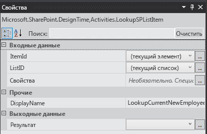
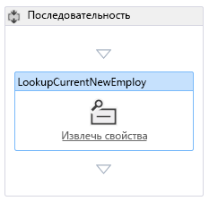
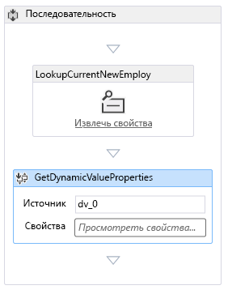
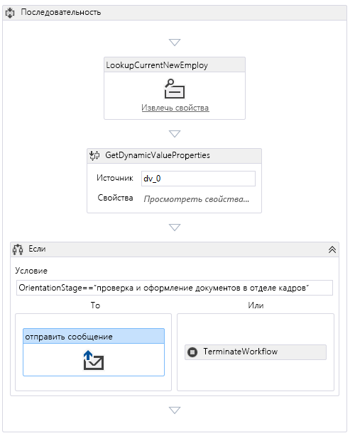
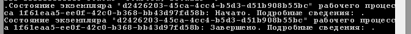

# Добавление рабочего процесса в надстройку для SharePoint с размещением в SharePoint
Узнайте, как добавить рабочий процесс в Надстройка SharePoint.
Это шестая часть из серии статей об основах разработки Надстройки SharePoint с размещением в SharePoint. Сначала вам необходимо ознакомиться с разделом  [Надстройки SharePoint](sharepoint-add-ins.md) и предыдущими статьями этой серии:

-  [Знакомство с созданием надстроек SharePoint с размещением в SharePoint](get-started-creating-sharepoint-hosted-sharepoint-add-ins.md)

-  [Развертывание и установка надстроек для SharePoint](deploy-and-install-a-sharepoint-hosted-sharepoint-add-in.md)

-  [Добавление настраиваемых столбцов в надстройку с размещением в SharePoint](add-custom-columns-to-a-sharepoint-hostedsharepoint-add-in.md)

-  [Добавление настраиваемого типа контента в надстройку для SharePoint с размещением в SharePoint](add-a-custom-content-type-to-a-sharepoint-hostedsharepoint-add-in.md)

-  [Добавление веб-части на страницу в надстройку для SharePoint с размещением в SharePoint](add-a-web-part-to-a-page-in-a-sharepoint-hosted-sharepoint-add-in.md)

> **Примечание**
> Если вы уже изучали предыдущие статьи серии о надстройках с размещением в SharePoint, то у вас есть решение Visual Studio, которое можно использовать для продолжения работы с этим разделом. Вы также можете скачать репозиторий по адресу  [SharePoint_SP-hosted_Add-Ins_Tutorials](https://github.com/OfficeDev/SharePoint_SP-hosted_Add-Ins_Tutorials) и открыть файл BeforeWorkflow.sln.

В этой статье вы добавите рабочий процесс Надстройка SharePoint, "Ориентация сотрудника", который уведомляет отдел кадров (HR) о том, что новый сотрудник готов для заполнения документов отдела кадров.
## Добавление рабочего процесса в надстройку

1. В **обозревателе решений** щелкните правой кнопкой проект и выберите **Добавить** > **Новая папка**. Назовите папку Рабочие процессы.

2. Щелкните правой кнопкой мыши новую папку и выберите **Добавить** > **Новый элемент**. Откроется диалоговое окно **Добавление нового элемента** с отображением узла **Office и SharePoint**.

3. Выберите **Рабочий процесс** и присвойте процессу имяHR_Intake. Когда появится запрос на выбор типа рабочего процесса, выберите **Рабочий процесс списка** и нажмите кнопку **Далее**.

4. На следующей странице мастера включите параметр **Да, связать...** и затем установите для элементов управления из раскрывающегося списка следующие значения:

  - **Библиотека или список, связываемые с рабочим процессом**

    Новые сотрудники в Сиэтле

  - **Список журналов...**

    <создать>

  - **Список задач...**

    <создать>

    Нажмите кнопку **Далее**.

5. На последней странице мастера выберите  *только*  параметр для автоматического запуска рабочего процесса, когда элемент *изменяется*  .

6. Нажмите кнопку **Готово**.

    Затем Инструменты разработчика Office для Visual Studio выполнит следующие действия:

  - создаст рабочий процесс HR_Intake в папке **Рабочий процесса** с дочерним файлом Workflow.xaml, который открыт в конструкторе рабочих процессов;

  - создаст экземпляр списка **WorkflowTaskList**, где создаются и обновляются задачи, входящие в рабочий процесс;

  - создаст экземпляра списка **WorkflowHistoryList**, который служит журналом различных действий каждого выполнения рабочего процесса.

7. Перетащите два новых экземпляра списка в папку **Списки**.

## Создание рабочего процесса

Рабочий процесс отправляет по электронной почте уведомление отделу кадров о том, что новый сотрудник завершил этап **Обзор** ориентации и готов для заполнения документов. Любые изменения в существующем элементе спискаНовые сотрудники в Сиэтле запускают рабочий процесс, но он ничего не делает, если в полеЭтап ориентации элемента списка не задано значениеДокументы отдела кадров. Если это так, сотруднику отделку кадров отправляется сообщение, а задача для этого сотрудника будет добавлена в **WorkflowTaskList**. 

> **Примечание**
> В различные этапы создания рабочего процесса синий ромб с восклицательным знаком  будет отображаться на одном или нескольких элементах в конструкторе рабочих процессов. Он означает временные ошибки. (Наведите указатель на символ, чтобы просмотреть краткое сообщение или выполните поиск **списка ошибок** в Visual Studio, чтобы получить подробные сведения). Это побочные эффекты незавершенности рабочего процесса. Все эти ошибки будут устранены после завершения этой процедуры.

1. Откройте **панель элементов** в Visual Studio, разверните узел **SharePoint список**, а затем перетащите **LookupSPListItem** в **последовательность** в конструкторе.

2. Выберите элемент **LookupSPListItem**, чтобы его свойства появились в области **Свойства** Visual Studio. Присвойте свойствам следующие значения:

  - **ItemID:** (текущий элемент);

  - **ListID:** (текущий список);

  - **DisplayName:** LookupCurrentNewEmployee.

    Теперь область **Свойства** должна выглядеть следующим образом:

   **Область свойств для LookupSPListItem**

    Щелкните в любом месте за пределами области, чтобы сохранить изменения. После этого поверхность конструктора должна выглядеть следующим образом.

   **Последовательность в конструкторе рабочих процессов**

3. Щелкните ссылку **Получить свойства** внутри переименованного действияLookupCurrentNewEmployee в конструкторе. После этого в последовательность будет добавлено действие **GetDynamicValueProperties**.

4. Щелкните текстовое поле **Определить...** в действии **GetDynamicValueProperties**. При этом откроется диалоговое окно **Свойства**.

5. Выберите **тип сущности** **Элемент списка** _имя_экземпляра_списка_, где  _имя_экземпляра_списка_ этоНовые сотрудники в Сиэтле.

6. В столбце **Путь** щелкните верхнюю ячейку и выберитеЭтап ориентации из раскрывающегося списка.

7. Щелкните ячейку, расположенную ниже, и выберите **Заголовок (заголовок)** из раскрывающегося списка.

8. Щелкните **Заполнить переменные**. При этом создаются переменные с именем OrientationStage и **Title**, которым будет присвоено значение соответствующего поля текущего элемента списка Новые сотрудники в Сиэтле. Диалоговое окно **Свойства** теперь должно выглядеть следующим образом:

   **Диалоговое окно свойств действия рабочего процесса**

9. Нажмите кнопку **ОК**. Поверхность конструктора будет выглядеть так:

   **Конструктор рабочих процессов**

10. Откройте **панель элементов** в Visual Studio, разверните узел **Поток управления**, а затем перетащите элемент **Если** в нижнюю часть **последовательности** под элемент **GetDynamicValueProperties**.

11. В поле **Условие** элемента **Если** введитеOrientationStage== "Документы отдела кадров".

12. Откройте **панель элементов** в Visual Studio, разверните узел **SharePoint — служебные программы**, а затем перетащите элемент **Электронная почта** в поле **То** действия **Если**.

13. Выберите действие **Электронная почта**. В области **Свойства** задайте значения свойств "Основной текст", "Тема" и "Кому". В этом случае нажмите кнопку выноски **...** для свойства и используйте открывшийся **редактор выражений**, чтобы ввести значение свойства, как показано в таблице ниже. Это строковые выражения C#, поэтому необходимо использовать кавычки именно так, как показано.  `Title` здесь — это переменная, назначенная ранее полю **Заголовок** элемента списка (оно содержит имя сотрудника).

  - **Основной текст:** `Title + " is waiting in the lobby to fill out benefits and employment forms."`

  - **Тема:** `Title + " is ready for HR paperwork"`

  - **Кому:** `new System.Collections.ObjectModel.Collection<string>() {"your_O365_email"}`

    Замените заполнитель  *your_O365_email*  на идентификатор, используемый для входа в учетную запись разработчика Office 365, например на *псевдоним*  @ *O365domain*  .sharepoint.com. Это строка C#, поэтому ее необходимо заключить в кавычки.

14. Откройте **панель элементов** в Visual Studio, разверните узел **Среда выполнения**, а затем перетащите элемент **TerminateWorkflow** в поле **Иначе** действия **Если**.

15. Выберите действие **TerminateWorkflow** в области **Свойства** и введите в поле **Причина** следующее значение, *включая кавычки*  :"Не на этапе документов отдела кадров". Конструктор теперь должен выглядеть следующим образом:

   **Конструктор рабочих процессов после завершения рабочего процесса**

## Запуск и тестирование надстройки

1. Нажмите клавишу F5, чтобы развернуть и запустить надстройку. Visual Studio выполнит временную установку надстройки на тестовом сайте SharePoint и немедленно запустит её. Кроме того, откроется консоль **узла службы тестирования** диспетчера рабочих процессов.

2. При открытии страницы надстройки по умолчанию откройте один из элементов для редактирования, и присвойте параметру Этап ориентации значениеДокументы отдела кадров. 

    В консоли **узла службы тестирования** появится индикатор того, что рабочий процесс запущен. Через короткое время появится индикатор завершения рабочего процесса. Ниже приведен пример:

   **Консоль узла службы тестирования**

> **Примечание**
> Если консоль **узла службы тестирования** не открывается, может потребоваться включить отладку рабочего процесса. Щелкните правой кнопкой мыши имя проекта в **обозревателе решений** и выберите **Свойства**. Откройте вкладку **SharePoint** в области **Свойства** и установите флажок **Включить отладку рабочего процесса**. 
3. Перейдите к папке "Входящие" (Outlook) вашей учетной записи разработчика Office 365. В ней будет сообщение с темой " *Сотрудник*  готов заполнить документы отдела кадров", где *Сотрудник*  — это имя сотрудника, элемент которого вы изменили. Текст сообщения будет таким: " *Сотрудник*  ожидает в лобби для заполнения форм о трудоустройстве". Ниже приведен пример:

   **Сообщение, отправленное рабочим процессом**

> **Совет**
> Если рабочий процесс начинается, но никогда не завершается и не отправляет сообщение, попробуйте завершить сеанс отладки и нажмите клавишу F5 еще несколько раз, прежде чем сделать вывод, что-то не так в коде. Иногда проблема заключается в SharePoint Online. > Если у вас по-прежнему возникают проблемы, попробуйте добавить тип контента с именем **ListFieldsContentType**, если его еще не существует, в раздел **ContentTypes** файла schema.xml. Ниже приведен пример разметки.>  `<ContentType ID="0x0100781dd48170b94fdc9706313c82b3d04c" Name="ListFieldsContentType" Hidden="TRUE">`   `</ContentType>`> Скопируйте весь раздел **FieldRefs** типа контента **NewEmployee** в этот новый тип контента.  Сохраните проект, отзовите его и нажмите F5 еще раз. 
4. Чтобы завершить сеанс отладки, закройте окно браузера или остановите отладку в Visual Studio. Каждый раз при нажатии клавиши F5 Visual Studio отзывает предыдущую версию надстройки и устанавливает последнюю версию.

5. Вы будете работать в этой надстройке и решении Visual Studio в других статьях, поэтому рекомендуется отзывать надстройку после завершения работы с ним. Щелкните правой кнопкой мыши проект в **обозревателе решений** и выберите **Отозвать**.

## 

В следующей статье этой серии мы добавим пользовательскую страницу и стиль в Надстройка SharePoint:  [Добавление настраиваемой страницы и стиля для надстройки с размещением в SharePoint](add-a-custom-page-and-style-to-a-sharepoint-hosted-sharepoint-add-in.md).

