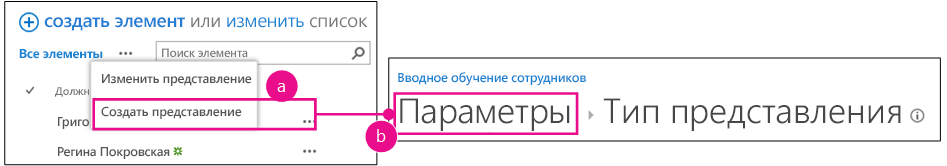
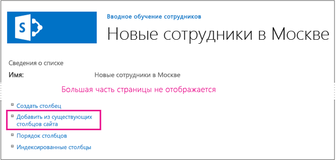
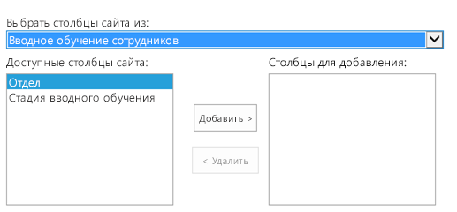
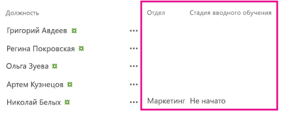

# Добавление настраиваемых столбцов в надстройку с размещением в SharePoint
Узнайте, как добавить настраиваемые столбцы в Надстройки SharePoint.
Это третья статья из цикла с базовыми сведениями о том, как разрабатывать Надстройки SharePoint с размещением в SharePoint. Сначала ознакомьтесь со статьей  [Надстройки SharePoint](sharepoint-add-ins.md) и предыдущими частями этого цикла:


-  [Знакомство с созданием надстроек SharePoint с размещением в SharePoint](get-started-creating-sharepoint-hosted-sharepoint-add-ins.md)


-  [Развертывание и установка надстроек для SharePoint](deploy-and-install-a-sharepoint-hosted-sharepoint-add-in.md)


> **Примечание**
> Если вы уже ознакомились с предыдущими статьями этого цикла о надстройках с размещением в SharePoint, у вас должно быть решение Visual Studio, которое поможет изучить и эту статью. Кроме того, вы можете скачать репозиторий на странице  [SharePoint_SP-hosted_Add-Ins_Tutorials](https://github.com/OfficeDev/SharePoint_SP-hosted_Add-Ins_Tutorials) и открыть файл BeforeColumns.sln.


В этой статье мы вернемся к коду, чтобы добавить столбцы сайта в Надстройка SharePoint "Вводное обучение сотрудников".
## Создание настраиваемых типов столбцов


1. В **обозревателе решений** щелкните правой кнопкой проект и выберите **Добавить** > **Новая папка**. Назовите папку Столбцы сайта.


2. Щелкните правой кнопкой мыши новую папку и выберите **Добавить** > **Новый элемент**. Откроется диалоговое окно **Добавление нового элемента** с отображением узла **Office и SharePoint**.


3. Выберите **Столбец сайта**, присвойте столбцу имя Подразделение и нажмите кнопку **Добавить**.


4. В файле elements.xml нового столбца сайта измените элемент **Field** так, чтобы он содержал атрибуты и значения, приведенные в следующем примере. Только * **не** следует изменять GUID*  атрибута **ID**, созданный Visual Studio,  *поэтому будьте осторожны при копировании и вставке*  .

 ```

<Field ID="{generated GUID}"
       Name="Division" 
       Title="Division" 
       DisplayName="Division" 
       Description="The division of the company where the employee works." 
       Group="Employee Orientation" 
       Type="Text" 
       Required ="FALSE">
</Field>
 ```

5. Добавьте другой **столбец сайта** с именемЭтап ориентации в ту же папку.


6. В файле elements.xml нового столбца сайта отредактируйте элемент **Field**, так, чтобы он содержал атрибуты и значения, приведенные в следующем примере, однако не меняйте GUID атрибута **ID**, оставив сгенерированное для него значение Visual Studio.

 ```

<Field ID="{generated GUID}"
       Name="OrientationStage" 
       Title="OrientationStage"
       DisplayName="Orientation Stage" 
       Group="Employee Orientation" 
       Description="The current orientation stage of the employee." 
       Type="Choice"
       Required ="TRUE">
</Field>
 ```

7. Так как это поле является полем выбора (Choice), необходимо указать возможные варианты, порядок их отображения в выпадающем списке перед пользователем, который должен сделать выбор. Так как это обязательное поле, необходимо указать значение по умолчанию. Добавьте следующую дочернюю маркировку в элемент **Field**.

 ```

<CHOICES>
      <CHOICE>Not Started</CHOICE>
      <CHOICE>Tour of building</CHOICE>
      <CHOICE>HR paperwork</CHOICE>
      <CHOICE>Corporate network access</CHOICE>
      <CHOICE>Completed</CHOICE>
</CHOICES>
<MAPPINGS>
      <MAPPING Value="1">Not Started</MAPPING>
      <MAPPING Value="2">Tour of building</MAPPING>
      <MAPPING Value="3">HR paperwork</MAPPING>
      <MAPPING Value="4">Corp network access</MAPPING>
      <MAPPING Value="5">Completed</MAPPING>
</MAPPINGS>
<Default>Not Started</Default>
 ```

8. Сохраните все файлы.


## Запуск надстройки и проверка столбцов


1. Нажмите клавишу F5, чтобы развернуть и запустить надстройку. Visual Studio выполнит временную установку надстройки на тестовом сайте SharePoint и немедленно запустит ее. 


2. Когда откроется страница надстройки по умолчанию, выберите ссылку **Новые сотрудники в Сиэтле**, чтобы открыть экземпляр настраиваемого списка.


3. Откройте страницу **Параметры** списка и добавьте два столбца, выполнив следующие действия.

1. Нажмите кнопку выноски **· · ·** над списком, а затем нажмите кнопку **Создать представление**.


2. Откроется страница **Тип представления** со структурой навигации **Параметры > Тип представления** рядом с верхней частью страницы. Щелкните **Параметры**.

   **Открытие страницы параметров списка**





3. На странице **Параметры** щелкните ссылку **Добавить из существующих столбцов сайта** слева, примерно посередине страницы.

   **Страница параметров списка**





4. На странице **Добавление столбцов из столбцов сайта** выберите **Ориентация сотрудника** из раскрывающегося списка **Выбрать столбцы сайта из**.

   **Страница "Добавление столбцов из столбцов сайта"**





5. Добавьте столбцы **Подразделение** и **Этап ориентации** в поле **Столбцы для добавления**.


6. Нажмите кнопку **ОК** для возврата на страницу **Параметры**, а затем щелкните **Новые сотрудники в Сиэтле** в верхней части страницы.


4. Новые столбцы теперь входят в список. Добавьте в него новый элемент. На форме для редактирования поле **Этап ориентации** уже будет содержать значение по умолчанию,Не запущено. (Существующие элементы будут пустыми в этом поле, так как они были созданы до добавления поля в список.)

**Список с новыми столбцами**





5. Чтобы завершить сеанс отладки, закройте окно браузера или остановите отладку в Visual Studio. Каждый раз при нажатии клавиши F5 Visual Studio отзывает предыдущую версию надстройки и устанавливает последнюю версию.


6. Вы будете работать с этой надстройкой и решением Visual Studio в других статьях, поэтому рекомендуется отзывать надстройку после завершения работы с ней. Щелкните правой кнопкой мыши проект в **обозревателе решений** и выберите **Отозвать**.


## 
<a name="Nextsteps"> </a>

На самом деле пользователям будет не очень удобно вручную добавлять настраиваемые столбцы в список, поэтому в следующей статье этой серии вы создадите настраиваемый тип контента, который включает в себя настраиваемые столбцы и автоматически связывается с шаблоном списка новых сотрудников:  [Добавление настраиваемого типа контента в надстройку для SharePoint с размещением в SharePoint](add-a-custom-content-type-to-a-sharepoint-hostedsharepoint-add-in.md). 


