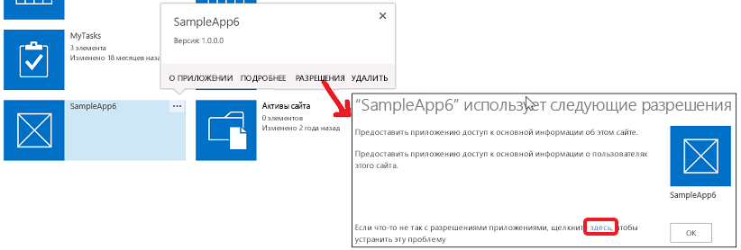

# Разрешения для надстроек в SharePoint 2013
Ознакомьтесь с разрешениями надстройки в SharePoint, включая типы разрешений, области запроса разрешений и управление разрешениями. В этой статье также рассматриваются различия между правами, связанными с разрешениями надстройки, правами пользователя и правами надстройки Магазин Office.
Прежде чем читать эту статью, необходимо ознакомиться с разделом  [Авторизация и проверка подлинности для надстроек в SharePoint 2013](authorization-and-authentication-of-sharepoint-add-ins.md).


**Посмотрите видеоролик о разрешениях надстройки.**


## Обзор разрешений надстройки в SharePoint
<a name="Perm_intro"> </a>

Надстройка SharePoint запрашивает разрешения, необходимые во время установки, у пользователя, который выполняет установку. Разработчик надстройки должен запрашивать разрешения, которые нужны надстройке для запуска, с помощью файла манифеста. Пользователь, запускающий надстройку, должен предоставить разрешения устройствам и веб-приложениям, которые получают доступ к SharePoint, но не установлены на веб-сайтах SharePoint, в среде выполнения. Дополнительные сведения можно узнать в статье  [Общие сведения о надстройках, запрашивающих разрешение на доступ из SharePoint во время выполнения](authorization-code-oauth-flow-for-sharepoint-add-ins.md#Overview). Пользователи могут предоставлять только те разрешения, которыми обладают. Пользователь может предоставить надстройке либо все необходимые разрешения, либо никаких. Выборочное предоставление разрешений невозможно. Если надстройка запрашивает разрешения в ходе выполнения, ее может запускать только пользователь с разрешениями уровня "Управление" на ресурсы SharePoint, даже если надстройке требуются разрешения более низкого уровня, например "Чтение".


Предоставленные надстройке разрешения также хранятся в базе данных контента для фермы SharePoint или области клиента SharePoint Online. Они не хранятся в службе токенов безопасности, например Служба контроля доступа Microsoft Azure (ACS). Когда пользователь впервые предоставляет надстройке разрешения, SharePoint получает сведения о надстройке из службы контроля доступа. Затем SharePoint сохраняет основные сведения о надстройке и ее разрешения в службе управления надстройками и базе данных контента. Дополнительные сведения о службе контроля доступа можно узнать в статье  [Создание надстроек для SharePoint, которые используют авторизацию с низким уровнем доверия](creating-sharepoint-add-ins-that-use-low-trust-authorization.md).


Если объект, на доступ к которому надстройке было предоставлено разрешение, удаляется, соответствующее разрешение также удаляется. Если же такой объект помещается в корзину, SharePoint не изменяет соответствующее разрешение. Это нужно для того, чтобы в случае восстановления объекта из корзины разрешение сохранилось.


При удалении надстройки отзываются все разрешения, предоставленные ей для области, из которой она удаляется. Это необходимо для того, чтобы надстройка не могла использовать свои учетные данные для удаленного доступа к защищенным ресурсам SharePoint после того, как пользователь удалит ее из SharePoint.


## Основные сведения о типах и областях разрешений надстройки
<a name="Perm_types"> </a>

С помощью запросов Надстройка SharePoint получает разрешения, необходимые для ее правильной работы. В запросах разрешений указываются как права, требуемые надстройке, так и область их действия. Разрешения запрашиваются в рамках манифеста надстройки.


> **Примечание**
> Области, описываемые в этом разделе, относятся только к содержимому списков и библиотек. Сведения об областях для других компонентов можно найти в разделе  [Основные сведения о типах и областях разрешений надстройки](#Perm_types) этой статьи.


Область запроса разрешений указывает на расположение в иерархии SharePoint, к которой применяется запрос разрешения.


> **Примечание**
> Надстройка SharePoint обладает собственным удостоверением и является субъектом безопасности, который называется субъектом надстройки. Так же как и в случае с пользователями и группами, субъект надстройки имеет определенные разрешения или права. Он имеет полные права на доступ к сайту надстройки, поэтому ему требуется запрашивать разрешения на доступ к ресурсам SharePoint только на хост-сайте или других расположениях вне сайта надстройки. Подробнее о сайте надстройки можно узнать в разделах  [Важные аспекты архитектуры и разработки надстройки SharePoint](important-aspects-of-the-sharepoint-add-in-architecture-and-development-landscap.md) и [Хост-сайты, сайты надстроек и компоненты SharePoint в SharePoint 2013](host-webs-add-in-webs-and-sharepoint-components-in-sharepoint-2013.md). 


SharePoint поддерживает четыре различных области разрешений для базы данных контента и области клиента, как показано в таблице 1. Названия областей разрешений совпадают с кодами URI, включая префикс http:, но они не являются URL-адресами и не содержат заполнителей. Области разрешений, перечисленные в этих статье и таблице, строки литералов.


**Таблица 1. Коды URI областей запроса разрешений для надстройки SharePoint и их описания**

|||
|:-----|:-----|
|**URI области** <br/> |**Описание** <br/> |
|область клиента  <br/> http://sharepoint/content/tenant  <br/> |Область клиента, в которой установлена надстройка. Включает все дочерние элементы данной области.  <br/> |
|семейство веб-сайтов  <br/> http://sharepoint/content/sitecollection  <br/> |Семейство веб-сайтов, в котором установлена надстройка. Включает все дочерние элементы данной области.  <br/> |
|веб-сайт  <br/> http://sharepoint/content/sitecollection/web  <br/> |Веб-сайт, на котором установлена надстройка. Включает все дочерние элементы данной области.  <br/> |
|список  <br/> http://sharepoint/content/sitecollection/web/list  <br/> |Представляет собой единый список веб-сайта, на котором установлена надстройка. Когда пользователю, который устанавливает надстройку, предлагается предоставить разрешения, в диалоговом окне он может выбрать один список, для которого надстройке предоставляются разрешения. Если надстройка требует разрешения более чем для одного списка, необходимо запрашивать разрешение для веб-области. Поскольку у разработчиков нет возможности контролировать выбор списков пользователями, равно как и сообщать последним, какой список следует выбрать, необходимо использовать веб-область, если есть такой список, для которого у вашей надстройки  *должно*  быть разрешение. (Тем не менее, существует возможность ограничить выбор пользователей определенными подмножествами списков. См. раздел [Область запроса разрешений со связанными свойствами](#AssociatedProperties) ниже.) <br/> |
 
Если надстройке предоставлено разрешение на одну из областей, оно применяется ко всем дочерним элементам в этой области. Например, если надстройке предоставлено разрешение на доступ к веб-сайту, ей также предоставляется разрешение на доступ ко всем спискам на веб-сайте и всем элементам этих списков.


Поскольку запросы разрешений выполняются безотносительно к топологии семейства веб-сайтов, в котором установлена надстройка, область указывается как тип, а не как URL-адрес определенного экземпляра. Эти типы областей выражаются в виде универсальных кодов ресурсов (URI). Разрешения для ресурсов, которые хранятся в базе данных контента SharePoint, упорядочены по следующему URI:  `http://sharepoint/content`.


## Различия между правами, связанными с разрешениями надстройки, и правами пользователя
<a name="Perm_diff"> </a>

Разрешения определяют действия, которые надстройке разрешено выполнять в рамках данной области. SharePoint поддерживает четыре уровня прав на доступ к базе данных контента. В каждой области надстройка может иметь следующие права:


- чтение;


- запись;


- управление;


- полный доступ.


> **Примечание**
> Подробнее о правах на чтение, запись, управление и полный доступ можно узнать в статье  [Планирование управления разрешениями приложений](http://technet.microsoft.com/ru-ru/library/jj219576%28office.15%29.aspx). 


> **Примечание**
> Эти права соответствуют уровням разрешений пользователей SharePoint, заданным по умолчанию: читатель, участник, разработчик и полный доступ. Подробнее об уровнях разрешений пользователя см. в статье  [Пользовательские разрешения и уровни разрешений](http://technet.microsoft.com/ru-ru/library/cc288074.aspx). > Во избежание путаницы, названия прав надстроек отличаются от названий прав, связанных с ролями пользователей SharePoint. Поскольку настройка разрешений, связанных с ролями пользователей SharePoint, не влияет на уровни разрешений, запрашиваемых надстройками, названия прав надстроек отличаются от названий соответствующих ролей пользователей SharePoint, за исключением права на полный доступ, которое невозможно настроить через пользовательский интерфейс управления разрешениями. 


Кроме того, учтите следующее.


- Надстройка может иметь право на выполнение запросов только в области поиска.


- Для некоторых областей Microsoft Project Server 2013 также имеются права на отправку состояния и повышение прав. Для большинства областей Project Server 2013 доступны только права на чтение и запись. Подробнее можно узнать в разделе  [Основные сведения о типах и областях разрешений надстройки](#Perm_types) этой статьи.


- Для таксономии доступны только права на чтение и запись.


> **Примечание**
> В отношении прав, которые могут запрашивать надстройки из Магазин Office, действуют некоторые ограничения. Подробнее можно узнать в разделе  [Основные сведения о типах и областях разрешений надстройки](#Perm_types) этой статьи.


В отличие от ролей пользователей SharePoint, эти уровни прав недоступны для настройки. Это позволяет гарантировать, что если надстройка запрашивает разрешения, ей предоставляется предсказуемый набор возможностей. При этом надстройке не нужно учитывать возможность того, что ей будет предоставлен более низкий уровень разрешений, чем требуется.


Пользователь не может предоставить надстройке разрешения, которых у него нет. При попытке установить надстройку, которой требуется больше разрешений, чем есть у пользователя, отображается соответствующее сообщение об ошибке.


Разрешения, которые неизвестны системе SharePoint, игнорируются. Это означает, что если надстройка запрашивает разрешение, которое не распознается системой SharePoint, эту надстройку можно установить, но она не запрашивает разрешение у пользователя и не получает его.


## Сведения о доступных областях и разрешениях, а также ограничениях, связанных с разрешениями надстроек Магазин Office
<a name="Perm_rightlist"> </a>

Различные области имеют разные наборы прав, которые может запросить надстройка. В этом разделе описываются наборы прав, доступные для каждой области. В нем также рассматриваются ограничения на Надстройки SharePoint, которые продаются через Магазин Office.


### Права надстроек Магазин Office

Для надстроек из Магазин Office доступны только права на чтение, запись и управление. Если вы попытаетесь отправить в Магазин Office надстройку, требующую права на полный доступ, отправка будет заблокирована. Поскольку блокировка происходит в процессе отправки в Магазин Office, надстройки, которые запрашивают уровень разрешений выше, чем "Управление", можно развертывать через каталог надстроек.


### Области запроса разрешений для содержимого списков и библиотек
<a name="PermissionsForLists"> </a>

В таблице 2 показаны области запроса разрешений для содержимого списков и библиотек. В ней также перечислены права, которые можно указать для универсального кода ресурса (URI) каждой области.


> **Примечание**
> Коды URI, используемые в таблице 2, представляют собой буквенные значения. 


**Таблица 2. Коды URI областей разрешений для надстройки SharePoint и доступные права**

|||
|:-----|:-----|
|**URI области** <br/> |**Доступные права** <br/> |
|http://sharepoint/content/sitecollection  <br/> |Чтение, запись, управление, полный доступ  <br/> |
|http://sharepoint/content/sitecollection/web  <br/> |Чтение, запись, управление, полный доступ  <br/> |
|http://sharepoint/content/sitecollection/web/list  <br/> |Чтение, запись, управление, полный доступ  <br/> |
|http://sharepoint/content/tenant  <br/> |Чтение, запись, управление, полный доступ  <br/> |
 
В следующем фрагменте кода демонстрируется использование областей разрешений и прав в файле AppManifest.xml. В первом примере надстройка запрашивает разрешение на чтение для области списка.



```XML

<?xml version="1.0" encoding="utf-8" ?>
<App xmlns="http://schemas.microsoft.com/sharepoint/2012/app/manifest"
     ProductID="{4a07f3bd-803d-45f2-a710-b9e944c3396e}"
     Version="1.0.0.0"
     SharePointMinVersion="15.0.0.0"
     Name="MySampleAddIn"
>
  <Properties>
    <Title>My Sample Add-in</Title>
    <StartPage>~remoteAppUrl/Home.aspx?{StandardTokens}</StartPage>
  </Properties>

  <AppPrincipal>
    <RemoteWebApplication ClientId="1ee82b34-7c1b-471b-b27e-ff272accd564" />
  </AppPrincipal>

  <AppPermissionRequests>
    <AppPermissionRequest Scope="http://sharepoint/content/sitecollection/web/list" Right="Write"/>
  </AppPermissionRequests>
</App>
```

В следующем фрагменте кода надстройка запрашивает разрешение на чтение для области сайта и разрешение на запись для области списка.



```XML

<?xml version="1.0" encoding="utf-8" ?>
<App xmlns="http://schemas.microsoft.com/sharepoint/2012/app/manifest"
     ProductID="{4a07f3bd-803d-45f2-a710-b9e944c3396e}"
     Version="1.0.0.0"
     SharePointMinVersion="15.0.0.0"
     Name="MySampleAddIn"
>
  <Properties>
    <Title>My Sample Add-in</Title>
    <StartPage>~remoteAppUrl/Home.aspx?{StandardTokens}</StartPage>
  </Properties>

  <AppPrincipal>
    <RemoteWebApplication ClientId="6daebfdd-6516-4506-a7a9-168862921986" />
  </AppPrincipal>

  <AppPermissionRequests>
    <AppPermissionRequest Scope="http://sharepoint/content/sitecollection/web" Right="Read"/>
    <AppPermissionRequest Scope="http://sharepoint/content/sitecollection/web/list" Right="Write"/>
  </AppPermissionRequests>
</App>
```


### Области запроса разрешений для других компонентов SharePoint
<a name="PermissionsForLists"> </a>

Области запроса разрешений для других компонентов SharePoint перечислены в следующих таблицах. 


> **Примечание**
> Коды URI, используемые в таблицах, представляют собой буквенные значения. 


В таблице 3 показана область запроса разрешений для Службы Business Connectivity Services (BCS). В ней также перечислены права, которые можно указать для универсального кода ресурса (URI) этой области.


**Таблица 3. Коды URI области запроса разрешений надстройки для Business Connectivity Services и доступные права**

|||
|:-----|:-----|
|**URI области** <br/> |**Доступные права** <br/> |
|http://sharepoint/bcs/connection  <br/> |Чтение  <br/> |
 

> **Примечание**
> Подробнее об области запроса разрешений надстройки для Business Connectivity Services можно узнать в разделе  [Business Connectivity Services в SharePoint 2013](http://msdn.microsoft.com/library/64b7d032-4b83-4e9e-bc08-f0a161af5457%28Office.15%29.aspx). 


В таблице 4 показана область запроса разрешений для поиска. В ней также перечислены права, которые можно указать для универсального кода ресурса (URI) этой области.


**Таблица 4. Коды URI области запроса разрешений надстройки для поиска и доступные права**

|||
|:-----|:-----|
|**URI области** <br/> |**Доступные права** <br/> |
|http://sharepoint/search  <br/> |QueryAsUserIgnoreAppPrincipal  <br/> |
 

> **Примечание**
> Подробнее об области запроса разрешений надстройки для поиска можно узнать в разделе  [Поиск в SharePoint 2013](http://msdn.microsoft.com/library/59220f81-0e5e-4945-8056-cf0a116446cb%28Office.15%29.aspx). 


В таблице 5 показана область запроса разрешений для Project Server 2013. В ней также перечислены права, которые можно указать для универсального кода ресурса (URI) каждой области.


> **Примечание**
> Надстройку, использующую компоненты и службы Project Server 2013, следует протестировать в среде, имеющей требуемые компоненты и службы Project Server. Сборка поставщика разрешений Project Server 2013, которой известны области разрешений Project Server 2013, не устанавливается по умолчанию с SharePoint Server. Подробнее можно узнать в документации разработчика для Project Server 2013. 


**Таблица 5. Коды URI области запроса разрешений надстройки для Project Server и доступные права**

|||
|:-----|:-----|
|**Область** <br/> |**Доступные права** <br/> |
|http://sharepoint/projectserver  <br/> |Управление  <br/> |
|http://sharepoint/projectserver/projects  <br/> |Чтение, запись  <br/> |
|http://sharepoint/projectserver/projects/project  <br/> |Чтение, запись  <br/> |
|http://sharepoint/projectserver/enterpriseresources  <br/> |Чтение, запись  <br/> |
|http://sharepoint/projectserver/statusing  <br/> |Отправка состояния  <br/> |
|http://sharepoint/projectserver/reporting  <br/> |Чтение  <br/> |
|http://sharepoint/projectserver/workflow  <br/> |Повышение прав  <br/> |
 


В таблице 6 показана область запроса разрешений для социальных функций. В ней также перечислены права, которые можно указать для универсального кода ресурса (URI) каждой области.


**Таблица 6. Коды URI области запроса разрешений надстройки для социальных функций и доступные права**

|||
|:-----|:-----|
|**URI области** <br/> |**Доступные права** <br/> |
|http://sharepoint/social/tenant  <br/> |Чтение, запись, управление, полный доступ  <br/> |
|http://sharepoint/social/core  <br/> |Чтение, запись, управление, полный доступ  <br/> |
|http://sharepoint/social/microfeed  <br/> |Чтение, запись, управление, полный доступ  <br/> |
 

> **Примечание**
> Подробнее об области запроса разрешений надстройки для социальных функций можно узнать в разделе  [Запросы на разрешения надстройки для доступа к социальным функциям](http://msdn.microsoft.com/library/8852ce36-8309-45a7-a141-2e10ac17a123%28Office.15%29.aspx#bkmk_AppPerms). 


В таблице 7 показана область запроса разрешений для таксономии. В ней также перечислены права, которые можно указать для универсального кода ресурса (URI) этой области.


**Таблица 7. Коды URI области запроса разрешений надстройки для таксономии и доступные права**

|||
|:-----|:-----|
|**URI области** <br/> |**Доступные права** <br/> |
|http://sharepoint/taxonomy  <br/> |Чтение, запись  <br/> |
 

> **Примечание**
> Подробнее об области запроса разрешений надстройки для таксономии можно узнать в разделе  [Добавление возможностей SharePoint 2013](http://msdn.microsoft.com/library/11ecb65e-6dc5-4cf1-80ca-3c16418697b6%28Office.15%29.aspx). 


### Область запроса разрешений со связанными свойствами
<a name="AssociatedProperties"> </a>

Область запроса разрешений для списков имеет дополнительное необязательное свойство. Для области списка может быть определено свойство с именем **BaseTemplateId** и целочисленным значением, соответствующим базовому шаблону списка, как показано в приведенном ниже примере разметки. Если оно не задано, пользователь, устанавливающий надстройку, может предоставить разрешение для *одного списка*  из всех представленных на сайте. Если задать идентификатор базового шаблона, доступным для пользователя окажется только набор списков, соответствующих значению свойства **BaseTemplateId**.


Свойство **BaseTemplateId** это дочерний элемент, а не атрибут элемента **AppPermissionRequest**. В следующем коде демонстрируется использование свойства **BaseTemplateId**.



```XML

<AppPermissionRequest Scope="http://sharepoint/content/sitecollection/web/list" Right="Write">
  <Property Name="BaseTemplateId" Value="101"/>
</AppPermissionRequest>
```


**Таблица 7. Область запроса разрешений со связанными свойствами**

||||
|:-----|:-----|:-----|
|**URI области** <br/> |**Свойство** <br/> |**Тип** <br/> |
|http://sharepoint/content/sitecollection/web/list  <br/> |**BaseTemplateId** <br/> |Целое число  <br/> > **Примечание**> Подробнее о свойстве **BaseTemplateId** и соответствующем целочисленном значении для базового шаблона списка см. в описании атрибута **Type** [Элемент List (List)](http://msdn.microsoft.com/library/b2b26fee-eb45-48ac-99f1-65f725da293f%28Office.15%29.aspx).           |
 

## Управление разрешениями надстройки и устранение связанных с ними неполадок
<a name="Perm_manage"> </a>

Надстройки SharePoint, установленные в SharePoint, получают разрешения во время своей установки. Надстройки, установленные на других платформах, но запрашивающие доступ к SharePoint, получают разрешения в ходе выполнения от пользователя, запустившего надстройку. Иногда надстройки первого типа могут терять разрешения. Чтобы повторно предоставить им разрешения, необходимо выполнить следующие действия.


1. На веб-сайте, где надстройка могла потерять разрешения, откройте страницу **Содержимое сайта** и нажмите кнопку **...** на плитке надстройки. Откроется выноска с еще одной кнопкой **...** или со ссылкой **РАЗРЕШЕНИЯ**. 


2. Нажмите кнопку **...** или щелкните ссылку **РАЗРЕШЕНИЯ** (если она отображается) и пропустите следующий шаг.


3. Щелкните ссылку **Разрешения**.


4. На открывшейся странице нажмите ссылку **здесь** в последнем предложении. Надстройке будут заново назначены ее разрешения, и снова откроется страница **Содержимое сайта**.





Иногда во время разработки надстройки или устранения неполадок в ней требуется изменить или повторно предоставить разрешения уже установленной надстройке. Для этого выполните следующие действия.


1. Перейдите по адресу  `http://<SharePointWebSite>/_layouts/15/AppInv.aspx`, где  _<SharePointWebSite>_ это URL-адрес веб-сайта, где установлена надстройка. Не добавляйте к URL-адресу никаких параметров запроса. Нужная форма отображается на странице только при переходе по указанному выше URL-адресу.


2. Введите идентификатор надстройки (или по-другому идентификатор клиента) в поле **ИД надстройки** и нажмите кнопку **Просмотр**. Остальные поля формы заполнятся сведениями о приложении.


3. Заполните поле **XML-запрос разрешения** запросами разрешений в том же виде, что и в манифесте надстройки. Примеры можно найти выше в разделе [Области запроса разрешений для содержимого списков и библиотек](#PermissionsForLists). Полные сведения о синтаксисе можно узнать в статье  [Элемент AppPermissionRequest](http://msdn.microsoft.com/library/4ad90fb0-33b2-aee5-69c2-5b97ca5334f8%28Office.15%29.aspx).


4. Нажмите кнопку **Создать**. 


Разрешения надстройки для определенной области отменяются после ее удаления из этой области.


## Узнайте, почему надстройки невозможно скрывать от пользователей
<a name="CannotBeHidden"> </a>

Любой пользователь, имеющий права на просмотр веб-сайта SharePoint, может запустить любую надстройку SharePoint, установленную на этом сайте. Действия, которые пользователь может выполнять с надстройкой, зависят от других его разрешений и  [типа политики авторизации](add-in-authorization-policy-types-in-sharepoint-2013.md), которая используется надстройкой. Если пользователь попытается выполнить с помощью надстройки действие, разрешения на которое у него нет, а при вызове SharePoint будет использоваться политика "пользователь + надстройка", отправить вызов не удастся.


## Дополнительные ресурсы
<a name="Filename_AdditionalResources"> </a>


-  [Авторизация и проверка подлинности для надстроек в SharePoint 2013](authorization-and-authentication-of-sharepoint-add-ins.md)


-  [Надстройки SharePoint](sharepoint-add-ins.md)


-  [Настройка локальной среды разработки надстроек SharePoint](set-up-an-on-premises-development-environment-for-sharepoint-add-ins.md)


-  [Знакомство с созданием надстроек SharePoint с размещением у поставщика](get-started-creating-provider-hosted-sharepoint-add-ins.md)


-  [Знакомство с созданием надстроек SharePoint с размещением в SharePoint](get-started-creating-sharepoint-hosted-sharepoint-add-ins.md)


