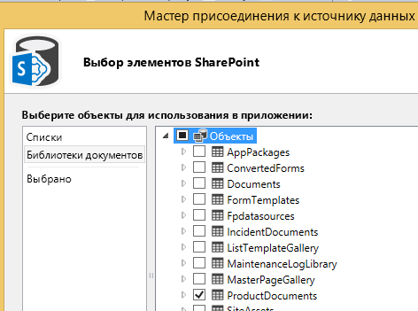
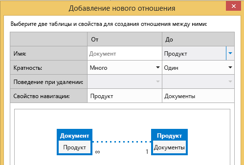
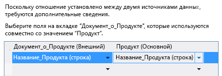
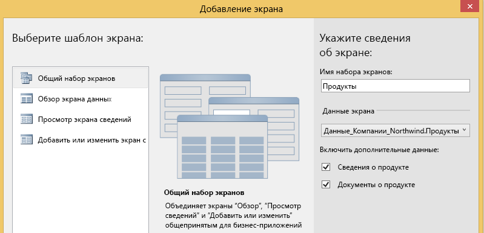
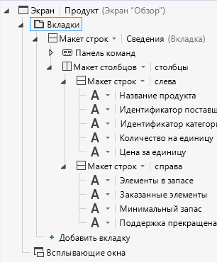
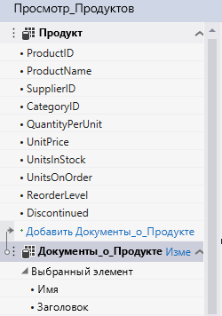
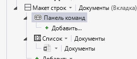
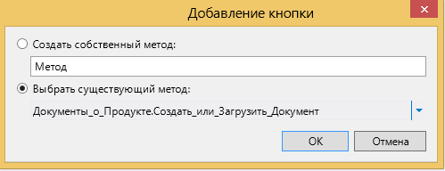

# Сопоставление библиотеки документов с сущностью
Используя библиотеки документов в SharePoint, можно создавать и загружать документы, связанные с определенными элементами списка или объекта. Например, в библиотеке можно хранить литературу по продажам и руководства по использованию для каждого продукта в списке. В облачной бизнес-надстройке библиотеку документов можно связать с объектом, создав отношение.
## Привязка библиотеки документов

Процесс привязки библиотеки документов с объектом состоит из трех этапов:

1. Добавление библиотеки документов SharePoint в проект в качестве источника данных.

    > **Важно!**
      > Сначала необходимо создать библиотеку документов на сайте SharePoint. Она должен содержать настраиваемый столбец, который соответствует уникальному полю в объекте. 
2. Создать отношение между библиотекой документов и объектом.

3. Добавить библиотеку документов на экран. Процесс зависит от того, создается ли новый экран или добавляется ли библиотека документов на существующий экран.

### Порядок добавления библиотеки документов

1. В **обозревателе решений** откройте контекстное меню для узла **Источники данных** и выберите пункт **Добавить источник данных**.

2. В **мастере присоединения источника данных** выберите значок **SharePoint** и нажмите кнопку **Далее**.

3. На странице **Введите данные соединения** в текстовом поле **Укажите адрес сайта SharePoint** введите URL-адрес сайта разработчика SharePoint и нажмите кнопку **Далее**.

4. На странице **Выбор элементов SharePoint** выберите в левой области элемент списка **Библиотеки документов** и в правой области установите флажок для вашей библиотеки документов, как показано на рис. 1.

   **Рис. 1. Выбор библиотеки документов**

    На рис.2 показана библиотека документов на сайте SharePoint.

   **Рис. 2. Обратите внимание на настраиваемый столбец ProductName**

    > **Важно!**
      > Библиотека документов уже должна существовать и содержать настраиваемый столбец, который сопоставляется с уникальным полем в вашем объекте. 
5. Введите имя в поле **Укажите имя источника данных** и нажмите кнопку **Готово**.

### Создание отношения

1. В **обозревателе решений** откройте объект библиотеки документов и в панели **Перспектива** выберите вкладку **Сервер**.

2. На панели инструментов выберите **Отношение**.

3. В диалоговом окне **Добавление нового отношения** в раскрывающемся списке **С** выберите объект, с которым нужно создать отношение, как показано на рис. 3.

   **Рис. 3. Создание отношения**

4. В раскрывающемся списке **Внешний ключ** выберите настраиваемый столбец из библиотеки документов.

5. В раскрывающемся списке **Первичный ключ** выберите поле объекта, которое сопоставляется с настраиваемым столбцом в библиотеке документов, а затем нажмите кнопку **ОК**. Например, для настраиваемого столбца ProductName выберите поле ProductName, как показано на рис. 4.

   **Рис. 4. Связанные внешний и первичный ключи**

    > **Примечание**
      > Поле должно иметь такой же тип данных, что и поле **Внешний ключ**. 

### Добавление библиотеки документов на новый набор экранов

1. В **обозревателе решений** откройте объект, связанный с библиотекой документов, и в панели **Перспектива** выберите вкладку **HTMLClient**.

2. На панели инструментов выберите **Экран**.

3. В диалоговом окне **добавления нового экрана** введите имя набора экранов в текстовом поле **Имя набора экранов**.

4. В списке **Данные экрана** выберите ваш объект.

5. В списке **Включить дополнительные данные** установите флажок вашей библиотеки документов и нажмите кнопку **ОК**.

    На рис/ 5 показан экран для объекта Product.

   **Рис. 5. Набор экранов продуктов**

    Экран **Представление**, создаваемый для объекта, содержит вкладку **Документы** и кнопку **Добавить документ**. При ее нажатии отображается контекстное меню для добавления или отправки документов.

### Добавление библиотеки документов на существующий экран

1. В **обозревателе решений** откройте контекстное меню для экрана, которое необходимо связать с библиотекой документов, и выберите пункт **Открыть**.

2. В конструкторе экранов выберите узел **Вкладки**, как показано на рис. 6, а затем выберите узел **Добавить вкладку**.

   **Рис. 6. Узел "Вкладки"**

3. В окне **Свойства** выберите свойство **Отображаемое имя** и введите понятное имя добавленной вкладки. Например,Документы.

4. В левой области конструктора экранов выберите ссылку **Добавить** _имя_библиотеки_документов_, как показано на рис. 7. Где  _имя_библиотеки_документов_ имя вашей библиотеки документов.

   **Рис. 7. Ссылка "Добавить ProductDocuments"**

5. В центральной области выберите узел новой вкладки, раскройте список **Добавить** и выберите _имя_библиотеки_документов_.

6. Разверните узел **Панель команд** для новой вкладки, как показано на рис. 8, и щелкните **Добавить**.

   **Рис. 8. Узел "Панель команд"**

7. В диалоговом окне **Добавление кнопки** примите настройки по умолчанию и нажмите кнопку **ОК**.

    На рис. 9 показано диалоговое окно **Добавление кнопки** с методом по умолчанию, **createOrUploadDocument**.

   **Рис. 9. Диалоговое окно "Добавление кнопки"**

8. В окне **Свойства** выберите свойство **Отображаемое имя** и введите понятное имя кнопки. Например,Добавить документ.

    Теперь экран содержит вкладку **Документы** с кнопкой на панели команд. При ее нажатии отображается контекстное меню для добавления или отправки документов.

## Дополнительные ресурсы

-  [Разработка облачных бизнес-надстроек](develop-cloud-business-add-ins.md)

-  [Управление происшествиями. Учебник по облачной бизнес-надстройке](incident-manager-a-cloud-business-add-in-tutorial.md)

