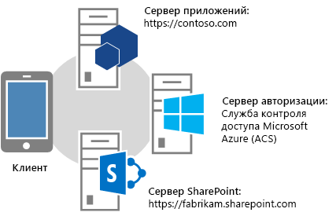
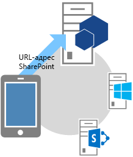
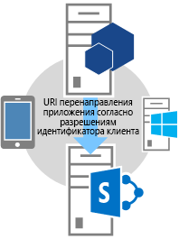
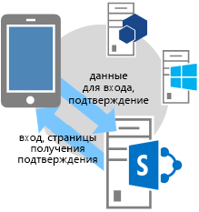
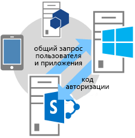
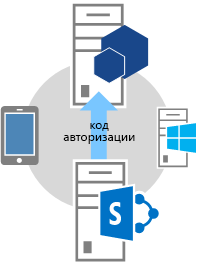
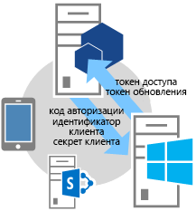
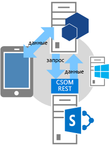

# Поток кода аутентификации OAuth для надстроек в SharePoint
Сведения о потоке авторизации OAuth для надстроек, запрашивающих разрешение на доступ к ресурсам SharePoint во время работы, а также об использовании страницы OAuthAuthorize.aspx и URI перенаправления SharePoint.
## Общие сведения о надстройках, запрашивающих разрешение на доступ из SharePoint во время выполнения
<a name="Overview"> </a>


> [!Примечание]
> В этой статье предполагается, что вы знакомы с  [Создание надстроек для SharePoint, которые используют авторизацию с низким уровнем доверия](creating-sharepoint-add-ins-that-use-low-trust-authorization.md) и основными понятиями и принципами протокола OAuth. Дополнительные сведения об OAuth см. на сайте [OAuth.net](http://oauth.net/) и на странице [Протокол веб-авторизации (oauth)](http://datatracker.ietf.org/doc/active/#oauth). 
  
    
    

В некоторых случаях надстройка может запросить разрешение на доступ к ресурсам SharePoint во время выполнения ( **надстройка может запрашивать разрешение на доступ к ресурсам SharePoint динамически во время выполнения**, а не установки). Такие надстройки не обязательно должны запускаться из среды SharePoint или даже быть установленными в ней. Например, это может быть собственная надстройка устройства; приложение, запускаемая на любом веб-сайте; или Надстройка Office, запускаемая из приложения Office, которому нужен доступ к ресурсам SharePoint во время выполнения.
  
    
    

> [!Примечание]
> Этот тип надстройки может быть запущен только пользователями с разрешениями "Управление" на всех ресурсах, к которым надстройка запрашивает доступ. Например, если надстройка запрашивает у веб-сайта только разрешение на чтение, пользователь, у которого для веб-сайта есть права на "чтение", но не "управление", не может запускать надстройку. 
  
    
    

Чтобы вызывать SharePoint, такие **надстройки сначала нужно зарегистрировать** в Панель мониторинга продаж или на странице appregnew.aspx. Подробнее о регистрации надстроек в Панель мониторинга продаж и на странице appregnew.aspx см. в статье [Регистрация надстроек для SharePoint 2013](register-sharepoint-add-ins-2013.md).
  
    
    
После регистрации надстройка станет  *субъектом безопасности*  и получит удостоверение, как и в случае с пользователями и группами. Такое удостоверение называетсясубъектом надстройки. Как и пользователи и группы, субъект надстройки имеет определенные разрешения. Подробнее о субъектах надстроек см. в статье  [Регистрация надстроек для SharePoint 2013](register-sharepoint-add-ins-2013.md).
  
    
    
После регистрации надстройки вы получите идентификатор и секрет клиента, домен надстройки и URI перенаправления для субъекта надстройки. Эти сведения регистрируются на сервере авторизации — Служба контроля доступа Microsoft Azure (ACS).
  
    
    

## OAuth для надстроек, запрашивающих разрешение во время выполнения
<a name="Flow"> </a>

В этом разделе приведена сводная информация о потоке аутентификации и авторизации OAuth для надстройки SharePoint, запрашивающей разрешения на доступ во время выполнения. Такой поток называется **потоком кода для аутентификации**. Здесь объясняется, как надстройка, запущенная вне SharePoint, может обращаться к ресурсам в SharePoint.
  
    
    

> [!Примечание]
> Поток **состоит из ряда операций взаимодействия между вашей надстройкой, SharePoint, сервером авторизации (сервером управления доступом) и пользователем** во время выполнения. Таким образом, для взаимодействия со службой контроля доступа потоку требуется SharePoint Online или ферма SharePoint, подключенная к Интернету. Фермы SharePoint, не подключенные к Интернету, должны использовать [систему авторизации с высоким уровнем доверия](creating-sharepoint-add-ins-that-use-high-trust-authorization.md). 
  
    
    

Требуется веб-приложение или служба, размещаемая отдельно от SharePoint. Даже надстройке для устройства требуется URL-адрес веб-приложения или службы, который можно зарегистрировать в службе контроля доступа (см. выше), даже если веб-компонент ни для чего больше не используется. Для простоты в этой статье в качестве примера надстройки рассмотрим веб-приложение Contoso.com. В нем используется клиентская объектная модель (CSOM) SharePoint или SharePoint REST API для вызовов SharePoint. Когда приложение впервые пытается получить доступ к SharePoint, SharePoint запрашивает код авторизации у службы контроля доступа, который она может отправить приложению Contoso.com. Затем приложение использует код авторизации для запроса маркера доступа из службы контроля доступа. Получив маркер доступа, приложение Contoso.com включает его во все свои запросы к SharePoint.
  
    
    

### Подробный пример потока
<a name="Fly"> </a>

Предположим, что компания Contoso предоставляет веб-службу фотопечати. Пользователь хочет распечатать фотографии. Для этого ему необходимо предоставить службе Contoso разрешение на доступ и печать фотографий из библиотек на сайте SharePoint Online,  `fabrikam.sharepoint.com`.
  
    
    

  
    
    

  
    
    
Надстройка фотопечати зарегистрировано, поэтому у него уже есть идентификатор и секрет клиента, а также URI перенаправления. URI перенаправления, предоставленный Contoso при регистрации надстройки:  `https://contoso.com/RedirectAccept.aspx`. Сведения об идентификаторе и секрете клиента сохраняются в файле web.config надстройки фотопечати. Вот пример записи идентификатора и секрета клиента в файл web.config.
  
    
    


```XML

<configuration>
  <appSettings>
    <add key="ClientId" value="c78d058c-7f82-44ca-a077-fba855e14d38 "/>
    <add key="ClientSecret" value="SbALAKghPXTjbBiLQZP+GnbmN+vrgeCMMvptbgk7T6w= "/>

  </appSettings>

</configuration>
```

Ниже описаны этапы потока кода аутентификации.
  
    
    

    
> [!Совет]
> Следующие действия ссылаются на методы в файле TokenHelper.cs (или TokenHelper.vb). Этот управляемый код не компилируется, поэтому для него справочные разделы недоступны. Однако сам файл подробно прокомментирован с описанием каждого класса, параметра члена и возвращаемого значения. Вы можете открыть его копию для справки при чтении следующих инструкций. 
  
    
    


||||
|:-----|:-----|:-----|
|**1** <br/> ||**Клиент открывает приложение, а затем переходит на сайт SharePoint для получения данных.** <br/> Пользователь открывает веб-сайт фотопечати Contoso. В его пользовательском интерфейсе указывается, что пользователь может печатать фотографии, хранящиеся на любом сайте SharePoint Online. В данном примере URL-адрес:  `https://contoso.com/print/home.aspx`.  <br/> Надстройка фотопечати предлагает пользователю ввести URL-адрес коллекции фотографий. Пользователь вводит адрес сайта SharePoint Online:  `https://fabrikam.sharepoint.com/`.  <br/> |
|**2** <br/> ||**Надстройка перенаправляется на URL-адрес авторизации сайта SharePoint.** <br/> Когда пользователь нажимает кнопку для получения фотографий, надстройка фотопечати Contoso перенаправляет браузер на URL-адрес  `https://fabrikam.sharepoint.com/`. Это ответ перенаправления HTTP 302.  <br/> Если вы используете Microsoft .NET, **Response.Redirect** — лишь один из нескольких способов перенаправления, которые можно использовать в коде. Используя файл TokenHelper (с расширением CS или VB) в проекте, ваш код может вызвать перегруженный метод **GetAuthorizationUrl** (используя перегрузку с тремя аргументами). Он создает URL-адрес перенаправления OAuthAuthorize.aspx автоматически. С помощью вашего кода также можно сформировать URL-адрес вручную. <br/> Например, если вы вызываете метод **GetAuthorizationUrl** для создания URL-адреса OAuthAuthorize.aspx, используя файл TokenHelper.cs (или TokenHelper.vb) в проекте, код будет следующим: <br/>  `Response.Redirect(TokenHelper.GetAuthorizationUrl(`           `sharePointSiteUrl.ToString(),`           `"Web.Read List.Write",`           `"https://contoso.com/RedirectAccept.aspx"));` <br/> Если посмотреть на перегрузку метода **GetAuthorizationUrl** с тремя параметрами в файле TokenHelper (с расширением CS или VB), вы увидите, что второй параметр — это область разрешений, т. е. список разделенных пробелом разрешений, запрашиваемых надстройкой, в кратком формате. Дополнительные сведения об областях разрешений см. в разделе [Общие сведения о псевдонимах областей разрешений и использовании страницы OAuthAuthorize.aspx](#Scope). Третьим параметром должен быть тот же URI перенаправления, который использовался при регистрации надстройки. Подробнее о регистрации см. в статье  [Регистрация надстроек для SharePoint 2013](register-sharepoint-add-ins-2013.md). Вы также увидите, что возвращаемая строка — это URL-адрес, включающий параметры строки запроса.  <br/> При желании вы можете создать URL-адрес перенаправления OAuthAuthorize.aspx вручную. Например, URL-адрес, на который надстройка Contoso перенаправляет пользователя, будет в данном случае таким:  <br/>  `https://fabrikam.sharepoint.com/_layouts/15/OAuthAuthorize.aspx?client_id=client_GUID&amp;scope=app_permissions_list&amp;response_type=code&amp;redirect_uri=redirect_uri` <br/> Как видно из примера, надстройка фотопечати Contoso отправляет идентификатор клиента OAuth и URI перенаправления на сайт Fabrikam в параметрах строки запроса. Далее приведен пример запроса GET с примерами значений строки запроса. Разрывы строки добавлены для ясности. Фактический целевой URL-адрес — это одна строка.  <br/>  `GET /authcode HTTP/1.1`           `Host: fabrikam.sharepoint.com`                     `/oauthauthorize.aspx`           `?client_id= c78d058c-7f82-44ca-a077-fba855e14d38`           `&amp;scope=list.read`           `&amp;response_type=code`           `&amp;redirect_uri= https%3A%2F%2Fcontoso%2Ecom%2Fredirectaccept.aspx`           <br/> Чтобы использовать для подтверждения отдельное всплывающее диалоговое окно, можно добавить параметр запроса **IsDlg=1** в URL-адрес, как показано здесь: <br/>  `/oauthauthorize.aspx?IsDlg=1&amp;client_id= c78d058c-7f82-44ca-a077-fba855e14d38&amp;scope=list.read&amp;response_type=code&amp;redirect_uri= https%3A%2F%2Fcontoso%2Ecom%2Fredirectaccept.aspx` <br/> |
|**3** <br/> ||**В SharePoint отображается страница подтверждения для предоставления надстройке разрешений.** <br/> Если пользователь еще не вошел на сайт Fabrikam SharePoint Online, ему предлагается сделать это. Если пользователь вошел, то SharePoint отображает HTML-страницу подтверждения.  <br/> На странице подтверждения пользователю предлагается предоставить надстройке фотопечати Contoso запрошенные разрешения или отказать в их предоставлении. В этом случае пользователь предоставляет надстройке разрешения на чтение библиотеки фотографий в Fabrikam.  <br/> |
|**4** <br/> ||**SharePoint запрашивает кратковременный код авторизации у службы контроля доступа.** <br/> Сайт SharePoint Online компании Fabrikam запрашивает у службы контроля доступа создание кратковременного (приблизительно 5 минут) кода авторизации, который является уникальным для этой комбинации пользователя и надстройки.  <br/> ACS0000 отправляет код авторизации на сайт компании Fabrikam.  <br/> |
|**5** <br/> ||**SharePoint Online перенаправляется на зарегистрированный URI перенаправления надстройки, передавая код авторизации надстройке.** <br/> Сайт Fabrikam SharePoint Online перенаправляет браузер обратно в Contoso с помощью HTTP-ответа 302. Соответствующий URL-адрес использует URI перенаправления, указанный при регистрации надстройки фотопечати, а также строку запроса кода авторизации. URL-адрес перенаправления имеет такую структуру:  <br/>  `https://contoso.com/RedirectAccept.aspx?code=<authcode>` <br/> |
|**6** <br/> ||**Надстройка использует код авторизации для запроса маркера доступа у службы контроля доступа, которая проверяет запрос, прекращает действие кода авторизации и отправляет маркеры доступа и обновления надстройке.** <br/> Contoso получает код авторизации из параметра запроса и включает его вместе с идентификатором и секретом клиента в запрос маркера доступа, отправляемый службе контроля доступа.  <br/> Если вы используете управляемый код и SharePoint CSOM, файл TokenHelper (с расширением CS или VB), запрос к службе контроля доступа выполняется методом **GetClientContextWithAuthorizationCode**. В данном случае код выглядит следующим образом (где  `authCode` — это переменная, которой назначен код авторизации): <br/>  `TokenHelper.GetClientContextWithAuthorizationCode(`           `"https://fabrikam.sharepoint.com/",`           `"00000003-0000-0ff1-ce00-000000000000",`           `authCode,`           `"1ee82b34-7c1b-471b-b27e-ff272accd564",`           `new Uri(Request.Url.GetLeftPart(UriPartial.Path)));`           <br/> В файле TokenHelper (с расширением CS или VB) можно увидеть, что второй параметр метода **GetClientContextWithAuthorizationCode** — это `targetPrincipalName`. Это значение всегда равно " `00000003-0000-0ff1-ce00-000000000000`" в надстройке, которая обращается к SharePoint. При трассировке иерархии вызовов из **GetClientContextWithAuthorizationCode** также видно, что код получает идентификатор и секрет клиента из файла web.config. <br/> Служба контроля доступа получает запрос Contoso и проверяет идентификатор и секрет клиента, URI перенаправления и код авторизации. Если все верно, то служба контроля доступа аннулирует код авторизации (он используется только один раз) и создает маркер обновления и маркер доступа, который возвращается Contoso.  <br/> Надстройка Contoso может кэшировать этот маркер доступа для использования в последующих запросах. По умолчанию маркеры доступа действуют около 12 часов. Каждый маркер доступа связан с учетной записью пользователя, указанной в исходном запросе на авторизацию, и предоставляет доступ только к тем службам, которые указаны в запросе. Надстройка должна надежно хранить маркер доступа.  <br/> Приложение Contoso также может кэшировать маркер обновления. По умолчанию он действителен 6 месяцев. Когда истечет срок действия маркера доступа, от службы контроля доступа можно получить маркер обновления для нового маркера доступа. Подробнее о маркерах см. в статье  [Обработка маркеров безопасности в надстройках с низким уровнем доверия для SharePoint, размещаемых у поставщика](handle-security-tokens-in-provider-hosted-low-trust-sharepoint-add-ins.md).  <br/> |
|**7** <br/> ||**Теперь с помощью маркера доступа надстройка может запрашивать данные с сайта SharePoint, а затем отображать их пользователю.** <br/> Contoso включает маркер доступа для вызова REST API или запроса CSOM к SharePoint, передавая маркер доступа OAuth в заголовке HTTP **Authorization**.  <br/> SharePoint возвращает информацию, запрошенную Contoso. Подробнее о выполнении этого запроса см. в статье  [Обработка маркеров безопасности в надстройках с низким уровнем доверия для SharePoint, размещаемых у поставщика](handle-security-tokens-in-provider-hosted-low-trust-sharepoint-add-ins.md).  <br/> |
   

## Общие сведения о псевдонимах областей разрешений и использовании страницы OAuthAuthorize.aspx
<a name="Scope"> </a>

В этом разделе предполагается, что вы ознакомились со статьей  [Разрешения для надстроек в SharePoint 2013](add-in-permissions-in-sharepoint-2013.md). В таблице 1 показаны URI областей запросов разрешений надстроек, описанные в этой статье, а также дополнительный столбец ( **Псевдоним области** ). Право FullControl недоступно в столбце **Доступные права**, так как надстройка, запрашивающая разрешение на доступ к ресурсам SharePoint во время выполнения, не может запросить право на полный доступ.
  
    
    
Значения в столбце **Псевдоним области** — это сокращенные версии значений в столбце **URI области**. Эти псевдонимы могут использоваться только надстройками, запрашивающими разрешение на доступ к ресурсам SharePoint во время выполнения. (Значения URI области используются в манифесте надстроек, которые запускаются из SharePoint. Эти надстройки запрашивают доступ при установке.)
  
    
    
Псевдонимы областей используются только в контексте использования страницы перенаправления OAuthAuthorize.aspx. Как показано в шаге 2 потока OAuth в предыдущем разделе, если надстройка использует управляемый код, псевдонимы применяются при вызове метода **GetAuthorizationUrl** TokenHelper (с расширением CS или VB) в проекте. Вот еще один пример:
  
    
    


```cs

Response.Redirect(TokenHelper.GetAuthorizationUrl(
    sharePointSiteUrl.ToString(), 
    "Web.Read List.Write ", 
    "https://contoso.com/RedirectAccept.aspx "));
```

Значение параметра  _scope_,  `Web.Read List.Write` — это пример запроса разрешений по псевдониму области. Параметр _scope_ — это набор запросов областей разрешений и прав с разделителями-пробелами.
  
    
    
Если вы не используете управляемый код, то псевдонимы области используются в поле области URL-адреса перенаправления. Например:
  
    
    
 `https://fabrikam.sharepoint.com/_layout/15/OAuthAuthorize.aspx?client_id=c78d058c-7f82-44ca-a077-fba855e14d38&amp;scope=list.write&amp;response_type=code&amp;redirect_uri=https%3A%2F%2Fcontoso%2Ecom%2Fredirectaccept.aspx`
  
    
    

> [!Примечание]
> Описание областей см. в разделе  [Разрешения для надстроек в SharePoint 2013](add-in-permissions-in-sharepoint-2013.md). 
  
    
    


**Таблица 1. Коды URI областей запроса разрешений для надстройки SharePoint и соответствующие им псевдонимы**

||||
|:-----|:-----|:-----|
|**URI области** <br/> |**Псевдоним области** <br/> |**Доступные права** <br/> |
|http://sharepoint/content/sitecollection  <br/> |Site  <br/> |Чтение, запись, управление  <br/> |
|http://sharepoint/content/sitecollection/web  <br/> |Web  <br/> |Чтение, запись, управление  <br/> |
|http://sharepoint/content/sitecollection/web/list  <br/> |List  <br/> |Чтение, запись, управление  <br/> |
|http://sharepoint/content/tenant  <br/> |AllSites  <br/> |Чтение, запись, управление  <br/> |
|http://sharepoint/bcs/connection  <br/> |Нет (сейчас не поддерживается)  <br/> |Чтение  <br/> |
|http://sharepoint/search  <br/> |Search  <br/> |QueryAsUserIgnoreAppPrincipal  <br/> |
|http://sharepoint/projectserver  <br/> |ProjectAdmin  <br/> |Управление  <br/> |
|http://sharepoint/projectserver/projects  <br/> |Projects  <br/> |Чтение, запись  <br/> |
|http://sharepoint/projectserver/projects/project  <br/> |Project  <br/> |Чтение, запись  <br/> |
|http://sharepoint/projectserver/enterpriseresources  <br/> |ProjectResources  <br/> |Чтение, запись  <br/> |
|http://sharepoint/projectserver/statusing  <br/> |ProjectStatusing  <br/> |Отправка состояния  <br/> |
|http://sharepoint/projectserver/reporting  <br/> |ProjectReporting  <br/> |Чтение  <br/> |
|http://sharepoint/projectserver/workflow  <br/> |ProjectWorkflow  <br/> |Повышение прав  <br/> |
|http://sharepoint/social/tenant  <br/> |AllProfiles  <br/> |Чтение, запись, управление  <br/> |
|http://sharepoint/social/core  <br/> |Social  <br/> |Чтение, запись, управление  <br/> |
|http://sharepoint/social/microfeed  <br/> |Microfeed  <br/> |Чтение, запись, управление  <br/> |
|http://sharepoint/taxonomy  <br/> |TermStore  <br/> |Чтение, запись  <br/> |
   

## Сведения об использовании URI перенаправления и пример страницы перенаправления
<a name="RedirectURI"> </a>


  
    
    
 **URI перенаправления**, используемый надстройками, которые запрашивают разрешение во время выполнения, — это **URI, на который SharePoint перенаправляет браузер после предоставления разрешения** (в качестве параметра запроса включается код авторизации). На шаге 2 описания потока выше приведен пример жесткого кодирования URI в вызов метода **GetAuthorizationUrl**. Кроме того, надстройка ASP.NET может хранить URI перенаправления в файле web.config, как показано в этом примере:
  
    
    


```XML

<configuration>
  <appSettings>
    <add key="RedirectUri" value="https://contoso.com/RedirectAccept.aspx" />
  </appSettings>
<configuration>
```

Это значение можно получить с помощью вызова  `WebConfigurationManager.AppSettings.Get("RedirectUri")`.
  
    
    
 **Конечная точка в URI перенаправления получает код авторизации из параметра запроса и использует его для получения маркера доступа**, с помощью которого затем можно получить доступ к SharePoint. Обычно конечная точка — это та же страница, метод контроллера или веб-метод, который изначально пытался получить доступ к SharePoint. Но это может быть и страница или метод, который только получает маркер авторизации, а затем перенаправляется на другую страницу или метод. Специальная страница или метод может передавать маркер авторизации или кэшировать его (время существования составляет около 5 минут.) Маркер авторизации также может использоваться для получения маркера доступа, который затем кэшируется.
  
    
    
Вот пример кода программной части такой страницы в приложении ASP.NET. Обратите внимание на следующие аспекты этого кода.
  
    
    

- В нем используется файл TokenHelper.cs, который создают Инструменты разработчика Office для Visual Studio.
    
  
- В коде предполагается, что существует параметр запроса "code", содержащий код авторизации. Это безопасно, так как страницу вызывает только SharePoint и только при передаче кода авторизации.
    
  
- В нем используется клиентский объект контекста CSOM для доступа к SharePoint, но можно также просто кэшировать этот объект на сервере и перейти на другую страницу.
    
  
- Метод **GetClientContextWithAuthorizationCode** использует код авторизации для получения кода доступа. Затем создается клиентский объект контекста SharePoint и изменяется обработчик объекта для события **ExecutingWebRequest** таким образом, чтобы включать маркер доступа во все запросы к SharePoint. На самом деле, маркер доступа кэшируется внутри объекта.
    
  
- Метод **GetClientContextWithAuthorizationCode** отправляет службе контроля доступа URL-адрес перенаправления в параметре `rUrl`, но служба контроля доступа использует его для идентификации в случае кражи кода авторизации. Служба контроля доступа не использует его для повторного перенаправления, поэтому он не создает бесконечный цикл из-за перенаправления на себя.
    
  
- В коде не предусмотрена возможность работы с маркером доступа с истекшим сроком действия. После создания клиентского объекта контекста он продолжает использоваться тот же маркер доступа. Маркер обновления вообще не используется. Это правильная стратегия для надстроек, используемых только в сеансах, которые длятся менее времени существования маркера доступа.
    
  
Более сложный пример использования маркера обновления для получения нового маркера доступа см. в следующем разделе.
  
    
    


```cs

public partial class RedirectAccept : System.Web.UI.Page
{
    protected void Page_Load(object sender, EventArgs e)
    {
        string authCode = Request.QueryString["code"];
        Uri rUri = new Uri("https://contoso.com/RedirectAccept.aspx");

        using (ClientContext context = TokenHelper.GetClientContextWithAuthorizationCode(
            "https://fabrikam.sharepoint.com/", 
            "00000003-0000-0ff1-ce00-000000000000",
            authCode,
            "1ee82b34-7c1b-471b-b27e-ff272accd564".
            rUri))
       {
           context.Load(context.Web);
           context.ExecuteQuery();

           Response.Write("<p>" + context.Web.Title + "</p>");
       }
    }
}

```


## Пример кода программной части страницы, обращающейся к SharePoint
<a name="Default"> </a>

Ниже показан код программной части страницы Default.aspx. Предполагается, что страница Default служит начальной страницей надстройки и является зарегистрированным URL-адресом перенаправления для надстройки. Обратите внимание на следующие особенности этого кода.
  
    
    

- Метод **Page_Load** сначала проверяет код авторизации в строке запроса. Он присутствует, если браузер был перенаправлен на страницу SharePoint. Если такой код есть, он используется для получения нового маркера обновления, который заносится в кэш, сохраняемый между сеансами.
    
  
- Затем метод проверяет наличие маркера обновления в кэше. 
    
  - Если такого маркера нет, метод получает его, передавая SharePoint требуемые разрешения (разрешение на запись в области веб-сайтов) и запрашивая код авторизации у SharePoint. Пользователю предлагается предоставить разрешение. Если пользователь его предоставит, SharePoint получит код авторизации от службы контроля доступа и отправит его как параметр запроса в перенаправлении на эту же страницу.
    
  
  - Если кэшированный маркер доступа есть, с его помощью метод получает маркер доступа напрямую от службы контроля доступа. Как и в примере в конце предыдущего раздела, маркер доступа используется для создания объекта контекста клиента SharePoint. При использовании кэшированного маркера обновления для получения маркера доступа напрямую от службы контроля доступа не требуется дополнительный сетевой вызов SharePoint при запуске сеанса, поэтому повторный запуск надстройки в течение срока действия маркера обновления будет выполняться быстрее.
    
  
- Как в примере в конце предыдущего раздела, в этом коде не предусмотрена возможность работы с маркером доступа с истекшим сроком действия. После создания клиентского объекта контекста он продолжает использовать тот же маркер доступа. Один из способов защиты от просроченного маркера доступа — кэшировать маркер доступа вместе с маркером обновления. Затем необходимо изменить представленный ниже код таким образом, чтобы он вызывал метод **GetAccessToken** только при отсутствии непросроченного маркера доступа в кэше. Хотя допускается хранить маркер обновления в кэше клиента, например в файле cookie, в целях безопасности следует хранить маркер доступа только в серверном кэше. Маркер обновления шифруется и может быть расшифрован только службой контроля доступа. При этом маркер доступа лишь кодируется (Base 64) и легко поддается раскодированию в ходе атаки "злоумышленник в середине".
    
  
- Класс **TokenCache**, используемый в этом коде, определен ниже.
    
  

```cs

using System;
using System.Collections.Generic;
using System.Linq;
using System.Web;
using System.Web.UI;
using System.Web.UI.WebControls;
using Microsoft.SharePoint.Samples;
using Microsoft.SharePoint.Client;

namespace DynamicAppPermissionRequest
{
    public partial class Default : System.Web.UI.Page
    {
        protected void Page_Load(object sender, EventArgs e)
        {
            Uri sharePointSiteUrl = new Uri("https://fabrikam.sharpoint.com/print/");

            if (Request.QueryString["code"] != null)
            {
                TokenCache.UpdateCacheWithCode(Request, Response, sharePointSiteUrl);
            }

            if (!TokenCache.IsTokenInCache(Request.Cookies))
            {
                Response.Redirect(TokenHelper.GetAuthorizationUrl(sharePointSiteUrl.ToString(), 
                                                                  "Web.Write"));
            }
            else
            {
                string refreshToken = TokenCache.GetCachedRefreshToken(Request.Cookies);
                string accessToken = 
                TokenHelper.GetAccessToken(
                           refreshToken, 
                           "00000003-0000-0ff1-ce00-000000000000", 
                           sharePointSiteUrl.Authority, 
                           TokenHelper.GetRealmFromTargetUrl(sharePointSiteUrl)).AccessToken;

                using (ClientContext context = 
                       TokenHelper.GetClientContextWithAccessToken(sharePointSiteUrl.ToString(), 
                                                                   accessToken))
                {
                    context.Load(context.Web);
                    context.ExecuteQuery();

                    Response.Write("<p>" + context.Web.Title + "</p>");
                }
            }
        }
    }
}
```

Далее приведен пример кода для модуля кэширования маркеров, который вызывает предыдущий пример кода. В качестве кэша он использует файлы cookie. Существуют и другие варианты кэширования. Дополнительные сведения см. в статье  [Обработка маркеров безопасности в надстройках с низким уровнем доверия для SharePoint, размещаемых у поставщика](handle-security-tokens-in-provider-hosted-low-trust-sharepoint-add-ins.md).
  
    
    


```cs

using System;
using System.Collections.Generic;
using System.Linq;
using System.Web;
using Microsoft.SharePoint.Samples;

namespace DynamicAppPermissionRequest
{
    public static class TokenCache
    {
        private const string REFRESH_TOKEN_COOKIE_NAME = "RefreshToken";

        public static void UpdateCacheWithCode(HttpRequest request, 
                                               HttpResponse response, 
                                               Uri targetUri)
        {
            string refreshToken = 
                TokenHelper.GetAccessToken(
                    request.QueryString["code"], 
                    "00000003-0000-0ff1-ce00-000000000000", 
                    targetUri.Authority, 
                    TokenHelper.GetRealmFromTargetUrl(targetUri), 
                    new Uri(request.Url.GetLeftPart(UriPartial.Path)))
                   .RefreshToken;
            SetRefreshTokenCookie(response.Cookies, refreshToken);
            SetRefreshTokenCookie(request.Cookies, refreshToken);
        }

        internal static string GetCachedRefreshToken(HttpCookieCollection requestCookies)
        {
            return GetRefreshTokenFromCookie(requestCookies);
        }

        internal static bool IsTokenInCache(HttpCookieCollection requestCookies)
        {
            return requestCookies[REFRESH_TOKEN_COOKIE_NAME] != null;
        }

        private static string GetRefreshTokenFromCookie(HttpCookieCollection cookies)
        {
            if (cookies[REFRESH_TOKEN_COOKIE_NAME] != null)
            {
                return cookies[REFRESH_TOKEN_COOKIE_NAME].Value;
            }
            else
            {
                return null;
            }
        }

        private static void SetRefreshTokenCookie(HttpCookieCollection cookies, 
                                                  string refreshToken)
        {
            if (cookies[REFRESH_TOKEN_COOKIE_NAME] != null)
            {
                cookies[REFRESH_TOKEN_COOKIE_NAME].Value = refreshToken;
            }
            else
            {
                HttpCookie cookie = new HttpCookie(REFRESH_TOKEN_COOKIE_NAME, 
                                                   refreshToken);
                cookie.Expires = DateTime.Now.AddDays(30);
                cookies.Add(cookie);
            }
        }
    }
}

```


## Дополнительные ресурсы
<a name="AR"> </a>


-  [Авторизация и проверка подлинности для надстроек в SharePoint 2013](authorization-and-authentication-of-sharepoint-add-ins.md)
    
  
-  [Создание надстроек для SharePoint, которые используют авторизацию с низким уровнем доверия](creating-sharepoint-add-ins-that-use-low-trust-authorization.md)
    
  
-  [Надстройки SharePoint](sharepoint-add-ins.md)
    
  
-  [Настройка локальной среды разработки надстроек SharePoint](set-up-an-on-premises-development-environment-for-sharepoint-add-ins.md)
    
  
-  [Знакомство с созданием надстроек SharePoint с размещением у поставщика](get-started-creating-provider-hosted-sharepoint-add-ins.md)
    
  
