# Преобразование надстройки для SharePoint с автоматическим размещением в надстройку с размещением у поставщика
Узнайте, как преобразовать Надстройка SharePoint с автоматическим размещением в надстройку с размещением у поставщика.
Microsoft SharePoint 2013 представил новый подход к расширению сайтов SharePoint в дополнение к предыдущему подходу, в котором использовались настройки на основе решений. Эта новая модель расширения для SharePoint, называемая моделью надстроек, позволяет разработчикам создавать настраиваемые реализации, которые можно развернуть в средах SharePoint независимо от того, где они выполняются — локально, в SharePoint Online или в гибридном развертывании.

Разработчики могут создавать два различных типа надстроек SharePoint. Первый тип, надстройка с размещением в SharePoint, обычно выполняется в браузере, а все его активы, такие как HTML-код, CSS, изображения и JavaScript, хранятся и обслуживаются SharePoint. Другой тип относится к модели облачных надстроек (CAM). В основном такие надстройки выполняются за пределами SharePoint (на другом сервере) и обмениваются с SharePoint данными посредством клиентской объектной модели (CSOM) и API REST. При подключении используется популярный протокол OAuth 2.0, поддерживаемый SharePoint 2013.
Разработчики могут внедрять надстройки, используя модель надстроек, одним из двух способов — в качестве надстройки с размещением у поставщика или надстройки с автоматическим размещением. Возможность автоматического размещения была реализована в рамках программы ознакомления при выпуске SharePoint 2013, но в мае 2014 г. корпорация Майкрософт объявила о том, что программа ознакомления будет закрыта, а поддержка создания надстроек с автоматическим размещением прекращена. Объявление см. в публикации блога, посвященной  [обновлению программы ознакомления с надстройками с автоматическим размещением](http://blogs.office.com/2014/05/16/update-on-autohosted-apps-preview-program/).

В этой статье рассказывается о преобразовании и миграции надстройки с автоматическим размещением в надстройку с размещением у поставщика. Тем не менее, очень важно, чтобы разработчики понимали некоторые принципиальные различия между двумя подходами, так как это значительно упростит процесс преобразования.
## Необходимые условия для преобразования надстройки с автоматическим размещением в надстройку с размещением у поставщика

- Все  [необходимые условия для разработки надстроек, размещаемых у поставщика](get-started-creating-provider-hosted-sharepoint-add-ins.md#SP15createselfhostapp_bk_prereq).

- Пакет Azure SDK версии 2.3. Установите его с  [этой страницы Центра загрузки](http://azure.microsoft.com/downloads).

### Основные сведения

Чтобы преобразовать надстройку с автоматическим размещением в надстройку с размещением у поставщика, вам следует знать, как работают Надстройки SharePoint, и понимать различия между Надстройки SharePoint с размещением в SharePoint, размещением у поставщика и автоматическим размещением. Статьи, указанные в Таблице 1, позволят вам получить такую информацию.

**Таблица 1. Основные сведения о преобразовании надстройки с автоматическим размещением в надстройку с размещением у поставщика**

|**Название статьи**|**Описание**|
|:-----|:-----|
| [Надстройки SharePoint](sharepoint-add-ins.md)   |Узнайте о новой модели надстроек в SharePoint 2013, которая позволяет вам создавать небольшие, простые в использовании решения для конечных пользователей.    |
| [Важные аспекты архитектуры и разработки надстройки SharePoint](important-aspects-of-the-sharepoint-add-in-architecture-and-development-landscap.md)   |Узнайте обо всех аспектах архитектуры Надстройки SharePoint и Модель для надстроек SharePoint, включая варианты размещения надстроек, параметры пользовательского интерфейса, системы развертывания, систему безопасности и жизненный цикл.    |
| [Выбор шаблонов для разработки и размещения надстройки SharePoint](choose-patterns-for-developing-and-hosting-your-sharepoint-add-in.md)   |Узнайте о различных способах, с помощью которых вы можете разместить Надстройки SharePoint.    |
| [Хост-сайты, сайты надстроек и компоненты SharePoint в SharePoint 2013](host-webs-add-in-webs-and-sharepoint-components-in-sharepoint-2013.md)   |Узнайте о различиях между хост-сайтами и сайтами надстроек. Также ознакомьтесь с компонентами SharePoint 2013, которые можно включить в надстройку SharePoint, развернутую на хост-сайте или сайте надстройки, и узнайте о развертывании сайта надстройки в изолированном домене.    |
 

## Преобразование надстроек

Если вы преобразовываете Надстройка SharePoint в надстройку с размещением у поставщика, вам необходимо изменить два или три компонента.

- Непосредственно надстройку SharePoint

- Удаленное веб-приложение или службы

- База данных SQL Microsoft Azure, если таковая присутствует (в надстройке)

Надстройка SharePoint с автоматическим размещением развертывает Веб-сайт Azure и База данных SQL Microsoft Azure автоматически при установке, но надстройка с размещением у поставщика включают собственное удаленное веб-приложение и другие службы, которые могут располагаться на любой веб-платформе. В этой статье считается, что удаленные компоненты надстройки с автоматическим размещением останутся службами Azure после преобразования в надстройку с размещением у поставщика.

В следующих разделах описывается процесс преобразования надстройки с автоматическим размещением в надстройку с размещением у поставщика. Используемый пример надстройки с автоматическим размещением — Customer Manager — достаточно прост, чтобы акцентировать основное внимание на этапах преобразования, а не самой надстройке. Преобразование включает три проекта:

- CustomersDb: проект базы данных SQL, который создаст необходимые *DACPAC-файлы. Обратите внимание, что этот проект не имеет определенной схемы. Он просто используется для создания базы данных, так как схема создается веб-приложением ASP.NET.

- CustomerManagerAH: надстройка SharePoint с автоматическим размещением, настроенная на включение проекта веб-приложения ASP.NET и приложения уровня данных Azure SQL в итоговый пакет надстройки SharePoint.

- CustomerManagerAHWeb: веб-приложение ASP.NET MVC, которое использует Entity Framework Code First с подходом Migrations для создания схемы базы данных, а также чтения и записи в нее.

Надстройка представляет собой веб-приложение ASP.NET MVC, отображающее клиентов, данные о которых хранит в таблице База данных SQL Microsoft Azure, а также имеющее возможность добавления новых клиентов. Это анонимное веб-приложение, позволяющее всем пользователям просматривать или добавлять клиентов. Решение Visual Studio для надстройки с автоматическим размещением и связанные проекты можно скачать из открытого репозитория  [Autohosted-Migration-Code-Samples](https://github.com/OfficeDev/Auto-Hosted-Migration-Code-Samples).

Преобразование надстройки SharePoint 2013 с автоматическим размещением в надстройку с размещением у поставщика включает несколько действий. Все они описываются в последующих разделах.

1. Развертывание База данных SQL Microsoft Azure

2. Создание решения Веб-сайт Azure для размещения удаленного веб-приложения

3. Регистрация надстройки на сайте SharePoint

4. Обновление и развертывание решения Веб-сайт Azure для удаленного веб-приложения

5. Обновление и развертывание надстройки SharePoint с размещением у поставщика

### Развертывание базы данных Azure SQL

Первый этап преобразования надстройки с автоматическим размещением в надстройку с размещением у поставщика включает развертывание решения База данных SQL Microsoft Azure, которое использует веб-приложение ASP.NET. База данных SQL Microsoft Azure может быть создана различными способами, часть которых представлена на веб-сайте с документацией по Microsoft Azure, где описывается  [развертывание базы данных в Azure](http://azure.microsoft.com/documentation/articles/sql-database-deploy/).

В описанном далее подходе используется модель развертывания надстройки уровня данных, так как это позволяет развернуть базу данных в надстройке SharePoint с автоматическим размещением. Она включает создание пакета надстройки уровня данных (DACPAC) и его использование для создания базы данных.

#### Создание и развертывание базы данных Azure SQL

Сначала откройте решение с автоматическим размещением в Visual Studio. Щелкните правой кнопкой мыши проект базы данных **CustomerDb** и выберите пункт меню **Создать**. Это действие создаст файл CustomerDb.dacpac в папке  `[..]\\bin\\[debug | release]`.

Следующее действие — это База данных SQL Microsoft Azure и ее создание. Выполните вход в **портал управления Azure** (https://manage.windowsazure.com) и после загрузки панели управления выберите в поле ссылку "БАЗЫ ДАННЫХ".

**Панель управления базы данных Azure SQL в портале управления Azure**

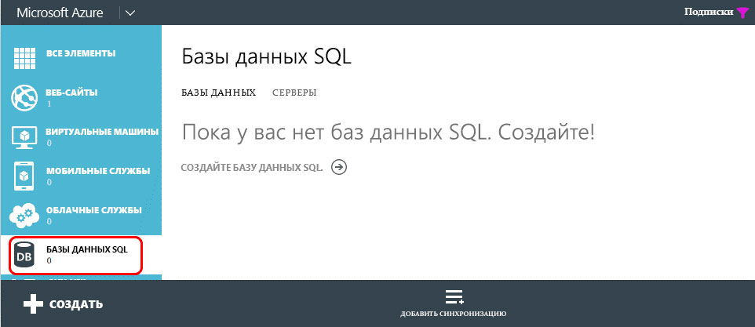

Щелкните ссылку **СЕРВЕРЫ** в верхней панели навигации и нажмите кнопку **ДОБАВИТЬ** в нижнем колонтитуле, как показано на следующем рисунке:

**Панель управления базы данных Azure SQL в портале управления Azure**

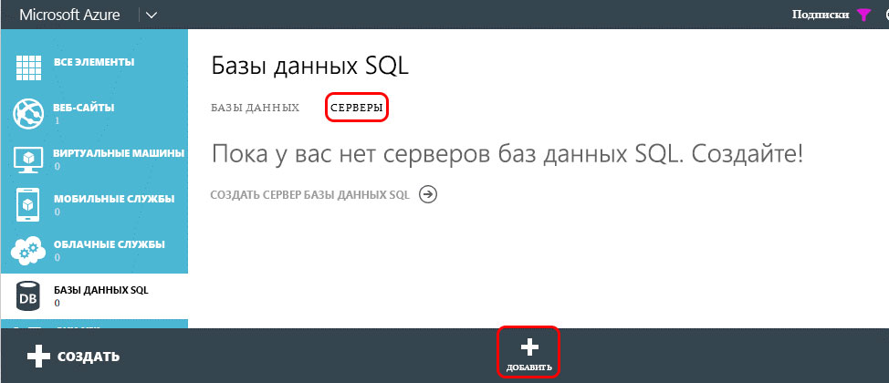

В появившемся диалоговом окне **СОЗДАТЬ СЕРВЕР** выберите **ПОДПИСКУ** Azure, **ИМЯ ДЛЯ ВХОДА** и **ПАРОЛЬ** пользователя с правами доступа к серверу, а затем выберите такой же **РЕГИОН**, который использовался при создании решения Веб-сайт Azure ранее. Запишите имя для входа и пароль, так как они потребуются в следующем шаге.

**Создание базы данных Azure SQL в портале управления Azure**

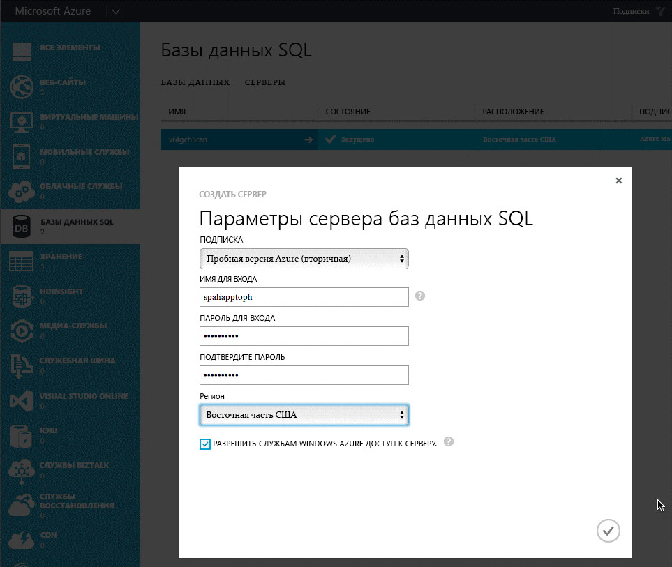

После заполнения формы нажмите **значок проверки** в правом нижнем углу, чтобы создать базу данных. После создания сервера доступ к нему смогут пока получать только другие службы Azure. Запишите имя, которое получила База данных SQL Microsoft Azure, так как оно понадобится на последующем шаге.

Чтобы подключить решение База данных SQL Microsoft Azure и развернуть базу данных, необходимо создать правило брандмауэра, разрешающее трафик от компьютера, который развертывает базу данных. В противном случае База данных SQL Microsoft Azure не сможет принимать подключения, так как будут возникать ошибки, аналогичные изображенным на следующем рисунке:

**Ошибка подключения к базе данных Azure SQL**

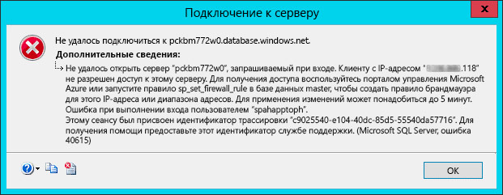

Чтобы создать правило брандмауэра, на **портале управления Azure** выберите предварительно созданный экземпляр решения База данных SQL Microsoft Azure и щелкните ссылку **НАСТРОИТЬ** в верхней панели навигации. В разделе **Разрешенные IP-адреса** отобразится ваш IP-адрес, как показано на следующем рисунке. Щелкните **ДОБАВИТЬ К РАЗРЕШЕННЫМ IP-АДРЕСАМ**, чтобы добавить правило брандмауэра. Это разрешит подключения к решению База данных SQL Microsoft Azure и развертывание базы данных. Не забудьте нажать кнопку **Сохранить** в нижнем колонтитуле.

**Создание правила брандмауэра для базы данных Azure SQL в портале управления Azure**

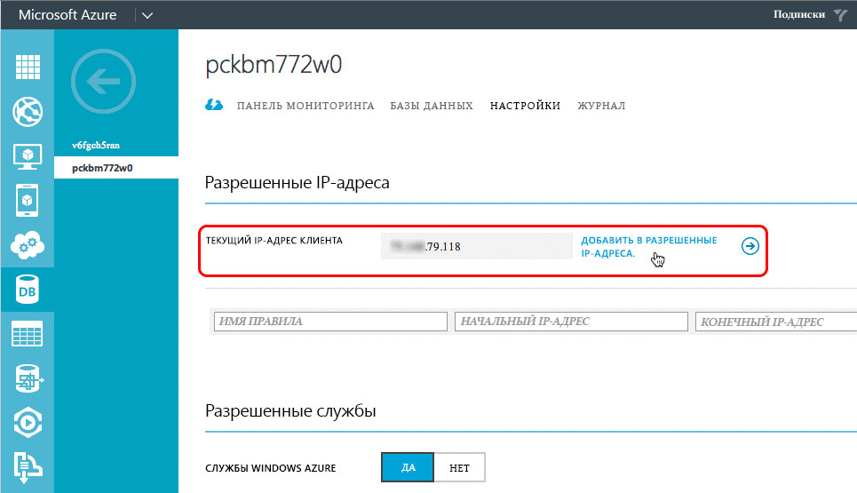

Следующий шаг включает развертывание базы данных. Его можно выполнить из Visual Studio с помощью пакета Azure SDK версии 2.3. Установите его с  [этой страницы Центра загрузки](http://azure.microsoft.com/downloads). В Visual Studio откройте окно **обозревателя объектов SQL Server**, щелкните правой кнопкой мыши узел **SQL Server** и выберите **Добавить SQL Server**:

**Добавление базы данных Azure SQL в обозревателе объектов**

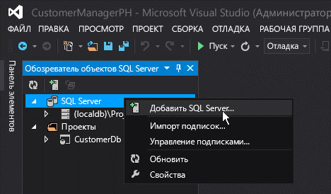

В диалоговом окне **Подключиться к серверу** введите **Имя сервера**, установите для параметра **Проверка подлинности** значение **Проверка подлинности SQL Server** и введите **имя для входа** и **пароль**, заданные при создании решения База данных SQL Microsoft Azure. Имя сервера должно быть полным, т. е. иметь формат  `[server-name].database.windows.net`, как показано на следующем рисунке:

**Подключение к базе данных Azure SQL в Visual Studio**

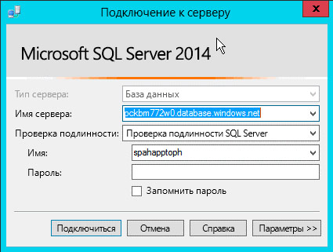

После подключения к решению База данных SQL Microsoft Azure разверните узел для добавленного сервера, щелкните правой кнопкой мыши на узле **Базы данных** и выберите **Опубликовать приложение уровня данных**, чтобы открыть мастер опубликования.

В разделе **Исходное приложение уровня данных (DACPAC)** нажмите кнопку **Обзор**, чтобы найти DACPAC-файл, сгенерированный при создании проекта базы данных на предыдущем шаге, убедитесь, что для параметра **Имя базы данных** установлено значениеCustomerDb и нажмите **Опубликовать**, чтобы опубликовать CustomerDb в решении База данных SQL Microsoft Azure.

**Публикация приложения уровня данных в базе данных Azure SQL с помощью Visual Studio**

Обновите окно **обозревателя объектов SQL Server** в Visual Studio, чтобы CustomerDb отобразилась для узла **Базы данных**.

> **Примечание**
>  В зависимости от способа создания базы данных для надстройки с автоматическим размещением могут понадобиться дополнительные действия при его развертывании в Azure. Дополнительные указания см. в следующих статьях MSDN:
>  [Converting between Data-tier Application Projects and Database Projects](http://msdn.microsoft.com/library/40b51f5a-d52c-44ac-8f84-037a0917af33.aspx)
>  [Creating &amp; Managing Data-Tier Application](http://msdn.microsoft.com/library/18907b6c-7678-4182-9304-fe56fdb9f0bd.aspx)

#### Действия после развертывания

После создания экземпляра решения База данных SQL Microsoft Azure сделайте копию строки подключения, которая используется при в процессе подключения к базе данных. Это можно сделать двумя способами. Вы можете войти в **портал управления Azure** (https://manage.windowsazure.com) и перейти к экземпляру решения База данных SQL Microsoft Azure, созданному на последнем шаге — CustomerDb. На странице **ПАНЕЛЬ УПРАВЛЕНИЯ** базы данных щелкните ссылку **Отобразить строки подключений**, чтобы просмотреть список строк подключений. Создайте копию строки подключения **ADO.NET** для последующего использования.

**Получение строк подключений для базы данных Azure SQL в портале управления Azure**

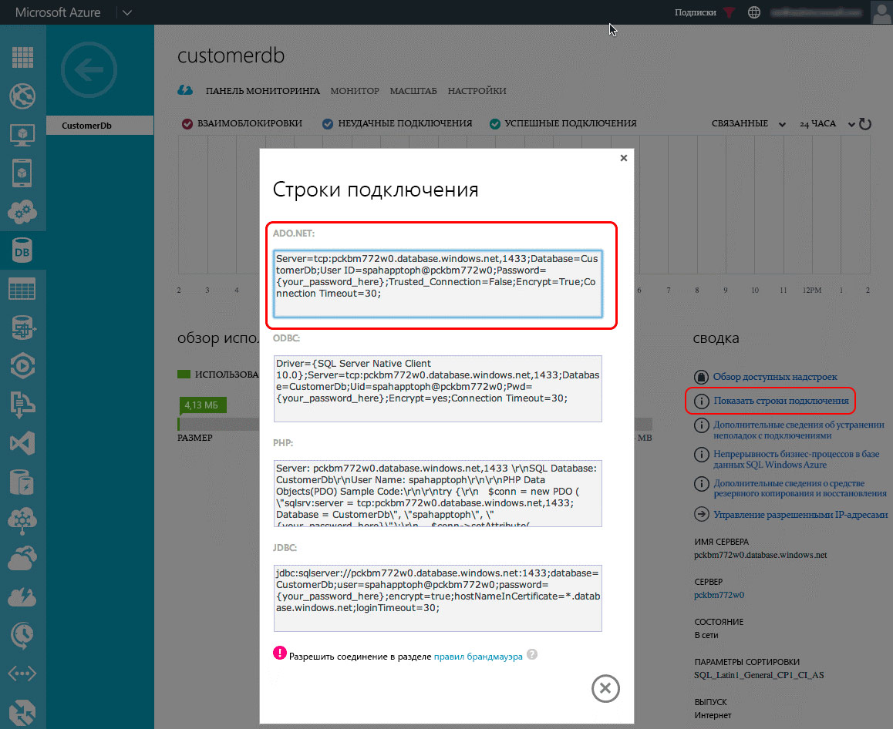

Вы также можете получить строку подключения посредством Visual Studio, если имеется установленный пакет Azure SDK версии 2.3. В окне **обозревателя объектов SQL Server** в Visual Studio выберите базу данных **CustomerDb**. После выбора базы данных просмотрите окно **Свойства** со строкой подключения. Она будет иметь такое же значение, что и строка на **портале управления Azure** (как описано выше).

**Получение строк подключений Azure SQL из Visual Studio посредством Azure SDK**

### Создание платформы Веб-сайт Azure

Следующий этап — создание новой платформы Веб-сайт Azure, на которой будет размещено удаленное веб-приложение для надстройки с размещением у поставщика. Это действие нужно выполнить первым, так как URL-адрес удаленного веб-приложения необходимо получить до регистрации самой надстройки. Тем не менее, регистрация надстройки в SharePoint должна быть выполнена перед развертыванием файлов для веб-приложения ASP.NET, так как в процессе регистрации будет создано два значения (идентификатор и секрет клиента), которые требуется получить до развертывания файлов веб-приложения ASP.NET.

Чтобы создать новую платформу Веб-сайт Azure, сначала войдите в **портал управления Azure** (https://manage.windowsazure.com). После загрузки панели управления щелкните навигационную ссылку **ВЕБ-САЙТЫ** в левом поле, а затем нажмите кнопку **СОЗДАТЬ** в нижнем колонтитуле, как показано на следующем рисунке.

**Панель управления веб-сайта Azure в портале управления Azure**

Далее в мастере нового веб-сайта выберите **ВЫЧИСЛИТЬ**, **ВЕБ-САЙТ**, **БЫСТРОЕ СОЗДАНИЕ** и укажите **URL-адрес** и **ПЛАН ВЕБ-ХОСТИНГА**. Наконец, укажите **РЕГИОН**, в котором нужно создать веб-сайт. Обязательно запомните выбранный регион, так как такой же регион необходимо использовать для решения База данных SQL Microsoft Azure, которое создается позже. Также, если план веб-размещения еще не существует или нужно определить новый, выберите вариант **Создать план веб-хостинга**. На рисунке ниже приведен пример.

**Создание веб-сайта Azure в портале управления Azure**

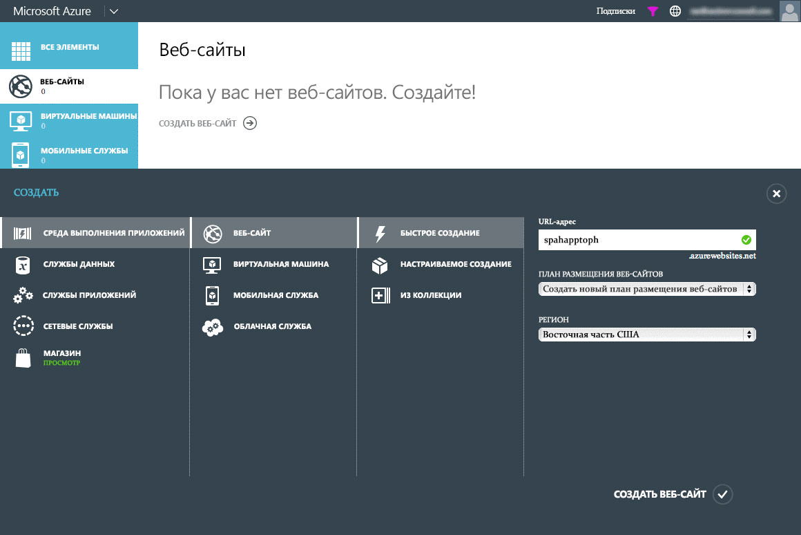

После создания платформы Веб-сайт Azure запишите URL-адрес, используемый для сайта. На рисунках выше созданный сайт имеет адрес  `http://spahapptoph.azurewebsites.net`.

### Регистрация новой надстройки

Все Надстройки SharePoint, созданные с помощью модели надстроек, должны быть зарегистрированы в ферме размещения или среде SharePoint. Это позволит установить уровень доверия между SharePoint и удаленным веб-приложением. Процесс включает регистрацию нового субъекта надстройки в SharePoint со следующими значениями:

- **ИД клиента** — идентификатор надстройки

- **Секрет клиента** — пароль надстройки

- **Название** — название надстройки

- **Домен надстройки** — домен верхнего уровня удаленного веб-приложения

Если надстройка с автоматическим размещением устанавливается в SharePoint Online, Office 365 создает субъект надстройки автоматически. Решению уже известен URL-адрес удаленного веб-приложения, так как оно создает сайт автоматически. Оно также добавляет ИД клиента и секрет клиента в файл web.config удаленного веб-приложения. Именно в файле web.config предоставляемый корпорацией Майкрософт класс (в VB-файле или TokenHelper.cs) будет осуществлять поиск ИД и секрета при проверке запросов и проверке подлинности с помощью SharePoint.

Но для надстроек с размещением у поставщика разработчик должен вручную зарегистрировать надстройку и вручную обновить файл web.config в веб-проекте ASP.NET.

Чтобы зарегистрировать новое приложение, перейдите на страницу регистрации надстроек на веб-сайте SharePoint, где установлена надстройка. Эту страницу можно найти по адресу  `http://[SharePoint-site-url]/_layouts/15/appregnew.aspx`. На странице регистрации надстроек установите для параметра **Тип надстройки** значение **Надстройка, выполняемая на веб-сервере** и дважды щелкните кнопку **Создать**, чтобы создать новые **ИД клиента** и **секрет клиента**. Введите имя надстройки в поле **Название** и URL-адрес целевой платформы Веб-сайт Azure, созданный на предыдущем этапе, в поле **Домен надстройки**. Наконец, нажмите кнопку **Создать**.

После регистрации надстройки SharePoint покажет сводку с данными, которые использовались в форме для регистрации. Очень важно скопировать и сохранить эти данные, особенно ИД клиента и секрет клиента, так как их нужно будет использовать на последующем этапе.

### Изменения удаленного веб-приложения или конфигурации, которую имеет Веб-сайт Azure

Следующий этап заключается в перенастройке удаленного веб-приложения, чтобы его можно было развернуть в качестве надстройки с размещением у поставщика, а не надстройки с автоматическим размещением. Развернуть сайт ASP.NET на платформе Веб-сайт Azure можно различными способами (включая непосредственное развертывание из Visual Studio, автоматическое развертывание из системы управления версиями, например Visual Studio Online, из GitHub или даже посредством испытанного FTP-развертывания). В этой статье описывается метод с использованием Visual Studio. Но перед развертыванием веб-приложения для него нужно установить несколько обновлений, чтобы оно смогло работать с надстройкой, размещаемой у поставщика.

#### Обновление проекта удаленного веб-приложения

Основные изменения в веб-приложении ASP.NET MVC необходимо внести в файл web.config. В этом файле указаны три параметра на узле **<appSettings>**: **ClientId**, **ClientSecret** и **SqlAzureConnectionString**. Первые два используются классом, предоставляемом корпорацией Майкрософт, в файле TokenHelper.cs (или с расширением VB) и позволяют упростить проверку подлинности и обмен данными с SharePoint из удаленного веб-приложения. Последний параметр,  `SqlAzureConnectionString`, используется надстройкой для подключения к платформе База данных SQL Microsoft Azure.

В случае с автоматически размещаемой надстройкой SharePoint Office 365 записывает значения для этих параметров при создании платформы Веб-сайт Azure и решения База данных SQL Microsoft Azure в процессе установки надстройки. Но в случае надстройки с размещением у поставщика значения необходимо задать вручную перед развертыванием надстройки.

Вы можете вставить значения для этих трех параметров из шагов выше, но недостаток такого подхода состоит в том, что при каждом их изменении вам потребуется вручную обновлять файл web.config и повторно развертывать его на платформе Веб-сайт Azure.

Вы также можете просто очистить эти параметры (сохраните ключи параметров и просто сохраните атрибут **value=""** с пустой строкой) и определить их в параметрах платформы Веб-сайт Azure с помощью **портала управления Azure**. При таком подходе параметры можно обновлять без обновления базы кода.

Чтобы сделать это, войдите на **портал управления Azure** (https://manage.windowsazure.com) и перейдите к платформе Веб-сайт Azure, созданной на предыдущих этапах. На странице панели мониторинга Веб-сайт Azure нажмите **НАСТРОИТЬ** в верхнем навигационном меню и перейдите к разделу **параметры надстройки**. Добавьте три параметра для новой надстройки, используя имена параметров из файла web.config. Воспользуйтесь значениями, полученными на предыдущих этапах, для значений ClientId, ClientSecret и SqlAzureConnectionString.

Убедитесь, что строка подключения, которую использует База данных SQL Microsoft Azure, действительна и введена правильно, так как при отображении строки подключения в **портале управления Azure** и Visual Studio атрибут пароля будет заменен маской. Пароль с маской в строке подключения необходимо изменить для использования правильного пароля, определенного при создании имени для входа в База данных SQL Microsoft Azure.

#### Развертывание удаленного веб-приложения на платформе Веб-сайт Azure

Теперь файлы веб-приложения ASP.NET MVC необходимо развернуть на платформе Веб-сайт Azure в качестве удаленного веб-приложения. В Visual Studio щелкните правой кнопкой мыши на веб-проекте и выберите **Опубликовать**. Это действие откроет диалоговое окно мастера **Публикация веб-сайта**. В этом диалоговом окне выберите вариант **Веб-сайты Windows Azure** и щелкните **Опубликовать**.

**Диалоговое окно публикации веб-сайта в Visual Studio**

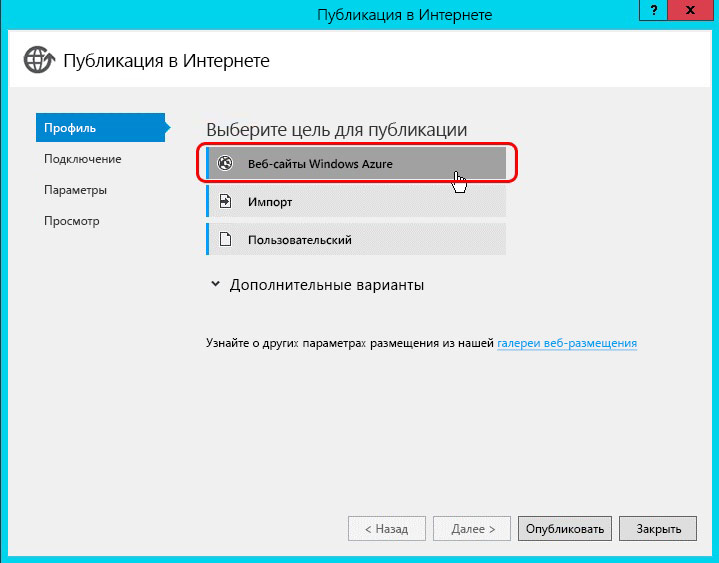

На следующем шаге выберите имя платформы Веб-сайт Azure, которая была создана на предыдущем шаге, как показано на следующем рисунке, нажмите **OK** и убедитесь, что URL-адрес сайта использует протокол HTTPS.

**Публикация веб-приложения ASP.NET на существующем веб-сайте Azure**

На последнем шаге нажмите кнопку **Проверить подключение**, чтобы убедиться, что параметры введены правильно и подключение работает, и щелкните **Опубликовать**. Это запустит процесс опубликования веб-приложения ASP.NET на платформе Веб-сайт Azure с помощью Visual Studio.

После развертывания веб-сайта Visual Studio запустит браузер отладки по умолчанию и перейдет к платформе Веб-сайт Azure. Но сайт при этом будет отображаться с ошибкой. Она возникает, так как контроллеры ASP.NET MVC включают атрибут (особенно  `SharePointContextFilter`), который ожидает отправку определенных значений от SharePoint к контроллеру в заголовке запроса HTTP POST, но по умолчанию браузер запускает запрос HTTP GET, поэтому эта ошибка ожидаема.

> **Примечание**
> Подробнее о дополнительных вариантах для развертывания веб-приложений ASP.NET на платформе Веб-сайт Azure см. документацию по Azure о  [развертывании веб-сайта Microsoft Azure](http://azure.microsoft.com/documentation/articles/web-sites-deploy). 

#### Действия после развертывания

На следующем шаге необходимо скопировать URL-адрес сайта.

#### Пользовательские домены и SSL-сертификаты для платформ Веб-сайты Azure

Все Веб-сайты Azure используют следующее соглашение об именовании:  `http[s]://[site-name].azurewebsites.net`. Корпорация Майкрософт уже добавила шаблон SSL-сертификата ко всем веб-сайтам в домене  `*.azurewebsites.net`, но клиенты могут связать пользовательский домен с их платформой Веб-сайт Azure, а также использовать собственные SSL-сертификаты для таких доменов.

Подробнее об использовании пользовательских доменов см. в документации по Azure  [о настройке пользовательского имени домена для веб-сайта Microsoft Azure](http://azure.microsoft.com/documentation/articles/web-sites-custom-domain-name). Подробнее о добавлении пользовательского SSL-сертификата для вашего имени домена см. в документации по Azure  [о включении HTTPS для веб-сайта Microsoft Azure](http://azure.microsoft.com/documentation/articles/web-sites-configure-ssl-certificate).

### Перенастройка проекта надстройка SharePoint

Последний этап — это перенастройка проекта надстройки SharePoint. В проекте Visual Studio для надстройки SharePoint выбрано автоматическое размещение. Сперва измените этот параметр на размещение у поставщика, открыв файл AppManifest.xml в проекте надстройки SharePoint и изменив значение параметра **Тип размещения** с **Автоматическое размещение** на **Размещение у поставщика**.

Кроме того, **начальная страница** приложения должна указывать на URL-адрес начальной страницы удаленного веб-приложения, который представляет собой URL-адрес платформы Веб-сайт Azure. Обязательно укажите значение строки запроса{StandardTokens}, если оно отсутствует. Это гарантирует, что SharePoint добавит основные маркеры строки запроса к URL-адресу при открытии удаленного веб-приложения.

Затем удалите ссылку в проекте надстройки SharePoint на веб-приложение ASP.NET MVC, выбрав проект надстройки SharePoint в **обозревателе решений** Visual Studio и установив для параметра **Веб-проект** в окне **Свойства** значение **(Отсутствует)**, как показано на рисунке 20.

**Удаление удаленного веб-приложения из пакета надстройки SharePoint**

На последнем шаге необходимо вручную обновить файл AppManifest.xml, так как некоторые параметры не отображаются в конструкторе. Для этого сохраните существующие изменения в файле AppManifest.xml и затем щелкните правой кнопкой мыши на этом же файле в **обозревателе решений** и выберите **Просмотреть код**.

**Открытие файла AppManifest.xml в режиме просмотра кода**

В режиме просмотра кода файл AppManifest.xml удалите две ссылки на проект веб-приложения ASP.NET MVC и проект приложения уровня данных SQL, так как их наличие не требуется для надстройки SharePoint с размещением у поставщика.

Затем создайте новый GUID и замените существующий GUID в атрибуте **ProductId**. Таким образом SharePoint будет распознавать надстройку как новую, а не обновление существующей.

> **Важно!**
> Если вы не замените существующий атрибут ProductId, SharePoint возвратит ошибку "Предоставленная надстройка отличается от другой надстройки с такой же версией и таким же кодом продукта" при установке преобразованной надстройки. 

Затем найдите элемент **<RemoteWebApplication>** и обновите атрибут **ClientId** таким образом, чтобы он включал тот же GUID, который был получен при регистрации надстройки с помощью SharePoint и который использовался в параметрах надстройки (файл web.config платформы Веб-сайт Azure).

**Настройка ClientId для надстройки SharePoint с размещением у поставщика**

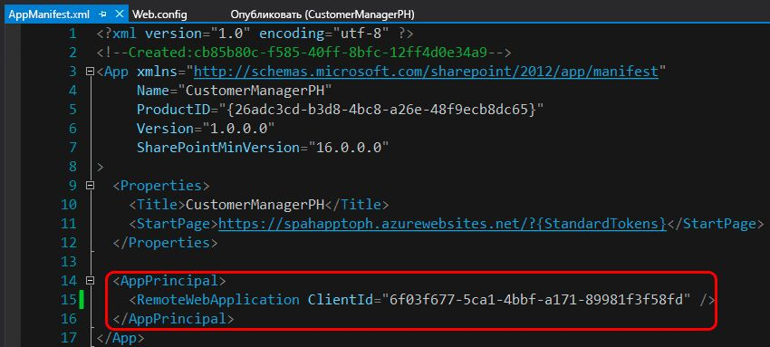

После сохранения всех изменений в файле AppManifest.xml надстройка будет готова к тестированию в качестве надстройки SharePoint с размещением у поставщика. Разверните надстройку на ферме SharePoint или сайте SharePoint Online, чтобы проверить правильность действий по преобразованию.

## Другие материалы

Дополнительные сведения о модели надстроек SharePoint, надстройках SharePoint с размещением у поставщика или модели таких надстроек см. в  [блоге разработчиков Office](http://blogs.office.com/dev/), где публикуются новости и обновления инструментов разработки, сценарии и служебные программы, упрощающие создание надстроек SharePoint и их преобразование из надстроек с автоматическим размещением в надстройки с размещением у поставщика.

