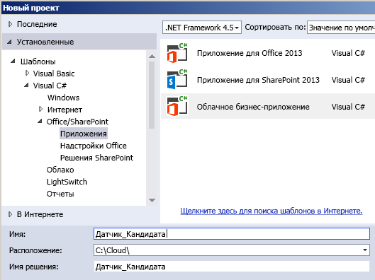
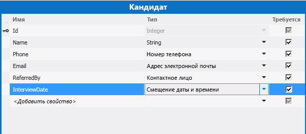
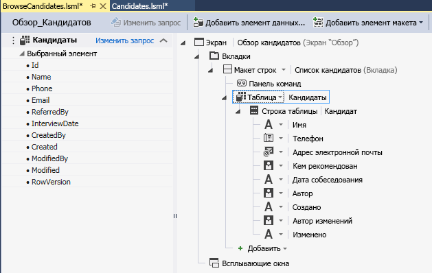
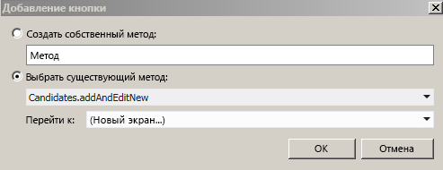
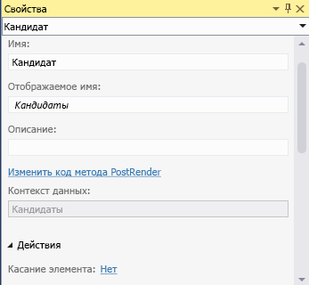
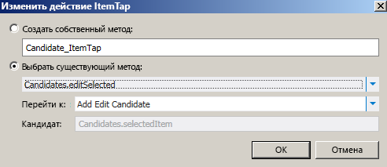

# Создание облачной бизнес-надстройки с социальным каналом новостей
Используя шаблон **Облачная бизнес-надстройка** в Visual Studio, вы можете создавать надстройки для SharePoint, в которых пользователи могут просматривать, добавлять и обновлять данные SharePoint. В типе проекта **Облачная бизнес-надстройка** используются технологии Visual Studio LightSwitch, которые существенно упрощают процесс создания бизнес-надстройки с размещением в SharePoint. Выполняя это пошаговое руководство, вы создадите надстройку для отслеживания кандидатов на вакансии, используя функцию социальной интеграции SharePoint для Office 365, чтобы включить в надстройку канал новостей.Вы можете загрузить полный пример надстройки из коллекции исходных кодов MSDN:  [создания облачной бизнес-надстройки с социальным каналом новостей](http://code.msdn.microsoft.com/Creating-a-Cloud-Business-8540c0c9)
## Необходимые требования

Для выполнения этого пошагового руководства требуется Visual Studio 2013.
  
    
    
Для размещения надстройки вам также понадобится сайт SharePoint 2013 или SharePoint разработчика в Office 365, который вы можете получить на странице  [Регистрация на сайте разработчиков для Office 365](http://go.microsoft.com/fwlink/?LinkId=263490).
  
    
    

## Создание проекта "Облачная бизнес-надстройка"
<a name="bk_create"> </a>

 Чтобы создать облачную бизнес-надстройку, сначала необходимо создать шаблон проекта **Облачная бизнес-надстройка** в Visual Studio.
  
    
    

### Создание проекта


1. В строке меню выберите пункты **Файл**, **Создать** и **Проект**.
    
    Откроется диалоговое окно **Новый проект**.
    
  
2. В списке шаблонов разверните узел **Visual Basic** или **Visual C#**, затем — узел **Office/SharePoint**, выберите узел **Надстройки**, а затем — шаблон **Облачная бизнес-надстройка**, как показано на рисунке 1.
    
   **Рисунок 1. Добавление шаблона проекта**

  

     
  

  

  
3. В текстовом поле **Имя** введитеОтслеживание_кандидатов, а затем нажмите кнопку **ОК**.
    
    Откроется мастер **создания облачной бизнес-надстройки**.
    
  
4. В мастере **Создание облачной бизнес-надстройки** введите URL-адрес для своего сайта разработчика Office 365, а затем нажмите кнопку **Готово**.
    
    URL-адрес должен быть указан в формате https://  _личный_сайт_.sharepoint.com/sites/Developer/.
    
    Решение **Отслеживание_кандидатов** добавляется в обозреватель решений с четырьмя проектами: проект верхнего уровня **Отслеживание_кандидатов** и проекты **Отслеживание_кандидатов.HTMLClient**, **Отслеживание_кандидатов.Server** и **Отслеживание_кандидатов.SharePoint**.
    
  

## Добавление данных и экранов
<a name="bk_add"> </a>

Для надстройки отслеживания кандидатов требуется таблица базы данных, которую вы создадите в проекте **Сервер**, и экраны для просмотра, добавления и обновления данных, которые вы создадите в проекте **HTML-клиент**.
  
    
    

### Добавление таблицы базы данных


1. В **обозревателе решений** откройте контекстное меню для узла **Отслеживание_кандидатов.Server** и выберите пункт **Добавить таблицу**.
    
    Откроется конструктор сущностей.
    
  
2. В окне **Свойства** в текстовом поле для свойства **Имя** введитеКандидат.
    
  
3. В конструкторе сущности выберите ссылку **<Добавить свойство>** и введитеИмя.
    
  
4. Нажмите клавишу ВВОД, принимая **Тип** по умолчанию **String** и оставив установленным флажок **Обязательное**.
    
  
5. Выберите ссылку **<Добавить свойство>** и введитеТелефон, а затем нажмите клавишу **TAB**.
    
  
6. В столбце **Тип** выберите **Номер телефона**, а затем дважды нажмите клавишу TAB.
    
    **Номер телефона** — этонастраиваемый бизнес-тип, который автоматически форматируется и проверяет телефонные номера.
    
  
7. В следующей строке введите Электронная почта для поля **Имя**, а затем выберите **Адрес электронной почты** как для поля **Тип**.
    
    **Адрес электронной почты** — это еще один настраиваемый бизнес-тип, используемый для проверки адресов электронной почты.
    
  
8. В следующей строке введите Кем предложено для поля **Имя**, а затем выберите **Человек** для поля **Тип**.
    
    Бизнес-тип **Человек** осуществляет связь со службой профилей пользователей SharePoint, которая запрашивает информацию о пользователях из Active Directory.
    
  
9. В следующей строке введите Дата_собеседования для поля **Имя**, а затем выберите **Смещение даты и времени** для поля **Тип**.
    
    В бизнес-типе **Смещение даты и времени** хранится дата и время в формате UTC, позволяя пользователям в различных часовых поясах видеть правильное время.
    
    На рисунке 2 показана заполненная сущность.
    

   **Рисунок 2. Сущность "Кандидаты"**

  

     
  

  

  

### Создание экрана обзора


1. В конструкторе сущностей в строке **Перспектива** откройте вкладку **HTML-клиент**, а затем на панели инструментов нажмите **Экран**.
    
    Откроется диалоговое окно **Добавление нового экрана**.
    
  
2. В диалоговом окне **Добавление нового экрана** из списка **Выберите шаблон экрана** выберите **Экран обзора данных**.
    
  
3. В списке **Данные экрана** выберите **Кандидаты**, а затем нажмите кнопку **ОК**.
    
    Откроется конструктор экрана с представлением сущности данных в левой панели и представлением макета экрана в правой панели.
    
  
4. В правой панели конструктора экрана выберите узел **Список | Кандидаты**, а затем разверните список **Список** и выберите **Таблица**, как показано на рисунке 3.
    
   **Рисунок 3. Элемент управления "Таблица"**

  

     
  

    Это приведет к тому, что информация о сущности **Кандидат** будет отображаться в табличном формате, а не формате списка, который используется по умолчанию.
    
    Обратите внимание, что кроме полей, которые вы определили для таблицы, есть еще четыре поля: "Кем создано", "Создано", "Кем изменено" и "Изменено". Эти поля создают журнал аудита, в котором можно посмотреть, когда и кем создан или в последний раз изменен элемент. 
    
  

### Создание экрана добавления


1. В конструкторе экрана откройте контекстное меню для узла **Панель команд** и выберите **Добавить кнопку**.
    
  
2. В диалоговом окне **Добавление кнопки** разверните список **Показать_вкладку** и выберите **Добавить_и_изменить_новую**, как показано на рисунке 4, и нажмите кнопку **ОК**.
    
   **Рисунок 4. Диалоговое окно "Добавление кнопки"**

  

     
  

    Откроется диалоговое окно **Добавление нового экрана**.
    
  
3. В диалоговом окне **Добавление нового экрана** примите значения по умолчанию и нажмите кнопку **ОК**.
    
  
Откроется новое окно конструктора экрана.
  
    
    

### Создание экрана редактирования


1. Откройте вкладку конструктора **Обзор_кандидатов.lsml** и в конструкторе экрана выберите узел **Таблица | Кандидаты**.
    
  
2. В окне **Свойства** выберите ссылку **Касание элемента**, как показано на рисунке 5.
    
   **Рисунок 5. Ссылка "Касание элемента"**

  

     
  

    Откроется диалоговое окно **Редактирование действия касания элемента**.
    
  
3. В диалоговом окне **Редактирование действия касания элемента** разверните список **Показать_вкладку** и выберите **Редактировать_выбранную**, как показано на рисунке 6, и нажмите кнопку **ОК**.
    
   **Рисунок 6. Диалоговое окно "Редактирование действия касания элемента"**

  

     
  

  

  

### Тестирование надстройки


1. В строке меню последовательно выберите **Отладка**, **Начать отладку**.
    
    При первом запуске надстройки для SharePoint на компьютере вам будет предложено установить сертификат Localhost, потому что облачные бизнес-надстройки всегда используют SSL (Secure Sockets Layer). Если вы примете этот сертификат, предупреждение безопасности не будет появляться при каждом запуске надстройки. Так как сертификат применяется только к Localhost, вашей системе ничего не угрожает.
    
  
2. В диалоговом окне **Оповещение системы безопасности** нажмите кнопку **Да**.
    
  
3. Если откроется диалоговое окно **Предупреждение безопасности**, нажмите кнопку **Да**.
    
    Откроется веб-браузер.
    
  
4. На странице **входа** нажмите кнопку **Вход**.
    
  
5. Введите пароль, а затем нажмите кнопку **Вход**.
    
  
6. Если будет предложено, нажмите кнопку **Доверять**.
    
  
7. На экране **Обзор кандидатов** нажмите кнопку **Добавить кандидата**.
    
    Откроется экран **Добавление кандидата**.
    
  
8. На экране **Добавление кандидата** введите имя, номер телефона и адрес электронной почты.
    
  
9. Выберите поле **Кем предложено** и введите первые три символа вашего имени.
    
    В списке должно появиться ваше полное имя. Если ваш сайт подключен к Active Directory, вы должны увидеть список все пользователей, чье имя начинается с таких же трех символов.
    
  
10. Вы также можете изменить дату и время для поля **Дата собеседования**, а затем нажать кнопку **Сохранить**, чтобы вернуться на экран **Обзор кандидатов**.
    
    Отобразится кандидат, которого вы только что добавили; если вы выберете строку, откроется экран **Добавление и редактирование кандидатов**. Обратите внимание, что некоторые поля наследуют особое поведение от своих настраиваемых бизнес-типов. Выберите поле **Телефон**, чтобы набрать номер; выберите поле **Адрес электронной почты**, чтобы отправить сообщение; или наведите указатель на поле **Кем создано**, чтобы просмотреть свои контактные данные.
    
  
11. Закройте окно браузера, чтобы остановить выполнение надстройки.
    
  

## Добавление канала новостей
<a name="bk_feed"> </a>

Одна из возможностей SharePoint для Office 365 состоит в добавлении каналов новостей, позволяющих пользователи отслеживать действия в списке и добавлять комментарии. Облачные бизнес-надстройки упрощают создание канала новостей для вашей надстройки.
  
    
    

### Включение социальной интеграции


1. Откройте вкладку конструктора **Кандидаты.lsml**, а затем на панели **Перспектива** выберите вкладку **Сервер**.
    
  
2. В окне **Свойства** установите флажки **Размещать при создании** или **Размещать при обновлении**, как показано на рисунке 7.
    
   **Рисунок 7. Социальные свойства**

  

     
  

  

  
3. Выберите ссылку **Выбор триггеров записи**.
    
    Откроется диалоговое окно **Выбор триггеров записи**.
    
  
4. В диалоговом окне **Выбор триггеров записи** снимите флажок **Все поля**, установите флажок **Дата собеседования** и нажмите кнопку **ОК**.
    
  

### Тестирование надстройки


1. В строке меню последовательно выберите **Отладка**, **Начать отладку**.
    
  
2. На экране **Обзор кандидатов** выберите кандидата, которого вы создали раньше.
    
  
3. На экране **Добавление и редактирование кандидата** измените значение в поле **Дата собеседования**, а затем нажмите кнопку **Сохранить**.
    
  
4. Нажмите кнопку **Добавить кандидата** и добавьте еще одного кандидата.
    
  
5. В строке хрома SharePoint на экране **Обзор кандидатов** выберите ссылку **Канал новостей**.
    
    В новом окне браузера откроется **Канал новостей приложения "Отслеживание кандидатов"** с двумя новыми записями для добавленных и обновленных кандидатов. Вы можете нажать для записи ссылку **Мне нравится** или **Ответить**, чтобы добавить комментарий. 
    
  
6. Закройте оба окна браузера, чтобы остановить выполнение надстройки.
    
  

## Добавление проверки
<a name="bk_validate"> </a>

Во многих бизнес-надстройках необходимо ограничивать доступ к определенным функциями, например, разрешая изменять дату собеседования только менеджеру. В облачных бизнес-надстройках это можно сделать, написав логику проверки; в данном случае вы напишете код для проверки того, входит ли текущий пользователь в определенную группу безопасности Active Directory.
  
    
    

### Добавление проверки


1. Откройте вкладку конструктора **Кандидаты.lsml**, а затем на панели **Перспектива** выберите вкладку **Сервер**.
    
  
2. На панели инструментов разверните список **Запись кода** и выберите метод **Проверка_кандидатов**.
    
    Откроется редактор кода.
    
  
3. В редакторе кода добавьте в метод **Candidates_Validate** следующий код:
    
 ```VB.net
  
If Not Application.User.Department = "Hiring Managers" Then
                results.AddEntityError("Permission denied")
            End If
 ```


 ```cs
  
if (!(Application.User.Department == "Hiring Managers")) {
results.AddEntityError("Permission denied");
}
 ```


    Метод **Validate** запускается, когда пользователь пытается сохранить запись. Если пользователь входит в группу безопасности "Менеджер по найму", запись сохраняется, в противном случае отображается ошибка "В разрешении отказано" и запись отклоняется.
    
  
Если сейчас вы запустите надстройку и добавите нового кандидата, скорее всего, вы увидите сообщение об ошибке, если только не являетесь участником действительной группы безопасности "Менеджеры по найму". Замените "Менеджеры по найму" на имя группы безопасности, к которой вы принадлежите, и попробуйте еще раз. Теперь у вас должно быть разрешение на добавление кандидата.
  
    
    

## Дальнейшие действия
<a name="bk_validate"> </a>

Поздравляем! Вы создали свою первую облачную бизнес-надстройку. Если вы хотите поделиться ей с пользователями, вашим следующем шагом должна стать публикация надстройки. См. статью  [Практическое руководство. Публикация облачной бизнес-надстройки в Office 365](http://msdn.microsoft.com/ru-ru/library/vstudio/dn454601.aspx) или [Публикация надстроек для SharePoint](http://msdn.microsoft.com/ru-ru/library/office/apps/jj164070.aspx).
  
    
    
Конечно, это только простой пример; есть намного больше возможностей для создания полнофункциональных надстроек. Так как шаблон облачной бизнес-надстройки основан на технологиях LightSwitch, возможно, вы найдете для себя интересные идеи в документации по LightSwitch. См. статью  [Надстройки LightSwitch для SharePoint](http://msdn.microsoft.com/ru-ru/library/vstudio/jj969620.aspx).
  
    
    

## Дополнительные ресурсы
<a name="bk_addresources"> </a>


-  [Создание облачных бизнес-надстроек](create-cloud-business-add-ins.md)
    
  

