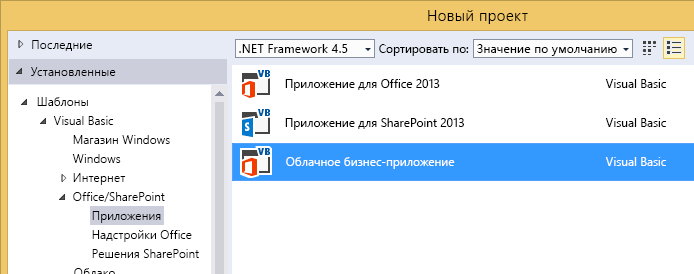
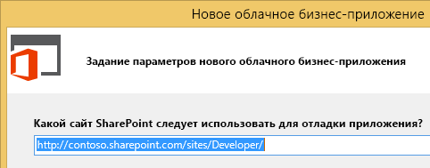
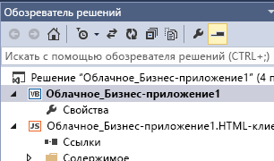
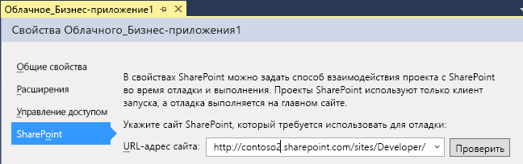

# Создание облачной бизнес-надстройки
С помощью шаблона "Облачная бизнес-надстройка" в Visual Studio можно создавать надстройки для SharePoint 2013 или SharePoint в Office 365, оптимизированные для добавления данных и управления ими.
> **Примечание**
> Вы также можете создавать надстройку SharePoint, используя шаблон "Надстройка для SharePoint 2013". 

### Создание облачной бизнес-надстройки

1. В строке меню выберите пункты **Файл**, **Создать** и **Проект**.

    Откроется диалоговое окно **Новый проект**.

2. В списке шаблонов разверните узел **Visual Basic** или **Visual C#**, затем узел **Office/SharePoint**, выберите узел **Надстройки**, а затем шаблон **Облачная бизнес-надстройка**, как показано на рисунке 1.

   **Рис. 1. Шаблон "Облачная бизнес-надстройка"**

3. В текстовом поле **Имя** введите имя проекта и нажмите кнопку **OK**.

    Откроется мастер **создания облачной бизнес-надстройки**.

4. В мастере **создания облачной бизнес-надстройки** введите URL-адрес вашего сервера SharePoint или сайта разработчика Office 365, как показано на рис. 2, а затем нажмите кнопку **Готово**.

   **Рис. 2. URL-адрес SharePoint**

    URL-адрес должен быть указан в формате https://  _личный_сайт_.sharepoint.com/sites/Developer/.

    В обозреватель решений будет добавлено новое решение с 4 проектами: проектом верхнего уровня проектом **HTMLClient**, проектом **Server** и проектом **SharePoint**.

### Изменение сайта для облачной бизнес-надстройки

1. В **обозревателе решений** откройте контекстное меню для узла проекта верхнего уровня и выберите пункт **Свойства**, как показано на рис. 3.

   **Рис. 3. Узел проекта верхнего уровня**

    Откроется конструктор приложений.

2. В конструкторе приложений выберите вкладку **SharePoint**, как показано на рис. 4.

   **Рис. 4. Вкладка "SharePoint"**

3. В списке **URL-адрес сайта** выберите существующий URL-адрес или введите URL-адрес вашего сервера SharePoint или сайта разработчика Office 365.

4. Нажмите кнопку **Проверить**, чтобы проверить URL-адрес.

## Дополнительные ресурсы

-  [Разработка облачных бизнес-надстроек](develop-cloud-business-add-ins.md)

-  [Создание облачных бизнес-надстроек](create-cloud-business-add-ins.md)

