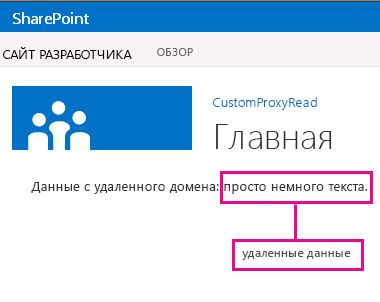

# Создание пользовательской прокси-страницы для междоменной библиотеки в SharePoint 2013
Узнайте, как создать собственную прокси-страницу для доступа к данным в удаленной службе с веб-страницы SharePoint, используя междоменную библиотеку в SharePoint. 
При создании Надстройки SharePoint обычно приходится использовать данные из различных источников. Тем не менее, из соображений безопасности существуют механизмы блокировки, которые препятствуют связи более чем с одним доменом одновременно.


Вы можете использовать междоменную библиотеку для доступа к данным в удаленной надстройке, если реализуете настраиваемую прокси-страницу, размещенную в инфраструктуре удаленной надстройки. Как разработчик вы отвечаете за реализацию настраиваемой прокси-страницы и пользовательской логики, например, за механизм проверки подлинности для удаленной надстройки. Используйте междоменную библиотеку с настраиваемой прокси-страницей, если необходимо, чтобы взаимодействие происходило на уровне клиента.
## Необходимые условия для использования примеров в этой статье
<a name="SP15Createcustomproxypage_Prereq"> </a>

Вам необходима среда разработки, как описано в статье  [Знакомство с созданием надстроек SharePoint с размещением у поставщика](get-started-creating-provider-hosted-sharepoint-add-ins.md).


### Основные понятия, которые необходимо знать, прежде чем использовать настраиваемые прокси-страницы Надстройки SharePoint

В следующей таблице приведены некоторые полезные статьи, которые помогут вам понять концепции, связанные с применением междоменного сценария для Надстройки SharePoint.


**Таблица 1. Основные понятия использования настраиваемой прокси-страницы**


|**Название статьи**|**Описание**|
|:-----|:-----|
| [Надстройки SharePoint](sharepoint-add-ins.md) <br/> |Изучите новую модель надстроек в SharePoint, позволяющую создавать небольшие и удобные в использовании решения для конечных пользователей.  <br/> |
| [Безопасный доступ к данным и клиентские объектные модели для надстроек SharePoint](secure-data-access-and-client-object-models-for-sharepoint-add-ins.md) <br/> |Узнайте о параметрах доступа к данным в Надстройки SharePoint. В этой статье представлена информация об альтернативах высокого уровня при работе с данными в надстройке.  <br/> |
| [Хост-сайты, сайты надстроек и компоненты SharePoint в SharePoint 2013](host-webs-add-in-webs-and-sharepoint-components-in-sharepoint-2013.md) <br/> |Узнайте, в чем разница между хост-сайтами и сайтами надстроек. Узнайте, какие компоненты SharePoint можно включить в Надстройка SharePoint, какие компоненты можно развернуть на хост-сайтах, а какие на сайтах надстроек, а также узнайте, как развертывать сайты надстроек в изолированном домене.  <br/> |
| [Междоменная безопасность на стороне клиента](http://msdn.microsoft.com/ru-ru/library/cc709423%28vs.85%29.aspx) <br/> |Изучите междоменные угрозы и примеры использования, а также принципы безопасности для междоменных запросов, и оцените риски разработчиков, связанные с улучшением междоменного доступа из веб-приложений, которые запускаются в браузере.  <br/> |
 

## Пример кода. Доступ к удаленным данным с помощью настраиваемой прокси-страницы для междоменной библиотеки
<a name="SP15Createcustomproxypage_Codeexample"> </a>

Для чтения данных из удаленной службы необходимо выполнить следующие действия. 


1. Создайте проект надстройки для SharePoint.


2. Измените манифест надстройки, чтобы разрешить связь с удаленной надстройкой.


3. Создать настраиваемую прокси-страницу и страницу контента в веб-проекте.


4. Создать страницу, которая использует междоменную библиотеку в проекте Надстройка SharePoint.


### Создание проекта надстройки для SharePoint


1. Откройте Visual Studio как администратор. (Для этого щелкните правой кнопкой значок Visual Studio в меню **Пуск** и выберите команду **Запуск от имени администратора**.)


2. Создайте Надстройка SharePoint с размещением у поставщика, как описано в разделе  [Знакомство с созданием надстроек SharePoint с размещением у поставщика](get-started-creating-provider-hosted-sharepoint-add-ins.md), и назовите его ProxyPageApp. 


### Изменение файла манифеста надстройки


1. В **Обозревателе решений** щелкните правой кнопкой файл **AppManifest.xml** и выберите **Просмотреть код**.


2. Замените весь элемент **AppPrincipal** на следующий фрагмент.

 ```XML

<AppPrincipal>
    <Internal AllowedRemoteHostUrl="~remoteAppUrl"/>
</AppPrincipal>
 ```


    > **Примечание**
      > Атрибут **AllowedRemoteHostUrl** используется для указания удаленного домена. **~remoteAppUrl** разрешается в URL-адрес удаленной надстройки. Дополнительные сведения о маркерах см. в разделе [Изучите структуру манифеста надстройки и пакет надстройки для SharePoint](explore-the-app-manifest-structure-and-the-package-of-a-sharepoint-add-in.md). 

### Создание настраиваемой прокси-страницы


1. После создания решения Visual Studio щелкните правой кнопкой проект веб-приложения (но не проект Надстройка SharePoint) и добавьте новую веб-форму, последовательно выбрав пункты **Добавить** > **Новый элемент** > **Интернет** > **Веб-форма**. Присвойте форме имя Proxy.aspx.


2. В файле Proxy.aspx замените весь HTML-элемент и его дочерние элементы на следующий код HTML. Оставьте всю разметку над HTML-элементом без изменений. Код HTML содержит разметку и скрипт JavaScript, который выполняет следующие задачи:

  - Предоставляет заполнитель для файл междоменной библиотеки JavaScript.


  - Извлекает URL-адрес сайта надстройки из источника ссылки.


  - Динамически загружает файл междоменной библиотеки JavaScript в заполнитель.


  - Предоставляет параметры для объекта **RequestExecutorMessageProcessor**.


  - Инициализирует объект **RequestExecutorMessageProcessor**.


 ```HTML

<html xmlns="http://www.w3.org/1999/xhtml">
<head runat="server">
    <meta http-equiv="X-UA-Compatible" content="IE=8" /> 
    <title>Custom Proxy Host Page</title>
    <script 
        src="http://ajax.aspnetcdn.com/ajax/4.0/1/MicrosoftAjax.js" 
        type="text/javascript">
    </script>
    <script 
        type="text/javascript" 
        src="http://ajax.aspnetcdn.com/ajax/jQuery/jquery-1.7.2.min.js">
    </script>

    <!-- Script to load the cross-domain library js file -->
    <script type="text/javascript">
        var hostweburl;

        $(document).ready(function(){
            //Get the URI decoded host web URL.
            hostweburl =
                decodeURIComponent(
                    getQueryStringParameter("SPHostUrl")
            );

            // The cross-domain js file is in a URL in the form:
            // host_web_url/_layouts/15/SP.RequestExecutor.js
            var scriptbase = hostweburl + "/_layouts/15/";

            // Load the js file 
            $.getScript(scriptbase + "SP.RequestExecutor.js", initCustomProxy);
        });

        //Function to initialize the custom proxy page
        //  must set the appropriate settings and implement
        //  proper authentication mechanism
        function initCustomProxy() {
            var settings =
            {
                originAuthorityValidator: function (messageOriginAuthority) {
                    // This page must implement the authentication for the
                    //   remote add-in.
                       // You should validate if messageOriginAuthority is
                       //  an approved domain to receive calls from.
                    return true;
                }
            };
            SP.RequestExecutorMessageProcessor.init(settings);
        }

        // Function to retrieve a query string value.
        // For production purposes you may want to use
        //  a library to handle the query string.
        function getQueryStringParameter(paramToRetrieve) {
            var params =
                document.URL.split("?")[1].split("&amp;");
            var strParams = "";
            for (var i = 0; i < params.length; i = i + 1) {
                var singleParam = params[i].split("=");
                if (singleParam[0] == paramToRetrieve)
                    return singleParam[1];
            }
        }
    </script>
</head>
<body>

</body>
</html>


 ```


    > **Важно!**
      > В производственном Надстройка SharePoint необходимо предоставить логику авторизации и вернуть соответствующее значение в объект **originAuthorityValidator** в параметрах.

### Создание страницы контента


1. Щелкните правой кнопкой проект веб-приложения в **обозревателе решений** и добавьте новую веб-форму, последовательно выбрав пункты **Добавить** > **Новый элемент** > **Интернет** > **Веб-форма**. Присвойте форме имя Content.aspx.


2. Скопируйте следующий код и вставьте его в метод **Page_Load** в файл с выделенным кодом. Этот код выполняет следующие задачи.

  - Устанавливает для **content-type** значение **text/plain**.


  - Записывает содержимое в выходной буфер.


  - Завершает подключение.


 ```cs

string content;
content = "Just some text.";
Response.ContentType="text/plain";
Response.Write(content);
Response.End();

 ```


### Создание веб-страницы SharePoint, которая использует междоменную библиотеку


1. Щелкните правой кнопкой мыши проект Надстройка SharePoint и последовательно выберите пункты **Добавить** > **Новый элемент** > **Office и SharePoint** > **Модуль**.


2. Присвойте модулю имя Pages и нажмите кнопку **Добавить**.


3. Щелкните папку **Pages** правой кнопкой, выберите **Добавить** > **Новый элемент** > **Office и SharePoint** > **Страница**. 


4. Присвойте странице имя Home.aspx и нажмите кнопку **Добавить**.


5. Откройте страницу **Home.aspx**, если она не открывается автоматически.


6. Скопируйте следующую разметку и вставьте ее в тег контента **PlaceHolderMain**. 

 ```

<!-- The page dynamically loads the cross-domain library's
    js file, rescript acts as the placeholder. -->
<script 
    type="text/javascript"
    id="rescript"
    src="../_layouts/15/SP.RequestExecutor.js">
</script>
    Data from the remote domain: <span id="TextData"></span>

    <!-- Main script to retrieve the host web's title -->
    <script type="text/javascript">
    (function () {
        var executor;
        var hostweburl;
        var remotedomain;

        remotedomain = "<your_remote_add-in_domain>";

        //Get the URI decoded host web URL.
        hostweburl =
            decodeURIComponent(
                getQueryStringParameter("SPHostUrl")
        );

        // Initialize the RequestExecutor with the custom proxy URL.
        executor = new SP.RequestExecutor(remotedomain);
        executor.iFrameSourceUrl = "Proxy.aspx?SPHostUrl=" + hostweburl;

        // Issue the call against the remote endpoint.
        // The response formats the data in plain text.
        // The functions successHandler and errorHandler attend the
        //      sucess and error events respectively.
        executor.executeAsync(
            {
                url:
                    remotedomain + "Content.aspx",
                method: "GET",
                headers: { "Accept": "text/plain" },
                success: successHandler,
                error: errorHandler
            }
        );
    })();

    // Function to handle the success event.
    // Prints the data to the placeholder.
    function successHandler(data) {
        document.getElementById("TextData").innerText =
            data.body;
    }

    // Function to handle the error event.
    // Prints the error message to the page.
    function errorHandler(data, errorCode, errorMessage) {
        document.getElementById("TextData").innerText =
            "Could not complete cross-domain call: " + errorMessage;
    }

    // Function to retrieve a query string value.
    // For production purposes you may want to use
    //  a library to handle the query string.
    function getQueryStringParameter(paramToRetrieve) {
        var params =
            document.URL.split("?")[1].split("&amp;");
        var strParams = "";
        for (var i = 0; i < params.length; i = i + 1) {
            var singleParam = params[i].split("=");
            if (singleParam[0] == paramToRetrieve)
                return singleParam[1];
        }
    }
    </script>

 ```

7. В ранее вставленном вами фрагменте кода найдите строку  `remotedomain = "<your_remote_add-in_domain>";` и замените заполнитель _<your_remote_add-in_domain>_ на URL-адрес localhost, который ваше веб-приложение использует, когда вы запускаете надстройку клавишей F5 в Visual Studio. Для этого выберите проект веб-приложения в **обозревателе решений**. Свойство **URL-адрес** находится в области **Свойства**. Используйте значение целиком, включая протокол, порт и закрывающий символ косой черты, например "http://localhost:45072".


8. Сохраните и закройте файл.


9. Откройте файл appmanifest.xml и задайте для параметра **Начальная страница** значение **ProxyPageApp/Pages/Home.aspx**.


### Создание и запуск решения


1. Убедитесь, что проект Надстройка SharePoint выбран как запускаемый проект.


2. Нажмите клавишу F5.

    > **Примечание**
      > При нажатии клавиши F5 Visual Studio выполняет создание решения, развертывает надстройку и открывает страницу разрешений для нее. 
3. Нажмите кнопку **Доверять**.

    Откроется домашняя страница, которая должна выглядеть следующим образом. Может потребоваться несколько секунд, чтобы появилась фраза "Just some text", так как она извлекается со страницы Content.aspx удаленного домена.


   **Данные с удаленного сервиса на веб-странице SharePoint**





**Таблица 2. Устранение неполадок решения**


|**Проблема**|**Решение**|
|:-----|:-----|
|Visual Studio не открывается браузер после нажатия клавиши F5.  <br/> |Установите проект Надстройка SharePoint как запускаемый проект.  <br/> |
|Необработанное исключение **SP не определен**. <br/> |Убедитесь, что вы можете получить доступ к файлу SP.RequestExecutor.js в окне браузера.  <br/> |
 

## Дальнейшие действия
<a name="SP15Createcustomproxypage_Nextsteps"> </a>

В этой статье показано, как получить доступ к удаленным данным с помощью настраиваемой прокси-страницы для междоменной библиотеки в SharePoint. На следующем этапе вы можете узнать о других вариантах доступа к данным, доступным в Надстройки SharePoint. Дополнительные сведения см. в следующих ресурсах:


-  [Пример кода. Доступ к удаленным данным с помощью настраиваемой прокси-страницы для междоменной библиотеки](http://code.msdn.microsoft.com/SharePoint-2013-Get-data-10039ff1)


-  [Обращение к данным SharePoint 2013 из надстроек с помощью междоменной библиотеки](access-sharepoint-2013-data-from-add-ins-using-the-cross-domain-library.md)


-  [Отправка запросов удаленной службе с помощью веб-прокси в SharePoint 2013](query-a-remote-service-using-the-web-proxy-in-sharepoint-2013.md)


## Дополнительные ресурсы
<a name="SP15Createcustomproxypage_Addresources"> </a>


-  [Настройка локальной среды разработки надстроек SharePoint](set-up-an-on-premises-development-environment-for-sharepoint-add-ins.md)


-  [Работа с внешними данными в SharePoint 2013](work-with-external-data-in-sharepoint-2013.md)


-  [Безопасный доступ к данным и клиентские объектные модели для надстроек SharePoint](secure-data-access-and-client-object-models-for-sharepoint-add-ins.md)


-  [Авторизация и проверка подлинности для надстроек в SharePoint 2013](authorization-and-authentication-of-sharepoint-add-ins.md)


-  [Использование операций запросов OData в запросах SharePoint REST](use-odata-query-operations-in-sharepoint-rest-requests.md)


-  [Существует три способа рассмотрения возможностей проектирования надстроек SharePoint](three-ways-to-think-about-design-options-for-sharepoint-add-ins.md)


-  [Важные аспекты архитектуры и разработки надстройки SharePoint](important-aspects-of-the-sharepoint-add-in-architecture-and-development-landscap.md)


-  [Данные в надстройках SharePoint](important-aspects-of-the-sharepoint-add-in-architecture-and-development-landscap.md#Data)


