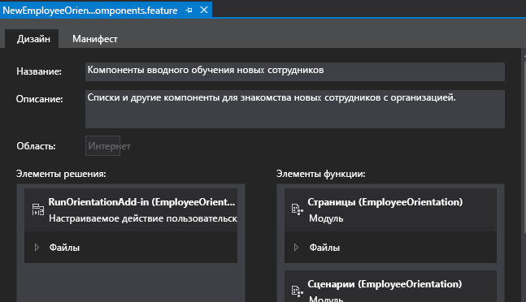
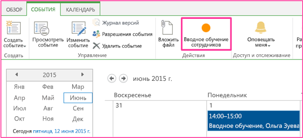

# Создание настраиваемой кнопки ленты на хост-сайте надстройки SharePoint
В этой статье рассказано, как добавить команды для настраиваемых кнопок ленты на хост-сайт надстройки SharePoint.
Это девятая часть из серии статей о том, как разрабатывать Надстройки SharePoint, размещаемые в SharePoint. Сначала вам необходимо ознакомиться со статьей  [Надстройки SharePoint](sharepoint-add-ins.md) и с указанными ниже предыдущими статьями серии.
  
    
    

-  [Знакомство с созданием надстроек SharePoint с размещением в SharePoint](get-started-creating-sharepoint-hosted-sharepoint-add-ins.md)
    
  
-  [Развертывание и установка надстроек для SharePoint](deploy-and-install-a-sharepoint-hosted-sharepoint-add-in.md)
    
  
-  [Добавление настраиваемых столбцов в надстройку с размещением в SharePoint](add-custom-columns-to-a-sharepoint-hostedsharepoint-add-in.md)
    
  
-  [Добавление настраиваемого типа контента в надстройку для SharePoint с размещением в SharePoint](add-a-custom-content-type-to-a-sharepoint-hostedsharepoint-add-in.md)
    
  
-  [Добавление веб-части на страницу в надстройку для SharePoint с размещением в SharePoint](add-a-web-part-to-a-page-in-a-sharepoint-hosted-sharepoint-add-in.md)
    
  
-  [Добавление рабочего процесса в надстройку для SharePoint с размещением в SharePoint](add-a-workflow-to-a-sharepoint-hosted-sharepoint-add-in.md)
    
  
-  [Добавление настраиваемой страницы и стиля для надстройки с размещением в SharePoint](add-a-custom-page-and-style-to-a-sharepoint-hosted-sharepoint-add-in.md)
    
  
-  [Добавление настраиваемой функции отрисовки в клиенте в надстройку SharePoint, размещаемую в SharePoint](add-custom-client-side-rendering-to-a-sharepoint-hosted-sharepoint-add-in.md)
    
  

> [!Примечание]
> Если вы изучали предыдущие статьи этой серии о надстройках, размещаемых в SharePoint, то у вас уже есть решение Visual Studio, которое можно использовать для работы с данной статьей. Кроме того, вы можете скачать репозиторий  [SharePoint_SP-hosted_Add-Ins_Tutorials](https://github.com/OfficeDev/SharePoint_SP-hosted_Add-Ins_Tutorials) и открыть файл BeforeRibbon.sln file.
  
    
    

Все Надстройки SharePoint можно запускать на странице **Site Contents** (Содержание сайта) хост-сайта. Для этого достаточно щелкнуть плитку необходимой надстройки. Кроме того, функциональность надстройки SharePoint можно сделать доступной на хост-сайте с помощью дополнительных действий, которые представляют настраиваемые кнопки ленты или настраиваемые элементы меню. В этой статье показано, как добавить кнопку на ленту хост-сайта.
## Подготовка хост-сайта

Ниже показано, как добавить кнопку на ленту календаря на хост-сайте. В пользовательском интерфейсе сайта разработчика SharePoint выполните указанные ниже действия.
  
    
    

1. На начальной странице сайта последовательно выберите **Site Contents** (Содержание сайта), **add an add-in** (Добавить надстройку) и **Calendar** (Календарь).
    
  
2. В диалоговом окне **Adding Calendar** (Добавление календаря), в поле **Name** (Имя), введитеEmployee Orientation Schedule (Расписание вводного обучения для сотрудников), а затем нажмите кнопку **Create** (Создать).
    
  
3. Когда откроется календарь, переместите курсор на любую дату, чтобы на ней появилась ссылка **Add** (Добавить), и перейдите по этой ссылке.
    
  
4. В диалоговом окне **Employee Orientation Schedule - New Item** (Расписание вводного обучения для сотрудников: новый элемент), в поле **Title** (Название), введитеOrient Cassi Hicks (Вводное обучение для Cassi Hicks). В остальных полях оставьте значения по умолчанию, а затем нажмите кнопку **Save** (Сохранить).
    
    Календарь должен выглядеть примерно так:
    

   **Настраиваемый календарь**

  

     
  

  

  

  
    
    

> [!Важно!]
> Для выполнения следующей процедуры необходимо, чтобы календарь отображался в пользовательском интерфейсе Visual Studio. Но его не будет видно, если при создании календаря открыт Visual Studio. Прежде чем продолжить, закройте Visual Studio, окна браузера и консоли PowerShell, с помощью которых вы входили на сайт разработчика. 
  
    
    

## Добавление дополнительного действия на ленту

1. В **обозревателе решений** щелкните правой кнопкой мыши проект **EmployeeOrientation**, а затем последовательно выберите пункты **Добавить**, **Создать элемент**, **Office/SharePoint** и **Настраиваемое действие ленты**. Укажите для него имя RunOrientationAdd-in, а затем нажмите кнопку **Добавить**.
    
  
2. Мастер **создания дополнительного действия на ленте** задаст ряд вопросов. Ответьте, пользуясь приведенной ниже таблицей.
    

|**Вопрос по свойству**|**Ответ**|
|:-----|:-----|
|Где требуется предоставить настраиваемое действие?    |Выберите пункт **Хост-сайт**.    |
|К какой области относится настраиваемое действие?    |Выберите **Экземпляр списка** ( *не*  "Шаблон списка").   |
|Каким конкретным элементом ограничена область настраиваемого действия?    |Выберите **Employee Orientation Schedule** (Расписание вводного обучения для сотрудников).   |
|Где расположен этот элемент управления?    |Не используйте варианты из раскрывающегося списка. Вместо этого введите **Ribbon.Calendar.Events.Actions.Controls._children**. Третья часть ( **Events**) идентифицирует вкладку ленты, а четвертая часть ( **Actions**) — группу кнопок.    |
|Какой текст отображается в пункте меню?    |Введите **Employee Orientation** (Вводное обучение сотрудников).   |
|Куда ведет настраиваемое действие?    |Не используйте варианты из раскрывающегося списка. Вместо этого введите **~appWebUrl/Lists/NewEmployeesInSeattle**. Это страница представления списка для списка, размещенного на сайте надстройки, поэтому при нажатии кнопки ленты на хост-сайте открывается страница на сайте надстройки.    |
   
3. Нажмите кнопку **Готово**. 
    
  

## Как проверить компонент сайта надстройки

В **обозревателе решений** разверните узел **Features** (Компоненты) и выберите компонент **NewEmployeeOrientationComponents**. Откроется конструктор компонентов.
  
    
    
Обратите внимание, что созданное вами дополнительное действие **RunOrientationAdd-in** находится в списке **Элементы в решении**, а не в списке **Элементы в компоненте**. Это связано с тем, что компонент развернут на сайте надстройки, а ваше дополнительное действие — на хост-сайте. Когда вы создаете пакет надстройки в Visual Studio для развертывания в рабочей среде или нажимаете клавишу F5 в Visual Studio, Инструменты разработчика Office для Visual Studio создает особый компонент хост-сайта, добавляет в него дополнительное действие и развертывает его на хост-сайте. Ни в коем случае не следует изменять компонент хост-сайта. Именно поэтому он не создается до момента формирования пакета.
  
    
    

**Конструктор компонентов**

  
    
    

  
    
    

  
    
    

  
    
    

  
    
    

## Запуск и тестирование надстройки

  
    
    

1. Нажмите клавишу F5, чтобы развернуть и запустить надстройку. Visual Studio выполнит временную установку надстройки на тестовом сайте SharePoint и сразу же запустит ее. 
    
  
2. Откроется страница надстройки SharePoint, указанная по умолчанию. Перейдите на начальную страницу сайта разработчика (то есть хост-сайта). Ссылка на него расположена в левом верхнем углу страницы.
    
  
3. На начальной странице хост-сайта выберите **Site Contents** (Содержание сайта), а затем на странице **Site Contents** выберите календарь **Employee Orientation Schedule** (Расписание вводного обучения для сотрудников). Обратите внимание, что надстройку **Employee Orientation** (Вводное обучение сотрудников) выбирать не надо.
    
  
4. Когда откроется календарь, выберите событие **Orient Cassie Hicks** (Вводное обучение для Cassi Hicks). Если вкладка **События** на ленте не открылась автоматически, откройте ее. Она должна выглядеть примерно так:
    
   **Вкладка событий на ленте с настраиваемой кнопкой**

  

     
  

  

  
5. В группе **Действия** на ленте выберите элемент **Employee Orientation** (Вводное обучение сотрудников). Откроется представление списка **New Employees in Seattle** (Новые сотрудники в Сиэтле).
    
  
6. Чтобы завершить сеанс отладки, закройте окно браузера или остановите отладку в Visual Studio. При каждом нажатии клавиши F5 Visual Studio будет отзывать предыдущую версию надстройки и устанавливать ее последнюю версию.
    
  
7. Вы будете работать с этой надстройкой и решением Visual Studio и при изучении других статей, поэтому при перерывах в работе рекомендуется отзывать надстройку. В **обозревателе решений** щелкните проект правой кнопкой мыши и выберите пункт **Отозвать**.
    
  

## 

Из следующей статьи этой серии вы узнаете, как добавить JavaScript в надстройку SharePoint и получить доступ к данным SharePoint с помощью объектной модели JavaScript для SharePoint. Название этой статьи:  [Использование API JavaScript для SharePoint для работы с данными SharePoint](use-the-sharepoint-javascript-apis-to-work-with-sharepoint-data.md).
  
    
    

