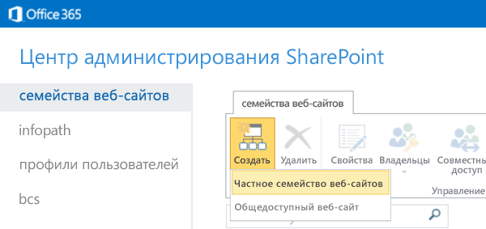
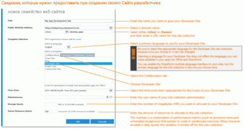
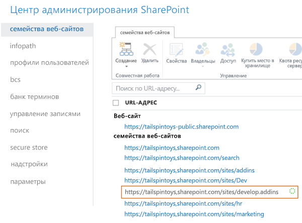

# Создание сайта разработчика с использованием актуальной подписки на Office 365
В Сайт разработчиков Office 365 можно с легкостью настроить все необходимое, чтобы быстро создавать, тестировать и развертывать Надстройки Office и SharePoint. Значительная часть подписок на Office 365 бизнес, Office 365 корпоративный, Office 365 для образовательных учреждений и Office 365 для государственных учреждений включают в себя шаблон сайта, с помощью которого можно создавать Сайт разработчиков.
 **Перед началом работы**
  
    
    

- **Убедитесь, что ваша подписка на Office 365 поддерживает Сайт разработчика.** Если у вас есть один из указанных ниже планов подписки на Office 365, можно создать Сайт разработчиков, используя текущую подписку.
    

  
    
    
> Office 365 для среднего бизнеса.
    
  

  
    
    
> Office 365 корпоративный E1, E3, E4, E5 или K1.
    
  

  
    
    
> Office 365 для образовательных учреждений A2, A3 или A4.
    
  

  
    
    
> Office 365 для государственных учреждений G1, G3, G4 или K1.
    
  
- **Если у вас есть подписка на Office 365 для малого бизнеса,** она поддерживает только одно семейство веб-сайтов, поэтому невозможно создать семейство Сайта разработчика. Узнать больше о планах Office 365 для своей компании можно в статье [SharePoint Online: ограничения, связанные с программным обеспечением, и пороговые значения](http://office.microsoft.com/ru-ru/office365-sharepoint-online-enterprise-help/sharepoint-online-software-boundaries-and-limits-HA102694293.aspx).
    
  
- Дополнительные сведения о подписках на Office 365 корпоративный см. на веб-странице  [Планы и цены](http://products.office.com/ru-ru/business/office-365-enterprise-e1-business-software).
    
  

## Создание Сайта разработчика

1. Войдите в Office 365 как глобальный администратор или администратор SharePoint Online.
    
    **Необходимо войти как глобальный администратор или администратор SharePoint Online, чтобы создавать новые семейства веб-сайтов,** например Сайт разработчиков. Только администраторы могут видеть раздел "Администратор" при входе в Office 365. Если вы не администратор, свяжитесь с администратором своей организации и попросите его сделать следующее:
    
  - Предоставить вам права администратора, чтобы вы могли создать Сайт разработчиков самостоятельно.
    
  
  - Создать Сайт разработчиков и указать вас как администратора семейства веб-сайтов.
    
  
2. Нажмите кнопку средства запуска приложений в левой части панели навигации вверху страницы.
    
  
3. Щелкните плитку **Администратор**.
    
  
4. В дереве переходов слева разверните раздел **Администратор** и выберите пункт **SharePoint**.
    
  
5. В **Центре администрирования SharePoint**, на вкладке **Семейства веб-сайтов**, выберите элементы **Создать > Частное семейство веб-сайтов**.
    
     
  

  

  
6. В диалоговом окне **Создание семейства веб-сайтов** введите информацию о своем Сайте разработчика.
    
    **Щелкните изображение ниже, чтобы просмотреть параметры нового семейства веб-сайтов в диалоговом окне, или изучите таблицу под изображением.**
     [
  
    
    
](http://go.microsoft.com/fwlink/?LinkId=400960)
|||
|:-----|:-----|
|**Название**.   |Название, которое вы собираетесь присвоить своему Сайту разработчика.    |
|Список **Адрес веб-сайта**.   |Укажите доменное имя и URL-путь ( **/sites/** или **/teams/**), а затем введите URL-имя семейства веб-сайтов.    |
|Список **Выберите язык** в разделе **Выбор шаблона**.   |Основной язык вашего Сайта разработчика.    **Убедитесь в выборе нужного языка для семейства веб-сайтов Сайта разработчика, так как вы не сможете его изменить.**   Выбор языка для Сайта разработчика не влияет на выбор языков, который будет доступен в ваших надстройках для Office и SharePoint.    Вы сможете включить многоязычный интерфейс SharePoint на своих сайтах, но основным языком этого семейства веб-сайтов будет выбранный в этом поле.    |
|Вкладка **Совместная работа** в подразделе **Выберите шаблон** раздела **Выбор шаблона**.    |Выберите **Сайт разработчика**.    |
|**Часовой пояс**.    |Часовой пояс, который соответствует локали вашего Сайта разработчика.    |
|**Администратор**.    |Имя пользователя для администратора вашего семейства веб-сайтов.    |
|**Дисковая квота**.    |Количество мегабайт (МБ), которые вы хотите выделить для семейства веб-сайтов Сайта разработчика.    |
|**Квота ресурсов сервера**.    |Объем ресурсов, выделяемый для семейства веб-сайтов.    Это значение объединяет в себе метрики производительности (например, время использования процессора и необработанные исключения), относящиеся к коду в изолированных решениях. Если указанный уровень превышает дневную квоту, "песочница" для этого семейства веб-сайтов будет отключена.    |
   
7. Нажмите кнопку **ОК**.
    
    В списке **Семейства веб-сайтов** отобразится URL-адрес нового Сайта разработчика. Когда создание сайта будет завершено, вы сможете перейти по URL-адресу и открыть ваш Сайт разработчика.
    
     
  

  

  

## Дополнительные ресурсы

-  [Надстройки SharePoint](sharepoint-add-ins.md)
    
  
-  [Создание и удаление семейства веб-сайтов](http://office.microsoft.com/ru-ru/office365-sharepoint-online-enterprise-help/create-or-delete-a-site-collection-HA102772354.aspx?CTT=1)
    
  

