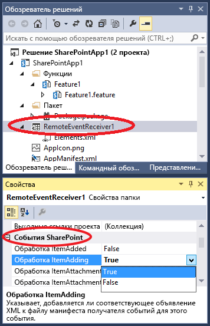

# Создание удаленного приемника событий в надстройках SharePoint
Создание удаленного приемника событий (RER), который обрабатывает события для списков и их элементов в Надстройка SharePoint.
## Необходимые условия
<a name="SP15appevent_prereq"> </a>

Для начала желательно иметь представление о надстройках Надстройки SharePoint с размещением у поставщика, а также разработать несколько надстроек, которые были бы хоть немного сложнее, чем "Hello World". Кроме того, следует ознакомиться со статьей  [Обработка событий в надстройках SharePoint](handle-events-in-sharepoint-add-ins.md). 
  
    
    

## Создание удаленного приемника событий
<a name="MakeRER"> </a>

В этой статье показано, как усовершенствовать Надстройка SharePoint, добавив удаленный приемник событий (RER), который обрабатывает событие ItemAdded для пользовательского списка на сайте надстройки. Удаленный приемник событий регистрируется на сайте надстройки с помощью декларативной разметки. (Удаленные приемники событий регистрируются на  *хост-сайте*  программно. Соответствующий пример кода см. в статье [OfficeDev/PnP/Samples/Core.EventReceivers](https://github.com/OfficeDev/PnP/tree/master/Samples/Core.EventReceivers).)
  
    
    
Приемник удаленных событий должен быть веб-службой SOAP. В этом примере он реализован как служба Windows Communication Foundation (WCF). Но его возможно реализовать в стеке не от Майкрософт.
  
    
    
Чтобы следовать приведенным здесь указаниям и ввести код самостоятельно, скачайте пример из репозитория  [SharePoint-Add-in-CSOM-BasicDataOperations](https://github.com/OfficeDev/SharePoint-Add-in-CSOM-BasicDataOperations), а затем откройте его в Visual Studio.
  
    
    

> **Примечание**
> В этом примере используется файл TokenHelper.cs, созданный в Инструменты разработчика Office для Visual Studio. На момент создания примера это была последняя версия, но сейчас она может быть устаревшей. Тем не менее этот пример отлично подходит для создания вашего первого удаленного приемника событий. Когда вы будете готовы двигаться дальше, ознакомьтесь с примерами в разделе "Дальнейшие действия" ниже. Скорее всего, они будут оставаться актуальными. 
  
    
    


### Регистрация приемника удаленных событий


1. Откройте проект Надстройка SharePoint в Visual Studio. 
    
  
2.  Выберите узел проекта надстройки в **обозревателе решений**.
    
  
3. В строке меню выберите пункты **Проект** и **Добавить элемент**.
    
  
4. На панели **Установленные шаблоны** выберите узел **Office/ SharePoint**.
    
  
5. На панели **Шаблоны** выберите шаблон **Удаленный приемник событий**.
    
  
6. В поле **Имя** оставьте имя, указанное по умолчанию (RemoteEventReceiver1), а затем нажмите кнопку **Добавить**.
    
  
7. В списке **Тип приемника событий:** выберите **События элемента списка**.
    
  
8. В списке **Элемент, который должен быть источником событий:** выберите **Настраиваемый список**.
    
    В данном примере используется настраиваемый общий список. Тем не менее, приемник удаленных событий также может обрабатывать события, которые возникают в стандартных списках SharePoint, например **Объявления** или **Контакты**.
    
  
9. В списке **Обработать следующие ошибки** выберите пункт **Добавляется элемент**, а затем нажмите кнопку **Готово**.
    
    К веб-приложению добавляется веб-служба, чтобы обрабатывать указанное удаленное событие. В Надстройка SharePoint добавляется приемник удаленных событий, а ссылка на элемент списка добавляется в файл Elements.xml приемника, который хранится в компоненте сайта надстройки.
    
  

### Создание списка


1. Выберите узел проекта приложения в **обозревателе решений**.
    
  
2. В строке меню выберите пункты **Проект** и **Добавить элемент**.
    
  
3. В области **Установленные шаблоны** выберите узел **Office и SharePoint**.
    
  
4. В области **Шаблоны** выберите шаблон **Список**.
    
  
5. В поле **Имя** оставьте имя по умолчанию (List1), а затем нажмите кнопку **Добавить**.
    
  
6. Выберите параметр **Создать экземпляр списка на основе существующего шаблона списка**, выберите в списке пункт **Настраиваемый список** и нажмите кнопку **Готово**.
    
  

### Добавление функциональных возможностей в удаленный приемник событий


1. Если тестовая ферма SharePoint и Visual Studio работают на разных компьютерах (или в качестве тестового сайта SharePoint используется область клиентов SharePoint Online), настройте проект для отладки с помощью служебной шины Microsoft Azure. Дополнительные сведения см. в статье  [Устранение неполадок и отладка удаленного приемника событий в надстройке для SharePoint](debug-and-troubleshoot-a-remote-event-receiver-in-a-sharepoint-add-in.md). 
    
  
2. В этом файле с кодом для службы удаленного приемника событий (то есть RemoteEventReceiver1.svc.cs) замените содержимое следующим кодом.
    
    Этот код выполняет следующие задачи.
    
  - Получение действительного объекта контекста клиента. 
    
  
  - Если список под названием **EventLog** еще не существует, он создается и заполняется именами удаленных событий.
    
  
  - Добавляет в список элемент для события, в том числе время и дату.
    
  

    > **Примечание**
      > На момент написания статьи средства Инструменты разработчика Office для Visual Studio при создании приемника добавляют ссылки на все необходимые сборки, но в более поздних версиях такой возможности может не быть. Если компилятор выдает ошибку, просто добавьте недостающие ссылки — например, на System.ServiceModel или System.ComponentModel.DataAnnotations. 


  ```cs
  
using System;
using System.Collections.Generic;
using System.Linq;
using System.Net;
using System.Text;
using Microsoft.SharePoint.Client;
using Microsoft.SharePoint.Client.EventReceivers;
using System.Runtime.Serialization;
using System.ServiceModel;
using System.ServiceModel.Channels;


namespace BasicDataOperationsWeb.Services
{
    public class RemoteEventReceiver1 : IRemoteEventService
    {
        public SPRemoteEventResult ProcessEvent(SPRemoteEventProperties properties)
        {
            // When a "before" event occurs (such as ItemAdding), call the event 
            // receiver code.
            ListRemoteEventReceiver(properties);
            return new SPRemoteEventResult();
        }

        public void ProcessOneWayEvent(SPRemoteEventProperties properties)
        {
            // When an "after" event occurs (such as ItemAdded), call the event 
            // receiver code.            
        }

        public static void ListRemoteEventReceiver(SPRemoteEventProperties properties)
        {
            string logListTitle = "EventLog";

            // Return if the event is from the EventLog list itself. Otherwise, it may go into
            // an infinite loop.
            if (string.Equals(properties.ItemEventProperties.ListTitle, logListTitle, 
                  StringComparison.OrdinalIgnoreCase))
                return;

            // Get the token from the request header.
            HttpRequestMessageProperty requestProperty = 
                  (HttpRequestMessageProperty)OperationContext
                   .Current.IncomingMessageProperties[HttpRequestMessageProperty.Name];
            string contextTokenString = requestProperty.Headers["X-SP-ContextToken"];

            // If there is a valid token, continue.
            if (contextTokenString != null)
            {
                SharePointContextToken contextToken =
                    TokenHelper.ReadAndValidateContextToken(contextTokenString, 
                         requestProperty.Headers[HttpRequestHeader.Host]);

                Uri sharepointUrl = new Uri(properties.ItemEventProperties.WebUrl);
                string accessToken = TokenHelper.GetAccessToken(contextToken, 
                                                      sharepointUrl.Authority).AccessToken;
                bool exists = false;

                // Retrieve the log list "EventLog" and add the name of the event that occurred
                // to it with a date/time stamp.
                using (ClientContext clientContext = 
                     TokenHelper.GetClientContextWithAccessToken(sharepointUrl.ToString(), 
                                                                                                         accessToken))
                {
                    clientContext.Load(clientContext.Web);
                    clientContext.ExecuteQuery();
                    List logList = clientContext.Web.Lists.GetByTitle(logListTitle);

                    try
                    {
                        clientContext.Load(logList);
                        clientContext.ExecuteQuery();
                        exists = true;
                    }

                    catch (Microsoft.SharePoint.Client.ServerUnauthorizedAccessException)
                    {
                        // If the user doesn't have permissions to access the server that's 
                        // running SharePoint, return.
                        return;
                    }

                    catch (Microsoft.SharePoint.Client.ServerException)
                    {
                        // If an error occurs on the server that's running SharePoint, return.
                        exists = false;
                    }

                    // Create a log list called "EventLog" if it doesn't already exist.
                    if (!exists)
                    {
                        ListCreationInformation listInfo = new ListCreationInformation();
                        listInfo.Title = logListTitle;
                        // Create a generic custom list.
                        listInfo.TemplateType = 100;
                        clientContext.Web.Lists.Add(listInfo);
                        clientContext.Web.Context.ExecuteQuery();
                    }

                    // Add the event entry to the EventLog list.
                    string itemTitle = "Event: " + properties.EventType.ToString() + 
                          " occurred on: " + 
                          DateTime.Now.ToString(" yyyy/MM/dd/HH:mm:ss:fffffff");
                    ListCollection lists = clientContext.Web.Lists;
                    List selectedList = lists.GetByTitle(logListTitle);
                    clientContext.Load<ListCollection>(lists);
                    clientContext.Load<List>(selectedList);
                    ListItemCreationInformation listItemCreationInfo = 
                          new ListItemCreationInformation();
                    var listItem = selectedList.AddItem(listItemCreationInfo);
                    listItem["Title"] = itemTitle;
                    listItem.Update();
                    clientContext.ExecuteQuery();
                }
            }
        }
    }
}
  ```

3. В файле Home.aspx.cs замените все экземпляры  `SPHostUrl` на `SPAppWebUrl`.
    
    Например,  `sharepointUrl = new Uri(Request.QueryString["SPHostUrl"]);` следует заменить на `sharepointUrl = new Uri(Request.QueryString["SPAppWebUrl"]);`. 
    
  

## Запуск и тестирование обработчика событий
<a name="RunAndTest"> </a>

Протестируйте обработчик, следуя приведенной ниже процедуре.
  
    
    

1. Нажмите клавишу **F5**, чтобы запустить проект.
    
  
2. Разрешите доверие надстройке, когда появится соответствующий запрос.
    
    Запустится ваше Надстройка SharePoint и появится таблица доступных списков, включающая список **List1**.
    
  
3. Выберите идентификатор списка **List1**.
    
    Этот идентификатор копируется в поле **Извлечение элементов списка**.
    
  
4. Нажмите кнопку **Извлечение элементов списка**.
    
    Откроется список **List1** без элементов.
    
  
5. В поле **Add Item** введитеПервый элемент, а затем нажмите кнопку **Add Item**.
    
    Элемент **Первый элемент** будет добавлен в список **List1**. При этом активируется удаленный приемник событий и добавляется запись в список EventLog.
    
  
6. Нажмите кнопку **Refresh Lists**, чтобы вернуться к таблице списков.
    
    В таблице появится новый список с именем **EventLog**.
    
  
7. Выберите GUID списка **ListID** для **EventLog**, а затем нажмите кнопку **Извлечение элементов списка**.
    
    Появится таблица для списка **EventLog** с записью для события **Handle ItemAdding**, которое происходит при добавлении элемента в список **List1**.
    
  

## Добавление и удаление обработчиков событий с помощью Visual Studio
<a name="Handle"> </a>


1. В **обозревателе решений** выберите узел проекта для приемника удаленных событий.
    
  
2. В области **Свойства** задайте для свойств событий, которые нужно обрабатывать, значение **True**.
    
    Например, если вы хотите обеспечить реакцию на добавление элемента списка пользователем, задайте для свойства **Обрабатывать ItemAdding** значение **True**. Если вы не хотите обрабатывать это событие, задайте для его свойства значение **False**.
    

   **Рис. 1. Удаленные события SharePoint в Visual Studio**

  

     
  

  

  
3. Если вы добавили событие, включите код для его обработки в файл кода веб-службы, как и для предыдущих событий.
    
    Для обработки события другого типа добавьте в Надстройка SharePoint еще один приемник удаленных событий. Например, если приемник удаленных событий обрабатывает события, связанные с элементами списка, вы можете добавить в него еще одно такое событие. Однако если вы хотите обрабатывать событие, связанное со списками, вам нужно добавить другой приемник удаленных событий. 
    
  

## Ограничения на URL-адрес и размещение производственного удаленного приемника событий
<a name="Handle"> </a>

Удаленный приемник событий может быть размещен в облаке или на локальном сервере, который не используется в качестве сервера SharePoint. URL-адрес производственного приемника не может использовать определенный порт. Это значит, что вам необходимо использовать порт 443 для HTTPS (рекомендовано) или порт 80 для HTTP. При использовании HTTPS, если приемник размещен локально, а надстройка — на Microsoft SharePoint Online, сервер размещения должен иметь доверенный сертификат, выданный центром сертификации. (Самозаверяющий сертификат действует, только если надстройка расположена в локальной ферме SharePoint.)
  
    
    

## Дальнейшие действия
<a name="Handle"> </a>

Чтобы подробнее изучить удаленные приемники событий, воспользуйтесь такими примерами кода:
  
    
    

-  [OfficeDev/PnP/Samples/Core.EventReceivers](https://github.com/OfficeDev/PnP/tree/master/Samples/Core.EventReceivers)
    
  
-  [OfficeDev/PnP/Samples/Provisioning.ReR](
https://github.com/OfficeDev/PnP/tree/master/Samples/Provisioning.ReR)
    
  
-  [OfficeDev/PnP/Scenarios/ECM.AutoTagging](https://github.com/OfficeDev/PnP/tree/master/Samples/ECM.AutoTagging)
    
  

## Дополнительные ресурсы
<a name="Additional"> </a>


-  [Обработка событий в надстройках SharePoint](handle-events-in-sharepoint-add-ins.md)
    
  
-  [Устранение неполадок и отладка удаленного приемника событий в надстройке для SharePoint](debug-and-troubleshoot-a-remote-event-receiver-in-a-sharepoint-add-in.md)
    
  
-  [Удаленные приемники событий: вопросы и ответы](handle-events-in-sharepoint-add-ins.md#RERFAQ)
    
  

