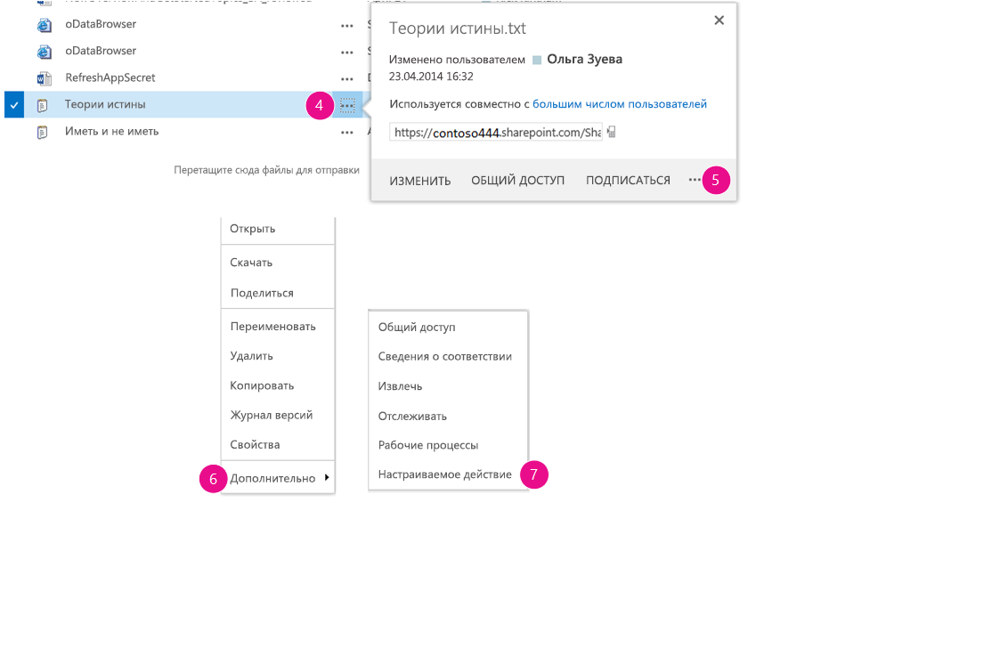
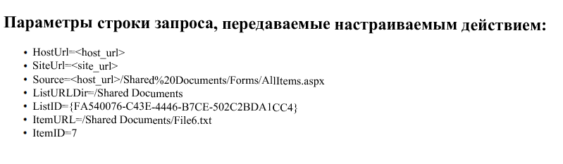
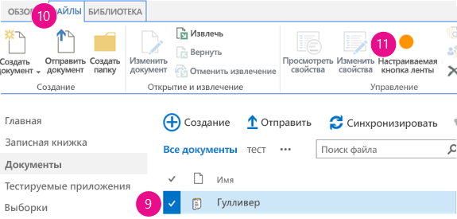

# Выполнение пользовательских действий для развертывания надстроек для SharePoint
Узнайте, как создать дополнительное действие в SharePoint, которое будет развернуто на хост-сайте при развертывании надстройки для SharePoint.
При создании надстройки для SharePoint с помощью дополнительных действий можно взаимодействовать со списками и лентой на хост-сайте. Дополнительное действие разворачивается на хост-сайте, когда конечные пользователи устанавливают вашу надстройку. Дополнительные действия могут открывать удаленную веб-страницу и передавать информацию с помощью строки запроса. Для надстроек доступны два типа дополнительных действий: дополнительное действие ленты идополнительное действие ECB.
  
    
    


## Предварительные требования для использования примеров в этой статье
<a name="SP15Createcustomactionsapps_Prereq"> </a>

Вам необходима среда разработки, как описано в статье  [Знакомство с созданием надстроек SharePoint с размещением у поставщика](get-started-creating-provider-hosted-sharepoint-add-ins.md).
  
    
    

### Основные понятия, помогающие изучить дополнительные действия

В следующей таблице приведены полезные статьи, которые помогут изучить основные понятия и этапы, входящие в сценарий дополнительного действия.
  
    
    

**Таблица 1. Основные понятия для дополнительных действий**


|**Статья**|**Описание**|
|:-----|:-----|
| [Надстройки SharePoint](sharepoint-add-ins.md) <br/> |Изучите новую модель надстроек в SharePoint, которая позволяет создавать надстройки, представляющие собой небольшие и простые в использовании решения для конечных пользователей.  <br/> |
| [Проектирование пользовательского интерфейса для надстроек SharePoint](ux-design-for-sharepoint-add-ins.md) <br/> |Изучите варианты взаимодействия с пользователями, которые доступны при создании надстроек для SharePoint.  <br/> |
| [Хост-сайты, сайты надстроек и компоненты SharePoint в SharePoint 2013](host-webs-add-in-webs-and-sharepoint-components-in-sharepoint-2013.md) <br/> |Изучите различия между хост-сайтами и сайтами надстроек. Узнайте, какие компоненты SharePoint можно включать в надстройку для SharePoint, какие компоненты необходимо разворачивать на хост-сайте, а какие — на сайте надстройки, и как выполнить развертывание сайта надстройки в изолированном домене.  <br/> |
   

## Пример кода. Создание дополнительного действия в библиотеках документов хост-сайта
<a name="SP15Createcustomactionsapps_Codeexample"> </a>

Чтобы создать дополнительное действие в библиотеках документов хост-сайта, выполните следующие действия.
  
    
    

1. Создайте проект надстройки для SharePoint и удаленный веб-проект.
    
  
2. Добавьте компонент дополнительного действия в проект надстройки для SharePoint.
    
  
3. Добавьте веб-страницу надстройки в веб-проект.
    
  

### Создание проекта надстройки для SharePoint и удаленного веб-проекта


1. Откройте Visual Studio как администратор. (Для этого щелкните правой кнопкой значок Visual Studio в меню **Пуск** и выберите команду **Запуск от имени администратора**.)
    
  
2. Создайте надстройку для SharePoint с размещением у поставщика, как описано в статье  [Знакомство с созданием надстроек SharePoint с размещением у поставщика](get-started-creating-provider-hosted-sharepoint-add-ins.md), и назовите ее CustomActionsApp. 
    
  

### Добавление веб-страницы надстройки для дополнительных действий


1. После создания решения Visual Studio щелкните правой кнопкой проект веб-приложения (но не проект надстройки для SharePoint) и добавьте новую веб-форму, последовательно выбрав пункты **Добавить** > **Новый элемент** > **Интернет** > **Веб-форма**. Присвойте форме имя CustomActionTarget.aspx.
    
  
2. В файле CustomActionTarget.aspx замените весь элемент **html** и его дочерние элементы на следующий код HTML. Оставьте всю разметку над элементом **html** без изменений. Код HTML содержит скрипт JavaScript, который выполняет следующие задачи:
    
  - Предоставляет заполнитель для параметров строки запроса.
    
  
  - Извлекает параметры из строки запроса.
    
  
  - Отображает параметры в заполнителе.
    
  

    > **Важно!**
      > Маркеры ItemURL и ItemID передаются, только если выбран элемент. В надстройке для SharePoint для рабочей среды код должен надлежащим образом обрабатывать ситуации, когда элемент не выбран. В этом примере код предупреждает пользователя о том, что элемент не выбран. 

  ```HTML
  
<html xmlns="http://www.w3.org/1999/xhtml">
<head>
    <title>Custom action target</title>
</head>
<body>
    <h2>Query string parameters passed by the custom action:</h2>

    <!-- Placeholder for query string parameters -->
    <ul id="qsparams"/>

    <!-- Main JavaScript function, renders
         the query string parameters -->
    <script lang="javascript">
        var params = document.URL.split("?")[1].split("&amp;");
        var paramsHTML = "";
      
        // Extracts the parameters from the query string.
        // Parameters are URLencoded, decode for rendering
        // in page.
        for (var i = 0; i < params.length; i = i + 1) {
            params[i] = decodeURIComponent(params[i]);
            paramsHTML += "<li>" + params[i] + "</li>";
        }

         // Alert the user when no item has been selected.
         // (The SPListItemId is the 5th parameter.)
         if (params[5] === undefined) {
            paramsHTML += "<div> <h3> No item has been selected from the list.  Please select an item. </h3> </div> ";
         }

        // Render parameters in the placeholder.
        document.getElementById("qsparams").innerHTML =
            paramsHTML;
    </script>
</body>
</html>
  ```


### Добавление настраиваемого действия элемента меню в проект надстройки для SharePoint


1. Щелкните правой кнопкой мыши проект надстройки для SharePoint и последовательно выберите пункты **Добавить** > **Новый элемент** > **Office и SharePoint** > **Настраиваемое действие элемента меню**. 
    
  
2. Оставьте имя по умолчанию и нажмите кнопку **Добавить**.
    
  
3. Мастер **создания настраиваемого действия элемента меню** задаст ряд вопросов. Укажите ответы из следующей таблицы:
    
   **Табл. 2. Свойства дополнительного действия элемента меню**


|**Вопрос по свойству**|**Ответ**|
|:-----|:-----|
|Где требуется предоставить настраиваемое действие?  <br/> |Выберите пункт **Хост-сайт**.  <br/> |
|К какой области относится настраиваемое действие?  <br/> |Выберите **Шаблон списка**.  <br/> |
|Каким конкретным элементом ограничена область настраиваемого действия?  <br/> |Выберите пункт **Библиотека документов**.  <br/> |
|Какой текст отображается в пункте меню?  <br/> |Введите **Мое настраиваемое действие**.  <br/> |
|Куда ведет настраиваемое действие?  <br/> |Выберите страницу **CustomActionAppWeb\\CustomActionTarget.aspx**.  <br/> |
   
4. Нажмите кнопку **Готово**.
    
    Visual Studio создает следующую разметку в файле elements.xml дополнительного действия элемента меню.
    


  ```XML
  
<?xml version="1.0" encoding="utf-8"?>
<Elements 
    xmlns="http://schemas.microsoft.com/sharepoint/">
    <!-- RegistrationId attribute is the list type id,
        in this case, a document library (id=101). -->
  <CustomAction 
      Id="65695319-4784-478e-8dcd-4e541cb1d682.CustomAction"
      RegistrationType="List"
      RegistrationId="101"
      Location="EditControlBlock"
      Sequence="10001"
      Title="Invoke custom action">
    <!-- 
    Update the Url below to the page you want the custom action to use.
    Start the URL with the token ~remoteAppUrl if the page is in the
    associated web project, use ~appWebUrl if page is in the add-in project.
    -->
    <UrlAction Url=
"~remoteAppUrl/CustomActionTarget.aspx?{StandardTokens}&amp;amp;SPListItemId={ItemId}&amp;amp;SPListId={ListId}" />
  </CustomAction>
</Elements>

  ```

5. Добавьте следующие параметры запроса в конец атрибута **Url** элемента **UrlAction**: 
    
     `&amp;amp;SPSource={Source}&amp;amp;SPListURLDir={ListUrlDir}&amp;amp;SPItemURL={ItemUrl}`
    
    Элемент **UrlAction** должен выглядеть следующим образом:
    
     ` <UrlAction Url= "~remoteAppUrl/CustomActionTarget.aspx?{StandardTokens}&amp;amp;SPListItemId={ItemId}&amp;amp;SPListId={ListId}&amp;amp;SPSource={Source}&amp;amp;SPListURLDir={ListUrlDir}&amp;amp;SPItemURL={ItemUrl}" />`
    
  

> **Примечание**
> В этом примере удаленная веб-страница открывается в полном окне, когда пользователь выбирает настраиваемое действие в меню. Удаленную веб-страницу также можно открывать в диалоговом окне с помощью атрибута **HostWebDialog**. Дополнительные сведения см. в репозитории  [SharePoint-Add-in-Localization](https://github.com/OfficeDev/SharePoint-Add-in-Localization). 
  
    
    


### Добавление настраиваемого действия ленты в проект надстройки для SharePoint


1. Щелкните правой кнопкой мыши проект надстройки для SharePoint и последовательно выберите пункты **Добавить** > **Новый элемент** > **Office и SharePoint** > **Настраиваемое действие ленты**. 
    
  
2. Оставьте имя по умолчанию и нажмите кнопку **Добавить**.
    
  
3. Мастер **создания настраиваемого действия ленты** задаст ряд вопросов. Укажите ответы из следующей таблицы:
    
   **Табл. 3. Свойства дополнительного действия ленты**


|**Вопрос по свойству**|**Ответ**|
|:-----|:-----|
|Где требуется предоставить настраиваемое действие?  <br/> |Выберите пункт **Хост-сайт**.  <br/> |
|К какой области относится настраиваемое действие?  <br/> |Выберите **Шаблон списка**.  <br/> |
|Каким конкретным элементом ограничена область настраиваемого действия?  <br/> |Выберите пункт **Библиотека документов**.  <br/> |
|Где расположен этот элемент управления?  <br/> |Выберите **Ribbon.Documents.Manage**.  <br/> |
|Какой текст отображается в пункте меню?  <br/> |Введите **Моя настраиваемая кнопка ленты**.  <br/> |
|Куда ведет настраиваемое действие?  <br/> |Выберите страницу **CustomActionAppWeb\\CustomActionTarget.aspx**.  <br/> |
   
4. Visual Studio создает следующую разметку в файле elements.xml дополнительного действия ленты.
    
  ```XML
  
<?xml version="1.0" encoding="utf-8"?>
<Elements xmlns="http://schemas.microsoft.com/sharepoint/">
  <CustomAction Id="85691508-c076-4f43-93d4-96b4d5253a09.RibbonCustomAction1"
                RegistrationType="List"
                RegistrationId="101"
                Location="CommandUI.Ribbon"
                Sequence="10001"
                Title="Invoke &amp;apos;RibbonCustomAction1&amp;apos; action">
    <CommandUIExtension>
      <!-- 
      Update the UI definitions below with the controls and the command actions
      that you want to enable for the custom action.
      -->
      <CommandUIDefinitions>
        <CommandUIDefinition Location="Ribbon.Documents.Manage.Controls._children">
          <Button Id="Ribbon.Documents.Manage.RibbonCustomAction1Button"
                  Alt="My Custom Ribbon Button"
                  Sequence="100"
                  Command="Invoke_RibbonCustomAction1ButtonRequest"
                  LabelText="My Custom Ribbon Button"
                  TemplateAlias="o1"
                  Image32by32="_layouts/15/images/placeholder32x32.png"
                  Image16by16="_layouts/15/images/placeholder16x16.png" />
        </CommandUIDefinition>
      </CommandUIDefinitions>
      <CommandUIHandlers>
        <CommandUIHandler Command="Invoke_RibbonCustomAction1ButtonRequest"
                          CommandAction="~remoteAppUrl/CustomActionTarget.aspx?{StandardTokens}&amp;amp;SPListItemId={SelectedItemId}&amp;amp;SPListId={SelectedListId}"/>
      </CommandUIHandlers>
    </CommandUIExtension >
  </CustomAction>
</Elements> 

  ```

5. Добавьте следующие параметры запроса в конец атрибута **CommandAction** элемента **CommandUIHandler**: 
    
     `&amp;amp;SPSource={Source}&amp;amp;SPListURLDir={ListUrlDir}`
    
    Элемент **CommandUIHandler** должен выглядеть следующим образом:
    
     ` <CommandUIHandler Command="Invoke_RibbonCustomAction1ButtonRequest" CommandAction="~remoteAppUrl/CustomActionTarget.aspx?{StandardTokens}&amp;amp;SPListItemId={SelectedItemId}&amp;amp;SPListId={SelectedListId}&amp;amp;SPSource={Source}&amp;amp;SPListURLDir={ListUrlDir}" />`
    
    > **Примечание**
      > Дополнительные действия ленты используют **SelectedListId** и **SelectedItemId**. **ListId** и **ItemId** работают только с дополнительными действиями элементов меню.

### Установка домашней страницы хост-сайта в качестве начальной страницы надстройки


1. В примере ниже у надстройки для SharePoint нет сайта надстройки, а ее удаленное веб-приложение существует только для размещения формы. Поэтому начальной страницей надстройки следует сделать домашнюю страницу хост-сайта. 
    
    Для начала выберите проект надстройки для SharePoint (но не проект веб-приложения) в **обозревателе решений** и скопируйте значение свойства **URL-адрес сайта**, включая протокол (например, **https://contoso.sharepoint.com**) в буфер обмена. 
    
  
2. Откройте манифест надстройки, а затем вставьте URL-адрес в поле **Начальная страница**.
    
  
3. При необходимости можно удалить страницу Default.aspx из проекта веб-приложения, так как она не используется в надстройке для SharePoint.
    
  

### Построение и запуск решения


1. Нажмите клавишу F5.
    
    > **Примечание**
      > Когда вы нажимаете клавишу F5, Visual Studio выполняет построение решения, разворачивает надстройку и открывает страницу разрешений для нее. 
2. Нажмите кнопку **Доверять**, после чего откроется страница сайта разработки по умолчанию.
    
  
3. Перейдите в какую-либо библиотеку документов на хост-сайте.
    
   **Запуск настраиваемого действия меню**

  

     
  

  

  
4. Нажмите кнопку выноски ( **...**) для любого документа. Откроется выноска.
    
  
5. Нажмите кнопку выноски ( **...**) на выноске. 
    
  
6. Нажмите кнопку **Дополнительно**.
    
  
7. Выберите **Мое настраиваемое действие меню** в контекстном меню. На удаленной веб-странице появится примерно следующее:
    
   **Удаленная веб-страница с параметрами из дополнительного действия**

  

     
  

  

  
8. Нажмите кнопку **Назад** в браузере, чтобы вернуться к библиотеке.
    
   **Запуск настраиваемого действия ленты**

  

     
  

  

  
9. Выберите любой документ.
    
  
10. Откройте вкладку **Файл** на ленте.
    
  
11. Выберите **Моя настраиваемая кнопка ленты**. Отобразится та же удаленная веб-страница.
    
  

**Таблица 4. Поиск и устранение неисправностей решения**


|**Проблема**|**Решение**|
|:-----|:-----|
|Visual Studio не открывает браузер после нажатия клавиши F5.  <br/> |Установите проект надстройки для SharePoint в качестве запускаемого проекта.  <br/> |
|Маркеры в URL-адресе не разрешаются после нажатия клавиши F5 в Visual Studio.  <br/> |Перейдите на страницу **Контент сайта** на хост-сайте и щелкните значок для вашей надстройки. <br/> |
   

## Дальнейшие действия
<a name="SP15Createcustomactionsapps_Nextsteps"> </a>

В данной статье рассказывается, как создать дополнительное действие в надстройке для SharePoint. Далее вы можете изучить другие компоненты взаимодействия с пользователем, доступные в надстройках для SharePoint. Дополнительные сведения см. в указанных далее статьях.
  
    
    

-  [Пример кода. Открытие веб-страницы удаленной надстройки с помощью дополнительного действия ECB](http://code.msdn.microsoft.com/SharePoint-2013-Open-e0ca1826)
    
  
-  [SharePoint-Add-in-Localization](https://github.com/OfficeDev/SharePoint-Add-in-Localization)
    
  
-  [Пример кода. Использование дополнительных действий и междоменной библиотеки для заказа книг](http://code.msdn.microsoft.com/SharePoint-2013-Open-a-36d1598d)
    
  
-  [Использование таблицы стилей веб-сайта SharePoint в надстройках для SharePoint](use-a-sharepoint-website-s-style-sheet-in-sharepoint-add-ins.md)
    
  
-  [Использование клиентского элемента управления хрома в надстройках для SharePoint](use-the-client-chrome-control-in-sharepoint-add-ins.md)
    
  
-  [Создание веб-частей надстройки для установки совместно с надстройкой для SharePoint](create-add-in-parts-to-install-with-your-sharepoint-add-in.md)
    
  

## Дополнительные ресурсы
<a name="SP15Createcustomactionsapps_AddResources"> </a>


-  [Настройка локальной среды разработки надстроек SharePoint](set-up-an-on-premises-development-environment-for-sharepoint-add-ins.md)
    
  
-  [Проектирование пользовательского интерфейса для надстроек SharePoint](ux-design-for-sharepoint-add-ins.md)
    
  
-  [Рекомендации по UX design для надстроек для SharePoint](sharepoint-add-ins-ux-design-guidelines.md)
    
  
-  [Создание компонентов UX в SharePoint 2013](create-ux-components-in-sharepoint-2013.md)
    
  
-  [Существует три способа рассмотрения возможностей проектирования надстроек SharePoint](three-ways-to-think-about-design-options-for-sharepoint-add-ins.md)
    
  
-  [Важные аспекты архитектуры и разработки надстройки SharePoint](important-aspects-of-the-sharepoint-add-in-architecture-and-development-landscap.md)
    
  

